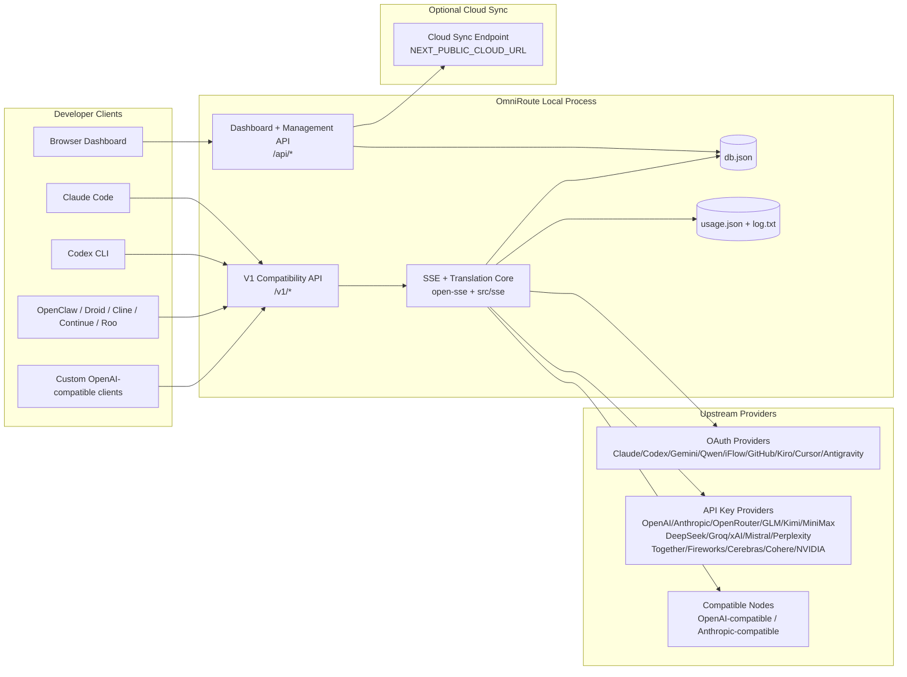
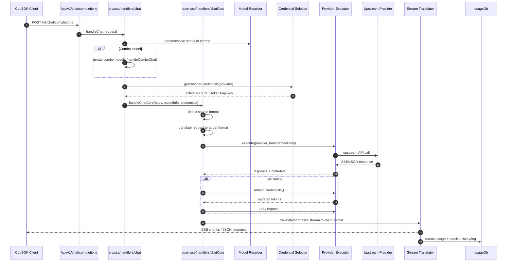
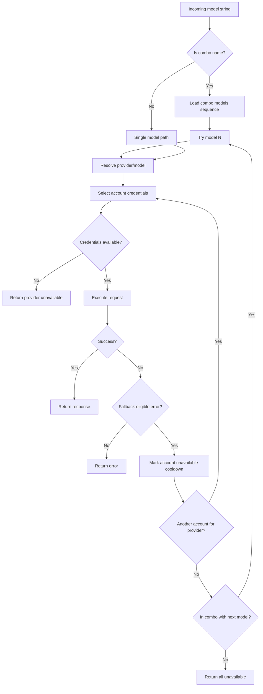
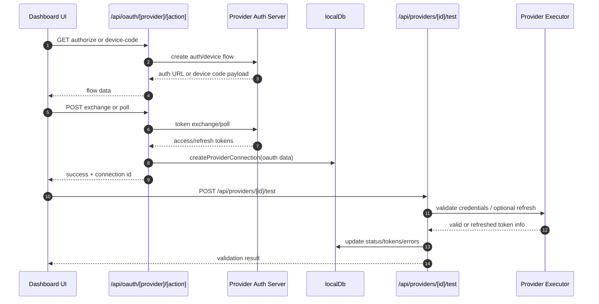
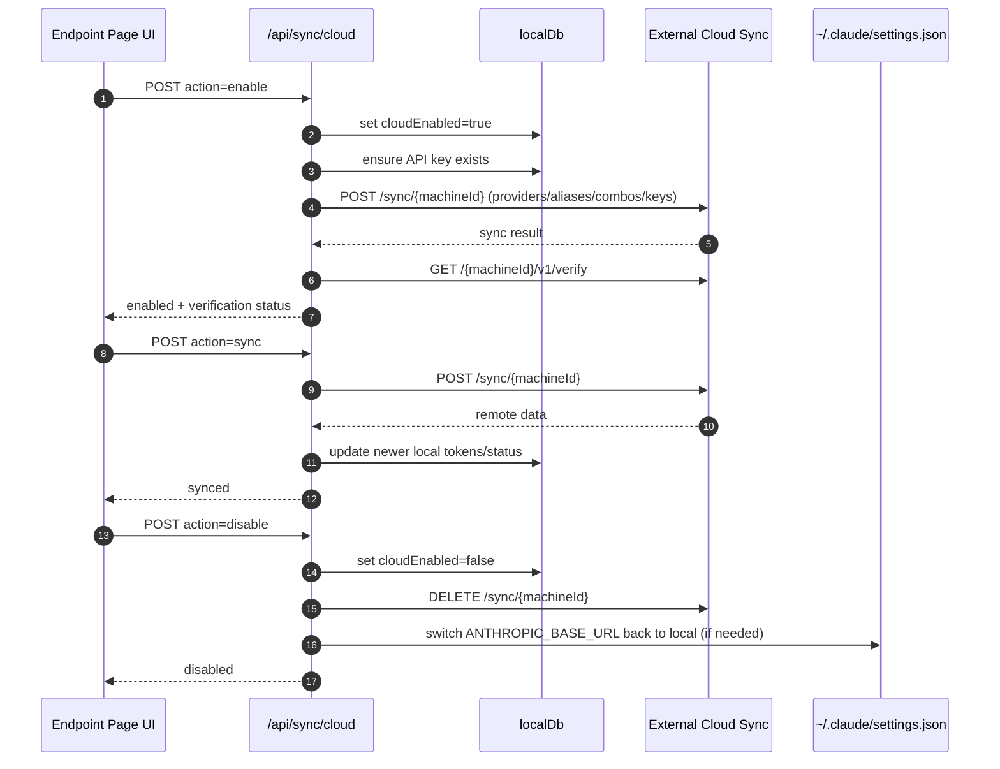
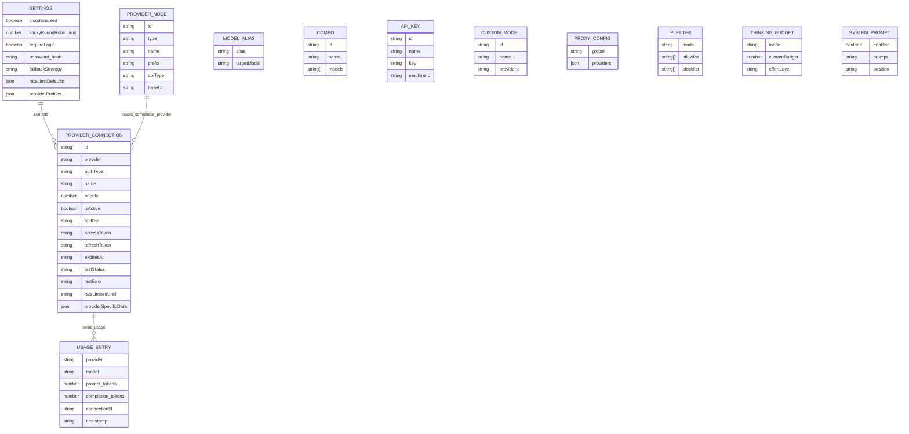
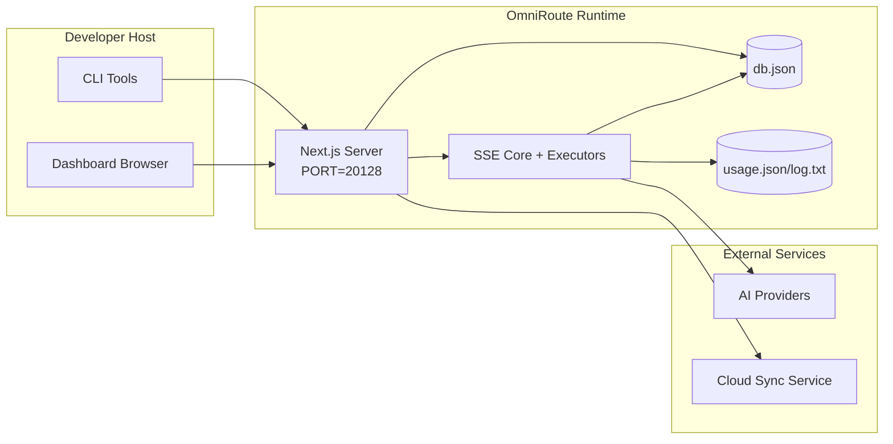

# OmniRoute-Architektur

🌐 **Languages:** 🇺🇸 [English](../../ARCHITECTURE.md) | 🇧🇷 [Português (Brasil)](../pt-BR/ARCHITECTURE.md) | 🇪🇸 [Español](../es/ARCHITECTURE.md) | 🇫🇷 [Français](../fr/ARCHITECTURE.md) | 🇮🇹 [Italiano](../it/ARCHITECTURE.md) | 🇷🇺 [Русский](../ru/ARCHITECTURE.md) | 🇨🇳 [中文 (简体)](../zh-CN/ARCHITECTURE.md) | 🇩🇪 [Deutsch](../de/ARCHITECTURE.md) | 🇮🇳 [हिन्दी](../in/ARCHITECTURE.md) | 🇹🇭 [ไทย](../th/ARCHITECTURE.md) | 🇺🇦 [Українська](../uk-UA/ARCHITECTURE.md) | 🇸🇦 [العربية](../ar/ARCHITECTURE.md) | 🇯🇵 [日本語](../ja/ARCHITECTURE.md) | 🇻🇳 [Tiếng Việt](../vi/ARCHITECTURE.md) | 🇧🇬 [Български](../bg/ARCHITECTURE.md) | 🇩🇰 [Dansk](../da/ARCHITECTURE.md) | 🇫🇮 [Suomi](../fi/ARCHITECTURE.md) | 🇮🇱 [עברית](../he/ARCHITECTURE.md) | 🇭🇺 [Magyar](../hu/ARCHITECTURE.md) | 🇮🇩 [Bahasa Indonesia](../id/ARCHITECTURE.md) | 🇰🇷 [한국어](../ko/ARCHITECTURE.md) | 🇲🇾 [Bahasa Melayu](../ms/ARCHITECTURE.md) | 🇳🇱 [Nederlands](../nl/ARCHITECTURE.md) | 🇳🇴 [Norsk](../no/ARCHITECTURE.md) | 🇵🇹 [Português (Portugal)](../pt/ARCHITECTURE.md) | 🇷🇴 [Română](../ro/ARCHITECTURE.md) | 🇵🇱 [Polski](../pl/ARCHITECTURE.md) | 🇸🇰 [Slovenčina](../sk/ARCHITECTURE.md) | 🇸🇪 [Svenska](../sv/ARCHITECTURE.md) | 🇵🇭 [Filipino](../phi/ARCHITECTURE.md)

_Letzte Aktualisierung: 18.02.2026_

## Zusammenfassung

OmniRoute ist ein lokales KI-Routing-Gateway und Dashboard, das auf Next.js basiert.
Es bietet einen einzigen OpenAI-kompatiblen Endpunkt (`/v1/*`) und leitet den Datenverkehr über mehrere Upstream-Anbieter mit Übersetzung, Fallback, Token-Aktualisierung und Nutzungsverfolgung weiter.

Kernkompetenzen:

- OpenAI-kompatible API-Oberfläche für CLI/Tools (28 Anbieter)
- Anforderungs-/Antwortübersetzung über Anbieterformate hinweg
- Modell-Combo-Fallback (Multi-Modell-Sequenz)
- Fallback auf Kontoebene (mehrere Konten pro Anbieter)
- OAuth + API-Schlüssel-Provider-Verbindungsverwaltung
- Einbettungsgenerierung über `/v1/embeddings` (6 Anbieter, 9 Modelle)
- Bildgenerierung über `/v1/images/generations` (4 Anbieter, 9 Modelle)
- Denken Sie an Tag-Parsing (`<think>...</think>`) für Argumentationsmodelle
- Antwortbereinigung für strikte OpenAI SDK-Kompatibilität
- Rollennormalisierung (Entwickler→System, System→Benutzer) für anbieterübergreifende Kompatibilität
- Strukturierte Ausgabekonvertierung (json_schema → Gemini ResponseSchema)
- Lokale Persistenz für Anbieter, Schlüssel, Aliase, Kombinationen, Einstellungen, Preise
- Nutzungs-/Kostenverfolgung und Anforderungsprotokollierung
- Optionale Cloud-Synchronisierung für die Synchronisierung mehrerer Geräte/Status
- IP-Zulassungs-/Blockierungsliste für die API-Zugriffskontrolle
- Denken Sie an die Budgetverwaltung (Passthrough/Auto/Benutzerdefiniert/Adaptiv)
- Sofortige Injektion des globalen Systems
- Sitzungsverfolgung und Fingerabdruck
- Erweiterte Ratenbegrenzung pro Konto mit anbieterspezifischen Profilen
- Leistungsschaltermuster für die Ausfallsicherheit des Anbieters
- Donnernder Herdenschutz mit Mutex-Sperre
  – Signaturbasierter Anforderungsdeduplizierungs-Cache
- Domänenschicht: Modellverfügbarkeit, Kostenregeln, Fallback-Richtlinie, Sperrrichtlinie
- Persistenz des Domänenstatus (SQLite-Durchschreibcache für Fallbacks, Budgets, Sperrungen, Leistungsschalter)
- Richtlinien-Engine für zentralisierte Anfrageauswertung (Sperrung → Budget → Fallback)
- Fordern Sie Telemetrie mit p50/p95/p99-Latenzaggregation an
- Korrelations-ID (X-Request-Id) für eine durchgängige Nachverfolgung
- Compliance-Audit-Protokollierung mit Opt-out pro API-Schlüssel
- Evaluierungsrahmen für die LLM-Qualitätssicherung
- Resilience-UI-Dashboard mit Echtzeit-Leistungsschalterstatus
- Modulare OAuth-Anbieter (12 einzelne Module unter `src/lib/oauth/providers/`)

Primäres Laufzeitmodell:

– Next.js-App-Routen unter `src/app/api/*` implementieren sowohl Dashboard-APIs als auch Kompatibilitäts-APIs
– Ein gemeinsam genutzter SSE/Routing-Kern in `src/sse/*` + `open-sse/*` kümmert sich um die Ausführung, Übersetzung, Streaming, Fallback und Nutzung des Anbieters

## Umfang und Grenzen

### Im Geltungsbereich

- Lokale Gateway-Laufzeit
- Dashboard-Verwaltungs-APIs
- Anbieterauthentifizierung und Token-Aktualisierung
- Fordern Sie Übersetzung und SSE-Streaming an
- Lokaler Status + Nutzungspersistenz
- Optionale Orchestrierung der Cloud-Synchronisierung

### Außerhalb des Gültigkeitsbereichs

- Cloud-Service-Implementierung hinter `NEXT_PUBLIC_CLOUD_URL`
- Anbieter-SLA/Kontrollebene außerhalb des lokalen Prozesses
- Externe CLI-Binärdateien selbst (Claude CLI, Codex CLI usw.)

## Systemkontext auf hoher Ebene



## Kernlaufzeitkomponenten

## 1) API und Routing-Ebene (Next.js App Routes)

Hauptverzeichnisse:

- `src/app/api/v1/*` und `src/app/api/v1beta/*` für Kompatibilitäts-APIs
  – `src/app/api/*` für Verwaltungs-/Konfigurations-APIs
- Nächste Umschreibungen in `next.config.mjs` ordnen `/v1/*` zu `/api/v1/*` zu

Wichtige Kompatibilitätsrouten:

- `src/app/api/v1/chat/completions/route.ts`
- `src/app/api/v1/messages/route.ts`
- `src/app/api/v1/responses/route.ts`
- `src/app/api/v1/models/route.ts` – enthält benutzerdefinierte Modelle mit `custom: true`
- `src/app/api/v1/embeddings/route.ts` – Einbettungsgenerierung (6 Anbieter)
- `src/app/api/v1/images/generations/route.ts` — Bildgenerierung (4+ Anbieter inkl. Antigravity/Nebius)
- `src/app/api/v1/messages/count_tokens/route.ts`
- `src/app/api/v1/providers/[provider]/chat/completions/route.ts` – dedizierter Chat pro Anbieter
- `src/app/api/v1/providers/[provider]/embeddings/route.ts` – dedizierte Einbettungen pro Anbieter
- `src/app/api/v1/providers/[provider]/images/generations/route.ts` – dedizierte Bilder pro Anbieter
- `src/app/api/v1beta/models/route.ts`
- `src/app/api/v1beta/models/[...path]/route.ts`

Verwaltungsdomänen:

- Authentifizierung/Einstellungen: `src/app/api/auth/*`, `src/app/api/settings/*`
- Anbieter/Verbindungen: `src/app/api/providers*`
- Anbieterknoten: `src/app/api/provider-nodes*`
- Benutzerdefinierte Modelle: `src/app/api/provider-models` (GET/POST/DELETE)
- Modellkatalog: `src/app/api/models/catalog` (GET)
- Proxy-Konfiguration: `src/app/api/settings/proxy` (GET/PUT/DELETE) + `src/app/api/settings/proxy/test` (POST)
- OAuth: `src/app/api/oauth/*`
- Schlüssel/Aliase/Kombinationen/Preise: `src/app/api/keys*`, `src/app/api/models/alias`, `src/app/api/combos*`, `src/app/api/pricing`
- Verwendung: `src/app/api/usage/*`
- Synchronisierung/Cloud: `src/app/api/sync/*`, `src/app/api/cloud/*`
- CLI-Tool-Helfer: `src/app/api/cli-tools/*`
- IP-Filter: `src/app/api/settings/ip-filter` (GET/PUT)
- Denkbudget: `src/app/api/settings/thinking-budget` (GET/PUT)
- Systemaufforderung: `src/app/api/settings/system-prompt` (GET/PUT)
- Sitzungen: `src/app/api/sessions` (GET)
- Ratenlimits: `src/app/api/rate-limits` (GET)
  – Belastbarkeit: `src/app/api/resilience` (GET/PATCH) – Anbieterprofile, Leistungsschalter, Ratengrenzzustand
- Resilienz-Reset: `src/app/api/resilience/reset` (POST) – Breaker + Abklingzeiten zurücksetzen
- Cache-Statistiken: `src/app/api/cache/stats` (GET/DELETE)
- Modellverfügbarkeit: `src/app/api/models/availability` (GET/POST)
- Telemetrie: `src/app/api/telemetry/summary` (GET)
- Budget: `src/app/api/usage/budget` (GET/POST)
- Fallback-Ketten: `src/app/api/fallback/chains` (GET/POST/DELETE)
- Compliance-Audit: `src/app/api/compliance/audit-log` (GET)
- Auswertungen: `src/app/api/evals` (GET/POST), `src/app/api/evals/[suiteId]` (GET)
- Richtlinien: `src/app/api/policies` (GET/POST)

## 2) SSE + Übersetzungskern

Hauptflussmodule:

- Eintrag: `src/sse/handlers/chat.ts`
- Kernorchestrierung: `open-sse/handlers/chatCore.ts`
  – Anbieterausführungsadapter: `open-sse/executors/*`
  – Formaterkennung/Anbieterkonfiguration: `open-sse/services/provider.ts`
- Modellanalyse/-auflösung: `src/sse/services/model.ts`, `open-sse/services/model.ts`
- Konto-Fallback-Logik: `open-sse/services/accountFallback.ts`
- Übersetzungsregister: `open-sse/translator/index.ts`
- Stream-Transformationen: `open-sse/utils/stream.ts`, `open-sse/utils/streamHandler.ts`
  – Extraktion/Normalisierung der Nutzung: `open-sse/utils/usageTracking.ts`
- Think-Tag-Parser: `open-sse/utils/thinkTagParser.ts`
- Einbettungshandler: `open-sse/handlers/embeddings.ts`
- Anbieterregistrierung einbetten: `open-sse/config/embeddingRegistry.ts`
- Handler für die Bildgenerierung: `open-sse/handlers/imageGeneration.ts`
- Bildanbieter-Registrierung: `open-sse/config/imageRegistry.ts`
  – Antwortbereinigung: `open-sse/handlers/responseSanitizer.ts`
- Rollennormalisierung: `open-sse/services/roleNormalizer.ts`

Dienste (Geschäftslogik):

- Kontoauswahl/-bewertung: `open-sse/services/accountSelector.ts`
- Kontextlebenszyklusverwaltung: `open-sse/services/contextManager.ts`
- Durchsetzung des IP-Filters: `open-sse/services/ipFilter.ts`
- Sitzungsverfolgung: `open-sse/services/sessionManager.ts`
  – Deduplizierung anfordern: `open-sse/services/signatureCache.ts`
- Eingabeaufforderung des Systems: `open-sse/services/systemPrompt.ts`
- Denkendes Budgetmanagement: `open-sse/services/thinkingBudget.ts`
- Wildcard-Modell-Routing: `open-sse/services/wildcardRouter.ts`
- Ratenlimitverwaltung: `open-sse/services/rateLimitManager.ts`
- Leistungsschalter: `open-sse/services/circuitBreaker.ts`

Module der Domänenschicht:

- Modellverfügbarkeit: `src/lib/domain/modelAvailability.ts`
- Kostenregeln/Budgets: `src/lib/domain/costRules.ts`
- Fallback-Richtlinie: `src/lib/domain/fallbackPolicy.ts`
- Combo-Resolver: `src/lib/domain/comboResolver.ts`
- Sperrrichtlinie: `src/lib/domain/lockoutPolicy.ts`
  – Richtlinien-Engine: `src/domain/policyEngine.ts` – zentralisierte Sperrung → Budget → Fallback-Bewertung
- Fehlercodekatalog: `src/lib/domain/errorCodes.ts`
- Anforderungs-ID: `src/lib/domain/requestId.ts`
  – Abrufzeitüberschreitung: `src/lib/domain/fetchTimeout.ts`
- Telemetrie anfordern: `src/lib/domain/requestTelemetry.ts`
- Compliance/Audit: `src/lib/domain/compliance/index.ts`
  – Evaluierungsläufer: `src/lib/domain/evalRunner.ts`
  – Domänenstatus-Persistenz: `src/lib/db/domainState.ts` – SQLite CRUD für Fallback-Ketten, Budgets, Kostenverlauf, Sperrstatus, Leistungsschalter

OAuth-Provider-Module (12 einzelne Dateien unter `src/lib/oauth/providers/`):

- Registrierungsindex: `src/lib/oauth/providers/index.ts`
- Einzelne Anbieter: `claude.ts`, `codex.ts`, `gemini.ts`, `antigravity.ts`, `iflow.ts`, `qwen.ts`, `kimi-coding.ts`, `github.ts`, `kiro.ts`, `cursor.ts`, `kilocode.ts`, `cline.ts`
  – Thin Wrapper: `src/lib/oauth/providers.ts` – Re-Exporte aus einzelnen Modulen

## 3) Persistenzschicht

Primärer Zustands-DB:

- `src/lib/localDb.ts`
- Datei: `${DATA_DIR}/db.json` (oder `$XDG_CONFIG_HOME/omniroute/db.json`, wenn festgelegt, sonst `~/.omniroute/db.json`)
- Entitäten: ProviderConnections, ProviderNodes, ModelAliases, Combos, APIKeys, Einstellungen, Preise, **customModels**, **proxyConfig**, **ipFilter**, **thinkingBudget**, **systemPrompt**

Nutzungs-DB:

- `src/lib/usageDb.ts`
- Dateien: `${DATA_DIR}/usage.json`, `${DATA_DIR}/log.txt`, `${DATA_DIR}/call_logs/`
  – Folgt derselben Basisverzeichnisrichtlinie wie `localDb` (`DATA_DIR`, dann `XDG_CONFIG_HOME/omniroute`, wenn festgelegt)
- zerlegt in fokussierte Untermodule: `migrations.ts`, `usageHistory.ts`, `costCalculator.ts`, `usageStats.ts`, `callLogs.ts`

Domain State DB (SQLite):

– `src/lib/db/domainState.ts` – CRUD-Operationen für den Domänenstatus

- Tabellen (erstellt in `src/lib/db/core.ts`): `domain_fallback_chains`, `domain_budgets`, `domain_cost_history`, `domain_lockout_state`, `domain_circuit_breakers`
- Write-Through-Cache-Muster: In-Memory-Maps sind zur Laufzeit maßgeblich; Mutationen werden synchron zu SQLite geschrieben; Der Status wird beim Kaltstart aus der DB wiederhergestellt

## 4) Authentifizierung + Sicherheitsoberflächen

- Dashboard-Cookie-Authentifizierung: `src/proxy.ts`, `src/app/api/auth/login/route.ts`
- API-Schlüsselgenerierung/-überprüfung: `src/shared/utils/apiKey.ts`
  – Provider-Geheimnisse blieben in `providerConnections`-Einträgen bestehen
- Unterstützung für ausgehende Proxys über `open-sse/utils/proxyFetch.ts` (Env-Variablen) und `open-sse/utils/networkProxy.ts` (pro Anbieter oder global konfigurierbar)

## 5) Cloud-Synchronisierung

- Scheduler-Init: `src/lib/initCloudSync.ts`, `src/shared/services/initializeCloudSync.ts`
- Periodische Aufgabe: `src/shared/services/cloudSyncScheduler.ts`
- Kontrollroute: `src/app/api/sync/cloud/route.ts`

## Anforderungslebenszyklus (`/v1/chat/completions`)



## Combo + Konto-Fallback-Flow



Fallback-Entscheidungen werden von `open-sse/services/accountFallback.ts` mithilfe von Statuscodes und Fehlermeldungsheuristiken gesteuert.

## OAuth-Onboarding und Token-Aktualisierungslebenszyklus



Die Aktualisierung während des Live-Verkehrs wird in `open-sse/handlers/chatCore.ts` über den Executor `refreshCredentials()` ausgeführt.

## Cloud-Sync-Lebenszyklus (Aktivieren/Synchronisieren/Deaktivieren)



Die regelmäßige Synchronisierung wird durch `CloudSyncScheduler` ausgelöst, wenn die Cloud aktiviert ist.

## Datenmodell und Speicherzuordnung



Physische Speicherdateien:

- Hauptstatus: `${DATA_DIR}/db.json` (oder `$XDG_CONFIG_HOME/omniroute/db.json`, wenn festgelegt, sonst `~/.omniroute/db.json`)
- Nutzungsstatistiken: `${DATA_DIR}/usage.json`
- Protokollzeilen anfordern: `${DATA_DIR}/log.txt`
- optionale Übersetzer-/Anfrage-Debug-Sitzungen: `<repo>/logs/...`

## Bereitstellungstopologie



## Modulzuordnung (entscheidungskritisch)

### Routen- und API-Module

- `src/app/api/v1/*`, `src/app/api/v1beta/*`: Kompatibilitäts-APIs
- `src/app/api/v1/providers/[provider]/*`: dedizierte Routen pro Anbieter (Chat, Einbettungen, Bilder)
- `src/app/api/providers*`: Anbieter CRUD, Validierung, Tests
- `src/app/api/provider-nodes*`: Benutzerdefinierte kompatible Knotenverwaltung
- `src/app/api/provider-models`: benutzerdefinierte Modellverwaltung (CRUD)
- `src/app/api/models/catalog`: vollständige Modellkatalog-API (alle Typen nach Anbieter gruppiert)
  – `src/app/api/oauth/*`: OAuth/Gerätecodeflüsse
- `src/app/api/keys*`: Lebenszyklus des lokalen API-Schlüssels
- `src/app/api/models/alias`: Alias-Verwaltung
- `src/app/api/combos*`: Fallback-Kombinationsverwaltung
- `src/app/api/pricing`: Preisüberschreibungen für die Kostenberechnung
- `src/app/api/settings/proxy`: Proxy-Konfiguration (GET/PUT/DELETE)
- `src/app/api/settings/proxy/test`: Test der ausgehenden Proxy-Konnektivität (POST)
- `src/app/api/usage/*`: Nutzungs- und Protokoll-APIs
- `src/app/api/sync/*` + `src/app/api/cloud/*`: Cloud-Synchronisierung und Cloud-orientierte Helfer
- `src/app/api/cli-tools/*`: lokale CLI-Konfigurationsschreiber/-prüfer
- `src/app/api/settings/ip-filter`: IP-Zulassungsliste/Blockliste (GET/PUT)
- `src/app/api/settings/thinking-budget`: Denk-Token-Budget-Konfiguration (GET/PUT)
- `src/app/api/settings/system-prompt`: globale Systemeingabeaufforderung (GET/PUT)
- `src/app/api/sessions`: aktive Sitzungsliste (GET)
- `src/app/api/rate-limits`: Status des Ratenlimits pro Konto (GET)

### Routing- und Ausführungskern

- `src/sse/handlers/chat.ts`: Anforderungsanalyse, Kombinationsbehandlung, Kontoauswahlschleife
- `open-sse/handlers/chatCore.ts`: Übersetzung, Executor-Versand, Wiederholungs-/Aktualisierungsbehandlung, Stream-Setup
- `open-sse/executors/*`: anbieterspezifisches Netzwerk- und Formatverhalten

### Übersetzungsregister und Formatkonverter

- `open-sse/translator/index.ts`: Übersetzerregistrierung und Orchestrierung
- Übersetzer anfordern: `open-sse/translator/request/*`
- Antwortübersetzer: `open-sse/translator/response/*`
- Formatkonstanten: `open-sse/translator/formats.ts`

### Beharrlichkeit

- `src/lib/localDb.ts`: persistente Konfiguration/Status
- `src/lib/usageDb.ts`: Nutzungsverlauf und fortlaufende Anforderungsprotokolle

## Provider Executor Coverage (Strategiemuster)

Jeder Anbieter verfügt über einen speziellen Executor, der `BaseExecutor` (in `open-sse/executors/base.ts`) erweitert und URL-Erstellung, Header-Konstruktion, Wiederholungsversuche mit exponentiellem Backoff, Hooks für die Aktualisierung von Anmeldeinformationen und die Orchestrierungsmethode `execute()` bereitstellt.

| Testamentsvollstrecker | Anbieter(n)                                                                                                                                                  | Besondere Handhabung                                                          |
| ---------------------- | ------------------------------------------------------------------------------------------------------------------------------------------------------------ | ----------------------------------------------------------------------------- |
| `DefaultExecutor`      | OpenAI, Claude, Gemini, Qwen, iFlow, OpenRouter, GLM, Kimi, MiniMax, DeepSeek, Groq, xAI, Mistral, Perplexity, Together, Fireworks, Cerebras, Cohere, NVIDIA | Dynamische URL-/Header-Konfiguration pro Anbieter                             |
| `AntigravityExecutor`  | Google Antigravitation                                                                                                                                       | Benutzerdefinierte Projekt-/Sitzungs-IDs, Wiederholen nach dem Parsen         |
| `CodexExecutor`        | OpenAI-Codex                                                                                                                                                 | Fügt Systemanweisungen ein und erzwingt den Denkaufwand                       |
| `CursorExecutor`       | Cursor-IDE                                                                                                                                                   | ConnectRPC-Protokoll, Protobuf-Kodierung, Anforderungssignatur über Prüfsumme |
| `GithubExecutor`       | GitHub-Copilot                                                                                                                                               | Copilot-Token-Aktualisierung, VSCode-imitierende Header                       |
| `KiroExecutor`         | AWS CodeWhisperer/Kiro                                                                                                                                       | AWS EventStream-Binärformat → SSE-Konvertierung                               |
| `GeminiCLIExecutor`    | Gemini CLI                                                                                                                                                   | Aktualisierungszyklus des Google OAuth-Tokens                                 |

Alle anderen Anbieter (einschließlich benutzerdefinierter kompatibler Knoten) verwenden `DefaultExecutor`.

## Anbieterkompatibilitätsmatrix

| Anbieter         | Formatieren      | Authentifizierung            | Stream           | Nicht-Stream | Token-Aktualisierung | Nutzungs-API                   |
| ---------------- | ---------------- | ---------------------------- | ---------------- | ------------ | -------------------- | ------------------------------ |
| Claude           | Claude           | API-Schlüssel / OAuth        | ✅               | ✅           | ✅                   | ⚠️ Nur Administrator           |
| Zwillinge        | Zwillinge        | API-Schlüssel / OAuth        | ✅               | ✅           | ✅                   | ⚠️ Cloud-Konsole               |
| Gemini CLI       | gemini-cli       | OAuth                        | ✅               | ✅           | ✅                   | ⚠️ Cloud-Konsole               |
| Antigravitation  | Antigravitation  | OAuth                        | ✅               | ✅           | ✅                   | ✅ Vollständige Kontingent-API |
| OpenAI           | openai           | API-Schlüssel                | ✅               | ✅           | ❌                   | ❌                             |
| Kodex            | Openai-Antworten | OAuth                        | ✅ gezwungen     | ❌           | ✅                   | ✅ Tariflimits                 |
| GitHub-Copilot   | openai           | OAuth + Copilot-Token        | ✅               | ✅           | ✅                   | ✅ Kontingent-Snapshots        |
| Cursor           | Cursor           | Benutzerdefinierte Prüfsumme | ✅               | ✅           | ❌                   | ❌                             |
| Kiro             | kiro             | AWS SSO OIDC                 | ✅ (EventStream) | ❌           | ✅                   | ✅ Nutzungsbeschränkungen      |
| Qwen             | openai           | OAuth                        | ✅               | ✅           | ✅                   | ⚠️ Auf Anfrage                 |
| iFlow            | openai           | OAuth (Basic)                | ✅               | ✅           | ✅                   | ⚠️ Auf Anfrage                 |
| OpenRouter       | openai           | API-Schlüssel                | ✅               | ✅           | ❌                   | ❌                             |
| GLM/Kimi/MiniMax | Claude           | API-Schlüssel                | ✅               | ✅           | ❌                   | ❌                             |
| DeepSeek         | openai           | API-Schlüssel                | ✅               | ✅           | ❌                   | ❌                             |
| Groq             | openai           | API-Schlüssel                | ✅               | ✅           | ❌                   | ❌                             |
| xAI (Grok)       | openai           | API-Schlüssel                | ✅               | ✅           | ❌                   | ❌                             |
| Mistral          | openai           | API-Schlüssel                | ✅               | ✅           | ❌                   | ❌                             |
| Ratlosigkeit     | openai           | API-Schlüssel                | ✅               | ✅           | ❌                   | ❌                             |
| Zusammen KI      | openai           | API-Schlüssel                | ✅               | ✅           | ❌                   | ❌                             |
| Feuerwerk KI     | openai           | API-Schlüssel                | ✅               | ✅           | ❌                   | ❌                             |
| Großhirn         | openai           | API-Schlüssel                | ✅               | ✅           | ❌                   | ❌                             |
| Kohärent         | openai           | API-Schlüssel                | ✅               | ✅           | ❌                   | ❌                             |
| NVIDIA NIM       | openai           | API-Schlüssel                | ✅               | ✅           | ❌                   | ❌                             |

## Übersetzungsabdeckung im Format

Zu den erkannten Quellformaten gehören:

- `openai`
- `openai-responses`
- `claude`
- `gemini`

Zu den Zielformaten gehören:

- OpenAI-Chat/Antworten
- Claude
- Gemini/Gemini-CLI/Antigravity-Umschlag
- Kiro
- Cursor

Übersetzungen verwenden **OpenAI als Hub-Format** – alle Konvertierungen durchlaufen OpenAI als Zwischenformat:

```
Source Format → OpenAI (hub) → Target Format
```

Übersetzungen werden dynamisch basierend auf der Form der Quellnutzlast und dem Zielformat des Anbieters ausgewählt.

Zusätzliche Verarbeitungsebenen in der Übersetzungspipeline:

- **Antwortbereinigung** – Entfernt nicht standardmäßige Felder aus Antworten im OpenAI-Format (sowohl Streaming als auch Nicht-Streaming), um eine strikte SDK-Konformität sicherzustellen
- **Rollennormalisierung** – Konvertiert `developer` → `system` für Nicht-OpenAI-Ziele; führt `system` → `user` für Modelle zusammen, die die Systemrolle ablehnen (GLM, ERNIE)
- **Think-Tag-Extraktion** – Analysiert `<think>...</think>`-Blöcke aus dem Inhalt in das Feld `reasoning_content`
- **Strukturierte Ausgabe** – Konvertiert OpenAI `response_format.json_schema` in Geminis `responseMimeType` + `responseSchema`

## Unterstützte API-Endpunkte

| Endpunkt                                           | Formatieren                | Handler                                                           |
| -------------------------------------------------- | -------------------------- | ----------------------------------------------------------------- |
| `POST /v1/chat/completions`                        | OpenAI-Chat                | `src/sse/handlers/chat.ts`                                        |
| `POST /v1/messages`                                | Claude-Nachrichten         | Gleicher Handler (automatisch erkannt)                            |
| `POST /v1/responses`                               | OpenAI-Antworten           | `open-sse/handlers/responsesHandler.ts`                           |
| `POST /v1/embeddings`                              | OpenAI-Einbettungen        | `open-sse/handlers/embeddings.ts`                                 |
| `GET /v1/embeddings`                               | Modellliste                | API-Route                                                         |
| `POST /v1/images/generations`                      | OpenAI-Bilder              | `open-sse/handlers/imageGeneration.ts`                            |
| `GET /v1/images/generations`                       | Modellliste                | API-Route                                                         |
| `POST /v1/providers/{provider}/chat/completions`   | OpenAI-Chat                | Dedizierter pro Anbieter mit Modellvalidierung                    |
| `POST /v1/providers/{provider}/embeddings`         | OpenAI-Einbettungen        | Dedizierter pro Anbieter mit Modellvalidierung                    |
| `POST /v1/providers/{provider}/images/generations` | OpenAI-Bilder              | Dedizierter pro Anbieter mit Modellvalidierung                    |
| `POST /v1/messages/count_tokens`                   | Claude Token Count         | API-Route                                                         |
| `GET /v1/models`                                   | Liste der OpenAI-Modelle   | API-Route (Chat + Einbettung + Bild + benutzerdefinierte Modelle) |
| `GET /api/models/catalog`                          | Katalog                    | Alle Modelle gruppiert nach Anbieter + Typ                        |
| `POST /v1beta/models/*:streamGenerateContent`      | Zwillinge heimisch         | API-Route                                                         |
| `GET/PUT/DELETE /api/settings/proxy`               | Proxy-Konfiguration        | Netzwerk-Proxy-Konfiguration                                      |
| `POST /api/settings/proxy/test`                    | Proxy-Konnektivität        | Proxy-Zustands-/Konnektivitätstest-Endpunkt                       |
| `GET/POST/DELETE /api/provider-models`             | Benutzerdefinierte Modelle | Benutzerdefinierte Modellverwaltung pro Anbieter                  |

## Bypass-Handler

Der Bypass-Handler (`open-sse/utils/bypassHandler.ts`) fängt bekannte „Wegwerf“-Anfragen von Claude CLI ab – Warmup-Pings, Titelextraktionen und Token-Zählungen – und gibt eine **falsche Antwort** zurück, ohne Upstream-Provider-Tokens zu verbrauchen. Dies wird nur ausgelöst, wenn `User-Agent` `claude-cli` enthält.

## Logger-Pipeline anfordern

Der Anforderungslogger (`open-sse/utils/requestLogger.ts`) stellt eine 7-stufige Debug-Protokollierungspipeline bereit, die standardmäßig deaktiviert und über `ENABLE_REQUEST_LOGS=true` aktiviert ist:

```
1_req_client.json → 2_req_source.json → 3_req_openai.json → 4_req_target.json
→ 5_res_provider.txt → 6_res_openai.txt → 7_res_client.txt
```

Dateien werden für jede Anforderungssitzung in `<repo>/logs/<session>/` geschrieben.

## Fehlermodi und Belastbarkeit

## 1) Konto-/Anbieterverfügbarkeit

- Abklingzeit des Anbieterkontos bei vorübergehenden/Raten-/Authentifizierungsfehlern
- Konto-Fallback vor fehlgeschlagener Anfrage
- Combo-Modell-Fallback, wenn der aktuelle Modell-/Anbieterpfad erschöpft ist

## 2) Token-Ablauf

- Vorabprüfung und Aktualisierung mit erneutem Versuch für aktualisierbare Anbieter
  – 401/403-Wiederholungsversuch nach Aktualisierungsversuch im Kernpfad

## 3) Stream-Sicherheit

- Trennungsfähiger Stream-Controller
  – Übersetzungsstream mit End-of-Stream-Flush und `[DONE]`-Behandlung
- Fallback der Nutzungsschätzung, wenn Metadaten zur Anbieternutzung fehlen

## 4) Verschlechterung der Cloud-Synchronisierung

– Synchronisierungsfehler werden angezeigt, die lokale Laufzeit wird jedoch fortgesetzt
– Der Scheduler verfügt über eine wiederholfähige Logik, aber die regelmäßige Ausführung ruft derzeit standardmäßig eine Einzelversuchssynchronisierung auf

## 5) Datenintegrität

- DB-Shape-Migration/Reparatur für fehlende Schlüssel
- Schutzmaßnahmen zum Zurücksetzen beschädigter JSON-Dateien für localDb und useDb

## Beobachtbarkeit und Betriebssignale

Quellen für die Laufzeitsichtbarkeit:

– Konsolenprotokolle von `src/sse/utils/logger.ts`
– Nutzungsaggregate pro Anfrage in `usage.json`

- Statusprotokoll der Textanfrage in `log.txt`
  – optionale Protokolle für tiefe Anfragen/Übersetzungen unter `logs/`, wenn `ENABLE_REQUEST_LOGS=true`
  – Dashboard-Nutzungsendpunkte (`/api/usage/*`) für die UI-Nutzung

## Sicherheitsrelevante Grenzen

– JWT-Geheimnis (`JWT_SECRET`) sichert die Überprüfung/Signierung von Dashboard-Sitzungscookies
– Der anfängliche Passwort-Fallback (`INITIAL_PASSWORD`, Standard `123456`) muss in echten Bereitstellungen überschrieben werden
– Das HMAC-Geheimnis des API-Schlüssels (`API_KEY_SECRET`) sichert das generierte lokale API-Schlüsselformat
– Anbietergeheimnisse (API-Schlüssel/Tokens) werden in der lokalen Datenbank gespeichert und sollten auf Dateisystemebene geschützt werden
– Cloud-Synchronisierungsendpunkte basieren auf der API-Schlüsselauthentifizierung und der Maschinen-ID-Semantik

## Umgebungs- und Laufzeitmatrix

Vom Code aktiv verwendete Umgebungsvariablen:

- App/Authentifizierung: `JWT_SECRET`, `INITIAL_PASSWORD`
- Speicher: `DATA_DIR`
- Kompatibles Knotenverhalten: `ALLOW_MULTI_CONNECTIONS_PER_COMPAT_NODE`
  – Optionale Speicherbasisüberschreibung (Linux/macOS, wenn `DATA_DIR` nicht gesetzt ist): `XDG_CONFIG_HOME`
- Sicherheits-Hashing: `API_KEY_SECRET`, `MACHINE_ID_SALT`
- Protokollierung: `ENABLE_REQUEST_LOGS`
- Synchronisierung/Cloud-URLing: `NEXT_PUBLIC_BASE_URL`, `NEXT_PUBLIC_CLOUD_URL`
- Ausgehender Proxy: `HTTP_PROXY`, `HTTPS_PROXY`, `ALL_PROXY`, `NO_PROXY` und Varianten in Kleinbuchstaben
- SOCKS5-Funktionsflags: `ENABLE_SOCKS5_PROXY`, `NEXT_PUBLIC_ENABLE_SOCKS5_PROXY`
- Plattform-/Laufzeithelfer (keine App-spezifische Konfiguration): `APPDATA`, `NODE_ENV`, `PORT`, `HOSTNAME`

## Bekannte architektonische Hinweise

1. `usageDb` und `localDb` verwenden jetzt dieselbe Basisverzeichnisrichtlinie (`DATA_DIR` -> `XDG_CONFIG_HOME/omniroute` -> `~/.omniroute`) mit der Migration älterer Dateien.
2. `/api/v1/route.ts` gibt eine statische Modellliste zurück und ist nicht die Hauptmodellquelle, die von `/v1/models` verwendet wird.
3. Der Anforderungslogger schreibt bei Aktivierung vollständige Header/Textkörper. Behandeln Sie das Protokollverzeichnis als vertraulich.
4. Das Cloud-Verhalten hängt vom korrekten `NEXT_PUBLIC_BASE_URL` und der Erreichbarkeit des Cloud-Endpunkts ab.
5. Das Verzeichnis `open-sse/` wird als `@omniroute/open-sse` **npm-Arbeitsbereichspaket** veröffentlicht. Der Quellcode importiert es über `@omniroute/open-sse/...` (aufgelöst durch Next.js `transpilePackages`). Dateipfade in diesem Dokument verwenden aus Konsistenzgründen weiterhin den Verzeichnisnamen `open-sse/`.
6. Diagramme im Dashboard verwenden **Recharts** (SVG-basiert) für zugängliche, interaktive Analysevisualisierungen (Modellnutzungs-Balkendiagramme, Anbieteraufschlüsselungstabellen mit Erfolgsquoten).
7. E2E-Tests verwenden **Playwright** (`tests/e2e/`) und werden über `npm run test:e2e` ausgeführt. Unit-Tests verwenden **Node.js Test Runner** (`tests/unit/`) und werden über `npm run test:plan3` ausgeführt. Der Quellcode unter `src/` ist **TypeScript** (`.ts`/`.tsx`); Der Arbeitsbereich `open-sse/` bleibt JavaScript (`.js`).
8. Die Einstellungsseite ist in 5 Registerkarten unterteilt: Sicherheit, Routing (6 globale Strategien: Fill-First, Round-Robin, P2C, Random, Least-Used, Cost-Optimized), Resilience (bearbeitbare Ratenlimits, Leistungsschalter, Richtlinien), AI (Thinking Budget, System Prompt, Prompt Cache), Advanced (Proxy).

## Checkliste zur Betriebsüberprüfung

- Build aus Quelle: `npm run build`
- Docker-Image erstellen: `docker build -t omniroute .`
- Starten Sie den Dienst und überprüfen Sie:
- `GET /api/settings`
- `GET /api/v1/models`
  – Die Basis-URL des CLI-Ziels sollte `http://<host>:20128/v1` sein, wenn `PORT=20128`
