# omniroute – Codebase-Dokumentation

🌐 **Languages:** 🇺🇸 [English](../../CODEBASE_DOCUMENTATION.md) | 🇧🇷 [Português (Brasil)](../pt-BR/CODEBASE_DOCUMENTATION.md) | 🇪🇸 [Español](../es/CODEBASE_DOCUMENTATION.md) | 🇫🇷 [Français](../fr/CODEBASE_DOCUMENTATION.md) | 🇮🇹 [Italiano](../it/CODEBASE_DOCUMENTATION.md) | 🇷🇺 [Русский](../ru/CODEBASE_DOCUMENTATION.md) | 🇨🇳 [中文 (简体)](../zh-CN/CODEBASE_DOCUMENTATION.md) | 🇩🇪 [Deutsch](../de/CODEBASE_DOCUMENTATION.md) | 🇮🇳 [हिन्दी](../in/CODEBASE_DOCUMENTATION.md) | 🇹🇭 [ไทย](../th/CODEBASE_DOCUMENTATION.md) | 🇺🇦 [Українська](../uk-UA/CODEBASE_DOCUMENTATION.md) | 🇸🇦 [العربية](../ar/CODEBASE_DOCUMENTATION.md) | 🇯🇵 [日本語](../ja/CODEBASE_DOCUMENTATION.md) | 🇻🇳 [Tiếng Việt](../vi/CODEBASE_DOCUMENTATION.md) | 🇧🇬 [Български](../bg/CODEBASE_DOCUMENTATION.md) | 🇩🇰 [Dansk](../da/CODEBASE_DOCUMENTATION.md) | 🇫🇮 [Suomi](../fi/CODEBASE_DOCUMENTATION.md) | 🇮🇱 [עברית](../he/CODEBASE_DOCUMENTATION.md) | 🇭🇺 [Magyar](../hu/CODEBASE_DOCUMENTATION.md) | 🇮🇩 [Bahasa Indonesia](../id/CODEBASE_DOCUMENTATION.md) | 🇰🇷 [한국어](../ko/CODEBASE_DOCUMENTATION.md) | 🇲🇾 [Bahasa Melayu](../ms/CODEBASE_DOCUMENTATION.md) | 🇳🇱 [Nederlands](../nl/CODEBASE_DOCUMENTATION.md) | 🇳🇴 [Norsk](../no/CODEBASE_DOCUMENTATION.md) | 🇵🇹 [Português (Portugal)](../pt/CODEBASE_DOCUMENTATION.md) | 🇷🇴 [Română](../ro/CODEBASE_DOCUMENTATION.md) | 🇵🇱 [Polski](../pl/CODEBASE_DOCUMENTATION.md) | 🇸🇰 [Slovenčina](../sk/CODEBASE_DOCUMENTATION.md) | 🇸🇪 [Svenska](../sv/CODEBASE_DOCUMENTATION.md) | 🇵🇭 [Filipino](../phi/CODEBASE_DOCUMENTATION.md)

> Eine umfassende, einsteigerfreundliche Anleitung zum Multi-Provider-KI-Proxy-Router **omniroute**.

---

## 1. Was ist Omniroute?

Omniroute ist ein **Proxy-Router**, der zwischen KI-Clients (Claude CLI, Codex, Cursor IDE usw.) und KI-Anbietern (Anthropic, Google, OpenAI, AWS, GitHub usw.) sitzt. Es löst ein großes Problem:

> **Verschiedene KI-Clients sprechen unterschiedliche „Sprachen“ (API-Formate) und unterschiedliche KI-Anbieter erwarten auch unterschiedliche „Sprachen“.** Omniroute übersetzt automatisch zwischen ihnen.

Stellen Sie sich das wie einen Universalübersetzer bei den Vereinten Nationen vor: Jeder Delegierte kann jede Sprache sprechen, und der Übersetzer übersetzt sie für jeden anderen Delegierten.

---

## 2. Architekturübersicht

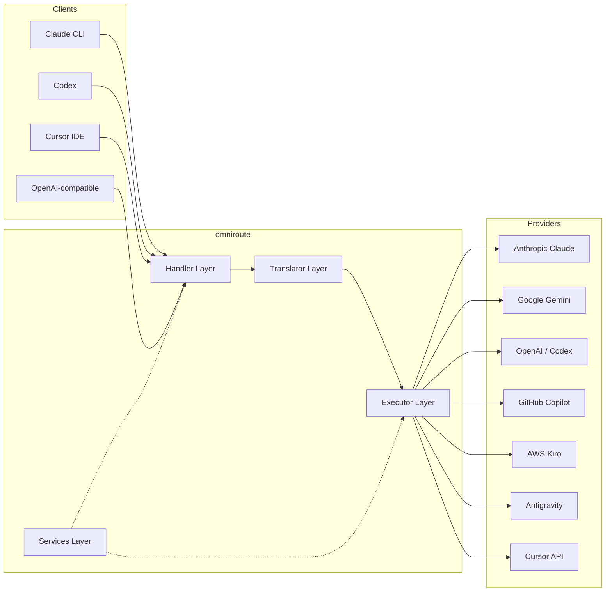

### Grundprinzip: Hub-and-Spoke-Übersetzung

Die gesamte Formatübersetzung erfolgt über das **OpenAI-Format als Hub**:

```
Client Format → [OpenAI Hub] → Provider Format    (request)
Provider Format → [OpenAI Hub] → Client Format    (response)
```

Das bedeutet, dass Sie nur **N Übersetzer** (einen pro Format) statt **N²** (jedes Paar) benötigen.

---

## 3. Projektstruktur

```
omniroute/
├── open-sse/                  ← Core proxy library (portable, framework-agnostic)
│   ├── index.js               ← Main entry point, exports everything
│   ├── config/                ← Configuration & constants
│   ├── executors/             ← Provider-specific request execution
│   ├── handlers/              ← Request handling orchestration
│   ├── services/              ← Business logic (auth, models, fallback, usage)
│   ├── translator/            ← Format translation engine
│   │   ├── request/           ← Request translators (8 files)
│   │   ├── response/          ← Response translators (7 files)
│   │   └── helpers/           ← Shared translation utilities (6 files)
│   └── utils/                 ← Utility functions
├── src/                       ← Application layer (Express/Worker runtime)
│   ├── app/                   ← Web UI, API routes, middleware
│   ├── lib/                   ← Database, auth, and shared library code
│   ├── mitm/                  ← Man-in-the-middle proxy utilities
│   ├── models/                ← Database models
│   ├── shared/                ← Shared utilities (wrappers around open-sse)
│   ├── sse/                   ← SSE endpoint handlers
│   └── store/                 ← State management
├── data/                      ← Runtime data (credentials, logs)
│   └── provider-credentials.json   (external credentials override, gitignored)
└── tester/                    ← Test utilities
```

---

## 4. Aufschlüsselung nach Modulen

### 4.1 Konfiguration (`open-sse/config/`)

Die **Single Source of Truth** für die gesamte Anbieterkonfiguration.

| Datei                         | Zweck                                                                                                                                                                                                                                                           |
| ----------------------------- | --------------------------------------------------------------------------------------------------------------------------------------------------------------------------------------------------------------------------------------------------------------- |
| `constants.ts`                | `PROVIDERS`-Objekt mit Basis-URLs, OAuth-Anmeldeinformationen (Standard), Headern und Standard-Systemaufforderungen für jeden Anbieter. Definiert außerdem `HTTP_STATUS`, `ERROR_TYPES`, `COOLDOWN_MS`, `BACKOFF_CONFIG` und `SKIP_PATTERNS`.                   |
| `credentialLoader.ts`         | Lädt externe Anmeldeinformationen von `data/provider-credentials.json` und führt sie über die fest codierten Standardeinstellungen in `PROVIDERS` zusammen. Hält Geheimnisse von der Quellcodeverwaltung fern und sorgt gleichzeitig für Abwärtskompatibilität. |
| `providerModels.ts`           | Zentrale Modellregistrierung: Ordnet Anbieter-Aliase → Modell-IDs zu. Funktionen wie `getModels()`, `getProviderByAlias()`.                                                                                                                                     |
| `codexInstructions.ts`        | In Codex-Anfragen eingefügte Systemanweisungen (Bearbeitungsbeschränkungen, Sandbox-Regeln, Genehmigungsrichtlinien).                                                                                                                                           |
| `defaultThinkingSignature.ts` | Standardmäßige „denkende“ Signaturen für die Modelle Claude und Gemini.                                                                                                                                                                                         |
| `ollamaModels.ts`             | Schemadefinition für lokale Ollama-Modelle (Name, Größe, Familie, Quantisierung).                                                                                                                                                                               |

#### Ladevorgang für Anmeldeinformationen

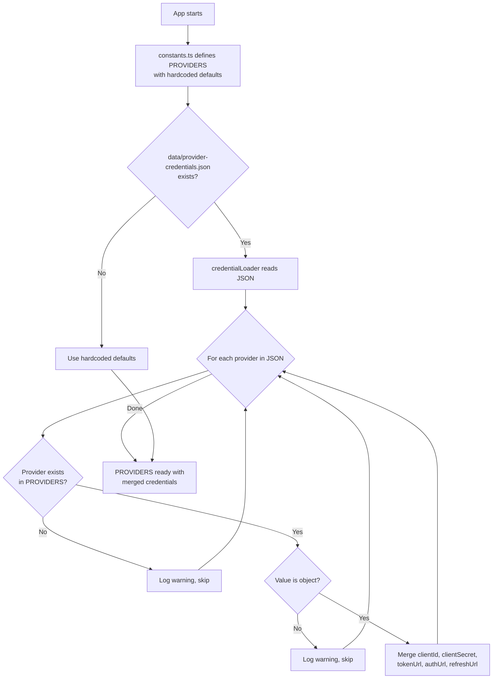

---

### 4.2 Ausführende (`open-sse/executors/`)

Ausführende kapseln **anbieterspezifische Logik** mithilfe des **Strategiemusters**. Jeder Executor überschreibt bei Bedarf Basismethoden.

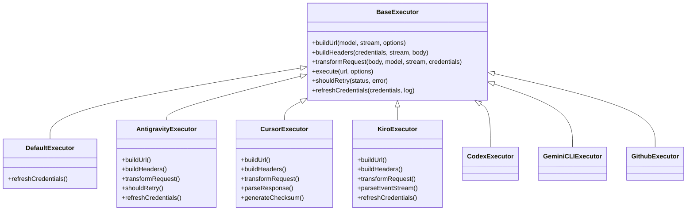

| Testamentsvollstrecker | Anbieter                                   | Schlüsselspezialisierungen                                                                                                                      |
| ---------------------- | ------------------------------------------ | ----------------------------------------------------------------------------------------------------------------------------------------------- |
| `base.ts`              | —                                          | Abstrakte Basis: URL-Erstellung, Header, Wiederholungslogik, Aktualisierung der Anmeldeinformationen                                            |
| `default.ts`           | Claude, Gemini, OpenAI, GLM, Kimi, MiniMax | Generische OAuth-Token-Aktualisierung für Standardanbieter                                                                                      |
| `antigravity.ts`       | Google Cloud-Code                          | Projekt-/Sitzungs-ID-Generierung, Multi-URL-Fallback, benutzerdefinierte Wiederholungsanalyse von Fehlermeldungen („Zurücksetzen nach 2h7m23s“) |
| `cursor.ts`            | Cursor-IDE                                 | **Am komplexesten**: SHA-256-Prüfsummenauthentifizierung, Protobuf-Anforderungskodierung, binäres EventStream → SSE-Antwortanalyse              |
| `codex.ts`             | OpenAI-Codex                               | Fügt Systemanweisungen ein, verwaltet Denkebenen und entfernt nicht unterstützte Parameter                                                      |
| `gemini-cli.ts`        | Google Gemini-CLI                          | Benutzerdefinierte URL-Erstellung (`streamGenerateContent`), Google OAuth-Token-Aktualisierung                                                  |
| `github.ts`            | GitHub-Copilot                             | Dual-Token-System (GitHub OAuth + Copilot-Token), VSCode-Header-Nachahmung                                                                      |
| `kiro.ts`              | AWS CodeWhisperer                          | AWS EventStream-Binäranalyse, AMZN-Ereignisrahmen, Token-Schätzung                                                                              |
| `index.ts`             | —                                          | Factory: ordnet Anbieternamen → Executor-Klasse zu, mit Standard-Fallback                                                                       |

---

### 4.3 Handler (`open-sse/handlers/`)

Die **Orchestrierungsebene** – koordiniert Übersetzung, Ausführung, Streaming und Fehlerbehandlung.

| Datei                 | Zweck                                                                                                                                                                                                                                                      |
| --------------------- | ---------------------------------------------------------------------------------------------------------------------------------------------------------------------------------------------------------------------------------------------------------- |
| `chatCore.ts`         | **Zentraler Orchestrator** (~600 Leitungen). Verarbeitet den gesamten Anforderungslebenszyklus: Formaterkennung → Übersetzung → Executor-Versand → Streaming-/Nicht-Streaming-Antwort → Token-Aktualisierung → Fehlerbehandlung → Nutzungsprotokollierung. |
| `responsesHandler.ts` | Adapter für die Antwort-API von OpenAI: Konvertiert das Antwortformat → Chat-Abschlüsse → sendet an `chatCore` → konvertiert SSE zurück in das Antwortformat.                                                                                              |
| `embeddings.ts`       | Handler für die Einbettungsgenerierung: Löst Einbettungsmodell → Anbieter auf, sendet an die Anbieter-API und gibt eine OpenAI-kompatible Einbettungsantwort zurück. Unterstützt mehr als 6 Anbieter.                                                      |
| `imageGeneration.ts`  | Bildgenerierungs-Handler: Löst Bildmodell → Anbieter auf, unterstützt OpenAI-kompatible, Gemini-Image- (Antigravity) und Fallback-Modi (Nebius). Gibt Base64- oder URL-Bilder zurück.                                                                      |

#### Anforderungslebenszyklus (chatCore.ts)

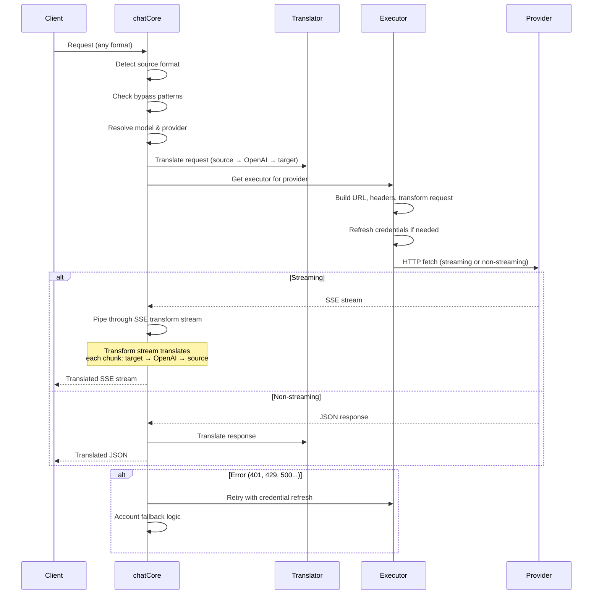

---

### 4.4 Dienste (`open-sse/services/`)

Geschäftslogik, die die Handler und Ausführenden unterstützt.

| Datei                | Zweck                                                                                                                                                                                                                                                                                                                                                                                         |
| -------------------- | --------------------------------------------------------------------------------------------------------------------------------------------------------------------------------------------------------------------------------------------------------------------------------------------------------------------------------------------------------------------------------------------- |
| `provider.ts`        | **Formaterkennung** (`detectFormat`): Analysiert die Struktur des Anfragetexts, um Claude/OpenAI/Gemini/Antigravity/Responses-Formate zu identifizieren (einschließlich `max_tokens`-Heuristik für Claude). Außerdem: URL-Erstellung, Header-Erstellung, Denken an die Konfigurationsnormalisierung. Unterstützt die dynamischen Anbieter `openai-compatible-*` und `anthropic-compatible-*`. |
| `model.ts`           | Parsen von Modellzeichenfolgen (`claude/model-name` → `{provider: "claude", model: "model-name"}`), Alias-Auflösung mit Kollisionserkennung, Eingabebereinigung (weist Pfaddurchquerung/Kontrollzeichen zurück) und Auflösung von Modellinformationen mit asynchroner Alias-Getter-Unterstützung.                                                                                             |
| `accountFallback.ts` | Umgang mit Ratenlimits: exponentielles Backoff (1 s → 2 s → 4 s → max. 2 min), Verwaltung der Kontoabklingzeit, Fehlerklassifizierung (welche Fehler einen Fallback auslösen und welche nicht).                                                                                                                                                                                               |
| `tokenRefresh.ts`    | OAuth-Token-Aktualisierung für **jeden Anbieter**: Google (Gemini, Antigravity), Claude, Codex, Qwen, iFlow, GitHub (OAuth + Copilot Dual-Token), Kiro (AWS SSO OIDC + Social Auth). Beinhaltet In-Flight-Promise-Deduplizierungs-Cache und Wiederholungsversuche mit exponentiellem Backoff.                                                                                                 |
| `combo.ts`           | **Combo-Modelle**: Ketten von Fallback-Modellen. Wenn Modell A mit einem Fallback-fähigen Fehler ausfällt, versuchen Sie es mit Modell B, dann mit C usw. Gibt tatsächliche Upstream-Statuscodes zurück.                                                                                                                                                                                      |
| `usage.ts`           | Ruft Kontingent-/Nutzungsdaten von Anbieter-APIs ab (GitHub Copilot-Kontingente, Antigravity-Modellkontingente, Codex-Ratenbegrenzungen, Kiro-Nutzungsaufschlüsselungen, Claude-Einstellungen).                                                                                                                                                                                               |
| `accountSelector.ts` | Intelligente Kontoauswahl mit Bewertungsalgorithmus: Berücksichtigt Priorität, Gesundheitsstatus, Round-Robin-Position und Cooldown-Status, um für jede Anfrage das optimale Konto auszuwählen.                                                                                                                                                                                               |
| `contextManager.ts`  | Lebenszyklusverwaltung des Anforderungskontexts: Erstellt und verfolgt Kontextobjekte pro Anforderung mit Metadaten (Anforderungs-ID, Zeitstempel, Anbieterinformationen) zum Debuggen und Protokollieren.                                                                                                                                                                                    |
| `ipFilter.ts`        | IP-basierte Zugriffskontrolle: Unterstützt die Modi „Zulassungsliste“ und „Blockliste“. Validiert die Client-IP anhand konfigurierter Regeln, bevor API-Anfragen verarbeitet werden.                                                                                                                                                                                                          |
| `sessionManager.ts`  | Sitzungsverfolgung mit Client-Fingerprinting: Verfolgt aktive Sitzungen mithilfe gehashter Client-IDs, überwacht die Anzahl der Anfragen und stellt Sitzungsmetriken bereit.                                                                                                                                                                                                                  |
| `signatureCache.ts`  | Anforderungssignaturbasierter Deduplizierungscache: Verhindert doppelte Anforderungen, indem aktuelle Anforderungssignaturen zwischengespeichert werden und zwischengespeicherte Antworten für identische Anforderungen innerhalb eines Zeitfensters zurückgegeben werden.                                                                                                                    |
| `systemPrompt.ts`    | Globale System-Prompt-Injektion: Stellt allen Anfragen eine konfigurierbare System-Prompt voran oder hängt sie an, mit Kompatibilitätsbehandlung pro Anbieter.                                                                                                                                                                                                                                |
| `thinkingBudget.ts`  | Verwaltung des Reasoning-Token-Budgets: Unterstützt Passthrough-, Auto- (Strip-Thinking-Konfiguration), benutzerdefinierte (festes Budget) und adaptive (komplexitätsskalierte) Modi zur Steuerung von Thinking-/Argument-Tokens.                                                                                                                                                             |
| `wildcardRouter.ts`  | Routing von Wildcard-Modellmustern: Löst Wildcard-Muster (z. B. `*/claude-*`) basierend auf Verfügbarkeit und Priorität in konkrete Anbieter/Modell-Paare auf.                                                                                                                                                                                                                                |

#### Token-Aktualisierungsdeduplizierung

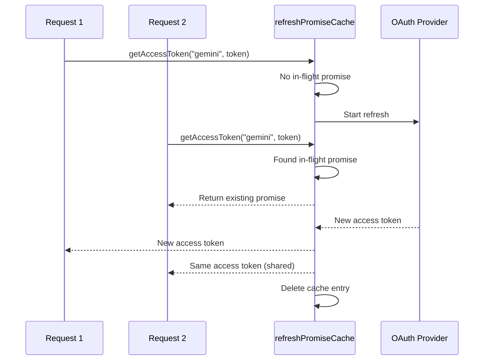

#### Konto-Fallback-Zustandsmaschine

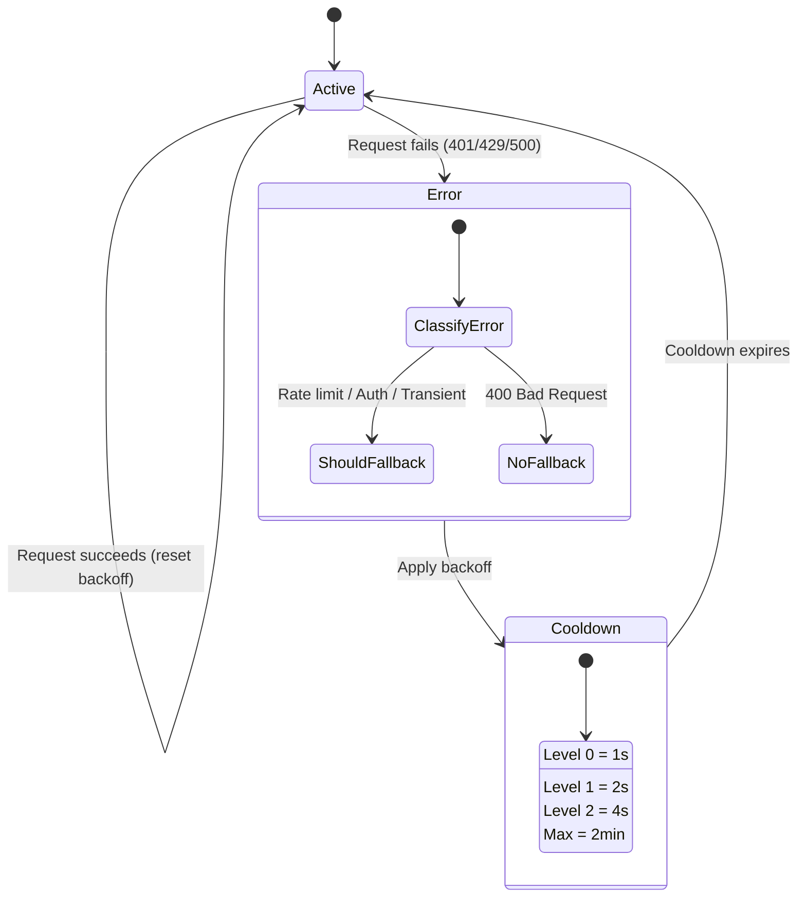

#### Combo-Modellkette

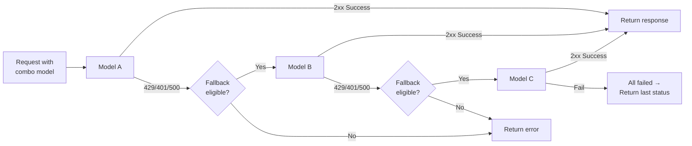

---

### 4.5 Übersetzer (`open-sse/translator/`)

Die **Formatübersetzungs-Engine** verwendet ein selbstregistrierendes Plugin-System.

#### Architektur

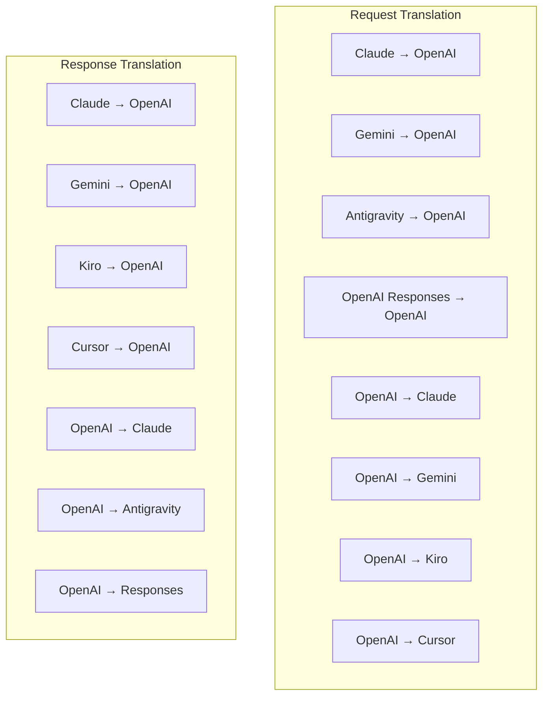

| Verzeichnis  | Dateien      | Beschreibung                                                                                                                                                                                                                                                                                                  |
| ------------ | ------------ | ------------------------------------------------------------------------------------------------------------------------------------------------------------------------------------------------------------------------------------------------------------------------------------------------------------- |
| `request/`   | 8 Übersetzer | Konvertieren Sie Anforderungstexte zwischen Formaten. Jede Datei registriert sich beim Import über `register(from, to, fn)` selbst.                                                                                                                                                                           |
| `response/`  | 7 Übersetzer | Konvertieren Sie Streaming-Antwortblöcke zwischen Formaten. Behandelt SSE-Ereignistypen, Denkblockaden und Toolaufrufe.                                                                                                                                                                                       |
| `helpers/`   | 6 Helfer     | Gemeinsame Dienstprogramme: `claudeHelper` (Extraktion von Systemeingabeaufforderungen, Thinking-Konfiguration), `geminiHelper` (Zuordnung von Teilen/Inhalten), `openaiHelper` (Formatfilterung), `toolCallHelper` (ID-Generierung, Injektion fehlender Antworten), `maxTokensHelper`, `responsesApiHelper`. |
| `index.ts`   | —            | Übersetzungs-Engine: `translateRequest()`, `translateResponse()`, Statusverwaltung, Registrierung.                                                                                                                                                                                                            |
| `formats.ts` | —            | Formatkonstanten: `OPENAI`, `CLAUDE`, `GEMINI`, `ANTIGRAVITY`, `KIRO`, `CURSOR`, `OPENAI_RESPONSES`.                                                                                                                                                                                                          |

#### Schlüsseldesign: Selbstregistrierende Plugins

```javascript
// Each translator file calls register() on import:
import { register } from "../index.js";
register("claude", "openai", translateClaudeToOpenAI);

// The index.js imports all translator files, triggering registration:
import "./request/claude-to-openai.js"; // ← self-registers
```

---

### 4.6 Utils (`open-sse/utils/`)

| Datei              | Zweck                                                                                                                                                                                                                                                                                                                   |
| ------------------ | ----------------------------------------------------------------------------------------------------------------------------------------------------------------------------------------------------------------------------------------------------------------------------------------------------------------------- |
| `error.ts`         | Erstellung von Fehlerantworten (OpenAI-kompatibles Format), Upstream-Fehleranalyse, Antigravity-Wiederholungszeit-Extraktion aus Fehlermeldungen, SSE-Fehler-Streaming.                                                                                                                                                 |
| `stream.ts`        | **SSE Transform Stream** – die zentrale Streaming-Pipeline. Zwei Modi: `TRANSLATE` (Vollformatübersetzung) und `PASSTHROUGH` (Nutzung normalisieren + extrahieren). Verarbeitet Chunk-Pufferung, Nutzungsschätzung und Inhaltslängenverfolgung. Pro-Stream-Encoder-/Decoder-Instanzen vermeiden den gemeinsamen Status. |
| `streamHelpers.ts` | Low-Level-SSE-Dienstprogramme: `parseSSELine` (leerzeichentolerant), `hasValuableContent` (filtert leere Blöcke für OpenAI/Claude/Gemini), `fixInvalidId`, `formatSSE` (formatbewusste SSE-Serialisierung mit `perf_metrics`-Bereinigung).                                                                              |
| `usageTracking.ts` | Extraktion der Token-Nutzung aus jedem Format (Claude/OpenAI/Gemini/Responses), Schätzung mit separaten Zeichen-pro-Token-Verhältnissen für Tools/Nachrichten, Pufferzugabe (2000 Token-Sicherheitsspielraum), formatspezifische Feldfilterung, Konsolenprotokollierung mit ANSI-Farben.                                |
| `requestLogger.ts` | Dateibasierte Anforderungsprotokollierung (Opt-in über `ENABLE_REQUEST_LOGS=true`). Erstellt Sitzungsordner mit nummerierten Dateien: `1_req_client.json` → `7_res_client.txt`. Alle E/A erfolgen asynchron (Fire-and-Forget). Maskiert sensible Header.                                                                |
| `bypassHandler.ts` | Fängt bestimmte Muster von Claude CLI ab (Titelextraktion, Aufwärmen, Zählung) und gibt gefälschte Antworten zurück, ohne einen Anbieter anzurufen. Unterstützt sowohl Streaming als auch Nicht-Streaming. Absichtlich auf den Claude-CLI-Bereich beschränkt.                                                           |
| `networkProxy.ts`  | Löst die ausgehende Proxy-URL für einen bestimmten Anbieter mit der Priorität auf: anbieterspezifische Konfiguration → globale Konfiguration → Umgebungsvariablen (`HTTPS_PROXY`/`HTTP_PROXY`/`ALL_PROXY`). Unterstützt `NO_PROXY`-Ausschlüsse. Speichert die Konfiguration 30 Sekunden lang im Cache.                  |

#### SSE-Streaming-Pipeline

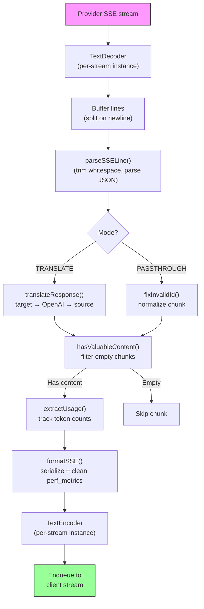

#### Logger-Sitzungsstruktur anfordern

```
logs/
└── claude_gemini_claude-sonnet_20260208_143045/
    ├── 1_req_client.json      ← Raw client request
    ├── 2_req_source.json      ← After initial conversion
    ├── 3_req_openai.json      ← OpenAI intermediate format
    ├── 4_req_target.json      ← Final target format
    ├── 5_res_provider.txt     ← Provider SSE chunks (streaming)
    ├── 5_res_provider.json    ← Provider response (non-streaming)
    ├── 6_res_openai.txt       ← OpenAI intermediate chunks
    ├── 7_res_client.txt       ← Client-facing SSE chunks
    └── 6_error.json           ← Error details (if any)
```

---

### 4.7 Anwendungsschicht (`src/`)

| Verzeichnis   | Zweck                                                                               |
| ------------- | ----------------------------------------------------------------------------------- |
| `src/app/`    | Web-Benutzeroberfläche, API-Routen, Express-Middleware, OAuth-Callback-Handler      |
| `src/lib/`    | Datenbankzugriff (`localDb.ts`, `usageDb.ts`), Authentifizierung, gemeinsam genutzt |
| `src/mitm/`   | Man-in-the-Middle-Proxy-Dienstprogramme zum Abfangen des Provider-Verkehrs          |
| `src/models/` | Datenbankmodelldefinitionen                                                         |
| `src/shared/` | Wrapper um Open-SSE-Funktionen (Anbieter, Stream, Fehler usw.)                      |
| `src/sse/`    | SSE-Endpunkthandler, die die open-sse-Bibliothek mit Express-Routen verbinden       |
| `src/store/`  | Anwendungsstatusverwaltung                                                          |

#### Bemerkenswerte API-Routen

| Route                                         | Methoden        | Zweck                                                                                                   |
| --------------------------------------------- | --------------- | ------------------------------------------------------------------------------------------------------- |
| `/api/provider-models`                        | GET/POST/DELETE | CRUD für benutzerdefinierte Modelle pro Anbieter                                                        |
| `/api/models/catalog`                         | GET             | Aggregierter Katalog aller Modelle (Chat, Einbettung, Bild, benutzerdefiniert), gruppiert nach Anbieter |
| `/api/settings/proxy`                         | GET/PUT/DELETE  | Hierarchische ausgehende Proxy-Konfiguration (`global/providers/combos/keys`)                           |
| `/api/settings/proxy/test`                    | POST            | Validiert die Proxy-Konnektivität und gibt öffentliche IP/Latenz zurück                                 |
| `/v1/providers/[provider]/chat/completions`   | POST            | Dedizierte Chat-Abschlüsse pro Anbieter mit Modellvalidierung                                           |
| `/v1/providers/[provider]/embeddings`         | POST            | Dedizierte Einbettungen pro Anbieter mit Modellvalidierung                                              |
| `/v1/providers/[provider]/images/generations` | POST            | Dedizierte Image-Generierung pro Anbieter mit Modellvalidierung                                         |
| `/api/settings/ip-filter`                     | GET/PUT         | Verwaltung von IP-Zulassungs-/Blockierungslisten                                                        |
| `/api/settings/thinking-budget`               | GET/PUT         | Konfiguration des Reasoning-Token-Budgets (Passthrough/Auto/Benutzerdefiniert/Adaptiv)                  |
| `/api/settings/system-prompt`                 | GET/PUT         | Globale System-Prompt-Injektion für alle Anfragen                                                       |
| `/api/sessions`                               | GET             | Aktive Sitzungsverfolgung und Metriken                                                                  |
| `/api/rate-limits`                            | GET             | Status der Ratenbegrenzung pro Konto                                                                    |

---

## 5. Wichtige Designmuster

### 5.1 Hub-and-Spoke-Übersetzung

Alle Formate werden über das **OpenAI-Format als Hub** übersetzt. Für das Hinzufügen eines neuen Anbieters ist nur das Schreiben von **einem Paar** Übersetzern (zu/von OpenAI) erforderlich, nicht von N Paaren.

### 5.2 Executor-Strategiemuster

Jeder Anbieter verfügt über eine dedizierte Executor-Klasse, die von `BaseExecutor` erbt. Die Factory in `executors/index.ts` wählt zur Laufzeit die richtige aus.

### 5.3 Selbstregistrierendes Plugin-System

Übersetzermodule registrieren sich beim Import über `register()`. Beim Hinzufügen eines neuen Übersetzers wird lediglich eine Datei erstellt und importiert.

### 5.4 Konto-Fallback mit exponentiellem Backoff

Wenn ein Anbieter 429/401/500 zurückgibt, kann das System zum nächsten Konto wechseln und dabei exponentielle Abklingzeiten anwenden (1 Sek. → 2 Sek. → 4 Sek. → max. 2 Min.).

### 5.5 Combo-Modellketten

Eine „Kombination“ gruppiert mehrere `provider/model`-Strings. Wenn der erste fehlschlägt, wird automatisch auf den nächsten zurückgegriffen.

### 5.6 Stateful Streaming-Übersetzung

Die Antwortübersetzung behält den Status über SSE-Chunks hinweg bei (Nachverfolgung von Denkblöcken, Akkumulation von Toolaufrufen, Indizierung von Inhaltsblöcken) über den `initState()`-Mechanismus.

### 5.7 Nutzungssicherheitspuffer

Der gemeldeten Nutzung wird ein 2000-Token-Puffer hinzugefügt, um zu verhindern, dass Clients aufgrund von Overhead durch Systemeingabeaufforderungen und Formatübersetzung die Kontextfenstergrenzen erreichen.

---

## 6. Unterstützte Formate

| Formatieren            | Richtung      | Bezeichner         |
| ---------------------- | ------------- | ------------------ |
| OpenAI-Chat-Abschlüsse | Quelle + Ziel | `openai`           |
| OpenAI Responses API   | Quelle + Ziel | `openai-responses` |
| Anthropischer Claude   | Quelle + Ziel | `claude`           |
| Google Gemini          | Quelle + Ziel | `gemini`           |
| Google Gemini-CLI      | Nur Ziel      | `gemini-cli`       |
| Antigravitation        | Quelle + Ziel | `antigravity`      |
| AWS Kiro               | Nur Ziel      | `kiro`             |
| Cursor                 | Nur Ziel      | `cursor`           |

---

## 7. Unterstützte Anbieter

| Anbieter                 | Authentifizierungsmethode   | Testamentsvollstrecker | Wichtige Anmerkungen                                        |
| ------------------------ | --------------------------- | ---------------------- | ----------------------------------------------------------- |
| Anthropischer Claude     | API-Schlüssel oder OAuth    | Standard               | Verwendet den Header `x-api-key`                            |
| Google Gemini            | API-Schlüssel oder OAuth    | Standard               | Verwendet den Header `x-goog-api-key`                       |
| Google Gemini-CLI        | OAuth                       | GeminiCLI              | Verwendet den Endpunkt `streamGenerateContent`              |
| Antigravitation          | OAuth                       | Antigravitation        | Multi-URL-Fallback, benutzerdefinierte Wiederholungsanalyse |
| OpenAI                   | API-Schlüssel               | Standard               | Standard Bearer-Authentifizierung                           |
| Kodex                    | OAuth                       | Kodex                  | Fügt Systemanweisungen ein, verwaltet das Denken            |
| GitHub-Copilot           | OAuth + Copilot-Token       | Github                 | Dual-Token, VSCode-Header-Nachahmung                        |
| Kiro (AWS)               | AWS SSO OIDC oder Social    | Kiro                   | Binäres EventStream-Parsen                                  |
| Cursor-IDE               | Prüfsummenauthentifizierung | Cursor                 | Protobuf-Kodierung, SHA-256-Prüfsummen                      |
| Qwen                     | OAuth                       | Standard               | Standardauthentifizierung                                   |
| iFlow                    | OAuth (Basic + Bearer)      | Standard               | Dual-Auth-Header                                            |
| OpenRouter               | API-Schlüssel               | Standard               | Standard Bearer-Authentifizierung                           |
| GLM, Kimi, MiniMax       | API-Schlüssel               | Standard               | Claude-kompatibel, verwenden Sie `x-api-key`                |
| `openai-compatible-*`    | API-Schlüssel               | Standard               | Dynamisch: jeder OpenAI-kompatible Endpunkt                 |
| `anthropic-compatible-*` | API-Schlüssel               | Standard               | Dynamisch: jeder Claude-kompatible Endpunkt                 |

---

## 8. Zusammenfassung des Datenflusses

### Streaming-Anfrage

```mermaid
flowchart LR
    A["Client"] --> B["detectFormat()"]
    B --> C["translateRequest()\nsource → OpenAI → target"]
    C --> D["Executor\nbuildUrl + buildHeaders"]
    D --> E["fetch(providerURL)"]
    E --> F["createSSEStream()\nTRANSLATE mode"]
    F --> G["parseSSELine()"]
    G --> H["translateResponse()\ntarget → OpenAI → source"]
    H --> I["extractUsage()\n+ addBuffer"]
    I --> J["formatSSE()"]
    J --> K["Client receives\ntranslated SSE"]
    K --> L["logUsage()\nsaveRequestUsage()"]
```

### Nicht-Streaming-Anfrage

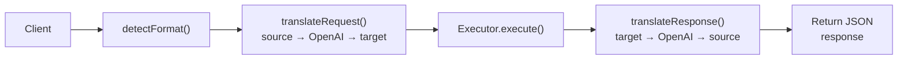

### Bypass-Flow (Claude CLI)

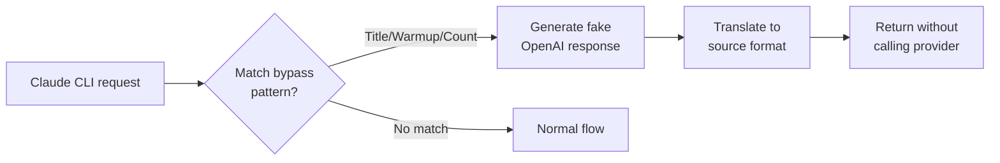
