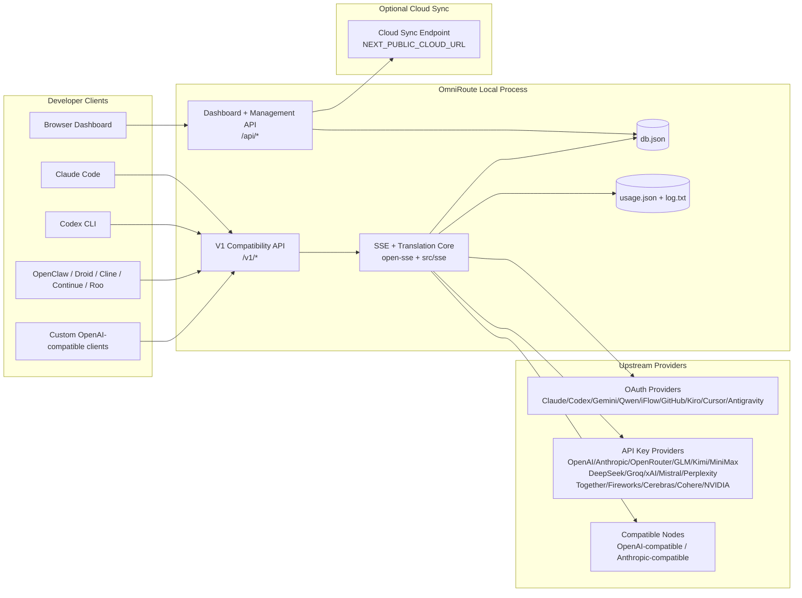
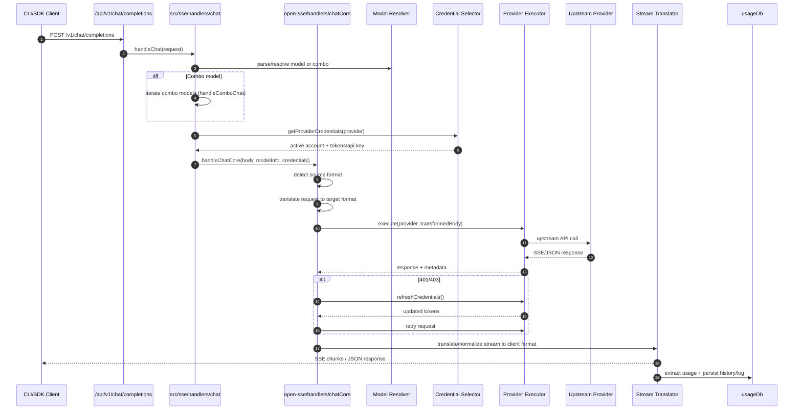
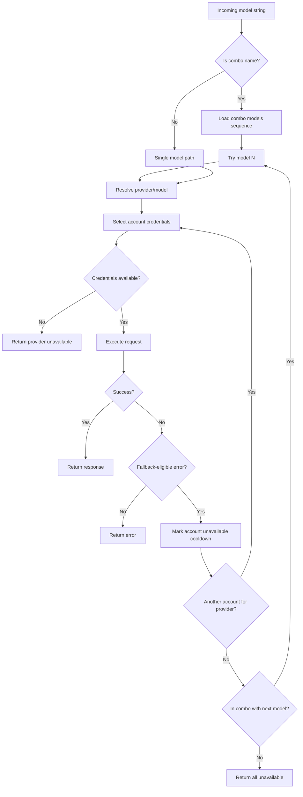
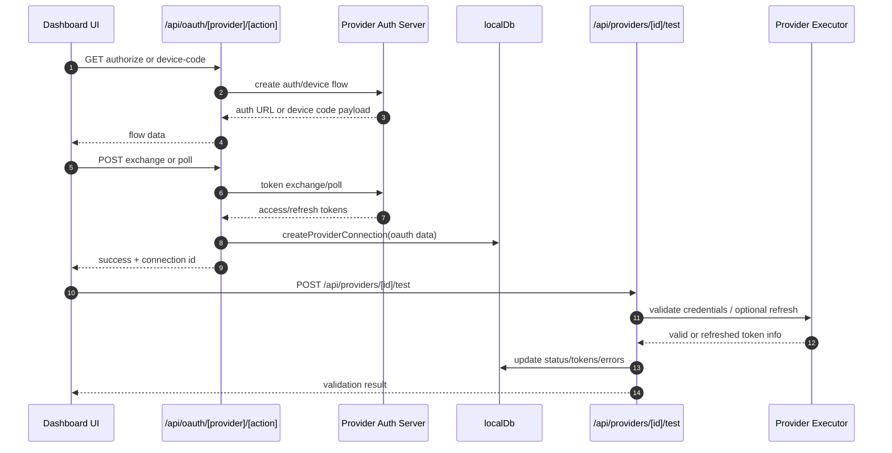
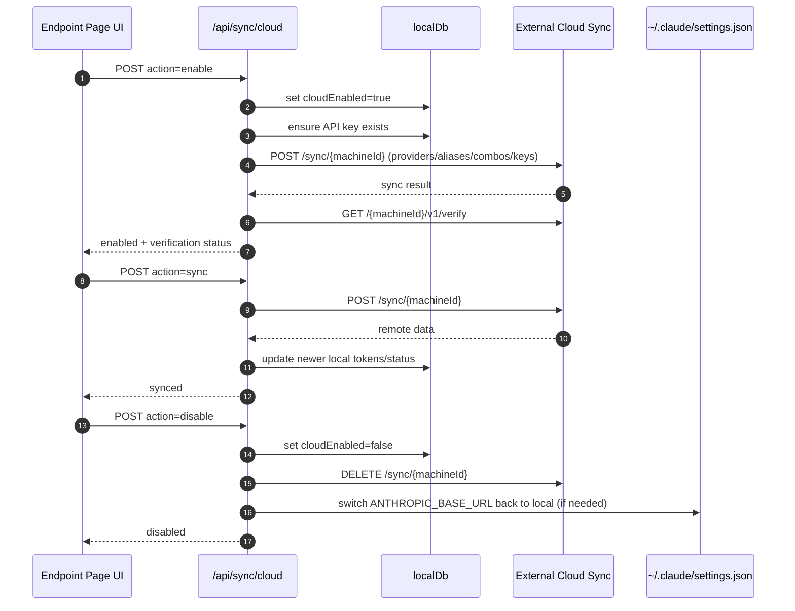
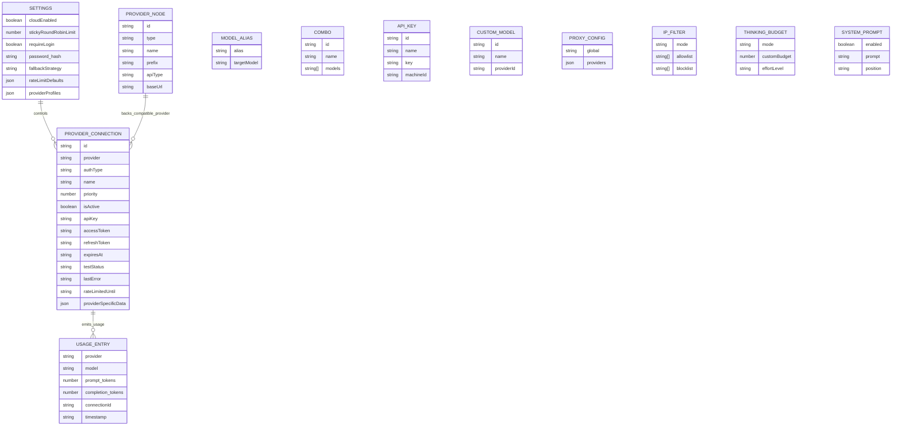
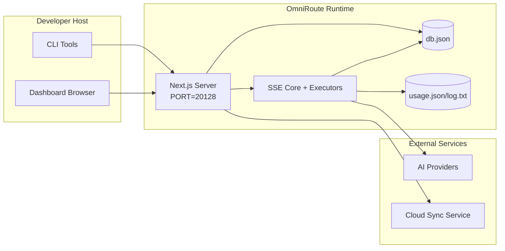

# Arquitectura OmniRoute

🌐 **Languages:** 🇺🇸 [English](../../ARCHITECTURE.md) | 🇧🇷 [Português (Brasil)](../pt-BR/ARCHITECTURE.md) | 🇪🇸 [Español](../es/ARCHITECTURE.md) | 🇫🇷 [Français](../fr/ARCHITECTURE.md) | 🇮🇹 [Italiano](../it/ARCHITECTURE.md) | 🇷🇺 [Русский](../ru/ARCHITECTURE.md) | 🇨🇳 [中文 (简体)](../zh-CN/ARCHITECTURE.md) | 🇩🇪 [Deutsch](../de/ARCHITECTURE.md) | 🇮🇳 [हिन्दी](../in/ARCHITECTURE.md) | 🇹🇭 [ไทย](../th/ARCHITECTURE.md) | 🇺🇦 [Українська](../uk-UA/ARCHITECTURE.md) | 🇸🇦 [العربية](../ar/ARCHITECTURE.md) | 🇯🇵 [日本語](../ja/ARCHITECTURE.md) | 🇻🇳 [Tiếng Việt](../vi/ARCHITECTURE.md) | 🇧🇬 [Български](../bg/ARCHITECTURE.md) | 🇩🇰 [Dansk](../da/ARCHITECTURE.md) | 🇫🇮 [Suomi](../fi/ARCHITECTURE.md) | 🇮🇱 [עברית](../he/ARCHITECTURE.md) | 🇭🇺 [Magyar](../hu/ARCHITECTURE.md) | 🇮🇩 [Bahasa Indonesia](../id/ARCHITECTURE.md) | 🇰🇷 [한국어](../ko/ARCHITECTURE.md) | 🇲🇾 [Bahasa Melayu](../ms/ARCHITECTURE.md) | 🇳🇱 [Nederlands](../nl/ARCHITECTURE.md) | 🇳🇴 [Norsk](../no/ARCHITECTURE.md) | 🇵🇹 [Português (Portugal)](../pt/ARCHITECTURE.md) | 🇷🇴 [Română](../ro/ARCHITECTURE.md) | 🇵🇱 [Polski](../pl/ARCHITECTURE.md) | 🇸🇰 [Slovenčina](../sk/ARCHITECTURE.md) | 🇸🇪 [Svenska](../sv/ARCHITECTURE.md) | 🇵🇭 [Filipino](../phi/ARCHITECTURE.md)

_Última actualización: 2026-02-18_

## Resumen ejecutivo

OmniRoute es un panel y una puerta de enlace de enrutamiento de IA local creado en Next.js.
Proporciona un único punto final compatible con OpenAI (`/v1/*`) y enruta el tráfico a través de múltiples proveedores ascendentes con traducción, respaldo, actualización de tokens y seguimiento de uso.

Capacidades principales:

- Superficie API compatible con OpenAI para CLI/herramientas (28 proveedores)
- Traducción de solicitudes/respuestas entre formatos de proveedores.
- Modelo combinado de respaldo (secuencia multimodelo)
- Respaldo a nivel de cuenta (varias cuentas por proveedor)
- Gestión de conexión de proveedor de claves OAuth + API
- Generación de incrustación vía `/v1/embeddings` (6 proveedores, 9 modelos)
- Generación de imágenes vía `/v1/images/generations` (4 proveedores, 9 modelos)
- Piense en el análisis de etiquetas (`<think>...</think>`) para modelos de razonamiento
- Saneamiento de respuesta para una estricta compatibilidad con OpenAI SDK
- Normalización de roles (desarrollador → sistema, sistema → usuario) para compatibilidad entre proveedores
- Conversión de salida estructurada (json_schema → Gemini ResponseSchema)
- Persistencia local para proveedores, claves, alias, combos, configuraciones, precios.
- Seguimiento de uso/costos y registro de solicitudes
- Sincronización en la nube opcional para sincronización multidispositivo/estado
- Lista de IP permitidas/lista de bloqueo para control de acceso a API
- Pensando en la gestión del presupuesto (transferencia/automática/personalizada/adaptativa)
- Inyección rápida del sistema global
- Seguimiento de sesiones y toma de huellas digitales
- Limitación de tarifas mejorada por cuenta con perfiles específicos del proveedor
- Patrón de disyuntor para la resiliencia del proveedor
- Protección de rebaño anti-truenos con bloqueo mutex
- Caché de deduplicación de solicitudes basado en firmas
- Capa de dominio: disponibilidad del modelo, reglas de costos, política de respaldo, política de bloqueo
- Persistencia del estado del dominio (caché de escritura SQLite para respaldos, presupuestos, bloqueos, disyuntores)
- Motor de políticas para la evaluación centralizada de solicitudes (bloqueo → presupuesto → respaldo)
- Solicitar telemetría con agregación de latencia p50/p95/p99
- ID de correlación (X-Request-Id) para seguimiento de un extremo a otro
- Registro de auditoría de cumplimiento con opción de exclusión por clave API
- Marco de evaluación para el aseguramiento de la calidad del LLM.
- Panel de interfaz de usuario de resiliencia con estado del disyuntor en tiempo real
- Proveedores modulares de OAuth (12 módulos individuales bajo `src/lib/oauth/providers/`)

Modelo de tiempo de ejecución principal:

- Las rutas de la aplicación Next.js bajo `src/app/api/*` implementan API de panel y API de compatibilidad.
- Un núcleo de enrutamiento/SSE compartido en `src/sse/*` + `open-sse/*` maneja la ejecución, traducción, transmisión, respaldo y uso del proveedor.

## Alcance y límites

### En alcance

- Tiempo de ejecución de la puerta de enlace local
- API de gestión de paneles
- Autenticación de proveedor y actualización de token
- Solicitar traducción y transmisión SSE
- Estado local + persistencia de uso.
- Orquestación de sincronización en la nube opcional

### Fuera de alcance

- Implementación del servicio en la nube detrás de `NEXT_PUBLIC_CLOUD_URL`
- Proveedor SLA/plano de control fuera del proceso local
- Los propios binarios CLI externos (Claude CLI, Codex CLI, etc.)

## Contexto del sistema de alto nivel



## Componentes principales del tiempo de ejecución

## 1) API y capa de enrutamiento (rutas de la aplicación Next.js)

Directorios principales:

- `src/app/api/v1/*` y `src/app/api/v1beta/*` para API de compatibilidad
- `src/app/api/*` para API de administración/configuración
- Siguientes reescrituras en `next.config.mjs` asignan `/v1/*` a `/api/v1/*`

Rutas de compatibilidad importantes:

- `src/app/api/v1/chat/completions/route.ts`
- `src/app/api/v1/messages/route.ts`
- `src/app/api/v1/responses/route.ts`
- `src/app/api/v1/models/route.ts` — incluye modelos personalizados con `custom: true`
- `src/app/api/v1/embeddings/route.ts` — generación de incrustación (6 proveedores)
- `src/app/api/v1/images/generations/route.ts` — generación de imágenes (4+ proveedores, incluido Antigravity/Nebius)
- `src/app/api/v1/messages/count_tokens/route.ts`
- `src/app/api/v1/providers/[provider]/chat/completions/route.ts` — chat dedicado por proveedor
- `src/app/api/v1/providers/[provider]/embeddings/route.ts` — incorporaciones dedicadas por proveedor
- `src/app/api/v1/providers/[provider]/images/generations/route.ts`: imágenes dedicadas por proveedor
- `src/app/api/v1beta/models/route.ts`
- `src/app/api/v1beta/models/[...path]/route.ts`

Dominios de gestión:

- Autenticación/configuración: `src/app/api/auth/*`, `src/app/api/settings/*`
- Proveedores/conexiones: `src/app/api/providers*`
- Nodos proveedores: `src/app/api/provider-nodes*`
- Modelos personalizados: `src/app/api/provider-models` (GET/POST/DELETE)
- Catálogo de modelos: `src/app/api/models/catalog` (OBTENER)
- Configuración de proxy: `src/app/api/settings/proxy` (OBTENER/PONER/BORRAR) + `src/app/api/settings/proxy/test` (POST)
- OAuth: `src/app/api/oauth/*`
- Claves/alias/combos/precios: `src/app/api/keys*`, `src/app/api/models/alias`, `src/app/api/combos*`, `src/app/api/pricing`
- Uso: `src/app/api/usage/*`
- Sincronización/nube: `src/app/api/sync/*`, `src/app/api/cloud/*`
- Ayudantes de herramientas CLI: `src/app/api/cli-tools/*`
- Filtro IP: `src/app/api/settings/ip-filter` (OBTENER/PUT)
- Presupuesto de pensamiento: `src/app/api/settings/thinking-budget` (GET/PUT)
- Mensaje del sistema: `src/app/api/settings/system-prompt` (OBTENER/PUT)
- Sesiones: `src/app/api/sessions` (OBTENER)
- Límites de tasa: `src/app/api/rate-limits` (GET)
- Resiliencia: `src/app/api/resilience` (GET/PATCH): perfiles de proveedor, disyuntor, estado límite de velocidad
- Restablecimiento de resiliencia: `src/app/api/resilience/reset` (POST) — restablecer interruptores + tiempos de reutilización
- Estadísticas de caché: `src/app/api/cache/stats` (OBTENER/ELIMINAR)
- Disponibilidad del modelo: `src/app/api/models/availability` (GET/POST)
- Telemetría: `src/app/api/telemetry/summary` (OBTENER)
- Presupuesto: `src/app/api/usage/budget` (GET/POST)
- Cadenas de respaldo: `src/app/api/fallback/chains` (GET/POST/DELETE)
- Auditoría de cumplimiento: `src/app/api/compliance/audit-log` (GET)
- Evaluaciones: `src/app/api/evals` (GET/POST), `src/app/api/evals/[suiteId]` (GET)
- Políticas: `src/app/api/policies` (GET/POST)

## 2) SSE + Núcleo de traducción

Módulos de flujo principales:

- Entrada: `src/sse/handlers/chat.ts`
- Orquestación central: `open-sse/handlers/chatCore.ts`
- Adaptadores de ejecución del proveedor: `open-sse/executors/*`
- Detección de formato/configuración del proveedor: `open-sse/services/provider.ts`
- Análisis/resolución del modelo: `src/sse/services/model.ts`, `open-sse/services/model.ts`
- Lógica de reserva de cuenta: `open-sse/services/accountFallback.ts`
- Registro de traducción: `open-sse/translator/index.ts`
- Transformaciones de flujo: `open-sse/utils/stream.ts`, `open-sse/utils/streamHandler.ts`
- Extracción/normalización de uso: `open-sse/utils/usageTracking.ts`
- Piense en el analizador de etiquetas: `open-sse/utils/thinkTagParser.ts`
- Controlador de incrustación: `open-sse/handlers/embeddings.ts`
- Incrustar registro de proveedores: `open-sse/config/embeddingRegistry.ts`
- Controlador de generación de imágenes: `open-sse/handlers/imageGeneration.ts`
- Registro de proveedor de imágenes: `open-sse/config/imageRegistry.ts`
- Sanitización de respuesta: `open-sse/handlers/responseSanitizer.ts`
- Normalización de roles: `open-sse/services/roleNormalizer.ts`

Servicios (lógica de negocios):

- Selección/puntuación de cuenta: `open-sse/services/accountSelector.ts`
- Gestión del ciclo de vida del contexto: `open-sse/services/contextManager.ts`
- Aplicación del filtro IP: `open-sse/services/ipFilter.ts`
- Seguimiento de sesión: `open-sse/services/sessionManager.ts`
- Solicitar deduplicación: `open-sse/services/signatureCache.ts`
- Inyección de aviso del sistema: `open-sse/services/systemPrompt.ts`
- Pensando en la gestión del presupuesto: `open-sse/services/thinkingBudget.ts`
- Enrutamiento del modelo comodín: `open-sse/services/wildcardRouter.ts`
- Gestión de límites de tarifas: `open-sse/services/rateLimitManager.ts`
- Disyuntor: `open-sse/services/circuitBreaker.ts`

Módulos de capa de dominio:

- Disponibilidad del modelo: `src/lib/domain/modelAvailability.ts`
- Reglas de costos/presupuestos: `src/lib/domain/costRules.ts`
- Política alternativa: `src/lib/domain/fallbackPolicy.ts`
- Resolución combinada: `src/lib/domain/comboResolver.ts`
- Política de bloqueo: `src/lib/domain/lockoutPolicy.ts`
- Motor de políticas: `src/domain/policyEngine.ts` — bloqueo centralizado → presupuesto → evaluación alternativa
- Catálogo de códigos de error: `src/lib/domain/errorCodes.ts`
- ID de solicitud: `src/lib/domain/requestId.ts`
- Tiempo de espera de recuperación: `src/lib/domain/fetchTimeout.ts`
- Solicitar telemetría: `src/lib/domain/requestTelemetry.ts`
- Cumplimiento/auditoría: `src/lib/domain/compliance/index.ts`
- Corredor de evaluación: `src/lib/domain/evalRunner.ts`
- Persistencia del estado del dominio: `src/lib/db/domainState.ts` — SQLite CRUD para cadenas de respaldo, presupuestos, historial de costos, estado de bloqueo, disyuntores

Módulos del proveedor OAuth (12 archivos individuales bajo `src/lib/oauth/providers/`):

- Índice de registro: `src/lib/oauth/providers/index.ts`
- Proveedores individuales: `claude.ts`, `codex.ts`, `gemini.ts`, `antigravity.ts`, `iflow.ts`, `qwen.ts`, `kimi-coding.ts`, `github.ts`, `kiro.ts`, `cursor.ts`, `kilocode.ts`, `cline.ts`
- Contenedor delgado: `src/lib/oauth/providers.ts` — reexportaciones desde módulos individuales

## 3) Capa de persistencia

BD de estado primario:

- `src/lib/localDb.ts`
- archivo: `${DATA_DIR}/db.json` (o `$XDG_CONFIG_HOME/omniroute/db.json` cuando está configurado, en caso contrario `~/.omniroute/db.json`)
- entidades: proveedoresConexiones, proveedoresNodos, modelAliases, combos, apiKeys, configuraciones, precios, **customModels**, **proxyConfig**, **ipFilter**, **thinkingBudget**, **systemPrompt**

Base de datos de uso:

- `src/lib/usageDb.ts`
- archivos: `${DATA_DIR}/usage.json`, `${DATA_DIR}/log.txt`, `${DATA_DIR}/call_logs/`
- sigue la misma política de directorio base que `localDb` (`DATA_DIR`, luego `XDG_CONFIG_HOME/omniroute` cuando se establece)
- descompuesto en submódulos enfocados: `migrations.ts`, `usageHistory.ts`, `costCalculator.ts`, `usageStats.ts`, `callLogs.ts`

Base de datos de estado de dominio (SQLite):

- `src/lib/db/domainState.ts` — Operaciones CRUD para el estado del dominio
- Tablas (creadas en `src/lib/db/core.ts`): `domain_fallback_chains`, `domain_budgets`, `domain_cost_history`, `domain_lockout_state`, `domain_circuit_breakers`
- Patrón de caché de escritura simultánea: los mapas en memoria tienen autoridad en tiempo de ejecución; las mutaciones se escriben sincrónicamente en SQLite; El estado se restaura desde la base de datos en el arranque en frío.

## 4) Autenticación + Superficies de seguridad

- Autenticación de cookies del panel: `src/proxy.ts`, `src/app/api/auth/login/route.ts`
- Generación/verificación de clave API: `src/shared/utils/apiKey.ts`
- Los secretos del proveedor persistieron en `providerConnections` entradas
- Soporte de proxy saliente a través de `open-sse/utils/proxyFetch.ts` (env vars) y `open-sse/utils/networkProxy.ts` (configurable por proveedor o global)

## 5) Sincronización en la nube

- Inicio del programador: `src/lib/initCloudSync.ts`, `src/shared/services/initializeCloudSync.ts`
- Tarea periódica: `src/shared/services/cloudSyncScheduler.ts`
- Ruta de control: `src/app/api/sync/cloud/route.ts`

## Solicitar ciclo de vida (`/v1/chat/completions`)



## Combo + Flujo alternativo de cuenta



Las decisiones alternativas están impulsadas por `open-sse/services/accountFallback.ts` utilizando códigos de estado y heurísticas de mensajes de error.

## Incorporación de OAuth y ciclo de vida de actualización de tokens



La actualización durante el tráfico en vivo se ejecuta dentro de `open-sse/handlers/chatCore.ts` a través del ejecutor `refreshCredentials()`.

## Ciclo de vida de sincronización en la nube (activar/sincronizar/desactivar)



La sincronización periódica la activa `CloudSyncScheduler` cuando la nube está habilitada.

## Modelo de datos y mapa de almacenamiento



Archivos de almacenamiento físico:

- estado principal: `${DATA_DIR}/db.json` (o `$XDG_CONFIG_HOME/omniroute/db.json` cuando está configurado, en caso contrario `~/.omniroute/db.json`)
- estadísticas de uso: `${DATA_DIR}/usage.json`
- líneas de registro de solicitud: `${DATA_DIR}/log.txt`
- traductor opcional/solicitar sesiones de depuración: `<repo>/logs/...`

## Topología de implementación



## Mapeo de módulos (de decisión crítica)

### Módulos de ruta y API

- `src/app/api/v1/*`, `src/app/api/v1beta/*`: API de compatibilidad
- `src/app/api/v1/providers/[provider]/*`: rutas dedicadas por proveedor (chat, incrustaciones, imágenes)
- `src/app/api/providers*`: proveedor CRUD, validación, pruebas
- `src/app/api/provider-nodes*`: gestión de nodos compatibles personalizados
- `src/app/api/provider-models`: gestión de modelos personalizados (CRUD)
- `src/app/api/models/catalog`: API de catálogo de modelos completo (todos los tipos agrupados por proveedor)
- `src/app/api/oauth/*`: flujos de código de dispositivo/OAuth
- `src/app/api/keys*`: ciclo de vida de la clave API local
- `src/app/api/models/alias`: gestión de alias
- `src/app/api/combos*`: gestión de combos alternativos
- `src/app/api/pricing`: anulaciones de precios para el cálculo de costos
- `src/app/api/settings/proxy`: configuración de proxy (GET/PUT/DELETE)
- `src/app/api/settings/proxy/test`: prueba de conectividad de proxy saliente (POST)
- `src/app/api/usage/*`: API de uso y registros
- `src/app/api/sync/*` + `src/app/api/cloud/*`: sincronización en la nube y ayudantes orientados a la nube
- `src/app/api/cli-tools/*`: escritores/comprobadores de configuración CLI local
- `src/app/api/settings/ip-filter`: lista de IP permitidas/lista de bloqueo (GET/PUT)
- `src/app/api/settings/thinking-budget`: configuración del presupuesto del token pensante (GET/PUT)
- `src/app/api/settings/system-prompt`: mensaje global del sistema (GET/PUT)
- `src/app/api/sessions`: listado de sesiones activas (GET)
- `src/app/api/rate-limits`: estado de límite de tasa por cuenta (GET)

### Núcleo de enrutamiento y ejecución

- `src/sse/handlers/chat.ts`: análisis de solicitudes, manejo de combos, bucle de selección de cuentas
- `open-sse/handlers/chatCore.ts`: traducción, envío de ejecutores, manejo de reintento/actualización, configuración de transmisión
- `open-sse/executors/*`: comportamiento de formato y red específico del proveedor

### Registro de traducción y convertidores de formato

- `open-sse/translator/index.ts`: registro y orquestación de traductores
- Solicitar traductores: `open-sse/translator/request/*`
- Traductores de respuesta: `open-sse/translator/response/*`
- Constantes de formato: `open-sse/translator/formats.ts`

### Persistencia

- `src/lib/localDb.ts`: configuración/estado persistente
- `src/lib/usageDb.ts`: historial de uso y registros continuos de solicitudes

## Cobertura del Ejecutor del Proveedor (Patrón de Estrategia)

Cada proveedor tiene un ejecutor especializado que extiende `BaseExecutor` (en `open-sse/executors/base.ts`), que proporciona creación de URL, construcción de encabezados, reintentos con retroceso exponencial, enlaces de actualización de credenciales y el método de orquestación `execute()`.

| Ejecutor              | Proveedor(es)                                                                                                                                                | Manejo Especial                                                                               |
| --------------------- | ------------------------------------------------------------------------------------------------------------------------------------------------------------ | --------------------------------------------------------------------------------------------- |
| `DefaultExecutor`     | OpenAI, Claude, Gemini, Qwen, iFlow, OpenRouter, GLM, Kimi, MiniMax, DeepSeek, Groq, xAI, Mistral, Perplexity, Together, Fireworks, Cerebras, Cohere, NVIDIA | Configuración dinámica de URL/encabezado por proveedor                                        |
| `AntigravityExecutor` | Antigravedad de Google                                                                                                                                       | ID personalizados de proyecto/sesión, reintento después del análisis                          |
| `CodexExecutor`       | Códice OpenAI                                                                                                                                                | Inyecta instrucciones del sistema, fuerza el esfuerzo de razonamiento                         |
| `CursorExecutor`      | Cursor IDE                                                                                                                                                   | Protocolo ConnectRPC, codificación Protobuf, solicitud de firma mediante suma de comprobación |
| `GithubExecutor`      | Copiloto de GitHub                                                                                                                                           | Actualización del token Copilot, encabezados que imitan VSCode                                |
| `KiroExecutor`        | AWS CodeWhisperer/Kiro                                                                                                                                       | Formato binario de AWS EventStream → Conversión SSE                                           |
| `GeminiCLIExecutor`   | Géminis CLI                                                                                                                                                  | Ciclo de actualización del token OAuth de Google                                              |

Todos los demás proveedores (incluidos los nodos compatibles personalizados) utilizan `DefaultExecutor`.

## Matriz de compatibilidad de proveedores

| Proveedor              | Formato           | Autenticación                      | Corriente                   | Sin transmisión | Actualización de token | API de uso                |
| ---------------------- | ----------------- | ---------------------------------- | --------------------------- | --------------- | ---------------------- | ------------------------- |
| Claudio                | claudio           | Clave API/OAuth                    | ✅                          | ✅              | ✅                     | ⚠️ Solo administrador     |
| Géminis                | géminis           | Clave API/OAuth                    | ✅                          | ✅              | ✅                     | ⚠️ Consola en la nube     |
| Géminis CLI            | gemini-cli        | OAuth                              | ✅                          | ✅              | ✅                     | ⚠️ Consola en la nube     |
| Antigravedad           | antigravedad      | OAuth                              | ✅                          | ✅              | ✅                     | ✅ API de cuota completa  |
| Abierta AI             | abierto           | Clave API                          | ✅                          | ✅              | ❌                     | ❌                        |
| Códice                 | respuestas-openai | OAuth                              | ✅ forzado                  | ❌              | ✅                     | ✅ Límites de tarifas     |
| Copiloto de GitHub     | abierto           | OAuth + Token de copiloto          | ✅                          | ✅              | ✅                     | ✅ Instantáneas de cuotas |
| Cursores               | cursor            | Suma de comprobación personalizada | ✅                          | ✅              | ❌                     | ❌                        |
| kiro                   | kiro              | AWS SSO OIDC                       | ✅ (Transmisión de eventos) | ❌              | ✅                     | ✅ Límites de uso         |
| Qwen                   | abierto           | OAuth                              | ✅                          | ✅              | ✅                     | ⚠️ Por solicitud          |
| iFlujo                 | abierto           | OAuth (básico)                     | ✅                          | ✅              | ✅                     | ⚠️ Por solicitud          |
| Enrutador abierto      | abierto           | Clave API                          | ✅                          | ✅              | ❌                     | ❌                        |
| GLM/Kimi/MiniMax       | claudio           | Clave API                          | ✅                          | ✅              | ❌                     | ❌                        |
| Búsqueda profunda      | abierto           | Clave API                          | ✅                          | ✅              | ❌                     | ❌                        |
| Groq                   | abierto           | Clave API                          | ✅                          | ✅              | ❌                     | ❌                        |
| xAI (Grok)             | abierto           | Clave API                          | ✅                          | ✅              | ❌                     | ❌                        |
| Mistral                | abierto           | Clave API                          | ✅                          | ✅              | ❌                     | ❌                        |
| Perplejidad            | abierto           | Clave API                          | ✅                          | ✅              | ❌                     | ❌                        |
| Juntos IA              | abierto           | Clave API                          | ✅                          | ✅              | ❌                     | ❌                        |
| Fuegos artificiales AI | abierto           | Clave API                          | ✅                          | ✅              | ❌                     | ❌                        |
| Cerebras               | abierto           | Clave API                          | ✅                          | ✅              | ❌                     | ❌                        |
| Coherir                | abierto           | Clave API                          | ✅                          | ✅              | ❌                     | ❌                        |
| NIM de NVIDIA          | abierto           | Clave API                          | ✅                          | ✅              | ❌                     | ❌                        |

## Cobertura de traducción de formato

Los formatos de origen detectados incluyen:

- `openai`
- `openai-responses`
- `claude`
- `gemini`

Los formatos de destino incluyen:

- Chat/Respuestas de OpenAI
- Claudio
- Géminis/Gemini-CLI/sobre antigravedad
  -Kiro
- Cursores

Las traducciones utilizan **OpenAI como formato central**; todas las conversiones pasan por OpenAI como formato intermedio:

```
Source Format → OpenAI (hub) → Target Format
```

Las traducciones se seleccionan dinámicamente según la forma de la carga útil de origen y el formato de destino del proveedor.

Capas de procesamiento adicionales en el proceso de traducción:

- **Desinfección de respuestas**: elimina los campos no estándar de las respuestas en formato OpenAI (tanto en streaming como sin streaming) para garantizar el estricto cumplimiento del SDK.
- **Normalización de roles**: convierte `developer` → `system` para objetivos que no son OpenAI; fusiona `system` → `user` para modelos que rechazan el rol del sistema (GLM, ERNIE)
- **Piense en la extracción de etiquetas**: analiza `<think>...</think>` bloques del contenido en el campo `reasoning_content`
- **Salida estructurada**: convierte OpenAI `response_format.json_schema` en `responseMimeType` + `responseSchema` de Gemini.

## Puntos finales API compatibles

| Punto final                                        | Formato                      | Manejador                                                        |
| -------------------------------------------------- | ---------------------------- | ---------------------------------------------------------------- |
| `POST /v1/chat/completions`                        | Chat abierto de IA           | `src/sse/handlers/chat.ts`                                       |
| `POST /v1/messages`                                | Mensajes de Claude           | Mismo controlador (detectado automáticamente)                    |
| `POST /v1/responses`                               | Respuestas de OpenAI         | `open-sse/handlers/responsesHandler.ts`                          |
| `POST /v1/embeddings`                              | Incrustaciones de OpenAI     | `open-sse/handlers/embeddings.ts`                                |
| `GET /v1/embeddings`                               | Listado de modelos           | Ruta API                                                         |
| `POST /v1/images/generations`                      | Imágenes de OpenAI           | `open-sse/handlers/imageGeneration.ts`                           |
| `GET /v1/images/generations`                       | Listado de modelos           | Ruta API                                                         |
| `POST /v1/providers/{provider}/chat/completions`   | Chat abierto de IA           | Dedicado por proveedor con validación de modelo                  |
| `POST /v1/providers/{provider}/embeddings`         | Incrustaciones de OpenAI     | Dedicado por proveedor con validación de modelo                  |
| `POST /v1/providers/{provider}/images/generations` | Imágenes de OpenAI           | Dedicado por proveedor con validación de modelo                  |
| `POST /v1/messages/count_tokens`                   | Recuento de fichas de Claude | Ruta API                                                         |
| `GET /v1/models`                                   | Lista de modelos OpenAI      | Ruta API (chat + incrustación + imagen + modelos personalizados) |
| `GET /api/models/catalog`                          | Catálogo                     | Todos los modelos agrupados por proveedor + tipo                 |
| `POST /v1beta/models/*:streamGenerateContent`      | Nativo de Géminis            | Ruta API                                                         |
| `GET/PUT/DELETE /api/settings/proxy`               | Configuración de proxy       | Configuración del proxy de red                                   |
| `POST /api/settings/proxy/test`                    | Conectividad de proxy        | Punto final de prueba de conectividad/estado del proxy           |
| `GET/POST/DELETE /api/provider-models`             | Modelos personalizados       | Gestión de modelos personalizados por proveedor                  |

## Controlador de omisión

El controlador de omisión (`open-sse/utils/bypassHandler.ts`) intercepta solicitudes "desechables" conocidas de Claude CLI (pings de preparación, extracciones de títulos y recuentos de tokens) y devuelve una **respuesta falsa** sin consumir tokens de proveedores ascendentes. Esto se activa solo cuando `User-Agent` contiene `claude-cli`.

## Solicitar canalización de registro

El registrador de solicitudes (`open-sse/utils/requestLogger.ts`) proporciona una canalización de registro de depuración de 7 etapas, deshabilitada de forma predeterminada y habilitada a través de `ENABLE_REQUEST_LOGS=true`:

```
1_req_client.json → 2_req_source.json → 3_req_openai.json → 4_req_target.json
→ 5_res_provider.txt → 6_res_openai.txt → 7_res_client.txt
```

Los archivos se escriben en `<repo>/logs/<session>/` para cada sesión de solicitud.

## Modos de falla y resiliencia

## 1) Disponibilidad de cuenta/proveedor

- tiempo de reutilización de la cuenta del proveedor en errores transitorios/de tasa/autenticación
- respaldo de la cuenta antes de fallar la solicitud
- retroceso del modelo combinado cuando se agota la ruta del modelo/proveedor actual

## 2) Caducidad del token

- verificación previa y actualización con reintento para proveedores actualizables
- Reintento 401/403 después de un intento de actualización en la ruta principal

## 3) Seguridad de la transmisión

- controlador de flujo con reconocimiento de desconexión
- flujo de traducción con descarga de final de flujo y manejo de `[DONE]`
- reserva de estimación de uso cuando faltan metadatos de uso del proveedor

## 4) Degradación de la sincronización en la nube

- Aparecen errores de sincronización pero el tiempo de ejecución local continúa
- El programador tiene una lógica con capacidad de reintento, pero la ejecución periódica actualmente llama a la sincronización de un solo intento de forma predeterminada.

## 5) Integridad de los datos

- Migración/reparación de forma de base de datos por claves faltantes
- salvaguardias de restablecimiento de JSON corruptas para localDb y useDb

## Observabilidad y señales operativas

Fuentes de visibilidad en tiempo de ejecución:

- registros de consola de `src/sse/utils/logger.ts`
- agregados de uso por solicitud en `usage.json`
- registro de estado de solicitud textual en `log.txt`
- registros de traducción/solicitud profunda opcionales en `logs/` cuando `ENABLE_REQUEST_LOGS=true`
- puntos finales de uso del panel (`/api/usage/*`) para el consumo de UI

## Límites sensibles a la seguridad

- El secreto JWT (`JWT_SECRET`) protege la verificación/firma de cookies de la sesión del panel
- La reserva de contraseña inicial (`INITIAL_PASSWORD`, predeterminada `123456`) debe anularse en implementaciones reales
- El secreto HMAC de la clave API (`API_KEY_SECRET`) protege el formato de clave API local generado
- Los secretos del proveedor (claves/tokens de API) se conservan en la base de datos local y deben protegerse a nivel del sistema de archivos.
- Los puntos finales de sincronización en la nube se basan en la semántica de autenticación de clave API + ID de máquina

## Matriz de entorno y tiempo de ejecución

Variables de entorno utilizadas activamente por el código:

- Aplicación/autenticación: `JWT_SECRET`, `INITIAL_PASSWORD`
- Almacenamiento: `DATA_DIR`
- Comportamiento de nodo compatible: `ALLOW_MULTI_CONNECTIONS_PER_COMPAT_NODE`
- Anulación de la base de almacenamiento opcional (Linux/macOS cuando `DATA_DIR` no está configurado): `XDG_CONFIG_HOME`
- Hash de seguridad: `API_KEY_SECRET`, `MACHINE_ID_SALT`
- Registro: `ENABLE_REQUEST_LOGS`
- Sincronización/URL en la nube: `NEXT_PUBLIC_BASE_URL`, `NEXT_PUBLIC_CLOUD_URL`
- Proxy saliente: `HTTP_PROXY`, `HTTPS_PROXY`, `ALL_PROXY`, `NO_PROXY` y variantes en minúsculas
- Marcas de características de SOCKS5: `ENABLE_SOCKS5_PROXY`, `NEXT_PUBLIC_ENABLE_SOCKS5_PROXY`
- Ayudantes de plataforma/tiempo de ejecución (no configuración específica de la aplicación): `APPDATA`, `NODE_ENV`, `PORT`, `HOSTNAME`

## Notas arquitectónicas conocidas

1. `usageDb` y `localDb` ahora comparten la misma política de directorio base (`DATA_DIR` -> `XDG_CONFIG_HOME/omniroute` -> `~/.omniroute`) con la migración de archivos heredados.
2. `/api/v1/route.ts` devuelve una lista de modelos estáticos y no es la fuente principal de modelos utilizada por `/v1/models`.
3. El registrador de solicitudes escribe encabezados/cuerpo completo cuando está habilitado; trate el directorio de registro como confidencial.
4. El comportamiento de la nube depende del `NEXT_PUBLIC_BASE_URL` correcto y de la accesibilidad del punto final de la nube.
5. El directorio `open-sse/` se publica como `@omniroute/open-sse` **paquete de espacio de trabajo npm**. El código fuente lo importa a través de `@omniroute/open-sse/...` (resuelto por Next.js `transpilePackages`). Las rutas de archivo en este documento todavía usan el nombre de directorio `open-sse/` para mantener la coherencia.
6. Los gráficos en el panel utilizan **Recharts** (basados ​​en SVG) para visualizaciones analíticas interactivas y accesibles (gráficos de barras de uso de modelos, tablas de desglose de proveedores con tasas de éxito).
7. Las pruebas E2E utilizan **Dramaturgo** (`tests/e2e/`), ejecutado a través de `npm run test:e2e`. Las pruebas unitarias utilizan **ejecutor de pruebas Node.js** (`tests/unit/`), ejecutado a través de `npm run test:plan3`. El código fuente bajo `src/` es **TypeScript** (`.ts`/`.tsx`); el espacio de trabajo `open-sse/` sigue siendo JavaScript (`.js`).
8. La página de configuración está organizada en 5 pestañas: Seguridad, Enrutamiento (6 estrategias globales: completar primero, por turnos, p2c, aleatorio, menos utilizado, de costo optimizado), Resiliencia (límites de velocidad editables, disyuntor, políticas), IA (presupuesto pensado, aviso del sistema, caché de avisos), Avanzado (proxy).

## Lista de verificación de verificación operativa

- Compilación desde la fuente: `npm run build`
- Crear imagen de Docker: `docker build -t omniroute .`
- Iniciar el servicio y verificar:
- `GET /api/settings`
- `GET /api/v1/models`
- La URL base de destino de CLI debe ser `http://<host>:20128/v1` cuando `PORT=20128`
