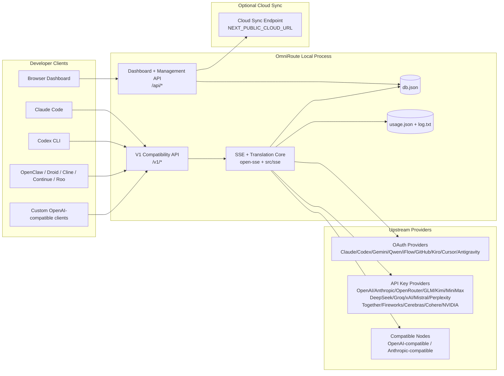
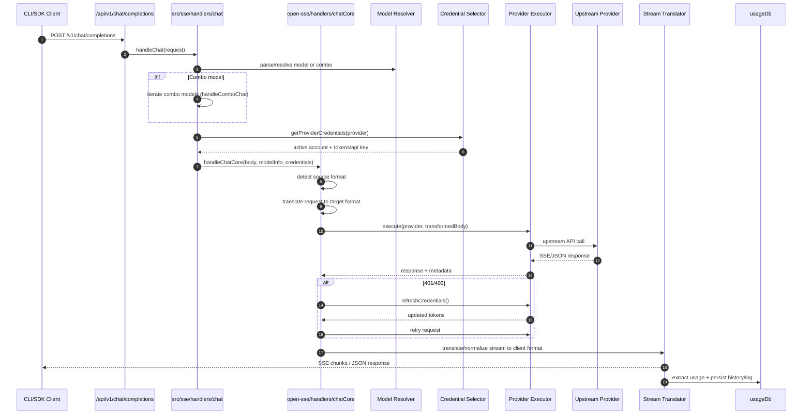
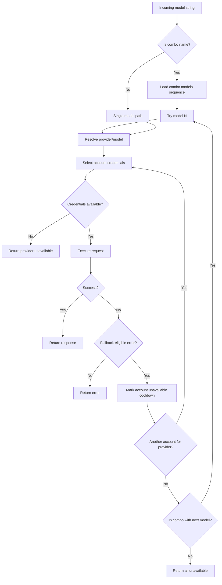
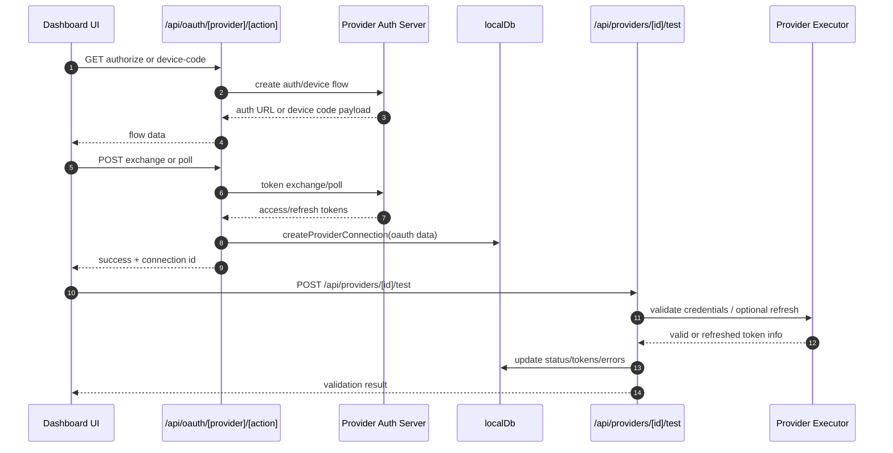
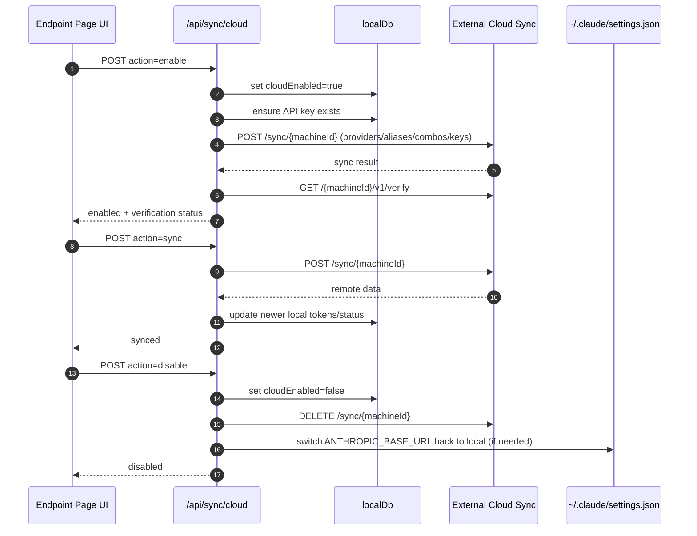
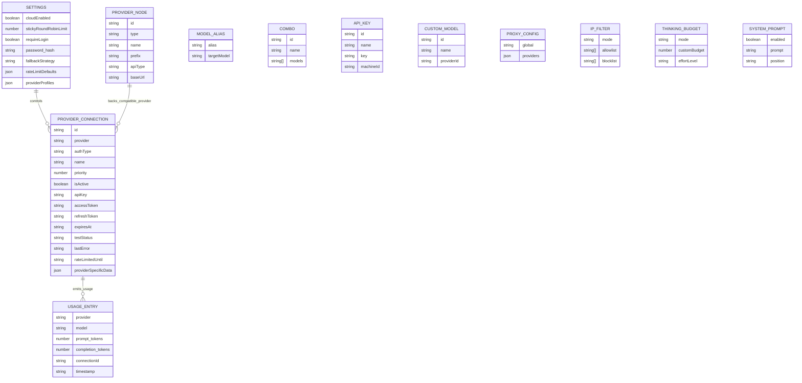
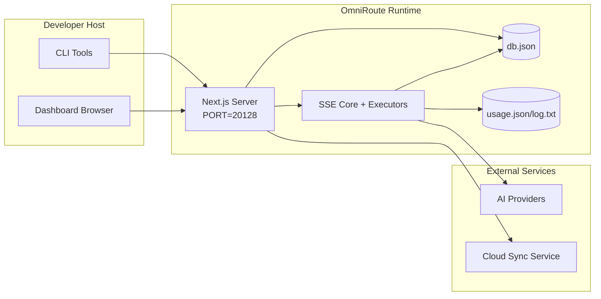

# OmniRoute-arkkitehtuuri

🌐 **Languages:** 🇺🇸 [English](../../ARCHITECTURE.md) | 🇧🇷 [Português (Brasil)](../pt-BR/ARCHITECTURE.md) | 🇪🇸 [Español](../es/ARCHITECTURE.md) | 🇫🇷 [Français](../fr/ARCHITECTURE.md) | 🇮🇹 [Italiano](../it/ARCHITECTURE.md) | 🇷🇺 [Русский](../ru/ARCHITECTURE.md) | 🇨🇳 [中文 (简体)](../zh-CN/ARCHITECTURE.md) | 🇩🇪 [Deutsch](../de/ARCHITECTURE.md) | 🇮🇳 [हिन्दी](../in/ARCHITECTURE.md) | 🇹🇭 [ไทย](../th/ARCHITECTURE.md) | 🇺🇦 [Українська](../uk-UA/ARCHITECTURE.md) | 🇸🇦 [العربية](../ar/ARCHITECTURE.md) | 🇯🇵 [日本語](../ja/ARCHITECTURE.md) | 🇻🇳 [Tiếng Việt](../vi/ARCHITECTURE.md) | 🇧🇬 [Български](../bg/ARCHITECTURE.md) | 🇩🇰 [Dansk](../da/ARCHITECTURE.md) | 🇫🇮 [Suomi](../fi/ARCHITECTURE.md) | 🇮🇱 [עברית](../he/ARCHITECTURE.md) | 🇭🇺 [Magyar](../hu/ARCHITECTURE.md) | 🇮🇩 [Bahasa Indonesia](../id/ARCHITECTURE.md) | 🇰🇷 [한국어](../ko/ARCHITECTURE.md) | 🇲🇾 [Bahasa Melayu](../ms/ARCHITECTURE.md) | 🇳🇱 [Nederlands](../nl/ARCHITECTURE.md) | 🇳🇴 [Norsk](../no/ARCHITECTURE.md) | 🇵🇹 [Português (Portugal)](../pt/ARCHITECTURE.md) | 🇷🇴 [Română](../ro/ARCHITECTURE.md) | 🇵🇱 [Polski](../pl/ARCHITECTURE.md) | 🇸🇰 [Slovenčina](../sk/ARCHITECTURE.md) | 🇸🇪 [Svenska](../sv/ARCHITECTURE.md) | 🇵🇭 [Filipino](../phi/ARCHITECTURE.md)

_Viimeksi päivitetty: 2026-02-18_

## Tiivistelmä

OmniRoute on paikallinen AI-reititysyhdyskäytävä ja kojelauta, joka on rakennettu Next.js:lle.
Se tarjoaa yhden OpenAI-yhteensopivan päätepisteen (`/v1/*`) ja reitittää liikenteen useiden alkupään palveluntarjoajien kesken kääntämisen, varaosion, tunnuksen päivityksen ja käytön seurannan avulla.

Ydinominaisuudet:

- OpenAI-yhteensopiva API-pinta CLI:lle/työkaluille (28 toimittajaa)
- Pyydä/vastaa käännös palveluntarjoajan eri formaattien välillä
- Mallin yhdistelmävara (usean mallin sarja)
- Tilitason varatoiminto (usea tili palveluntarjoajaa kohti)
- OAuth + API-avain tarjoajan yhteyden hallinta
- Upotus sukupolvi `/v1/embeddings`:n kautta (6 toimittajaa, 9 mallia)
- Kuvien luominen `/v1/images/generations`:n kautta (4 toimittajaa, 9 mallia)
- Ajattele tagien jäsentämistä (`<think>...</think>`) päättelymalleille
- Vastauksen desinfiointi tiukan OpenAI SDK -yhteensopivuuden takaamiseksi
- Roolien normalisointi (kehittäjä→järjestelmä, järjestelmä→käyttäjä) palveluntarjoajien välistä yhteensopivuutta varten
- Strukturoitu lähdön muunnos (json_schema → Gemini responseSchema)
- Paikallinen pysyvyys tarjoajille, avaimille, aliaksille, yhdistelmille, asetuksille, hinnoittelulle
- Käytön/kustannusten seuranta ja pyyntöjen kirjaaminen
- Valinnainen pilvisynkronointi usean laitteen/tilan synkronointiin
- IP-sallitut / estolistat API-käyttöoikeuksien hallinnassa
- Ajatteleva budjetin hallinta (passthrough/auto/mukautettu/adaptiivinen)
- Globaali järjestelmän nopea ruiskutus
- Istunnon seuranta ja sormenjäljet
- Tilikohtainen tehostettu hintarajoitus tarjoajakohtaisilla profiileilla
- Katkaisijakuvio palveluntarjoajan joustavuuden parantamiseksi
- Ukkosta estävä laumasuoja mutex-lukolla
- Allekirjoituspohjainen pyyntöjen duplikoinnin välimuisti
- Verkkotunnustaso: mallin saatavuus, hintasäännöt, varakäytäntö, lukituskäytäntö
- Verkkotunnuksen tilan pysyvyys (SQLite-kirjoitusvälimuisti varauksille, budjeteille, lukituksille, katkaisimille)
- Käytäntömoottori keskitettyä pyyntöjen arviointia varten (sulku → budjetti → vara)
- Pyydä telemetriaa p50/p95/p99-latenssiaggregaatiolla
- Korrelaatiotunnus (X-Request-Id) päästä päähän -jäljitykseen
- Vaatimustenmukaisuuden tarkastuksen kirjaaminen ja opt-out API-avaimella
- Eval-kehys LLM-laadunvarmistukseen
- Joustavan käyttöliittymän kojelauta, jossa on reaaliaikainen katkaisijatila
- Modulaariset OAuth-palveluntarjoajat (12 yksittäistä moduulia alla `src/lib/oauth/providers/`)

Ensisijainen suoritusaikamalli:

- Next.js-sovellusreitit `src/app/api/*` -sovelluksessa toteuttavat sekä hallintapaneelin sovellusliittymiä että yhteensopivuussovellusliittymiä
- Jaettu SSE/reititysydin kohteissa `src/sse/*` + `open-sse/*` hoitaa palveluntarjoajan suorittamisen, käännöksen, suoratoiston, varatoiminnon ja käytön

## Laajuus ja rajat

### Soveltamisalalla

- Paikallisen yhdyskäytävän suoritusaika
- Kojelaudan hallintasovellusliittymät
- Palveluntarjoajan todennus ja tunnuksen päivitys
- Pyydä käännöstä ja SSE-suoratoistoa
- Paikallinen tila + käytön pysyvyys
- Valinnainen pilvisynkronointiorkesteri

### Soveltamisalan ulkopuolella

- Pilvipalvelun toteutus `NEXT_PUBLIC_CLOUD_URL`:n takana
- Palveluntarjoajan SLA/ohjaustaso paikallisen prosessin ulkopuolella
- Itse ulkoiset CLI-binaarit (Claude CLI, Codex CLI jne.)

## Korkean tason järjestelmäkonteksti



## Suorituksenaikaiset ydinkomponentit

## 1) API ja reitityskerros (Next.js App Routes)

Päähakemistot:

- `src/app/api/v1/*` ja `src/app/api/v1beta/*` yhteensopiville sovellusliittymille
- `src/app/api/*` hallinta-/määrityssovellusliittymille
- Seuraavaksi kirjoitetaan uudelleen `next.config.mjs` kartassa `/v1/*` arvoon `/api/v1/*`

Tärkeitä yhteensopivuusreittejä:

- `src/app/api/v1/chat/completions/route.ts`
- `src/app/api/v1/messages/route.ts`
- `src/app/api/v1/responses/route.ts`
- `src/app/api/v1/models/route.ts` - sisältää mukautettuja malleja, joissa on `custom: true`
- `src/app/api/v1/embeddings/route.ts` - upottaminen (6 palveluntarjoajaa)
- `src/app/api/v1/images/generations/route.ts` — kuvan luominen (4+ tarjoajaa, mukaan lukien Antigravity/Nebius)
- `src/app/api/v1/messages/count_tokens/route.ts`
- `src/app/api/v1/providers/[provider]/chat/completions/route.ts` - palveluntarjoajakohtainen keskustelu
- `src/app/api/v1/providers/[provider]/embeddings/route.ts` – omat palveluntarjoajakohtaiset upotukset
- `src/app/api/v1/providers/[provider]/images/generations/route.ts` – palveluntarjoajakohtaiset kuvat
- `src/app/api/v1beta/models/route.ts`
- `src/app/api/v1beta/models/[...path]/route.ts`

Hallintoverkkotunnukset:

- Todennus/asetukset: `src/app/api/auth/*`, `src/app/api/settings/*`
- Palveluntarjoajat/yhteydet: `src/app/api/providers*`
- Palveluntarjoajan solmut: `src/app/api/provider-nodes*`
- Mukautetut mallit: `src/app/api/provider-models` (GET/POST/DELETE)
- Malliluettelo: `src/app/api/models/catalog` (GET)
- Välityspalvelimen kokoonpano: `src/app/api/settings/proxy` (GET/PUT/DELETE) + `src/app/api/settings/proxy/test` (POST)
- OAuth: `src/app/api/oauth/*`
- Avaimet/aliakset/kombot/hinnoittelu: `src/app/api/keys*`, `src/app/api/models/alias`, `src/app/api/combos*`, `src/app/api/pricing`
- Käyttö: `src/app/api/usage/*`
- Synkronointi/pilvi: `src/app/api/sync/*`, `src/app/api/cloud/*`
- CLI-työkalujen avustajat: `src/app/api/cli-tools/*`
- IP-suodatin: `src/app/api/settings/ip-filter` (GET/PUT)
- Arvioitu budjetti: `src/app/api/settings/thinking-budget` (GET/PUT)
- Järjestelmäkehote: `src/app/api/settings/system-prompt` (GET/PUT)
- Istunnot: `src/app/api/sessions` (GET)
- Hintarajoitukset: `src/app/api/rate-limits` (GET)
- Joustavuus: `src/app/api/resilience` (GET/PATCH) – palveluntarjoajan profiilit, katkaisija, nopeusrajoitustila
- Kestävyyden nollaus: `src/app/api/resilience/reset` (POST) - nollaa katkaisijat + jäähdytys
- Välimuistitilastot: `src/app/api/cache/stats` (GET/DELETE)
- Mallin saatavuus: `src/app/api/models/availability` (GET/POST)
- Telemetria: `src/app/api/telemetry/summary` (GET)
- Budjetti: `src/app/api/usage/budget` (GET/POST)
- Varaketjut: `src/app/api/fallback/chains` (GET/POST/DELETE)
- Vaatimustenmukaisuustarkastus: `src/app/api/compliance/audit-log` (GET)
- Arvot: `src/app/api/evals` (GET/POST), `src/app/api/evals/[suiteId]` (GET)
- Käytännöt: `src/app/api/policies` (GET/POST)

## 2) SSE + Käännösydin

Päävirtausmoduulit:

- Merkintä: `src/sse/handlers/chat.ts`
- Ydinorkesteri: `open-sse/handlers/chatCore.ts`
- Palveluntarjoajan suoritussovittimet: `open-sse/executors/*`
- Muototunnistuksen/palveluntarjoajan määritykset: `open-sse/services/provider.ts`
- Mallin jäsennys/selvitys: `src/sse/services/model.ts`, `open-sse/services/model.ts`
- Tilin varalogiikka: `open-sse/services/accountFallback.ts`
- Käännösrekisteri: `open-sse/translator/index.ts`
- Suoratoistomuunnokset: `open-sse/utils/stream.ts`, `open-sse/utils/streamHandler.ts`
- Käytön purkaminen/normalisointi: `open-sse/utils/usageTracking.ts`
- Think tag -jäsennin: `open-sse/utils/thinkTagParser.ts`
- Upotuskäsittelijä: `open-sse/handlers/embeddings.ts`
- Upotuspalveluntarjoajan rekisteri: `open-sse/config/embeddingRegistry.ts`
- Kuvanluontikäsittelijä: `open-sse/handlers/imageGeneration.ts`
- Kuvantarjoajan rekisteri: `open-sse/config/imageRegistry.ts`
- Vastauksen desinfiointi: `open-sse/handlers/responseSanitizer.ts`
- Roolin normalisointi: `open-sse/services/roleNormalizer.ts`

Palvelut (liiketoimintalogiikka):

- Tilin valinta/pisteytys: `open-sse/services/accountSelector.ts`
- Kontekstin elinkaarihallinta: `open-sse/services/contextManager.ts`
- IP-suodattimen valvonta: `open-sse/services/ipFilter.ts`
- Istunnon seuranta: `open-sse/services/sessionManager.ts`
- Pyydä kopioiden poistoa: `open-sse/services/signatureCache.ts`
- Järjestelmäkehotteen lisäys: `open-sse/services/systemPrompt.ts`
- Ajatteleva budjetin hallinta: `open-sse/services/thinkingBudget.ts`
- Jokerimerkkimallin reititys: `open-sse/services/wildcardRouter.ts`
- Hintarajoitusten hallinta: `open-sse/services/rateLimitManager.ts`
- Katkaisija: `open-sse/services/circuitBreaker.ts`

Domain-kerroksen moduulit:

- Mallin saatavuus: `src/lib/domain/modelAvailability.ts`
- Kustannussäännöt/budjetit: `src/lib/domain/costRules.ts`
- Varakäytäntö: `src/lib/domain/fallbackPolicy.ts`
- Yhdistelmäratkaisu: `src/lib/domain/comboResolver.ts`
- Lukituskäytäntö: `src/lib/domain/lockoutPolicy.ts`
- Käytäntömoottori: `src/domain/policyEngine.ts` — keskitetty lukitus → budjetti → varaarviointi
- Virhekoodiluettelo: `src/lib/domain/errorCodes.ts`
- Pyynnön tunnus: `src/lib/domain/requestId.ts`
- Noudon aikakatkaisu: `src/lib/domain/fetchTimeout.ts`
- Pyydä telemetriaa: `src/lib/domain/requestTelemetry.ts`
- Vaatimustenmukaisuus/tarkastus: `src/lib/domain/compliance/index.ts`
- Eval juoksija: `src/lib/domain/evalRunner.ts`
- Verkkotunnuksen tilan pysyvyys: `src/lib/db/domainState.ts` — SQLite CRUD varaketjuille, budjeteille, kustannushistorialle, lukitustilalle, katkaisimille

OAuth-palveluntarjoajan moduulit (12 yksittäistä tiedostoa kohdassa `src/lib/oauth/providers/`):

- Rekisterihakemisto: `src/lib/oauth/providers/index.ts`
- Yksittäiset palveluntarjoajat: `claude.ts`, `codex.ts`, `gemini.ts`, `antigravity.ts`, `iflow.ts`, ,\_1 `kimi-coding.ts`, `github.ts`, `kiro.ts`, `cursor.ts`, `kilocode.ts`, `cline.ts`
- Ohut kääre: `src/lib/oauth/providers.ts` - jälleenvienti yksittäisistä moduuleista

## 3) Pysyvyyskerros

Ensisijainen tila DB:

- `src/lib/localDb.ts`
- tiedosto: `${DATA_DIR}/db.json` (tai `$XDG_CONFIG_HOME/omniroute/db.json`, kun se on asetettu, muuten `~/.omniroute/db.json`)
- entiteetit: providerConnections, providerNodes, mallialiakset, yhdistelmät, apiKeys, asetukset, hinnoittelu, **customModels**, **proxyConfig**, **ipFilter**, **thhinkingBudget**, **systemPrompt**

DB:n käyttö:

- `src/lib/usageDb.ts`
- tiedostot: `${DATA_DIR}/usage.json`, `${DATA_DIR}/log.txt`, `${DATA_DIR}/call_logs/`
- noudattaa samaa perushakemistokäytäntöä kuin `localDb` (`DATA_DIR`, sitten `XDG_CONFIG_HOME/omniroute`, kun se on asetettu)
- jaettu kohdistetuiksi alamoduuleiksi: `migrations.ts`, `usageHistory.ts`, `costCalculator.ts`, `usageStats.ts`, `callLogs.ts`

Domain State DB (SQLite):

- `src/lib/db/domainState.ts` - CRUD-toiminnot toimialueen tilassa
- Taulukot (luotu `src/lib/db/core.ts`): `domain_fallback_chains`, `domain_budgets`, `domain_cost_history`, `domain_lockout_state`,
- Kirjoitusvälimuistin malli: muistissa olevat kartat ovat arvovaltaisia ajon aikana; mutaatiot kirjoitetaan synkronisesti SQLiten kanssa; tila palautetaan DB:stä kylmäkäynnistyksen yhteydessä

## 4) Auth + Security Surfaces

- Hallintapaneelin evästeiden todennus: `src/proxy.ts`, `src/app/api/auth/login/route.ts`
- API-avaimen luominen/vahvistus: `src/shared/utils/apiKey.ts`
- Palveluntarjoajan salaisuudet säilyivät `providerConnections` tiedoissa
- Lähtevän välityspalvelimen tuki `open-sse/utils/proxyFetch.ts` (env vars) ja `open-sse/utils/networkProxy.ts` (määritettävä palveluntarjoajakohtaisesti tai globaali) kautta

## 5) Cloud Sync

- Aikataulun aloitus: `src/lib/initCloudSync.ts`, `src/shared/services/initializeCloudSync.ts`
- Säännöllinen tehtävä: `src/shared/services/cloudSyncScheduler.ts`
- Ohjausreitti: `src/app/api/sync/cloud/route.ts`

## Pyynnön elinkaari (`/v1/chat/completions`)



## Yhdistelmä + tilin varavirta



Varapäätökset tehdään `open-sse/services/accountFallback.ts`:n avulla tilakoodeja ja virheviestiheuristiikkaa käyttämällä.

## OAuthin käyttöönotto ja tunnuksen päivityksen elinkaari



Päivitys reaaliaikaisen liikenteen aikana suoritetaan `open-sse/handlers/chatCore.ts` -suorittimen `refreshCredentials()` sisällä.

## Cloud Sync -elinkaari (Ota käyttöön / Synkronoi / Poista käytöstä)



Jaksottaisen synkronoinnin käynnistää `CloudSyncScheduler`, kun pilvi on käytössä.

## Tietomalli ja tallennuskartta



Fyysiset tallennustiedostot:

- päätila: `${DATA_DIR}/db.json` (tai `$XDG_CONFIG_HOME/omniroute/db.json`, kun se on asetettu, muuten `~/.omniroute/db.json`)
- käyttötilastot: `${DATA_DIR}/usage.json`
- pyyntölokin rivit: `${DATA_DIR}/log.txt`
- valinnainen kääntäjä/pyydä virheenkorjausistuntoja: `<repo>/logs/...`

## Käyttöönoton topologia



## Moduulikartoitus (päätöskriittinen)

### Reitti- ja API-moduulit

- `src/app/api/v1/*`, `src/app/api/v1beta/*`: yhteensopivuussovellusliittymät
- `src/app/api/v1/providers/[provider]/*`: omat palveluntarjoajakohtaiset reitit (chat, upotukset, kuvat)
- `src/app/api/providers*`: palveluntarjoajan CRUD, validointi, testaus
- `src/app/api/provider-nodes*`: mukautettu yhteensopiva solmuhallinta
- `src/app/api/provider-models`: mukautetun mallin hallinta (CRUD)
- `src/app/api/models/catalog`: täydellinen malliluettelosovellusliittymä (kaikki tyypit ryhmitelty tarjoajan mukaan)
- `src/app/api/oauth/*`: OAuth-/laitekoodivirrat
- `src/app/api/keys*`: paikallisen API-avaimen elinkaari
- `src/app/api/models/alias`: aliaksen hallinta
- `src/app/api/combos*`: varayhdistelmähallinta
- `src/app/api/pricing`: hinnoittelun ohitukset kustannuslaskennassa
- `src/app/api/settings/proxy`: välityspalvelimen määritys (GET/PUT/DELETE)
- `src/app/api/settings/proxy/test`: lähtevän välityspalvelimen yhteystesti (POST)
- `src/app/api/usage/*`: käyttö- ja lokisovellusliittymät
- `src/app/api/sync/*` + `src/app/api/cloud/*`: pilvisynkronointi ja pilveen suuntautuvat apulaiset
- `src/app/api/cli-tools/*`: paikalliset CLI-asetusten kirjoittajat/tarkistajat
- `src/app/api/settings/ip-filter`: IP-sallittu/estolista (GET/PUT)
- `src/app/api/settings/thinking-budget`: ajattelutunnuksen budjettimääritys (GET/PUT)
- `src/app/api/settings/system-prompt`: yleinen järjestelmäkehote (GET/PUT)
- `src/app/api/sessions`: aktiivisen istunnon luettelo (GET)
- `src/app/api/rate-limits`: tilikohtainen korkorajoitustila (GET)

### Reititys- ja suoritusydin

- `src/sse/handlers/chat.ts`: pyynnön jäsennys, yhdistelmäkäsittely, tilin valintasilmukka
- `open-sse/handlers/chatCore.ts`: käännös, suorittajan lähettäminen, uudelleenyritysten/päivitysten käsittely, streamin määritys
- `open-sse/executors/*`: palveluntarjoajakohtainen verkko- ja muotokäyttäytyminen

### Käännösrekisteri ja muotomuuntimet

- `open-sse/translator/index.ts`: kääntäjän rekisteri ja orkestrointi
- Pyydä kääntäjiä: `open-sse/translator/request/*`
- Vastausten kääntäjät: `open-sse/translator/response/*`
- Muotovakiot: `open-sse/translator/formats.ts`

### Pysyvyys

- `src/lib/localDb.ts`: pysyvä kokoonpano/tila
- `src/lib/usageDb.ts`: käyttöhistoria ja rullaavat pyyntölokit

## Palveluntarjoajan kattavuus (strategiamalli)

Jokaisella palveluntarjoajalla on erikoistunut suorittaja, joka laajentaa `BaseExecutor` (kohdassa `open-sse/executors/base.ts`), joka tarjoaa URL-osoitteen rakentamisen, otsikon rakentamisen, uudelleenyrityksen eksponentiaalisella perääntymisellä, valtuustietojen päivityskoukut ja `execute()`-orkesterimenetelmän.

| Toteuttaja            | Palveluntarjoaja(t)                                                                                                                                           | Erikoiskäsittely                                                                      |
| --------------------- | ------------------------------------------------------------------------------------------------------------------------------------------------------------- | ------------------------------------------------------------------------------------- |
| `DefaultExecutor`     | OpenAI, Claude, Gemini, Qwen, iFlow, OpenRouter, GLM, Kimi, MiniMax, DeepSeek, Groq, xAI, Mistral, Perplexity, Together, ilotulitus, Cerebras, Cohere, NVIDIA | Dynaaminen URL-/otsikkomääritykset tarjoajakohtaisesti                                |
| `AntigravityExecutor` | Google Antigravity                                                                                                                                            | Mukautetut projekti-/istuntotunnukset, Yritä uudelleen jäsentämisen jälkeen           |
| `CodexExecutor`       | OpenAI Codex                                                                                                                                                  | Syöttää järjestelmäohjeita, pakottaa päättelyponnistuksen                             |
| `CursorExecutor`      | Kohdistin IDE                                                                                                                                                 | ConnectRPC-protokolla, Protobuf-koodaus, pyynnön allekirjoitus tarkistussumman kautta |
| `GithubExecutor`      | GitHub Copilot                                                                                                                                                | Copilot-tunnuksen päivitys, VSC-koodia jäljittelevät otsikot                          |
| `KiroExecutor`        | AWS CodeWhisperer/Kiro                                                                                                                                        | AWS EventStream binaarimuoto → SSE-muunnos                                            |
| `GeminiCLIExecutor`   | Gemini CLI                                                                                                                                                    | Google OAuth -tunnuksen päivitysjakso                                                 |

Kaikki muut palveluntarjoajat (mukaan lukien mukautetut yhteensopivat solmut) käyttävät `DefaultExecutor`.

## Tarjoajan yhteensopivuusmatriisi

| Palveluntarjoaja | Muoto             | Auth                      | Striimaa             | Ei-stream | Token Refresh | Käyttösovellusliittymä      |
| ---------------- | ----------------- | ------------------------- | -------------------- | --------- | ------------- | --------------------------- |
| Claude           | claude            | API-avain / OAuth         | ✅                   | ✅        | ✅            | ⚠️ Vain järjestelmänvalvoja |
| Kaksoset         | kaksoset          | API-avain / OAuth         | ✅                   | ✅        | ✅            | ⚠️ Cloud Console            |
| Gemini CLI       | gemini-cli        | OAuth                     | ✅                   | ✅        | ✅            | ⚠️ Cloud Console            |
| Antigravitaatio  | antigravitaatio   | OAuth                     | ✅                   | ✅        | ✅            | ✅ Full quota API           |
| OpenAI           | openai            | API-avain                 | ✅                   | ✅        | ❌            | ❌                          |
| Codex            | openai-vastaukset | OAuth                     | ✅ pakotettu         | ❌        | ✅            | ✅ Hintarajat               |
| GitHub Copilot   | openai            | OAuth + Copilot Token     | ✅                   | ✅        | ✅            | ✅ Kiintiön tilannekuvat    |
| Kursori          | kohdistin         | Mukautettu tarkistussumma | ✅                   | ✅        | ❌            | ❌                          |
| Kiro             | kiro              | AWS SSO OIDC              | ✅ (TapahtumaStream) | ❌        | ✅            | ✅ Käyttörajoitukset        |
| Qwen             | openai            | OAuth                     | ✅                   | ✅        | ✅            | ⚠️ Pyynnöstä                |
| iFlow            | openai            | OAuth (Perus)             | ✅                   | ✅        | ✅            | ⚠️ Pyynnöstä                |
| OpenRouter       | openai            | API-avain                 | ✅                   | ✅        | ❌            | ❌                          |
| GLM/Kimi/MiniMax | claude            | API-avain                 | ✅                   | ✅        | ❌            | ❌                          |
| DeepSeek         | openai            | API-avain                 | ✅                   | ✅        | ❌            | ❌                          |
| Groq             | openai            | API-avain                 | ✅                   | ✅        | ❌            | ❌                          |
| xAI (Grok)       | openai            | API-avain                 | ✅                   | ✅        | ❌            | ❌                          |
| Mistral          | openai            | API-avain                 | ✅                   | ✅        | ❌            | ❌                          |
| Hämmennys        | openai            | API-avain                 | ✅                   | ✅        | ❌            | ❌                          |
| Yhdessä AI       | openai            | API-avain                 | ✅                   | ✅        | ❌            | ❌                          |
| Ilotulitus AI    | openai            | API-avain                 | ✅                   | ✅        | ❌            | ❌                          |
| Aivot            | openai            | API-avain                 | ✅                   | ✅        | ❌            | ❌                          |
| Cohere           | openai            | API-avain                 | ✅                   | ✅        | ❌            | ❌                          |
| NVIDIA NIM       | openai            | API-avain                 | ✅                   | ✅        | ❌            | ❌                          |

## Käännösten muoto

Havaittuja lähdemuotoja ovat:

- `openai`
- `openai-responses`
- `claude`
- `gemini`

Kohdemuotoja ovat:

- OpenAI chat / vastaukset
- Claude
- Gemini/Gemini-CLI/Antigravity-kuori
- Kiro
- Kursori

Käännöksissä käytetään keskitinmuotona **OpenAI-muotoa** — kaikki konversiot menevät OpenAI:n kautta välimuotona:

```
Source Format → OpenAI (hub) → Target Format
```

Käännökset valitaan dynaamisesti lähteen hyötykuorman muodon ja toimittajan kohdemuodon perusteella.

Muut käsittelytasot käännösputkessa:

- **Vastausten puhdistaminen** – Poistaa standardista poikkeavat kentät OpenAI-muotoisista vastauksista (sekä suoratoistosta että ei-suoratoistosta) varmistaakseen tiukan SDK-yhteensopivuuden
- **Roolin normalisointi** — Muuntaa `developer` → `system` muille kuin OpenAI-kohteille; yhdistää `system` → `user` malleille, jotka hylkäävät järjestelmäroolin (GLM, ERNIE)
- **Ajattele tunnisteen purkamista** — jäsentää `<think>...</think>` lohkoa sisällöstä kenttään `reasoning_content`
- **Strukturoitu tulos** — Muuntaa OpenAI `response_format.json_schema` Geminin `responseMimeType` + `responseSchema`

## Tuetut API-päätepisteet

| Päätepiste                                         | Muoto                        | Käsittelijä                                           |
| -------------------------------------------------- | ---------------------------- | ----------------------------------------------------- |
| `POST /v1/chat/completions`                        | OpenAI Chat                  | `src/sse/handlers/chat.ts`                            |
| `POST /v1/messages`                                | Claude Viestit               | Sama käsittelijä (tunnistettu automaattisesti)        |
| `POST /v1/responses`                               | OpenAI-vastaukset            | `open-sse/handlers/responsesHandler.ts`               |
| `POST /v1/embeddings`                              | OpenAI Embeddings            | `open-sse/handlers/embeddings.ts`                     |
| `GET /v1/embeddings`                               | Malliluettelo                | API reitti                                            |
| `POST /v1/images/generations`                      | OpenAI-kuvat                 | `open-sse/handlers/imageGeneration.ts`                |
| `GET /v1/images/generations`                       | Malliluettelo                | API reitti                                            |
| `POST /v1/providers/{provider}/chat/completions`   | OpenAI Chat                  | Palveluntarjoajakohtainen mallin validointi           |
| `POST /v1/providers/{provider}/embeddings`         | OpenAI Embeddings            | Palveluntarjoajakohtainen mallin validointi           |
| `POST /v1/providers/{provider}/images/generations` | OpenAI-kuvat                 | Palveluntarjoajakohtainen mallin validointi           |
| `POST /v1/messages/count_tokens`                   | Claude Token Count           | API reitti                                            |
| `GET /v1/models`                                   | OpenAI-mallien luettelo      | API-reitti (chat + upotus + kuva + mukautetut mallit) |
| `GET /api/models/catalog`                          | Luettelo                     | Kaikki mallit ryhmitelty tarjoajan + tyypin mukaan    |
| `POST /v1beta/models/*:streamGenerateContent`      | Gemini syntyperäinen         | API reitti                                            |
| `GET/PUT/DELETE /api/settings/proxy`               | Välityspalvelimen kokoonpano | Verkon välityspalvelimen määritykset                  |
| `POST /api/settings/proxy/test`                    | Välityspalvelinyhteydet      | Välityspalvelimen kunto/yhteystestin päätepiste       |
| `GET/POST/DELETE /api/provider-models`             | Mukautetut mallit            | Mukautetun mallin hallinta toimittajaa kohden         |

## Ohituskäsittelijä

Ohituskäsittelijä (`open-sse/utils/bypassHandler.ts`) sieppaa Claude CLI:n tunnetut "poistopyynnöt" – lämmittelypingit, otsikon poiminnot ja tunnukset - ja palauttaa **väärennetyn vastauksen** kuluttamatta ylävirran toimittajatunnuksia. Tämä käynnistyy vain, kun `User-Agent` sisältää `claude-cli`.

## Pyydä Logger Pipeline

Pyyntöloggeri (`open-sse/utils/requestLogger.ts`) tarjoaa 7-vaiheisen virheenkorjauslokiputken, joka on oletuksena poistettu käytöstä ja otettu käyttöön `ENABLE_REQUEST_LOGS=true`:n kautta:

```
1_req_client.json → 2_req_source.json → 3_req_openai.json → 4_req_target.json
→ 5_res_provider.txt → 6_res_openai.txt → 7_res_client.txt
```

Tiedostot kirjoitetaan osoitteeseen `<repo>/logs/<session>/` jokaista pyyntöistuntoa varten.

## Vikatilat ja joustavuus

## 1) Tilin/palveluntarjoajan saatavuus

- Palveluntarjoajan tilin jäähtyminen ohimenevien / nopeus / todennusvirheiden vuoksi
- tilin varaosa ennen epäonnistunutta pyyntöä
- Yhdistelmämallin palautus, kun nykyisen mallin/palveluntarjoajan polku on käytetty loppuun

## 2) Tokenin vanheneminen

- esitarkista ja päivitä yrittämällä uudelleen päivitettävien palveluntarjoajien kohdalla
- 401/403 yritä uudelleen päivitysyrityksen jälkeen ydinpolulla

## 3) Stream Safety

- irrotettava stream-ohjain
- käännösvirta streamin lopun huuhtelemalla ja `[DONE]` käsittelyllä
- käyttöarvion varavaihtoehto, kun palveluntarjoajan käytön metatiedot puuttuvat

## 4) Pilvisynkronoinnin heikkeneminen

- Synkronointivirheet tulevat esiin, mutta paikallinen suoritusaika jatkuu
- ajastimessa on uudelleenyrityslogiikka, mutta säännöllinen suoritus tällä hetkellä kutsuu oletusarvoisesti yhden yrityksen synkronointia

## 5) Tietojen eheys

- DB-muodon siirto/korjaus puuttuviin avaimiin
- Vioittuneet JSON-nollaussuojat localDb:lle ja usageDb:lle

## Havaittavuus ja toimintasignaalit

Ajonaikaisen näkyvyyden lähteet:

- konsolin lokit lähteestä `src/sse/utils/logger.ts`
- pyyntökohtaiset käyttöaggregaatit kohteessa `usage.json`
- tekstimuotoisen pyynnön tilakirjautuminen `log.txt`
- valinnaiset syväpyyntö-/käännöslokit kohdassa `logs/`, kun `ENABLE_REQUEST_LOGS=true`
- hallintapaneelin käytön päätepisteet (`/api/usage/*`) käyttöliittymän käyttöä varten

## Turvallisuusherkät rajat

- JWT-salaisuus (`JWT_SECRET`) suojaa hallintapaneelin istunnon evästeen vahvistuksen/allekirjoituksen
- Alkuperäinen salasana (`INITIAL_PASSWORD`, oletus `123456`) on ohitettava todellisissa käyttöönotoissa
- API-avaimen HMAC-salaisuus (`API_KEY_SECRET`) suojaa luodun paikallisen API-avainmuodon
- Tarjoajan salaisuudet (API-avaimet/tunnisteet) säilyvät paikallisessa tietokannassa, ja ne tulee suojata tiedostojärjestelmätasolla
- Pilvisynkronoinnin päätepisteet perustuvat API-avaimen todennus + konetunnuksen semantiikkaan

## Ympäristö ja suoritusaikamatriisi

Koodin aktiivisesti käyttämät ympäristömuuttujat:

- Sovellus/todennus: `JWT_SECRET`, `INITIAL_PASSWORD`
- Tallennustila: `DATA_DIR`
- Yhteensopivan solmun käyttäytyminen: `ALLOW_MULTI_CONNECTIONS_PER_COMPAT_NODE`
- Valinnainen tallennuspohjan ohitus (Linux/macOS, kun `DATA_DIR` ei ole asetettu): `XDG_CONFIG_HOME`
- Suojaustiivistys: `API_KEY_SECRET`, `MACHINE_ID_SALT`
- Kirjautuminen: `ENABLE_REQUEST_LOGS`
- Synkronointi/pilvi-URL-osoite: `NEXT_PUBLIC_BASE_URL`, `NEXT_PUBLIC_CLOUD_URL`
- Lähtevä välityspalvelin: `HTTP_PROXY`, `HTTPS_PROXY`, `ALL_PROXY`, `NO_PROXY` ja pienillä kirjaimilla kirjoitetut versiot
- SOCKS5-ominaisuusliput: `ENABLE_SOCKS5_PROXY`, `NEXT_PUBLIC_ENABLE_SOCKS5_PROXY`
- Alusta/ajonaikaiset apuohjelmat (ei sovelluskohtaiset asetukset): `APPDATA`, `NODE_ENV`, `PORT`, `HOSTNAME`

## Tunnettuja arkkitehtonisia huomautuksia

1. `usageDb` ja `localDb` jakavat nyt saman perushakemistokäytännön (`DATA_DIR` -> `XDG_CONFIG_HOME/omniroute` -> `~/.omniroute`) vanhan tiedoston siirron kanssa.
2. `/api/v1/route.ts` palauttaa staattisen malliluettelon, eikä se ole `/v1/models`:n käyttämä päämallien lähde.
3. Pyyntöloggeri kirjoittaa täydet otsikot/runko, kun se on käytössä; käsittele lokihakemistoa arkaluontoisena.
4. Pilven toiminta riippuu oikeasta `NEXT_PUBLIC_BASE_URL`- ja pilvipäätepisteen saavutettavuudesta.
5. Hakemisto `open-sse/` julkaistaan ​​`@omniroute/open-sse` **npm-työtilapaketina**. Lähdekoodi tuo sen `@omniroute/open-sse/...`:n kautta (ratkaisi Next.js `transpilePackages`). Tämän asiakirjan tiedostopolut käyttävät edelleen hakemistonimeä `open-sse/` johdonmukaisuuden vuoksi.
6. Hallintapaneelin kaaviot käyttävät **Uudelleenkaavioita** (SVG-pohjainen) helppokäyttöisten, interaktiivisten analytiikkavisualisoinnit (mallien käyttöpalkkikaaviot, toimittajien erittelytaulukot onnistumisprosentteineen) varten.
7. E2E-testeissä käytetään **Playwrightia** (`tests/e2e/`), suoritetaan `npm run test:e2e`:n kautta. Yksikkötesteissä käytetään **Node.js-testirunneria** (`tests/unit/`), suoritetaan `npm run test:plan3`:n kautta. Lähdekoodi kohdassa `src/` on **TypeScript** (`.ts`/`.tsx`); `open-sse/`-työtila pysyy JavaScriptina (`.js`).
8. Asetukset-sivu on järjestetty viiteen välilehteen: Suojaus, Reititys (6 globaalia strategiaa: täytä ensin, round-robin, p2c, satunnainen, vähiten käytetty, kustannusoptimoitu), Resilience (muokattavat nopeusrajoitukset, katkaisija, käytännöt), AI (ajattelubudjetti, järjestelmäkehote, kehote välimuisti), Advanced (välityspalvelin).

## Toimintavarmennusten tarkistuslista

- Koonti lähteestä: `npm run build`
- Rakenna Docker-kuva: `docker build -t omniroute .`
- Aloita huolto ja varmista:
- `GET /api/settings`
- `GET /api/v1/models`
- CLI-kohteen perus-URL-osoitteen tulee olla `http://<host>:20128/v1`, kun `PORT=20128`
