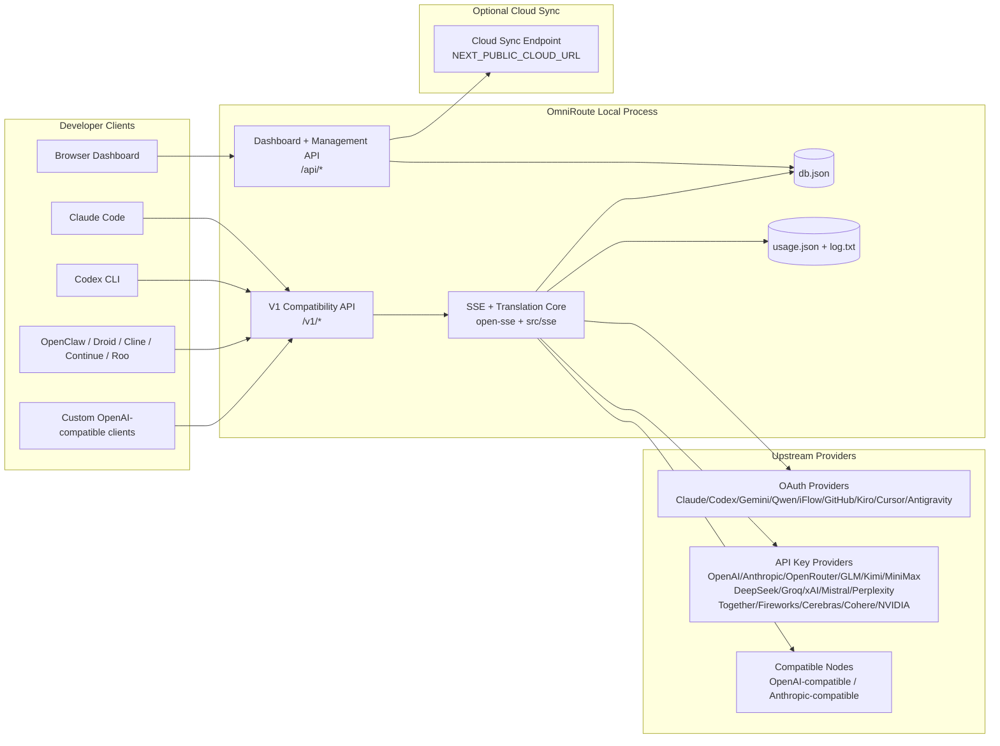
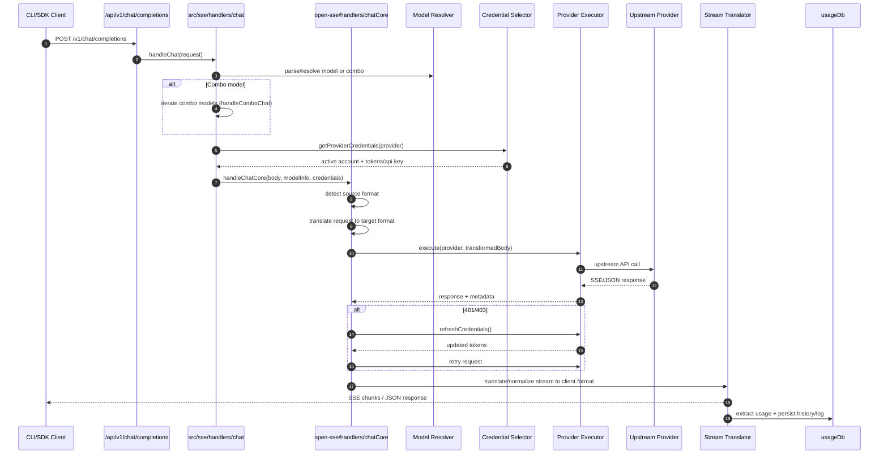
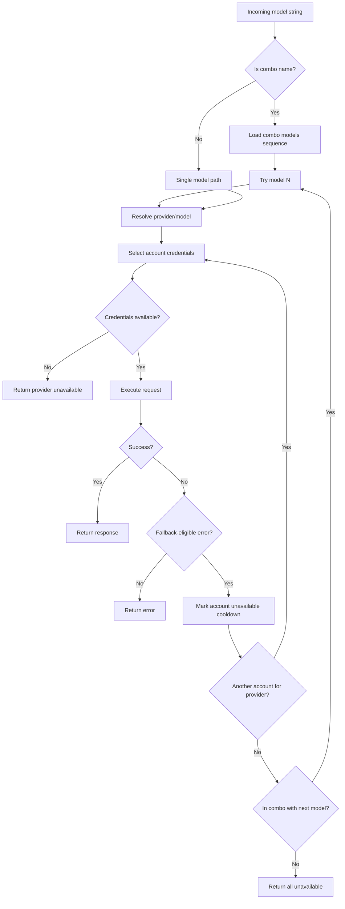
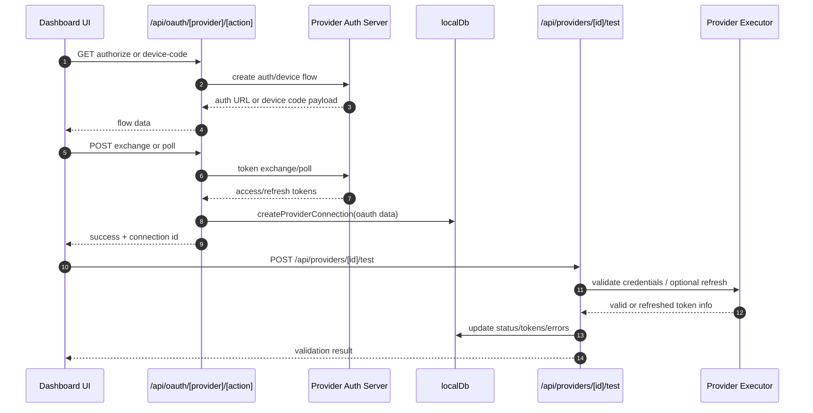
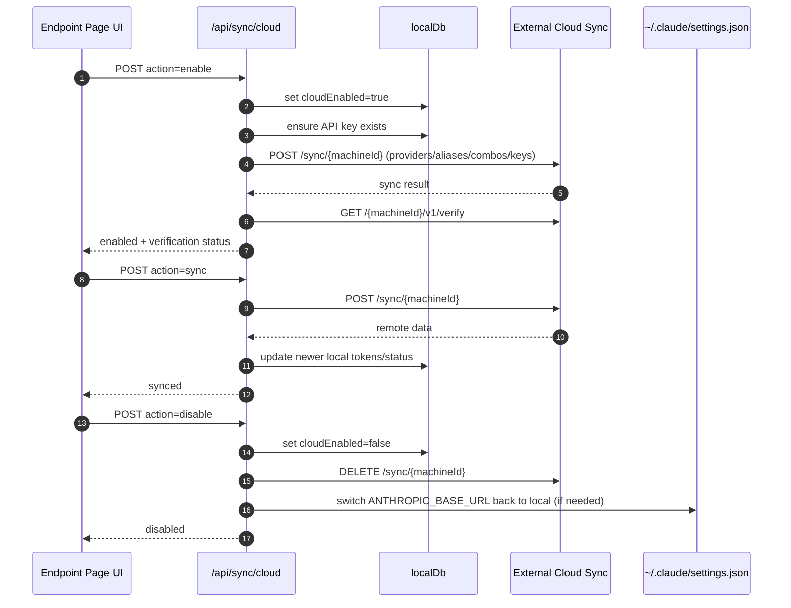
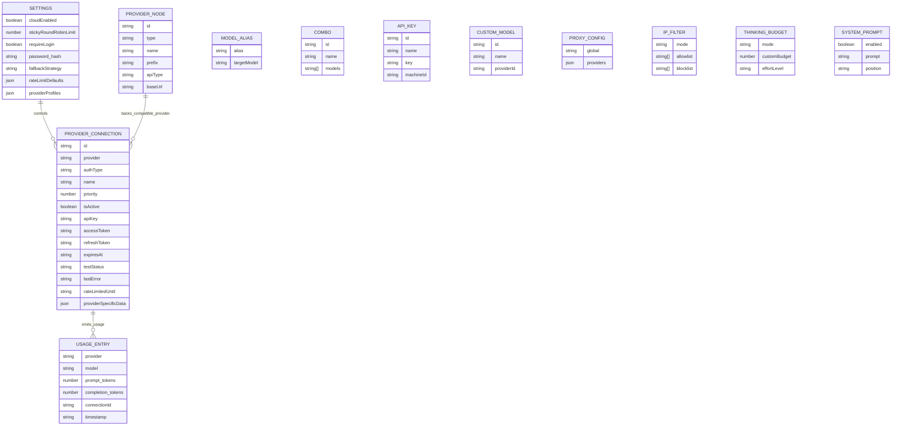
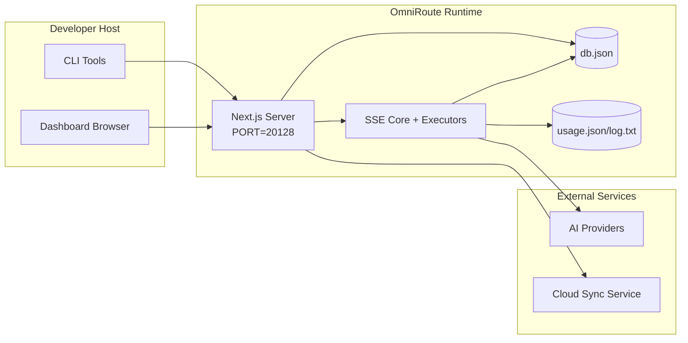

# Architecture OmniRoute

🌐 **Languages:** 🇺🇸 [English](../../ARCHITECTURE.md) | 🇧🇷 [Português (Brasil)](../pt-BR/ARCHITECTURE.md) | 🇪🇸 [Español](../es/ARCHITECTURE.md) | 🇫🇷 [Français](../fr/ARCHITECTURE.md) | 🇮🇹 [Italiano](../it/ARCHITECTURE.md) | 🇷🇺 [Русский](../ru/ARCHITECTURE.md) | 🇨🇳 [中文 (简体)](../zh-CN/ARCHITECTURE.md) | 🇩🇪 [Deutsch](../de/ARCHITECTURE.md) | 🇮🇳 [हिन्दी](../in/ARCHITECTURE.md) | 🇹🇭 [ไทย](../th/ARCHITECTURE.md) | 🇺🇦 [Українська](../uk-UA/ARCHITECTURE.md) | 🇸🇦 [العربية](../ar/ARCHITECTURE.md) | 🇯🇵 [日本語](../ja/ARCHITECTURE.md) | 🇻🇳 [Tiếng Việt](../vi/ARCHITECTURE.md) | 🇧🇬 [Български](../bg/ARCHITECTURE.md) | 🇩🇰 [Dansk](../da/ARCHITECTURE.md) | 🇫🇮 [Suomi](../fi/ARCHITECTURE.md) | 🇮🇱 [עברית](../he/ARCHITECTURE.md) | 🇭🇺 [Magyar](../hu/ARCHITECTURE.md) | 🇮🇩 [Bahasa Indonesia](../id/ARCHITECTURE.md) | 🇰🇷 [한국어](../ko/ARCHITECTURE.md) | 🇲🇾 [Bahasa Melayu](../ms/ARCHITECTURE.md) | 🇳🇱 [Nederlands](../nl/ARCHITECTURE.md) | 🇳🇴 [Norsk](../no/ARCHITECTURE.md) | 🇵🇹 [Português (Portugal)](../pt/ARCHITECTURE.md) | 🇷🇴 [Română](../ro/ARCHITECTURE.md) | 🇵🇱 [Polski](../pl/ARCHITECTURE.md) | 🇸🇰 [Slovenčina](../sk/ARCHITECTURE.md) | 🇸🇪 [Svenska](../sv/ARCHITECTURE.md) | 🇵🇭 [Filipino](../phi/ARCHITECTURE.md)

_Dernière mise à jour : 2026-02-18_

## Résumé

OmniRoute est une passerelle de routage d'IA locale et un tableau de bord construit sur Next.js.
Il fournit un seul point de terminaison compatible OpenAI (`/v1/*`) et achemine le trafic vers plusieurs fournisseurs en amont avec traduction, secours, actualisation des jetons et suivi de l'utilisation.

Capacités de base :

- Surface API compatible OpenAI pour CLI/outils (28 fournisseurs)
- Traduction des requêtes/réponses dans tous les formats de fournisseurs
- Modèle de repli combo (séquence multi-modèles)
- Repli au niveau du compte (multi-comptes par fournisseur)
- Gestion des connexions du fournisseur de clé OAuth + API
- Génération d'embarquement via `/v1/embeddings` (6 fournisseurs, 9 modèles)
- Génération d'images via `/v1/images/generations` (4 fournisseurs, 9 modèles)
- Pensez à l'analyse des balises (`<think>...</think>`) pour les modèles de raisonnement
- Désinfection des réponses pour une compatibilité stricte avec le SDK OpenAI
- Normalisation des rôles (développeur → système, système → utilisateur) pour une compatibilité entre fournisseurs
- Conversion de sortie structurée (json_schema → Gemini ResponseSchema)
- Persistance locale pour les fournisseurs, les clés, les alias, les combos, les paramètres, les prix
- Suivi de l'utilisation/des coûts et journalisation des demandes
- Synchronisation cloud en option pour la synchronisation multi-appareils/états
- Liste d'autorisation/liste de blocage IP pour le contrôle d'accès aux API
- Penser la gestion budgétaire (passthrough/auto/custom/adaptatif)
  -Injection rapide du système global
- Suivi de session et prise d'empreintes digitales
- Limitation de débit améliorée par compte avec des profils spécifiques au fournisseur
- Modèle de disjoncteur pour la résilience du fournisseur
- Protection de troupeau anti-tonnerre avec verrouillage mutex
- Cache de déduplication de requêtes basé sur les signatures
- Couche domaine : disponibilité du modèle, règles de coûts, politique de repli, politique de verrouillage
- Persistance de l'état du domaine (cache en écriture SQLite pour les solutions de repli, les budgets, les verrouillages, les disjoncteurs)
- Moteur de politique pour l'évaluation centralisée des demandes (verrouillage → budget → repli)
- Demande de télémétrie avec agrégation de latence p50/p95/p99
- ID de corrélation (X-Request-Id) pour le traçage de bout en bout
- Journalisation d'audit de conformité avec désinscription par clé API
- Cadre d'évaluation pour l'assurance qualité LLM
- Tableau de bord de l'interface utilisateur de résilience avec l'état du disjoncteur en temps réel
- Fournisseurs OAuth modulaires (12 modules individuels sous `src/lib/oauth/providers/`)

Modèle d'exécution principal :

- Les routes d'application Next.js sous `src/app/api/*` implémentent à la fois les API de tableau de bord et les API de compatibilité
- Un noyau SSE/routage partagé dans `src/sse/*` + `open-sse/*` gère l'exécution, la traduction, le streaming, le repli et l'utilisation du fournisseur.

## Portée et limites

### Dans le champ d'application

- Runtime de la passerelle locale
- API de gestion des tableaux de bord
- Authentification du fournisseur et actualisation du jeton
- Demander une traduction et un streaming SSE
- État local + persistance d'utilisation
- Orchestration de synchronisation cloud en option

### Hors de portée

- Implémentation du service cloud derrière `NEXT_PUBLIC_CLOUD_URL`
- SLA/plan de contrôle du fournisseur en dehors du processus local
- Les binaires CLI externes eux-mêmes (Claude CLI, Codex CLI, etc.)

## Contexte système de haut niveau



## Composants d'exécution de base

## 1) API et couche de routage (routes de l'application Next.js)

Principaux répertoires :

- `src/app/api/v1/*` et `src/app/api/v1beta/*` pour les API de compatibilité
- `src/app/api/*` pour les API de gestion/configuration
- Les réécritures suivantes dans `next.config.mjs` mappent `/v1/*` à `/api/v1/*`

Itinéraires de compatibilité importants :

- `src/app/api/v1/chat/completions/route.ts`
- `src/app/api/v1/messages/route.ts`
- `src/app/api/v1/responses/route.ts`
- `src/app/api/v1/models/route.ts` — inclut des modèles personnalisés avec `custom: true`
- `src/app/api/v1/embeddings/route.ts` — génération d'intégration (6 fournisseurs)
- `src/app/api/v1/images/generations/route.ts` — génération d'images (4+ fournisseurs dont Antigravity/Nebius)
- `src/app/api/v1/messages/count_tokens/route.ts`
- `src/app/api/v1/providers/[provider]/chat/completions/route.ts` — chat dédié par fournisseur
- `src/app/api/v1/providers/[provider]/embeddings/route.ts` — intégrations dédiées par fournisseur
- `src/app/api/v1/providers/[provider]/images/generations/route.ts` — images dédiées par fournisseur
- `src/app/api/v1beta/models/route.ts`
- `src/app/api/v1beta/models/[...path]/route.ts`

Domaines de gestion :

- Authentification/paramètres : `src/app/api/auth/*`, `src/app/api/settings/*`
- Fournisseurs/connexions : `src/app/api/providers*`
- Nœuds fournisseurs : `src/app/api/provider-nodes*`
- Modèles personnalisés : `src/app/api/provider-models` (GET/POST/DELETE)
- Catalogue de modèles : `src/app/api/models/catalog` (GET)
- Configuration proxy : `src/app/api/settings/proxy` (GET/PUT/DELETE) + `src/app/api/settings/proxy/test` (POST)
  -OAuth : `src/app/api/oauth/*`
- Clés/alias/combos/tarification : `src/app/api/keys*`, `src/app/api/models/alias`, `src/app/api/combos*`, `src/app/api/pricing`
- Utilisation : `src/app/api/usage/*`
- Synchronisation/cloud : `src/app/api/sync/*`, `src/app/api/cloud/*`
- Aides à l'outillage CLI : `src/app/api/cli-tools/*`
- Filtre IP : `src/app/api/settings/ip-filter` (GET/PUT)
- Budget de réflexion : `src/app/api/settings/thinking-budget` (GET/PUT)
- Invite système : `src/app/api/settings/system-prompt` (GET/PUT)
- Séances : `src/app/api/sessions` (GET)
- Limites de débit : `src/app/api/rate-limits` (GET)
- Résilience : `src/app/api/resilience` (GET/PATCH) — profils de fournisseur, disjoncteur, état limite de débit
- Réinitialisation de la résilience : `src/app/api/resilience/reset` (POST) – réinitialisation des disjoncteurs + temps de recharge
- Statistiques du cache : `src/app/api/cache/stats` (GET/DELETE)
- Disponibilité du modèle : `src/app/api/models/availability` (GET/POST)
- Télémétrie : `src/app/api/telemetry/summary` (GET)
  -Budget : `src/app/api/usage/budget` (GET/POST)
- Chaînes de secours : `src/app/api/fallback/chains` (GET/POST/DELETE)
- Audit de conformité : `src/app/api/compliance/audit-log` (GET)
- Évaluations : `src/app/api/evals` (GET/POST), `src/app/api/evals/[suiteId]` (GET)
- Politiques : `src/app/api/policies` (GET/POST)

## 2) SSE + noyau de traduction

Principaux modules de flux :

- Entrée : `src/sse/handlers/chat.ts`
- Orchestration de base : `open-sse/handlers/chatCore.ts`
- Adaptateurs d'exécution du fournisseur : `open-sse/executors/*`
- Détection de format/configuration du fournisseur : `open-sse/services/provider.ts`
- Analyse/résolution du modèle : `src/sse/services/model.ts`, `open-sse/services/model.ts`
- Logique de repli du compte : `open-sse/services/accountFallback.ts`
- Registre de traduction : `open-sse/translator/index.ts`
- Transformations de flux : `open-sse/utils/stream.ts`, `open-sse/utils/streamHandler.ts`
- Extraction/normalisation d'utilisation : `open-sse/utils/usageTracking.ts`
- Pensez à l'analyseur de balises : `open-sse/utils/thinkTagParser.ts`
- Gestionnaire d'intégration : `open-sse/handlers/embeddings.ts`
- Registre des fournisseurs d'intégration : `open-sse/config/embeddingRegistry.ts`
- Gestionnaire de génération d'images : `open-sse/handlers/imageGeneration.ts`
- Registre du fournisseur d'images : `open-sse/config/imageRegistry.ts`
- Désinfection de la réponse : `open-sse/handlers/responseSanitizer.ts`
- Normalisation des rôles : `open-sse/services/roleNormalizer.ts`

Services (logique métier) :

- Sélection/notation du compte : `open-sse/services/accountSelector.ts`
- Gestion du cycle de vie du contexte : `open-sse/services/contextManager.ts`
- Application du filtre IP : `open-sse/services/ipFilter.ts`
- Suivi de session : `open-sse/services/sessionManager.ts`
- Demande de déduplication : `open-sse/services/signatureCache.ts`
- Injection rapide du système : `open-sse/services/systemPrompt.ts`
- Penser la gestion budgétaire : `open-sse/services/thinkingBudget.ts`
- Routage du modèle générique : `open-sse/services/wildcardRouter.ts`
- Gestion des limites de débit : `open-sse/services/rateLimitManager.ts`
- Disjoncteur : `open-sse/services/circuitBreaker.ts`

Modules de couche de domaine :

- Disponibilité du modèle : `src/lib/domain/modelAvailability.ts`
- Règles de coûts/budgets : `src/lib/domain/costRules.ts`
- Politique de repli : `src/lib/domain/fallbackPolicy.ts`
- Résolveur combiné : `src/lib/domain/comboResolver.ts`
- Politique de verrouillage : `src/lib/domain/lockoutPolicy.ts`
- Moteur de politique : `src/domain/policyEngine.ts` — verrouillage centralisé → budget → évaluation de secours
- Catalogue de codes d'erreur : `src/lib/domain/errorCodes.ts`
- ID de la demande : `src/lib/domain/requestId.ts`
- Délai d'expiration de la récupération : `src/lib/domain/fetchTimeout.ts`
- Demande de télémétrie : `src/lib/domain/requestTelemetry.ts`
- Conformité/audit : `src/lib/domain/compliance/index.ts`
- Coureur d'évaluation : `src/lib/domain/evalRunner.ts`
- Persistance de l'état du domaine : `src/lib/db/domainState.ts` — SQLite CRUD pour les chaînes de secours, les budgets, l'historique des coûts, l'état de verrouillage, les disjoncteurs

Modules du fournisseur OAuth (12 fichiers individuels sous `src/lib/oauth/providers/`) :

- Index du registre : `src/lib/oauth/providers/index.ts`
- Fournisseurs individuels : `claude.ts`, `codex.ts`, `gemini.ts`, `antigravity.ts`, `iflow.ts`, `qwen.ts`, `kimi-coding.ts`, `github.ts`, `kiro.ts`, `cursor.ts`, `kilocode.ts`, `cline.ts`
- Wrapper mince : `src/lib/oauth/providers.ts` — réexportations à partir de modules individuels

## 3) Couche de persistance

Base de données d'état primaire :

- `src/lib/localDb.ts`
- fichier : `${DATA_DIR}/db.json` (ou `$XDG_CONFIG_HOME/omniroute/db.json` lorsqu'il est défini, sinon `~/.omniroute/db.json`)
- entités : ProviderConnections, ProvideNodes, modelAliases, combos, apiKeys, paramètres, tarification, **customModels**, **proxyConfig**, **ipFilter**, **thinkingBudget**, **systemPrompt**

Base de données d'utilisation :

- `src/lib/usageDb.ts`
- fichiers : `${DATA_DIR}/usage.json`, `${DATA_DIR}/log.txt`, `${DATA_DIR}/call_logs/`
- suit la même politique de répertoire de base que `localDb` (`DATA_DIR`, puis `XDG_CONFIG_HOME/omniroute` lorsqu'il est défini)
- décomposé en sous-modules ciblés : `migrations.ts`, `usageHistory.ts`, `costCalculator.ts`, `usageStats.ts`, `callLogs.ts`

Base de données d'état du domaine (SQLite) :

- `src/lib/db/domainState.ts` — Opérations CRUD pour l'état du domaine
- Tables (créées dans `src/lib/db/core.ts`) : `domain_fallback_chains`, `domain_budgets`, `domain_cost_history`, `domain_lockout_state`, `domain_circuit_breakers`
- Modèle de cache en écriture : les cartes en mémoire font autorité au moment de l'exécution ; les mutations sont écrites de manière synchrone dans SQLite ; l'état est restauré à partir de la base de données lors d'un démarrage à froid

## 4) Surfaces d'authentification + sécurité

- Authentification des cookies du tableau de bord : `src/proxy.ts`, `src/app/api/auth/login/route.ts`
- Génération/vérification de clé API : `src/shared/utils/apiKey.ts`
- Les secrets du fournisseur ont persisté dans les entrées `providerConnections`
- Prise en charge du proxy sortant via `open-sse/utils/proxyFetch.ts` (vars d'environnement) et `open-sse/utils/networkProxy.ts` (configurable par fournisseur ou global)

## 5) Synchronisation dans le cloud

- Initialisation du planificateur : `src/lib/initCloudSync.ts`, `src/shared/services/initializeCloudSync.ts`
- Tâche périodique : `src/shared/services/cloudSyncScheduler.ts`
- Itinéraire de contrôle : `src/app/api/sync/cloud/route.ts`

## Cycle de vie des demandes (`/v1/chat/completions`)



## Combo + Flux de repli du compte



Les décisions de secours sont pilotées par `open-sse/services/accountFallback.ts` à l'aide de codes d'état et d'heuristiques de messages d'erreur.

## Cycle de vie de l'intégration OAuth et de l'actualisation des jetons



L'actualisation pendant le trafic en direct est exécutée dans `open-sse/handlers/chatCore.ts` via l'exécuteur `refreshCredentials()`.

## Cycle de vie de Cloud Sync (Activer/Sync/Désactiver)



La synchronisation périodique est déclenchée par `CloudSyncScheduler` lorsque le cloud est activé.

## Modèle de données et carte de stockage



Fichiers de stockage physique :

- état principal : `${DATA_DIR}/db.json` (ou `$XDG_CONFIG_HOME/omniroute/db.json` lorsqu'il est défini, sinon `~/.omniroute/db.json`)
- statistiques d'utilisation : `${DATA_DIR}/usage.json`
- lignes de journal de demande : `${DATA_DIR}/log.txt`
- sessions facultatives de débogage de traduction/demande : `<repo>/logs/...`

## Topologie de déploiement



## Cartographie des modules (critique en matière de décision)

### Modules de routage et d'API

- `src/app/api/v1/*`, `src/app/api/v1beta/*` : API de compatibilité
- `src/app/api/v1/providers/[provider]/*` : routes dédiées par fournisseur (chat, intégrations, images)
- `src/app/api/providers*` : fournisseur CRUD, validation, tests
- `src/app/api/provider-nodes*` : gestion des nœuds compatibles personnalisés
- `src/app/api/provider-models` : gestion de modèles personnalisés (CRUD)
- `src/app/api/models/catalog` : API de catalogue de modèles complet (tous les types regroupés par fournisseur)
- `src/app/api/oauth/*` : flux OAuth/code de périphérique
- `src/app/api/keys*` : cycle de vie de la clé API locale
- `src/app/api/models/alias` : gestion des alias
- `src/app/api/combos*` : gestion des combos de repli
- `src/app/api/pricing` : remplacements de prix pour le calcul des coûts
- `src/app/api/settings/proxy` : configuration du proxy (GET/PUT/DELETE)
- `src/app/api/settings/proxy/test` : test de connectivité proxy sortant (POST)
- `src/app/api/usage/*` : API d'utilisation et de logs
- `src/app/api/sync/*` + `src/app/api/cloud/*` : synchronisation cloud et assistants orientés cloud
- `src/app/api/cli-tools/*` : rédacteurs/vérificateurs de configuration CLI locaux
- `src/app/api/settings/ip-filter` : liste autorisée/liste de blocage IP (GET/PUT)
- `src/app/api/settings/thinking-budget` : configuration du budget des jetons de réflexion (GET/PUT)
- `src/app/api/settings/system-prompt` : invite système globale (GET/PUT)
- `src/app/api/sessions` : listing des sessions actives (GET)
- `src/app/api/rate-limits` : statut de limite de débit par compte (GET)

### Noyau de routage et d'exécution

- `src/sse/handlers/chat.ts` : analyse des requêtes, gestion des combos, boucle de sélection de compte
- `open-sse/handlers/chatCore.ts` : traduction, envoi de l'exécuteur, gestion des nouvelles tentatives/actualisations, configuration du flux
- `open-sse/executors/*` : comportement de réseau et de format spécifique au fournisseur

### Registre de traduction et convertisseurs de format

- `open-sse/translator/index.ts` : registre et orchestration des traducteurs
- Demander des traducteurs : `open-sse/translator/request/*`
- Traducteurs de réponse : `open-sse/translator/response/*`
- Constantes de format : `open-sse/translator/formats.ts`

### Persistance

- `src/lib/localDb.ts` : configuration/état persistant
- `src/lib/usageDb.ts` : historique d'utilisation et journaux de requêtes glissantes

## Couverture de l'exécuteur du fournisseur (modèle de stratégie)

Chaque fournisseur dispose d'un exécuteur spécialisé étendant `BaseExecutor` (dans `open-sse/executors/base.ts`), qui fournit la création d'URL, la construction d'en-tête, les nouvelles tentatives avec interruption exponentielle, les points d'ancrage d'actualisation des informations d'identification et la méthode d'orchestration `execute()`.

| Exécuteur testamentaire | Fournisseur(s)                                                                                                                                               | Manutention spéciale                                                                |
| ----------------------- | ------------------------------------------------------------------------------------------------------------------------------------------------------------ | ----------------------------------------------------------------------------------- |
| `DefaultExecutor`       | OpenAI, Claude, Gemini, Qwen, iFlow, OpenRouter, GLM, Kimi, MiniMax, DeepSeek, Groq, xAI, Mistral, Perplexity, Together, Fireworks, Cerebras, Cohere, NVIDIA | Configuration dynamique d'URL/d'en-tête par fournisseur                             |
| `AntigravityExecutor`   | Google Antigravité                                                                                                                                           | ID de projet/session personnalisés, analyse réessayée après                         |
| `CodexExecutor`         | Codex OpenAI                                                                                                                                                 | Injecte des instructions système, force un effort de raisonnement                   |
| `CursorExecutor`        | Curseur IDE                                                                                                                                                  | Protocole ConnectRPC, encodage Protobuf, signature de demande via somme de contrôle |
| `GithubExecutor`        | Copilote GitHub                                                                                                                                              | Actualisation du jeton Copilot, en-têtes imitant VSCode                             |
| `KiroExecutor`          | AWS CodeWhisperer/Kiro                                                                                                                                       | Format binaire AWS EventStream → conversion SSE                                     |
| `GeminiCLIExecutor`     | CLI Gémeaux                                                                                                                                                  | Cycle d'actualisation du jeton Google OAuth                                         |

Tous les autres fournisseurs (y compris les nœuds compatibles personnalisés) utilisent le `DefaultExecutor`.

## Matrice de compatibilité des fournisseurs

| Fournisseur           | Formater          | Authentification                | Flux             | Hors flux | Actualisation des jetons | API d'utilisation            |
| --------------------- | ----------------- | ------------------------------- | ---------------- | --------- | ------------------------ | ---------------------------- |
| Claude                | Claude            | Clé API/OAuth                   | ✅               | ✅        | ✅                       | ⚠️ Administrateur uniquement |
| Gémeaux               | Gémeaux           | Clé API/OAuth                   | ✅               | ✅        | ✅                       | ⚠️Console Cloud              |
| CLI Gémeaux           | gemini-cli        | OAuth                           | ✅               | ✅        | ✅                       | ⚠️Console Cloud              |
| Antigravité           | antigravité       | OAuth                           | ✅               | ✅        | ✅                       | ✅ API de quota complet      |
| OpenAI                | ouvert            | Clé API                         | ✅               | ✅        | ❌                       | ❌                           |
| Codex                 | réponses ouvertes | OAuth                           | ✅ forcé         | ❌        | ✅                       | ✅ Limites de taux           |
| Copilote GitHub       | ouvert            | OAuth + Jeton Copilot           | ✅               | ✅        | ✅                       | ✅ Instantanés de quotas     |
| Curseur               | curseur           | Somme de contrôle personnalisée | ✅               | ✅        | ❌                       | ❌                           |
| Kiro                  | Kiro              | AWS SSO OIDC                    | ✅ (EventStream) | ❌        | ✅                       | ✅ Limites d'utilisation     |
| Qwen                  | ouvert            | OAuth                           | ✅               | ✅        | ✅                       | ⚠️ Par demande               |
| iFlow                 | ouvert            | OAuth (de base)                 | ✅               | ✅        | ✅                       | ⚠️ Par demande               |
| OuvrirRouter          | ouvert            | Clé API                         | ✅               | ✅        | ❌                       | ❌                           |
| GLM/Kimi/MiniMax      | Claude            | Clé API                         | ✅               | ✅        | ❌                       | ❌                           |
| Recherche profonde    | ouvert            | Clé API                         | ✅               | ✅        | ❌                       | ❌                           |
| Groq                  | ouvert            | Clé API                         | ✅               | ✅        | ❌                       | ❌                           |
| xAI (Grok)            | ouvert            | Clé API                         | ✅               | ✅        | ❌                       | ❌                           |
| Mistral               | ouvert            | Clé API                         | ✅               | ✅        | ❌                       | ❌                           |
| Perplexité            | ouvert            | Clé API                         | ✅               | ✅        | ❌                       | ❌                           |
| Ensemble IA           | ouvert            | Clé API                         | ✅               | ✅        | ❌                       | ❌                           |
| IA de feux d'artifice | ouvert            | Clé API                         | ✅               | ✅        | ❌                       | ❌                           |
| Cérébraux             | ouvert            | Clé API                         | ✅               | ✅        | ❌                       | ❌                           |
| Cohérer               | ouvert            | Clé API                         | ✅               | ✅        | ❌                       | ❌                           |
| NIM NVIDIA            | ouvert            | Clé API                         | ✅               | ✅        | ❌                       | ❌                           |

## Format de couverture de traduction

Les formats sources détectés incluent :

- `openai`
- `openai-responses`
- `claude`
- `gemini`

Les formats cibles incluent :

- Discussion/Réponses OpenAI
  -Claude
- Enveloppe Gemini/Gemini-CLI/Antigravité
  -Kiro
- Curseur

Les traductions utilisent **OpenAI comme format hub** — toutes les conversions passent par OpenAI comme intermédiaire :

```
Source Format → OpenAI (hub) → Target Format
```

Les traductions sont sélectionnées dynamiquement en fonction de la forme de la charge utile source et du format cible du fournisseur.

Couches de traitement supplémentaires dans le pipeline de traduction :

- **Désinfection des réponses** — Supprime les champs non standard des réponses au format OpenAI (à la fois en streaming et hors streaming) pour garantir une stricte conformité au SDK.
- **Normalisation des rôles** — Convertit `developer` → `system` pour les cibles non OpenAI ; fusionne `system` → `user` pour les modèles qui rejettent le rôle système (GLM, ERNIE)
- **Think tag extraction** — Analyse les blocs `<think>...</think>` du contenu dans le champ `reasoning_content`
- **Sortie structurée** — Convertit OpenAI `response_format.json_schema` en `responseMimeType` + `responseSchema` de Gemini

## Points de terminaison d'API pris en charge

| Point de terminaison                               | Formater                 | Gestionnaire                                                      |
| -------------------------------------------------- | ------------------------ | ----------------------------------------------------------------- |
| `POST /v1/chat/completions`                        | Chat OpenAI              | `src/sse/handlers/chat.ts`                                        |
| `POST /v1/messages`                                | Messages de Claude       | Même gestionnaire (détecté automatiquement)                       |
| `POST /v1/responses`                               | Réponses OpenAI          | `open-sse/handlers/responsesHandler.ts`                           |
| `POST /v1/embeddings`                              | Intégrations OpenAI      | `open-sse/handlers/embeddings.ts`                                 |
| `GET /v1/embeddings`                               | Liste des modèles        | Itinéraire API                                                    |
| `POST /v1/images/generations`                      | Images OpenAI            | `open-sse/handlers/imageGeneration.ts`                            |
| `GET /v1/images/generations`                       | Liste des modèles        | Itinéraire API                                                    |
| `POST /v1/providers/{provider}/chat/completions`   | Chat OpenAI              | Dédié par fournisseur avec validation du modèle                   |
| `POST /v1/providers/{provider}/embeddings`         | Intégrations OpenAI      | Dédié par fournisseur avec validation du modèle                   |
| `POST /v1/providers/{provider}/images/generations` | Images OpenAI            | Dédié par fournisseur avec validation du modèle                   |
| `POST /v1/messages/count_tokens`                   | Compte de jetons Claude  | Itinéraire API                                                    |
| `GET /v1/models`                                   | Liste des modèles OpenAI | Route API (chat + intégration + image + modèles personnalisés)    |
| `GET /api/models/catalog`                          | Catalogue                | Tous les modèles regroupés par fournisseur + type                 |
| `POST /v1beta/models/*:streamGenerateContent`      | Natif des Gémeaux        | Itinéraire API                                                    |
| `GET/PUT/DELETE /api/settings/proxy`               | Configuration du proxy   | Configuration du proxy réseau                                     |
| `POST /api/settings/proxy/test`                    | Connectivité proxy       | Point de terminaison du test d’intégrité/de connectivité du proxy |
| `GET/POST/DELETE /api/provider-models`             | Modèles personnalisés    | Gestion de modèles personnalisés par fournisseur                  |

## Gestionnaire de contournement

Le gestionnaire de contournement (`open-sse/utils/bypassHandler.ts`) intercepte les requêtes « jetables » connues de Claude CLI (pings d'échauffement, extractions de titres et nombre de jetons) et renvoie une **fausse réponse** sans consommer de jetons du fournisseur en amont. Ceci est déclenché uniquement lorsque `User-Agent` contient `claude-cli`.

## Demander un pipeline d'enregistreur

L'enregistreur de requêtes (`open-sse/utils/requestLogger.ts`) fournit un pipeline de journalisation de débogage en 7 étapes, désactivé par défaut, activé via `ENABLE_REQUEST_LOGS=true` :

```
1_req_client.json → 2_req_source.json → 3_req_openai.json → 4_req_target.json
→ 5_res_provider.txt → 6_res_openai.txt → 7_res_client.txt
```

Les fichiers sont écrits dans `<repo>/logs/<session>/` pour chaque session de demande.

## Modes de défaillance et résilience

## 1) Disponibilité du compte/fournisseur

- Temps de recharge du compte du fournisseur en cas d'erreurs transitoires/taux/auth.
- repli du compte avant l'échec de la demande
- repli du modèle combiné lorsque le chemin modèle/fournisseur actuel est épuisé

## 2) Expiration du jeton

- pré-vérification et actualisation avec nouvelle tentative pour les fournisseurs actualisables
- Nouvelle tentative 401/403 après tentative d'actualisation dans le chemin principal

## 3) Sécurité des flux

- contrôleur de flux prenant en charge la déconnexion
- flux de traduction avec vidage de fin de flux et gestion `[DONE]`
- repli de l'estimation de l'utilisation lorsque les métadonnées d'utilisation du fournisseur sont manquantes

## 4) Dégradation de la synchronisation cloud

- des erreurs de synchronisation apparaissent mais l'exécution locale continue
- le planificateur a une logique capable de réessayer, mais l'exécution périodique appelle actuellement une synchronisation à tentative unique par défaut

## 5) Intégrité des données

- Migration/réparation de forme de base de données pour les clés manquantes
- protections de réinitialisation JSON corrompues pour localDb et usageDb

## Observabilité et signaux opérationnels

Sources de visibilité d'exécution :

- Journaux de console de `src/sse/utils/logger.ts`
- agrégats d'utilisation par requête dans `usage.json`
- Journal d'état de la demande textuelle dans `log.txt`
- Journaux facultatifs de requêtes/traductions approfondies sous `logs/` lorsque `ENABLE_REQUEST_LOGS=true`
- points de terminaison d'utilisation du tableau de bord (`/api/usage/*`) pour la consommation de l'interface utilisateur

## Limites sensibles à la sécurité

- Le secret JWT (`JWT_SECRET`) sécurise la vérification/signature des cookies de session du tableau de bord
- Le mot de passe initial de secours (`INITIAL_PASSWORD`, par défaut `123456`) doit être remplacé dans les déploiements réels
- Le secret de la clé API HMAC (`API_KEY_SECRET`) sécurise le format de clé API locale généré
- Les secrets du fournisseur (clés/jetons API) sont conservés dans la base de données locale et doivent être protégés au niveau du système de fichiers
- Les points de terminaison de synchronisation dans le cloud s'appuient sur l'authentification par clé API + la sémantique de l'identifiant de la machine

## Matrice d'environnement et d'exécution

Variables d'environnement activement utilisées par le code :

- Application/authentification : `JWT_SECRET`, `INITIAL_PASSWORD`
- Stockage : `DATA_DIR`
- Comportement du nœud compatible : `ALLOW_MULTI_CONNECTIONS_PER_COMPAT_NODE`
- Remplacement facultatif de la base de stockage (Linux/macOS lorsque `DATA_DIR` n'est pas défini) : `XDG_CONFIG_HOME`
- Hachage de sécurité : `API_KEY_SECRET`, `MACHINE_ID_SALT`
- Journalisation : `ENABLE_REQUEST_LOGS`
- URL de synchronisation/cloud : `NEXT_PUBLIC_BASE_URL`, `NEXT_PUBLIC_CLOUD_URL`
- Proxy sortant : `HTTP_PROXY`, `HTTPS_PROXY`, `ALL_PROXY`, `NO_PROXY` et variantes minuscules
- Indicateurs de fonctionnalité SOCKS5 : `ENABLE_SOCKS5_PROXY`, `NEXT_PUBLIC_ENABLE_SOCKS5_PROXY`
- Aides de plate-forme/d'exécution (pas de configuration spécifique à l'application) : `APPDATA`, `NODE_ENV`, `PORT`, `HOSTNAME`

## Notes architecturales connues

1. `usageDb` et `localDb` partagent désormais la même stratégie de répertoire de base (`DATA_DIR` -> `XDG_CONFIG_HOME/omniroute` -> `~/.omniroute`) avec la migration des fichiers existants.
2. `/api/v1/route.ts` renvoie une liste de modèles statiques et n'est pas la source principale de modèles utilisée par `/v1/models`.
3. L'enregistreur de requêtes écrit les en-têtes/corps complets lorsqu'il est activé ; traiter le répertoire des journaux comme sensible.
4. Le comportement du cloud dépend de l'exactitude du `NEXT_PUBLIC_BASE_URL` et de l'accessibilité du point de terminaison du cloud.
5. Le répertoire `open-sse/` est publié en tant que `@omniroute/open-sse` **package d'espace de travail npm**. Le code source l'importe via `@omniroute/open-sse/...` (résolu par Next.js `transpilePackages`). Les chemins de fichiers dans ce document utilisent toujours le nom de répertoire `open-sse/` par souci de cohérence.
6. Les graphiques du tableau de bord utilisent **Recharts** (basé sur SVG) pour des visualisations analytiques accessibles et interactives (graphiques à barres d'utilisation du modèle, tableaux de répartition des fournisseurs avec taux de réussite).
7. Les tests E2E utilisent **Playwright** (`tests/e2e/`), exécutés via `npm run test:e2e`. Les tests unitaires utilisent **l'exécuteur de test Node.js** (`tests/unit/`), exécutés via `npm run test:plan3`. Le code source sous `src/` est **TypeScript** (`.ts`/`.tsx`) ; l'espace de travail `open-sse/` reste JavaScript (`.js`).
8. La page Paramètres est organisée en 5 onglets : Sécurité, Routage (6 stratégies globales : remplissage en premier, round-robin, p2c, aléatoire, moins utilisé, coût optimisé), Résilience (limites de débit modifiables, disjoncteur, politiques), IA (budget de réflexion, invite système, cache d'invite), Avancé (proxy).

## Liste de contrôle de vérification opérationnelle

- Construire à partir des sources : `npm run build`
- Créer une image Docker : `docker build -t omniroute .`
- Démarrez le service et vérifiez :
- `GET /api/settings`
- `GET /api/v1/models`
- L'URL de base cible CLI doit être `http://<host>:20128/v1` lorsque `PORT=20128`
