# omniroute — Documentation de base de code

🌐 **Languages:** 🇺🇸 [English](../../CODEBASE_DOCUMENTATION.md) | 🇧🇷 [Português (Brasil)](../pt-BR/CODEBASE_DOCUMENTATION.md) | 🇪🇸 [Español](../es/CODEBASE_DOCUMENTATION.md) | 🇫🇷 [Français](../fr/CODEBASE_DOCUMENTATION.md) | 🇮🇹 [Italiano](../it/CODEBASE_DOCUMENTATION.md) | 🇷🇺 [Русский](../ru/CODEBASE_DOCUMENTATION.md) | 🇨🇳 [中文 (简体)](../zh-CN/CODEBASE_DOCUMENTATION.md) | 🇩🇪 [Deutsch](../de/CODEBASE_DOCUMENTATION.md) | 🇮🇳 [हिन्दी](../in/CODEBASE_DOCUMENTATION.md) | 🇹🇭 [ไทย](../th/CODEBASE_DOCUMENTATION.md) | 🇺🇦 [Українська](../uk-UA/CODEBASE_DOCUMENTATION.md) | 🇸🇦 [العربية](../ar/CODEBASE_DOCUMENTATION.md) | 🇯🇵 [日本語](../ja/CODEBASE_DOCUMENTATION.md) | 🇻🇳 [Tiếng Việt](../vi/CODEBASE_DOCUMENTATION.md) | 🇧🇬 [Български](../bg/CODEBASE_DOCUMENTATION.md) | 🇩🇰 [Dansk](../da/CODEBASE_DOCUMENTATION.md) | 🇫🇮 [Suomi](../fi/CODEBASE_DOCUMENTATION.md) | 🇮🇱 [עברית](../he/CODEBASE_DOCUMENTATION.md) | 🇭🇺 [Magyar](../hu/CODEBASE_DOCUMENTATION.md) | 🇮🇩 [Bahasa Indonesia](../id/CODEBASE_DOCUMENTATION.md) | 🇰🇷 [한국어](../ko/CODEBASE_DOCUMENTATION.md) | 🇲🇾 [Bahasa Melayu](../ms/CODEBASE_DOCUMENTATION.md) | 🇳🇱 [Nederlands](../nl/CODEBASE_DOCUMENTATION.md) | 🇳🇴 [Norsk](../no/CODEBASE_DOCUMENTATION.md) | 🇵🇹 [Português (Portugal)](../pt/CODEBASE_DOCUMENTATION.md) | 🇷🇴 [Română](../ro/CODEBASE_DOCUMENTATION.md) | 🇵🇱 [Polski](../pl/CODEBASE_DOCUMENTATION.md) | 🇸🇰 [Slovenčina](../sk/CODEBASE_DOCUMENTATION.md) | 🇸🇪 [Svenska](../sv/CODEBASE_DOCUMENTATION.md) | 🇵🇭 [Filipino](../phi/CODEBASE_DOCUMENTATION.md)

> Un guide complet et convivial pour les débutants sur le routeur proxy IA multifournisseur **omniroute**.

---

## 1. Qu'est-ce qu'omniroute ?

omniroute est un **routeur proxy** qui se situe entre les clients IA (Claude CLI, Codex, Cursor IDE, etc.) et les fournisseurs d'IA (Anthropic, Google, OpenAI, AWS, GitHub, etc.). Cela résout un gros problème :

> **Différents clients d'IA parlent différentes « langues » (formats API), et différents fournisseurs d'IA s'attendent également à des « langues » différentes.** omniroute traduit automatiquement entre eux.

Considérez-le comme un traducteur universel aux Nations Unies : n'importe quel délégué peut parler n'importe quelle langue, et le traducteur la convertit pour n'importe quel autre délégué.

---

## 2. Présentation de l'architecture

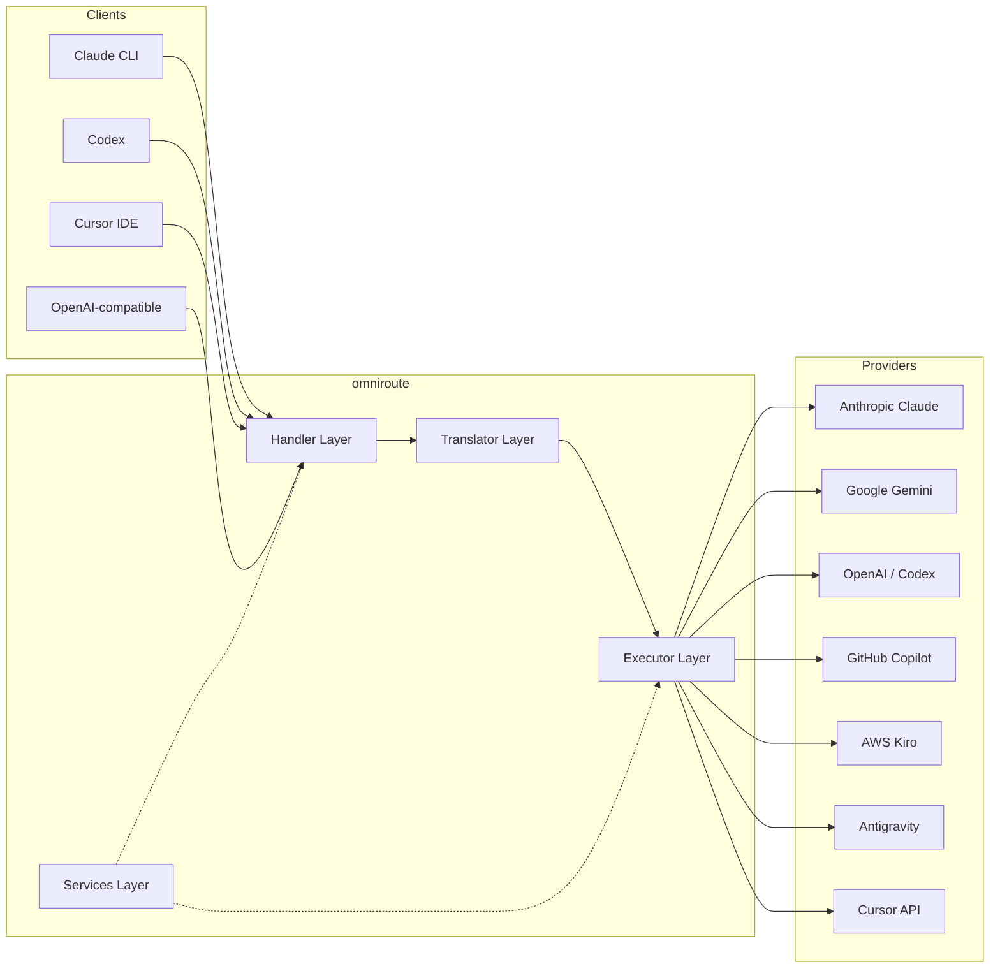

### Principe de base : traduction en étoile

Toutes les traductions de format passent par le **format OpenAI comme hub** :

```
Client Format → [OpenAI Hub] → Provider Format    (request)
Provider Format → [OpenAI Hub] → Client Format    (response)
```

Cela signifie que vous n'avez besoin que de **N traducteurs** (un par format) au lieu de **N²** (chaque paire).

---

## 3. Structure du projet

```
omniroute/
├── open-sse/                  ← Core proxy library (portable, framework-agnostic)
│   ├── index.js               ← Main entry point, exports everything
│   ├── config/                ← Configuration & constants
│   ├── executors/             ← Provider-specific request execution
│   ├── handlers/              ← Request handling orchestration
│   ├── services/              ← Business logic (auth, models, fallback, usage)
│   ├── translator/            ← Format translation engine
│   │   ├── request/           ← Request translators (8 files)
│   │   ├── response/          ← Response translators (7 files)
│   │   └── helpers/           ← Shared translation utilities (6 files)
│   └── utils/                 ← Utility functions
├── src/                       ← Application layer (Express/Worker runtime)
│   ├── app/                   ← Web UI, API routes, middleware
│   ├── lib/                   ← Database, auth, and shared library code
│   ├── mitm/                  ← Man-in-the-middle proxy utilities
│   ├── models/                ← Database models
│   ├── shared/                ← Shared utilities (wrappers around open-sse)
│   ├── sse/                   ← SSE endpoint handlers
│   └── store/                 ← State management
├── data/                      ← Runtime data (credentials, logs)
│   └── provider-credentials.json   (external credentials override, gitignored)
└── tester/                    ← Test utilities
```

---

## 4. Répartition module par module

### 4.1 Configuration (`open-sse/config/`)

La **source unique de vérité** pour toutes les configurations de fournisseurs.

| Fichier                       | Objectif                                                                                                                                                                                                                                                                  |
| ----------------------------- | ------------------------------------------------------------------------------------------------------------------------------------------------------------------------------------------------------------------------------------------------------------------------- |
| `constants.ts`                | Objet `PROVIDERS` avec les URL de base, les informations d'identification OAuth (par défaut), les en-têtes et les invites système par défaut pour chaque fournisseur. Définit également `HTTP_STATUS`, `ERROR_TYPES`, `COOLDOWN_MS`, `BACKOFF_CONFIG` et `SKIP_PATTERNS`. |
| `credentialLoader.ts`         | Charge les informations d'identification externes de `data/provider-credentials.json` et les fusionne avec les valeurs par défaut codées en dur dans `PROVIDERS`. Garde les secrets hors du contrôle des sources tout en conservant la compatibilité ascendante.          |
| `providerModels.ts`           | Registre central des modèles : mappe les alias des fournisseurs → les ID de modèle. Fonctionne comme `getModels()`, `getProviderByAlias()`.                                                                                                                               |
| `codexInstructions.ts`        | Instructions système injectées dans les requêtes Codex (contraintes d'édition, règles sandbox, politiques d'approbation).                                                                                                                                                 |
| `defaultThinkingSignature.ts` | Signatures « pensées » par défaut pour les modèles Claude et Gemini.                                                                                                                                                                                                      |
| `ollamaModels.ts`             | Définition de schéma pour les modèles Ollama locaux (nom, taille, famille, quantification).                                                                                                                                                                               |

#### Flux de chargement des informations d'identification

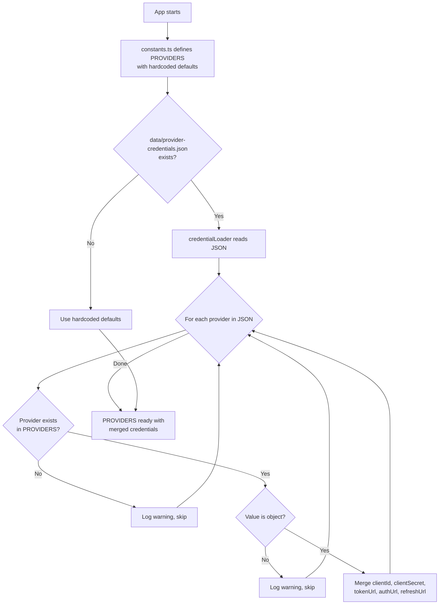

---

### 4.2 Exécuteurs (`open-sse/executors/`)

Les exécuteurs encapsulent la **logique spécifique au fournisseur** à l'aide du **Modèle de stratégie**. Chaque exécuteur remplace les méthodes de base selon les besoins.

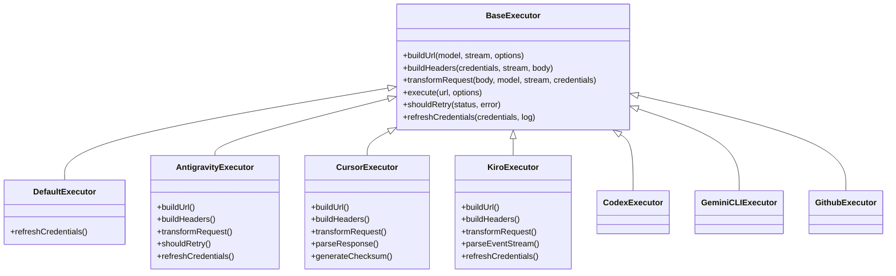

| Exécuteur testamentaire | Fournisseur                                 | Spécialisations clés                                                                                                                                               |
| ----------------------- | ------------------------------------------- | ------------------------------------------------------------------------------------------------------------------------------------------------------------------ |
| `base.ts`               | —                                           | Base abstraite : création d'URL, en-têtes, logique de nouvelle tentative, actualisation des informations d'identification                                          |
| `default.ts`            | Claude, Gémeaux, OpenAI, GLM, Kimi, MiniMax | Actualisation du jeton OAuth générique pour les fournisseurs standards                                                                                             |
| `antigravity.ts`        | Code Google Cloud                           | Génération d'ID de projet/session, secours multi-URL, nouvelle tentative d'analyse personnalisée à partir des messages d'erreur ("réinitialisation après 2h7m23s") |
| `cursor.ts`             | Curseur IDE                                 | **Le plus complexe** : authentification par somme de contrôle SHA-256, encodage de requête Protobuf, EventStream binaire → analyse de réponse SSE                  |
| `codex.ts`              | Codex OpenAI                                | Injecte les instructions système, gère les niveaux de réflexion, supprime les paramètres non pris en charge                                                        |
| `gemini-cli.ts`         | CLI Google Gemini                           | Création d'URL personnalisées (`streamGenerateContent`), actualisation du jeton Google OAuth                                                                       |
| `github.ts`             | Copilote GitHub                             | Système à double jeton (GitHub OAuth + jeton Copilot), imitation d'en-tête VSCode                                                                                  |
| `kiro.ts`               | AWS CodeWhisperer                           | Analyse binaire AWS EventStream, cadres d'événements AMZN, estimation de jetons                                                                                    |
| `index.ts`              | —                                           | Factory : nom du fournisseur de cartes → classe d'exécuteur, avec solution de secours par défaut                                                                   |

---

### 4.3 Gestionnaires (`open-sse/handlers/`)

La **couche d'orchestration** : coordonne la traduction, l'exécution, le streaming et la gestion des erreurs.

| Fichier               | Objectif                                                                                                                                                                                                                                                                   |
| --------------------- | -------------------------------------------------------------------------------------------------------------------------------------------------------------------------------------------------------------------------------------------------------------------------- |
| `chatCore.ts`         | **Orchestrateur central** (~600 lignes). Gère le cycle de vie complet de la demande : détection du format → traduction → répartition de l'exécuteur → réponse en streaming/non-streaming → actualisation du jeton → gestion des erreurs → journalisation de l'utilisation. |
| `responsesHandler.ts` | Adaptateur pour l'API Responses d'OpenAI : convertit le format des réponses → Fins de discussion → envoie à `chatCore` → reconvertit SSE au format de réponses.                                                                                                            |
| `embeddings.ts`       | Gestionnaire de génération d'intégration : résout le modèle d'intégration → fournisseur, envoi à l'API du fournisseur, renvoie la réponse d'intégration compatible OpenAI. Prend en charge plus de 6 fournisseurs.                                                         |
| `imageGeneration.ts`  | Gestionnaire de génération d'images : résout le modèle d'image → fournisseur, prend en charge les modes compatibles OpenAI, Gemini-image (Antigravity) et de secours (Nebius). Renvoie des images base64 ou URL.                                                           |

#### Cycle de vie des requêtes (chatCore.ts)

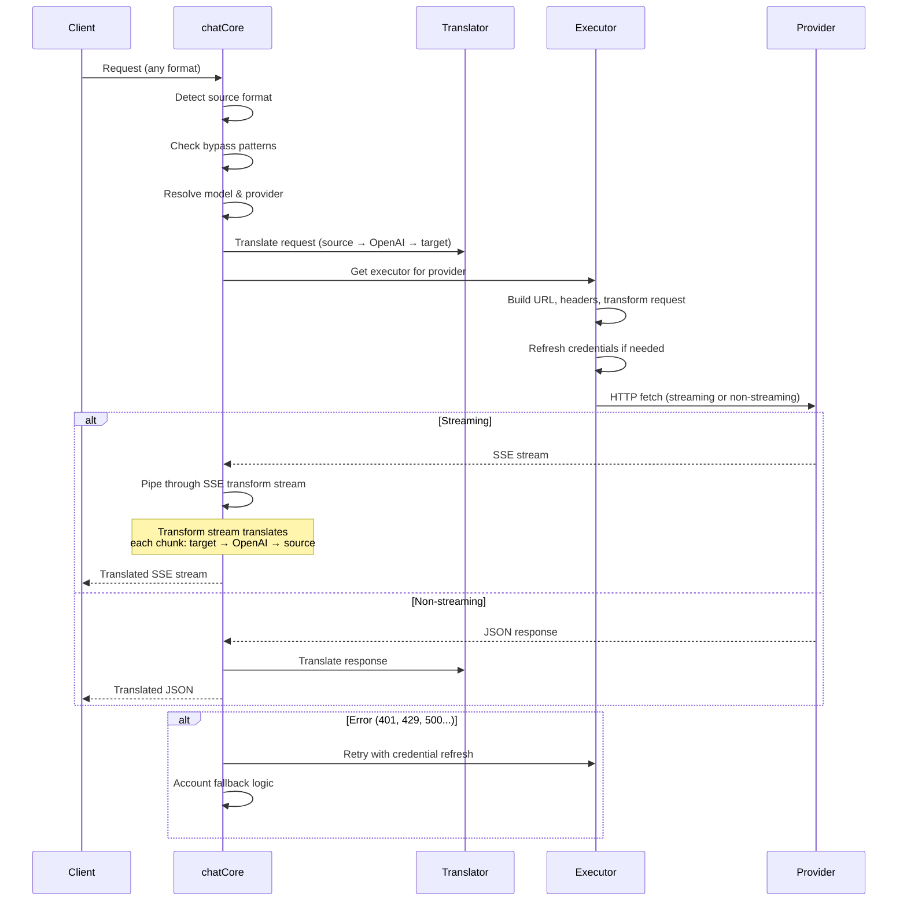

---

### 4.4 Services (`open-sse/services/`)

Logique métier qui prend en charge les gestionnaires et les exécuteurs.

| Fichier              | Objectif                                                                                                                                                                                                                                                                                                                                                                                                       |
| -------------------- | -------------------------------------------------------------------------------------------------------------------------------------------------------------------------------------------------------------------------------------------------------------------------------------------------------------------------------------------------------------------------------------------------------------- |
| `provider.ts`        | **Détection de format** (`detectFormat`) : analyse la structure du corps de la requête pour identifier les formats Claude/OpenAI/Gemini/Antigravity/Responses (inclut l'heuristique `max_tokens` pour Claude). Aussi : création d'URL, création d'en-têtes, réflexion sur la normalisation de la configuration. Prend en charge les fournisseurs dynamiques `openai-compatible-*` et `anthropic-compatible-*`. |
| `model.ts`           | Analyse de chaîne de modèle (`claude/model-name` → `{provider: "claude", model: "model-name"}`), résolution d'alias avec détection de collision, désinfection des entrées (rejette les caractères de parcours/contrôle de chemin) et résolution d'informations de modèle avec prise en charge du getter d'alias asynchrone.                                                                                    |
| `accountFallback.ts` | Gestion des limites de débit : interruption exponentielle (1s → 2s → 4s → max 2min), gestion du temps de recharge du compte, classification des erreurs (quelles erreurs déclenchent le repli ou non).                                                                                                                                                                                                         |
| `tokenRefresh.ts`    | Actualisation du jeton OAuth pour **chaque fournisseur** : Google (Gemini, Antigravity), Claude, Codex, Qwen, iFlow, GitHub (double jeton OAuth + Copilot), Kiro (AWS SSO OIDC + Social Auth). Inclut un cache de déduplication de promesses en cours et une nouvelle tentative avec une interruption exponentielle.                                                                                           |
| `combo.ts`           | **Modèles combo** : chaînes de modèles de secours. Si le modèle A échoue avec une erreur éligible au repli, essayez le modèle B, puis C, etc. Renvoie les codes d'état en amont réels.                                                                                                                                                                                                                         |
| `usage.ts`           | Récupère les données de quota/utilisation des API du fournisseur (quotas GitHub Copilot, quotas du modèle Antigravity, limites de débit du Codex, répartitions d'utilisation de Kiro, paramètres Claude).                                                                                                                                                                                                      |
| `accountSelector.ts` | Sélection intelligente des comptes avec algorithme de notation : prend en compte la priorité, l'état de santé, la position du tourniquet et l'état du temps de recharge pour choisir le compte optimal pour chaque demande.                                                                                                                                                                                    |
| `contextManager.ts`  | Gestion du cycle de vie du contexte de demande : crée et suit des objets de contexte par demande avec des métadonnées (ID de demande, horodatages, informations sur le fournisseur) pour le débogage et la journalisation.                                                                                                                                                                                     |
| `ipFilter.ts`        | Contrôle d'accès basé sur IP : prend en charge les modes liste d'autorisation et liste de blocage. Valide l'adresse IP du client par rapport aux règles configurées avant de traiter les requêtes API.                                                                                                                                                                                                         |
| `sessionManager.ts`  | Suivi des sessions avec empreintes digitales des clients : suit les sessions actives à l'aide d'identifiants client hachés, surveille le nombre de demandes et fournit des métriques de session.                                                                                                                                                                                                               |
| `signatureCache.ts`  | Cache de déduplication basé sur les signatures de requête : évite les requêtes en double en mettant en cache les signatures de requêtes récentes et en renvoyant les réponses mises en cache pour les requêtes identiques dans une fenêtre de temps.                                                                                                                                                           |
| `systemPrompt.ts`    | Injection d’invite système globale : ajoute ou ajoute une invite système configurable à toutes les requêtes, avec gestion de la compatibilité par fournisseur.                                                                                                                                                                                                                                                 |
| `thinkingBudget.ts`  | Gestion du budget des jetons de raisonnement : prend en charge les modes passthrough, automatique (configuration de réflexion en bande), personnalisé (budget fixe) et adaptatif (à l'échelle de la complexité) pour contrôler les jetons de réflexion/raisonnement.                                                                                                                                           |
| `wildcardRouter.ts`  | Routage de modèles de modèles génériques : résout les modèles de caractères génériques (par exemple, `*/claude-*`) en paires fournisseur/modèle concrètes en fonction de la disponibilité et de la priorité.                                                                                                                                                                                                   |

#### Déduplication d'actualisation des jetons

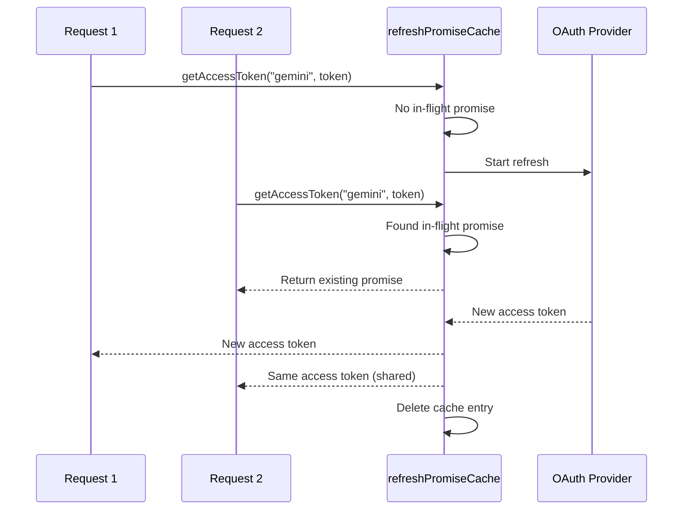

#### Machine d'état de secours du compte

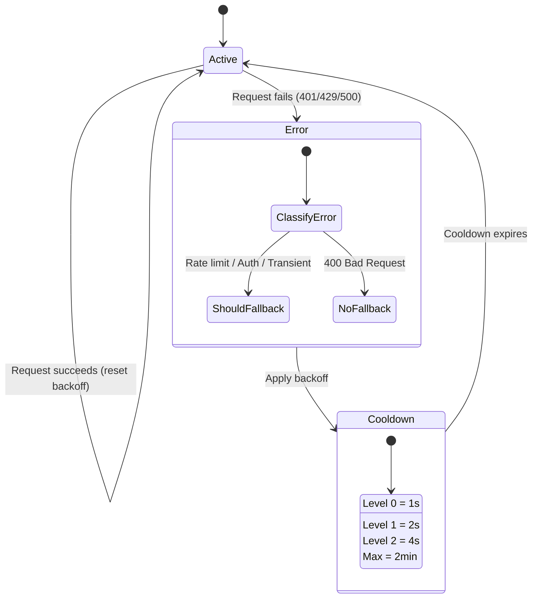

#### Chaîne de modèles combo

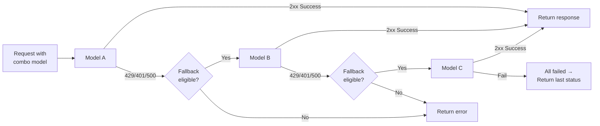

---

### 4.5 Traducteur (`open-sse/translator/`)

Le **moteur de traduction de format** utilisant un système de plugin d'auto-enregistrement.

#### Architecture

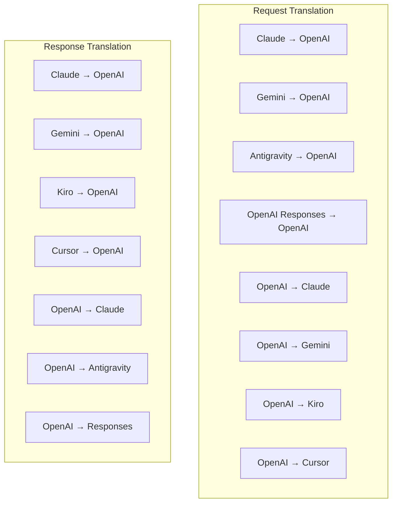

| Annuaire     | Fichiers      | Descriptif                                                                                                                                                                                                                                                                                   |
| ------------ | ------------- | -------------------------------------------------------------------------------------------------------------------------------------------------------------------------------------------------------------------------------------------------------------------------------------------- |
| `request/`   | 8 traducteurs | Convertissez les corps de requête entre les formats. Chaque fichier s'auto-enregistre via `register(from, to, fn)` lors de l'importation.                                                                                                                                                    |
| `response/`  | 7 traducteurs | Convertissez les morceaux de réponse en streaming entre les formats. Gère les types d’événements SSE, les blocs de réflexion et les appels d’outils.                                                                                                                                         |
| `helpers/`   | 6 aides       | Utilitaires partagés : `claudeHelper` (extraction d'invite système, configuration de réflexion), `geminiHelper` (mapping parties/contenu), `openaiHelper` (filtrage de format), `toolCallHelper` (génération d'ID, injection de réponse manquante), `maxTokensHelper`, `responsesApiHelper`. |
| `index.ts`   | —             | Moteur de traduction : `translateRequest()`, `translateResponse()`, gestion des états, registre.                                                                                                                                                                                             |
| `formats.ts` | —             | Constantes de format : `OPENAI`, `CLAUDE`, `GEMINI`, `ANTIGRAVITY`, `KIRO`, `CURSOR`, `OPENAI_RESPONSES`.                                                                                                                                                                                    |

#### Conception des clés : plugins à enregistrement automatique

```javascript
// Each translator file calls register() on import:
import { register } from "../index.js";
register("claude", "openai", translateClaudeToOpenAI);

// The index.js imports all translator files, triggering registration:
import "./request/claude-to-openai.js"; // ← self-registers
```

---

### 4.6 Utilitaires (`open-sse/utils/`)

| Fichier            | Objectif                                                                                                                                                                                                                                                                                                                                                    |
| ------------------ | ----------------------------------------------------------------------------------------------------------------------------------------------------------------------------------------------------------------------------------------------------------------------------------------------------------------------------------------------------------- |
| `error.ts`         | Création de réponses aux erreurs (format compatible OpenAI), analyse des erreurs en amont, extraction du temps de nouvelle tentative Antigravity à partir des messages d'erreur, streaming d'erreurs SSE.                                                                                                                                                   |
| `stream.ts`        | **SSE Transform Stream** : le pipeline de streaming principal. Deux modes : `TRANSLATE` (traduction plein format) et `PASSTHROUGH` (normaliser + extraire l'utilisation). Gère la mise en mémoire tampon des blocs, l'estimation de l'utilisation et le suivi de la longueur du contenu. Les instances d'encodeur/décodeur par flux évitent l'état partagé. |
| `streamHelpers.ts` | Utilitaires SSE de bas niveau : `parseSSELine` (tolérant les espaces), `hasValuableContent` (filtre les morceaux vides pour OpenAI/Claude/Gemini), `fixInvalidId`, `formatSSE` (sérialisation SSE sensible au format avec nettoyage `perf_metrics`).                                                                                                        |
| `usageTracking.ts` | Extraction de l'utilisation des jetons à partir de n'importe quel format (Claude/OpenAI/Gemini/Responses), estimation avec des ratios outil/message séparés par jeton, ajout de tampon (marge de sécurité de 2000 jetons), filtrage de champs spécifiques au format, journalisation de la console avec couleurs ANSI.                                       |
| `requestLogger.ts` | Journalisation des demandes basées sur des fichiers (opt-in via `ENABLE_REQUEST_LOGS=true`). Crée des dossiers de session avec des fichiers numérotés : `1_req_client.json` → `7_res_client.txt`. Toutes les E/S sont asynchrones (tirer et oublier). Masque les en-têtes sensibles.                                                                        |
| `bypassHandler.ts` | Intercepte les modèles spécifiques de Claude CLI (extraction de titre, échauffement, décompte) et renvoie de fausses réponses sans appeler aucun fournisseur. Prend en charge le streaming et le non-streaming. Intentionnellement limité à la portée Claude CLI.                                                                                           |
| `networkProxy.ts`  | Résout l'URL du proxy sortant pour un fournisseur donné avec la priorité : configuration spécifique au fournisseur → configuration globale → variables d'environnement (`HTTPS_PROXY`/`HTTP_PROXY`/`ALL_PROXY`). Prend en charge les exclusions `NO_PROXY`. Met en cache la configuration pendant 30 s.                                                     |

#### Pipeline de diffusion SSE

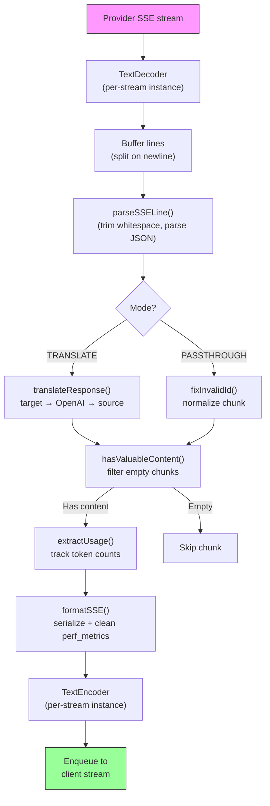

#### Structure de la session de l'enregistreur de requêtes

```
logs/
└── claude_gemini_claude-sonnet_20260208_143045/
    ├── 1_req_client.json      ← Raw client request
    ├── 2_req_source.json      ← After initial conversion
    ├── 3_req_openai.json      ← OpenAI intermediate format
    ├── 4_req_target.json      ← Final target format
    ├── 5_res_provider.txt     ← Provider SSE chunks (streaming)
    ├── 5_res_provider.json    ← Provider response (non-streaming)
    ├── 6_res_openai.txt       ← OpenAI intermediate chunks
    ├── 7_res_client.txt       ← Client-facing SSE chunks
    └── 6_error.json           ← Error details (if any)
```

---

### 4.7 Couche d'application (`src/`)

| Annuaire      | Objectif                                                                                              |
| ------------- | ----------------------------------------------------------------------------------------------------- |
| `src/app/`    | Interface utilisateur Web, routes API, middleware express, gestionnaires de rappel OAuth              |
| `src/lib/`    | Accès à la base de données (`localDb.ts`, `usageDb.ts`), authentification, partagé                    |
| `src/mitm/`   | Utilitaires proxy Man-in-the-middle pour intercepter le trafic des fournisseurs                       |
| `src/models/` | Définitions du modèle de base de données                                                              |
| `src/shared/` | Wrappers autour des fonctions open-sse (fournisseur, flux, erreur, etc.)                              |
| `src/sse/`    | Gestionnaires de points de terminaison SSE qui connectent la bibliothèque open-sse aux routes Express |
| `src/store/`  | Gestion de l'état des applications                                                                    |

#### Routes API notables

| Itinéraire                                    | Méthodes                 | Objectif                                                                                                |
| --------------------------------------------- | ------------------------ | ------------------------------------------------------------------------------------------------------- |
| `/api/provider-models`                        | OBTENIR/POST/DELETE      | CRUD pour les modèles personnalisés par fournisseur                                                     |
| `/api/models/catalog`                         | OBTENIR                  | Catalogue agrégé de tous les modèles (chat, intégration, image, personnalisé) regroupés par fournisseur |
| `/api/settings/proxy`                         | OBTENIR/METTRE/SUPPRIMER | Configuration du proxy sortant hiérarchique (`global/providers/combos/keys`)                            |
| `/api/settings/proxy/test`                    | POSTER                   | Valide la connectivité proxy et renvoie l'adresse IP/latence publique                                   |
| `/v1/providers/[provider]/chat/completions`   | POSTER                   | Compléments de chat dédiés par fournisseur avec validation du modèle                                    |
| `/v1/providers/[provider]/embeddings`         | POSTER                   | Intégrations dédiées par fournisseur avec validation du modèle                                          |
| `/v1/providers/[provider]/images/generations` | POSTER                   | Génération d'images dédiée par fournisseur avec validation du modèle                                    |
| `/api/settings/ip-filter`                     | OBTENIR/METTRE           | Gestion des listes autorisées/bloquées IP                                                               |
| `/api/settings/thinking-budget`               | OBTENIR/METTRE           | Configuration du budget du jeton de raisonnement (passthrough/auto/custom/adaptatif)                    |
| `/api/settings/system-prompt`                 | OBTENIR/METTRE           | Injection rapide du système global pour toutes les demandes                                             |
| `/api/sessions`                               | OBTENIR                  | Suivi et métriques des sessions actives                                                                 |
| `/api/rate-limits`                            | OBTENIR                  | Statut de limite de débit par compte                                                                    |

---

## 5. Modèles de conception clés

### 5.1 Traduction en étoile

Tous les formats sont traduits via le **format OpenAI comme hub**. L'ajout d'un nouveau fournisseur ne nécessite que l'écriture d'**une paire** de traducteurs (vers/depuis OpenAI), et non de N paires.

### 5.2 Modèle de stratégie de l'exécuteur

Chaque fournisseur dispose d'une classe d'exécuteur dédiée héritant de `BaseExecutor`. L'usine dans `executors/index.ts` sélectionne la bonne au moment de l'exécution.

### 5.3 Système de plugin d'auto-enregistrement

Les modules de traduction s'enregistrent eux-mêmes lors de l'importation via `register()`. Ajouter un nouveau traducteur consiste simplement à créer un fichier et à l'importer.

### 5.4 Repli de compte avec intervalle exponentiel

Lorsqu'un fournisseur renvoie 429/401/500, le système peut passer au compte suivant, en appliquant des temps de recharge exponentiels (1s → 2s → 4s → max 2min).

### 5.5 Chaînes de modèles combinés

Un "combo" regroupe plusieurs chaînes `provider/model`. Si le premier échoue, revenez automatiquement au suivant.

### 5.6 Traduction en continu avec état

La traduction des réponses maintient l'état dans les morceaux SSE (suivi des blocs de réflexion, accumulation d'appels d'outils, indexation des blocs de contenu) via le mécanisme `initState()`.

### 5.7 Tampon de sécurité d'utilisation

Un tampon de 2 000 jetons est ajouté à l'utilisation signalée pour empêcher les clients d'atteindre les limites de la fenêtre contextuelle en raison de la surcharge des invites système et de la traduction du format.

---

## 6. Formats pris en charge

| Formater                   | Itinéraire       | Identifiant        |
| -------------------------- | ---------------- | ------------------ |
| Achèvements du chat OpenAI | source + cible   | `openai`           |
| API de réponses OpenAI     | source + cible   | `openai-responses` |
| Claude Anthropique         | source + cible   | `claude`           |
| Google Gémeaux             | source + cible   | `gemini`           |
| CLI Google Gemini          | cible uniquement | `gemini-cli`       |
| Antigravité                | source + cible   | `antigravity`      |
| AWSKiro                    | cible uniquement | `kiro`             |
| Curseur                    | cible uniquement | `cursor`           |

---

## 7. Fournisseurs pris en charge

| Fournisseur              | Méthode d'authentification               | Exécuteur testamentaire | Notes clés                                                                |
| ------------------------ | ---------------------------------------- | ----------------------- | ------------------------------------------------------------------------- |
| Claude Anthropique       | Clé API ou OAuth                         | Par défaut              | Utilise l'en-tête `x-api-key`                                             |
| Google Gémeaux           | Clé API ou OAuth                         | Par défaut              | Utilise l'en-tête `x-goog-api-key`                                        |
| CLI Google Gemini        | OAuth                                    | GémeauxCLI              | Utilise le point de terminaison `streamGenerateContent`                   |
| Antigravité              | OAuth                                    | Antigravité             | Solution de secours multi-URL, nouvelle tentative d'analyse personnalisée |
| OpenAI                   | Clé API                                  | Par défaut              | Authentification du porte-étendard                                        |
| Codex                    | OAuth                                    | Codex                   | Injecte les instructions système, gère la réflexion                       |
| Copilote GitHub          | OAuth + jeton Copilot                    | GitHub                  | Double jeton, en-tête VSCode imitant                                      |
| Kiro (AWS)               | AWS SSO OIDC ou Social                   | Kiro                    | Analyse binaire d'EventStream                                             |
| Curseur IDE              | Authentification de la somme de contrôle | Curseur                 | Encodage Protobuf, sommes de contrôle SHA-256                             |
| Qwen                     | OAuth                                    | Par défaut              | Authentification standard                                                 |
| iFlow                    | OAuth (Basique + Porteur)                | Par défaut              | En-tête à double authentification                                         |
| OuvrirRouter             | Clé API                                  | Par défaut              | Authentification du porte-étendard                                        |
| GLM, Kimi, MiniMax       | Clé API                                  | Par défaut              | Compatible Claude, utilisez `x-api-key`                                   |
| `openai-compatible-*`    | Clé API                                  | Par défaut              | Dynamique : tout point de terminaison compatible OpenAI                   |
| `anthropic-compatible-*` | Clé API                                  | Par défaut              | Dynamique : tout point de terminaison compatible Claude                   |

---

## 8. Résumé du flux de données

### Demande de diffusion en continu

```mermaid
flowchart LR
    A["Client"] --> B["detectFormat()"]
    B --> C["translateRequest()\nsource → OpenAI → target"]
    C --> D["Executor\nbuildUrl + buildHeaders"]
    D --> E["fetch(providerURL)"]
    E --> F["createSSEStream()\nTRANSLATE mode"]
    F --> G["parseSSELine()"]
    G --> H["translateResponse()\ntarget → OpenAI → source"]
    H --> I["extractUsage()\n+ addBuffer"]
    I --> J["formatSSE()"]
    J --> K["Client receives\ntranslated SSE"]
    K --> L["logUsage()\nsaveRequestUsage()"]
```

### Demande sans streaming

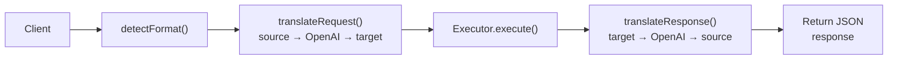

### Flux de contournement (Claude CLI)

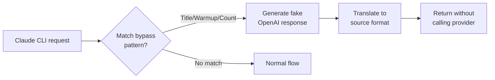
