# omniroute — תיעוד בסיס קוד

🌐 **Languages:** 🇺🇸 [English](../../CODEBASE_DOCUMENTATION.md) | 🇧🇷 [Português (Brasil)](../pt-BR/CODEBASE_DOCUMENTATION.md) | 🇪🇸 [Español](../es/CODEBASE_DOCUMENTATION.md) | 🇫🇷 [Français](../fr/CODEBASE_DOCUMENTATION.md) | 🇮🇹 [Italiano](../it/CODEBASE_DOCUMENTATION.md) | 🇷🇺 [Русский](../ru/CODEBASE_DOCUMENTATION.md) | 🇨🇳 [中文 (简体)](../zh-CN/CODEBASE_DOCUMENTATION.md) | 🇩🇪 [Deutsch](../de/CODEBASE_DOCUMENTATION.md) | 🇮🇳 [हिन्दी](../in/CODEBASE_DOCUMENTATION.md) | 🇹🇭 [ไทย](../th/CODEBASE_DOCUMENTATION.md) | 🇺🇦 [Українська](../uk-UA/CODEBASE_DOCUMENTATION.md) | 🇸🇦 [العربية](../ar/CODEBASE_DOCUMENTATION.md) | 🇯🇵 [日本語](../ja/CODEBASE_DOCUMENTATION.md) | 🇻🇳 [Tiếng Việt](../vi/CODEBASE_DOCUMENTATION.md) | 🇧🇬 [Български](../bg/CODEBASE_DOCUMENTATION.md) | 🇩🇰 [Dansk](../da/CODEBASE_DOCUMENTATION.md) | 🇫🇮 [Suomi](../fi/CODEBASE_DOCUMENTATION.md) | 🇮🇱 [עברית](../he/CODEBASE_DOCUMENTATION.md) | 🇭🇺 [Magyar](../hu/CODEBASE_DOCUMENTATION.md) | 🇮🇩 [Bahasa Indonesia](../id/CODEBASE_DOCUMENTATION.md) | 🇰🇷 [한국어](../ko/CODEBASE_DOCUMENTATION.md) | 🇲🇾 [Bahasa Melayu](../ms/CODEBASE_DOCUMENTATION.md) | 🇳🇱 [Nederlands](../nl/CODEBASE_DOCUMENTATION.md) | 🇳🇴 [Norsk](../no/CODEBASE_DOCUMENTATION.md) | 🇵🇹 [Português (Portugal)](../pt/CODEBASE_DOCUMENTATION.md) | 🇷🇴 [Română](../ro/CODEBASE_DOCUMENTATION.md) | 🇵🇱 [Polski](../pl/CODEBASE_DOCUMENTATION.md) | 🇸🇰 [Slovenčina](../sk/CODEBASE_DOCUMENTATION.md) | 🇸🇪 [Svenska](../sv/CODEBASE_DOCUMENTATION.md) | 🇵🇭 [Filipino](../phi/CODEBASE_DOCUMENTATION.md)

> מדריך מקיף וידידותי למתחילים לנתב ה-Proxy **omniroute** מרובה ספקי AI.

---

## 1. מהו omnirroute?

omniroute הוא **נתב פרוקסי** שיושב בין לקוחות AI (קלוד CLI, Codex, Cursor IDE וכו') וספקי AI (Anthropic, Google, OpenAI, AWS, GitHub וכו'). זה פותר בעיה אחת גדולה:

> **לקוחות AI שונים מדברים "שפות" שונות (פורמטים של API), וספקי AI שונים מצפים גם ל"שפות" שונות.** omniroute מתרגם ביניהם באופן אוטומטי.

תחשוב על זה כמו מתרגם אוניברסלי באו"ם - כל נציג יכול לדבר כל שפה, והמתרגם ממיר אותו עבור כל נציג אחר.

---

## 2. סקירת אדריכלות

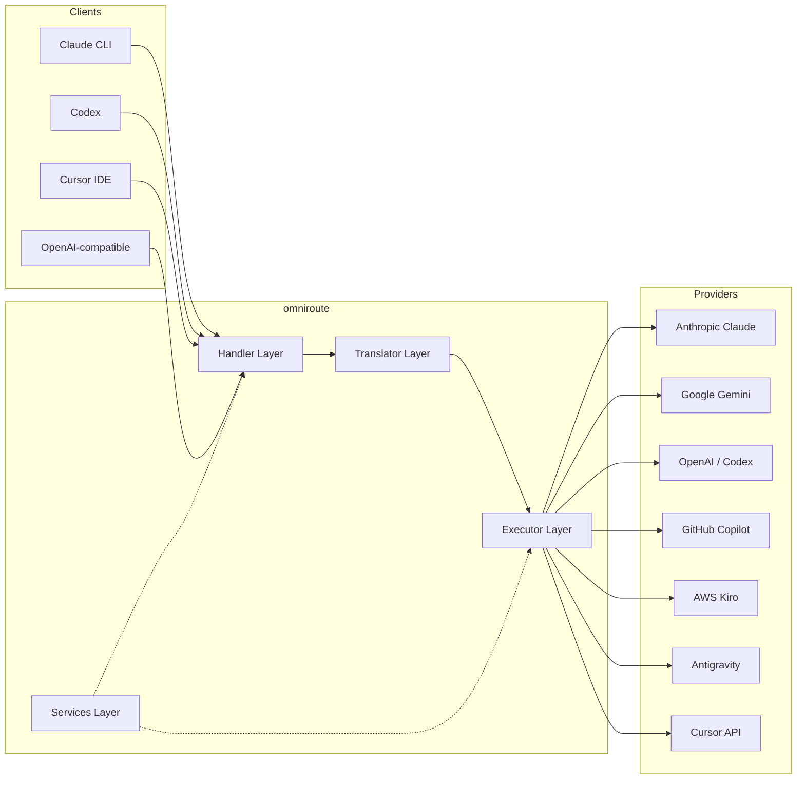

### עקרון ליבה: תרגום רכזת ודיבור

כל תרגום הפורמט עובר דרך **פורמט OpenAI כמרכז**:

```
Client Format → [OpenAI Hub] → Provider Format    (request)
Provider Format → [OpenAI Hub] → Client Format    (response)
```

המשמעות היא שאתה צריך רק **N מתרגמים** (אחד לכל פורמט) במקום **N²** (כל זוג).

---

## 3. מבנה הפרויקט

```
omniroute/
├── open-sse/                  ← Core proxy library (portable, framework-agnostic)
│   ├── index.js               ← Main entry point, exports everything
│   ├── config/                ← Configuration & constants
│   ├── executors/             ← Provider-specific request execution
│   ├── handlers/              ← Request handling orchestration
│   ├── services/              ← Business logic (auth, models, fallback, usage)
│   ├── translator/            ← Format translation engine
│   │   ├── request/           ← Request translators (8 files)
│   │   ├── response/          ← Response translators (7 files)
│   │   └── helpers/           ← Shared translation utilities (6 files)
│   └── utils/                 ← Utility functions
├── src/                       ← Application layer (Express/Worker runtime)
│   ├── app/                   ← Web UI, API routes, middleware
│   ├── lib/                   ← Database, auth, and shared library code
│   ├── mitm/                  ← Man-in-the-middle proxy utilities
│   ├── models/                ← Database models
│   ├── shared/                ← Shared utilities (wrappers around open-sse)
│   ├── sse/                   ← SSE endpoint handlers
│   └── store/                 ← State management
├── data/                      ← Runtime data (credentials, logs)
│   └── provider-credentials.json   (external credentials override, gitignored)
└── tester/                    ← Test utilities
```

---

## 4. פירוט מודול אחר מודול

### 4.1 Config (`open-sse/config/`)

**מקור האמת היחיד** לכל תצורת הספקים.

| קובץ                          | מטרה                                                                                                                                                                                                           |
| ----------------------------- | -------------------------------------------------------------------------------------------------------------------------------------------------------------------------------------------------------------- |
| `constants.ts`                | אובייקט `PROVIDERS` עם כתובות URL בסיסיות, אישורי OAuth (ברירת מחדל), כותרות והנחיות מערכת ברירת מחדל עבור כל ספק. מגדיר גם את `HTTP_STATUS`, `ERROR_TYPES`, `COOLDOWN_MS`, `BACKOFF_CONFIG` ו`SKIP_PATTERNS`. |
| `credentialLoader.ts`         | טוען אישורים חיצוניים מ-`data/provider-credentials.json` וממזג אותם על פני ברירות המחדל המקודדות ב-`PROVIDERS`. שומר סודות מחוץ לשליטת המקור תוך שמירה על תאימות לאחור.                                        |
| `providerModels.ts`           | רישום מודלים מרכזי: כינויים של ספקי מפות → מזהי מודל. פונקציות כמו `getModels()`, `getProviderByAlias()`.                                                                                                      |
| `codexInstructions.ts`        | הוראות מערכת שהוזרקו לבקשות Codex (אילוצי עריכה, כללי ארגז חול, מדיניות אישור).                                                                                                                                |
| `defaultThinkingSignature.ts` | ברירת המחדל של חתימות "חשיבה" עבור דגמי קלוד וג'מיני.                                                                                                                                                          |
| `ollamaModels.ts`             | הגדרת סכמה למודלים מקומיים של אולמה (שם, גודל, משפחה, כימות).                                                                                                                                                  |

#### זרימת טעינת אישורים

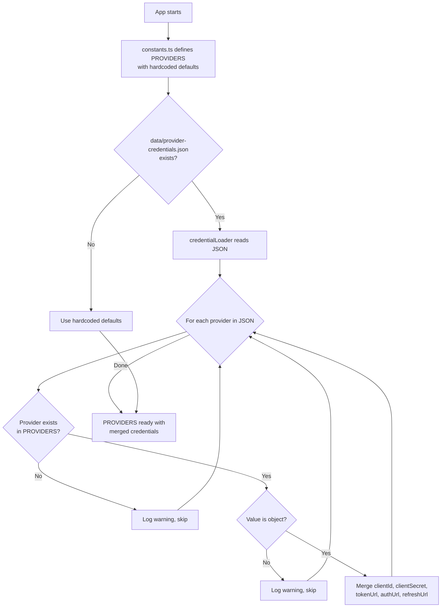

---

### 4.2 מבצעים (`open-sse/executors/`)

מבצעים עוטפים **היגיון ספציפי לספק** באמצעות **דפוס האסטרטגיה**. כל מבצע עוקף את שיטות הבסיס לפי הצורך.

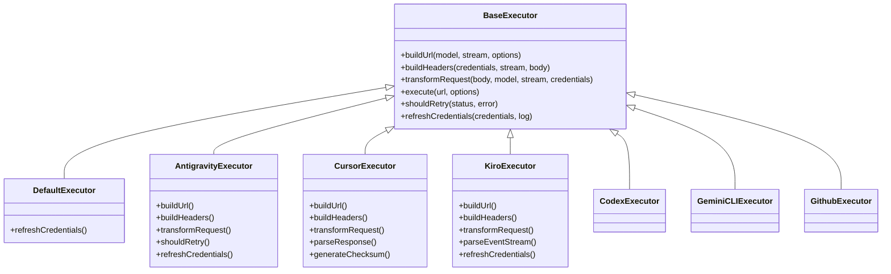

| מוציא לפועל      | ספק                                      | התמחויות מפתח                                                                                                        |
| ---------------- | ---------------------------------------- | -------------------------------------------------------------------------------------------------------------------- |
| `base.ts`        | —                                        | בסיס תקציר: בניית כתובת URL, כותרות, הגיון ניסיון חוזר, רענון אישורים                                                |
| `default.ts`     | קלוד, ג'מיני, OpenAI, GLM, Kimi, MiniMax | רענון אסימון OAuth כללי עבור ספקים סטנדרטיים                                                                         |
| `antigravity.ts` | Google Cloud Code                        | יצירת מזהה פרויקט/הפעלה, ניתוק רב של כתובות אתרים, ניסיון חוזר מותאם אישית לנתח מהודעות שגיאה ("איפוס לאחר 2h7m23s") |
| `cursor.ts`      | הסמן IDE                                 | **המורכבים ביותר**: SHA-256 checksum auth, קידוד בקשת Protobuf, EventStream בינארי → ניתוח תגובת SSE                 |
| `codex.ts`       | OpenAI Codex                             | מזריק הוראות מערכת, מנהל רמות חשיבה, מסיר פרמטרים לא נתמכים                                                          |
| `gemini-cli.ts`  | Google Gemini CLI                        | בניית כתובת אתר מותאמת אישית (`streamGenerateContent`), רענון אסימון OAuth של Google                                 |
| `github.ts`      | GitHub Copilot                           | מערכת אסימון כפול (GitHub OAuth + Token Copilot), חיקוי כותרת VSCode                                                 |
| `kiro.ts`        | AWS CodeWhisperer                        | ניתוח בינארי של AWS EventStream, מסגרות אירועי AMZN, הערכת אסימון                                                    |
| `index.ts`       | —                                        | מפעל: שם ספק מפות → מחלקת executor, עם ברירת מחדל                                                                    |

---

### 4.3 מטפלים (`open-sse/handlers/`)

**שכבת התזמור** - מתאמת תרגום, ביצוע, סטרימינג וטיפול בשגיאות.

| קובץ                  | מטרה                                                                                                                                                                    |
| --------------------- | ----------------------------------------------------------------------------------------------------------------------------------------------------------------------- |
| `chatCore.ts`         | **מתזמר מרכזי** (~600 שורות). מטפל במחזור החיים המלא של הבקשה: זיהוי פורמט ← תרגום ← שליחת מבצע ← תגובת סטרימינג/לא זרימה ← רענון אסימון ← טיפול בשגיאות ← רישום שימוש. |
| `responsesHandler.ts` | מתאם עבור ה-API של תגובות של OpenAI: ממיר פורמט תגובות ← השלמות צ'אט ← שולח ל-`chatCore` → ממיר SSE בחזרה לפורמט תגובות.                                                |
| `embeddings.ts`       | מטפל ביצירת הטבעה: פותר מודל הטמעה → ספק, שולח לספק API, מחזיר תגובת הטבעה תואמת OpenAI. תומך ב-6 ספקים ומעלה.                                                          |
| `imageGeneration.ts`  | מטפל בהפקת תמונה: פותר את מודל התמונה → ספק, תומך במצבי OpenAI, תמונת תאומים (אנטי כבידה) ו-Nebius. מחזירה תמונות base64 או כתובת URL.                                  |

#### מחזור חיים של בקשה (chatCore.ts)

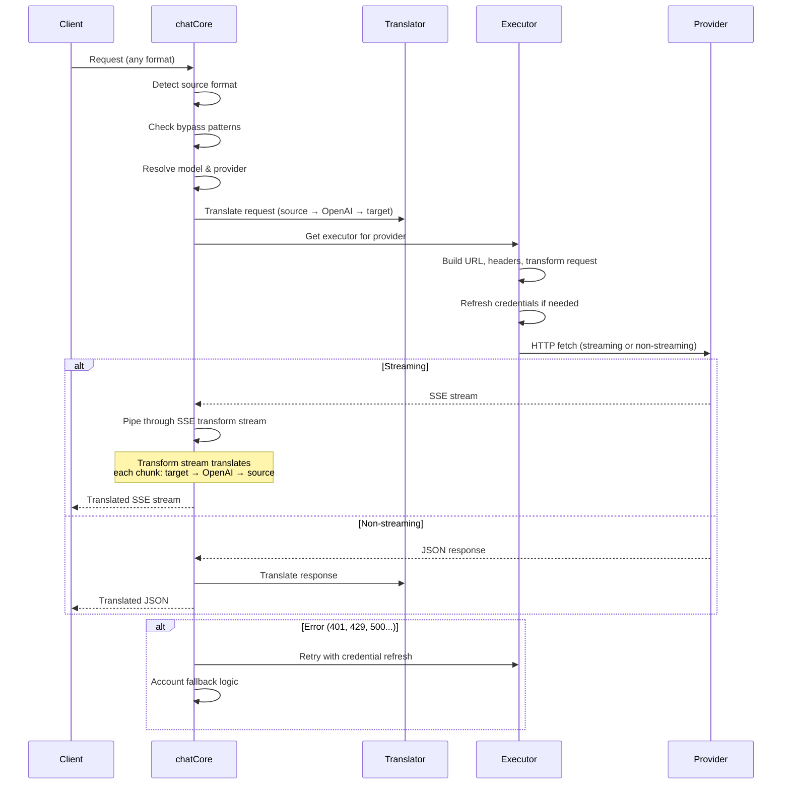

---

### 4.4 שירותים (`open-sse/services/`)

היגיון עסקי התומך במטפלים ובמבצעים.

| קובץ                 | מטרה                                                                                                                                                                                                                                                                                                         |
| -------------------- | ------------------------------------------------------------------------------------------------------------------------------------------------------------------------------------------------------------------------------------------------------------------------------------------------------------ |
| `provider.ts`        | **זיהוי פורמטים** (`detectFormat`): מנתח את מבנה גוף הבקשה כדי לזהות פורמטים של קלוד/OpenAI/Gemini/Antigravity/Responses (כולל `max_tokens` היוריסטיקה עבור קלוד). כמו כן: בניית כתובת URL, בניית כותרות, נורמליזציה של תצורת חשיבה. תומך בספקים דינמיים של `openai-compatible-*` ו`anthropic-compatible-*`. |
| `model.ts`           | ניתוח מחרוזת מודל (`claude/model-name` → `{provider: "claude", model: "model-name"}`), רזולוציית כינוי עם זיהוי התנגשות, חיטוי קלט (דוחה חציית נתיב/תווים בקרה), ורזולוציית מידע על דגם עם תמיכה ב-Getter כינוי אסינכרון.                                                                                    |
| `accountFallback.ts` | טיפול במגבלת קצב: השבתה אקספוננציאלית (1 שניות → 2 שניות → 4 שניות → מקסימום 2 דקות), ניהול התקררות חשבונות, סיווג שגיאות (אשר השגיאות מעוררות נפילה לעומת לא).                                                                                                                                              |
| `tokenRefresh.ts`    | רענון אסימון OAuth עבור **כל ספק**: Google (Gemini, Antigravity), Claude, Codex, Qwen, iFlow, GitHub (OAuth + Copilot dual-token), Kiro (AWS SSO OIDC + Social Auth). כולל מטמון הבטחה למניעת כפילויות במהלך הטיסה וניסיון חוזר עם השבתה אקספוננציאלית.                                                      |
| `combo.ts`           | **דגמי משולבים**: רשתות של דגמי חלודה. אם דגם A נכשל עם שגיאה מתאימה, נסה את דגם B, ולאחר מכן C וכו'. מחזירה קודי סטטוס בפועל במעלה הזרם.                                                                                                                                                                    |
| `usage.ts`           | שואב נתוני מכסה/שימוש ממשקי API של ספקים (מכסות GitHub Copilot, מכסות של מודלים נגד כבידה, מגבלות תעריף Codex, תקלות שימוש ב-Kiro, הגדרות קלוד).                                                                                                                                                             |
| `accountSelector.ts` | בחירת חשבון חכמה עם אלגוריתם ניקוד: לוקח בחשבון עדיפות, מצב בריאותי, מיקום סיבובי ומצב צינון כדי לבחור את החשבון האופטימלי עבור כל בקשה.                                                                                                                                                                     |
| `contextManager.ts`  | ניהול מחזור החיים של בקשת הקשר: יוצר ועוקב אחר אובייקטי הקשר לפי בקשה עם מטא נתונים (מזהה בקשה, חותמות זמן, מידע על ספק) לצורך ניפוי באגים ורישום.                                                                                                                                                           |
| `ipFilter.ts`        | בקרת גישה מבוססת IP: תומך במצבי רשימת היתרים ורשימת חסימה. מאמת את ה-IP של הלקוח מול כללים מוגדרים לפני עיבוד בקשות API.                                                                                                                                                                                     |
| `sessionManager.ts`  | מעקב אחר פעילויות עם טביעת אצבע של לקוח: עוקב אחר פעילויות פעילות באמצעות מזהי לקוח מגובבים, עוקב אחר ספירת בקשות ומספק מדדי הפעלה.                                                                                                                                                                          |
| `signatureCache.ts`  | מטמון ביטול כפילויות מבוסס בקשת חתימה: מונע בקשות כפולות על ידי שמירה במטמון של חתימות בקשות אחרונות והחזרת תגובות שמור עבור בקשות זהות בתוך חלון זמן.                                                                                                                                                       |
| `systemPrompt.ts`    | הזרקת הנחיה עולמית למערכת: הוספה או הוספה של הנחיה מערכת הניתנת להגדרה לכל הבקשות, עם טיפול בתאימות לכל ספק.                                                                                                                                                                                                 |
| `thinkingBudget.ts`  | ניהול תקציב אסימון נימוק: תומך במצבי מעבר, אוטומטי (תצורת חשיבה רצועת), מותאם אישית (תקציב קבוע) ומצבי הסתגלות (בגודל מורכבות) לשליטה באסימוני חשיבה/היגיון.                                                                                                                                                 |
| `wildcardRouter.ts`  | ניתוב דפוסי מודל תווים כלליים: פותר דפוסי תווים כלליים (למשל, `*/claude-*`) לצמדי ספק/מודל קונקרטיים על סמך זמינות ועדיפות.                                                                                                                                                                                  |

#### ביטול כפילויות של רענון אסימון

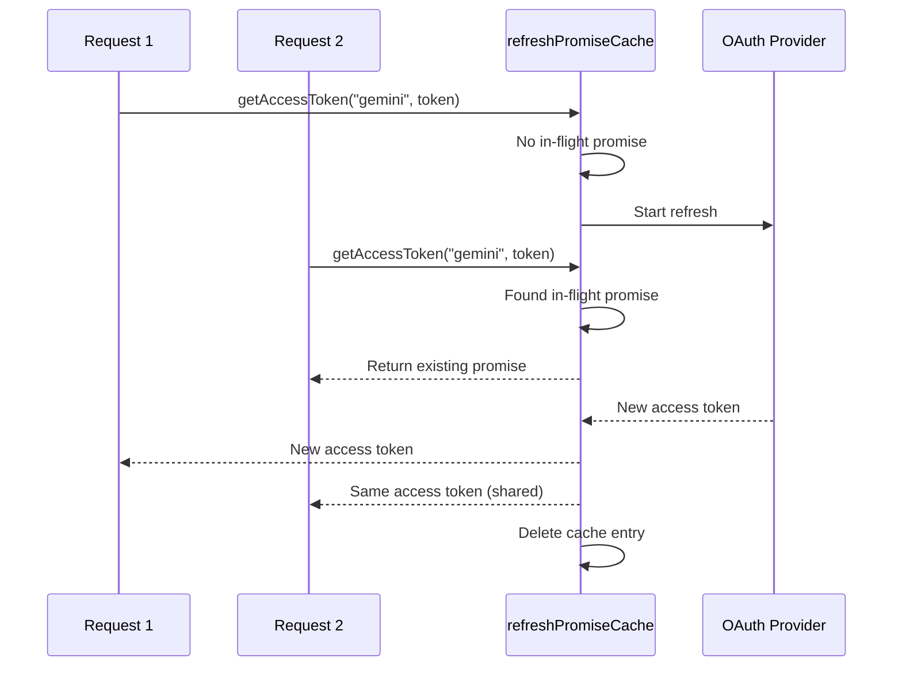

#### Account Fallback State Machine

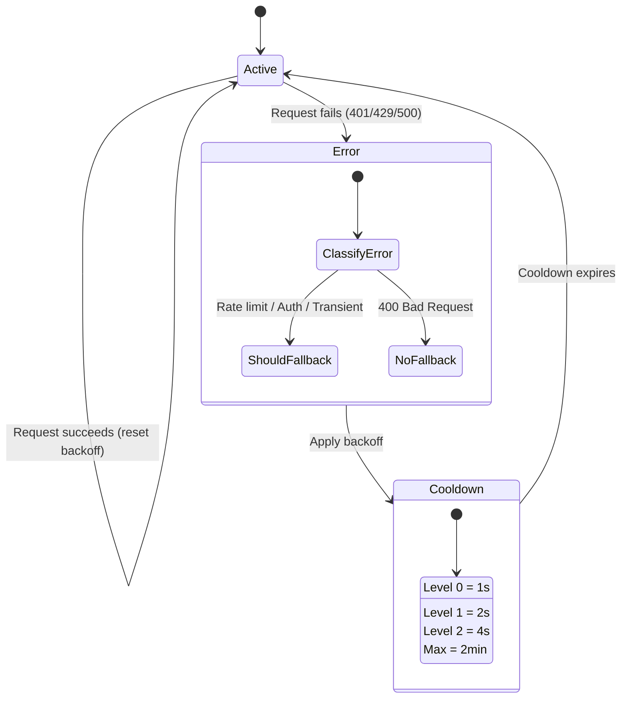

#### שרשרת דגם משולבת

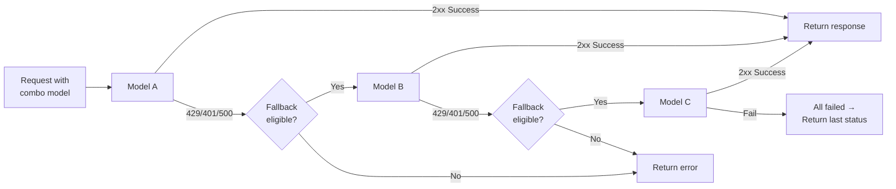

---

### 4.5 מתרגם (`open-sse/translator/`)

The **format translation engine** using a self-registering plugin system.

#### ארכיטקטורה

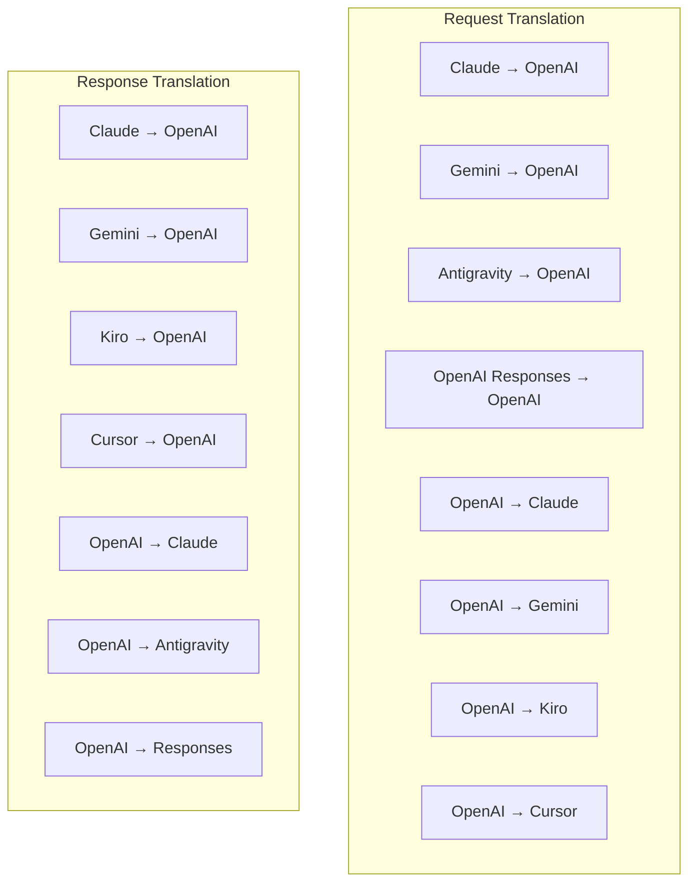

| מדריך        | קבצים     | תיאור                                                                                                                                                                                                                         |
| ------------ | --------- | ----------------------------------------------------------------------------------------------------------------------------------------------------------------------------------------------------------------------------- |
| `request/`   | 8 מתרגמים | המרת גופי בקשה בין פורמטים. כל קובץ נרשם בעצמו באמצעות `register(from, to, fn)` בייבוא.                                                                                                                                       |
| `response/`  | 7 מתרגמים | המר נתחי תגובה זורמת בין פורמטים. מטפל בסוגי אירועי SSE, בלוקי חשיבה, קריאות לכלים.                                                                                                                                           |
| `helpers/`   | 6 עוזרים  | כלי עזר משותפים: `claudeHelper` (חילוץ הנחיות מערכת, תצורת חשיבה), `geminiHelper` (מיפוי חלקים/תוכן), `openaiHelper` (סינון פורמט), `toolCallHelper` (יצירת מזהה, הזרקת תגובה חסרה), `maxTokensHelper`, `responsesApiHelper`. |
| `index.ts`   | —         | מנוע תרגום: `translateRequest()`, `translateResponse()`, הנהלת מדינה, רישום.                                                                                                                                                  |
| `formats.ts` | —         | קבועי פורמט: `OPENAI`, `CLAUDE`, `GEMINI`, `ANTIGRAVITY`, `KIRO`, `CURSOR`, `OPENAI_RESPONSES`.                                                                                                                               |

#### עיצוב מפתח: תוספים לרישום עצמי

```javascript
// Each translator file calls register() on import:
import { register } from "../index.js";
register("claude", "openai", translateClaudeToOpenAI);

// The index.js imports all translator files, triggering registration:
import "./request/claude-to-openai.js"; // ← self-registers
```

---

### 4.6 Utils (`open-sse/utils/`)

| קובץ               | מטרה                                                                                                                                                                                                                                     |
| ------------------ | ---------------------------------------------------------------------------------------------------------------------------------------------------------------------------------------------------------------------------------------- |
| `error.ts`         | בניית תגובת שגיאה (פורמט תואם OpenAI), ניתוח שגיאות במעלה הזרם, חילוץ בזמן ניסיון חוזר נגד כבידה מהודעות שגיאה, הזרמת שגיאות SSE.                                                                                                        |
| `stream.ts`        | **SSE Transform Stream** - צינור הסטרימינג המרכזי. שני מצבים: `TRANSLATE` (תרגום בפורמט מלא) ו-`PASSTHROUGH` (נרמל + חילוץ שימוש). מטפל בחציצה של נתחים, הערכת שימוש, מעקב אחר אורך תוכן. מופעי מקודד/מפענחים לכל זרם נמנעים ממצב משותף. |
| `streamHelpers.ts` | כלי עזר SSE ברמה נמוכה: `parseSSELine` (סובלנות לרווחים לבנים), `hasValuableContent` (מסננים נתחים ריקים עבור OpenAI/Claude/Gemini), `fixInvalidId`, `formatSSE` (ניקוי SSE-TOKEN_103\*\* המודע לפורמט עם ).                             |
| `usageTracking.ts` | חילוץ שימוש באסימונים מכל פורמט (Claude/OpenAI/Gemini/Responses), אומדן עם יחסי תווים/הודעה נפרדים של כלי/הודעה, הוספת חיץ (מרווח בטיחות של 2000 אסימונים), סינון שדות ספציפי לפורמט, רישום מסוף עם צבעי ANSI.                           |
| `requestLogger.ts` | רישום בקשות מבוסס קבצים (הצטרפות דרך `ENABLE_REQUEST_LOGS=true`). יוצר תיקיות הפעלה עם קבצים ממוספרים: `1_req_client.json` → `7_res_client.txt`. כל הקלט/פלט הוא אסינכרון (אש ושכח). מסכה כותרות רגישות.                                 |
| `bypassHandler.ts` | מיירט דפוסים ספציפיים של קלוד CLI (חילוץ כותרת, חימום, ספירה) ומחזיר תגובות מזויפות מבלי להתקשר לאף ספק. תומך גם בסטרימינג וגם לא בסטרימינג. מוגבל בכוונה להיקף קלוד CLI.                                                                |
| `networkProxy.ts`  | פותר כתובת URL של proxy יוצאת עבור ספק נתון עם עדיפות: תצורה ספציפית לספק → תצורה גלובלית → משתני סביבה (`HTTPS_PROXY`/`HTTP_PROXY`/`ALL_PROXY`). תומך בהחרגות `NO_PROXY`. תצורת מטמון עבור שנות ה-30.                                   |

#### צינור הזרמת SSE

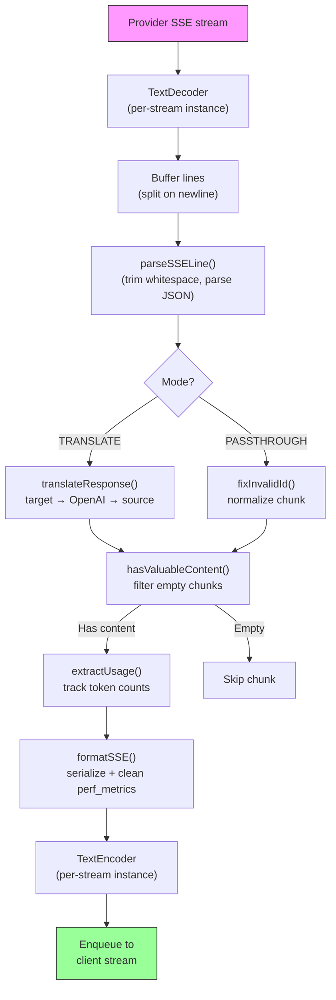

#### בקש מבנה הפעלה של לוגר

```
logs/
└── claude_gemini_claude-sonnet_20260208_143045/
    ├── 1_req_client.json      ← Raw client request
    ├── 2_req_source.json      ← After initial conversion
    ├── 3_req_openai.json      ← OpenAI intermediate format
    ├── 4_req_target.json      ← Final target format
    ├── 5_res_provider.txt     ← Provider SSE chunks (streaming)
    ├── 5_res_provider.json    ← Provider response (non-streaming)
    ├── 6_res_openai.txt       ← OpenAI intermediate chunks
    ├── 7_res_client.txt       ← Client-facing SSE chunks
    └── 6_error.json           ← Error details (if any)
```

---

### 4.7 שכבת יישומים (`src/`)

| מדריך         | מטרה                                                                                |
| ------------- | ----------------------------------------------------------------------------------- |
| `src/app/`    | ממשק משתמש אינטרנט, מסלולי API, תוכנת ביניים אקספרס, מטפלים בהתקשרות חוזרת של OAuth |
| `src/lib/`    | גישה למסד נתונים (`localDb.ts`, `usageDb.ts`), אימות, משותף                         |
| `src/mitm/`   | כלי פרוקסי של אדם-באמצע ליירוט תעבורת ספקים                                         |
| `src/models/` | הגדרות מודל מסד נתונים                                                              |
| `src/shared/` | עוטפים סביב פונקציות Open-sse (ספק, זרם, שגיאה וכו')                                |
| `src/sse/`    | מטפלי נקודות קצה SSE המחוברים את ספריית ה-Open-sse לנתיבי Express                   |
| `src/store/`  | ניהול מצב יישומים                                                                   |

#### נתיבי API בולטים

| מסלול                                         | שיטות          | מטרה                                                                       |
| --------------------------------------------- | -------------- | -------------------------------------------------------------------------- |
| `/api/provider-models`                        | קבל/פרסם/מחק   | CRUD עבור דגמים מותאמים אישית לכל ספק                                      |
| `/api/models/catalog`                         | קבל            | קטלוג מצטבר של כל הדגמים (צ'אט, הטמעה, תמונה, מותאם אישית) מקובצים לפי ספק |
| `/api/settings/proxy`                         | GET/PUT/DELETE | תצורת proxy יוצאת היררכית (`global/providers/combos/keys`)                 |
| `/api/settings/proxy/test`                    | פוסט           | מאמת את קישוריות ה-proxy ומחזירה IP/השהייה ציבורית                         |
| `/v1/providers/[provider]/chat/completions`   | פוסט           | השלמות צ'אט ייעודיות לכל ספק עם אימות מודל                                 |
| `/v1/providers/[provider]/embeddings`         | פוסט           | הטמעות ייעודיות לכל ספק עם אימות מודל                                      |
| `/v1/providers/[provider]/images/generations` | פוסט           | יצירת תמונה ייעודית לכל ספק עם אימות מודל                                  |
| `/api/settings/ip-filter`                     | GET/PUT        | ניהול רשימת הרשאות IP/רשימת חסימה                                          |
| `/api/settings/thinking-budget`               | GET/PUT        | תצורת תקציב אסימון נימוק (מעבר/אוטומטי/מותאם אישית/מותאם)                  |
| `/api/settings/system-prompt`                 | GET/PUT        | הזרקה מהירה של מערכת גלובלית לכל הבקשות                                    |
| `/api/sessions`                               | קבל            | מעקב ומדדי הפעלה פעילים                                                    |
| `/api/rate-limits`                            | קבל            | סטטוס מגבלת תעריף לכל חשבון                                                |

---

## 5. דפוסי עיצוב מפתח

### 5.1 תרגום רכזת ודיבור

כל הפורמטים מתורגמים באמצעות **פורמט OpenAI כמרכז**. הוספת ספק חדש דורשת רק כתיבת **זוג אחד** של מתרגמים (ל/מ OpenAI), לא N זוגות.

### 5.2 דפוס אסטרטגיית מבצעים

לכל ספק יש מחלקת מבצעים ייעודית שיורשת מ`BaseExecutor`. המפעל ב`executors/index.ts` בוחר את המתאים בזמן הריצה.

### 5.3 מערכת פלאגין לרישום עצמי

מודולי מתרגם רושמים את עצמם בייבוא דרך `register()`. הוספת מתרגם חדש היא רק יצירת קובץ ויבואו.

### 5.4 חזרה בחשבון עם גיבוי אקספוננציאלי

כאשר ספק מחזיר 429/401/500, המערכת יכולה לעבור לחשבון הבא, תוך הפעלת צינון אקספוננציאלי (1s → 2s → 4s → max 2mins).

### שרשראות דגם 5.5 משולבות

"קומבו" מקבץ `provider/model` מחרוזות מרובות. אם הראשון נכשל, חזור אל הבא באופן אוטומטי.

### 5.6 תרגום סטרימינג ממלכתי

תרגום תגובה שומר על מצב על פני נתחי SSE (מעקב אחר בלוק חשיבה, צבירת קריאות לכלי, אינדקס של חסימות תוכן) באמצעות מנגנון `initState()`.

### 5.7 מאגר בטיחות לשימוש

מאגר של 2000 אסימון נוסף לשימוש המדווח כדי למנוע מלקוחות להגיע למגבלות חלונות ההקשר עקב תקורה מהנחיות מערכת ותרגום פורמטים.

---

## 6. פורמטים נתמכים

| פורמט                 | כיוון      | מזהה               |
| --------------------- | ---------- | ------------------ |
| השלמות צ'אט של OpenAI | מקור + יעד | `openai`           |
| OpenAI Responses API  | מקור + יעד | `openai-responses` |
| האנתרופי קלוד         | מקור + יעד | `claude`           |
| Google Gemini         | מקור + יעד | `gemini`           |
| Google Gemini CLI     | היעד בלבד  | `gemini-cli`       |
| אנטי כבידה            | מקור + יעד | `antigravity`      |
| AWS Kiro              | היעד בלבד  | `kiro`             |
| סמן                   | היעד בלבד  | `cursor`           |

---

## 7. ספקים נתמכים

| ספק                      | שיטת אישור            | מוציא לפועל | הערות מפתח                                     |
| ------------------------ | --------------------- | ----------- | ---------------------------------------------- |
| האנתרופית קלוד           | מפתח API או OAuth     | ברירת מחדל  | משתמש בכותרת `x-api-key`                       |
| Google Gemini            | מפתח API או OAuth     | ברירת מחדל  | משתמש בכותרת `x-goog-api-key`                  |
| Google Gemini CLI        | OAuth                 | GeminiCLI   | משתמש בנקודת קצה `streamGenerateContent`       |
| אנטי כבידה               | OAuth                 | אנטי כבידה  | ניתוק רב כתובות אתרים, ניסיון חוזר מותאם אישית |
| OpenAI                   | מפתח API              | ברירת מחדל  | אישור נושא תקן                                 |
| קודקס                    | OAuth                 | קודקס       | מזריק הוראות מערכת, מנהל חשיבה                 |
| GitHub Copilot           | OAuth + אסימון פיילוט | Github      | אסימון כפול, מחקה כותרת VSCode                 |
| קירו (AWS)               | AWS SSO OIDC או חברתי | קירו        | ניתוח EventStream בינארי                       |
| הסמן IDE                 | Checksum Auth         | סמן         | קידוד פרוטובוף, סיכומי ביקורת SHA-256          |
| קוון                     | OAuth                 | ברירת מחדל  | אישור רגיל                                     |
| iFlow                    | OAuth (בסיסי + נושא)  | ברירת מחדל  | כותרת אישור כפולה                              |
| OpenRouter               | מפתח API              | ברירת מחדל  | אישור נושא תקן                                 |
| GLM, Kimi, MiniMax       | מפתח API              | ברירת מחדל  | תואם קלוד, השתמש ב-`x-api-key`                 |
| `openai-compatible-*`    | מפתח API              | ברירת מחדל  | דינמי: כל נקודת קצה תואמת OpenAI               |
| `anthropic-compatible-*` | מפתח API              | ברירת מחדל  | דינמי: כל נקודת קצה תואמת קלוד                 |

---

## 8. סיכום זרימת נתונים

### בקשת סטרימינג

```mermaid
flowchart LR
    A["Client"] --> B["detectFormat()"]
    B --> C["translateRequest()\nsource → OpenAI → target"]
    C --> D["Executor\nbuildUrl + buildHeaders"]
    D --> E["fetch(providerURL)"]
    E --> F["createSSEStream()\nTRANSLATE mode"]
    F --> G["parseSSELine()"]
    G --> H["translateResponse()\ntarget → OpenAI → source"]
    H --> I["extractUsage()\n+ addBuffer"]
    I --> J["formatSSE()"]
    J --> K["Client receives\ntranslated SSE"]
    K --> L["logUsage()\nsaveRequestUsage()"]
```

### בקשה ללא סטרימינג

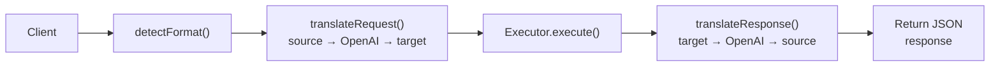

### זרימה עוקפת (קלוד CLI)

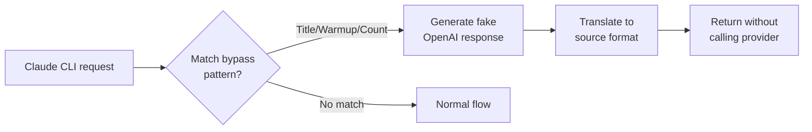
