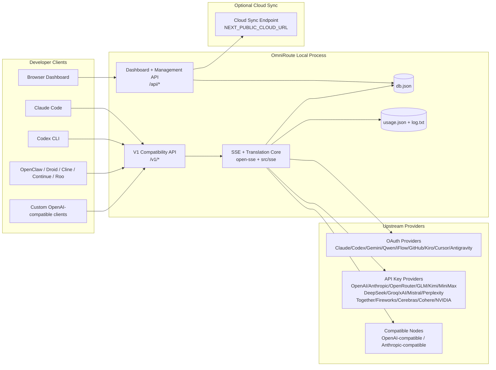
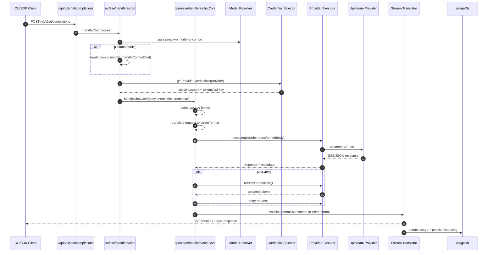
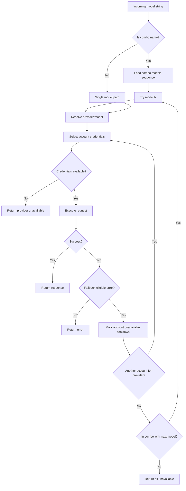
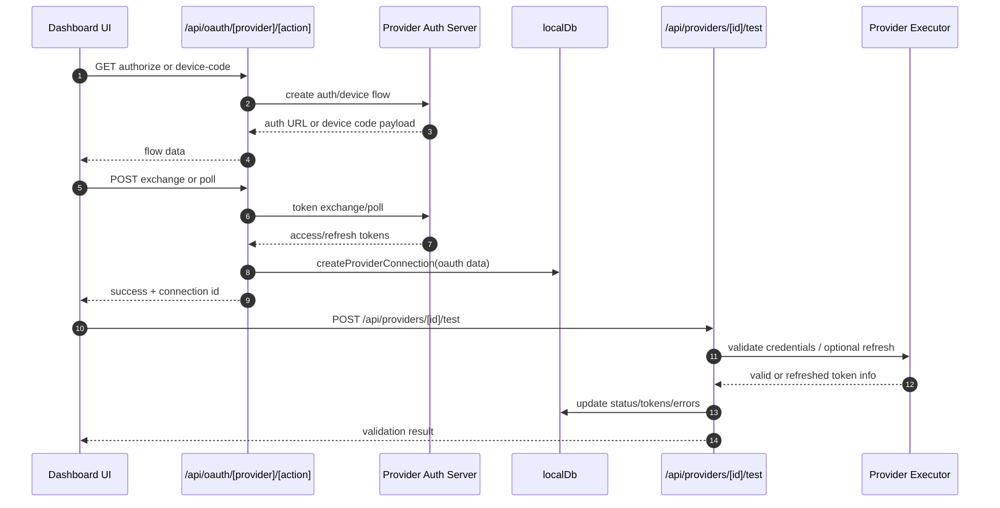
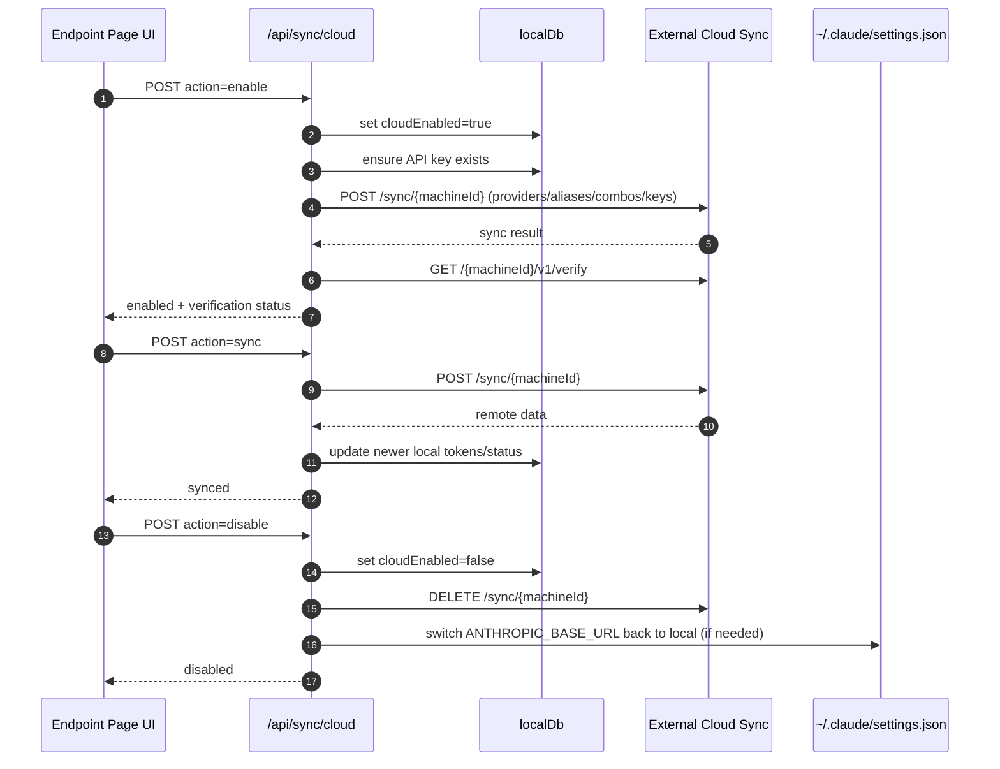
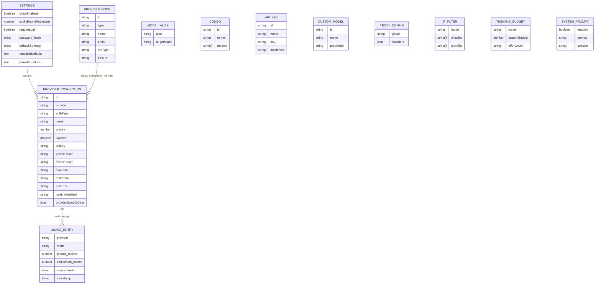
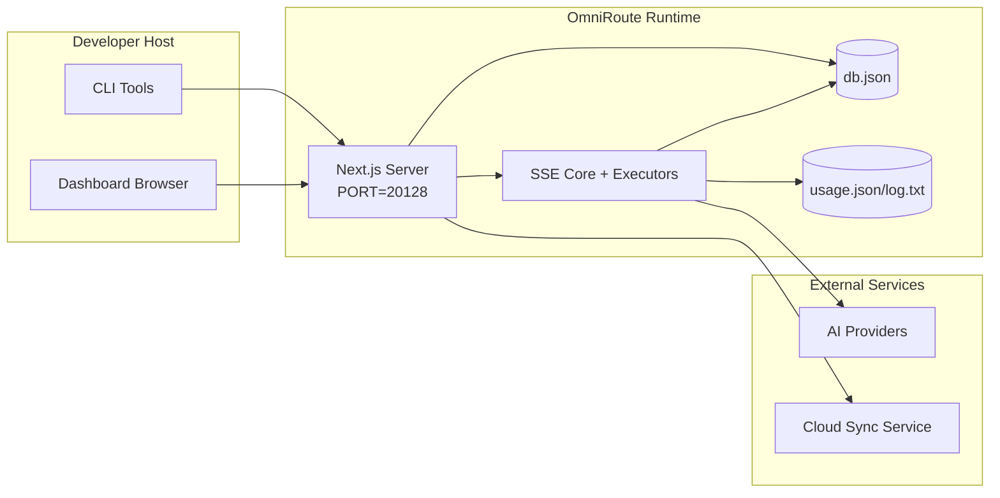

# OmniRoute Architecture

🌐 **Languages:** 🇺🇸 [English](../../ARCHITECTURE.md) | 🇧🇷 [Português (Brasil)](../pt-BR/ARCHITECTURE.md) | 🇪🇸 [Español](../es/ARCHITECTURE.md) | 🇫🇷 [Français](../fr/ARCHITECTURE.md) | 🇮🇹 [Italiano](../it/ARCHITECTURE.md) | 🇷🇺 [Русский](../ru/ARCHITECTURE.md) | 🇨🇳 [中文 (简体)](../zh-CN/ARCHITECTURE.md) | 🇩🇪 [Deutsch](../de/ARCHITECTURE.md) | 🇮🇳 [हिन्दी](../in/ARCHITECTURE.md) | 🇹🇭 [ไทย](../th/ARCHITECTURE.md) | 🇺🇦 [Українська](../uk-UA/ARCHITECTURE.md) | 🇸🇦 [العربية](../ar/ARCHITECTURE.md) | 🇯🇵 [日本語](../ja/ARCHITECTURE.md) | 🇻🇳 [Tiếng Việt](../vi/ARCHITECTURE.md) | 🇧🇬 [Български](../bg/ARCHITECTURE.md) | 🇩🇰 [Dansk](../da/ARCHITECTURE.md) | 🇫🇮 [Suomi](../fi/ARCHITECTURE.md) | 🇮🇱 [עברית](../he/ARCHITECTURE.md) | 🇭🇺 [Magyar](../hu/ARCHITECTURE.md) | 🇮🇩 [Bahasa Indonesia](../id/ARCHITECTURE.md) | 🇰🇷 [한국어](../ko/ARCHITECTURE.md) | 🇲🇾 [Bahasa Melayu](../ms/ARCHITECTURE.md) | 🇳🇱 [Nederlands](../nl/ARCHITECTURE.md) | 🇳🇴 [Norsk](../no/ARCHITECTURE.md) | 🇵🇹 [Português (Portugal)](../pt/ARCHITECTURE.md) | 🇷🇴 [Română](../ro/ARCHITECTURE.md) | 🇵🇱 [Polski](../pl/ARCHITECTURE.md) | 🇸🇰 [Slovenčina](../sk/ARCHITECTURE.md) | 🇸🇪 [Svenska](../sv/ARCHITECTURE.md) | 🇵🇭 [Filipino](../phi/ARCHITECTURE.md)

_Utolsó frissítés: 2026-02-18_

## Vezetői összefoglaló

Az OmniRoute egy helyi mesterséges intelligencia-útválasztó átjáró és irányítópult, amely a Next.js-re épül.
Egyetlen OpenAI-kompatibilis végpontot (`/v1/*`) biztosít, és a forgalmat több upstream szolgáltató között irányítja át fordítással, tartalékkal, tokenfrissítéssel és használati követéssel.

Alapvető képességek:

- OpenAI-kompatibilis API felület a CLI-hez/eszközökhöz (28 szolgáltató)
- Fordítás kérése/válaszolása a szolgáltatói formátumok között
- Model kombinált tartalék (több modell sorozat)
- Fiókszintű tartalék (szolgáltatónként több fiók)
- OAuth + API-kulcs szolgáltatói kapcsolatkezelés
- Beágyazás generálása a `/v1/embeddings` segítségével (6 szolgáltató, 9 modell)
- Képgenerálás a `/v1/images/generations` segítségével (4 szolgáltató, 9 modell)
- Gondoljon a címkeelemzésre (`<think>...</think>`) az érvelési modellekhez
- Válasz fertőtlenítés a szigorú OpenAI SDK-kompatibilitás érdekében
- Szerepek normalizálása (fejlesztő→rendszer, rendszer→felhasználó) a szolgáltatók közötti kompatibilitás érdekében
- Strukturált kimenet átalakítás (json_schema → Gemini responseSchema)
- Helyi kitartás a szolgáltatók, kulcsok, álnevek, kombinációk, beállítások, árképzés számára
- Használat/költségkövetés és kérések naplózása
- Opcionális felhőszinkronizálás több eszköz/állapot szinkronizáláshoz
- IP engedélyezési/blokkolási lista API hozzáférés-vezérléshez
- Átgondolt költségvetés-kezelés (áthaladó/automatikus/egyéni/adaptív)
- Globális rendszer azonnali befecskendezése
- Munkamenet követés és ujjlenyomat
- Fiókonként továbbfejlesztett díjkorlátozás szolgáltató-specifikus profilokkal
- Megszakító minta a szolgáltatói rugalmasság érdekében
- Mennydörgés elleni állományvédelem mutex zárral
- Aláírás alapú kérés deduplikációs gyorsítótár
- Domain réteg: modell elérhetősége, költségszabályok, tartalék házirend, kizárási szabályzat
- Tartomány állapotának fennmaradása (SQLite átírási gyorsítótár tartalékok, költségvetések, zárolások, megszakítók számára)
- Házirend motor a kérelmek központosított értékeléséhez (zárás → költségvetés → tartalék)
- Telemetria kérése p50/p95/p99 késleltetési összesítéssel
- Korrelációs azonosító (X-Request-Id) a végpontok közötti nyomkövetéshez
- Megfelelőségi naplózás API-kulcsonkénti leiratkozással
- Eval keretrendszer az LLM minőségbiztosításhoz
- Rugalmas UI műszerfal valós idejű megszakító állapottal
- Moduláris OAuth-szolgáltatók (12 egyedi modul a `src/lib/oauth/providers/` alatt)

Elsődleges futásidejű modell:

- A `src/app/api/*` alatti Next.js alkalmazásútvonalai irányítópult API-kat és kompatibilitási API-kat is megvalósítanak
- A `src/sse/*` + `open-sse/*` megosztott SSE/routing magja kezeli a szolgáltató végrehajtását, fordítását, adatfolyamát, tartalékát és használatát

## Hatály és határok

### Hatáskörben

- Helyi átjáró futásidejű
- Irányítópult-kezelő API-k
- Szolgáltató hitelesítése és token frissítése
- Fordítás és SSE streaming kérése
- Helyi állapot + használat tartóssága
- Opcionális felhőszinkronizálás

### A hatályon kívül

- Felhőszolgáltatás megvalósítása a `NEXT_PUBLIC_CLOUD_URL` mögött
- Szolgáltató SLA/vezérlő síkja a helyi folyamaton kívül
- Maguk a külső CLI binárisok (Claude CLI, Codex CLI stb.)

## Magas szintű rendszerkontextus



## Alapvető futásidejű összetevők

## 1) API és útválasztási réteg (Next.js App Routes)

Fő könyvtárak:

- `src/app/api/v1/*` és `src/app/api/v1beta/*` a kompatibilitási API-khoz
- `src/app/api/*` a felügyeleti/konfigurációs API-khoz
- Következő átírások a `next.config.mjs` leképezésben `/v1/*` ide: `/api/v1/*`

Fontos kompatibilitási útvonalak:

- `src/app/api/v1/chat/completions/route.ts`
- `src/app/api/v1/messages/route.ts`
- `src/app/api/v1/responses/route.ts`
- `src/app/api/v1/models/route.ts` - egyéni modelleket tartalmaz `custom: true`
- `src/app/api/v1/embeddings/route.ts` - beágyazás generálása (6 szolgáltató)
- `src/app/api/v1/images/generations/route.ts` — képgenerálás (4+ szolgáltató, beleértve az Antigravitációt/Nebiust)
- `src/app/api/v1/messages/count_tokens/route.ts`
- `src/app/api/v1/providers/[provider]/chat/completions/route.ts` – dedikált szolgáltatónkénti csevegés
- `src/app/api/v1/providers/[provider]/embeddings/route.ts` – dedikált szolgáltatónkénti beágyazások
- `src/app/api/v1/providers/[provider]/images/generations/route.ts` – szolgáltatónként dedikált képek
- `src/app/api/v1beta/models/route.ts`
- `src/app/api/v1beta/models/[...path]/route.ts`

Kezelési tartományok:

- Hitelesítés/beállítások: `src/app/api/auth/*`, `src/app/api/settings/*`
- Szolgáltatók/kapcsolatok: `src/app/api/providers*`
- Szolgáltató csomópontjai: `src/app/api/provider-nodes*`
- Egyedi modellek: `src/app/api/provider-models` (GET/POST/DELETE)
- Modellkatalógus: `src/app/api/models/catalog` (GET)
- Proxy konfigurációja: `src/app/api/settings/proxy` (GET/PUT/DELETE) + `src/app/api/settings/proxy/test` (POST)
- OAuth: `src/app/api/oauth/*`
- Kulcsok/álnevek/kombók/árazás: `src/app/api/keys*`, `src/app/api/models/alias`, `src/app/api/combos*`, `src/app/api/pricing`
- Használat: `src/app/api/usage/*`
- Szinkronizálás/felhő: `src/app/api/sync/*`, `src/app/api/cloud/*`
- CLI-eszközök segédei: `src/app/api/cli-tools/*`
- IP-szűrő: `src/app/api/settings/ip-filter` (GET/PUT)
- Átgondolt költségvetés: `src/app/api/settings/thinking-budget` (GET/PUT)
- Rendszerprompt: `src/app/api/settings/system-prompt` (GET/PUT)
- Munkamenetek: `src/app/api/sessions` (GET)
- Díjkorlátok: `src/app/api/rate-limits` (GET)
- Rugalmasság: `src/app/api/resilience` (GET/PATCH) – szolgáltatói profilok, megszakító, sebességkorlát állapot
- Rugalmasság visszaállítása: `src/app/api/resilience/reset` (POST) - megszakítók visszaállítása + lehűlés
- Gyorsítótár statisztikái: `src/app/api/cache/stats` (GET/DELETE)
- A modell elérhetősége: `src/app/api/models/availability` (GET/POST)
- Telemetria: `src/app/api/telemetry/summary` (GET)
- Költségkeret: `src/app/api/usage/budget` (GET/POST)
- Tartalékláncok: `src/app/api/fallback/chains` (GET/POST/DELETE)
- Megfelelőségi ellenőrzés: `src/app/api/compliance/audit-log` (GET)
- Evals: `src/app/api/evals` (GET/POST), `src/app/api/evals/[suiteId]` (GET)
- Irányelvek: `src/app/api/policies` (GET/POST)

## 2) SSE + Translation Core

Fő áramlási modulok:

- Bejegyzés: `src/sse/handlers/chat.ts`
- Alaphangszerelés: `open-sse/handlers/chatCore.ts`
- Szolgáltatói végrehajtási adapterek: `open-sse/executors/*`
- Formátumészlelés/szolgáltató konfigurációja: `open-sse/services/provider.ts`
- Modell elemzés/feloldás: `src/sse/services/model.ts`, `open-sse/services/model.ts`
- Fiók tartalék logikája: `open-sse/services/accountFallback.ts`
- Fordítási nyilvántartás: `open-sse/translator/index.ts`
- Adatfolyam átalakítások: `open-sse/utils/stream.ts`, `open-sse/utils/streamHandler.ts`
- Használat kibontása/normalizálása: `open-sse/utils/usageTracking.ts`
- Think címkeelemző: `open-sse/utils/thinkTagParser.ts`
- Beágyazáskezelő: `open-sse/handlers/embeddings.ts`
- Beágyazási szolgáltató nyilvántartása: `open-sse/config/embeddingRegistry.ts`
- Képgeneráló kezelő: `open-sse/handlers/imageGeneration.ts`
- Képszolgáltató nyilvántartása: `open-sse/config/imageRegistry.ts`
- Válasz fertőtlenítés: `open-sse/handlers/responseSanitizer.ts`
- Szerepkör normalizálása: `open-sse/services/roleNormalizer.ts`

Szolgáltatások (üzleti logika):

- Fiókválasztás/pontozás: `open-sse/services/accountSelector.ts`
- Kontextus-életciklus-kezelés: `open-sse/services/contextManager.ts`
- IP-szűrő betartatása: `open-sse/services/ipFilter.ts`
- Munkamenetkövetés: `open-sse/services/sessionManager.ts`
- Deduplikáció kérése: `open-sse/services/signatureCache.ts`
- Rendszerkérdés: `open-sse/services/systemPrompt.ts`
- Gondolkodó költségvetés-kezelés: `open-sse/services/thinkingBudget.ts`
- Helyettesítő karakteres modell-útválasztás: `open-sse/services/wildcardRouter.ts`
- Díjkorlát kezelése: `open-sse/services/rateLimitManager.ts`
- Megszakító: `open-sse/services/circuitBreaker.ts`

Domain réteg modulok:

- A modell elérhetősége: `src/lib/domain/modelAvailability.ts`
- Költségszabályok/költségkeretek: `src/lib/domain/costRules.ts`
- Tartalék irányelv: `src/lib/domain/fallbackPolicy.ts`
- Kombinált feloldó: `src/lib/domain/comboResolver.ts`
- Kizárási szabályzat: `src/lib/domain/lockoutPolicy.ts`
- Irányelvmotor: `src/domain/policyEngine.ts` — központi zárolás → költségvetés → tartalék értékelés
- Hibakód-katalógus: `src/lib/domain/errorCodes.ts`
- Kérelem azonosítója: `src/lib/domain/requestId.ts`
- Lekérési időtúllépés: `src/lib/domain/fetchTimeout.ts`
- Telemetria kérése: `src/lib/domain/requestTelemetry.ts`
- Megfelelőség/ellenőrzés: `src/lib/domain/compliance/index.ts`
- Eval futó: `src/lib/domain/evalRunner.ts`
- A tartomány állapotának fennmaradása: `src/lib/db/domainState.ts` — SQLite CRUD tartalék láncokhoz, költségvetésekhez, költségelőzményekhez, zárolási állapothoz, megszakítókhoz

OAuth-szolgáltató modulok (12 külön fájl a `src/lib/oauth/providers/` alatt):

- Nyilvántartási index: `src/lib/oauth/providers/index.ts`
- Egyéni szolgáltatók: `claude.ts`, `codex.ts`, `gemini.ts`, `antigravity.ts`, `iflow.ts`, ,\_118_TOK `kimi-coding.ts`, `github.ts`, `kiro.ts`, `cursor.ts`, `kilocode.ts`, `cline.ts`
- Vékony burkolat: `src/lib/oauth/providers.ts` - újraexportálás az egyes modulokból

## 3) Perzisztencia réteg

Elsődleges állapot DB:

- `src/lib/localDb.ts`
- fájl: `${DATA_DIR}/db.json` (vagy `$XDG_CONFIG_HOME/omniroute/db.json`, ha be van állítva, különben `~/.omniroute/db.json`)
- entitások: providerConnections, providerNodes, modelAliases, kombók, apiKeys, beállítások, árképzés, **customModels**, **proxyConfig**, **ipFilter**, **thhinkingBudget**, **systemPrompt**

DB használat:

- `src/lib/usageDb.ts`
- fájlok: `${DATA_DIR}/usage.json`, `${DATA_DIR}/log.txt`, `${DATA_DIR}/call_logs/`
- ugyanazt az alapkönyvtár-házirendet követi, mint a `localDb` (`DATA_DIR`, majd `XDG_CONFIG_HOME/omniroute`, ha be van állítva)
- fókuszált almodulokra bontva: `migrations.ts`, `usageHistory.ts`, `costCalculator.ts`, `usageStats.ts`, `callLogs.ts`

Domain State DB (SQLite):

- `src/lib/db/domainState.ts` - CRUD műveletek a tartomány állapotához
- Táblázatok (létrehozva: `src/lib/db/core.ts`): `domain_fallback_chains`, `domain_budgets`, `domain_cost_history`, `domain_lockout_state`,
- Átírási gyorsítótár minta: a memórián belüli térképek mérvadóak futás közben; a mutációk szinkronban íródnak az SQLite-ba; állapot visszaáll a DB-ből hidegindításkor

## 4) Auth + biztonsági felületek

- Az irányítópult cookie hitelesítése: `src/proxy.ts`, `src/app/api/auth/login/route.ts`
- API-kulcs létrehozása/ellenőrzése: `src/shared/utils/apiKey.ts`
- A szolgáltató titkai `providerConnections` bejegyzésben is megmaradtak
- Kimenő proxy támogatása a következőn keresztül: `open-sse/utils/proxyFetch.ts` (env vars) és `open-sse/utils/networkProxy.ts` (szolgáltatónként konfigurálható vagy globális)

## 5) Cloud Sync

- Ütemező init: `src/lib/initCloudSync.ts`, `src/shared/services/initializeCloudSync.ts`
- Időszakos feladat: `src/shared/services/cloudSyncScheduler.ts`
- Irányítási útvonal: `src/app/api/sync/cloud/route.ts`

## Kérelem életciklusa (`/v1/chat/completions`)



## Kombinált + fiók tartalék folyamat



A tartalék döntéseket az `open-sse/services/accountFallback.ts` vezérli állapotkódok és hibaüzenet-heurisztika használatával.

## OAuth beépítési és tokenfrissítési életciklus



Az élő forgalom alatti frissítés a `open-sse/handlers/chatCore.ts`-ban történik a `refreshCredentials()` végrehajtón keresztül.

## Cloud Sync életciklusa (Engedélyezés / Szinkronizálás / Letiltása)



Az időszakos szinkronizálást a `CloudSyncScheduler` váltja ki, ha a felhő engedélyezve van.

## Adatmodell és tárolási térkép



Fizikai tároló fájlok:

- fő állapot: `${DATA_DIR}/db.json` (vagy `$XDG_CONFIG_HOME/omniroute/db.json`, ha be van állítva, különben `~/.omniroute/db.json`)
- használati statisztika: `${DATA_DIR}/usage.json`
- kérésnapló sorai: `${DATA_DIR}/log.txt`
- opcionális fordítói/hibakereső munkamenetek kérése: `<repo>/logs/...`

## Telepítési topológia



## Modulleképezés (döntéskritikus)

### Útvonal- és API-modulok

- `src/app/api/v1/*`, `src/app/api/v1beta/*`: kompatibilitási API-k
- `src/app/api/v1/providers/[provider]/*`: dedikált szolgáltatónkénti útvonalak (csevegés, beágyazás, képek)
- `src/app/api/providers*`: szolgáltató CRUD, érvényesítés, tesztelés
- `src/app/api/provider-nodes*`: egyéni kompatibilis csomópontkezelés
- `src/app/api/provider-models`: egyéni modellkezelés (CRUD)
- `src/app/api/models/catalog`: teljes modellkatalógus API (minden típus szolgáltató szerint csoportosítva)
- `src/app/api/oauth/*`: OAuth/eszközkód folyamatok
- `src/app/api/keys*`: helyi API kulcs életciklusa
- `src/app/api/models/alias`: alias kezelés
- `src/app/api/combos*`: tartalék kombinált kezelés
- `src/app/api/pricing`: az árképzés felülbírálása a költségszámításhoz
- `src/app/api/settings/proxy`: proxy konfiguráció (GET/PUT/DELETE)
- `src/app/api/settings/proxy/test`: kimenő proxy csatlakozási teszt (POST)
- `src/app/api/usage/*`: használati és naplózási API-k
- `src/app/api/sync/*` + `src/app/api/cloud/*`: felhőszinkronizálás és felhő felé néző segítők
- `src/app/api/cli-tools/*`: helyi CLI konfigurációs írók/ellenőrzők
- `src/app/api/settings/ip-filter`: IP-engedélyezési lista/blokkolista (GET/PUT)
- `src/app/api/settings/thinking-budget`: gondolkodó token költségvetési konfiguráció (GET/PUT)
- `src/app/api/settings/system-prompt`: globális rendszerprompt (GET/PUT)
- `src/app/api/sessions`: aktív munkamenet-lista (GET)
- `src/app/api/rate-limits`: számlánkénti kamatkorlát állapota (GET)

### Routing and Execution Core

- `src/sse/handlers/chat.ts`: kéréselemzés, kombinált kezelés, fiókválasztó hurok
- `open-sse/handlers/chatCore.ts`: fordítás, végrehajtó feladás, újrapróbálkozás/frissítés kezelése, adatfolyam beállítása
- `open-sse/executors/*`: szolgáltató-specifikus hálózati és formátumviselkedés

### Fordítási nyilvántartó és formátumkonvertálók

- `open-sse/translator/index.ts`: fordítói nyilvántartás és hangszerelés
- Fordítók kérése: `open-sse/translator/request/*`
- Válaszfordítók: `open-sse/translator/response/*`
- Formátum állandók: `open-sse/translator/formats.ts`

### Kitartás

- `src/lib/localDb.ts`: állandó konfiguráció/állapot
- `src/lib/usageDb.ts`: használati előzmények és gördülő kérésnaplók

## Szolgáltatói végrehajtói lefedettség (stratégiai minta)

Minden szolgáltató rendelkezik egy speciális végrehajtóval, amely kiterjeszti a `BaseExecutor`-t (a `open-sse/executors/base.ts`-ban), amely URL-építést, fejléc-építést, újrapróbálkozást exponenciális visszalépéssel, hitelesítő adatok frissítését és az `execute()` hangszerelési módszert biztosítja.

| Végrehajtó            | Szolgáltató(k)                                                                                                                                               | Különleges kezelés                                                         |
| --------------------- | ------------------------------------------------------------------------------------------------------------------------------------------------------------ | -------------------------------------------------------------------------- |
| `DefaultExecutor`     | OpenAI, Claude, Gemini, Qwen, iFlow, OpenRouter, GLM, Kimi, MiniMax, DeepSeek, Groq, xAI, Mistral, Perplexity, Together, Fireworks, Cerebras, Cohere, NVIDIA | Dinamikus URL/fejléc konfiguráció szolgáltatónként                         |
| `AntigravityExecutor` | Google Antigravitáció                                                                                                                                        | Egyéni projekt/munkamenet azonosítók, Újrapróbálkozás-elemzés után         |
| `CodexExecutor`       | OpenAI Codex                                                                                                                                                 | Rendszerutasításokat szúr be, érvelési erőfeszítést kényszerít             |
| `CursorExecutor`      | Kurzor IDE                                                                                                                                                   | ConnectRPC protokoll, Protobuf kódolás, kérés aláírása ellenőrző összeggel |
| `GithubExecutor`      | GitHub másodpilóta                                                                                                                                           | Másodpilóta token frissítése, VSCode-utánzó fejlécek                       |
| `KiroExecutor`        | AWS CodeWhisperer/Kiro                                                                                                                                       | AWS EventStream bináris formátum → SSE konverzió                           |
| `GeminiCLIExecutor`   | Gemini CLI                                                                                                                                                   | Google OAuth-token frissítési ciklus                                       |

Az összes többi szolgáltató (beleértve az egyéni kompatibilis csomópontokat is) használja a `DefaultExecutor`.

## Szolgáltatói kompatibilitási mátrix

| Szolgáltató        | Formátum         | Auth                      | Stream             | Nem adatfolyam | Token Refresh | Használati API            |
| ------------------ | ---------------- | ------------------------- | ------------------ | -------------- | ------------- | ------------------------- |
| Claude             | claude           | API kulcs / OAuth         | ✅                 | ✅             | ✅            | ⚠️ Csak adminisztrátor    |
| Ikrek              | ikrek            | API kulcs / OAuth         | ✅                 | ✅             | ✅            | ⚠️ Cloud Console          |
| Gemini CLI         | gemini-cli       | OAuth                     | ✅                 | ✅             | ✅            | ⚠️ Cloud Console          |
| Antigravitáció     | antigravitáció   | OAuth                     | ✅                 | ✅             | ✅            | ✅ Teljes kvóta API       |
| OpenAI             | openai           | API kulcs                 | ✅                 | ✅             | ❌            | ❌                        |
| Codex              | openai-responses | OAuth                     | ✅ kényszer        | ❌             | ✅            | ✅ Díjkorlátok            |
| GitHub másodpilóta | openai           | OAuth + másodpilóta token | ✅                 | ✅             | ✅            | ✅ Kvóta pillanatképek    |
| Kurzor             | kurzor           | Egyéni ellenőrző összeg   | ✅                 | ✅             | ❌            | ❌                        |
| Kiro               | kiro             | AWS SSO OIDC              | ✅ (Eseményfolyam) | ❌             | ✅            | ✅ Felhasználási korlátok |
| Qwen               | openai           | OAuth                     | ✅                 | ✅             | ✅            | ⚠️ Kérésre                |
| iFlow              | openai           | OAuth (alap)              | ✅                 | ✅             | ✅            | ⚠️ Kérésre                |
| OpenRouter         | openai           | API kulcs                 | ✅                 | ✅             | ❌            | ❌                        |
| GLM/Kimi/MiniMax   | claude           | API kulcs                 | ✅                 | ✅             | ❌            | ❌                        |
| DeepSeek           | openai           | API kulcs                 | ✅                 | ✅             | ❌            | ❌                        |
| Groq               | openai           | API kulcs                 | ✅                 | ✅             | ❌            | ❌                        |
| xAI (Grok)         | openai           | API kulcs                 | ✅                 | ✅             | ❌            | ❌                        |
| Mistral            | openai           | API kulcs                 | ✅                 | ✅             | ❌            | ❌                        |
| Zavartság          | openai           | API kulcs                 | ✅                 | ✅             | ❌            | ❌                        |
| Együtt AI          | openai           | API kulcs                 | ✅                 | ✅             | ❌            | ❌                        |
| Tűzijáték AI       | openai           | API kulcs                 | ✅                 | ✅             | ❌            | ❌                        |
| Cerebrák           | openai           | API kulcs                 | ✅                 | ✅             | ❌            | ❌                        |
| Cohere             | openai           | API kulcs                 | ✅                 | ✅             | ❌            | ❌                        |
| NVIDIA NIM         | openai           | API kulcs                 | ✅                 | ✅             | ❌            | ❌                        |

## Formátum fordítási lefedettség

Az észlelt forrásformátumok a következők:

- `openai`
- `openai-responses`
- `claude`
- `gemini`

A célformátumok a következők:

- OpenAI chat/válaszok
- Claude
- Gemini/Gemini-CLI/Antigravitációs boríték
- Kiro
- Kurzor

A fordítások az **OpenAI-t használják hub-formátumként** – minden konverzió köztesként az OpenAI-n megy keresztül:

```
Source Format → OpenAI (hub) → Target Format
```

A fordítások kiválasztása dinamikusan történik a forrás hasznos adat alakja és a szolgáltató célformátuma alapján.

További feldolgozási rétegek a fordítási folyamatban:

- **Választisztítás** – Megszünteti a nem szabványos mezőket az OpenAI-formátumú válaszoktól (mind az adatfolyam-, mind a nem streameléstől) a szigorú SDK-megfelelőség biztosítása érdekében
- **Szerepnormalizálás** — `developer` → `system` konvertálása nem OpenAI-célokhoz; egyesíti a `system` → `user` a rendszerszerepkört elutasító modellekhez (GLM, ERNIE)
- **Think címke kivonatolás** — `<think>...</think>` blokkot elemzi a tartalomból a `reasoning_content` mezőbe
- **Strukturált kimenet** - Az OpenAI `response_format.json_schema` konvertálása Gemini `responseMimeType` + `responseSchema`

## Támogatott API-végpontok

| Végpont                                            | Formátum                | Kezelő                                                     |
| -------------------------------------------------- | ----------------------- | ---------------------------------------------------------- |
| `POST /v1/chat/completions`                        | OpenAI Chat             | `src/sse/handlers/chat.ts`                                 |
| `POST /v1/messages`                                | Claude Üzenetek         | Ugyanaz a kezelő (automatikusan észlelve)                  |
| `POST /v1/responses`                               | OpenAI válaszok         | `open-sse/handlers/responsesHandler.ts`                    |
| `POST /v1/embeddings`                              | OpenAI beágyazások      | `open-sse/handlers/embeddings.ts`                          |
| `GET /v1/embeddings`                               | Modell lista            | API útvonal                                                |
| `POST /v1/images/generations`                      | OpenAI Images           | `open-sse/handlers/imageGeneration.ts`                     |
| `GET /v1/images/generations`                       | Modell lista            | API útvonal                                                |
| `POST /v1/providers/{provider}/chat/completions`   | OpenAI Chat             | Dedikált szolgáltatónként modellellenőrzéssel              |
| `POST /v1/providers/{provider}/embeddings`         | OpenAI beágyazások      | Dedikált szolgáltatónként modellellenőrzéssel              |
| `POST /v1/providers/{provider}/images/generations` | OpenAI Images           | Dedikált szolgáltatónként modellellenőrzéssel              |
| `POST /v1/messages/count_tokens`                   | Claude Token Count      | API útvonal                                                |
| `GET /v1/models`                                   | OpenAI modellek listája | API útvonal (csevegés + beágyazás + kép + egyéni modellek) |
| `GET /api/models/catalog`                          | Katalógus               | Minden modell szolgáltató + típus szerint csoportosítva    |
| `POST /v1beta/models/*:streamGenerateContent`      | Ikrek bennszülött       | API útvonal                                                |
| `GET/PUT/DELETE /api/settings/proxy`               | Proxy konfiguráció      | Hálózati proxy konfiguráció                                |
| `POST /api/settings/proxy/test`                    | Proxy kapcsolat         | Proxy állapot/kapcsolati teszt végpontja                   |
| `GET/POST/DELETE /api/provider-models`             | Egyedi modellek         | Egyéni modellkezelés szolgáltatónként                      |

## Bypass Handler

A bypass kezelő (`open-sse/utils/bypassHandler.ts`) elfogja a Claude CLI ismert "kidobási" kéréseit – bemelegítő pingeket, címkivonatokat és tokenszámlálást –, és **hamis választ** ad vissza anélkül, hogy felhasználná a upstream szolgáltatói tokeneket. Ez csak akkor aktiválódik, ha az `User-Agent` tartalmazza a `claude-cli` értéket.

## Kérjen Logger Pipeline-t

A kérésnaplózó (`open-sse/utils/requestLogger.ts`) egy 7 szakaszból álló hibakeresési naplózási folyamatot biztosít, amely alapértelmezés szerint le van tiltva, és a következőn keresztül engedélyezett: `ENABLE_REQUEST_LOGS=true`:

```
1_req_client.json → 2_req_source.json → 3_req_openai.json → 4_req_target.json
→ 5_res_provider.txt → 6_res_openai.txt → 7_res_client.txt
```

A fájlok a `<repo>/logs/<session>/` címre íródnak minden egyes kérési munkamenethez.

## Hibamódok és rugalmasság

## 1) Számla/szolgáltató elérhetősége

- szolgáltatói fiók lehűtése tranziens/sebesség/hitelesítési hibák esetén
- tartalék fiók a sikertelen kérés előtt
- kombinált modell tartalék, ha az aktuális modell/szolgáltató elérési útja kimerült

## 2) Token lejárata

- Előzetes ellenőrzés és frissítés újrapróbálkozással a frissíthető szolgáltatóknál
- 401/403 újrapróbálkozás frissítési kísérlet után az alapútvonalon

## 3) Stream-biztonság

- leválasztást érzékelő streamvezérlő
- fordítási adatfolyam a folyam végének kiürítésével és `[DONE]` kezelésével
- a használati becslés tartaléka, ha hiányoznak a szolgáltató használati metaadatai

## 4) A felhőszinkronizálás leromlása

- szinkronizálási hibák jelennek meg, de a helyi futásidő folytatódik
- Az ütemező rendelkezik újrapróbálkozásra alkalmas logikával, de az időszakos végrehajtás jelenleg alapértelmezés szerint egykísérletű szinkronizálást hív meg

## 5) Adatintegritás

- DB alakzat migráció/javítás a hiányzó kulcsok miatt
- sérült JSON-visszaállítási biztosítékok a localDb és a usageDb számára

## Megfigyelhetőség és működési jelek

Futásidejű láthatósági források:

- konzolnaplók innen: `src/sse/utils/logger.ts`
- kérésenkénti használati összesítések a `usage.json`-ban
- szöveges kérés állapot bejelentkezés `log.txt`
- opcionális mélykérési/fordítási naplók a `logs/` alatt, amikor `ENABLE_REQUEST_LOGS=true`
- irányítópult-használati végpontok (`/api/usage/*`) a felhasználói felület használatához

## Biztonságra érzékeny határok

- A JWT titkos (`JWT_SECRET`) biztosítja az irányítópult-munkamenet cookie-ellenőrzését/aláírását
- A kezdeti tartalék jelszót (`INITIAL_PASSWORD`, alapértelmezett `123456`) felül kell bírálni valós telepítéseknél
- API kulcs HMAC titkos (`API_KEY_SECRET`) biztosítja a generált helyi API kulcs formátumát
- A szolgáltatói titkok (API-kulcsok/tokenek) megmaradnak a helyi adatbázisban, és fájlrendszer-szinten védeni kell őket
- A felhőszinkronizálási végpontok API kulcs hitelesítés + gépazonosító szemantikára támaszkodnak

## Környezet és futásidejű mátrix

A kód által aktívan használt környezeti változók:

- Alkalmazás/hitelesítés: `JWT_SECRET`, `INITIAL_PASSWORD`
- Tárhely: `DATA_DIR`
- Kompatibilis csomópont viselkedése: `ALLOW_MULTI_CONNECTIONS_PER_COMPAT_NODE`
- Opcionális tárhely-alap-felülírás (Linux/macOS, ha `DATA_DIR` nincs beállítva): `XDG_CONFIG_HOME`
- Biztonsági kivonatolás: `API_KEY_SECRET`, `MACHINE_ID_SALT`
- Naplózás: `ENABLE_REQUEST_LOGS`
- Szinkronizálás/felhő URL-elés: `NEXT_PUBLIC_BASE_URL`, `NEXT_PUBLIC_CLOUD_URL`
- Kimenő proxy: `HTTP_PROXY`, `HTTPS_PROXY`, `ALL_PROXY`, `NO_PROXY` és kisbetűs változatai
- SOCKS5 funkciójelzők: `ENABLE_SOCKS5_PROXY`, `NEXT_PUBLIC_ENABLE_SOCKS5_PROXY`
- Platform/futásidejű segítők (nem alkalmazás-specifikus konfiguráció): `APPDATA`, `NODE_ENV`, `PORT`, `HOSTNAME`

## Ismert építészeti megjegyzések

1. `usageDb` és `localDb` most ugyanazt az alapkönyvtár-házirendet (`DATA_DIR` -> `XDG_CONFIG_HOME/omniroute` -> `~/.omniroute`) osztja meg örökölt fájlmigrációval.
2. Az `/api/v1/route.ts` statikus modelllistát ad vissza, és nem a `/v1/models` által használt fő modellforrás.
3. A kérésnaplózó teljes fejlécet/törzsöt ír, ha engedélyezve van; a naplókönyvtárat érzékenyként kezeli.
4. A felhő viselkedése a helyes `NEXT_PUBLIC_BASE_URL` és a felhő-végpont elérhetőségétől függ.
5. Az `open-sse/` könyvtár `@omniroute/open-sse` **npm munkaterület-csomagként** lett közzétéve. A forráskód a `@omniroute/open-sse/...`-on keresztül importálja (a Next.js `transpilePackages` által megoldva). A dokumentum elérési útjai továbbra is a `open-sse/` könyvtárnevet használják a következetesség érdekében.
6. Az irányítópulton lévő diagramok **Újragrafikonokat** (SVG-alapú) használnak az elérhető, interaktív analitikai vizualizációkhoz (modellhasználati sávdiagramok, szolgáltatói bontási táblázatok sikerarányokkal).
7. Az E2E-tesztek a **Playwright**-ot (`tests/e2e/`) használják, a `npm run test:e2e`-on keresztül futnak. Az egységtesztek a **Node.js tesztfutót** (`tests/unit/`) használják, a `npm run test:plan3`-on keresztül futnak. A `src/` alatti forráskód **TypeScript** (`.ts`/`.tsx`); az `open-sse/` munkaterület továbbra is JavaScript marad (`.js`).
8. A Beállítások oldal 5 lapra van felosztva: Biztonság, Útválasztás (6 globális stratégia: kitöltés-első, kör-robin, p2c, véletlenszerű, legkevésbé használt, költségoptimalizált), Rugalmasság (szerkeszthető sebességkorlátok, megszakító, házirendek), AI (gondolkodó költségvetés, rendszerkérdés, gyorsítótár), Speciális (proxy).

## Működési ellenőrzési ellenőrzőlista

- Forrás: `npm run build`
- Build Docker kép: `docker build -t omniroute .`
- Indítsa el a szervizt és ellenőrizze:
- `GET /api/settings`
- `GET /api/v1/models`
- A CLI cél alap URL-jének `http://<host>:20128/v1` kell lennie, amikor `PORT=20128`
