# omniroute — Kódbázis-dokumentáció

🌐 **Languages:** 🇺🇸 [English](../../CODEBASE_DOCUMENTATION.md) | 🇧🇷 [Português (Brasil)](../pt-BR/CODEBASE_DOCUMENTATION.md) | 🇪🇸 [Español](../es/CODEBASE_DOCUMENTATION.md) | 🇫🇷 [Français](../fr/CODEBASE_DOCUMENTATION.md) | 🇮🇹 [Italiano](../it/CODEBASE_DOCUMENTATION.md) | 🇷🇺 [Русский](../ru/CODEBASE_DOCUMENTATION.md) | 🇨🇳 [中文 (简体)](../zh-CN/CODEBASE_DOCUMENTATION.md) | 🇩🇪 [Deutsch](../de/CODEBASE_DOCUMENTATION.md) | 🇮🇳 [हिन्दी](../in/CODEBASE_DOCUMENTATION.md) | 🇹🇭 [ไทย](../th/CODEBASE_DOCUMENTATION.md) | 🇺🇦 [Українська](../uk-UA/CODEBASE_DOCUMENTATION.md) | 🇸🇦 [العربية](../ar/CODEBASE_DOCUMENTATION.md) | 🇯🇵 [日本語](../ja/CODEBASE_DOCUMENTATION.md) | 🇻🇳 [Tiếng Việt](../vi/CODEBASE_DOCUMENTATION.md) | 🇧🇬 [Български](../bg/CODEBASE_DOCUMENTATION.md) | 🇩🇰 [Dansk](../da/CODEBASE_DOCUMENTATION.md) | 🇫🇮 [Suomi](../fi/CODEBASE_DOCUMENTATION.md) | 🇮🇱 [עברית](../he/CODEBASE_DOCUMENTATION.md) | 🇭🇺 [Magyar](../hu/CODEBASE_DOCUMENTATION.md) | 🇮🇩 [Bahasa Indonesia](../id/CODEBASE_DOCUMENTATION.md) | 🇰🇷 [한국어](../ko/CODEBASE_DOCUMENTATION.md) | 🇲🇾 [Bahasa Melayu](../ms/CODEBASE_DOCUMENTATION.md) | 🇳🇱 [Nederlands](../nl/CODEBASE_DOCUMENTATION.md) | 🇳🇴 [Norsk](../no/CODEBASE_DOCUMENTATION.md) | 🇵🇹 [Português (Portugal)](../pt/CODEBASE_DOCUMENTATION.md) | 🇷🇴 [Română](../ro/CODEBASE_DOCUMENTATION.md) | 🇵🇱 [Polski](../pl/CODEBASE_DOCUMENTATION.md) | 🇸🇰 [Slovenčina](../sk/CODEBASE_DOCUMENTATION.md) | 🇸🇪 [Svenska](../sv/CODEBASE_DOCUMENTATION.md) | 🇵🇭 [Filipino](../phi/CODEBASE_DOCUMENTATION.md)

> Átfogó, kezdőbarát útmutató az **omniroute** több szolgáltató AI-proxy routeréhez.

---

## 1. Mi az omniroute?

Az omniroute egy **proxy router**, amely AI kliensek (Claude CLI, Codex, Cursor IDE stb.) és mesterséges intelligenciaszolgáltatók (Anthropic, Google, OpenAI, AWS, GitHub stb.) között helyezkedik el. Egy nagy problémát old meg:

> **A különböző AI-kliensek különböző „nyelveket” (API-formátumokat) beszélnek, és a különböző AI-szolgáltatók is eltérő „nyelveket” várnak el.** Az omniroute automatikusan lefordítja őket.

Tekints úgy, mint egy univerzális fordító az Egyesült Nemzetek Szervezetében – minden küldött bármilyen nyelven beszélhet, és a fordító bármely más küldött számára átalakítja.

---

## 2. Építészet áttekintése

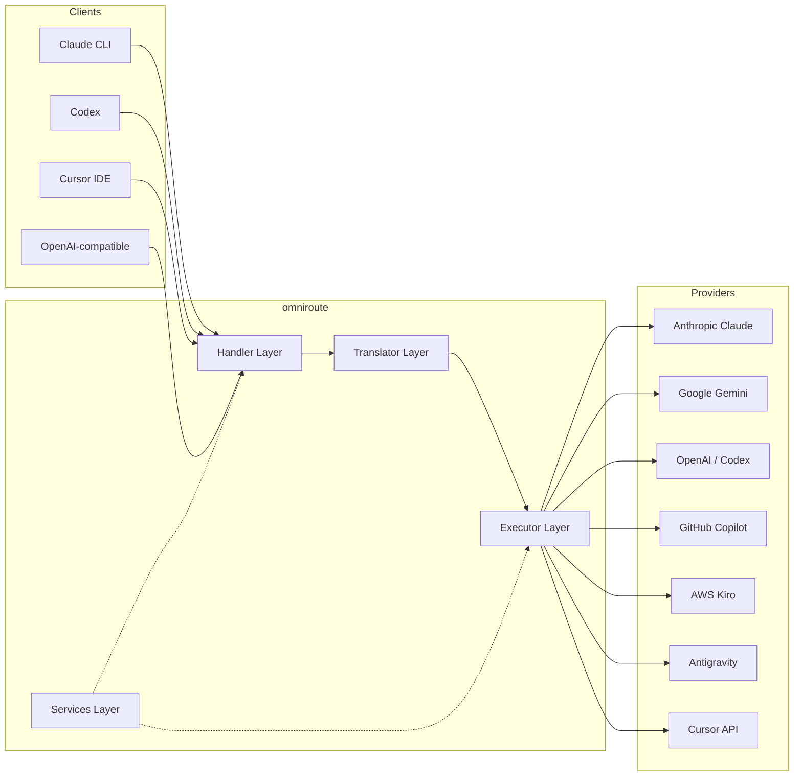

### Alapelv: Hub-and-spoke fordítás

Minden formátumfordítás átmegy az **OpenAI formátumon, mint központon**:

```
Client Format → [OpenAI Hub] → Provider Format    (request)
Provider Format → [OpenAI Hub] → Client Format    (response)
```

Ez azt jelenti, hogy csak **N fordítóra** (formátumonként egy) van szüksége a **N²** (minden pár) helyett.

---

## 3. Projekt felépítése

```
omniroute/
├── open-sse/                  ← Core proxy library (portable, framework-agnostic)
│   ├── index.js               ← Main entry point, exports everything
│   ├── config/                ← Configuration & constants
│   ├── executors/             ← Provider-specific request execution
│   ├── handlers/              ← Request handling orchestration
│   ├── services/              ← Business logic (auth, models, fallback, usage)
│   ├── translator/            ← Format translation engine
│   │   ├── request/           ← Request translators (8 files)
│   │   ├── response/          ← Response translators (7 files)
│   │   └── helpers/           ← Shared translation utilities (6 files)
│   └── utils/                 ← Utility functions
├── src/                       ← Application layer (Express/Worker runtime)
│   ├── app/                   ← Web UI, API routes, middleware
│   ├── lib/                   ← Database, auth, and shared library code
│   ├── mitm/                  ← Man-in-the-middle proxy utilities
│   ├── models/                ← Database models
│   ├── shared/                ← Shared utilities (wrappers around open-sse)
│   ├── sse/                   ← SSE endpoint handlers
│   └── store/                 ← State management
├── data/                      ← Runtime data (credentials, logs)
│   └── provider-credentials.json   (external credentials override, gitignored)
└── tester/                    ← Test utilities
```

---

## 4. Modulonkénti lebontás

### 4.1 konfiguráció (`open-sse/config/`)

Az **egyetlen igazságforrás** minden szolgáltatói konfigurációhoz.

| Fájl                          | Cél                                                                                                                                                                                                                                                                            |
| ----------------------------- | ------------------------------------------------------------------------------------------------------------------------------------------------------------------------------------------------------------------------------------------------------------------------------ |
| `constants.ts`                | `PROVIDERS` objektum alap URL-ekkel, OAuth hitelesítési adatokkal (alapértelmezett), fejlécekkel és alapértelmezett rendszerkérdésekkel minden szolgáltatóhoz. Meghatározza a következőt is: `HTTP_STATUS`, `ERROR_TYPES`, `COOLDOWN_MS`, `BACKOFF_CONFIG` és `SKIP_PATTERNS`. |
| `credentialLoader.ts`         | Betölti a külső hitelesítő adatokat a `data/provider-credentials.json` helyről, és egyesíti őket a `PROVIDERS` merevkódolt alapértékeihez. Kizárja a titkokat a forrás ellenőrzése alól, miközben fenntartja a visszafelé kompatibilitást.                                     |
| `providerModels.ts`           | Központi modellnyilvántartás: térképszolgáltatói álnevek → modellazonosítók. Funkciók, mint például `getModels()`, `getProviderByAlias()`.                                                                                                                                     |
| `codexInstructions.ts`        | A Codex kérésekbe beszúrt rendszerutasítások (szerkesztési megszorítások, sandbox-szabályok, jóváhagyási szabályzatok).                                                                                                                                                        |
| `defaultThinkingSignature.ts` | Claude és Gemini modellek alapértelmezett "gondolkodó" aláírásai.                                                                                                                                                                                                              |
| `ollamaModels.ts`             | Sémadefiníció helyi Ollama modellekhez (név, méret, család, kvantálás).                                                                                                                                                                                                        |

#### Hitelesítési adatok betöltésének folyamata

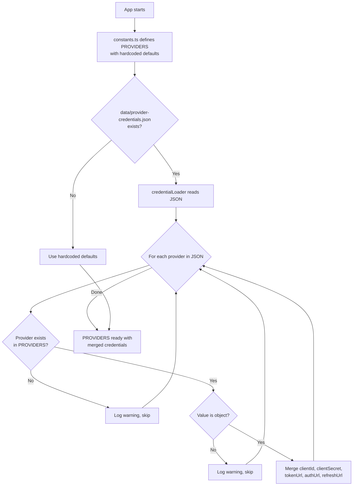

---

### 4.2 Végrehajtók (`open-sse/executors/`)

A végrehajtók a **szolgáltató-specifikus logikát** a **stratégiai minta** segítségével foglalják magukba. Minden végrehajtó szükség szerint felülírja az alapmetódusokat.

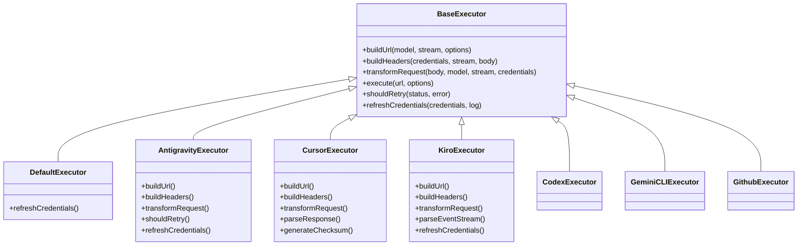

| Végrehajtó       | Szolgáltató                                | Legfontosabb szakterületek                                                                                                                  |
| ---------------- | ------------------------------------------ | ------------------------------------------------------------------------------------------------------------------------------------------- |
| `base.ts`        | —                                          | Absztrakt alap: URL-építés, fejlécek, újrapróbálkozási logika, hitelesítő adatok frissítése                                                 |
| `default.ts`     | Claude, Gemini, OpenAI, GLM, Kimi, MiniMax | Általános OAuth-token frissítés szabványos szolgáltatók számára                                                                             |
| `antigravity.ts` | Google Cloud Code                          | Projekt/munkamenet azonosító generálása, több URL-es tartalék, egyéni újrapróbálkozás a hibaüzenetekből ("visszaállítás 2 óra 7 perc után") |
| `cursor.ts`      | Kurzor IDE                                 | **Legösszetettebb**: SHA-256 ellenőrzőösszeg hitelesítés, Protobuf kéréskódolás, bináris EventStream → SSE válaszelemzés                    |
| `codex.ts`       | OpenAI Codex                               | Rendszerutasításokat injektál, gondolkodási szinteket kezel, eltávolítja a nem támogatott paramétereket                                     |
| `gemini-cli.ts`  | Google Gemini CLI                          | Egyéni URL-építés (`streamGenerateContent`), Google OAuth-token frissítése                                                                  |
| `github.ts`      | GitHub másodpilóta                         | Kettős token rendszer (GitHub OAuth + másodpilóta token), VSCode fejléc utánzás                                                             |
| `kiro.ts`        | AWS CodeWhisperer                          | AWS EventStream bináris elemzés, AMZN eseménykeretek, token becslés                                                                         |
| `index.ts`       | —                                          | Gyári: térképszolgáltató neve → végrehajtó osztály, alapértelmezett tartalék                                                                |

---

### 4.3 Kezelők (`open-sse/handlers/`)

A **hangszerelési réteg** — koordinálja a fordítást, a végrehajtást, a streamelést és a hibakezelést.

| Fájl                  | Cél                                                                                                                                                                                                               |
| --------------------- | ----------------------------------------------------------------------------------------------------------------------------------------------------------------------------------------------------------------- |
| `chatCore.ts`         | **Központi hangszerelő** (~600 sor). Kezeli a teljes kérés életciklust: formátumészlelés → fordítás → végrehajtó feladása → streaming/nem streaming válasz → token frissítés → hibakezelés → használati naplózás. |
| `responsesHandler.ts` | Adapter az OpenAI Responses API-jához: átalakítja a válaszformátumot → Chat Completions → elküldi a `chatCore` címre → konvertálja vissza az SSE-t válaszformátumba.                                              |
| `embeddings.ts`       | Beágyazás generációs kezelő: feloldja a beágyazási modellt → szolgáltató, elküldi a szolgáltató API-nak, visszaküldi az OpenAI-kompatibilis beágyazási választ. 6+ szolgáltatót támogat.                          |
| `imageGeneration.ts`  | Képgeneráló kezelő: feloldja a képmodell → szolgáltatót, támogatja az OpenAI-kompatibilis, a Gemini-image (Antigravitáció) és a tartalék (Nebius) módokat. A base64 vagy URL képeket adja vissza.                 |

#### Életciklus kérése (chatCore.ts)

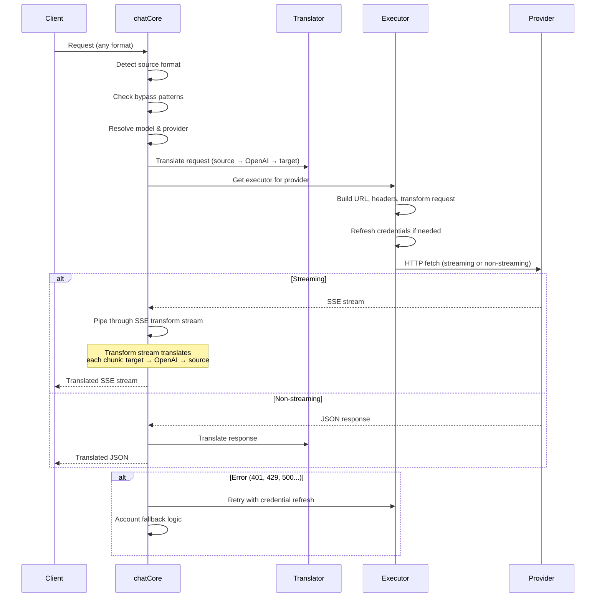

---

### 4.4 Szolgáltatások (`open-sse/services/`)

Üzleti logika, amely támogatja a kezelőket és a végrehajtókat.

| Fájl                 | Cél                                                                                                                                                                                                                                                                                                                                                                  |
| -------------------- | -------------------------------------------------------------------------------------------------------------------------------------------------------------------------------------------------------------------------------------------------------------------------------------------------------------------------------------------------------------------- |
| `provider.ts`        | **Formátumészlelés** (`detectFormat`): elemzi a kérés törzsszerkezetét a Claude/OpenAI/Gemini/Antigravity/Responses formátumok azonosításához (beleértve a `max_tokens` heurisztikus Claude-ot). Továbbá: URL-építés, fejlécépítés, gondolkodási konfiguráció normalizálása. Támogatja a `openai-compatible-*` és `anthropic-compatible-*` dinamikus szolgáltatókat. |
| `model.ts`           | Modellkarakterlánc-elemzés (`claude/model-name` → `{provider: "claude", model: "model-name"}`), álnév-feloldás ütközésészleléssel, bemeneti fertőtlenítés (elutasítja az útvonal bejárását/vezérlő karaktereket) és a modellinformáció-feloldás aszinkron alias getter támogatással.                                                                                 |
| `accountFallback.ts` | Rate-limit-kezelés: exponenciális visszalépés (1s → 2mp → 4mp → max 2perc), fiókhűtés-kezelés, hibabesorolás (mely hibák váltanak ki visszaesést, illetve nem).                                                                                                                                                                                                      |
| `tokenRefresh.ts`    | OAuth-token frissítése **minden szolgáltatóhoz**: Google (Gemini, Antigravity), Claude, Codex, Qwen, iFlow, GitHub (OAuth + másodpilóta kettős token), Kiro (AWS SSO OIDC + Social Auth). Tartalmazza a menet közbeni ígéret-deduplikációs gyorsítótárat és az újrapróbálkozást exponenciális visszalépéssel.                                                        |
| `combo.ts`           | **Kombinált modellek**: tartalék modellek láncai. Ha az A modell meghibásodik egy tartalék jogosultsági hibával, próbálja ki a B, majd a C modellt stb. A tényleges upstream állapotkódokat adja vissza.                                                                                                                                                             |
| `usage.ts`           | Lekéri a kvóta/használati adatokat a szolgáltatói API-któl (GitHub másodpilóta kvóták, antigravitációs modellkvóták, Codex sebességkorlátok, Kiro használati lebontások, Claude beállítások).                                                                                                                                                                        |
| `accountSelector.ts` | Intelligens számlakiválasztás pontozási algoritmussal: figyelembe veszi a prioritást, az egészségi állapotot, a körmérkőzéses pozíciót és a lemondási állapotot, hogy kiválaszthassa az optimális fiókot minden egyes kérelemhez.                                                                                                                                    |
| `contextManager.ts`  | Kéréskörnyezet-életciklus-kezelés: kérésenkénti kontextusobjektumokat hoz létre és nyomon követ metaadatokkal (kérelemazonosító, időbélyegek, szolgáltatói információk) hibakereséshez és naplózáshoz.                                                                                                                                                               |
| `ipFilter.ts`        | IP-alapú hozzáférés-vezérlés: támogatja az engedélyezési listát és a tiltólistát. Az API-kérelmek feldolgozása előtt ellenőrzi az ügyfél IP-címét a konfigurált szabályok szerint.                                                                                                                                                                                   |
| `sessionManager.ts`  | Munkamenetkövetés ügyfél ujjlenyomattal: nyomon követi az aktív munkameneteket kivonatolt ügyfélazonosítók segítségével, figyeli a kérések számát, és munkamenet-metrikákat biztosít.                                                                                                                                                                                |
| `signatureCache.ts`  | Aláírás-alapú deduplikációs gyorsítótár kérése: megakadályozza a duplikált kéréseket azáltal, hogy gyorsítótárazza a legutóbbi kérelmek aláírásait, és egy időablakon belül visszaadja a gyorsítótárazott válaszokat az azonos kérésekre.                                                                                                                            |
| `systemPrompt.ts`    | Globális rendszerprompt injekció: minden kérés elé vagy hozzáfűz egy konfigurálható rendszerpromptot, szolgáltatónkénti kompatibilitáskezeléssel.                                                                                                                                                                                                                    |
| `thinkingBudget.ts`  | Érvelési jogkivonat-költségvetés-kezelés: támogatja az áthárítást, az automatikus (szalagos gondolkodási konfiguráció), az egyéni (fix költségvetésű) és az adaptív (bonyolultságra skálázott) módokat a gondolkodási/érvelési tokenek vezérléséhez.                                                                                                                 |
| `wildcardRouter.ts`  | Helyettesítő karakterminta-útválasztás: a helyettesítő karaktermintákat (pl. `*/claude-*`) konkrét szolgáltató/modell párokra oldja fel a rendelkezésre állás és a prioritás alapján.                                                                                                                                                                                |

#### Token frissítési deduplikáció

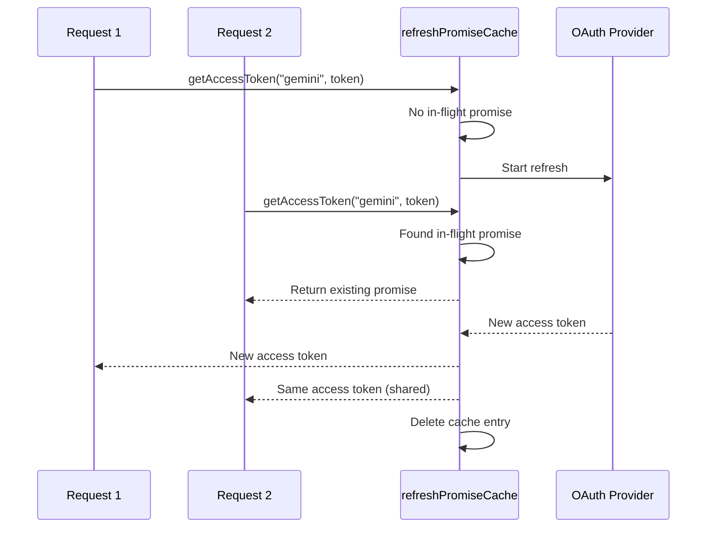

#### Fiók tartalék állapotú gép

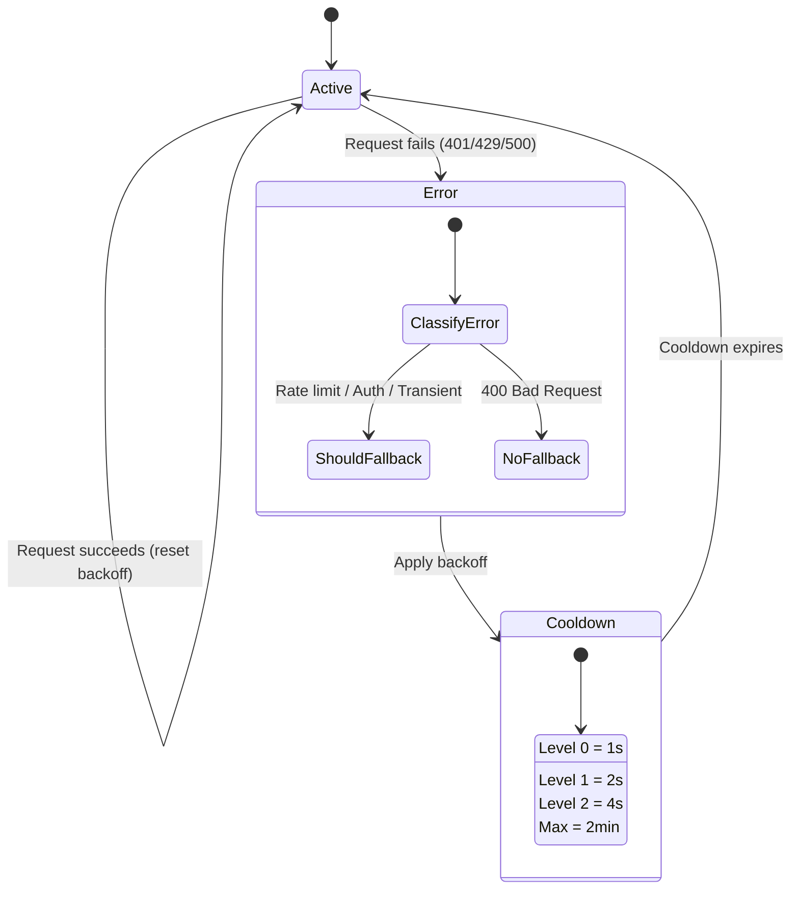

#### Kombinált modelllánc

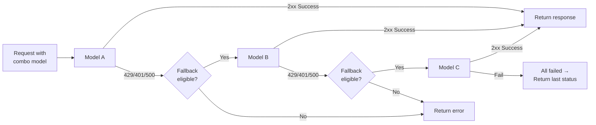

---

### 4.5 Fordító (`open-sse/translator/`)

A **formátumfordító motor** egy önregisztráló bővítményrendszerrel.

#### Építészet

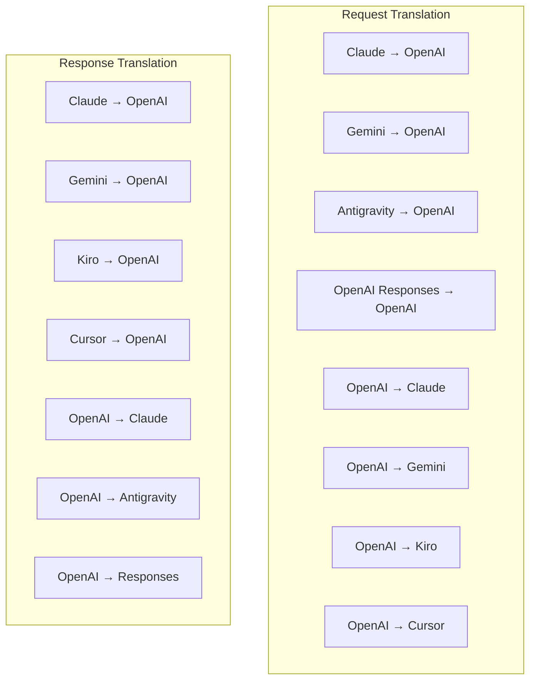

| Címtár       | Fájlok    | Leírás                                                                                                                                                                                                                                                     |
| ------------ | --------- | ---------------------------------------------------------------------------------------------------------------------------------------------------------------------------------------------------------------------------------------------------------- |
| `request/`   | 8 fordító | A kéréstörzsek átalakítása formátumok között. Az importáláskor minden fájl önmagát regisztrálja a `register(from, to, fn)` segítségével.                                                                                                                   |
| `response/`  | 7 fordító | A streaming válaszdarabok konvertálása formátumok között. Kezeli az SSE eseménytípusokat, gondolkodási blokkokat, eszközhívásokat.                                                                                                                         |
| `helpers/`   | 6 segítő  | Megosztott segédprogramok: `claudeHelper` (rendszerkérdések kibontása, gondolkodási konfiguráció), `geminiHelper` (alkatrészek/tartalom-leképezés), `openaiHelper` (formátumszűrés), `toolCallHelper`), _TOK_K_, hiányzó válasz_OM_8 `responsesApiHelper`. |
| `index.ts`   | —         | Fordítómotor: `translateRequest()`, `translateResponse()`, állapotkezelés, nyilvántartás.                                                                                                                                                                  |
| `formats.ts` | —         | Formátumkonstansok: `OPENAI`, `CLAUDE`, `GEMINI`, `ANTIGRAVITY`, `KIRO`, `CURSOR`_, _.EN*92_NI, *.                                                                                                                                                         |

#### Kulcstervezés: Önregisztráló beépülő modulok

```javascript
// Each translator file calls register() on import:
import { register } from "../index.js";
register("claude", "openai", translateClaudeToOpenAI);

// The index.js imports all translator files, triggering registration:
import "./request/claude-to-openai.js"; // ← self-registers
```

---

### 4.6 Utils (`open-sse/utils/`)

| Fájl               | Cél                                                                                                                                                                                                                                                                                                                                 |
| ------------------ | ----------------------------------------------------------------------------------------------------------------------------------------------------------------------------------------------------------------------------------------------------------------------------------------------------------------------------------- |
| `error.ts`         | Hibaválasz kiépítése (OpenAI-kompatibilis formátum), felfelé irányuló hibaelemzés, Antigravitációs újrapróbálkozási idő kivonat a hibaüzenetekből, SSE hibaadatfolyam.                                                                                                                                                              |
| `stream.ts`        | **SSE Transform Stream** – a mag adatfolyam-folyamat. Két mód: `TRANSLATE` (teljes formátumú fordítás) és `PASSTHROUGH` (használat normalizálása + kibontása). Kezeli a darabok pufferelését, a felhasználás becslését, a tartalom hosszának követését. A folyamonkénti kódoló/dekódoló példányok elkerülik a megosztott állapotot. |
| `streamHelpers.ts` | Alacsony szintű SSE-segédprogramok: `parseSSELine` (szóköz-toleráns), `hasValuableContent` (üres darabokat szűr az OpenAI/Claude/Gemini számára), `fixInvalidId`, `perf_metrics` tisztítás).                                                                                                                                        |
| `usageTracking.ts` | Tokenhasználati kinyerés bármilyen formátumból (Claude/OpenAI/Gemini/Responses), becslés külön eszköz/üzenet char-per-token arányokkal, puffer hozzáadása (2000 token biztonsági ráhagyás), formátum-specifikus mezőszűrés, konzolnaplózás ANSI színekkel.                                                                          |
| `requestLogger.ts` | Fájlalapú kérések naplózása (feliratkozás a `ENABLE_REQUEST_LOGS=true` segítségével). Munkamenet mappákat hoz létre számozott fájlokkal: `1_req_client.json` → `7_res_client.txt`. Minden I/O aszinkron (gyújt és felejt). Elfedi az érzékeny fejléceket.                                                                           |
| `bypassHandler.ts` | Elfogja a Claude CLI meghatározott mintáit (címkivonás, bemelegítés, számlálás), és hamis válaszokat ad vissza anélkül, hogy bármelyik szolgáltatót is felhívná. Támogatja a streaminget és a nem adatfolyamot egyaránt. Szándékosan a Claude CLI hatókörére korlátozva.                                                            |
| `networkProxy.ts`  | Feloldja egy adott szolgáltató kimenő proxy URL-jét elsőbbséggel: szolgáltató-specifikus konfiguráció → globális konfiguráció → környezeti változók (`HTTPS_PROXY`/`HTTP_PROXY`/`ALL_PROXY`). Támogatja a `NO_PROXY` kizárásokat. Gyorsítótár konfiguráció 30 másodpercig.                                                          |

#### SSE Streaming Pipeline

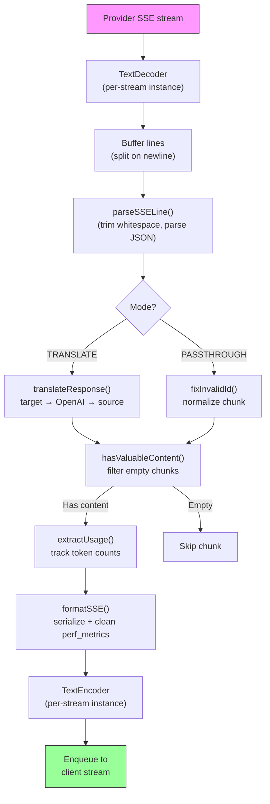

#### Kérjen naplózó munkamenet-struktúrát

```
logs/
└── claude_gemini_claude-sonnet_20260208_143045/
    ├── 1_req_client.json      ← Raw client request
    ├── 2_req_source.json      ← After initial conversion
    ├── 3_req_openai.json      ← OpenAI intermediate format
    ├── 4_req_target.json      ← Final target format
    ├── 5_res_provider.txt     ← Provider SSE chunks (streaming)
    ├── 5_res_provider.json    ← Provider response (non-streaming)
    ├── 6_res_openai.txt       ← OpenAI intermediate chunks
    ├── 7_res_client.txt       ← Client-facing SSE chunks
    └── 6_error.json           ← Error details (if any)
```

---

### 4.7 Alkalmazási réteg (`src/`)

| Címtár        | Cél                                                                                          |
| ------------- | -------------------------------------------------------------------------------------------- |
| `src/app/`    | Webes felhasználói felület, API-útvonalak, Express köztes szoftver, OAuth visszahíváskezelők |
| `src/lib/`    | Adatbázis-hozzáférés (`localDb.ts`, `usageDb.ts`), hitelesítés, megosztott                   |
| `src/mitm/`   | Man-in-the-middle proxy segédprogramok a szolgáltatói forgalom lehallgatásához               |
| `src/models/` | Adatbázismodell-definíciók                                                                   |
| `src/shared/` | Az open-sse függvények körüli burkolók (szolgáltató, adatfolyam, hiba stb.)                  |
| `src/sse/`    | SSE végpontkezelők, amelyek az open-sse könyvtárat az Express útvonalakhoz kötik             |
| `src/store/`  | Alkalmazás állapotkezelés                                                                    |

#### Figyelemre méltó API-útvonalak

| Útvonal                                       | Módszerek       | Cél                                                                                                            |
| --------------------------------------------- | --------------- | -------------------------------------------------------------------------------------------------------------- |
| `/api/provider-models`                        | GET/POST/DELETE | CRUD egyedi modellekhez szolgáltatónként                                                                       |
| `/api/models/catalog`                         | GET             | Összesített katalógus az összes modellről (csevegés, beágyazás, kép, egyéni) szolgáltató szerint csoportosítva |
| `/api/settings/proxy`                         | GET/PUT/DELETE  | Hierarchikus kimenő proxykonfiguráció (`global/providers/combos/keys`)                                         |
| `/api/settings/proxy/test`                    | POST            | Ellenőrzi a proxy-kapcsolatot, és visszaadja a nyilvános IP-címet/latenciát                                    |
| `/v1/providers/[provider]/chat/completions`   | POST            | Dedikált szolgáltatónkénti csevegés-befejezések modellellenőrzéssel                                            |
| `/v1/providers/[provider]/embeddings`         | POST            | Dedikált szolgáltatónkénti beágyazások modellellenőrzéssel                                                     |
| `/v1/providers/[provider]/images/generations` | POST            | Dedikált szolgáltatónkénti képgenerálás modellellenőrzéssel                                                    |
| `/api/settings/ip-filter`                     | GET/PUT         | IP engedélyezési lista/blokklista kezelése                                                                     |
| `/api/settings/thinking-budget`               | GET/PUT         | Indoklási token költségkeret-konfiguráció (passthrough/auto/custom/adaptative)                                 |
| `/api/settings/system-prompt`                 | GET/PUT         | Globális rendszer azonnali befecskendezése minden kérelemhez                                                   |
| `/api/sessions`                               | GET             | Aktív munkamenet-követés és mérőszámok                                                                         |
| `/api/rate-limits`                            | GET             | számlánkénti kamatláb korlát állapota                                                                          |

---

## 5. Kulcsfontosságú tervezési minták

### 5.1 Hub-and-Spoke fordítás

Minden formátum az **OpenAI formátumon keresztül történik, mint a hub**. Új szolgáltató hozzáadásához csak **egy pár** fordítót kell írni (OpenAI-ra/OpenAI-ról), N párra nem.

### 5.2 Végrehajtó stratégia minta

Minden szolgáltatónak van egy dedikált végrehajtó osztálya, amely a `BaseExecutor`-ból öröklődik. A `executors/index.ts` gyára futás közben választja ki a megfelelőt.

### 5.3 Önregisztráló beépülő modulrendszer

A fordítómodulok regisztrálják magukat az importáláskor a `register()` címen. Új fordító hozzáadása csak egy fájl létrehozását és importálását jelenti.

### 5.4 Fiók visszaállítása exponenciális visszalépéssel

Amikor egy szolgáltató visszaadja a 429/401/500 számot, a rendszer átválthat a következő fiókra, exponenciális lehűtést alkalmazva (1 mp → 2 mp → 4 mp → max 2 perc).

### 5.5 kombinált modellláncok

A „kombó” több `provider/model` karakterláncot csoportosít. Ha az első sikertelen, akkor automatikusan visszaáll a következőre.

### 5.6 Állapotalapú adatfolyam-fordítás

A válaszfordítás a `initState()` mechanizmuson keresztül fenntartja az állapotot az SSE-darabokon (gondolkodási blokk követése, eszközhívás-gyűjtés, tartalomblokk indexelése).

### 5.7 Használati biztonsági puffer

Egy 2000 tokenből álló puffert adunk a jelentett használathoz, hogy megakadályozzuk, hogy az ügyfelek elérjék a kontextusablak korlátait a rendszerkérések és a formátumfordítás miatti többletterhelés miatt.

---

## 6. Támogatott formátumok

| Formátum                | Irány        | Azonosító          |
| ----------------------- | ------------ | ------------------ |
| OpenAI Chat befejezések | forrás + cél | `openai`           |
| OpenAI Responses API    | forrás + cél | `openai-responses` |
| Antropikus Claude       | forrás + cél | `claude`           |
| Google Gemini           | forrás + cél | `gemini`           |
| Google Gemini CLI       | csak cél     | `gemini-cli`       |
| Antigravitáció          | forrás + cél | `antigravity`      |
| AWS Kiro                | csak cél     | `kiro`             |
| Kurzor                  | csak cél     | `cursor`           |

---

## 7. Támogatott szolgáltatók

| Szolgáltató              | Hitelesítési módszer        | Végrehajtó      | Főbb megjegyzések                                    |
| ------------------------ | --------------------------- | --------------- | ---------------------------------------------------- |
| Antropikus Claude        | API-kulcs vagy OAuth        | Alapértelmezett | `x-api-key` fejlécet használ                         |
| Google Gemini            | API-kulcs vagy OAuth        | Alapértelmezett | `x-goog-api-key` fejlécet használ                    |
| Google Gemini CLI        | OAuth                       | GeminiCLI       | `streamGenerateContent` végpontot használ            |
| Antigravitáció           | OAuth                       | Antigravitáció  | Több URL-es tartalék, egyéni újrapróbálkozás         |
| OpenAI                   | API kulcs                   | Alapértelmezett | Normál hordozó hitelesítés                           |
| Codex                    | OAuth                       | Codex           | Rendszerutasításokat ad be, irányítja a gondolkodást |
| GitHub másodpilóta       | OAuth + másodpilóta token   | Github          | Kettős token, VSCode fejléc utánzás                  |
| Kiro (AWS)               | AWS SSO OIDC vagy Social    | Kiro            | Bináris EventStream elemzés                          |
| Kurzor IDE               | Ellenőrzőösszeg hitelesítés | Kurzor          | Protobuf kódolás, SHA-256 ellenőrző összegek         |
| Qwen                     | OAuth                       | Alapértelmezett | Normál hitelesítés                                   |
| iFlow                    | OAuth (alap + hordozó)      | Alapértelmezett | Kettős hitelesítési fejléc                           |
| OpenRouter               | API kulcs                   | Alapértelmezett | Normál hordozó hitelesítés                           |
| GLM, Kimi, MiniMax       | API kulcs                   | Alapértelmezett | Claude-kompatibilis, használja a `x-api-key`         |
| `openai-compatible-*`    | API kulcs                   | Alapértelmezett | Dinamikus: bármely OpenAI-kompatibilis végpont       |
| `anthropic-compatible-*` | API kulcs                   | Alapértelmezett | Dinamikus: bármely Claude-kompatibilis végpont       |

---

## 8. Adatfolyam összefoglalása

### Streaming kérés

```mermaid
flowchart LR
    A["Client"] --> B["detectFormat()"]
    B --> C["translateRequest()\nsource → OpenAI → target"]
    C --> D["Executor\nbuildUrl + buildHeaders"]
    D --> E["fetch(providerURL)"]
    E --> F["createSSEStream()\nTRANSLATE mode"]
    F --> G["parseSSELine()"]
    G --> H["translateResponse()\ntarget → OpenAI → source"]
    H --> I["extractUsage()\n+ addBuffer"]
    I --> J["formatSSE()"]
    J --> K["Client receives\ntranslated SSE"]
    K --> L["logUsage()\nsaveRequestUsage()"]
```

### Nem streamelési kérelem

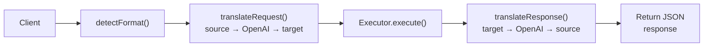

### Bypass Flow (Claude CLI)

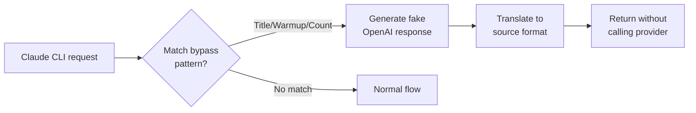
