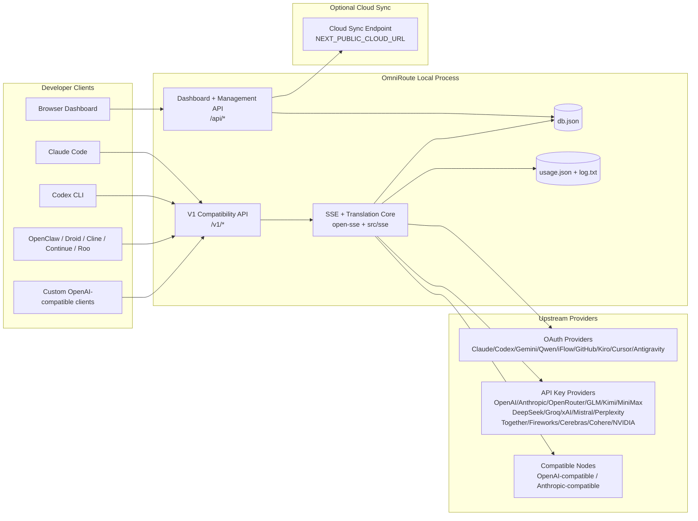
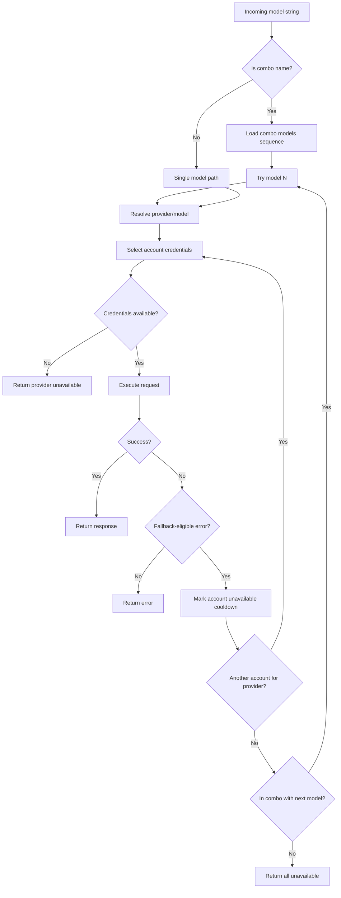
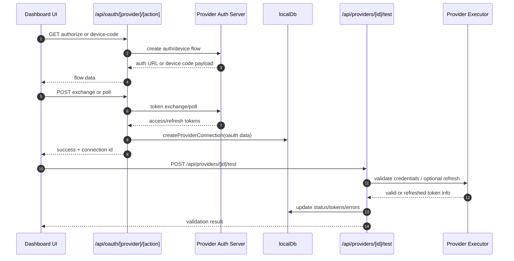
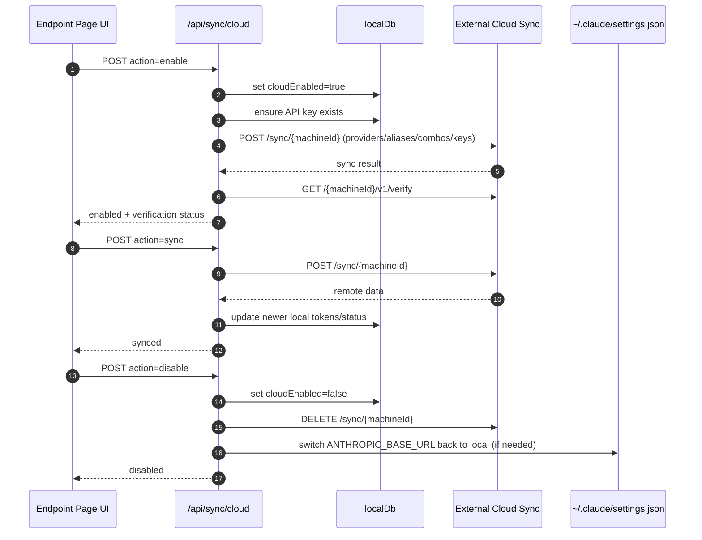

# ओमनीरूट आर्किटेक्चर

🌐 **Languages:** 🇺🇸 [English](../../ARCHITECTURE.md) | 🇧🇷 [Português (Brasil)](../pt-BR/ARCHITECTURE.md) | 🇪🇸 [Español](../es/ARCHITECTURE.md) | 🇫🇷 [Français](../fr/ARCHITECTURE.md) | 🇮🇹 [Italiano](../it/ARCHITECTURE.md) | 🇷🇺 [Русский](../ru/ARCHITECTURE.md) | 🇨🇳 [中文 (简体)](../zh-CN/ARCHITECTURE.md) | 🇩🇪 [Deutsch](../de/ARCHITECTURE.md) | 🇮🇳 [हिन्दी](../in/ARCHITECTURE.md) | 🇹🇭 [ไทย](../th/ARCHITECTURE.md) | 🇺🇦 [Українська](../uk-UA/ARCHITECTURE.md) | 🇸🇦 [العربية](../ar/ARCHITECTURE.md) | 🇯🇵 [日本語](../ja/ARCHITECTURE.md) | 🇻🇳 [Tiếng Việt](../vi/ARCHITECTURE.md) | 🇧🇬 [Български](../bg/ARCHITECTURE.md) | 🇩🇰 [Dansk](../da/ARCHITECTURE.md) | 🇫🇮 [Suomi](../fi/ARCHITECTURE.md) | 🇮🇱 [עברית](../he/ARCHITECTURE.md) | 🇭🇺 [Magyar](../hu/ARCHITECTURE.md) | 🇮🇩 [Bahasa Indonesia](../id/ARCHITECTURE.md) | 🇰🇷 [한국어](../ko/ARCHITECTURE.md) | 🇲🇾 [Bahasa Melayu](../ms/ARCHITECTURE.md) | 🇳🇱 [Nederlands](../nl/ARCHITECTURE.md) | 🇳🇴 [Norsk](../no/ARCHITECTURE.md) | 🇵🇹 [Português (Portugal)](../pt/ARCHITECTURE.md) | 🇷🇴 [Română](../ro/ARCHITECTURE.md) | 🇵🇱 [Polski](../pl/ARCHITECTURE.md) | 🇸🇰 [Slovenčina](../sk/ARCHITECTURE.md) | 🇸🇪 [Svenska](../sv/ARCHITECTURE.md) | 🇵🇭 [Filipino](../phi/ARCHITECTURE.md)

_अंतिम अद्यतन: 2026-02-18_

## कार्यकारी सारांश

ओमनीरूट एक स्थानीय एआई रूटिंग गेटवे और नेक्स्ट.जेएस पर निर्मित डैशबोर्ड है।
यह एक एकल OpenAI-संगत एंडपॉइंट (`/v1/*`) प्रदान करता है और अनुवाद, फ़ॉलबैक, टोकन रिफ्रेश और उपयोग ट्रैकिंग के साथ कई अपस्ट्रीम प्रदाताओं के बीच ट्रैफ़िक को रूट करता है।

मुख्य क्षमताएं:

- सीएलआई/टूल्स के लिए ओपनएआई-संगत एपीआई सतह (28 प्रदाता)
- प्रदाता प्रारूपों में अनुरोध/प्रतिक्रिया अनुवाद
- मॉडल कॉम्बो फ़ॉलबैक (मल्टी-मॉडल अनुक्रम)
- खाता-स्तरीय फ़ॉलबैक (प्रति प्रदाता बहु-खाता)
- OAuth + एपीआई-कुंजी प्रदाता कनेक्शन प्रबंधन
- `/v1/embeddings` के माध्यम से एम्बेडिंग पीढ़ी (6 प्रदाता, 9 मॉडल)
- `/v1/images/generations` के माध्यम से छवि निर्माण (4 प्रदाता, 9 मॉडल)
- तर्क मॉडल के लिए टैग पार्सिंग (`<think>...</think>`) के बारे में सोचें
- सख्त ओपनएआई एसडीके संगतता के लिए प्रतिक्रिया स्वच्छता
- क्रॉस-प्रदाता अनुकूलता के लिए भूमिका सामान्यीकरण (डेवलपर→सिस्टम, सिस्टम→उपयोगकर्ता)।
- संरचित आउटपुट रूपांतरण (json_schema → जेमिनी रिस्पॉन्सस्कीमा)
- प्रदाताओं, चाबियाँ, उपनाम, कॉम्बो, सेटिंग्स, मूल्य निर्धारण के लिए स्थानीय दृढ़ता
- उपयोग/लागत ट्रैकिंग और अनुरोध लॉगिंग
- मल्टी-डिवाइस/स्टेट सिंक के लिए वैकल्पिक क्लाउड सिंक
- एपीआई एक्सेस नियंत्रण के लिए आईपी अनुमति सूची/ब्लॉकलिस्ट
- सोच बजट प्रबंधन (पासथ्रू/ऑटो/कस्टम/अनुकूली)
- वैश्विक प्रणाली शीघ्र इंजेक्शन
- सत्र ट्रैकिंग और फ़िंगरप्रिंटिंग
- प्रदाता-विशिष्ट प्रोफाइल के साथ प्रति-खाता बढ़ी हुई दर सीमित करना
- प्रदाता लचीलेपन के लिए सर्किट ब्रेकर पैटर्न
- म्यूटेक्स लॉकिंग के साथ एंटी-थंडरिंग झुंड सुरक्षा
- हस्ताक्षर-आधारित अनुरोध डिडुप्लीकेशन कैश
- डोमेन परत: मॉडल उपलब्धता, लागत नियम, फ़ॉलबैक नीति, लॉकआउट नीति
- डोमेन स्थिति दृढ़ता (फ़ॉलबैक, बजट, लॉकआउट, सर्किट ब्रेकर के लिए SQLite राइट-थ्रू कैश)
- केंद्रीकृत अनुरोध मूल्यांकन के लिए नीति इंजन (लॉकआउट → बजट → फ़ॉलबैक)
- p50/p95/p99 विलंबता एकत्रीकरण के साथ टेलीमेट्री का अनुरोध करें
- एंड-टू-एंड ट्रेसिंग के लिए सहसंबंध आईडी (एक्स-रिक्वेस्ट-आईडी)।
- एपीआई कुंजी के अनुसार ऑप्ट-आउट के साथ अनुपालन ऑडिट लॉगिंग
- एलएलएम गुणवत्ता आश्वासन के लिए इवल फ्रेमवर्क
- वास्तविक समय सर्किट ब्रेकर स्थिति के साथ लचीलापन यूआई डैशबोर्ड
- मॉड्यूलर OAuth प्रदाता (`src/lib/oauth/providers/` के अंतर्गत 12 व्यक्तिगत मॉड्यूल)

प्राथमिक रनटाइम मॉडल:

- `src/app/api/*` के अंतर्गत Next.js ऐप रूट डैशबोर्ड एपीआई और संगतता एपीआई दोनों को लागू करते हैं
- `src/sse/*` + `open-sse/*` में एक साझा SSE/रूटिंग कोर प्रदाता निष्पादन, अनुवाद, स्ट्रीमिंग, फ़ॉलबैक और उपयोग को संभालता है

## दायरा और सीमाएँ

### दायरे में

- स्थानीय गेटवे रनटाइम
- डैशबोर्ड प्रबंधन एपीआई
- प्रदाता प्रमाणीकरण और टोकन ताज़ा करें
- अनुवाद और एसएसई स्ट्रीमिंग का अनुरोध करें
- स्थानीय स्थिति + उपयोग की दृढ़ता
- वैकल्पिक क्लाउड सिंक ऑर्केस्ट्रेशन

### दायरे से बाहर

- `NEXT_PUBLIC_CLOUD_URL` के पीछे क्लाउड सेवा कार्यान्वयन
- स्थानीय प्रक्रिया के बाहर प्रदाता एसएलए/नियंत्रण विमान
- बाहरी सीएलआई बायनेरिज़ स्वयं (क्लाउड सीएलआई, कोडेक्स सीएलआई, आदि)

## उच्च स्तरीय सिस्टम संदर्भ



## कोर रनटाइम घटक

## 1) एपीआई और रूटिंग लेयर (नेक्स्ट.जेएस ऐप रूट्स)

मुख्य निर्देशिकाएँ:

- अनुकूलता एपीआई के लिए `src/app/api/v1/*` और `src/app/api/v1beta/*`
- प्रबंधन/कॉन्फ़िगरेशन एपीआई के लिए `src/app/api/*`
- अगला `next.config.mjs` मानचित्र `/v1/*` से `/api/v1/*` में पुनः लिखता है

महत्वपूर्ण अनुकूलता मार्ग:

-
- `src/app/api/v1/messages/route.ts`
- `src/app/api/v1/responses/route.ts`
- `src/app/api/v1/models/route.ts` - `custom: true` के साथ कस्टम मॉडल शामिल हैं
- `src/app/api/v1/embeddings/route.ts` - एम्बेडिंग जेनरेशन (6 प्रदाता)
- `src/app/api/v1/images/generations/route.ts` - छवि निर्माण (एंटीग्रेविटी/नेबियस सहित 4+ प्रदाता)
- `src/app/api/v1/messages/count_tokens/route.ts`
- `src/app/api/v1/providers/[provider]/chat/completions/route.ts` - प्रति-प्रदाता समर्पित चैट
- `src/app/api/v1/providers/[provider]/embeddings/route.ts` - प्रति-प्रदाता समर्पित एम्बेडिंग
- `src/app/api/v1/providers/[provider]/images/generations/route.ts` - प्रति-प्रदाता समर्पित छवियां
- `src/app/api/v1beta/models/route.ts`
- `src/app/api/v1beta/models/[...path]/route.ts`

प्रबंधन डोमेन:

- प्रमाणीकरण/सेटिंग्स: `src/app/api/auth/*`, `src/app/api/settings/*`
- प्रदाता/कनेक्शन: `src/app/api/providers*`
- प्रदाता नोड: `src/app/api/provider-nodes*`
- कस्टम मॉडल: `src/app/api/provider-models` (प्राप्त करें/पोस्ट करें/हटाएं)
- मॉडल कैटलॉग: `src/app/api/models/catalog` (प्राप्त करें)
- प्रॉक्सी कॉन्फ़िगरेशन: `src/app/api/settings/proxy` (प्राप्त/पुट/डिलीट) + `src/app/api/settings/proxy/test` (पोस्ट)
- OAuth: `src/app/api/oauth/*`
- कुंजी/उपनाम/कॉम्बोस/मूल्य निर्धारण: `src/app/api/keys*`, `src/app/api/models/alias`, `src/app/api/combos*`, `src/app/api/pricing`
- उपयोग: `src/app/api/usage/*`
- सिंक/क्लाउड: `src/app/api/sync/*`, `src/app/api/cloud/*`
- सीएलआई टूलींग सहायक: `src/app/api/cli-tools/*`
- आईपी फ़िल्टर: `src/app/api/settings/ip-filter` (प्राप्त/पुट)
- सोच बजट: `src/app/api/settings/thinking-budget` (प्राप्त/पुट)
- सिस्टम प्रॉम्प्ट: `src/app/api/settings/system-prompt` (प्राप्त/पुट)
- सत्र: `src/app/api/sessions` (प्राप्त करें)
- दर सीमा: `src/app/api/rate-limits` (प्राप्त करें)
- लचीलापन: `src/app/api/resilience` (प्राप्त/पैच) - प्रदाता प्रोफ़ाइल, सर्किट ब्रेकर, दर सीमा स्थिति
- लचीलापन रीसेट: `src/app/api/resilience/reset` (पोस्ट) - ब्रेकर रीसेट करें + कूलडाउन
- कैश आँकड़े: `src/app/api/cache/stats` (प्राप्त करें/हटाएँ)
- मॉडल उपलब्धता: `src/app/api/models/availability` (प्राप्त करें/पोस्ट करें)
- टेलीमेट्री: `src/app/api/telemetry/summary` (प्राप्त करें)
- बजट: `src/app/api/usage/budget` (प्राप्त/पोस्ट करें)
- फ़ॉलबैक चेन: `src/app/api/fallback/chains` (प्राप्त करें/पोस्ट करें/हटाएँ)
- अनुपालन लेखापरीक्षा: `src/app/api/compliance/audit-log` (प्राप्त करें)
- मूल्यांकन: `src/app/api/evals` (प्राप्त/पोस्ट), `src/app/api/evals/[suiteId]` (प्राप्त करें)
- नीतियां: `src/app/api/policies` (प्राप्त/पोस्ट करें)

## 2) एसएसई + अनुवाद कोर

मुख्य प्रवाह मॉड्यूल:

- प्रवेश: `src/sse/handlers/chat.ts`
- कोर ऑर्केस्ट्रेशन: `open-sse/handlers/chatCore.ts`
- प्रदाता निष्पादन एडाप्टर: `open-sse/executors/*`
- प्रारूप पहचान/प्रदाता कॉन्फिगरेशन: `open-sse/services/provider.ts`
- मॉडल पार्स/रिज़ॉल्यूशन: `src/sse/services/model.ts`, `open-sse/services/model.ts`
- खाता फ़ॉलबैक तर्क: `open-sse/services/accountFallback.ts`
- अनुवाद रजिस्ट्री: `open-sse/translator/index.ts`
- स्ट्रीम परिवर्तन: `open-sse/utils/stream.ts`, `open-sse/utils/streamHandler.ts`
- उपयोग निष्कर्षण/सामान्यीकरण: `open-sse/utils/usageTracking.ts`
- टैग पार्सर सोचें: `open-sse/utils/thinkTagParser.ts`
- एंबेडिंग हैंडलर: `open-sse/handlers/embeddings.ts`
- एंबेडिंग प्रदाता रजिस्ट्री: `open-sse/config/embeddingRegistry.ts`
- छवि निर्माण हैंडलर: `open-sse/handlers/imageGeneration.ts`
- छवि प्रदाता रजिस्ट्री: `open-sse/config/imageRegistry.ts`
- प्रतिक्रिया स्वच्छता: `open-sse/handlers/responseSanitizer.ts`
- भूमिका सामान्यीकरण: `open-sse/services/roleNormalizer.ts`

सेवाएँ (व्यावसायिक तर्क):

- खाता चयन/स्कोरिंग: `open-sse/services/accountSelector.ts`
- संदर्भ जीवनचक्र प्रबंधन: `open-sse/services/contextManager.ts`
- आईपी फ़िल्टर प्रवर्तन: `open-sse/services/ipFilter.ts`
- सत्र ट्रैकिंग: `open-sse/services/sessionManager.ts`
- डुप्लिकेशन अनुरोध: `open-sse/services/signatureCache.ts`
- सिस्टम प्रॉम्प्ट इंजेक्शन: `open-sse/services/systemPrompt.ts`
- सोच बजट प्रबंधन: `open-sse/services/thinkingBudget.ts`
- वाइल्डकार्ड मॉडल रूटिंग: `open-sse/services/wildcardRouter.ts`
- दर सीमा प्रबंधन: `open-sse/services/rateLimitManager.ts`
- सर्किट ब्रेकर: `open-sse/services/circuitBreaker.ts`

डोमेन परत मॉड्यूल:

- मॉडल उपलब्धता: `src/lib/domain/modelAvailability.ts`
- लागत नियम/बजट: `src/lib/domain/costRules.ts`
- फ़ॉलबैक नीति: `src/lib/domain/fallbackPolicy.ts`
- कॉम्बो रिज़ॉल्वर: `src/lib/domain/comboResolver.ts`
- तालाबंदी नीति: `src/lib/domain/lockoutPolicy.ts`
- नीति इंजन: `src/domain/policyEngine.ts` - केंद्रीकृत तालाबंदी → बजट → फ़ॉलबैक मूल्यांकन
- त्रुटि कोड सूची: `src/lib/domain/errorCodes.ts`
- अनुरोध आईडी: `src/lib/domain/requestId.ts`
- फ़ेच टाइमआउट: `src/lib/domain/fetchTimeout.ts`
- अनुरोध टेलीमेट्री: `src/lib/domain/requestTelemetry.ts`
- अनुपालन/ऑडिट: `src/lib/domain/compliance/index.ts`
- इवल धावक: `src/lib/domain/evalRunner.ts`
- डोमेन स्थिति दृढ़ता: `src/lib/db/domainState.ts` - फ़ॉलबैक चेन, बजट, लागत इतिहास, लॉकआउट स्थिति, सर्किट ब्रेकर के लिए SQLite CRUD

OAuth प्रदाता मॉड्यूल (`src/lib/oauth/providers/` के अंतर्गत 12 व्यक्तिगत फ़ाइलें):

- रजिस्ट्री सूचकांक: `src/lib/oauth/providers/index.ts`
- व्यक्तिगत प्रदाता: `claude.ts`, `codex.ts`, `gemini.ts`, `antigravity.ts`, `iflow.ts`, `qwen.ts`, `kimi-coding.ts`, `github.ts`, `kiro.ts`, `cursor.ts`, `kilocode.ts`, `cline.ts`
- पतला आवरण: `src/lib/oauth/providers.ts` - अलग-अलग मॉड्यूल से पुनः निर्यात

## 3) दृढ़ता परत

प्राथमिक स्थिति डीबी:

-
- फ़ाइल: `${DATA_DIR}/db.json` (या सेट होने पर `$XDG_CONFIG_HOME/omniroute/db.json`, अन्यथा `~/.omniroute/db.json`)
- संस्थाएँ: प्रदाता कनेक्शन, प्रदाता नोड्स, मॉडल उपनाम, कॉम्बो, एपीकीज़, सेटिंग्स, मूल्य निर्धारण, **कस्टम मॉडल**, **प्रॉक्सी कॉन्फिग**, **आईपीफिल्टर**, **थिंकिंगबजट**, **सिस्टमप्रॉम्प्ट**

उपयोग डीबी:

- `src/lib/usageDb.ts`
- फ़ाइलें: `${DATA_DIR}/usage.json`, `${DATA_DIR}/log.txt`, `${DATA_DIR}/call_logs/`
- `localDb` के समान मूल निर्देशिका नीति का पालन करता है (`DATA_DIR`, फिर सेट होने पर `XDG_CONFIG_HOME/omniroute`)
- केंद्रित उप-मॉड्यूल में विघटित: `migrations.ts`, `usageHistory.ts`, `costCalculator.ts`, `usageStats.ts`, `callLogs.ts`

डोमेन स्थिति DB (SQLite):

- `src/lib/db/domainState.ts` - डोमेन स्थिति के लिए CRUD संचालन
- तालिकाएँ (`src/lib/db/core.ts` में निर्मित): `domain_fallback_chains`, `domain_budgets`, `domain_cost_history`, `domain_lockout_state`, `domain_circuit_breakers`
- राइट-थ्रू कैश पैटर्न: इन-मेमोरी मैप्स रनटाइम पर आधिकारिक होते हैं; उत्परिवर्तन SQLite के साथ समकालिक रूप से लिखे जाते हैं; कोल्ड स्टार्ट पर राज्य को डीबी से बहाल किया जाता है

## 4) प्रामाणिक + सुरक्षा सतहें

- डैशबोर्ड कुकी प्रमाणीकरण: `src/proxy.ts`, `src/app/api/auth/login/route.ts`
- एपीआई कुंजी निर्माण/सत्यापन: `src/shared/utils/apiKey.ts`
- प्रदाता रहस्य `providerConnections` प्रविष्टियों में बने रहे
- `open-sse/utils/proxyFetch.ts` (env vars) और `open-sse/utils/networkProxy.ts` (प्रति-प्रदाता या वैश्विक रूप से कॉन्फ़िगर करने योग्य) के माध्यम से आउटबाउंड प्रॉक्सी समर्थन

## 5) क्लाउड सिंक

- शेड्यूलर init: `src/lib/initCloudSync.ts`, `src/shared/services/initializeCloudSync.ts`
- आवधिक कार्य: `src/shared/services/cloudSyncScheduler.ts`
- नियंत्रण मार्ग: `src/app/api/sync/cloud/route.ts`

## अनुरोध जीवनचक्र (`/v1/chat/completions`)

## कॉम्बो + अकाउंट फ़ॉलबैक फ़्लो



फ़ॉलबैक निर्णय स्थिति कोड और त्रुटि-संदेश अनुमानों का उपयोग करके `open-sse/services/accountFallback.ts` द्वारा संचालित होते हैं।

## OAuth ऑनबोर्डिंग और टोकन रिफ्रेश जीवनचक्र



लाइव ट्रैफ़िक के दौरान रिफ्रेश को निष्पादक `refreshCredentials()` के माध्यम से `open-sse/handlers/chatCore.ts` के अंदर निष्पादित किया जाता है।

## क्लाउड सिंक जीवनचक्र (सक्षम/सिंक/अक्षम)



क्लाउड सक्षम होने पर आवधिक सिंक `CloudSyncScheduler` द्वारा ट्रिगर किया जाता है।

## डेटा मॉडल और स्टोरेज मैप

भौतिक भंडारण फ़ाइलें:

- मुख्य स्थिति: `${DATA_DIR}/db.json` (या सेट होने पर `$XDG_CONFIG_HOME/omniroute/db.json`, अन्यथा `~/.omniroute/db.json`)
- उपयोग आँकड़े: `${DATA_DIR}/usage.json`
- अनुरोध लॉग लाइनें: `${DATA_DIR}/log.txt`
- वैकल्पिक अनुवादक/अनुरोध डिबग सत्र: `<repo>/logs/...`

## परिनियोजन टोपोलॉजी

## मॉड्यूल मैपिंग (निर्णय-महत्वपूर्ण)

### रूट और एपीआई मॉड्यूल

- `src/app/api/v1/*`, `src/app/api/v1beta/*`: अनुकूलता एपीआई
- `src/app/api/v1/providers/[provider]/*`: प्रति-प्रदाता समर्पित मार्ग (चैट, एम्बेडिंग, चित्र)
- `src/app/api/providers*`: प्रदाता CRUD, सत्यापन, परीक्षण
- `src/app/api/provider-nodes*`: कस्टम संगत नोड प्रबंधन
- `src/app/api/provider-models`: कस्टम मॉडल प्रबंधन (CRUD)
- `src/app/api/models/catalog`: पूर्ण मॉडल कैटलॉग एपीआई (प्रदाता द्वारा समूहीकृत सभी प्रकार)
- `src/app/api/oauth/*`: OAuth/डिवाइस-कोड प्रवाह
- `src/app/api/keys*`: स्थानीय एपीआई कुंजी जीवनचक्र
- `src/app/api/models/alias`: उपनाम प्रबंधन
- `src/app/api/combos*`: फ़ॉलबैक कॉम्बो प्रबंधन
- `src/app/api/pricing`: लागत गणना के लिए मूल्य निर्धारण ओवरराइड होता है
- `src/app/api/settings/proxy`: प्रॉक्सी कॉन्फ़िगरेशन (प्राप्त/पुट/हटाएं)
- `src/app/api/settings/proxy/test`: आउटबाउंड प्रॉक्सी कनेक्टिविटी टेस्ट (POST)
- `src/app/api/usage/*`: एपीआई का उपयोग और लॉग
- `src/app/api/sync/*` + `src/app/api/cloud/*`: क्लाउड सिंक और क्लाउड-फेसिंग सहायक
- `src/app/api/cli-tools/*`: स्थानीय सीएलआई कॉन्फ़िगरेशन लेखक/चेकर्स
- `src/app/api/settings/ip-filter`: आईपी अनुमति सूची/ब्लॉकलिस्ट (प्राप्त/पुट)
- `src/app/api/settings/thinking-budget`: सोच टोकन बजट कॉन्फ़िगरेशन (प्राप्त/पुट)
- `src/app/api/settings/system-prompt`: ग्लोबल सिस्टम प्रॉम्प्ट (प्राप्त/पुट)
- `src/app/api/sessions`: सक्रिय सत्र सूची (प्राप्त करें)
- `src/app/api/rate-limits`: प्रति खाता दर सीमा स्थिति (GET)

### रूटिंग और निष्पादन कोर

- `src/sse/handlers/chat.ts`: अनुरोध पार्स, कॉम्बो हैंडलिंग, खाता चयन लूप
- `open-sse/handlers/chatCore.ts`: अनुवाद, निष्पादक प्रेषण, पुनः प्रयास/रीफ्रेश हैंडलिंग, स्ट्रीम सेटअप
- `open-sse/executors/*`: प्रदाता-विशिष्ट नेटवर्क और प्रारूप व्यवहार

### अनुवाद रजिस्ट्री और प्रारूप परिवर्तक

- `open-sse/translator/index.ts`: अनुवादक रजिस्ट्री और ऑर्केस्ट्रेशन
- अनुवादकों के लिए अनुरोध: `open-sse/translator/request/*`
- प्रतिक्रिया अनुवादक: `open-sse/translator/response/*`
- प्रारूप स्थिरांक: `open-sse/translator/formats.ts`

### दृढ़ता

- `src/lib/localDb.ts`: लगातार कॉन्फ़िगरेशन/स्थिति
- `src/lib/usageDb.ts`: उपयोग इतिहास और रोलिंग अनुरोध लॉग

## प्रदाता निष्पादक कवरेज (रणनीति पैटर्न)

प्रत्येक प्रदाता के पास `BaseExecutor` (`open-sse/executors/base.ts` में) का विस्तार करने वाला एक विशेष निष्पादक होता है, जो URL निर्माण, हेडर निर्माण, घातीय बैकऑफ़ के साथ पुनः प्रयास, क्रेडेंशियल रिफ्रेश हुक और `execute()` ऑर्केस्ट्रेशन विधि प्रदान करता है।

| निष्पादक              | प्रदाता(ओं)                                                                                                                                                                  | विशेष हैंडलिंग                                                                          |
| --------------------- | ---------------------------------------------------------------------------------------------------------------------------------------------------------------------------- | --------------------------------------------------------------------------------------- |
| `DefaultExecutor`     | ओपनएआई, क्लाउड, जेमिनी, क्वेन, आईफ्लो, ओपनराउटर, जीएलएम, किमी, मिनीमैक्स, डीपसीक, ग्रोक, एक्सएआई, मिस्ट्रल, पर्प्लेक्सिटी, टुगेदर, फायरवर्क्स, सेरेब्रा, कोहेरे, एनवीआईडीआईए | प्रति प्रदाता डायनामिक यूआरएल/हेडर कॉन्फिगरेशन                                          |
| `AntigravityExecutor` | गूगल एंटीग्रेविटी                                                                                                                                                            | कस्टम प्रोजेक्ट/सत्र आईडी, पुनः प्रयास करें-पार्सिंग के बाद                             |
| `CodexExecutor`       | ओपनएआई कोडेक्स                                                                                                                                                               | सिस्टम निर्देश इंजेक्ट करता है, तर्क करने का प्रयास करता है                             |
| `CursorExecutor`      | कर्सर आईडीई                                                                                                                                                                  | कनेक्टआरपीसी प्रोटोकॉल, प्रोटोबफ एन्कोडिंग, चेकसम के माध्यम से हस्ताक्षर करने का अनुरोध |
| `GithubExecutor`      | गिटहब कोपायलट                                                                                                                                                                | कोपायलट टोकन ताज़ा करें, VSCode-नकल हेडर                                                |
| `KiroExecutor`        | एडब्ल्यूएस कोडव्हिस्परर/किरो                                                                                                                                                 | एडब्ल्यूएस इवेंटस्ट्रीम बाइनरी प्रारूप → एसएसई रूपांतरण                                 |
| `GeminiCLIExecutor`   | जेमिनी सीएलआई                                                                                                                                                                | Google OAuth टोकन ताज़ा चक्र                                                            |

अन्य सभी प्रदाता (कस्टम संगत नोड्स सहित) `DefaultExecutor` का उपयोग करते हैं।

## प्रदाता संगतता मैट्रिक्स

| प्रदाता               | प्रारूप              | प्रामाणिक                | स्ट्रीम           | नॉन-स्ट्रीम | टोकन ताज़ा करें | उपयोग एपीआई         |
| --------------------- | -------------------- | ------------------------ | ----------------- | ----------- | --------------- | ------------------- |
| क्लाउड                | क्लाउड               | एपीआई कुंजी / OAuth      | ✅                | ✅          | ✅              | ⚠️ केवल एडमिन       |
| मिथुन                 | मिथुन                | एपीआई कुंजी / OAuth      | ✅                | ✅          | ✅              | ⚠️ क्लाउड कंसोल     |
| जेमिनी सीएलआई         | मिथुन-क्ली           | OAuth                    | ✅                | ✅          | ✅              | ⚠️ क्लाउड कंसोल     |
| प्रतिगुरुत्वाकर्षण    | प्रतिगुरुत्वाकर्षण   | OAuth                    | ✅                | ✅          | ✅              | ✅ पूर्ण कोटा एपीआई |
| ओपनएआई                | ओपनाई                | एपीआई कुंजी              | ✅                | ✅          | ❌              | ❌                  |
| कोडेक्स               | openai-प्रतिक्रियाएं | OAuth                    | ✅ मजबूर          | ❌          | ✅              | ✅ दर सीमा          |
| गिटहब कोपायलट         | ओपनाई                | OAuth + सहपायलट टोकन     | ✅                | ✅          | ✅              | ✅ कोटा स्नैपशॉट    |
| कर्सर                 | कर्सर                | कस्टम चेकसम              | ✅                | ✅          | ❌              | ❌                  |
| किरो                  | किरो                 | एडब्ल्यूएस एसएसओ ओआईडीसी | ✅ (इवेंटस्ट्रीम) | ❌          | ✅              | ✅ उपयोग सीमा       |
| क्वेन                 | ओपनाई                | OAuth                    | ✅                | ✅          | ✅              | ⚠️ प्रति अनुरोध     |
| आईफ्लो                | ओपनाई                | OAuth (बेसिक)            | ✅                | ✅          | ✅              | ⚠️ प्रति अनुरोध     |
| ओपनराउटर              | ओपनाई                | एपीआई कुंजी              | ✅                | ✅          | ❌              | ❌                  |
| जीएलएम/किमी/मिनीमैक्स | क्लाउड               | एपीआई कुंजी              | ✅                | ✅          | ❌              | ❌                  |
| डीपसीक                | ओपनाई                | एपीआई कुंजी              | ✅                | ✅          | ❌              | ❌                  |
| ग्रोक                 | ओपनाई                | एपीआई कुंजी              | ✅                | ✅          | ❌              | ❌                  |
| एक्सएआई (ग्रोक)       | ओपनाई                | एपीआई कुंजी              | ✅                | ✅          | ❌              | ❌                  |
| मिस्ट्रल              | ओपनाई                | एपीआई कुंजी              | ✅                | ✅          | ❌              | ❌                  |
| उलझन                  | ओपनाई                | एपीआई कुंजी              | ✅                | ✅          | ❌              | ❌                  |
| एक साथ एआई            | ओपनाई                | एपीआई कुंजी              | ✅                | ✅          | ❌              | ❌                  |
| आतिशबाजी एआई          | ओपनाई                | एपीआई कुंजी              | ✅                | ✅          | ❌              | ❌                  |
| सेरेब्रस              | ओपनाई                | एपीआई कुंजी              | ✅                | ✅          | ❌              | ❌                  |
| सहभागी                | ओपनाई                | एपीआई कुंजी              | ✅                | ✅          | ❌              | ❌                  |
| एनवीडिया एनआईएम       | ओपनाई                | एपीआई कुंजी              | ✅                | ✅          | ❌              | ❌                  |

## प्रारूप अनुवाद कवरेज

पता लगाए गए स्रोत प्रारूपों में शामिल हैं:

- `openai`
- `openai-responses`
- `claude`
- `gemini`

लक्ष्य प्रारूपों में शामिल हैं:

- ओपनएआई चैट/प्रतिक्रियाएं
  -क्लाउड
- मिथुन/मिथुन-सीएलआई/एंटीग्रेविटी लिफाफा
- किरो
- कर्सर

अनुवाद **हब प्रारूप के रूप में ओपनएआई** का उपयोग करते हैं - सभी रूपांतरण मध्यवर्ती के रूप में ओपनएआई से गुजरते हैं:

```
Source Format → OpenAI (hub) → Target Format
```

स्रोत पेलोड आकार और प्रदाता लक्ष्य प्रारूप के आधार पर अनुवादों का चयन गतिशील रूप से किया जाता है।

अनुवाद पाइपलाइन में अतिरिक्त प्रसंस्करण परतें:

- **प्रतिक्रिया स्वच्छता** - सख्त एसडीके अनुपालन सुनिश्चित करने के लिए ओपनएआई-प्रारूप प्रतिक्रियाओं (स्ट्रीमिंग और गैर-स्ट्रीमिंग दोनों) से गैर-मानक फ़ील्ड हटा देता है
- **भूमिका सामान्यीकरण** - गैर-ओपनएआई लक्ष्यों के लिए `developer` → `system` परिवर्तित करता है; सिस्टम भूमिका को अस्वीकार करने वाले मॉडलों के लिए `system` → `user` का विलय (GLM, ERNIE)
- **टैग निष्कर्षण के बारे में सोचें** - पार्स `<think>...</think>` सामग्री को `reasoning_content` फ़ील्ड में ब्लॉक करता है
- **संरचित आउटपुट** - OpenAI `response_format.json_schema` को मिथुन के `responseMimeType` + `responseSchema` में परिवर्तित करता है

## समर्थित एपीआई समापन बिंदु

| समापन बिंदु                                        | प्रारूप              | हैंडलर                                             |
| -------------------------------------------------- | -------------------- | -------------------------------------------------- | ------------------------ |
| `POST /v1/chat/completions`                        | ओपनएआई चैट           | `src/sse/handlers/chat.ts`                         |
| `POST /v1/messages`                                | क्लाउड संदेश         | वही हैंडलर (स्वतः पता चला)                         |
| `POST /v1/responses`                               | ओपनएआई प्रतिक्रियाएँ | `open-sse/handlers/responsesHandler.ts`            |
| `POST /v1/embeddings`                              | ओपनएआई एंबेडिंग्स    | `open-sse/handlers/embeddings.ts`                  |
| `GET /v1/embeddings`                               | मॉडल सूची            | एपीआई मार्ग                                        |
| `POST /v1/images/generations`                      | OpenAI छवियाँ        |                                                    |
| `GET /v1/images/generations`                       | मॉडल सूची            | एपीआई मार्ग                                        |
| `POST /v1/providers/{provider}/chat/completions`   | ओपनएआई चैट           | मॉडल सत्यापन के साथ प्रति-प्रदाता समर्पित          |
|                                                    | ओपनएआई एंबेडिंग्स    | मॉडल सत्यापन के साथ प्रति-प्रदाता समर्पित          |
| `POST /v1/providers/{provider}/images/generations` | OpenAI छवियाँ        | मॉडल सत्यापन के साथ प्रति-प्रदाता समर्पित          |
| `POST /v1/messages/count_tokens`                   | क्लाउड टोकन गिनती    | एपीआई मार्ग                                        |
|                                                    | OpenAI मॉडल सूची     | एपीआई मार्ग (चैट + एम्बेडिंग + छवि + कस्टम मॉडल)   |
| `GET /api/models/catalog`                          | कैटलॉग               | प्रदाता + प्रकार                                   | द्वारा समूहीकृत सभी मॉडल |
| `POST /v1beta/models/*:streamGenerateContent`      | मिथुन राशि के जातक   | एपीआई मार्ग                                        |
|                                                    | प्रॉक्सी कॉन्फिग     | नेटवर्क प्रॉक्सी कॉन्फ़िगरेशन                      |
|                                                    | प्रॉक्सी कनेक्टिविटी | प्रॉक्सी स्वास्थ्य/कनेक्टिविटी परीक्षण समापन बिंदु |
|                                                    | कस्टम मॉडल           | प्रति प्रदाता कस्टम मॉडल प्रबंधन                   |

## बायपास हैंडलर

बाईपास हैंडलर (`open-sse/utils/bypassHandler.ts`) क्लाउड सीएलआई से ज्ञात "थ्रोअवे" अनुरोधों को रोकता है - वार्मअप पिंग, शीर्षक निष्कर्षण, और टोकन गिनती - और अपस्ट्रीम प्रदाता टोकन का उपभोग किए बिना **नकली प्रतिक्रिया** लौटाता है। यह तभी ट्रिगर होता है जब `User-Agent` में `claude-cli` होता है।

## लॉगर पाइपलाइन का अनुरोध करें

अनुरोध लकड़हारा (`open-sse/utils/requestLogger.ts`) एक 7-चरण डीबग लॉगिंग पाइपलाइन प्रदान करता है, जो डिफ़ॉल्ट रूप से अक्षम है, `ENABLE_REQUEST_LOGS=true` के माध्यम से सक्षम है:

प्रत्येक अनुरोध सत्र के लिए फ़ाइलें `<repo>/logs/<session>/` पर लिखी जाती हैं।

## विफलता के तरीके और लचीलापन

## 1) खाता/प्रदाता उपलब्धता

- क्षणिक/दर/प्रामाणिक त्रुटियों पर प्रदाता खाता ठंडा हो गया
- अनुरोध विफल होने से पहले खाता फ़ॉलबैक
- वर्तमान मॉडल/प्रदाता पथ समाप्त होने पर कॉम्बो मॉडल फ़ॉलबैक

## 2) टोकन समाप्ति

- ताज़ा करने योग्य प्रदाताओं के लिए पुनः प्रयास के साथ पूर्व-जांच और ताज़ा करें
- कोर पथ में ताज़ा प्रयास के बाद 401/403 पुनः प्रयास करें

## 3) स्ट्रीम सुरक्षा

- डिस्कनेक्ट-अवेयर स्ट्रीम नियंत्रक
- एंड-ऑफ-स्ट्रीम फ्लश और `[DONE]` हैंडलिंग के साथ अनुवाद स्ट्रीम
- प्रदाता उपयोग मेटाडेटा अनुपलब्ध होने पर उपयोग अनुमान फ़ॉलबैक

## 4) क्लाउड सिंक गिरावट

- समन्वयन त्रुटियाँ सामने आती हैं लेकिन स्थानीय रनटाइम जारी रहता है
- शेड्यूलर में पुनः प्रयास-सक्षम तर्क है, लेकिन आवधिक निष्पादन वर्तमान में डिफ़ॉल्ट रूप से एकल-प्रयास सिंक को कॉल करता है

## 5) डेटा इंटीग्रिटी

- गुम चाबियों के लिए डीबी आकार माइग्रेशन/मरम्मत
- लोकलडीबी और यूज़डीबी के लिए भ्रष्ट JSON रीसेट सुरक्षा उपाय

## अवलोकनशीलता और परिचालन संकेत

रनटाइम दृश्यता स्रोत:

- `src/sse/utils/logger.ts` से कंसोल लॉग
- `usage.json` में प्रति-अनुरोध उपयोग समुच्चय
- पाठ्य अनुरोध स्थिति लॉग इन `log.txt`
- `logs/` के अंतर्गत वैकल्पिक गहन अनुरोध/अनुवाद लॉग जब `ENABLE_REQUEST_LOGS=true`
- यूआई खपत के लिए डैशबोर्ड उपयोग समापन बिंदु (`/api/usage/*`)।

## सुरक्षा-संवेदनशील सीमाएँ

- JWT सीक्रेट (`JWT_SECRET`) डैशबोर्ड सत्र कुकी सत्यापन/हस्ताक्षर को सुरक्षित करता है
- प्रारंभिक पासवर्ड फ़ॉलबैक (`INITIAL_PASSWORD`, डिफ़ॉल्ट `123456`) को वास्तविक परिनियोजन में ओवरराइड किया जाना चाहिए
- एपीआई कुंजी एचएमएसी रहस्य (`API_KEY_SECRET`) उत्पन्न स्थानीय एपीआई कुंजी प्रारूप को सुरक्षित करता है
- प्रदाता रहस्य (एपीआई कुंजी/टोकन) स्थानीय डीबी में बने रहते हैं और उन्हें फ़ाइल सिस्टम स्तर पर संरक्षित किया जाना चाहिए
- क्लाउड सिंक एंडपॉइंट एपीआई कुंजी ऑथ + मशीन आईडी सेमेन्टिक्स पर निर्भर करते हैं

## पर्यावरण और रनटाइम मैट्रिक्स

कोड द्वारा सक्रिय रूप से उपयोग किए जाने वाले पर्यावरण चर:

- ऐप/ऑथ: `JWT_SECRET`, `INITIAL_PASSWORD`
- भंडारण: `DATA_DIR`
- संगत नोड व्यवहार: `ALLOW_MULTI_CONNECTIONS_PER_COMPAT_NODE`
- वैकल्पिक स्टोरेज बेस ओवरराइड (लिनक्स/मैकओएस जब `DATA_DIR` सेट न हो): `XDG_CONFIG_HOME`
- सुरक्षा हैशिंग: `API_KEY_SECRET`, `MACHINE_ID_SALT`
- लॉगिंग: `ENABLE_REQUEST_LOGS`
- सिंक/क्लाउड यूआरएल: `NEXT_PUBLIC_BASE_URL`, `NEXT_PUBLIC_CLOUD_URL`
- आउटबाउंड प्रॉक्सी: `HTTP_PROXY`, `HTTPS_PROXY`, `ALL_PROXY`, `NO_PROXY` और लोअरकेस वेरिएंट
- SOCKS5 फ़ीचर फ़्लैग: `ENABLE_SOCKS5_PROXY`, `NEXT_PUBLIC_ENABLE_SOCKS5_PROXY`
- प्लेटफ़ॉर्म/रनटाइम सहायक (ऐप-विशिष्ट कॉन्फ़िगरेशन नहीं): `APPDATA`, `NODE_ENV`, `PORT`, `HOSTNAME`

## ज्ञात वास्तुशिल्प नोट्स

1. `usageDb` और `localDb` अब लीगेसी फ़ाइल माइग्रेशन के साथ समान आधार निर्देशिका नीति (`DATA_DIR` -> `XDG_CONFIG_HOME/omniroute` -> `~/.omniroute`) साझा करते हैं।
2. `/api/v1/route.ts` एक स्थिर मॉडल सूची लौटाता है और यह `/v1/models` द्वारा उपयोग किया जाने वाला मुख्य मॉडल स्रोत नहीं है।
3. अनुरोध लकड़हारा सक्षम होने पर पूर्ण हेडर/बॉडी लिखता है; लॉग निर्देशिका को संवेदनशील मानें।
4. क्लाउड व्यवहार सही `NEXT_PUBLIC_BASE_URL` और क्लाउड एंडपॉइंट रीचैबिलिटी पर निर्भर करता है।
5. `open-sse/` निर्देशिका को `@omniroute/open-sse` **npm कार्यक्षेत्र पैकेज** के रूप में प्रकाशित किया गया है। स्रोत कोड इसे `@omniroute/open-sse/...` के माध्यम से आयात करता है (Next.js `transpilePackages` द्वारा हल किया गया)। इस दस्तावेज़ में फ़ाइल पथ अभी भी स्थिरता के लिए निर्देशिका नाम `open-sse/` का उपयोग करते हैं।
6. डैशबोर्ड में चार्ट सुलभ, इंटरैक्टिव एनालिटिक्स विज़ुअलाइज़ेशन (मॉडल उपयोग बार चार्ट, सफलता दर के साथ प्रदाता ब्रेकडाउन टेबल) के लिए **रिचार्ट्स** (एसवीजी-आधारित) का उपयोग करते हैं।
7. E2E परीक्षण **Playwright** (`tests/e2e/`) का उपयोग करते हैं, `npm run test:e2e` के माध्यम से चलते हैं। यूनिट परीक्षण **Node.js टेस्ट रनर** (`tests/unit/`) का उपयोग करते हैं, जो `npm run test:plan3` के माध्यम से चलते हैं। `src/` के अंतर्गत स्रोत कोड **टाइपस्क्रिप्ट** (`.ts`/`.tsx`) है; `open-sse/` कार्यस्थान जावास्क्रिप्ट (`.js`) बना हुआ है।
8. सेटिंग्स पृष्ठ को 5 टैब में व्यवस्थित किया गया है: सुरक्षा, रूटिंग (6 वैश्विक रणनीतियाँ: भरण-प्रथम, राउंड-रॉबिन, पी2सी, यादृच्छिक, कम से कम उपयोग किया गया, लागत-अनुकूलित), लचीलापन (संपादन योग्य दर सीमा, सर्किट ब्रेकर, नीतियां), एआई (सोच बजट, सिस्टम प्रॉम्प्ट, प्रॉम्प्ट कैश), उन्नत (प्रॉक्सी)।

## परिचालन सत्यापन चेकलिस्ट

- स्रोत से निर्मित: `npm run build`
- डॉकर छवि बनाएं: `docker build -t omniroute .`
- सेवा प्रारंभ करें और सत्यापित करें:
- `GET /api/settings`
- `GET /api/v1/models`
- जब `PORT=20128` हो तो CLI लक्ष्य आधार URL `http://<host>:20128/v1` होना चाहिए
