🌐 **Languages:** 🇺🇸 [English](../../CODEBASE_DOCUMENTATION.md) | 🇧🇷 [Português (Brasil)](../pt-BR/CODEBASE_DOCUMENTATION.md) | 🇪🇸 [Español](../es/CODEBASE_DOCUMENTATION.md) | 🇫🇷 [Français](../fr/CODEBASE_DOCUMENTATION.md) | 🇮🇹 [Italiano](../it/CODEBASE_DOCUMENTATION.md) | 🇷🇺 [Русский](../ru/CODEBASE_DOCUMENTATION.md) | 🇨🇳 [中文 (简体)](../zh-CN/CODEBASE_DOCUMENTATION.md) | 🇩🇪 [Deutsch](../de/CODEBASE_DOCUMENTATION.md) | 🇮🇳 [हिन्दी](../in/CODEBASE_DOCUMENTATION.md) | 🇹🇭 [ไทย](../th/CODEBASE_DOCUMENTATION.md) | 🇺🇦 [Українська](../uk-UA/CODEBASE_DOCUMENTATION.md) | 🇸🇦 [العربية](../ar/CODEBASE_DOCUMENTATION.md) | 🇯🇵 [日本語](../ja/CODEBASE_DOCUMENTATION.md) | 🇻🇳 [Tiếng Việt](../vi/CODEBASE_DOCUMENTATION.md) | 🇧🇬 [Български](../bg/CODEBASE_DOCUMENTATION.md) | 🇩🇰 [Dansk](../da/CODEBASE_DOCUMENTATION.md) | 🇫🇮 [Suomi](../fi/CODEBASE_DOCUMENTATION.md) | 🇮🇱 [עברית](../he/CODEBASE_DOCUMENTATION.md) | 🇭🇺 [Magyar](../hu/CODEBASE_DOCUMENTATION.md) | 🇮🇩 [Bahasa Indonesia](../id/CODEBASE_DOCUMENTATION.md) | 🇰🇷 [한국어](../ko/CODEBASE_DOCUMENTATION.md) | 🇲🇾 [Bahasa Melayu](../ms/CODEBASE_DOCUMENTATION.md) | 🇳🇱 [Nederlands](../nl/CODEBASE_DOCUMENTATION.md) | 🇳🇴 [Norsk](../no/CODEBASE_DOCUMENTATION.md) | 🇵🇹 [Português (Portugal)](../pt/CODEBASE_DOCUMENTATION.md) | 🇷🇴 [Română](../ro/CODEBASE_DOCUMENTATION.md) | 🇵🇱 [Polski](../pl/CODEBASE_DOCUMENTATION.md) | 🇸🇰 [Slovenčina](../sk/CODEBASE_DOCUMENTATION.md) | 🇸🇪 [Svenska](../sv/CODEBASE_DOCUMENTATION.md) | 🇵🇭 [Filipino](../phi/CODEBASE_DOCUMENTATION.md)

#omniroute — コードベースのドキュメント

> **omniroute** マルチプロバイダー AI プロキシ ルーターに関する初心者向けの包括的なガイド。

---

## 1. オムニルートとは何ですか?

オムニルートは、AI クライアント (Claude CLI、Codex、Cursor IDE など) と AI プロバイダー (Anthropic、Google、OpenAI、AWS、GitHub など) の間に位置する **プロキシ ルーター** です。これにより、1 つの大きな問題が解決されます。

> **異なる AI クライアントは異なる「言語」(API 形式) を話し、異なる AI プロバイダーも異なる「言語」を期待します。** オムニルートはそれらの間で自動的に翻訳します。

これを国連の万能翻訳者のようなものだと考えてください。どの代表者もあらゆる言語を話すことができ、翻訳者は他の代表者のためにそれを変換します。

---

## 2. アーキテクチャの概要

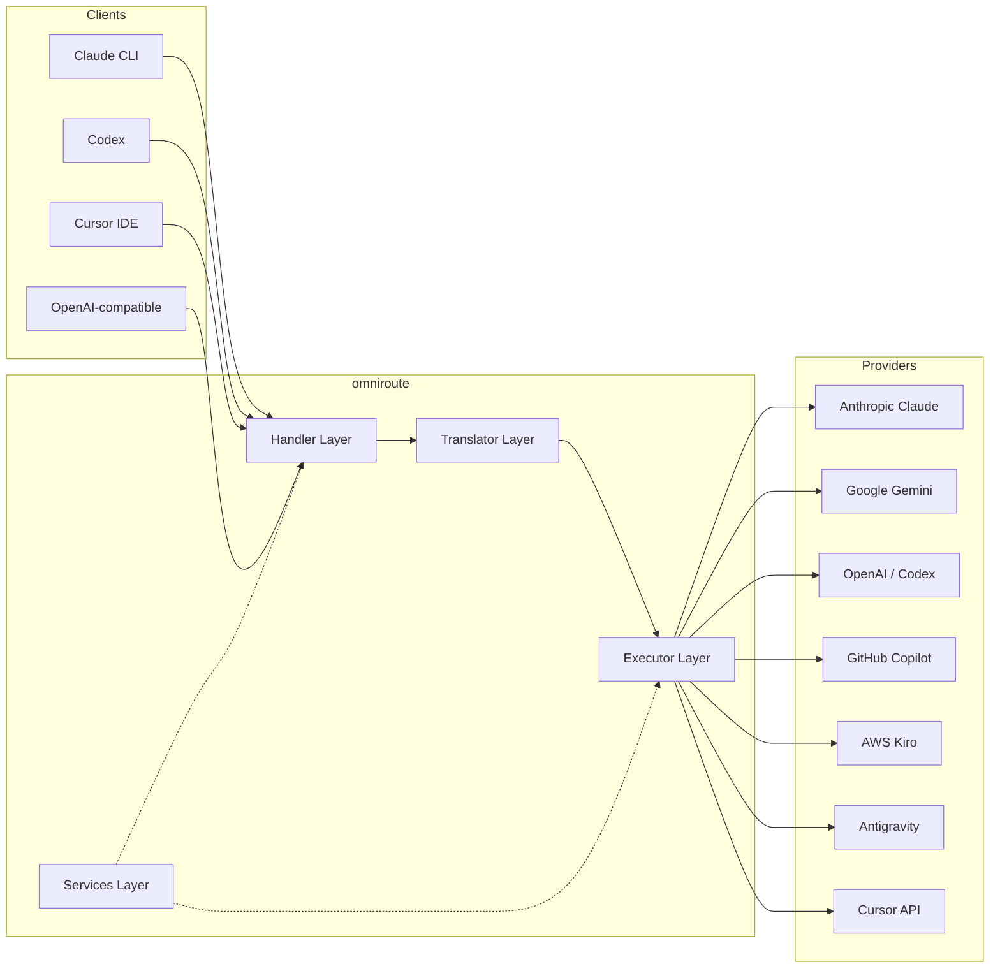

### 基本原則: ハブアンドスポーク変換

すべての形式変換は、**OpenAI 形式をハブとして** 通過します。

```
Client Format → [OpenAI Hub] → Provider Format    (request)
Provider Format → [OpenAI Hub] → Client Format    (response)
```

これは、**N²** (ペアごと) ではなく、**N トランスレーター** (フォーマットごとに 1 人) だけが必要であることを意味します。

---

## 3. プロジェクトの構造

```
omniroute/
├── open-sse/                  ← Core proxy library (portable, framework-agnostic)
│   ├── index.js               ← Main entry point, exports everything
│   ├── config/                ← Configuration & constants
│   ├── executors/             ← Provider-specific request execution
│   ├── handlers/              ← Request handling orchestration
│   ├── services/              ← Business logic (auth, models, fallback, usage)
│   ├── translator/            ← Format translation engine
│   │   ├── request/           ← Request translators (8 files)
│   │   ├── response/          ← Response translators (7 files)
│   │   └── helpers/           ← Shared translation utilities (6 files)
│   └── utils/                 ← Utility functions
├── src/                       ← Application layer (Express/Worker runtime)
│   ├── app/                   ← Web UI, API routes, middleware
│   ├── lib/                   ← Database, auth, and shared library code
│   ├── mitm/                  ← Man-in-the-middle proxy utilities
│   ├── models/                ← Database models
│   ├── shared/                ← Shared utilities (wrappers around open-sse)
│   ├── sse/                   ← SSE endpoint handlers
│   └── store/                 ← State management
├── data/                      ← Runtime data (credentials, logs)
│   └── provider-credentials.json   (external credentials override, gitignored)
└── tester/                    ← Test utilities
```

---

## 4. モジュールごとの内訳

### 4.1 構成 (`open-sse/config/`)

すべてのプロバイダー構成に関する **唯一の信頼できる情報源**。

| ファイル                      | 目的                                                                                                                                                                                                                                                        |
| ----------------------------- | ----------------------------------------------------------------------------------------------------------------------------------------------------------------------------------------------------------------------------------------------------------- |
| `constants.ts`                | `PROVIDERS` オブジェクトには、ベース URL、OAuth 資格情報 (デフォルト)、ヘッダー、および各プロバイダーのデフォルトのシステム プロンプトが含​​まれます。 `HTTP_STATUS`、`ERROR_TYPES`、`COOLDOWN_MS`、`BACKOFF_CONFIG`、および `SKIP_PATTERNS` も定義します。 |
| `credentialLoader.ts`         | `data/provider-credentials.json` から外部資格情報をロードし、`PROVIDERS` のハードコードされたデフォルトにそれらをマージします。下位互換性を維持しながら、秘密をソース管理から除外します。                                                                   |
| `providerModels.ts`           | 中央モデル レジストリ: プロバイダーのエイリアス → モデル ID をマップします。 `getModels()`、`getProviderByAlias()` のような関数。                                                                                                                           |
| `codexInstructions.ts`        | Codex リクエストに挿入されるシステム命令 (編集制約、サンドボックス ルール、承認ポリシー)。                                                                                                                                                                  |
| `defaultThinkingSignature.ts` | Claude モデルと Gemini モデルのデフォルトの「思考」シグネチャ。                                                                                                                                                                                             |
| `ollamaModels.ts`             | ローカル Ollama モデルのスキーマ定義 (名前、サイズ、ファミリー、量子化)。                                                                                                                                                                                   |

#### 認証情報の読み込みフロー

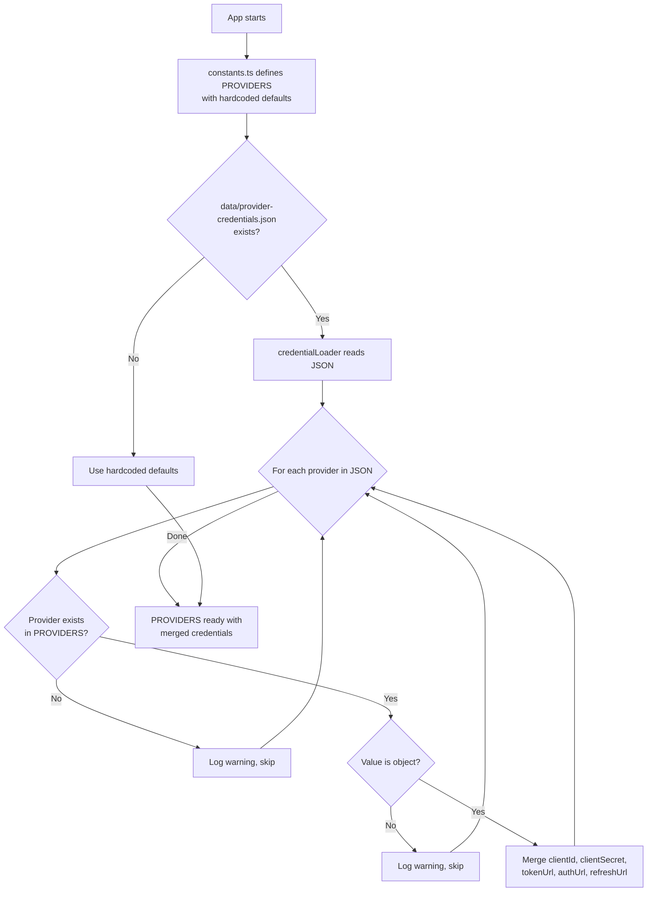

---

### 4.2 実行者 (`open-sse/executors/`)

エグゼキュータは、**戦略パターン**を使用して**プロバイダ固有のロジック**をカプセル化します。各エグゼキュータは、必要に応じて基本メソッドをオーバーライドします。

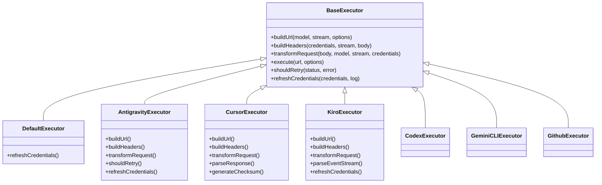

| 執行者           | プロバイダー                                   | 主な専門分野                                                                                                                                |
| ---------------- | ---------------------------------------------- | ------------------------------------------------------------------------------------------------------------------------------------------- |
| `base.ts`        | —                                              | 抽象ベース: URL 構築、ヘッダー、再試行ロジック、資格情報の更新                                                                              |
| `default.ts`     | クロード、ジェミニ、OpenAI、GLM、キミ、MiniMax | 標準プロバイダーの汎用 OAuth トークンの更新                                                                                                 |
| `antigravity.ts` | Googleクラウドコード                           | プロジェクト/セッション ID の生成、マルチ URL フォールバック、エラー メッセージからのカスタム再試行解析 (「2 時間 7 分 23 秒後にリセット」) |
| `cursor.ts`      | カーソルIDE                                    | **最も複雑**: SHA-256 チェックサム認証、Protobuf リクエスト エンコード、バイナリ EventStream → SSE レスポンス解析                           |
| `codex.ts`       | OpenAI コーデックス                            | システム命令の挿入、思考レベルの管理、サポートされていないパラメータの削除                                                                  |
| `gemini-cli.ts`  | Google Gemini CLI                              | カスタム URL の構築 (`streamGenerateContent`)、Google OAuth トークンの更新                                                                  |
| `github.ts`      | GitHub コパイロット                            | デュアル トークン システム (GitHub OAuth + Copilot トークン)、VSCode ヘッダーの模倣                                                         |
| `kiro.ts`        | AWS CodeWhisperer                              | AWS EventStream バイナリ解析、AMZN イベント フレーム、トークン推定                                                                          |
| `index.ts`       | —                                              | ファクトリ: デフォルトのフォールバックを使用して、プロバイダー名 → エグゼキューター クラスをマップします。                                  |

---

### 4.3 ハンドラー (`open-sse/handlers/`)

**オーケストレーション レイヤー** — 変換、実行、ストリーミング、エラー処理を調整します。

| ファイル              | 目的                                                                                                                                                                                                            |
| --------------------- | --------------------------------------------------------------------------------------------------------------------------------------------------------------------------------------------------------------- |
| `chatCore.ts`         | **中央オーケストレーター** (約 600 行)。リクエストのライフサイクル全体を処理します: フォーマット検出→変換→エグゼキュータディスパッチ→ストリーミング/非ストリーミング応答→トークン更新→エラー処理→使用状況ログ。 |
| `responsesHandler.ts` | OpenAI の応答 API 用アダプター: 応答形式を変換 → チャット完了 → `chatCore` に送信 → SSE を応答形式に変換します。                                                                                                |
| `embeddings.ts`       | 埋め込み生成ハンドラー: 埋め込みモデル→プロバイダーを解決し、プロバイダー API にディスパッチし、OpenAI 互換の埋め込み応答を返します。 6 つ以上のプロバイダーをサポートします。                                  |
| `imageGeneration.ts`  | イメージ生成ハンドラー: イメージ モデル → プロバイダーを解決し、OpenAI 互換、Gemini イメージ (Antigravity)、およびフォールバック (Nebius) モードをサポートします。 Base64 または URL イメージを返します。       |

#### リクエストのライフサイクル (chatCore.ts)

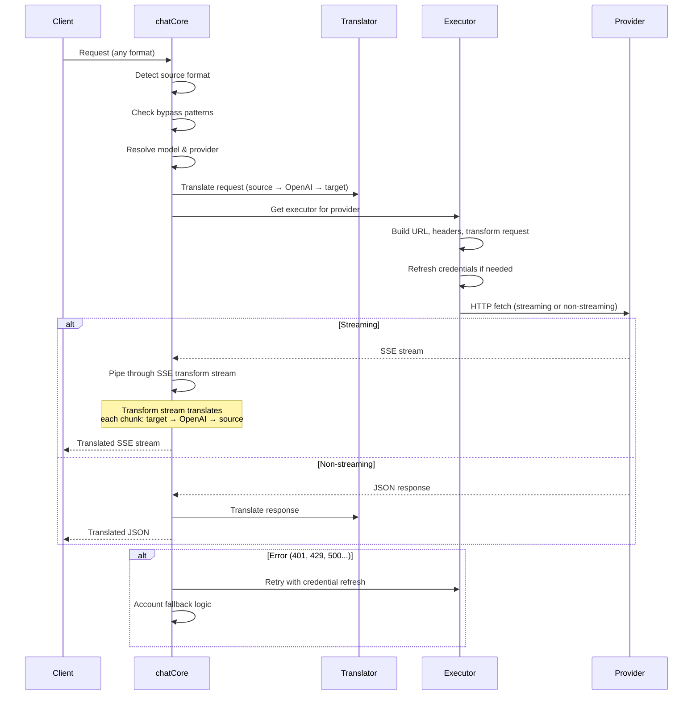

---

### 4.4 サービス (`open-sse/services/`)

ハンドラーとエグゼキューターをサポートするビジネス ロジック。

| ファイル             | 目的                                                                                                                                                                                                                                                                                                                                  |
| -------------------- | ------------------------------------------------------------------------------------------------------------------------------------------------------------------------------------------------------------------------------------------------------------------------------------------------------------------------------------- |
| `provider.ts`        | **形式検出** (`detectFormat`): リクエスト本文の構造を分析して、Claude/OpenAI/Gemini/Antigravity/Responses 形式を識別します (Claude の `max_tokens` ヒューリスティックを含む)。また、URL の構築、ヘッダーの構築、思考構成の正規化も行います。 `openai-compatible-*` および `anthropic-compatible-*` 動的プロバイダーをサポートします。 |
| `model.ts`           | モデル文字列解析 (`claude/model-name` → `{provider: "claude", model: "model-name"}`)、衝突検出によるエイリアス解決、入力サニタイズ (パス トラバーサル/制御文字の拒否)、および非同期エイリアス ゲッター サポートによるモデル情報解決。                                                                                                 |
| `accountFallback.ts` | レート制限の処理: 指数関数的バックオフ (1 秒 → 2 秒 → 4 秒 → 最大 2 分)、アカウントのクールダウン管理、エラー分類 (どのエラーがフォールバックをトリガーするのか、トリガーしないのか)。                                                                                                                                                |
| `tokenRefresh.ts`    | **すべてのプロバイダ**の OAuth トークン更新: Google (Gemini、Antigravity)、Claude、Codex、Qwen、iFlow、GitHub (OAuth + Copilot デュアル トークン)、Kiro (AWS SSO OIDC + Social Auth)。実行中の Promise 重複排除キャッシュと指数バックオフによる再試行が含まれます。                                                                   |
| `combo.ts`           | **コンボ モデル**: フォールバック モデルのチェーン。モデル A がフォールバック対象エラーで失敗した場合は、モデル B、次にモデル C などを試します。実際のアップストリーム ステータス コードを返します。                                                                                                                                  |
| `usage.ts`           | プロバイダー API からクォータ/使用量データを取得します (GitHub Copilot クォータ、反重力モデル クォータ、Codex レート制限、Kiro 使用量の内訳、Claude 設定)。                                                                                                                                                                           |
| `accountSelector.ts` | スコアリング アルゴリズムを使用したスマートなアカウント選択: 優先度、健全性ステータス、ラウンドロビン ポジション、クールダウン状態を考慮して、各リクエストに最適なアカウントを選択します。                                                                                                                                            |
| `contextManager.ts`  | リクエスト コンテキストのライフサイクル管理: デバッグとロギングのために、メタデータ (リクエスト ID、タイムスタンプ、プロバイダー情報) を含むリクエストごとのコンテキスト オブジェクトを作成および追跡します。                                                                                                                         |
| `ipFilter.ts`        | IP ベースのアクセス制御: ホワイトリスト モードとブロックリスト モードをサポートします。 API リクエストを処理する前に、設定されたルールに照らしてクライアント IP を検証します。                                                                                                                                                        |
| `sessionManager.ts`  | クライアント フィンガープリントによるセッション追跡: ハッシュされたクライアント ID を使用してアクティブなセッションを追跡し、リクエスト数を監視し、セッション メトリックを提供します。                                                                                                                                                |
| `signatureCache.ts`  | リクエスト署名ベースの重複排除キャッシュ: 最近のリクエスト署名をキャッシュし、時間枠内の同一リクエストに対してキャッシュされた応答を返すことで、リクエストの重複を防ぎます。                                                                                                                                                          |
| `systemPrompt.ts`    | グローバル システム プロンプト インジェクション: プロバイダーごとの互換性処理を使用して、構成可能なシステム プロンプトをすべてのリクエストの先頭または末尾に追加します。                                                                                                                                                              |
| `thinkingBudget.ts`  | 推論トークンの予算管理: 思考/推論トークンを制御するためのパススルー、自動 (ストリップ思考構成)、カスタム (固定予算)、および適応型 (複雑さスケール) モードをサポートします。                                                                                                                                                           |
| `wildcardRouter.ts`  | ワイルドカード モデル パターン ルーティング: 可用性と優先度に基づいて、ワイルドカード パターン (`*/claude-*` など) を具体的なプロバイダー/モデルのペアに解決します。                                                                                                                                                                  |

#### トークンのリフレッシュの重複排除

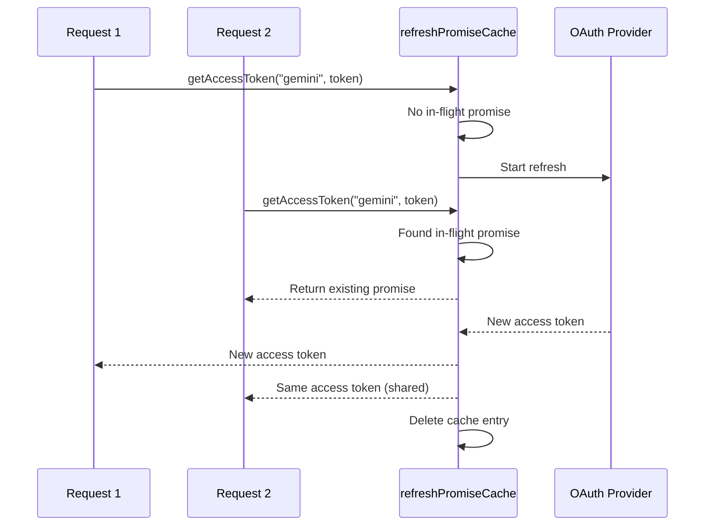

#### アカウント フォールバック ステート マシン

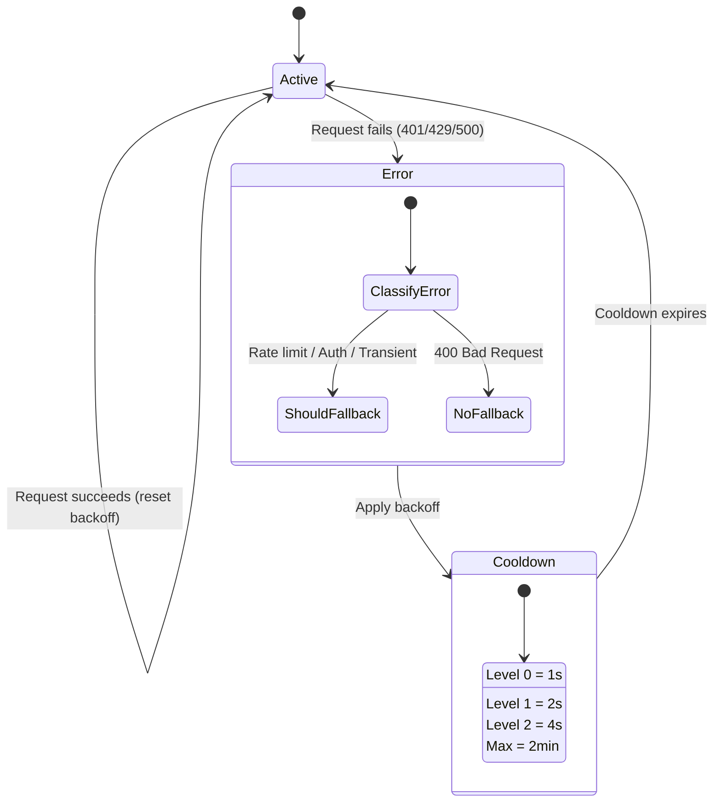

#### コンボ モデル チェーン

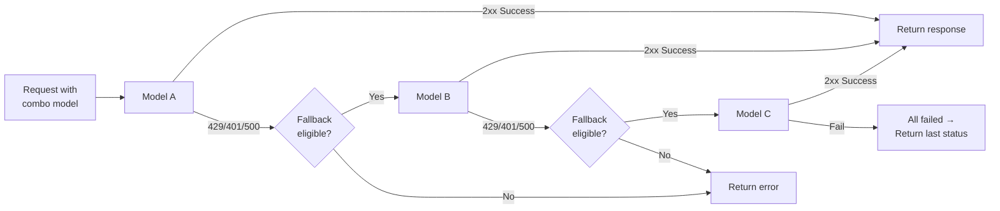

---

### 4.5 トランスレータ (`open-sse/translator/`)

自己登録プラグイン システムを使用した **フォーマット変換エンジン**。

#### アーキテクチャ

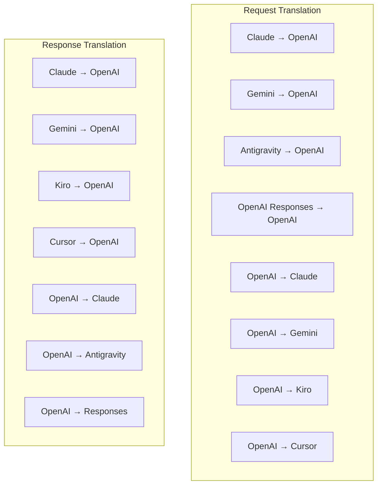

| ディレクトリ | ファイル      | 説明                                                                                                                                                                                                                                                           |
| ------------ | ------------- | -------------------------------------------------------------------------------------------------------------------------------------------------------------------------------------------------------------------------------------------------------------- |
| `request/`   | 翻訳者8名     | リクエストボディをフォーマット間で変換します。各ファイルは、インポート時に `register(from, to, fn)` を介して自己登録されます。                                                                                                                                 |
| `response/`  | 翻訳者 7 名   | ストリーミング応答チャンクをフォーマット間で変換します。 SSE イベント タイプ、思考ブロック、ツール呼び出しを処理します。                                                                                                                                       |
| `helpers/`   | 6人のヘルパー | 共有ユーティリティ: `claudeHelper` (システム プロンプト抽出、シンキング構成)、`geminiHelper` (パーツ/コンテンツ マッピング)、`openaiHelper` (フォーマット フィルタリング)、`toolCallHelper` (ID 生成、欠落応答挿入)、`maxTokensHelper`、`responsesApiHelper`。 |
| `index.ts`   | —             | 変換エンジン: `translateRequest()`、`translateResponse()`、状態管理、レジストリ。                                                                                                                                                                              |
| `formats.ts` | —             | フォーマット定数: `OPENAI`、`CLAUDE`、`GEMINI`、`ANTIGRAVITY`、`KIRO`、`CURSOR`、`OPENAI_RESPONSES`。                                                                                                                                                          |

#### 主な設計: 自己登録プラグイン

```javascript
// Each translator file calls register() on import:
import { register } from "../index.js";
register("claude", "openai", translateClaudeToOpenAI);

// The index.js imports all translator files, triggering registration:
import "./request/claude-to-openai.js"; // ← self-registers
```

---

### 4.6 ユーティリティ (`open-sse/utils/`)

| ファイル           | 目的                                                                                                                                                                                                                                                                                                      |
| ------------------ | --------------------------------------------------------------------------------------------------------------------------------------------------------------------------------------------------------------------------------------------------------------------------------------------------------- |
| `error.ts`         | エラー応答の構築 (OpenAI 互換形式)、アップストリーム エラー解析、エラー メッセージからの反重力再試行時間の抽出、SSE エラー ストリーミング。                                                                                                                                                               |
| `stream.ts`        | **SSE Transform Stream** — コア ストリーミング パイプライン。 2 つのモード: `TRANSLATE` (完全な形式の変換) と `PASSTHROUGH` (正規化 + 使用法の抽出)。チャンクのバッファリング、使用量の推定、コンテンツの長さの追跡を処理します。ストリームごとのエンコーダ/デコーダ インスタンスは共有状態を回避します。 |
| `streamHelpers.ts` | 低レベル SSE ユーティリティ: `parseSSELine` (ホワイトスペース耐性)、`hasValuableContent` (OpenAI/Claude/Gemini の空のチャンクをフィルタリング)、`fixInvalidId`、`formatSSE` (`perf_metrics` クリーンアップによる形式認識 SSE シリアル化)。                                                                |
| `usageTracking.ts` | 任意の形式 (Claude/OpenAI/Gemini/Responses) からのトークン使用量の抽出、別個のツール/メッセージの文字数とトークンの比率による推定、バッファーの追加 (2000 トークンの安全マージン)、形式固有のフィールド フィルタリング、ANSI カラーでのコンソール ロギング。                                              |
| `requestLogger.ts` | ファイルベースのリクエストログ (`ENABLE_REQUEST_LOGS=true` によるオプトイン)。番号付きファイルを含むセッション フォルダーを作成します: `1_req_client.json` → `7_res_client.txt`。すべての I/O は非同期 (ファイア アンド フォーゲット) です。機密ヘッダーをマスクします。                                  |
| `bypassHandler.ts` | Claude CLI からの特定のパターン (タイトル抽出、ウォームアップ、カウント) を傍受し、プロバイダーを呼び出さずに偽の応答を返します。ストリーミングと非ストリーミングの両方をサポートします。意図的に Claude CLI スコープに限定されています。                                                                 |
| `networkProxy.ts`  | 指定されたプロバイダーの送信プロキシ URL を優先順位で解決します: プロバイダー固有の構成 → グローバル構成 → 環境変数 (`HTTPS_PROXY`/`HTTP_PROXY`/`ALL_PROXY`)。 `NO_PROXY` の除外をサポートします。設定を 30 秒間キャッシュします。                                                                        |

#### SSE ストリーミング パイプライン

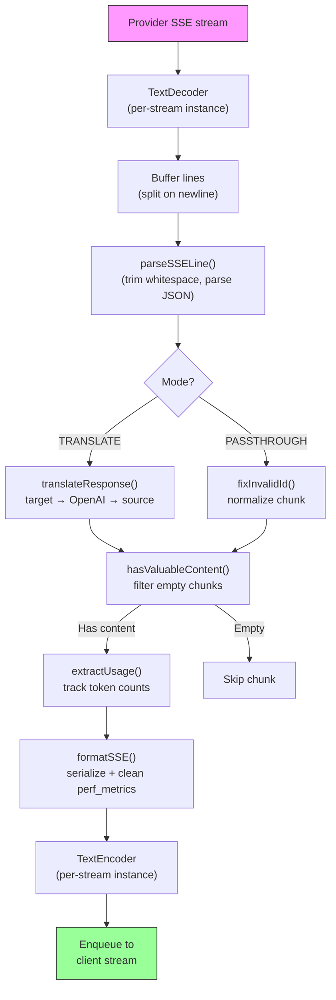

#### リクエスト ロガー セッション構造

```
logs/
└── claude_gemini_claude-sonnet_20260208_143045/
    ├── 1_req_client.json      ← Raw client request
    ├── 2_req_source.json      ← After initial conversion
    ├── 3_req_openai.json      ← OpenAI intermediate format
    ├── 4_req_target.json      ← Final target format
    ├── 5_res_provider.txt     ← Provider SSE chunks (streaming)
    ├── 5_res_provider.json    ← Provider response (non-streaming)
    ├── 6_res_openai.txt       ← OpenAI intermediate chunks
    ├── 7_res_client.txt       ← Client-facing SSE chunks
    └── 6_error.json           ← Error details (if any)
```

---

### 4.7 アプリケーション層 (`src/`)

| ディレクトリ  | 目的                                                                         |
| ------------- | ---------------------------------------------------------------------------- |
| `src/app/`    | Web UI、API ルート、Express ミドルウェア、OAuth コールバック ハンドラー      |
| `src/lib/`    | データベース アクセス (`localDb.ts`、`usageDb.ts`)、認証、共有               |
| `src/mitm/`   | プロバイダーのトラフィックを傍受する中間者プロキシ ユーティリティ            |
| `src/models/` | データベースモデルの定義                                                     |
| `src/shared/` | open-sse 関数 (プロバイダー、ストリーム、エラーなど) のラッパー              |
| `src/sse/`    | open-sse ライブラリを Express ルートに接続する SSE エンドポイント ハンドラー |
| `src/store/`  | アプリケーション状態管理                                                     |

#### 注目すべき API ルート

| ルート                                        | メソッド       | 目的                                                                                                     |
| --------------------------------------------- | -------------- | -------------------------------------------------------------------------------------------------------- |
| `/api/provider-models`                        | 取得/投稿/削除 | プロバイダーごとのカスタム モデルの CRUD                                                                 |
| `/api/models/catalog`                         | 入手           | プロバイダーごとにグループ化されたすべてのモデル (チャット、埋め込み、イメージ、カスタム) の集約カタログ |
| `/api/settings/proxy`                         | 取得/挿入/削除 | 階層型送信プロキシ構成 (`global/providers/combos/keys`)                                                  |
| `/api/settings/proxy/test`                    | 投稿           | プロキシ接続を検証し、パブリック IP/遅延を返します。                                                     |
| `/v1/providers/[provider]/chat/completions`   | 投稿           | モデル検証を備えたプロバイダーごとの専用チャット補完                                                     |
| `/v1/providers/[provider]/embeddings`         | 投稿           | モデル検証を備えたプロバイダーごとの専用埋め込み                                                         |
| `/v1/providers/[provider]/images/generations` | 投稿           | モデル検証を備えたプロバイダーごとの専用イメージ生成                                                     |
| `/api/settings/ip-filter`                     | GET/PUT        | IP ホワイトリスト/ブロックリスト管理                                                                     |
| `/api/settings/thinking-budget`               | GET/PUT        | 推論トークンの予算構成 (パススルー/自動/カスタム/アダプティブ)                                           |
| `/api/settings/system-prompt`                 | GET/PUT        | すべてのリクエストに対するグローバル システム プロンプト インジェクション                                |
| `/api/sessions`                               | 入手           | アクティブなセッションの追跡とメトリクス                                                                 |
| `/api/rate-limits`                            | 入手           | アカウントごとのレート制限ステータス                                                                     |

---

## 5. 主要な設計パターン

### 5.1 ハブアンドスポーク変換

すべての形式は **OpenAI 形式をハブ**として変換します。新しいプロバイダーを追加するには、N ペアではなく、**1 ペア** のトランスレーター (OpenAI との間) を作成するだけで済みます。

### 5.2 エグゼキューター戦略パターン

各プロバイダーには、`BaseExecutor` を継承する専用の実行クラスがあります。 `executors/index.ts` のファクトリは、実行時に正しいものを選択します。

### 5.3 自己登録プラグイン システム

トランスレータ モジュールは、インポート時に `register()` を介して自身を登録します。新しいトランスレータを追加するには、ファイルを作成してインポートするだけです。

### 5.4 指数関数的バックオフによるアカウントのフォールバック

プロバイダーが 429/401/500 を返すと、システムは次のアカウントに切り替えて、指数関数的なクールダウン (1 秒 → 2 秒 → 4 秒 → 最大 2 分) を適用できます。

### 5.5 コンボモデルチェーン

「コンボ」は、複数の `provider/model` 文字列をグループ化します。最初の処理が失敗した場合は、自動的に次の処理にフォールバックします。

### 5.6 ステートフル ストリーミング変換

応答の変換は、`initState()` メカニズムを介して、SSE チャンク全体 (思考ブロックの追跡、ツール呼び出しの蓄積、コンテンツ ブロックのインデックス作成) の状態を維持します。

### 5.7 使用安全バッファー

システム プロンプトや形式変換によるオーバーヘッドによってクライアントがコンテキスト ウィンドウの制限に達するのを防ぐために、報告された使用量に 2000 トークンのバッファーが追加されます。

---

## 6. サポートされている形式

| フォーマット          | 方向                | 識別子             |
| --------------------- | ------------------- | ------------------ |
| OpenAI チャットの完了 | ソース + ターゲット | `openai`           |
| OpenAI レスポンス API | ソース + ターゲット | `openai-responses` |
| 人間のクロード        | ソース + ターゲット | `claude`           |
| Google ジェミニ       | ソース + ターゲット | `gemini`           |
| Google Gemini CLI     | ターゲットのみ      | `gemini-cli`       |
| 反重力                | ソース + ターゲット | `antigravity`      |
| AWS キロ              | ターゲットのみ      | `kiro`             |
| カーソル              | ターゲットのみ      | `cursor`           |

---

## 7. サポートされているプロバイダー

| プロバイダー             | 認証方法                      | 執行者       | 重要なメモ                                                  |
| ------------------------ | ----------------------------- | ------------ | ----------------------------------------------------------- |
| 人間のクロード           | API キーまたは OAuth          | デフォルト   | `x-api-key` ヘッダーを使用します。                          |
| Google ジェミニ          | API キーまたは OAuth          | デフォルト   | `x-goog-api-key` ヘッダーを使用します。                     |
| Google Gemini CLI        | OAuth                         | ジェミニCLI  | `streamGenerateContent` エンドポイントを使用します。        |
| 反重力                   | OAuth                         | 反重力       | マルチ URL フォールバック、カスタム再試行解析               |
| オープンAI               | APIキー                       | デフォルト   | 標準ベアラー認証                                            |
| コーデックス             | OAuth                         | コーデックス | システム命令を注入し、思考を管理します                      |
| GitHub コパイロット      | OAuth + コパイロット トークン | ギットハブ   | デュアル トークン、VSCode ヘッダーの模倣                    |
| キロ (AWS)               | AWS SSO OIDC またはソーシャル | キロ         | バイナリ EventStream 解析                                   |
| カーソルIDE              | チェックサム認証              | カーソル     | Protobuf エンコーディング、SHA-256 チェックサム             |
| クウェン                 | OAuth                         | デフォルト   | 標準認証                                                    |
| iFlow                    | OAuth (ベーシック + ベアラー) | デフォルト   | デュアル認証ヘッダー                                        |
| オープンルーター         | APIキー                       | デフォルト   | 標準ベアラー認証                                            |
| GLM、キミ、ミニマックス  | APIキー                       | デフォルト   | Claude と互換性があるため、`x-api-key` を使用してください。 |
| `openai-compatible-*`    | APIキー                       | デフォルト   | 動的: 任意の OpenAI 互換エンドポイント                      |
| `anthropic-compatible-*` | APIキー                       | デフォルト   | 動的: クロードと互換性のある任意のエンドポイント            |

---

## 8. データフローの概要

### ストリーミングリクエスト

```mermaid
flowchart LR
    A["Client"] --> B["detectFormat()"]
    B --> C["translateRequest()\nsource → OpenAI → target"]
    C --> D["Executor\nbuildUrl + buildHeaders"]
    D --> E["fetch(providerURL)"]
    E --> F["createSSEStream()\nTRANSLATE mode"]
    F --> G["parseSSELine()"]
    G --> H["translateResponse()\ntarget → OpenAI → source"]
    H --> I["extractUsage()\n+ addBuffer"]
    I --> J["formatSSE()"]
    J --> K["Client receives\ntranslated SSE"]
    K --> L["logUsage()\nsaveRequestUsage()"]
```

### 非ストリーミングリクエスト

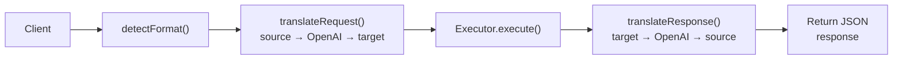

### バイパス フロー (Claude CLI)

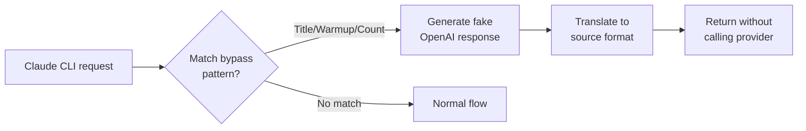
