# omniroute — Documentação da base de código

🌐 **Languages:** 🇺🇸 [English](../../CODEBASE_DOCUMENTATION.md) | 🇧🇷 [Português (Brasil)](../pt-BR/CODEBASE_DOCUMENTATION.md) | 🇪🇸 [Español](../es/CODEBASE_DOCUMENTATION.md) | 🇫🇷 [Français](../fr/CODEBASE_DOCUMENTATION.md) | 🇮🇹 [Italiano](../it/CODEBASE_DOCUMENTATION.md) | 🇷🇺 [Русский](../ru/CODEBASE_DOCUMENTATION.md) | 🇨🇳 [中文 (简体)](../zh-CN/CODEBASE_DOCUMENTATION.md) | 🇩🇪 [Deutsch](../de/CODEBASE_DOCUMENTATION.md) | 🇮🇳 [हिन्दी](../in/CODEBASE_DOCUMENTATION.md) | 🇹🇭 [ไทย](../th/CODEBASE_DOCUMENTATION.md) | 🇺🇦 [Українська](../uk-UA/CODEBASE_DOCUMENTATION.md) | 🇸🇦 [العربية](../ar/CODEBASE_DOCUMENTATION.md) | 🇯🇵 [日本語](../ja/CODEBASE_DOCUMENTATION.md) | 🇻🇳 [Tiếng Việt](../vi/CODEBASE_DOCUMENTATION.md) | 🇧🇬 [Български](../bg/CODEBASE_DOCUMENTATION.md) | 🇩🇰 [Dansk](../da/CODEBASE_DOCUMENTATION.md) | 🇫🇮 [Suomi](../fi/CODEBASE_DOCUMENTATION.md) | 🇮🇱 [עברית](../he/CODEBASE_DOCUMENTATION.md) | 🇭🇺 [Magyar](../hu/CODEBASE_DOCUMENTATION.md) | 🇮🇩 [Bahasa Indonesia](../id/CODEBASE_DOCUMENTATION.md) | 🇰🇷 [한국어](../ko/CODEBASE_DOCUMENTATION.md) | 🇲🇾 [Bahasa Melayu](../ms/CODEBASE_DOCUMENTATION.md) | 🇳🇱 [Nederlands](../nl/CODEBASE_DOCUMENTATION.md) | 🇳🇴 [Norsk](../no/CODEBASE_DOCUMENTATION.md) | 🇵🇹 [Português (Portugal)](../pt/CODEBASE_DOCUMENTATION.md) | 🇷🇴 [Română](../ro/CODEBASE_DOCUMENTATION.md) | 🇵🇱 [Polski](../pl/CODEBASE_DOCUMENTATION.md) | 🇸🇰 [Slovenčina](../sk/CODEBASE_DOCUMENTATION.md) | 🇸🇪 [Svenska](../sv/CODEBASE_DOCUMENTATION.md) | 🇵🇭 [Filipino](../phi/CODEBASE_DOCUMENTATION.md)

> Um guia abrangente e para iniciantes sobre o roteador proxy AI multiprovedor **omniroute**.

---

## 1. O que é OmniRoute?

omniroute é um **roteador proxy** que fica entre clientes de IA (Claude CLI, Codex, Cursor IDE, etc.) e provedores de IA (Anthropic, Google, OpenAI, AWS, GitHub, etc.). Isso resolve um grande problema:

> **Diferentes clientes de IA falam "idiomas" diferentes (formatos de API), e diferentes provedores de IA também esperam "idiomas" diferentes.** omniroute traduz entre eles automaticamente.

Pense nisso como um tradutor universal nas Nações Unidas – qualquer delegado pode falar qualquer idioma, e o tradutor converte para qualquer outro delegado.

---

## 2. Visão geral da arquitetura

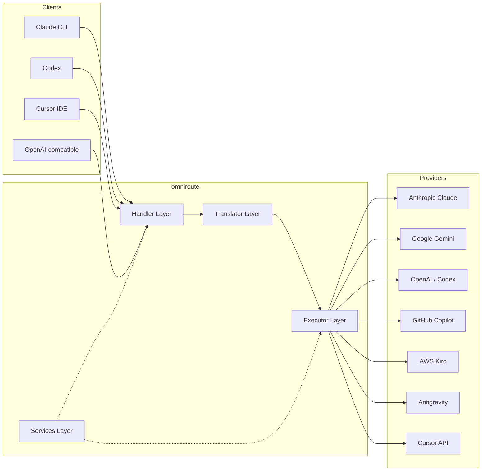

### Princípio Básico: Tradução Hub-and-Spoke

Toda a tradução de formato passa pelo **formato OpenAI como hub**:

```
Client Format → [OpenAI Hub] → Provider Format    (request)
Provider Format → [OpenAI Hub] → Client Format    (response)
```

Isso significa que você só precisa de **N tradutores** (um por formato) em vez de **N²** (cada par).

---

## 3. Estrutura do Projeto

```
omniroute/
├── open-sse/                  ← Core proxy library (portable, framework-agnostic)
│   ├── index.js               ← Main entry point, exports everything
│   ├── config/                ← Configuration & constants
│   ├── executors/             ← Provider-specific request execution
│   ├── handlers/              ← Request handling orchestration
│   ├── services/              ← Business logic (auth, models, fallback, usage)
│   ├── translator/            ← Format translation engine
│   │   ├── request/           ← Request translators (8 files)
│   │   ├── response/          ← Response translators (7 files)
│   │   └── helpers/           ← Shared translation utilities (6 files)
│   └── utils/                 ← Utility functions
├── src/                       ← Application layer (Express/Worker runtime)
│   ├── app/                   ← Web UI, API routes, middleware
│   ├── lib/                   ← Database, auth, and shared library code
│   ├── mitm/                  ← Man-in-the-middle proxy utilities
│   ├── models/                ← Database models
│   ├── shared/                ← Shared utilities (wrappers around open-sse)
│   ├── sse/                   ← SSE endpoint handlers
│   └── store/                 ← State management
├── data/                      ← Runtime data (credentials, logs)
│   └── provider-credentials.json   (external credentials override, gitignored)
└── tester/                    ← Test utilities
```

---

## 4. Divisão módulo por módulo

### 4.1 Configuração (`open-sse/config/`)

A **única fonte de verdade** para todas as configurações do provedor.

| Arquivo                       | Finalidade                                                                                                                                                                                                               |
| ----------------------------- | ------------------------------------------------------------------------------------------------------------------------------------------------------------------------------------------------------------------------ |
| `constants.ts`                | Objeto `PROVIDERS` com URLs base, credenciais OAuth (padrões), cabeçalhos e prompts de sistema padrão para cada provedor. Também define `HTTP_STATUS`, `ERROR_TYPES`, `COOLDOWN_MS`, `BACKOFF_CONFIG` e `SKIP_PATTERNS`. |
| `credentialLoader.ts`         | Carrega credenciais externas de `data/provider-credentials.json` e as mescla nos padrões codificados em `PROVIDERS`. Mantém os segredos fora do controle de origem, mantendo a compatibilidade com versões anteriores.   |
| `providerModels.ts`           | Registro central de modelos: aliases de provedores de mapas → IDs de modelos. Funções como `getModels()`, `getProviderByAlias()`.                                                                                        |
| `codexInstructions.ts`        | Instruções do sistema injetadas em solicitações do Codex (restrições de edição, regras de sandbox, políticas de aprovação).                                                                                              |
| `defaultThinkingSignature.ts` | Assinaturas de "pensamento" padrão para os modelos Claude e Gemini.                                                                                                                                                      |
| `ollamaModels.ts`             | Definição de esquema para modelos locais de Ollama (nome, tamanho, família, quantização).                                                                                                                                |

#### Fluxo de carregamento de credenciais

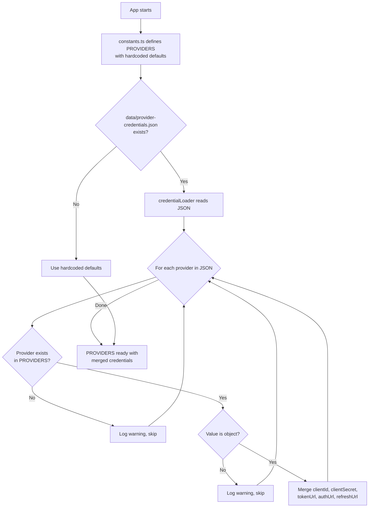

---

### 4.2 Executores (`open-sse/executors/`)

Os executores encapsulam **lógica específica do provedor** usando o **Padrão de estratégia**. Cada executor substitui os métodos básicos conforme necessário.

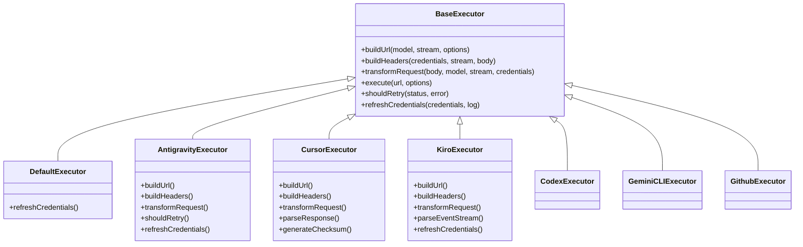

| Executor         | Provedor                                   | Principais Especializações                                                                                                                         |
| ---------------- | ------------------------------------------ | -------------------------------------------------------------------------------------------------------------------------------------------------- |
| `base.ts`        | —                                          | Base abstrata: construção de URL, cabeçalhos, lógica de repetição, atualização de credenciais                                                      |
| `default.ts`     | Claude, Gêmeos, OpenAI, GLM, Kimi, MiniMax | Atualização genérica de token OAuth para provedores padrão                                                                                         |
| `antigravity.ts` | Código do Google Cloud                     | Geração de ID de projeto/sessão, fallback de vários URLs, análise de repetição personalizada de mensagens de erro ("redefinir após 2h7m23s")       |
| `cursor.ts`      | Cursor IDE                                 | **Mais complexo**: autenticação de soma de verificação SHA-256, codificação de solicitação Protobuf, EventStream binário → análise de resposta SSE |
| `codex.ts`       | Códice OpenAI                              | Injeta instruções do sistema, gerencia níveis de pensamento, remove parâmetros não suportados                                                      |
| `gemini-cli.ts`  | CLI do Google Gemini                       | Criação de URL personalizado (`streamGenerateContent`), atualização de token Google OAuth                                                          |
| `github.ts`      | Copiloto GitHub                            | Sistema de token duplo (token GitHub OAuth + Copilot), imitação de cabeçalho VSCode                                                                |
| `kiro.ts`        | AWS CodeWhisperer                          | Análise binária AWS EventStream, event frames AMZN, estimativa de token                                                                            |
| `index.ts`       | —                                          | Fábrica: nome do provedor de mapas → classe do executor, com fallback padrão                                                                       |

---

### 4.3 Manipuladores (`open-sse/handlers/`)

A **camada de orquestração** — coordena tradução, execução, streaming e tratamento de erros.

| Arquivo               | Finalidade                                                                                                                                                                                                                                         |
| --------------------- | -------------------------------------------------------------------------------------------------------------------------------------------------------------------------------------------------------------------------------------------------- |
| `chatCore.ts`         | **Orquestrador central** (~600 linhas). Lida com o ciclo de vida completo da solicitação: detecção de formato → tradução → envio do executor → resposta de streaming/não streaming → atualização de token → tratamento de erros → registro de uso. |
| `responsesHandler.ts` | Adaptador para API de respostas da OpenAI: converte o formato de respostas → conclusões de bate-papo → envia para `chatCore` → converte SSE de volta para o formato de respostas.                                                                  |
| `embeddings.ts`       | Manipulador de geração de incorporação: resolve o modelo de incorporação → provedor, despacha para a API do provedor, retorna uma resposta de incorporação compatível com OpenAI. Suporta mais de 6 provedores.                                    |
| `imageGeneration.ts`  | Manipulador de geração de imagem: resolve modelo de imagem → provedor, suporta modos compatíveis com OpenAI, imagem Gemini (Antigravidade) e fallback (Nebius). Retorna imagens base64 ou URL.                                                     |

#### Ciclo de vida da solicitação (chatCore.ts)

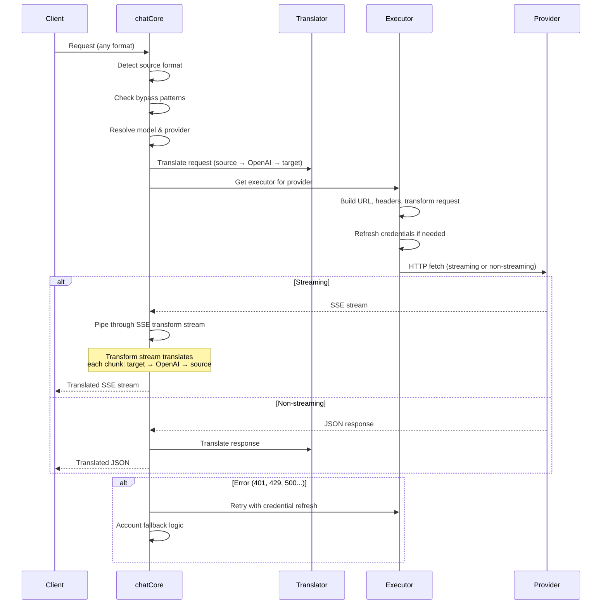

---

### 4.4 Serviços (`open-sse/services/`)

Lógica de negócios que dá suporte aos manipuladores e executores.

| Arquivo              | Finalidade                                                                                                                                                                                                                                                                                                                                                                                  |
| -------------------- | ------------------------------------------------------------------------------------------------------------------------------------------------------------------------------------------------------------------------------------------------------------------------------------------------------------------------------------------------------------------------------------------- |
| `provider.ts`        | **Detecção de formato** (`detectFormat`): analisa a estrutura do corpo da solicitação para identificar formatos Claude/OpenAI/Gemini/Antigravity/Responses (inclui heurística `max_tokens` para Claude). Além disso: construção de URL, construção de cabeçalho, normalização de configuração de pensamento. Suporta provedores dinâmicos `openai-compatible-*` e `anthropic-compatible-*`. |
| `model.ts`           | Análise de string de modelo (`claude/model-name` → `{provider: "claude", model: "model-name"}`), resolução de alias com detecção de colisão, limpeza de entrada (rejeita caracteres de passagem/controle de caminho) e resolução de informações de modelo com suporte a getter de alias assíncrono.                                                                                         |
| `accountFallback.ts` | Tratamento de limite de taxa: espera exponencial (1s → 2s → 4s → máx. 2min), gerenciamento de resfriamento da conta, classificação de erros (quais erros acionam fallback versus não).                                                                                                                                                                                                      |
| `tokenRefresh.ts`    | Atualização de token OAuth para **todos os provedores**: Google (Gemini, Antigravity), Claude, Codex, Qwen, iFlow, GitHub (OAuth + Copilot dual-token), Kiro (AWS SSO OIDC + Social Auth). Inclui cache de desduplicação de promessa em andamento e nova tentativa com espera exponencial.                                                                                                  |
| `combo.ts`           | **Modelos combinados**: cadeias de modelos alternativos. Se o modelo A falhar com um erro elegível para fallback, tente o modelo B, depois o C, etc. Retorna os códigos de status upstream reais.                                                                                                                                                                                           |
| `usage.ts`           | Busca dados de cota/uso de APIs do provedor (cotas do GitHub Copilot, cotas do modelo antigravidade, limites de taxa do Codex, detalhamentos de uso do Kiro, configurações do Claude).                                                                                                                                                                                                      |
| `accountSelector.ts` | Seleção inteligente de conta com algoritmo de pontuação: considera prioridade, status de integridade, posição round-robin e estado de espera para escolher a conta ideal para cada solicitação.                                                                                                                                                                                             |
| `contextManager.ts`  | Gerenciamento do ciclo de vida do contexto de solicitação: cria e rastreia objetos de contexto por solicitação com metadados (ID da solicitação, carimbos de data/hora, informações do provedor) para depuração e registro em log.                                                                                                                                                          |
| `ipFilter.ts`        | Controle de acesso baseado em IP: suporta modos de lista de permissões e lista de bloqueios. Valida o IP do cliente em relação às regras configuradas antes de processar solicitações de API.                                                                                                                                                                                               |
| `sessionManager.ts`  | Rastreamento de sessão com impressão digital do cliente: rastreia sessões ativas usando identificadores de cliente com hash, monitora contagens de solicitações e fornece métricas de sessão.                                                                                                                                                                                               |
| `signatureCache.ts`  | Solicitar cache de desduplicação baseado em assinatura: evita solicitações duplicadas armazenando em cache assinaturas de solicitações recentes e retornando respostas armazenadas em cache para solicitações idênticas dentro de um intervalo de tempo.                                                                                                                                    |
| `systemPrompt.ts`    | Injeção global de prompt do sistema: acrescenta ou acrescenta um prompt do sistema configurável a todas as solicitações, com tratamento de compatibilidade por provedor.                                                                                                                                                                                                                    |
| `thinkingBudget.ts`  | Gerenciamento de orçamento de token de raciocínio: oferece suporte aos modos passthrough, automático (configuração de pensamento), personalizado (orçamento fixo) e adaptativo (escala de complexidade) para controlar tokens de pensamento/raciocínio.                                                                                                                                     |
| `wildcardRouter.ts`  | Roteamento de padrão de modelo curinga: resolve padrões curinga (por exemplo, `*/claude-*`) para pares concretos de provedor/modelo com base na disponibilidade e prioridade.                                                                                                                                                                                                               |

#### Desduplicação de atualização de token

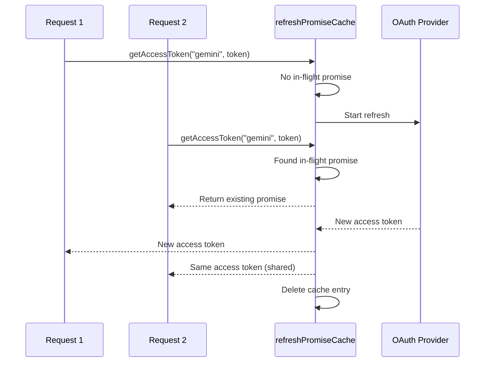

#### Máquina de estado substituto da conta

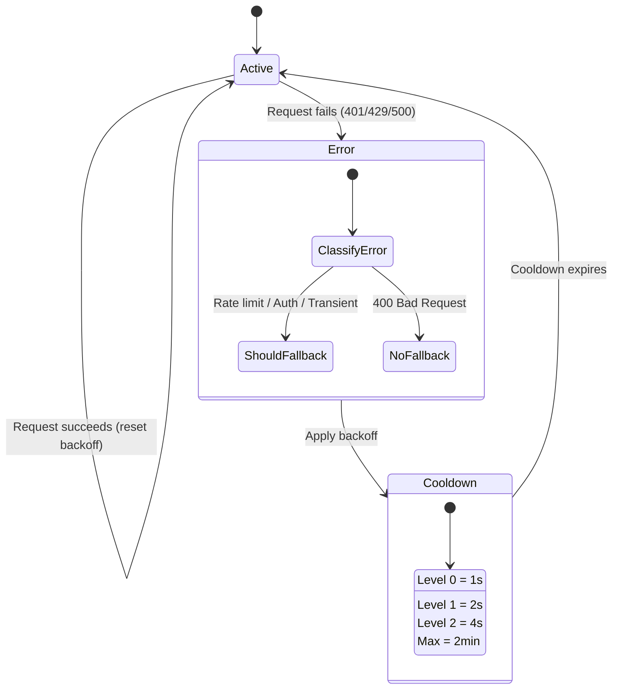

#### Cadeia de modelos combinados

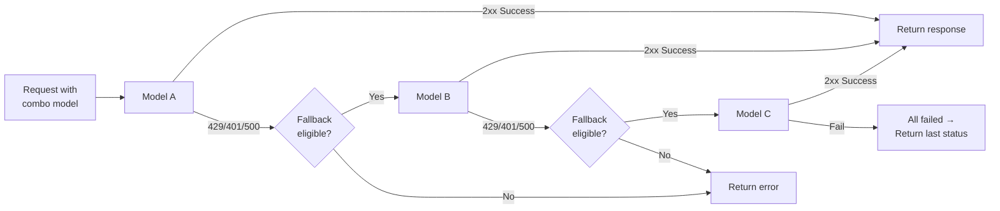

---

### 4.5 Tradutor (`open-sse/translator/`)

O **mecanismo de tradução de formatos** usando um sistema de plugins com autorregistro.

#### Arquitetura

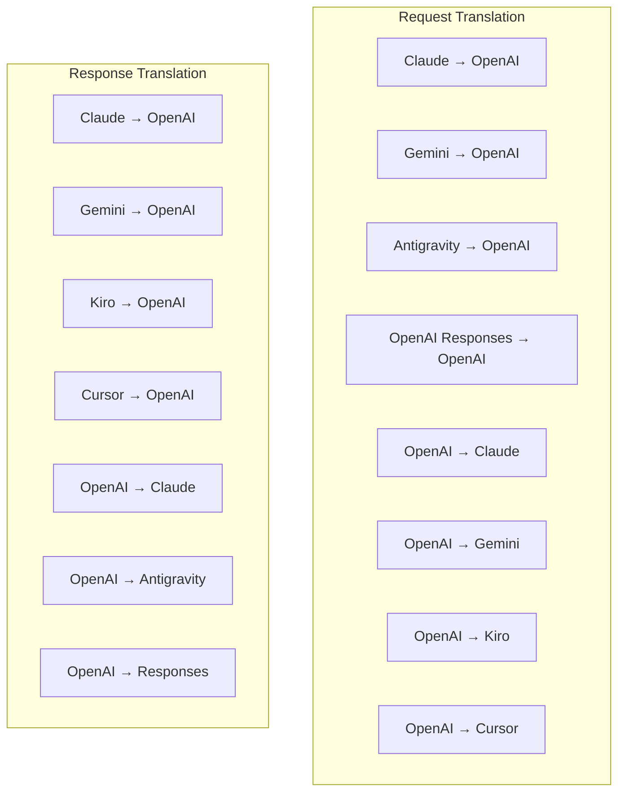

| Diretório    | Arquivos     | Descrição                                                                                                                                                                                                                                                                                              |
| ------------ | ------------ | ------------------------------------------------------------------------------------------------------------------------------------------------------------------------------------------------------------------------------------------------------------------------------------------------------ |
| `request/`   | 8 tradutores | Converta corpos de solicitação entre formatos. Cada arquivo é registrado automaticamente via `register(from, to, fn)` na importação.                                                                                                                                                                   |
| `response/`  | 7 tradutores | Converta pedaços de resposta de streaming entre formatos. Lida com tipos de eventos SSE, blocos de pensamento e chamadas de ferramentas.                                                                                                                                                               |
| `helpers/`   | 6 ajudantes  | Utilitários compartilhados: `claudeHelper` (extração de prompt do sistema, configuração de pensamento), `geminiHelper` (mapeamento de partes/conteúdo), `openaiHelper` (filtragem de formato), `toolCallHelper` (geração de ID, injeção de resposta ausente), `maxTokensHelper`, `responsesApiHelper`. |
| `index.ts`   | —            | Mecanismo de tradução: `translateRequest()`, `translateResponse()`, gerenciamento de estado, registro.                                                                                                                                                                                                 |
| `formats.ts` | —            | Constantes de formato: `OPENAI`, `CLAUDE`, `GEMINI`, `ANTIGRAVITY`, `KIRO`, `CURSOR`, `OPENAI_RESPONSES`.                                                                                                                                                                                              |

#### Design principal: plug-ins de autorregistro

```javascript
// Each translator file calls register() on import:
import { register } from "../index.js";
register("claude", "openai", translateClaudeToOpenAI);

// The index.js imports all translator files, triggering registration:
import "./request/claude-to-openai.js"; // ← self-registers
```

---

### 4.6 Utilitários (`open-sse/utils/`)

| Arquivo            | Finalidade                                                                                                                                                                                                                                                                                                                                   |
| ------------------ | -------------------------------------------------------------------------------------------------------------------------------------------------------------------------------------------------------------------------------------------------------------------------------------------------------------------------------------------- |
| `error.ts`         | Criação de resposta a erros (formato compatível com OpenAI), análise de erros upstream, extração de tempo de repetição antigravidade de mensagens de erro, streaming de erros SSE.                                                                                                                                                           |
| `stream.ts`        | **SSE Transform Stream** — o principal pipeline de streaming. Dois modos: `TRANSLATE` (tradução de formato completo) e `PASSTHROUGH` (normalizar + extrair uso). Lida com buffer de blocos, estimativa de uso e rastreamento de comprimento de conteúdo. As instâncias do codificador/decodificador por fluxo evitam o estado compartilhado. |
| `streamHelpers.ts` | Utilitários SSE de baixo nível: `parseSSELine` (tolerante a espaços em branco), `hasValuableContent` (filtra pedaços vazios para OpenAI/Claude/Gemini), `fixInvalidId`, `formatSSE` (serialização SSE com reconhecimento de formato com limpeza `perf_metrics`).                                                                             |
| `usageTracking.ts` | Extração de uso de token de qualquer formato (Claude/OpenAI/Gemini/Responses), estimativa com proporções separadas de caracteres por ferramenta/mensagem por token, adição de buffer (margem de segurança de 2.000 tokens), filtragem de campo específica de formato, registro de console com cores ANSI.                                    |
| `requestLogger.ts` | Registro de solicitação baseado em arquivo (aceitação via `ENABLE_REQUEST_LOGS=true`). Cria pastas de sessão com arquivos numerados: `1_req_client.json` → `7_res_client.txt`. Toda E/S é assíncrona (dispare e esqueça). Mascara cabeçalhos sensíveis.                                                                                      |
| `bypassHandler.ts` | Intercepta padrões específicos do Claude CLI (extração de título, aquecimento, contagem) e retorna respostas falsas sem ligar para nenhum provedor. Suporta streaming e não streaming. Intencionalmente limitado ao escopo Claude CLI.                                                                                                       |
| `networkProxy.ts`  | Resolve URL de proxy de saída para um determinado provedor com precedência: configuração específica do provedor → configuração global → variáveis ​​de ambiente (`HTTPS_PROXY`/`HTTP_PROXY`/`ALL_PROXY`). Suporta exclusões `NO_PROXY`. Configuração de caches por 30s.                                                                      |

#### Pipeline de streaming SSE

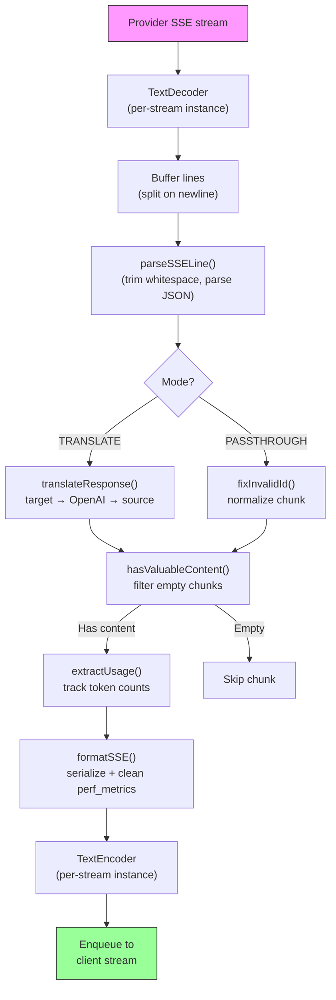

#### Estrutura da sessão do registrador de solicitações

```
logs/
└── claude_gemini_claude-sonnet_20260208_143045/
    ├── 1_req_client.json      ← Raw client request
    ├── 2_req_source.json      ← After initial conversion
    ├── 3_req_openai.json      ← OpenAI intermediate format
    ├── 4_req_target.json      ← Final target format
    ├── 5_res_provider.txt     ← Provider SSE chunks (streaming)
    ├── 5_res_provider.json    ← Provider response (non-streaming)
    ├── 6_res_openai.txt       ← OpenAI intermediate chunks
    ├── 7_res_client.txt       ← Client-facing SSE chunks
    └── 6_error.json           ← Error details (if any)
```

---

### 4.7 Camada de Aplicação (`src/`)

| Diretório     | Finalidade                                                                             |
| ------------- | -------------------------------------------------------------------------------------- |
| `src/app/`    | UI da Web, rotas de API, middleware Express, manipuladores de retorno de chamada OAuth |
| `src/lib/`    | Acesso à base de dados (`localDb.ts`, `usageDb.ts`), autenticação, partilhada          |
| `src/mitm/`   | Utilitários proxy man-in-the-middle para interceptar o tráfego do provedor             |
| `src/models/` | Definições de modelo de banco de dados                                                 |
| `src/shared/` | Wrappers em torno de funções open-sse (provedor, fluxo, erro, etc.)                    |
| `src/sse/`    | Manipuladores de endpoint SSE que conectam a biblioteca open-sse às rotas Express      |
| `src/store/`  | Gerenciamento de estado de aplicação                                                   |

#### Rotas de API notáveis

| Rota                                          | Métodos               | Finalidade                                                                                             |
| --------------------------------------------- | --------------------- | ------------------------------------------------------------------------------------------------------ |
| `/api/provider-models`                        | OBTER/POSTAR/EXCLUIR  | CRUD para modelos customizados por provedor                                                            |
| `/api/models/catalog`                         | OBTER                 | Catálogo agregado de todos os modelos (chat, incorporação, imagem, customizado) agrupados por provedor |
| `/api/settings/proxy`                         | OBTER/COLOCAR/EXCLUIR | Configuração hierárquica de proxy de saída (`global/providers/combos/keys`)                            |
| `/api/settings/proxy/test`                    | POSTAR                | Valida a conectividade do proxy e retorna IP público/latência                                          |
| `/v1/providers/[provider]/chat/completions`   | POSTAR                | Conclusões de chat dedicadas por provedor com validação de modelo                                      |
| `/v1/providers/[provider]/embeddings`         | POSTAR                | Incorporações dedicadas por provedor com validação de modelo                                           |
| `/v1/providers/[provider]/images/generations` | POSTAR                | Geração de imagens dedicadas por provedor com validação de modelo                                      |
| `/api/settings/ip-filter`                     | OBTER/COLOCAR         | Gerenciamento de lista de permissão/lista de bloqueio de IP                                            |
| `/api/settings/thinking-budget`               | OBTER/COLOCAR         | Configuração do orçamento do token de raciocínio (passagem/automática/personalizada/adaptável)         |
| `/api/settings/system-prompt`                 | OBTER/COLOCAR         | Injeção imediata do sistema global para todas as solicitações                                          |
| `/api/sessions`                               | OBTER                 | Acompanhamento e métricas de sessões ativas                                                            |
| `/api/rate-limits`                            | OBTER                 | Status do limite de taxa por conta                                                                     |

---

## 5. Principais padrões de design

### 5.1 Tradução Hub-and-Spoke

Todos os formatos são traduzidos através do **formato OpenAI como hub**. Adicionar um novo provedor requer apenas escrever **um par** de tradutores (de/para OpenAI), não N pares.

### 5.2 Padrão de Estratégia do Executor

Cada provedor possui uma classe de executor dedicada herdada de `BaseExecutor`. A fábrica em `executors/index.ts` seleciona o correto em tempo de execução.

### 5.3 Sistema de plug-ins de autorregistro

Os módulos tradutores se registram na importação via `register()`. Adicionar um novo tradutor é apenas criar um arquivo e importá-lo.

### 5.4 Fallback de conta com backoff exponencial

Quando um provedor retorna 429/401/500, o sistema pode mudar para a próxima conta, aplicando cooldowns exponenciais (1s → 2s → 4s → máx. 2min).

### 5.5 Cadeias de modelos combinados

Um "combo" agrupa várias strings `provider/model`. Se o primeiro falhar, volte para o próximo automaticamente.

### 5.6 Tradução de streaming com estado

A tradução de resposta mantém o estado em blocos SSE (rastreamento de blocos de pensamento, acúmulo de chamadas de ferramentas, indexação de blocos de conteúdo) por meio do mecanismo `initState()`.

### 5.7 Buffer de segurança de uso

Um buffer de 2.000 tokens é adicionado ao uso relatado para evitar que os clientes atinjam os limites da janela de contexto devido à sobrecarga dos prompts do sistema e da tradução de formato.

---

## 6. Formatos Suportados

| Formato                        | Direção          | Identificador      |
| ------------------------------ | ---------------- | ------------------ |
| Conclusões do bate-papo OpenAI | origem + destino | `openai`           |
| API de respostas OpenAI        | origem + destino | `openai-responses` |
| Claude Antrópico               | origem + destino | `claude`           |
| Google Gêmeos                  | origem + destino | `gemini`           |
| CLI do Google Gemini           | apenas alvo      | `gemini-cli`       |
| Antigravidade                  | origem + destino | `antigravity`      |
| AWSKiro                        | apenas alvo      | `kiro`             |
| Cursor                         | apenas alvo      | `cursor`           |

---

## 7. Provedores Suportados

| Provedor                 | Método de autenticação              | Executor      | Notas principais                                            |
| ------------------------ | ----------------------------------- | ------------- | ----------------------------------------------------------- |
| Claude Antrópico         | Chave API ou OAuth                  | Padrão        | Usa cabeçalho `x-api-key`                                   |
| Google Gêmeos            | Chave API ou OAuth                  | Padrão        | Usa cabeçalho `x-goog-api-key`                              |
| CLI do Google Gemini     | OAuth                               | GêmeosCLI     | Usa ponto de extremidade `streamGenerateContent`            |
| Antigravidade            | OAuth                               | Antigravidade | Fallback de vários URLs, análise de repetição personalizada |
| OpenAI                   | Chave de API                        | Padrão        | Autenticação do portador padrão                             |
| Códice                   | OAuth                               | Códice        | Injeta instruções do sistema, gerencia o pensamento         |
| Copiloto GitHub          | Token OAuth + Copiloto              | GitHub        | Token duplo, imitação de cabeçalho VSCode                   |
| Kiro (AWS)               | AWS SSO OIDC ou social              | Kiro          | Análise binária de EventStream                              |
| Cursor IDE               | Autenticação de soma de verificação | Cursor        | Codificação protobuf, somas de verificação SHA-256          |
| Qwen                     | OAuth                               | Padrão        | Autenticação padrão                                         |
| iFlow                    | OAuth (Básico + Portador)           | Padrão        | Cabeçalho de autenticação dupla                             |
| OpenRouter               | Chave de API                        | Padrão        | Autenticação do portador padrão                             |
| GLM, Kimi, MiniMax       | Chave de API                        | Padrão        | Compatível com Claude, use `x-api-key`                      |
| `openai-compatible-*`    | Chave de API                        | Padrão        | Dinâmico: qualquer endpoint compatível com OpenAI           |
| `anthropic-compatible-*` | Chave de API                        | Padrão        | Dinâmico: qualquer endpoint compatível com Claude           |

---

## 8. Resumo do fluxo de dados

### Solicitação de streaming

```mermaid
flowchart LR
    A["Client"] --> B["detectFormat()"]
    B --> C["translateRequest()\nsource → OpenAI → target"]
    C --> D["Executor\nbuildUrl + buildHeaders"]
    D --> E["fetch(providerURL)"]
    E --> F["createSSEStream()\nTRANSLATE mode"]
    F --> G["parseSSELine()"]
    G --> H["translateResponse()\ntarget → OpenAI → source"]
    H --> I["extractUsage()\n+ addBuffer"]
    I --> J["formatSSE()"]
    J --> K["Client receives\ntranslated SSE"]
    K --> L["logUsage()\nsaveRequestUsage()"]
```

### Solicitação de não streaming

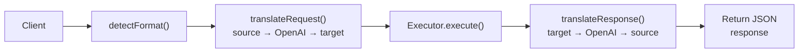

### Desviar fluxo (Claude CLI)

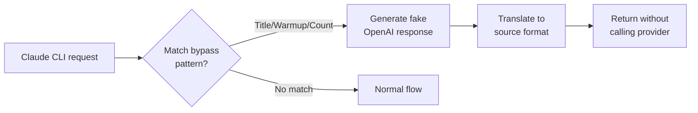
