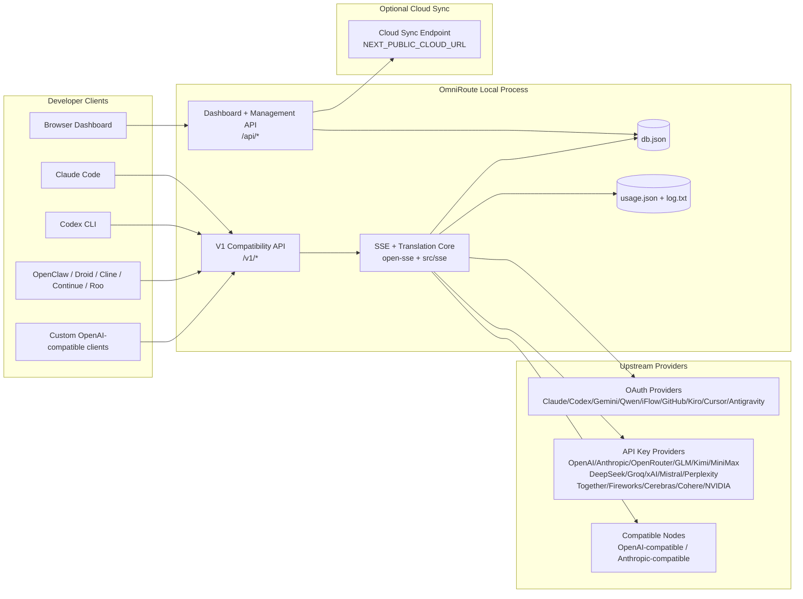
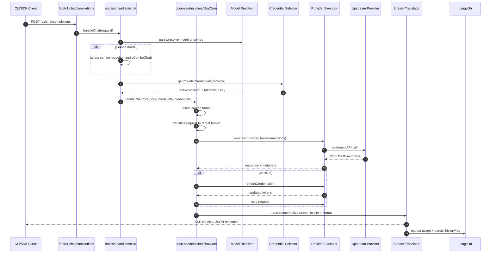
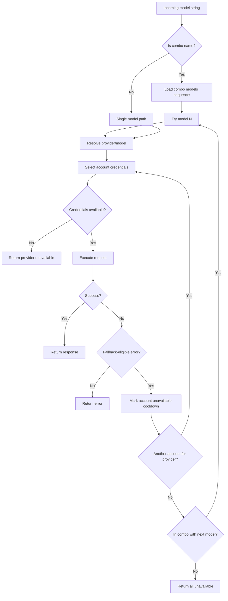
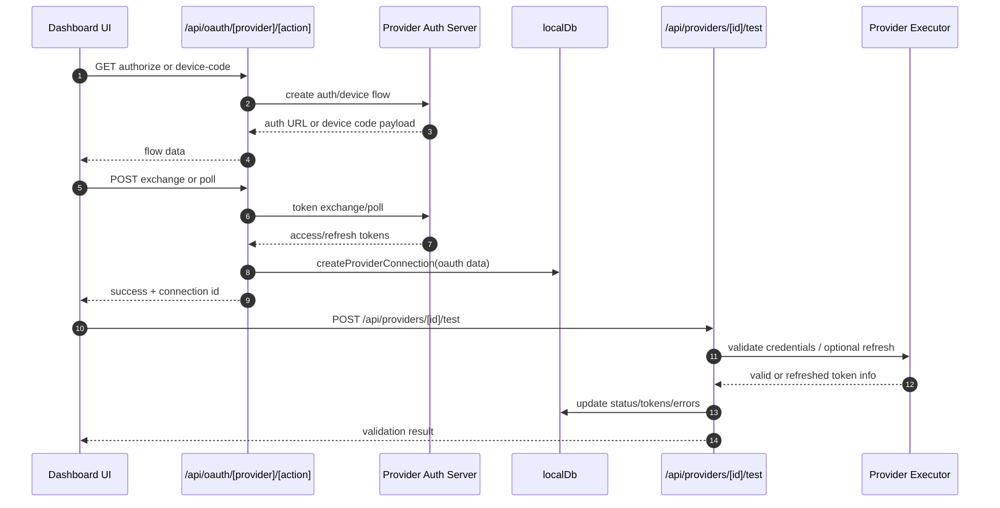
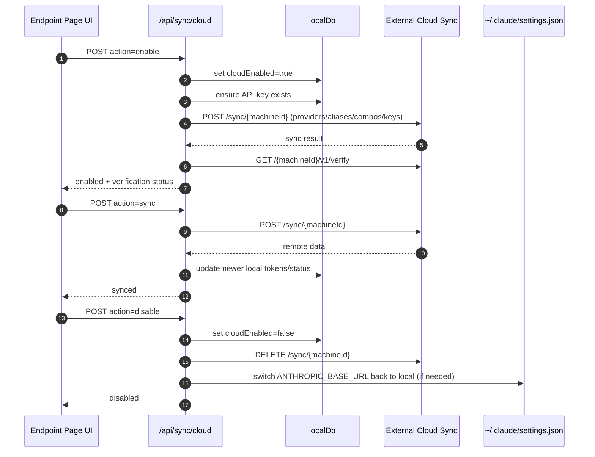
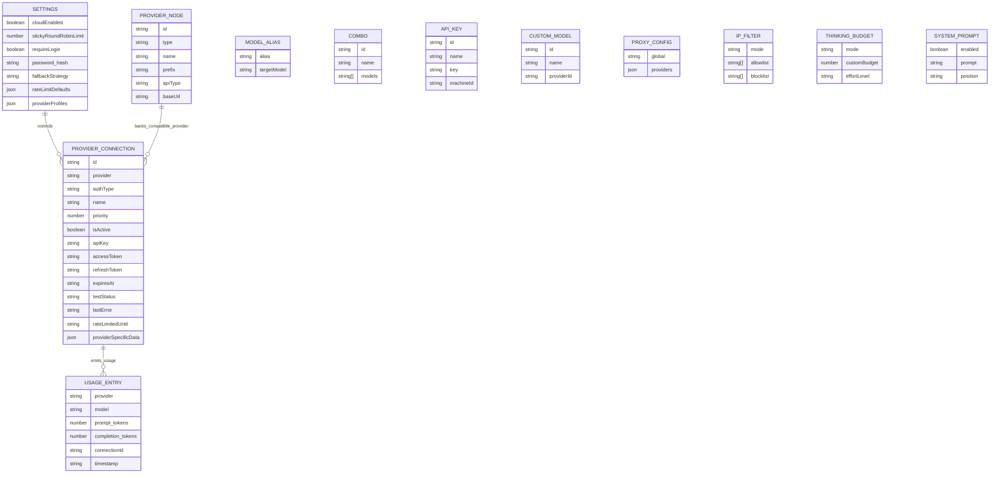
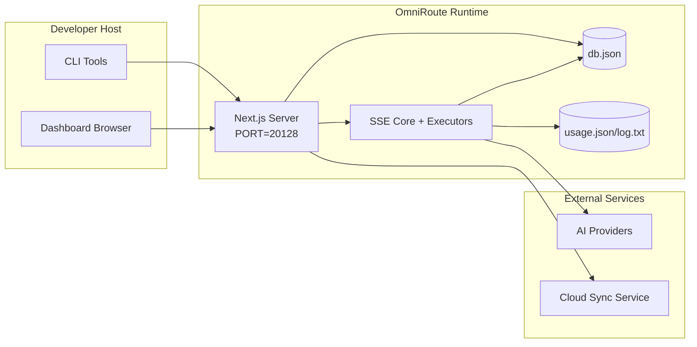

# Arquitetura OmniRoute

🌐 **Languages:** 🇺🇸 [English](../../ARCHITECTURE.md) | 🇧🇷 [Português (Brasil)](../pt-BR/ARCHITECTURE.md) | 🇪🇸 [Español](../es/ARCHITECTURE.md) | 🇫🇷 [Français](../fr/ARCHITECTURE.md) | 🇮🇹 [Italiano](../it/ARCHITECTURE.md) | 🇷🇺 [Русский](../ru/ARCHITECTURE.md) | 🇨🇳 [中文 (简体)](../zh-CN/ARCHITECTURE.md) | 🇩🇪 [Deutsch](../de/ARCHITECTURE.md) | 🇮🇳 [हिन्दी](../in/ARCHITECTURE.md) | 🇹🇭 [ไทย](../th/ARCHITECTURE.md) | 🇺🇦 [Українська](../uk-UA/ARCHITECTURE.md) | 🇸🇦 [العربية](../ar/ARCHITECTURE.md) | 🇯🇵 [日本語](../ja/ARCHITECTURE.md) | 🇻🇳 [Tiếng Việt](../vi/ARCHITECTURE.md) | 🇧🇬 [Български](../bg/ARCHITECTURE.md) | 🇩🇰 [Dansk](../da/ARCHITECTURE.md) | 🇫🇮 [Suomi](../fi/ARCHITECTURE.md) | 🇮🇱 [עברית](../he/ARCHITECTURE.md) | 🇭🇺 [Magyar](../hu/ARCHITECTURE.md) | 🇮🇩 [Bahasa Indonesia](../id/ARCHITECTURE.md) | 🇰🇷 [한국어](../ko/ARCHITECTURE.md) | 🇲🇾 [Bahasa Melayu](../ms/ARCHITECTURE.md) | 🇳🇱 [Nederlands](../nl/ARCHITECTURE.md) | 🇳🇴 [Norsk](../no/ARCHITECTURE.md) | 🇵🇹 [Português (Portugal)](../pt/ARCHITECTURE.md) | 🇷🇴 [Română](../ro/ARCHITECTURE.md) | 🇵🇱 [Polski](../pl/ARCHITECTURE.md) | 🇸🇰 [Slovenčina](../sk/ARCHITECTURE.md) | 🇸🇪 [Svenska](../sv/ARCHITECTURE.md) | 🇵🇭 [Filipino](../phi/ARCHITECTURE.md)

_Última atualização: 18/02/2026_

## Resumo Executivo

OmniRoute é um gateway de roteamento de IA local e painel construído em Next.js.
Ele fornece um único endpoint compatível com OpenAI (`/v1/*`) e roteia o tráfego entre vários provedores upstream com tradução, fallback, atualização de token e rastreamento de uso.

Capacidades principais:

- Superfície API compatível com OpenAI para CLI/ferramentas (28 provedores)
- Tradução de solicitação/resposta em formatos de provedores
- Fallback de combinação de modelos (sequência de vários modelos)
- Fallback em nível de conta (várias contas por provedor)
- Gerenciamento de conexão de provedor de chave OAuth + API
- Geração de incorporação via `/v1/embeddings` (6 provedores, 9 modelos)
- Geração de imagens via `/v1/images/generations` (4 provedores, 9 modelos)
- Pense na análise de tags (`<think>...</think>`) para modelos de raciocínio
- Sanitização de resposta para compatibilidade estrita com OpenAI SDK
- Normalização de funções (desenvolvedor→sistema, sistema→usuário) para compatibilidade entre provedores
- Conversão de saída estruturada (json_schema → Gemini responseSchema)
- Persistência local para provedores, chaves, aliases, combos, configurações, preços
- Acompanhamento de uso/custo e registro de solicitações
- Sincronização em nuvem opcional para sincronização de vários dispositivos/estado
- Lista de permissões/lista de bloqueio de IP para controle de acesso à API
- Pensando na gestão orçamentária (passthrough/auto/custom/adaptive)
- Injeção imediata do sistema global
- Rastreamento de sessão e impressão digital
- Limitação de taxa aprimorada por conta com perfis específicos do provedor
- Padrão de disjuntor para resiliência do provedor
- Proteção de rebanho anti-trovão com bloqueio mutex
- Cache de desduplicação de solicitação baseada em assinatura
- Camada de domínio: disponibilidade do modelo, regras de custo, política de fallback, política de bloqueio
- Persistência de estado de domínio (cache write-through SQLite para fallbacks, orçamentos, bloqueios, disjuntores)
- Mecanismo de política para avaliação centralizada de solicitações (bloqueio → orçamento → fallback)
- Solicitar telemetria com agregação de latência p50/p95/p99
- ID de correlação (X-Request-Id) para rastreamento ponta a ponta
- Registro de auditoria de conformidade com cancelamento por chave de API
- Estrutura de avaliação para garantia de qualidade LLM
- Painel de UI de resiliência com status do disjuntor em tempo real
- Provedores OAuth modulares (12 módulos individuais em `src/lib/oauth/providers/`)

Modelo de tempo de execução primário:

- As rotas do aplicativo Next.js em `src/app/api/*` implementam APIs de painel e APIs de compatibilidade
- Um núcleo SSE/roteamento compartilhado em `src/sse/*` + `open-sse/*` lida com execução, tradução, streaming, fallback e uso do provedor

## Escopo e limites

### No escopo

- Tempo de execução do gateway local
- APIs de gerenciamento de painel
- Autenticação do provedor e atualização de token
- Solicitar tradução e streaming SSE
- Estado local + persistência de uso
- Orquestração opcional de sincronização em nuvem

### Fora do escopo

- Implementação de serviço em nuvem por trás de `NEXT_PUBLIC_CLOUD_URL`
- Plano de controle/SLA do provedor fora do processo local
- Os próprios binários CLI externos (Claude CLI, Codex CLI, etc.)

## Contexto do sistema de alto nível



## Componentes principais de tempo de execução

## 1) API e camada de roteamento (rotas de aplicativos Next.js)

Diretórios principais:

- `src/app/api/v1/*` e `src/app/api/v1beta/*` para APIs de compatibilidade
- `src/app/api/*` para APIs de gerenciamento/configuração
- Próximas reescritas em `next.config.mjs` mapeiam `/v1/*` para `/api/v1/*`

Rotas de compatibilidade importantes:

- `src/app/api/v1/chat/completions/route.ts`
- `src/app/api/v1/messages/route.ts`
- `src/app/api/v1/responses/route.ts`
- `src/app/api/v1/models/route.ts` — inclui modelos personalizados com `custom: true`
- `src/app/api/v1/embeddings/route.ts` — geração de incorporação (6 provedores)
- `src/app/api/v1/images/generations/route.ts` — geração de imagens (4+ provedores incluindo Antigravidade/Nebius)
- `src/app/api/v1/messages/count_tokens/route.ts`
- `src/app/api/v1/providers/[provider]/chat/completions/route.ts` — bate-papo dedicado por provedor
- `src/app/api/v1/providers/[provider]/embeddings/route.ts` — embeddings dedicados por provedor
- `src/app/api/v1/providers/[provider]/images/generations/route.ts` — imagens dedicadas por provedor
- `src/app/api/v1beta/models/route.ts`
- `src/app/api/v1beta/models/[...path]/route.ts`

Domínios de gerenciamento:

- Autenticação/configurações: `src/app/api/auth/*`, `src/app/api/settings/*`
- Provedores/conexões: `src/app/api/providers*`
- Nós do provedor: `src/app/api/provider-nodes*`
- Modelos personalizados: `src/app/api/provider-models` (GET/POST/DELETE)
- Catálogo de modelos: `src/app/api/models/catalog` (GET)
- Configuração de proxy: `src/app/api/settings/proxy` (GET/PUT/DELETE) + `src/app/api/settings/proxy/test` (POST)
- OAuth: `src/app/api/oauth/*`
- Chaves/aliases/combos/preços: `src/app/api/keys*`, `src/app/api/models/alias`, `src/app/api/combos*`, `src/app/api/pricing`
- Uso: `src/app/api/usage/*`
- Sincronização/nuvem: `src/app/api/sync/*`, `src/app/api/cloud/*`
- Ajudantes de ferramentas CLI: `src/app/api/cli-tools/*`
- Filtro IP: `src/app/api/settings/ip-filter` (GET/PUT)
- Orçamento pensado: `src/app/api/settings/thinking-budget` (GET/PUT)
- Prompt do sistema: `src/app/api/settings/system-prompt` (GET/PUT)
- Sessões: `src/app/api/sessions` (GET)
- Limites de taxa: `src/app/api/rate-limits` (GET)
- Resiliência: `src/app/api/resilience` (GET/PATCH) — perfis de provedor, disjuntor, estado limite de taxa
- Redefinição de resiliência: `src/app/api/resilience/reset` (POST) — redefinir disjuntores + resfriamento
- Estatísticas de cache: `src/app/api/cache/stats` (GET/DELETE)
- Disponibilidade do modelo: `src/app/api/models/availability` (GET/POST)
- Telemetria: `src/app/api/telemetry/summary` (GET)
- Orçamento: `src/app/api/usage/budget` (GET/POST)
- Cadeias de fallback: `src/app/api/fallback/chains` (GET/POST/DELETE)
- Auditoria de conformidade: `src/app/api/compliance/audit-log` (GET)
- Avaliações: `src/app/api/evals` (GET/POST), `src/app/api/evals/[suiteId]` (GET)
- Políticas: `src/app/api/policies` (GET/POST)

## 2) SSE + Núcleo de Tradução

Principais módulos de fluxo:

- Entrada: `src/sse/handlers/chat.ts`
- Orquestração principal: `open-sse/handlers/chatCore.ts`
- Adaptadores de execução do provedor: `open-sse/executors/*`
- Detecção de formato/configuração do provedor: `open-sse/services/provider.ts`
- Análise/resolução de modelo: `src/sse/services/model.ts`, `open-sse/services/model.ts`
- Lógica de substituição da conta: `open-sse/services/accountFallback.ts`
- Registro de tradução: `open-sse/translator/index.ts`
- Transformações de fluxo: `open-sse/utils/stream.ts`, `open-sse/utils/streamHandler.ts`
- Extração/normalização de uso: `open-sse/utils/usageTracking.ts`
- Pense no analisador de tags: `open-sse/utils/thinkTagParser.ts`
- Manipulador de incorporação: `open-sse/handlers/embeddings.ts`
- Incorporação de registro de provedor: `open-sse/config/embeddingRegistry.ts`
- Manipulador de geração de imagem: `open-sse/handlers/imageGeneration.ts`
- Registro do provedor de imagens: `open-sse/config/imageRegistry.ts`
- Sanitização de resposta: `open-sse/handlers/responseSanitizer.ts`
- Normalização de função: `open-sse/services/roleNormalizer.ts`

Serviços (lógica de negócios):

- Seleção/pontuação de conta: `open-sse/services/accountSelector.ts`
- Gerenciamento do ciclo de vida do contexto: `open-sse/services/contextManager.ts`
- Aplicação do filtro IP: `open-sse/services/ipFilter.ts`
- Acompanhamento de sessão: `open-sse/services/sessionManager.ts`
- Solicitar desduplicação: `open-sse/services/signatureCache.ts`
- Injeção de prompt do sistema: `open-sse/services/systemPrompt.ts`
- Pensando na gestão orçamentária: `open-sse/services/thinkingBudget.ts`
- Roteamento de modelo curinga: `open-sse/services/wildcardRouter.ts`
- Gerenciamento de limite de taxa: `open-sse/services/rateLimitManager.ts`
- Disjuntor: `open-sse/services/circuitBreaker.ts`

Módulos da camada de domínio:

- Disponibilidade do modelo: `src/lib/domain/modelAvailability.ts`
- Regras/orçamentos de custos: `src/lib/domain/costRules.ts`
- Política de substituto: `src/lib/domain/fallbackPolicy.ts`
- Resolvedor combinado: `src/lib/domain/comboResolver.ts`
- Política de bloqueio: `src/lib/domain/lockoutPolicy.ts`
- Mecanismo de política: `src/domain/policyEngine.ts` — bloqueio centralizado → orçamento → avaliação alternativa
- Catálogo de códigos de erro: `src/lib/domain/errorCodes.ts`
- ID da solicitação: `src/lib/domain/requestId.ts`
- Tempo limite de busca: `src/lib/domain/fetchTimeout.ts`
- Solicitar telemetria: `src/lib/domain/requestTelemetry.ts`
- Conformidade/auditoria: `src/lib/domain/compliance/index.ts`
- Corredor de avaliação: `src/lib/domain/evalRunner.ts`
- Persistência de estado de domínio: `src/lib/db/domainState.ts` — SQLite CRUD para cadeias de fallback, orçamentos, histórico de custos, estado de bloqueio, disjuntores

Módulos do provedor OAuth (12 arquivos individuais em `src/lib/oauth/providers/`):

- Índice de registro: `src/lib/oauth/providers/index.ts`
- Provedores individuais: `claude.ts`, `codex.ts`, `gemini.ts`, `antigravity.ts`, `iflow.ts`, `qwen.ts`, `kimi-coding.ts`, `github.ts`, `kiro.ts`, `cursor.ts`, `kilocode.ts`, `cline.ts`
- Thin wrapper: `src/lib/oauth/providers.ts` — reexportações de módulos individuais

## 3) Camada de Persistência

Banco de dados de estado primário:

- `src/lib/localDb.ts`
- arquivo: `${DATA_DIR}/db.json` (ou `$XDG_CONFIG_HOME/omniroute/db.json` quando definido, caso contrário, `~/.omniroute/db.json`)
- entidades: ProviderConnections, ProviderNodes, modelAliases, combos, apiKeys, configurações, preços, **customModels**, **proxyConfig**, **ipFilter**, **thinkingBudget**, **systemPrompt**

Banco de dados de uso:

- `src/lib/usageDb.ts`
- arquivos: `${DATA_DIR}/usage.json`, `${DATA_DIR}/log.txt`, `${DATA_DIR}/call_logs/`
- segue a mesma política de diretório base de `localDb` (`DATA_DIR`, então `XDG_CONFIG_HOME/omniroute` quando definido)
- decomposto em submódulos focados: `migrations.ts`, `usageHistory.ts`, `costCalculator.ts`, `usageStats.ts`, `callLogs.ts`

Banco de dados de estado de domínio (SQLite):

- `src/lib/db/domainState.ts` — Operações CRUD para estado de domínio
- Tabelas (criadas em `src/lib/db/core.ts`): `domain_fallback_chains`, `domain_budgets`, `domain_cost_history`, `domain_lockout_state`, `domain_circuit_breakers`
- Padrão de cache write-through: os mapas na memória são autoritativos em tempo de execução; as mutações são escritas de forma síncrona no SQLite; o estado é restaurado do banco de dados na inicialização a frio

## 4) Superfícies de autenticação + segurança

- Autenticação de cookie do painel: `src/proxy.ts`, `src/app/api/auth/login/route.ts`
- Geração/verificação de chave de API: `src/shared/utils/apiKey.ts`
- Os segredos do provedor persistiram nas entradas `providerConnections`
- Suporte a proxy de saída via `open-sse/utils/proxyFetch.ts` (env vars) e `open-sse/utils/networkProxy.ts` (configurável por provedor ou global)

## 5) Sincronização na nuvem

- Inicialização do agendador: `src/lib/initCloudSync.ts`, `src/shared/services/initializeCloudSync.ts`
- Tarefa periódica: `src/shared/services/cloudSyncScheduler.ts`
- Rota de controle: `src/app/api/sync/cloud/route.ts`

## Ciclo de vida da solicitação (`/v1/chat/completions`)



## Combo + Fluxo substituto da conta



As decisões de fallback são orientadas por `open-sse/services/accountFallback.ts` usando códigos de status e heurísticas de mensagens de erro.

## Integração do OAuth e ciclo de vida de atualização de token



A atualização durante o tráfego ativo é executada dentro de `open-sse/handlers/chatCore.ts` por meio do executor `refreshCredentials()`.

## Ciclo de vida da sincronização na nuvem (ativar/sincronizar/desativar)



A sincronização periódica é acionada por `CloudSyncScheduler` quando a nuvem está habilitada.

## Modelo de dados e mapa de armazenamento



Arquivos de armazenamento físico:

- estado principal: `${DATA_DIR}/db.json` (ou `$XDG_CONFIG_HOME/omniroute/db.json` quando definido, caso contrário, `~/.omniroute/db.json`)
- estatísticas de uso: `${DATA_DIR}/usage.json`
- solicitar linhas de registro: `${DATA_DIR}/log.txt`
- sessões opcionais de depuração de tradução/solicitação: `<repo>/logs/...`

## Topologia de implantação



## Mapeamento de módulos (crítico para decisões)

### Módulos de rota e API

- `src/app/api/v1/*`, `src/app/api/v1beta/*`: APIs de compatibilidade
- `src/app/api/v1/providers/[provider]/*`: rotas dedicadas por provedor (chat, embeddings, imagens)
- `src/app/api/providers*`: provedor CRUD, validação, teste
- `src/app/api/provider-nodes*`: gerenciamento de nó compatível personalizado
- `src/app/api/provider-models`: gerenciamento de modelo personalizado (CRUD)
- `src/app/api/models/catalog`: API de catálogo de modelos completo (todos os tipos agrupados por provedor)
- `src/app/api/oauth/*`: fluxos OAuth/código do dispositivo
- `src/app/api/keys*`: ciclo de vida da chave de API local
- `src/app/api/models/alias`: gerenciamento de alias
- `src/app/api/combos*`: gerenciamento de combinação alternativa
- `src/app/api/pricing`: substituições de preços para cálculo de custos
- `src/app/api/settings/proxy`: configuração de proxy (GET/PUT/DELETE)
- `src/app/api/settings/proxy/test`: teste de conectividade de proxy de saída (POST)
- `src/app/api/usage/*`: APIs de uso e registros
- `src/app/api/sync/*` + `src/app/api/cloud/*`: sincronização na nuvem e ajudantes voltados para a nuvem
- `src/app/api/cli-tools/*`: gravadores/verificadores de configuração CLI locais
- `src/app/api/settings/ip-filter`: lista de permissões/lista de bloqueios de IP (GET/PUT)
- `src/app/api/settings/thinking-budget`: configuração do orçamento do token de pensamento (GET/PUT)
- `src/app/api/settings/system-prompt`: prompt global do sistema (GET/PUT)
- `src/app/api/sessions`: listagem de sessões ativas (GET)
- `src/app/api/rate-limits`: status de limite de taxa por conta (GET)

### Núcleo de Roteamento e Execução

- `src/sse/handlers/chat.ts`: análise de solicitação, tratamento de combinação, loop de seleção de conta
- `open-sse/handlers/chatCore.ts`: tradução, envio do executor, manipulação de novas tentativas/atualizações, configuração de stream
- `open-sse/executors/*`: rede específica do provedor e comportamento do formato

### Registro de tradução e conversores de formato

- `open-sse/translator/index.ts`: registro e orquestração do tradutor
- Solicitar tradutores: `open-sse/translator/request/*`
- Tradutores de resposta: `open-sse/translator/response/*`
- Constantes de formato: `open-sse/translator/formats.ts`

### Persistência

- `src/lib/localDb.ts`: configuração/estado persistente
- `src/lib/usageDb.ts`: histórico de uso e registros de solicitação contínua

## Cobertura do Executor do Provedor (Padrão de Estratégia)

Cada provedor tem um executor especializado que estende `BaseExecutor` (em `open-sse/executors/base.ts`), que fornece construção de URL, construção de cabeçalho, nova tentativa com espera exponencial, ganchos de atualização de credenciais e o método de orquestração `execute()`.

| Executor              | Fornecedor(es)                                                                                                                                             | Tratamento Especial                                                                |
| --------------------- | ---------------------------------------------------------------------------------------------------------------------------------------------------------- | ---------------------------------------------------------------------------------- |
| `DefaultExecutor`     | OpenAI, Claude, Gemini, Qwen, iFlow, OpenRouter, GLM, Kimi, MiniMax, DeepSeek, Groq, xAI, Mistral, Perplexity, Juntos, Fireworks, Cerebras, Cohere, NVIDIA | Configuração dinâmica de URL/cabeçalho por provedor                                |
| `AntigravityExecutor` | Antigravidade do Google                                                                                                                                    | IDs de projeto/sessão personalizados, análise repetida após                        |
| `CodexExecutor`       | Códice OpenAI                                                                                                                                              | Injeta instruções do sistema, força esforço de raciocínio                          |
| `CursorExecutor`      | Cursor IDE                                                                                                                                                 | Protocolo ConnectRPC, codificação Protobuf, assinatura de solicitação via checksum |
| `GithubExecutor`      | Copiloto GitHub                                                                                                                                            | Atualização de token do copiloto, cabeçalhos que imitam VSCode                     |
| `KiroExecutor`        | AWS CodeWhisperer/Kiro                                                                                                                                     | Formato binário AWS EventStream → conversão SSE                                    |
| `GeminiCLIExecutor`   | Gêmeos CLI                                                                                                                                                 | Ciclo de atualização do token OAuth do Google                                      |

Todos os outros provedores (incluindo nós compatíveis personalizados) usam `DefaultExecutor`.

## Matriz de compatibilidade do provedor

| Provedor                 | Formato          | Autenticação                      | Transmitir       | Não-transmissão | Atualização de token | API de uso               |
| ------------------------ | ---------------- | --------------------------------- | ---------------- | --------------- | -------------------- | ------------------------ |
| Cláudio                  | Cláudio          | Chave API/OAuth                   | ✅               | ✅              | ✅                   | ⚠️ Somente administrador |
| Gêmeos                   | gêmeos           | Chave API/OAuth                   | ✅               | ✅              | ✅                   | ⚠️Console em nuvem       |
| Gêmeos CLI               | gêmeo-cli        | OAuth                             | ✅               | ✅              | ✅                   | ⚠️Console em nuvem       |
| Antigravidade            | antigravidade    | OAuth                             | ✅               | ✅              | ✅                   | ✅ API de cota completa  |
| OpenAI                   | abrirai          | Chave API                         | ✅               | ✅              | ❌                   | ❌                       |
| Códice                   | respostas openai | OAuth                             | ✅ forçado       | ❌              | ✅                   | ✅ Limites de taxas      |
| Copiloto GitHub          | abrirai          | OAuth + token de copiloto         | ✅               | ✅              | ✅                   | ✅ Instantâneos de cota  |
| Cursor                   | cursor           | Soma de verificação personalizada | ✅               | ✅              | ❌                   | ❌                       |
| Kiro                     | Kiro             | AWS SSO OIDC                      | ✅ (EventStream) | ❌              | ✅                   | ✅ Limites de uso        |
| Qwen                     | abrirai          | OAuth                             | ✅               | ✅              | ✅                   | ⚠️ Por solicitação       |
| iFlow                    | abrirai          | OAuth (Básico)                    | ✅               | ✅              | ✅                   | ⚠️ Por solicitação       |
| OpenRouter               | abrirai          | Chave API                         | ✅               | ✅              | ❌                   | ❌                       |
| GLM/Kimi/MiniMax         | Cláudio          | Chave API                         | ✅               | ✅              | ❌                   | ❌                       |
| DeepSeek                 | abrirai          | Chave API                         | ✅               | ✅              | ❌                   | ❌                       |
| Groq                     | abrirai          | Chave API                         | ✅               | ✅              | ❌                   | ❌                       |
| xAI (Groque)             | abrirai          | Chave API                         | ✅               | ✅              | ❌                   | ❌                       |
| Mistral                  | abrirai          | Chave API                         | ✅               | ✅              | ❌                   | ❌                       |
| Perplexidade             | abrirai          | Chave API                         | ✅               | ✅              | ❌                   | ❌                       |
| Juntos IA                | abrirai          | Chave API                         | ✅               | ✅              | ❌                   | ❌                       |
| IA de fogos de artifício | abrirai          | Chave API                         | ✅               | ✅              | ❌                   | ❌                       |
| Cérebros                 | abrirai          | Chave API                         | ✅               | ✅              | ❌                   | ❌                       |
| Coerente                 | abrirai          | Chave API                         | ✅               | ✅              | ❌                   | ❌                       |
| NVIDIA NIM               | abrirai          | Chave API                         | ✅               | ✅              | ❌                   | ❌                       |

## Cobertura de tradução de formato

Os formatos de origem detectados incluem:

- `openai`
- `openai-responses`
- `claude`
- `gemini`

Os formatos de destino incluem:

- Bate-papo/respostas OpenAI
  -Cláudio
- Envelope Gemini/Gemini-CLI/Antigravidade
  -Kiro
- Cursor

As traduções usam **OpenAI como formato de hub** — todas as conversões passam pelo OpenAI como intermediário:

```
Source Format → OpenAI (hub) → Target Format
```

As traduções são selecionadas dinamicamente com base no formato da carga útil de origem e no formato de destino do provedor.

Camadas de processamento adicionais no pipeline de tradução:

- **Sanitização de respostas** — Remove campos não padrão de respostas no formato OpenAI (streaming e não streaming) para garantir conformidade estrita com o SDK
- **Normalização de funções** — Converte `developer` → `system` para alvos não-OpenAI; mescla `system` → `user` para modelos que rejeitam a função do sistema (GLM, ERNIE)
- **Extração de tag Think** — Analisa blocos `<think>...</think>` do conteúdo no campo `reasoning_content`
- **Saída estruturada** — Converte OpenAI `response_format.json_schema` em `responseMimeType` + `responseSchema` do Gemini

## Terminais de API suportados

| Ponto final                                        | Formato                      | Manipulador                                                    |
| -------------------------------------------------- | ---------------------------- | -------------------------------------------------------------- |
| `POST /v1/chat/completions`                        | Bate-papo OpenAI             | `src/sse/handlers/chat.ts`                                     |
| `POST /v1/messages`                                | Mensagens de Cláudio         | Mesmo manipulador (detectado automaticamente)                  |
| `POST /v1/responses`                               | Respostas OpenAI             | `open-sse/handlers/responsesHandler.ts`                        |
| `POST /v1/embeddings`                              | Incorporações OpenAI         | `open-sse/handlers/embeddings.ts`                              |
| `GET /v1/embeddings`                               | Listagem de modelos          | Rota API                                                       |
| `POST /v1/images/generations`                      | Imagens OpenAI               | `open-sse/handlers/imageGeneration.ts`                         |
| `GET /v1/images/generations`                       | Listagem de modelos          | Rota API                                                       |
| `POST /v1/providers/{provider}/chat/completions`   | Bate-papo OpenAI             | Dedicado por provedor com validação de modelo                  |
| `POST /v1/providers/{provider}/embeddings`         | Incorporações OpenAI         | Dedicado por provedor com validação de modelo                  |
| `POST /v1/providers/{provider}/images/generations` | Imagens OpenAI               | Dedicado por provedor com validação de modelo                  |
| `POST /v1/messages/count_tokens`                   | Contagem de tokens de Claude | Rota API                                                       |
| `GET /v1/models`                                   | Lista de modelos OpenAI      | Rota API (chat + incorporação + imagem + modelos customizados) |
| `GET /api/models/catalog`                          | Catálogo                     | Todos os modelos agrupados por fornecedor + tipo               |
| `POST /v1beta/models/*:streamGenerateContent`      | Nativo de Gêmeos             | Rota API                                                       |
| `GET/PUT/DELETE /api/settings/proxy`               | Configuração de proxy        | Configuração de proxy de rede                                  |
| `POST /api/settings/proxy/test`                    | Conectividade proxy          | Endpoint de teste de integridade/conectividade do proxy        |
| `GET/POST/DELETE /api/provider-models`             | Modelos personalizados       | Gestão de modelos customizados por provedor                    |

## Ignorar manipulador

O manipulador de bypass (`open-sse/utils/bypassHandler.ts`) intercepta solicitações "descartáveis" conhecidas da CLI de Claude — pings de aquecimento, extrações de títulos e contagens de tokens — e retorna uma **resposta falsa** sem consumir tokens do provedor upstream. Isso é acionado somente quando `User-Agent` contém `claude-cli`.

## Solicitar pipeline do registrador

O registrador de solicitações (`open-sse/utils/requestLogger.ts`) fornece um pipeline de registro de depuração de 7 estágios, desabilitado por padrão, habilitado por meio de `ENABLE_REQUEST_LOGS=true`:

```
1_req_client.json → 2_req_source.json → 3_req_openai.json → 4_req_target.json
→ 5_res_provider.txt → 6_res_openai.txt → 7_res_client.txt
```

Os arquivos são gravados em `<repo>/logs/<session>/` para cada sessão de solicitação.

## Modos de falha e resiliência

## 1) Disponibilidade da conta/provedor

- resfriamento da conta do provedor em erros transitórios/taxa/autenticação
- fallback da conta antes da falha na solicitação
- modelo combinado substituto quando o caminho do modelo/provedor atual se esgota

## 2) Expiração do token

- pré-verificação e atualização com nova tentativa para provedores atualizáveis
- Nova tentativa 401/403 após tentativa de atualização no caminho principal

## 3) Segurança de transmissão

- controlador de fluxo com reconhecimento de desconexão
- fluxo de tradução com liberação de fim de fluxo e manipulação de `[DONE]`
- fallback de estimativa de uso quando faltam metadados de uso do provedor

## 4) Degradação da sincronização na nuvem

- erros de sincronização aparecem, mas o tempo de execução local continua
- o agendador tem lógica com capacidade de repetição, mas a execução periódica atualmente chama a sincronização de tentativa única por padrão

## 5) Integridade de dados

- Migração/reparo de formato de banco de dados para chaves ausentes
- proteções de redefinição JSON corrompidas para localDb e usageDb

## Observabilidade e Sinais Operacionais

Fontes de visibilidade em tempo de execução:

- registros do console de `src/sse/utils/logger.ts`
- agregados de uso por solicitação em `usage.json`
- registro de status da solicitação textual em `log.txt`
- registros opcionais de solicitação/tradução profunda em `logs/` quando `ENABLE_REQUEST_LOGS=true`
- endpoints de uso do painel (`/api/usage/*`) para consumo de UI

## Limites sensíveis à segurança

- Segredo JWT (`JWT_SECRET`) protege a verificação/assinatura de cookies da sessão do painel
- O substituto de senha inicial (`INITIAL_PASSWORD`, padrão `123456`) deve ser substituído em implantações reais
- O segredo HMAC da chave de API (`API_KEY_SECRET`) protege o formato de chave de API local gerado
- Os segredos do provedor (chaves/tokens de API) persistem no banco de dados local e devem ser protegidos no nível do sistema de arquivos
- Os endpoints de sincronização em nuvem dependem da semântica de autenticação de chave de API + ID de máquina

## Matriz de Ambiente e Tempo de Execução

Variáveis de ambiente usadas ativamente pelo código:

- Aplicativo/autenticação: `JWT_SECRET`, `INITIAL_PASSWORD`
- Armazenamento: `DATA_DIR`
- Comportamento do nó compatível: `ALLOW_MULTI_CONNECTIONS_PER_COMPAT_NODE`
- Substituição opcional da base de armazenamento (Linux/macOS quando `DATA_DIR` não definido): `XDG_CONFIG_HOME`
- Hash de segurança: `API_KEY_SECRET`, `MACHINE_ID_SALT`
- Registro: `ENABLE_REQUEST_LOGS`
- URL de sincronização/nuvem: `NEXT_PUBLIC_BASE_URL`, `NEXT_PUBLIC_CLOUD_URL`
- Proxy de saída: `HTTP_PROXY`, `HTTPS_PROXY`, `ALL_PROXY`, `NO_PROXY` e variantes minúsculas
- Sinalizadores de recurso SOCKS5: `ENABLE_SOCKS5_PROXY`, `NEXT_PUBLIC_ENABLE_SOCKS5_PROXY`
- Auxiliares de plataforma/tempo de execução (não configuração específica do aplicativo): `APPDATA`, `NODE_ENV`, `PORT`, `HOSTNAME`

## Notas arquitetônicas conhecidas

1. `usageDb` e `localDb` agora compartilham a mesma política de diretório base (`DATA_DIR` -> `XDG_CONFIG_HOME/omniroute` -> `~/.omniroute`) com migração de arquivo legado.
2. `/api/v1/route.ts` retorna uma lista de modelos estáticos e não é a principal fonte de modelos usada por `/v1/models`.
3. O registrador de solicitações grava cabeçalhos/corpo completos quando habilitado; trate o diretório de log como confidencial.
4. O comportamento da nuvem depende do `NEXT_PUBLIC_BASE_URL` correto e da acessibilidade do endpoint na nuvem.
5. O diretório `open-sse/` é publicado como o `@omniroute/open-sse` **pacote de espaço de trabalho npm**. O código-fonte o importa via `@omniroute/open-sse/...` (resolvido por Next.js `transpilePackages`). Os caminhos de arquivo neste documento ainda usam o nome de diretório `open-sse/` para consistência.
6. Os gráficos no painel usam **Recharts** (baseados em SVG) para visualizações analíticas interativas e acessíveis (gráficos de barras de uso de modelo, tabelas de detalhamento de fornecedores com taxas de sucesso).
7. Os testes E2E usam **Playwright** (`tests/e2e/`), executados via `npm run test:e2e`. Os testes de unidade usam o **executor de testes Node.js** (`tests/unit/`), executado por meio de `npm run test:plan3`. O código-fonte em `src/` é **TypeScript** (`.ts`/`.tsx`); o espaço de trabalho `open-sse/` permanece JavaScript (`.js`).
8. A página de configurações é organizada em 5 guias: Segurança, Roteamento (6 estratégias globais: preenchimento primeiro, round-robin, p2c, aleatório, menos usado, com custo otimizado), Resiliência (limites de taxa editáveis, disjuntor, políticas), IA (pensando no orçamento, prompt do sistema, cache de prompt), Avançado (proxy).

## Lista de verificação de verificação operacional

- Construir a partir da fonte: `npm run build`
- Construir imagem Docker: `docker build -t omniroute .`
- Inicie o serviço e verifique:
- `GET /api/settings`
- `GET /api/v1/models`
- O URL base de destino da CLI deve ser `http://<host>:20128/v1` quando `PORT=20128`
