# omniroute — Documentația de bază de cod

🌐 **Languages:** 🇺🇸 [English](../../CODEBASE_DOCUMENTATION.md) | 🇧🇷 [Português (Brasil)](../pt-BR/CODEBASE_DOCUMENTATION.md) | 🇪🇸 [Español](../es/CODEBASE_DOCUMENTATION.md) | 🇫🇷 [Français](../fr/CODEBASE_DOCUMENTATION.md) | 🇮🇹 [Italiano](../it/CODEBASE_DOCUMENTATION.md) | 🇷🇺 [Русский](../ru/CODEBASE_DOCUMENTATION.md) | 🇨🇳 [中文 (简体)](../zh-CN/CODEBASE_DOCUMENTATION.md) | 🇩🇪 [Deutsch](../de/CODEBASE_DOCUMENTATION.md) | 🇮🇳 [हिन्दी](../in/CODEBASE_DOCUMENTATION.md) | 🇹🇭 [ไทย](../th/CODEBASE_DOCUMENTATION.md) | 🇺🇦 [Українська](../uk-UA/CODEBASE_DOCUMENTATION.md) | 🇸🇦 [العربية](../ar/CODEBASE_DOCUMENTATION.md) | 🇯🇵 [日本語](../ja/CODEBASE_DOCUMENTATION.md) | 🇻🇳 [Tiếng Việt](../vi/CODEBASE_DOCUMENTATION.md) | 🇧🇬 [Български](../bg/CODEBASE_DOCUMENTATION.md) | 🇩🇰 [Dansk](../da/CODEBASE_DOCUMENTATION.md) | 🇫🇮 [Suomi](../fi/CODEBASE_DOCUMENTATION.md) | 🇮🇱 [עברית](../he/CODEBASE_DOCUMENTATION.md) | 🇭🇺 [Magyar](../hu/CODEBASE_DOCUMENTATION.md) | 🇮🇩 [Bahasa Indonesia](../id/CODEBASE_DOCUMENTATION.md) | 🇰🇷 [한국어](../ko/CODEBASE_DOCUMENTATION.md) | 🇲🇾 [Bahasa Melayu](../ms/CODEBASE_DOCUMENTATION.md) | 🇳🇱 [Nederlands](../nl/CODEBASE_DOCUMENTATION.md) | 🇳🇴 [Norsk](../no/CODEBASE_DOCUMENTATION.md) | 🇵🇹 [Português (Portugal)](../pt/CODEBASE_DOCUMENTATION.md) | 🇷🇴 [Română](../ro/CODEBASE_DOCUMENTATION.md) | 🇵🇱 [Polski](../pl/CODEBASE_DOCUMENTATION.md) | 🇸🇰 [Slovenčina](../sk/CODEBASE_DOCUMENTATION.md) | 🇸🇪 [Svenska](../sv/CODEBASE_DOCUMENTATION.md) | 🇵🇭 [Filipino](../phi/CODEBASE_DOCUMENTATION.md)

> Un ghid cuprinzător, prietenos pentru începători, pentru routerul proxy AI cu mai mulți furnizori **omniroute**.

---

## 1. Ce este omniroute?

omniroute este un **router proxy** care se află între clienții AI (Claude CLI, Codex, Cursor IDE etc.) și furnizorii AI (Anthropic, Google, OpenAI, AWS, GitHub etc.). Rezolvă o mare problemă:

> **Diferiți clienți AI vorbesc diferite „limbi” (formate API), iar diferiți furnizori de AI se așteaptă și ei la „limbi” diferite.** Omniroute se traduce automat între ele.

Gândiți-vă la asta ca la un traducător universal la Națiunile Unite - orice delegat poate vorbi orice limbă, iar traducătorul o convertește pentru orice alt delegat.

---

## 2. Privire de ansamblu asupra arhitecturii

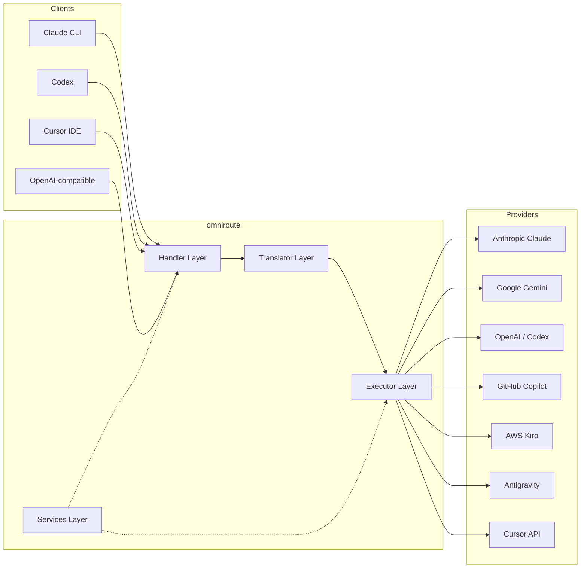

### Principiul de bază: Traducerea hub-and-spoke

Toată traducerea formatului trece prin **formatul OpenAI ca hub**:

```
Client Format → [OpenAI Hub] → Provider Format    (request)
Provider Format → [OpenAI Hub] → Client Format    (response)
```

Aceasta înseamnă că aveți nevoie doar de **N traducători** (unul pentru fiecare format) în loc de **N²** (fiecare pereche).

---

## 3. Structura proiectului

```
omniroute/
├── open-sse/                  ← Core proxy library (portable, framework-agnostic)
│   ├── index.js               ← Main entry point, exports everything
│   ├── config/                ← Configuration & constants
│   ├── executors/             ← Provider-specific request execution
│   ├── handlers/              ← Request handling orchestration
│   ├── services/              ← Business logic (auth, models, fallback, usage)
│   ├── translator/            ← Format translation engine
│   │   ├── request/           ← Request translators (8 files)
│   │   ├── response/          ← Response translators (7 files)
│   │   └── helpers/           ← Shared translation utilities (6 files)
│   └── utils/                 ← Utility functions
├── src/                       ← Application layer (Express/Worker runtime)
│   ├── app/                   ← Web UI, API routes, middleware
│   ├── lib/                   ← Database, auth, and shared library code
│   ├── mitm/                  ← Man-in-the-middle proxy utilities
│   ├── models/                ← Database models
│   ├── shared/                ← Shared utilities (wrappers around open-sse)
│   ├── sse/                   ← SSE endpoint handlers
│   └── store/                 ← State management
├── data/                      ← Runtime data (credentials, logs)
│   └── provider-credentials.json   (external credentials override, gitignored)
└── tester/                    ← Test utilities
```

---

## 4. Defalcare modul cu modul

### 4.1 Configurare (`open-sse/config/`)

**Sursa unică de adevăr** pentru configurația tuturor furnizorilor.

| Fișier                        | Scop                                                                                                                                                                                                                                                 |
| ----------------------------- | ---------------------------------------------------------------------------------------------------------------------------------------------------------------------------------------------------------------------------------------------------- |
| `constants.ts`                | `PROVIDERS` obiect cu adrese URL de bază, acreditări OAuth (implicite), anteturi și solicitări implicite de sistem pentru fiecare furnizor. De asemenea, definește `HTTP_STATUS`, `ERROR_TYPES`, `COOLDOWN_MS`, `BACKOFF_CONFIG` și `SKIP_PATTERNS`. |
| `credentialLoader.ts`         | Încarcă acreditările externe de la `data/provider-credentials.json` și le îmbină peste valorile implicite codificate în `PROVIDERS`. Păstrează secretele sub controlul sursei, menținând în același timp compatibilitatea cu versiunea inversă.      |
| `providerModels.ts`           | Registrul central de modele: hărți aliasuri furnizori → ID-uri model. Funcții precum `getModels()`, `getProviderByAlias()`.                                                                                                                          |
| `codexInstructions.ts`        | Instrucțiuni de sistem injectate în cererile Codex (constrângeri de editare, reguli sandbox, politici de aprobare).                                                                                                                                  |
| `defaultThinkingSignature.ts` | Semnături implicite „de gândire” pentru modelele Claude și Gemini.                                                                                                                                                                                   |
| `ollamaModels.ts`             | Definirea schemei pentru modelele locale Ollama (nume, dimensiune, familie, cuantizare).                                                                                                                                                             |

#### Flux de încărcare a acreditărilor

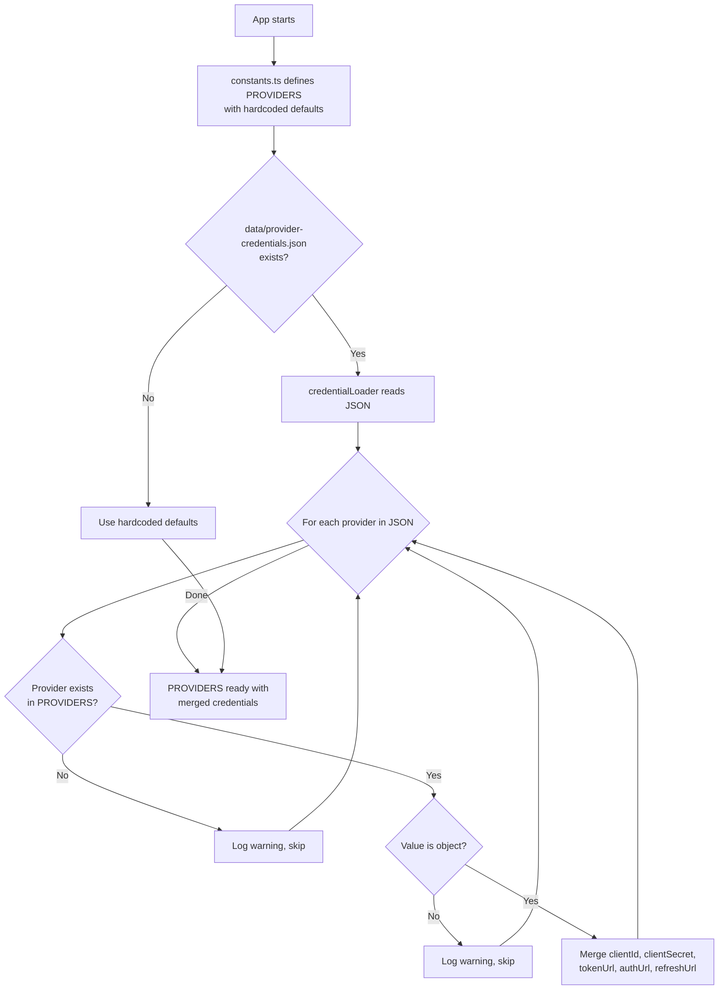

---

### 4.2 Executori (`open-sse/executors/`)

Executorii încapsulează **logica specifică furnizorului** utilizând **Modelul de strategie**. Fiecare executant anulează metodele de bază după cum este necesar.

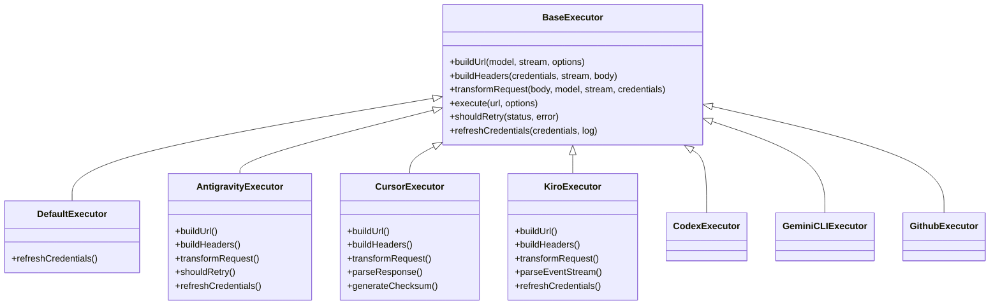

| Executant        | Furnizor                                   | Specializări cheie                                                                                                                                               |
| ---------------- | ------------------------------------------ | ---------------------------------------------------------------------------------------------------------------------------------------------------------------- |
| `base.ts`        | —                                          | Bază abstractă: crearea adresei URL, anteturi, logica reîncercării, reîmprospătarea acreditărilor                                                                |
| `default.ts`     | Claude, Gemeni, OpenAI, GLM, Kimi, MiniMax | Reîmprospătare generică a jetonului OAuth pentru furnizorii standard                                                                                             |
| `antigravity.ts` | Cod Google Cloud                           | Generarea ID-ului de proiect/sesiune, alternativă cu mai multe adrese URL, reîncercare personalizată de analiză din mesajele de eroare („resetare după 2h7m23s”) |
| `cursor.ts`      | Cursor IDE                                 | **Cel mai complex**: SHA-256 checksum auth, codificare cerere Protobuf, binar EventStream → analiza răspuns SSE                                                  |
| `codex.ts`       | OpenAI Codex                               | Injectează instrucțiuni de sistem, gestionează nivelurile de gândire, elimină parametrii neacceptați                                                             |
| `gemini-cli.ts`  | Google Gemini CLI                          | Creare URL personalizată (`streamGenerateContent`), reîmprospătare jeton OAuth Google                                                                            |
| `github.ts`      | GitHub Copilot                             | Sistem dual token (GitHub OAuth + token Copilot), imitarea antetului VSCode                                                                                      |
| `kiro.ts`        | AWS CodeWhisperer                          | Analiza binară AWS EventStream, cadre de evenimente AMZN, estimare token                                                                                         |
| `index.ts`       | —                                          | Fabrică: numele furnizorului de hărți → clasa executorului, cu fallback implicit                                                                                 |

---

### 4.3 Handlers (`open-sse/handlers/`)

**Stratul de orchestrare** — coordonează traducerea, execuția, transmiterea în flux și gestionarea erorilor.

| Fișier                | Scop                                                                                                                                                                                                                                                                     |
| --------------------- | ------------------------------------------------------------------------------------------------------------------------------------------------------------------------------------------------------------------------------------------------------------------------ |
| `chatCore.ts`         | **Orchestrator central** (~600 de linii). Se ocupă de ciclul de viață complet al cererii: detectarea formatului → traducerea → expedierea executorului → răspunsul în flux/non-streaming → reîmprospătarea simbolului → gestionarea erorilor → înregistrarea utilizării. |
| `responsesHandler.ts` | Adaptor pentru API-ul OpenAI Responses: convertește formatul de răspunsuri → Terminări de chat → trimite la `chatCore` → convertește SSE înapoi în formatul de răspunsuri.                                                                                               |
| `embeddings.ts`       | Managerul de generare de încorporare: rezolvă modelul de încorporare → furnizor, trimite către API-ul furnizorului, returnează un răspuns de încorporare compatibil OpenAI. Suportă peste 6 furnizori.                                                                   |
| `imageGeneration.ts`  | Managerul de generare a imaginii: rezolvă modelul de imagine → furnizor, acceptă modurile compatibile cu OpenAI, Gemini-image (antigravitație) și modurile de rezervă (Nebius). Returnează imagini base64 sau URL.                                                       |

#### Ciclul de viață al cererii (chatCore.ts)

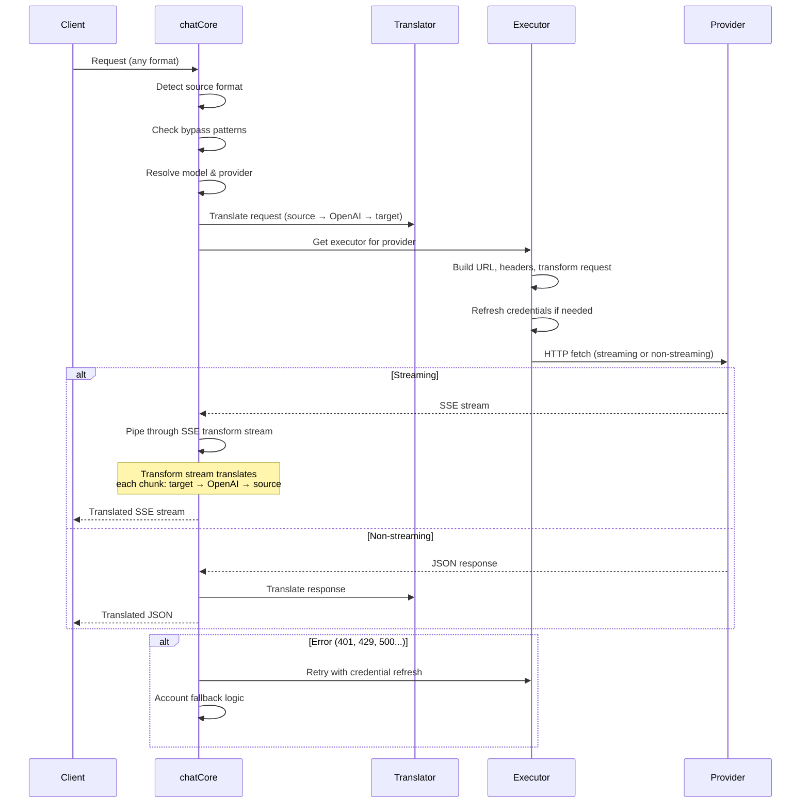

---

### 4.4 Servicii (`open-sse/services/`)

Logica de afaceri care sprijină manipulatorii și executanții.

| Fișier               | Scop                                                                                                                                                                                                                                                                                                                                                                          |
| -------------------- | ----------------------------------------------------------------------------------------------------------------------------------------------------------------------------------------------------------------------------------------------------------------------------------------------------------------------------------------------------------------------------- |
| `provider.ts`        | **Detecție format** (`detectFormat`): analizează structura corpului cererii pentru a identifica formatele Claude/OpenAI/Gemini/Antigravity/Responses (include `max_tokens` euristica pentru Claude). De asemenea: construirea URL, construirea antetului, normalizarea configurației gândirii. Acceptă furnizorii dinamici `openai-compatible-*` și `anthropic-compatible-*`. |
| `model.ts`           | Analizarea șirurilor de model (`claude/model-name` → `{provider: "claude", model: "model-name"}`), rezoluția aliasului cu detectarea coliziunilor, dezinfectarea intrării (respinge caracterele de parcurgere/control al căii) și rezoluția informațiilor despre model cu suport pentru obținerea de alias asincron.                                                          |
| `accountFallback.ts` | Gestionarea limitelor de rată: retragere exponențială (1s → 2s → 4s → max 2 min), gestionarea timpului de răcire a contului, clasificarea erorilor (care declanșează erorile de rezervă vs. nu).                                                                                                                                                                              |
| `tokenRefresh.ts`    | Actualizare jeton OAuth pentru **fiecare furnizor**: Google (Gemini, Antigravity), Claude, Codex, Qwen, iFlow, GitHub (OAuth + Copilot dual-token), Kiro (AWS SSO OIDC + Social Auth). Include memoria cache de deduplicare a promisiunii în timpul zborului și reîncercarea cu backoff exponențial.                                                                          |
| `combo.ts`           | **Modele combinate**: lanțuri de modele de rezervă. Dacă modelul A eșuează cu o eroare eligibilă pentru rezervă, încercați modelul B, apoi C etc. Returnează codurile reale de stare din amonte.                                                                                                                                                                              |
| `usage.ts`           | Preia datele de cotă/utilizare de la API-urile furnizorului (cote GitHub Copilot, cote model antigravitație, limite ale ratei Codex, defalcări de utilizare Kiro, setări Claude).                                                                                                                                                                                             |
| `accountSelector.ts` | Selecția inteligentă a contului cu algoritm de punctare: ia în considerare prioritatea, starea de sănătate, poziția round-robin și starea de cooldown pentru a alege contul optim pentru fiecare solicitare.                                                                                                                                                                  |
| `contextManager.ts`  | Gestionarea ciclului de viață a contextului solicitării: creează și urmărește obiecte de context per-cerere cu metadate (ID-ul cererii, marcaje temporale, informații despre furnizor) pentru depanare și înregistrare.                                                                                                                                                       |
| `ipFilter.ts`        | Controlul accesului bazat pe IP: acceptă modurile liste de permise și liste de blocare. Validează IP-ul clientului în raport cu regulile configurate înainte de a procesa solicitările API.                                                                                                                                                                                   |
| `sessionManager.ts`  | Urmărirea sesiunilor cu amprenta clientului: urmărește sesiunile active folosind identificatori de client hashing, monitorizează numărul de solicitări și oferă valori ale sesiunii.                                                                                                                                                                                          |
| `signatureCache.ts`  | Cache de deduplicare bazată pe semnături de solicitare: previne cererile duplicate prin memorarea în cache a semnăturilor de cereri recente și returnarea răspunsurilor memorate în cache pentru cereri identice într-o fereastră de timp.                                                                                                                                    |
| `systemPrompt.ts`    | Injectarea globală a promptului de sistem: adaugă sau adaugă un prompt de sistem configurabil la toate solicitările, cu gestionarea compatibilității pentru fiecare furnizor.                                                                                                                                                                                                 |
| `thinkingBudget.ts`  | Gestionarea bugetului token-ului de raționament: acceptă modurile passthrough, automate (configurație de gândire strip), personalizate (buget fix) și adaptive (scalate la complexitate) pentru controlul simbolurilor de gândire/raționament.                                                                                                                                |
| `wildcardRouter.ts`  | Dirijarea modelului cu caractere wildcard: rezolvă modelele wildcard (de exemplu, `*/claude-*`) în perechi concrete furnizor/model în funcție de disponibilitate și prioritate.                                                                                                                                                                                               |

#### Deduplicare de reîmprospătare a simbolului

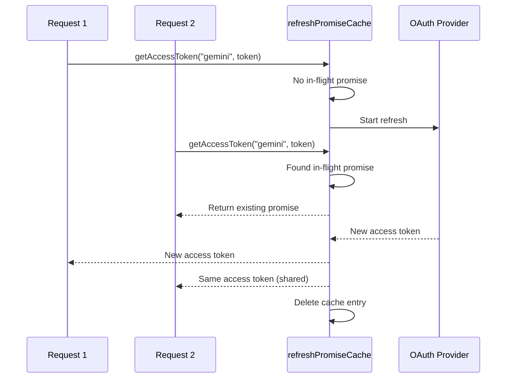

#### Mașină de stat de rezervă a contului

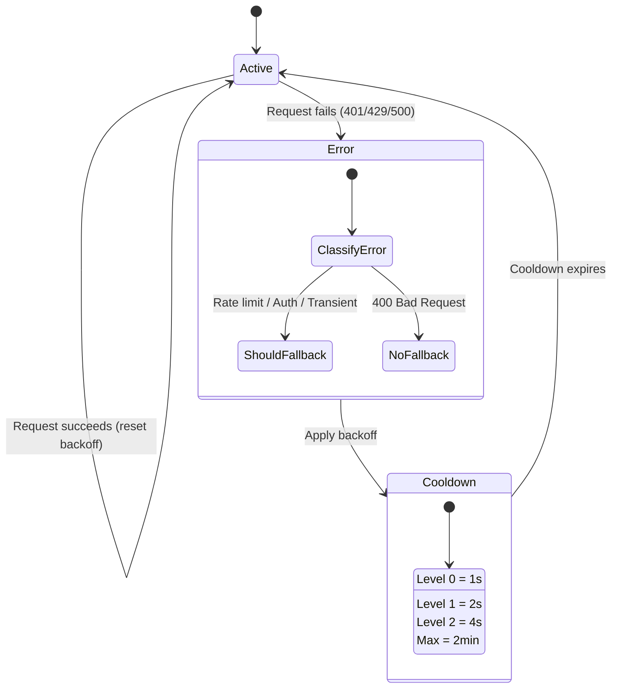

#### Lanț de modele combinate

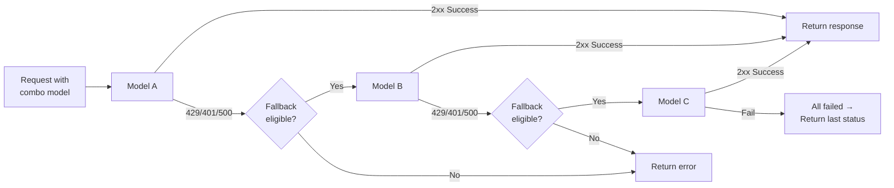

---

### 4.5 Traducător (`open-sse/translator/`)

**Motorul de traducere a formatului** utilizând un sistem de pluginuri cu auto-înregistrare.

#### Arhitectură

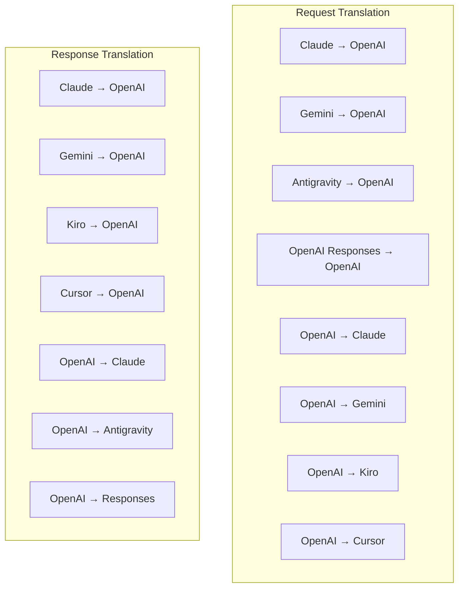

| Director     | Fișiere       | Descriere                                                                                                                                                                                                                                                                                          |
| ------------ | ------------- | -------------------------------------------------------------------------------------------------------------------------------------------------------------------------------------------------------------------------------------------------------------------------------------------------- |
| `request/`   | 8 traducători | Convertiți corpurile de solicitare între formate. Fiecare fișier se auto-înregistrează prin `register(from, to, fn)` la import.                                                                                                                                                                    |
| `response/`  | 7 traducători | Conversia fragmentelor de răspuns în flux între formate. Se ocupă de tipurile de evenimente SSE, blocurile de gândire, apelurile de instrumente.                                                                                                                                                   |
| `helpers/`   | 6 ajutoare    | Utilitare partajate: `claudeHelper` (extracția promptului sistemului, configurația gândirii), `geminiHelper` (matarea părților/conținutului), `openaiHelper` (filtrarea formatului), `toolCallHelper` (generarea ID-ului, injectarea răspunsului TOKEN_8 lipsă, \_\_8 NI_EN) `responsesApiHelper`. |
| `index.ts`   | —             | Motor de traducere: `translateRequest()`, `translateResponse()`, management de stat, registru.                                                                                                                                                                                                     |
| `formats.ts` | —             | Formatare constante: `OPENAI`, `CLAUDE`, `GEMINI`, `ANTIGRAVITY`, `KIRO`, , `CURSOR`,                                                                                                                                                                                                              |

#### Design cheie: pluginuri cu auto-înregistrare

```javascript
// Each translator file calls register() on import:
import { register } from "../index.js";
register("claude", "openai", translateClaudeToOpenAI);

// The index.js imports all translator files, triggering registration:
import "./request/claude-to-openai.js"; // ← self-registers
```

---

### 4.6 Utilități (`open-sse/utils/`)

| Fișier             | Scop                                                                                                                                                                                                                                                                                                                             |
| ------------------ | -------------------------------------------------------------------------------------------------------------------------------------------------------------------------------------------------------------------------------------------------------------------------------------------------------------------------------- |
| `error.ts`         | Crearea răspunsului la erori (format compatibil cu OpenAI), analizarea erorilor în amonte, extragerea timpului de reîncercare antigravitație din mesajele de eroare, transmiterea erorilor SSE.                                                                                                                                  |
| `stream.ts`        | **SSE Transform Stream** — canalul de streaming de bază. Două moduri: `TRANSLATE` (traducere în format complet) și `PASSTHROUGH` (normalizare + extragere utilizare). Se ocupă de stocarea în tampon, estimarea utilizării, urmărirea duratei conținutului. Instanțele de codificator/decodor per-stream evită starea partajată. |
| `streamHelpers.ts` | Utilitare SSE de nivel scăzut: `parseSSELine` (tolerant la spații albe), `hasValuableContent` (filtrează bucăți goale pentru OpenAI/Claude/Gemini), `fixInvalidId`, SSE_103_ware) `perf_metrics` curățare).                                                                                                                      |
| `usageTracking.ts` | Extragerea utilizării jetoanelor din orice format (Claude/OpenAI/Gemini/Responses), estimare cu rapoarte separate pentru instrumente/mesaj, adăugare de buffer (marja de siguranță de 2000 de jetoane), filtrare câmp specific formatului, înregistrare în consolă cu culori ANSI.                                               |
| `requestLogger.ts` | Înregistrarea cererilor pe bază de fișier (înregistrare prin `ENABLE_REQUEST_LOGS=true`). Creează foldere de sesiune cu fișiere numerotate: `1_req_client.json` → `7_res_client.txt`. Toate I/O sunt asincrone (foc și uitare). Mască anteturile sensibile.                                                                      |
| `bypassHandler.ts` | Interceptează modele specifice din Claude CLI (extragere titlu, încălzire, numărare) și returnează răspunsuri false fără a apela niciun furnizor. Acceptă atât streaming, cât și non-streaming. Limitat intenționat la domeniul Claude CLI.                                                                                      |
| `networkProxy.ts`  | Rezolvă URL-ul proxy de ieșire pentru un anumit furnizor cu prioritate: configurație specifică furnizorului → configurație globală → variabile de mediu (`HTTPS_PROXY`/`HTTP_PROXY`/`ALL_PROXY`). Acceptă excluderile `NO_PROXY`. Memorează în cache configurația pentru 30 de secunde.                                          |

#### SSE Streaming Pipeline

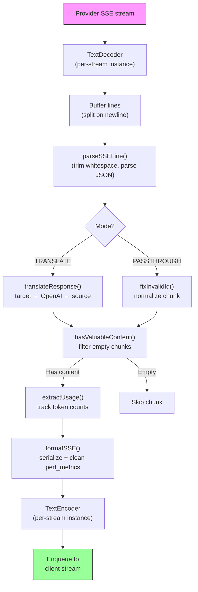

#### Solicitați structura sesiunii de înregistrare

```
logs/
└── claude_gemini_claude-sonnet_20260208_143045/
    ├── 1_req_client.json      ← Raw client request
    ├── 2_req_source.json      ← After initial conversion
    ├── 3_req_openai.json      ← OpenAI intermediate format
    ├── 4_req_target.json      ← Final target format
    ├── 5_res_provider.txt     ← Provider SSE chunks (streaming)
    ├── 5_res_provider.json    ← Provider response (non-streaming)
    ├── 6_res_openai.txt       ← OpenAI intermediate chunks
    ├── 7_res_client.txt       ← Client-facing SSE chunks
    └── 6_error.json           ← Error details (if any)
```

---

### 4.7 Stratul de aplicație (`src/`)

| Director      | Scop                                                                                    |
| ------------- | --------------------------------------------------------------------------------------- |
| `src/app/`    | Interfață de utilizare web, rute API, middleware Express, handlere de apel invers OAuth |
| `src/lib/`    | Acces la baza de date (`localDb.ts`, `usageDb.ts`), autentificare, partajat             |
| `src/mitm/`   | Utilități proxy Man-in-the-middle pentru interceptarea traficului furnizorului          |
| `src/models/` | Definițiile modelului bazei de date                                                     |
| `src/shared/` | Învelișuri în jurul funcțiilor open-sse (furnizor, flux, eroare etc.)                   |
| `src/sse/`    | Managerii de puncte finale SSE care conectează biblioteca open-sse la rutele Express    |
| `src/store/`  | Managementul stării aplicației                                                          |

#### Rute API notabile

| Traseu                                        | Metode          | Scop                                                                                                  |
| --------------------------------------------- | --------------- | ----------------------------------------------------------------------------------------------------- |
| `/api/provider-models`                        | GET/POST/DELETE | CRUD pentru modele personalizate per furnizor                                                         |
| `/api/models/catalog`                         | GET             | Catalog agregat al tuturor modelelor (chat, încorporare, imagine, personalizat) grupate după furnizor |
| `/api/settings/proxy`                         | GET/PUT/DELETE  | Configurație ierarhică de ieșire proxy (`global/providers/combos/keys`)                               |
| `/api/settings/proxy/test`                    | POST            | Validează conectivitatea proxy și returnează IP/latența publică                                       |
| `/v1/providers/[provider]/chat/completions`   | POST            | Finalizări de chat dedicate pentru fiecare furnizor cu validare a modelului                           |
| `/v1/providers/[provider]/embeddings`         | POST            | Înglobări dedicate pentru fiecare furnizor cu validare a modelului                                    |
| `/v1/providers/[provider]/images/generations` | POST            | Generare de imagini dedicată pentru fiecare furnizor cu validarea modelului                           |
| `/api/settings/ip-filter`                     | GET/PUT         | Gestionarea listei de permise/liste de blocare IP                                                     |
| `/api/settings/thinking-budget`               | GET/PUT         | Configurarea bugetului simbolului de raționament (passthrough/auto/custom/adaptive)                   |
| `/api/settings/system-prompt`                 | GET/PUT         | Sistem global de injectare promptă pentru toate solicitările                                          |
| `/api/sessions`                               | GET             | Urmărirea sesiunii active și valorile                                                                 |
| `/api/rate-limits`                            | GET             | Starea limitei ratei per cont                                                                         |

---

## 5. Modele de design cheie

### 5.1 Traducere hub-and-spoke

Toate formatele se traduc prin **formatul OpenAI ca hub**. Adăugarea unui furnizor nou necesită doar scrierea **o pereche** de traducători (la/de la OpenAI), nu N perechi.

### 5.2 Modelul Strategiei Executorului

Fiecare furnizor are o clasă de executor dedicată care moștenește de la `BaseExecutor`. Fabrica din `executors/index.ts` îl selectează pe cel potrivit în timpul rulării.

### 5.3 Sistem de pluginuri cu auto-înregistrare

Modulele de traducător se înregistrează la import prin `register()`. Adăugarea unui nou traducător înseamnă doar crearea unui fișier și importarea acestuia.

### 5.4 Retragerea contului cu retragere exponențială

Atunci când un furnizor returnează 429/401/500, sistemul poate trece la următorul cont, aplicând perioade de răcire exponențiale (1s → 2s → 4s → max 2min).

### 5.5 Lanțuri de modele combinate

Un „combo” grupează mai multe șiruri `provider/model`. Dacă primul eșuează, reveniți automat la următorul.

### 5.6 Traducere în flux cu stat

Traducerea răspunsurilor menține starea în bucățile SSE (urmărirea blocurilor de gândire, acumularea apelurilor de instrumente, indexarea blocurilor de conținut) prin mecanismul `initState()`.

### 5.7 Utilizare tampon de siguranță

Un buffer de 2000 de jetoane este adăugat la utilizarea raportată pentru a preveni clienții să atingă limitele ferestrei de context din cauza supraîncărcării de la solicitările de sistem și traducerea formatului.

---

## 6. Formate acceptate

| Format                    | Direcție      | Identificator      |
| ------------------------- | ------------- | ------------------ |
| Finalizări de chat OpenAI | sursa + tinta | `openai`           |
| OpenAI Responses API      | sursa + tinta | `openai-responses` |
| Claude antropic           | sursa + tinta | `claude`           |
| Google Gemeni             | sursa + tinta | `gemini`           |
| Google Gemini CLI         | doar țintă    | `gemini-cli`       |
| Antigravitație            | sursa + tinta | `antigravity`      |
| AWS Kiro                  | doar țintă    | `kiro`             |
| Cursor                    | doar țintă    | `cursor`           |

---

## 7. Furnizori acceptați

| Furnizor                 | Metoda de autentificare       | Executant      | Note cheie                                                              |
| ------------------------ | ----------------------------- | -------------- | ----------------------------------------------------------------------- |
| Claude antropic          | Cheia API sau OAuth           | Implicit       | Utilizează antetul `x-api-key`                                          |
| Google Gemeni            | Cheia API sau OAuth           | Implicit       | Utilizează antetul `x-goog-api-key`                                     |
| Google Gemini CLI        | OAuth                         | GeminiCLI      | Utilizează punctul final `streamGenerateContent`                        |
| Antigravitație           | OAuth                         | Antigravitație | Alternativ cu mai multe adrese URL, reîncercare personalizată analizare |
| OpenAI                   | Cheia API                     | Implicit       | Autoritatea purtătorului standard                                       |
| Codex                    | OAuth                         | Codex          | Injectează instrucțiuni de sistem, gestionează gândirea                 |
| GitHub Copilot           | OAuth + Jeton Copilot         | Github         | Jeton dublu, imitație antet VSCode                                      |
| Kiro (AWS)               | AWS SSO OIDC sau Social       | Kiro           | Analiza binar EventStream                                               |
| Cursor IDE               | Autentificare sumă de control | Cursor         | Codificare Protobuf, sume de control SHA-256                            |
| Qwen                     | OAuth                         | Implicit       | Autentificare standard                                                  |
| iFlow                    | OAuth (de bază + purtător)    | Implicit       | Antet de autentificare dublă                                            |
| OpenRouter               | Cheia API                     | Implicit       | Autoritatea purtătorului standard                                       |
| GLM, Kimi, MiniMax       | Cheia API                     | Implicit       | Compatibil cu Claude, utilizați `x-api-key`                             |
| `openai-compatible-*`    | Cheia API                     | Implicit       | Dinamic: orice punct final compatibil OpenAI                            |
| `anthropic-compatible-*` | Cheia API                     | Implicit       | Dinamic: orice punct final compatibil cu Claude                         |

---

## 8. Rezumatul fluxului de date

### Solicitare de streaming

```mermaid
flowchart LR
    A["Client"] --> B["detectFormat()"]
    B --> C["translateRequest()\nsource → OpenAI → target"]
    C --> D["Executor\nbuildUrl + buildHeaders"]
    D --> E["fetch(providerURL)"]
    E --> F["createSSEStream()\nTRANSLATE mode"]
    F --> G["parseSSELine()"]
    G --> H["translateResponse()\ntarget → OpenAI → source"]
    H --> I["extractUsage()\n+ addBuffer"]
    I --> J["formatSSE()"]
    J --> K["Client receives\ntranslated SSE"]
    K --> L["logUsage()\nsaveRequestUsage()"]
```

### Solicitare non-streaming

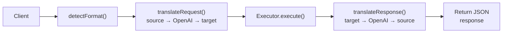

### Bypass Flow (Claude CLI)

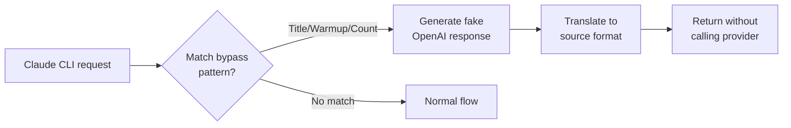
