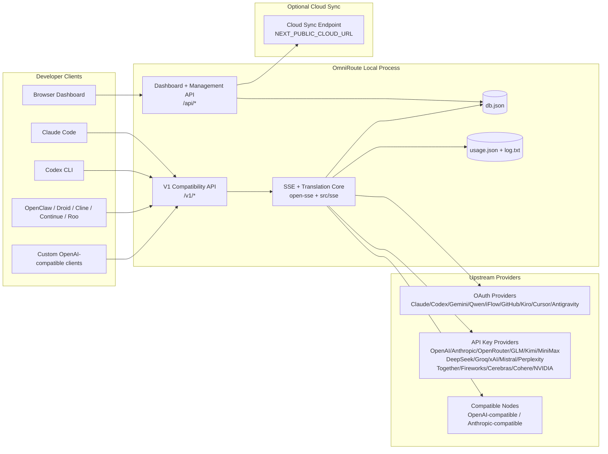
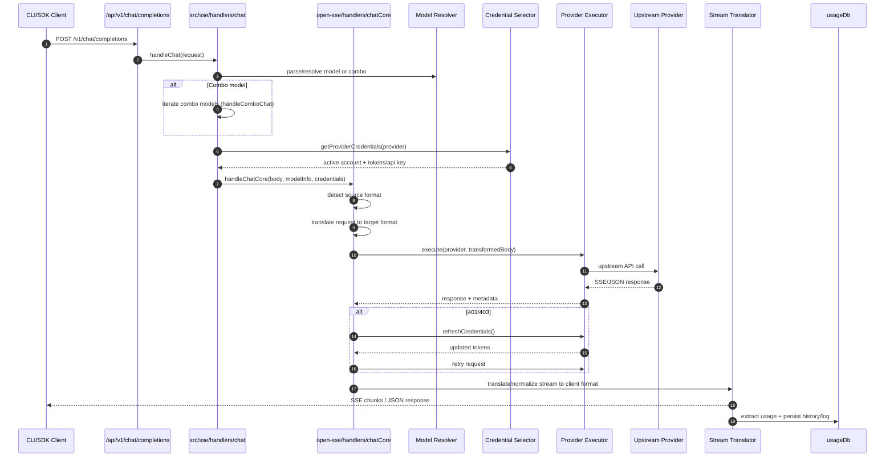
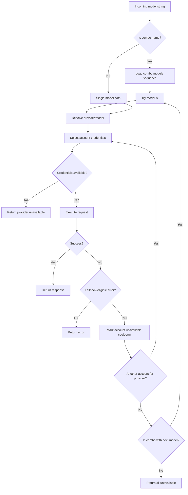
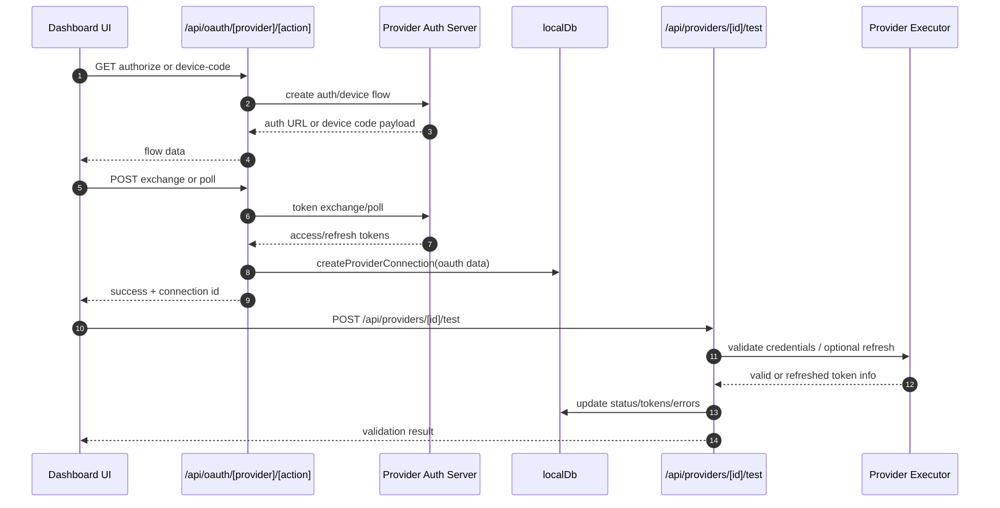
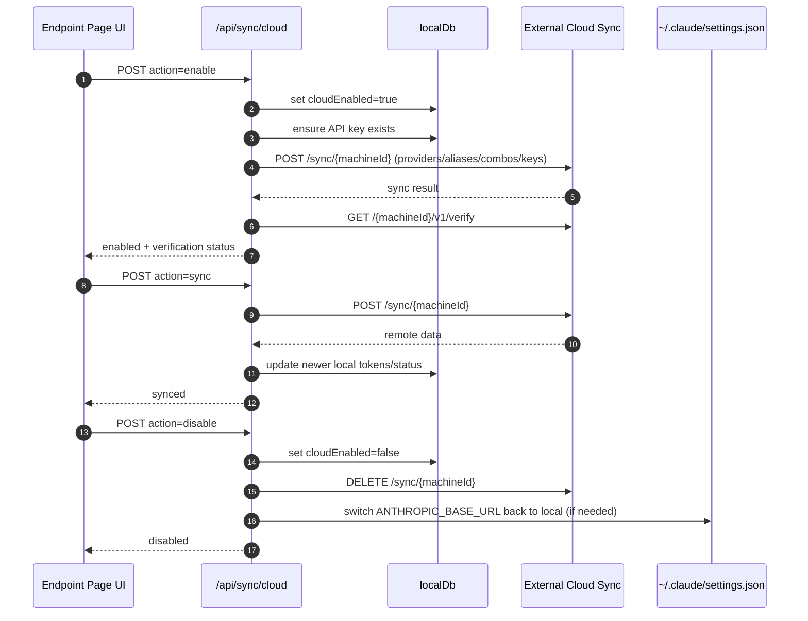
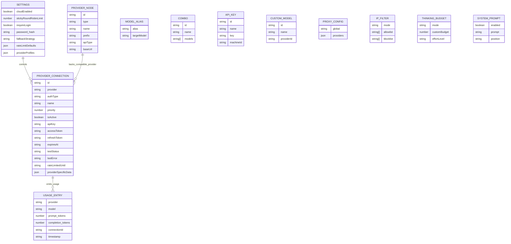
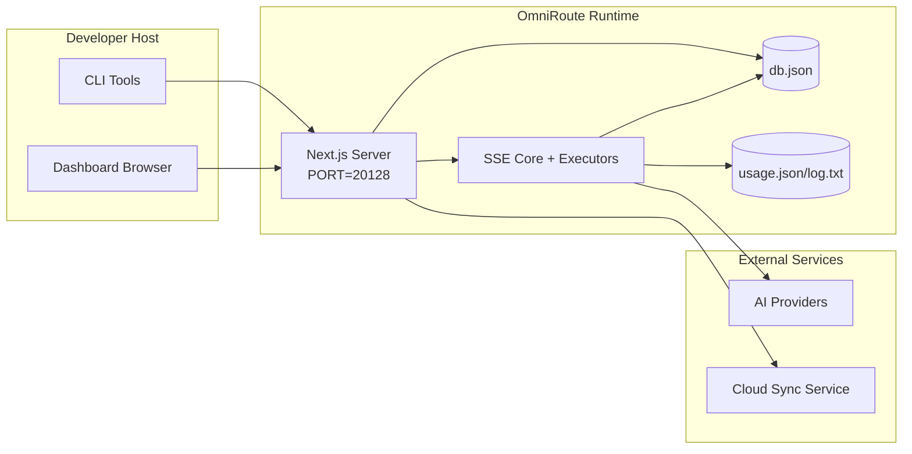

# Архитектура OmniRoute

🌐 **Languages:** 🇺🇸 [English](../../ARCHITECTURE.md) | 🇧🇷 [Português (Brasil)](../pt-BR/ARCHITECTURE.md) | 🇪🇸 [Español](../es/ARCHITECTURE.md) | 🇫🇷 [Français](../fr/ARCHITECTURE.md) | 🇮🇹 [Italiano](../it/ARCHITECTURE.md) | 🇷🇺 [Русский](../ru/ARCHITECTURE.md) | 🇨🇳 [中文 (简体)](../zh-CN/ARCHITECTURE.md) | 🇩🇪 [Deutsch](../de/ARCHITECTURE.md) | 🇮🇳 [हिन्दी](../in/ARCHITECTURE.md) | 🇹🇭 [ไทย](../th/ARCHITECTURE.md) | 🇺🇦 [Українська](../uk-UA/ARCHITECTURE.md) | 🇸🇦 [العربية](../ar/ARCHITECTURE.md) | 🇯🇵 [日本語](../ja/ARCHITECTURE.md) | 🇻🇳 [Tiếng Việt](../vi/ARCHITECTURE.md) | 🇧🇬 [Български](../bg/ARCHITECTURE.md) | 🇩🇰 [Dansk](../da/ARCHITECTURE.md) | 🇫🇮 [Suomi](../fi/ARCHITECTURE.md) | 🇮🇱 [עברית](../he/ARCHITECTURE.md) | 🇭🇺 [Magyar](../hu/ARCHITECTURE.md) | 🇮🇩 [Bahasa Indonesia](../id/ARCHITECTURE.md) | 🇰🇷 [한국어](../ko/ARCHITECTURE.md) | 🇲🇾 [Bahasa Melayu](../ms/ARCHITECTURE.md) | 🇳🇱 [Nederlands](../nl/ARCHITECTURE.md) | 🇳🇴 [Norsk](../no/ARCHITECTURE.md) | 🇵🇹 [Português (Portugal)](../pt/ARCHITECTURE.md) | 🇷🇴 [Română](../ro/ARCHITECTURE.md) | 🇵🇱 [Polski](../pl/ARCHITECTURE.md) | 🇸🇰 [Slovenčina](../sk/ARCHITECTURE.md) | 🇸🇪 [Svenska](../sv/ARCHITECTURE.md) | 🇵🇭 [Filipino](../phi/ARCHITECTURE.md)

_Последнее обновление: 18 февраля 2026 г._

## Резюме

OmniRoute — это локальный шлюз и панель маршрутизации AI, созданные на основе Next.js.
Он предоставляет единую конечную точку, совместимую с OpenAI (`/v1/*`), и маршрутизирует трафик между несколькими вышестоящими поставщиками с трансляцией, резервным копированием, обновлением токена и отслеживанием использования.

Основные возможности:

- OpenAI-совместимая поверхность API для CLI/инструментов (28 поставщиков)
- Трансляция запроса/ответа в форматах провайдера.
- Резервный вариант комбо-модели (последовательность из нескольких моделей)
- Резервный вариант на уровне учетной записи (несколько учетных записей для каждого провайдера)
- Управление подключением к поставщику OAuth + API-ключей
- Генерация встраивания через `/v1/embeddings` (6 провайдеров, 9 моделей)
- Генерация изображения через `/v1/images/generations` (4 провайдера, 9 моделей)
- Подумайте о разборе тегов (`<think>...</think>`) для моделей рассуждений.
- Очистка ответов для строгой совместимости OpenAI SDK.
- Нормализация ролей (разработчик→система, система→пользователь) для совместимости между поставщиками.
- Преобразование структурированного вывода (json_schema → Gemini responseSchema)
- Локальное сохранение поставщиков, ключей, псевдонимов, комбинаций, настроек, цен.
- Отслеживание использования/расходов и регистрация запросов
- Дополнительная облачная синхронизация для синхронизации нескольких устройств/состояний.
- Список разрешенных/блокированных IP-адресов для контроля доступа к API.
- Продуманное управление бюджетом (сквозное/автоматическое/настраиваемое/адаптивное)
- Оперативное внедрение глобальной системы
- Отслеживание сеансов и снятие отпечатков пальцев
- Расширенное ограничение скорости для каждой учетной записи с помощью профилей для конкретного поставщика.
- Схема автоматического выключателя для устойчивости поставщика
- Анти-громовая защита стада с блокировкой мьютекса
- Кэш дедупликации запросов на основе сигнатур.
- Уровень домена: доступность модели, правила затрат, резервная политика, политика блокировки.
- Сохранение состояния домена (кэш сквозной записи SQLite для резервных копий, бюджетов, блокировок, автоматических выключателей)
- Механизм политики для централизованной оценки запросов (блокировка → бюджет → резервный вариант)
- Запрос телеметрии с агрегацией задержек p50/p95/p99.
- Идентификатор корреляции (X-Request-Id) для сквозной трассировки.
- Ведение журнала аудита соответствия с возможностью отказа для каждого ключа API.
- Система оценки для обеспечения качества LLM
- Панель управления устойчивостью пользовательского интерфейса с отображением состояния автоматического выключателя в реальном времени.
- Модульные поставщики OAuth (12 отдельных модулей под `src/lib/oauth/providers/`)

Основная модель времени выполнения:

- Маршруты приложений Next.js в `src/app/api/*` реализуют как API панели мониторинга, так и API совместимости.
- Общее ядро SSE/маршрутизации в `src/sse/*` + `open-sse/*` управляет выполнением поставщика, трансляцией, потоковой передачей, резервным копированием и использованием.

## Область применения и границы

### В объеме

- Среда выполнения локального шлюза
- API-интерфейсы управления информационной панелью
- Аутентификация поставщика и обновление токена
- Запросить перевод и потоковую передачу SSE
- Локальное состояние + постоянство использования
- Дополнительная оркестровка облачной синхронизации.

### Выходит за рамки

- Реализация облачного сервиса на базе `NEXT_PUBLIC_CLOUD_URL`.
- Соглашение об уровне обслуживания поставщика/плоскость управления вне локального процесса.
- Сами внешние двоичные файлы CLI (Claude CLI, Codex CLI и т. д.)

## Системный контекст высокого уровня



## Основные компоненты среды выполнения

## 1) API и уровень маршрутизации (маршруты приложений Next.js)

Основные каталоги:

- `src/app/api/v1/*` и `src/app/api/v1beta/*` для API совместимости.
- `src/app/api/*` для API управления/конфигурации.
- Далее перезаписывает `next.config.mjs` сопоставляет `/v1/*` с `/api/v1/*`.

Важные пути совместимости:

- `src/app/api/v1/chat/completions/route.ts`
- `src/app/api/v1/messages/route.ts`
- `src/app/api/v1/responses/route.ts`
- `src/app/api/v1/models/route.ts` — включает пользовательские модели с `custom: true`.
- `src/app/api/v1/embeddings/route.ts` — генерация встраивания (6 провайдеров)
- `src/app/api/v1/images/generations/route.ts` — генерация изображений (4+ провайдера, включая Антигравитация/Небиус)
- `src/app/api/v1/messages/count_tokens/route.ts`
- `src/app/api/v1/providers/[provider]/chat/completions/route.ts` — отдельный чат для каждого провайдера
- `src/app/api/v1/providers/[provider]/embeddings/route.ts` — специальные внедрения для каждого провайдера.
- `src/app/api/v1/providers/[provider]/images/generations/route.ts` — отдельные изображения для каждого поставщика.
- `src/app/api/v1beta/models/route.ts`
- `src/app/api/v1beta/models/[...path]/route.ts`

Домены управления:

- Аутентификация/настройки: `src/app/api/auth/*`, `src/app/api/settings/*`.
- Провайдеры/соединения: `src/app/api/providers*`
- Узлы поставщика: `src/app/api/provider-nodes*`
- Пользовательские модели: `src/app/api/provider-models` (GET/POST/DELETE)
- Каталог моделей: `src/app/api/models/catalog` (GET)
- Конфигурация прокси: `src/app/api/settings/proxy` (GET/PUT/DELETE) + `src/app/api/settings/proxy/test` (POST)
- OAuth: `src/app/api/oauth/*`
- Ключи/псевдонимы/комбо/цены: `src/app/api/keys*`, `src/app/api/models/alias`, `src/app/api/combos*`, `src/app/api/pricing`.
- Использование: `src/app/api/usage/*`
- Синхронизация/облако: `src/app/api/sync/*`, `src/app/api/cloud/*`
- Помощники по инструментам CLI: `src/app/api/cli-tools/*`.
- IP-фильтр: `src/app/api/settings/ip-filter` (GET/PUT)
- Мысленный бюджет: `src/app/api/settings/thinking-budget` (GET/PUT)
- Системное приглашение: `src/app/api/settings/system-prompt` (GET/PUT)
- Сессии: `src/app/api/sessions` (GET)
- Ограничения скорости: `src/app/api/rate-limits` (GET)
- Устойчивость: `src/app/api/resilience` (GET/PATCH) — профили провайдера, автоматический выключатель, состояние ограничения скорости.
- Сброс устойчивости: `src/app/api/resilience/reset` (POST) — сброс выключателей + кулдаунов.
- Статистика кэша: `src/app/api/cache/stats` (GET/DELETE)
- Доступность модели: `src/app/api/models/availability` (GET/POST)
- Телеметрия: `src/app/api/telemetry/summary` (GET)
- Бюджет: `src/app/api/usage/budget` (GET/POST)
- Резервные цепочки: `src/app/api/fallback/chains` (GET/POST/DELETE)
- Аудит соответствия: `src/app/api/compliance/audit-log` (GET)
- Оценки: `src/app/api/evals` (GET/POST), `src/app/api/evals/[suiteId]` (GET)
- Политики: `src/app/api/policies` (GET/POST)

## 2) SSE + ядро трансляции

Модули основного потока:

- Запись: `src/sse/handlers/chat.ts`
- Базовая оркестровка: `open-sse/handlers/chatCore.ts`.
- Адаптеры выполнения поставщика: `open-sse/executors/*`
- Конфигурация обнаружения формата/поставщика: `open-sse/services/provider.ts`
- Анализ/решение модели: `src/sse/services/model.ts`, `open-sse/services/model.ts`.
- Логика возврата учетной записи: `open-sse/services/accountFallback.ts`.
- Реестр переводов: `open-sse/translator/index.ts`
- Преобразования потока: `open-sse/utils/stream.ts`, `open-sse/utils/streamHandler.ts`.
- Извлечение/нормализация использования: `open-sse/utils/usageTracking.ts`
- Подумайте о парсере тегов: `open-sse/utils/thinkTagParser.ts`.
- Обработчик внедрения: `open-sse/handlers/embeddings.ts`
- Реестр поставщиков встраивания: `open-sse/config/embeddingRegistry.ts`.
- Обработчик генерации изображения: `open-sse/handlers/imageGeneration.ts`
- Реестр поставщика изображений: `open-sse/config/imageRegistry.ts`.
- Обеззараживание ответа: `open-sse/handlers/responseSanitizer.ts`.
- Нормализация ролей: `open-sse/services/roleNormalizer.ts`

Сервисы (бизнес-логика):

- Выбор/оценка аккаунта: `open-sse/services/accountSelector.ts`
- Управление жизненным циклом контекста: `open-sse/services/contextManager.ts`.
- Применение IP-фильтра: `open-sse/services/ipFilter.ts`.
- Отслеживание сеанса: `open-sse/services/sessionManager.ts`
- Запрос дедупликации: `open-sse/services/signatureCache.ts`
- Подсказка системы: `open-sse/services/systemPrompt.ts`
- Мышление управления бюджетом: `open-sse/services/thinkingBudget.ts`
- Маршрутизация модели с подстановочными знаками: `open-sse/services/wildcardRouter.ts`.
- Управление лимитом скорости: `open-sse/services/rateLimitManager.ts`
- Автоматический выключатель: `open-sse/services/circuitBreaker.ts`

Модули доменного уровня:

- Доступность модели: `src/lib/domain/modelAvailability.ts`
  – Правила/бюджеты затрат: `src/lib/domain/costRules.ts`.
  – Резервная политика: `src/lib/domain/fallbackPolicy.ts`.
- Комбинированный преобразователь: `src/lib/domain/comboResolver.ts`
- Политика блокировки: `src/lib/domain/lockoutPolicy.ts`.
- Механизм политики: `src/domain/policyEngine.ts` — централизованная блокировка → бюджет → резервная оценка.
- Каталог кодов ошибок: `src/lib/domain/errorCodes.ts`
- Идентификатор запроса: `src/lib/domain/requestId.ts`
  – Тайм-аут получения: `src/lib/domain/fetchTimeout.ts`
- Запрос телеметрии: `src/lib/domain/requestTelemetry.ts`
- Соответствие/аудит: `src/lib/domain/compliance/index.ts`
- Бегун оценки: `src/lib/domain/evalRunner.ts`
- Сохранение состояния домена: `src/lib/db/domainState.ts` — SQLite CRUD для резервных цепочек, бюджетов, истории затрат, состояния блокировки, автоматических выключателей.

Модули провайдера OAuth (12 отдельных файлов под `src/lib/oauth/providers/`):

- Индекс реестра: `src/lib/oauth/providers/index.ts`
- Индивидуальные поставщики: `claude.ts`, `codex.ts`, `gemini.ts`, `antigravity.ts`, `iflow.ts`, `qwen.ts`, `kimi-coding.ts`, `github.ts`, `kiro.ts`, `cursor.ts`, `kilocode.ts`, `cline.ts`
  — Тонкая оболочка: `src/lib/oauth/providers.ts` — реэкспорт из отдельных модулей.

## 3) Уровень сохранения

Первичное состояние БД:

- `src/lib/localDb.ts`
- файл: `${DATA_DIR}/db.json` (или `$XDG_CONFIG_HOME/omniroute/db.json`, если установлен, иначе `~/.omniroute/db.json`)
- сущности: поставщики Connections, поставщикNodes, modelAliases, комбо, apiKeys, настройки, цены, **customModels**, **proxyConfig**, **ipFilter**, **thinkingBudget**, **systemPrompt**

Использование БД:

- `src/lib/usageDb.ts`
- файлы: `${DATA_DIR}/usage.json`, `${DATA_DIR}/log.txt`, `${DATA_DIR}/call_logs/`
- следует той же политике базового каталога, что и `localDb` (`DATA_DIR`, затем `XDG_CONFIG_HOME/omniroute`, если установлено)
- разложены на целевые подмодули: `migrations.ts`, `usageHistory.ts`, `costCalculator.ts`, `usageStats.ts`, `callLogs.ts`

БД состояний домена (SQLite):

- `src/lib/db/domainState.ts` — операции CRUD для состояния домена.
- Таблицы (созданные в `src/lib/db/core.ts`): `domain_fallback_chains`, `domain_budgets`, `domain_cost_history`, `domain_lockout_state`, `domain_circuit_breakers`
- Шаблон кэша со сквозной записью: карты в памяти являются авторитетными во время выполнения; мутации записываются синхронно в SQLite; состояние восстанавливается из БД при холодном запуске

## 4) Поверхности аутентификации и безопасности

– Аутентификация файлов cookie информационной панели: `src/proxy.ts`, `src/app/api/auth/login/route.ts`.

- Генерация/проверка ключа API: `src/shared/utils/apiKey.ts`
- Секреты поставщика сохранились в записях `providerConnections`.
- Поддержка исходящего прокси через `open-sse/utils/proxyFetch.ts` (переменные окружения) и `open-sse/utils/networkProxy.ts` (настраивается для каждого провайдера или глобально)

## 5) Облачная синхронизация

- Инициализация планировщика: `src/lib/initCloudSync.ts`, `src/shared/services/initializeCloudSync.ts`
- Периодическая задача: `src/shared/services/cloudSyncScheduler.ts`.
- Маршрут управления: `src/app/api/sync/cloud/route.ts`

## Жизненный цикл запроса (`/v1/chat/completions`)



## Комбо + Последовательность действий при возврате учетной записи



Решения об отступлении принимаются `open-sse/services/accountFallback.ts` с использованием кодов состояния и эвристики сообщений об ошибках.

## Регистрация OAuth и жизненный цикл обновления токена



Обновление во время живого трафика выполняется внутри `open-sse/handlers/chatCore.ts` через исполнителя `refreshCredentials()`.

## Жизненный цикл облачной синхронизации (включить/синхронизировать/отключить)



Периодическая синхронизация запускается `CloudSyncScheduler`, когда облако включено.

## Модель данных и карта хранилища



Файлы физического хранилища:

- основное состояние: `${DATA_DIR}/db.json` (или `$XDG_CONFIG_HOME/omniroute/db.json`, если установлено, иначе `~/.omniroute/db.json`)
- статистика использования: `${DATA_DIR}/usage.json`
- строки журнала запроса: `${DATA_DIR}/log.txt`
- дополнительные сеансы отладки переводчика/запроса: `<repo>/logs/...`

## Топология развертывания



## Сопоставление модулей (критическое для принятия решений)

### Модули маршрутов и API

- `src/app/api/v1/*`, `src/app/api/v1beta/*`: API совместимости.
- `src/app/api/v1/providers/[provider]/*`: выделенные маршруты для каждого поставщика (чат, встраивания, изображения)
- `src/app/api/providers*`: CRUD поставщика, проверка, тестирование
- `src/app/api/provider-nodes*`: управление настраиваемыми совместимыми узлами.
- `src/app/api/provider-models`: управление пользовательскими моделями (CRUD).
- `src/app/api/models/catalog`: API полного каталога моделей (все типы сгруппированы по поставщикам)
- `src/app/api/oauth/*`: потоки OAuth/кода устройства.
- `src/app/api/keys*`: жизненный цикл локального ключа API.
- `src/app/api/models/alias`: управление псевдонимами.
- `src/app/api/combos*`: управление резервными комбинациями.
- `src/app/api/pricing`: переопределение цен для расчета затрат.
- `src/app/api/settings/proxy`: конфигурация прокси (GET/PUT/DELETE)
- `src/app/api/settings/proxy/test`: проверка исходящего прокси-соединения (POST)
- `src/app/api/usage/*`: использование и журналирование API.
- `src/app/api/sync/*` + `src/app/api/cloud/*`: облачная синхронизация и помощники для работы с облаком.
- `src/app/api/cli-tools/*`: локальные средства записи/проверки конфигурации CLI.
- `src/app/api/settings/ip-filter`: список разрешенных/блокированных IP-адресов (GET/PUT)
- `src/app/api/settings/thinking-budget`: конфигурация бюджета токена (GET/PUT)
- `src/app/api/settings/system-prompt`: глобальная системная подсказка (GET/PUT)
- `src/app/api/sessions`: список активных сеансов (GET)
- `src/app/api/rate-limits`: статус ограничения скорости для каждого аккаунта (GET)

### Ядро маршрутизации и выполнения

- `src/sse/handlers/chat.ts`: анализ запроса, обработка комбо, цикл выбора учетной записи.
- `open-sse/handlers/chatCore.ts`: трансляция, отправка исполнителя, обработка повтора/обновления, настройка потока.
- `open-sse/executors/*`: поведение сети и формата в зависимости от поставщика.

### Реестр переводов и конвертеры форматов

- `open-sse/translator/index.ts`: реестр трансляторов и оркестровка.
- Запрос переводчиков: `open-sse/translator/request/*`
- Переводчики ответов: `open-sse/translator/response/*`
- Константы формата: `open-sse/translator/formats.ts`.

### Настойчивость

- `src/lib/localDb.ts`: постоянная конфигурация/состояние
- `src/lib/usageDb.ts`: история использования и журналы повторяющихся запросов.

## Покрытие поставщика-исполнителя (шаблон стратегии)

У каждого поставщика есть специализированный исполнитель, расширяющий `BaseExecutor` (в `open-sse/executors/base.ts`), который обеспечивает построение URL-адреса, построение заголовка, повторную попытку с экспоненциальной отсрочкой, перехватчики обновления учетных данных и метод оркестрации `execute()`.

| Исполнитель           | Поставщик(и)                                                                                                                                                 | Специальная обработка                                                            |
| --------------------- | ------------------------------------------------------------------------------------------------------------------------------------------------------------ | -------------------------------------------------------------------------------- |
| `DefaultExecutor`     | OpenAI, Claude, Gemini, Qwen, iFlow, OpenRouter, GLM, Kimi, MiniMax, DeepSeek, Groq, xAI, Mistral, Perplexity, Together, Fireworks, Cerebras, Cohere, NVIDIA | Динамическая конфигурация URL/заголовка для каждого провайдера                   |
| `AntigravityExecutor` | Google Антигравитация                                                                                                                                        | Пользовательские идентификаторы проекта/сеанса, повторная попытка после анализа  |
| `CodexExecutor`       | Кодекс OpenAI                                                                                                                                                | Вводит системные инструкции, заставляет мыслить                                  |
| `CursorExecutor`      | Курсор IDE                                                                                                                                                   | Протокол ConnectRPC, кодировка Protobuf, подпись запроса через контрольную сумму |
| `GithubExecutor`      | Второй пилот GitHub                                                                                                                                          | Обновление токена Copilot, заголовки, имитирующие VSCode                         |
| `KiroExecutor`        | AWS CodeWhisperer/Киро                                                                                                                                       | Бинарный формат AWS EventStream → Преобразование SSE                             |
| `GeminiCLIExecutor`   | Близнецы CLI                                                                                                                                                 | Цикл обновления токена Google OAuth                                              |

Все остальные поставщики (включая пользовательские совместимые узлы) используют `DefaultExecutor`.

## Матрица совместимости поставщиков

| Провайдер           | Формат         | Авторизация                        | Поток             | Непоток | Обновление токена | API использования            |
| ------------------- | -------------- | ---------------------------------- | ----------------- | ------- | ----------------- | ---------------------------- |
| Клод                | Клод           | Ключ API / OAuth                   | ✅                | ✅      | ✅                | ⚠️ Только администратор      |
| Близнецы            | близнецы       | Ключ API / OAuth                   | ✅                | ✅      | ✅                | ⚠️ Облачная консоль          |
| Близнецы CLI        | Близнецы-кли   | ОАутент                            | ✅                | ✅      | ✅                | ⚠️ Облачная консоль          |
| Антигравитация      | антигравитация | ОАутент                            | ✅                | ✅      | ✅                | ✅ API с полной квотой       |
| ОпенАИ              | опенай         | API-ключ                           | ✅                | ✅      | ❌                | ❌                           |
| Кодекс              | openai-ответы  | ОАутент                            | ✅ принудительный | ❌      | ✅                | ✅ Ограничения ставок        |
| Второй пилот GitHub | опенай         | OAuth + токен второго пилота       | ✅                | ✅      | ✅                | ✅ Снимки квот               |
| Курсор              | курсор         | Пользовательская контрольная сумма | ✅                | ✅      | ❌                | ❌                           |
| Киро                | Киро           | AWS SSO OIDC                       | ✅ (EventStream)  | ❌      | ✅                | ✅ Ограничения использования |
| Квен                | опенай         | ОАутент                            | ✅                | ✅      | ✅                | ⚠️ По запросу                |
| iFlow               | опенай         | OAuth (базовый)                    | ✅                | ✅      | ✅                | ⚠️ По запросу                |
| OpenRouter          | опенай         | API-ключ                           | ✅                | ✅      | ❌                | ❌                           |
| ГЛМ/Кими/МиниМакс   | Клод           | API-ключ                           | ✅                | ✅      | ❌                | ❌                           |
| ДипСик              | опенай         | API-ключ                           | ✅                | ✅      | ❌                | ❌                           |
| Грок                | опенай         | API-ключ                           | ✅                | ✅      | ❌                | ❌                           |
| xAI (Грок)          | опенай         | API-ключ                           | ✅                | ✅      | ❌                | ❌                           |
| Мистраль            | опенай         | API-ключ                           | ✅                | ✅      | ❌                | ❌                           |
| Растерянность       | опенай         | API-ключ                           | ✅                | ✅      | ❌                | ❌                           |
| Вместе ИИ           | опенай         | API-ключ                           | ✅                | ✅      | ❌                | ❌                           |
| Фейерверк ИИ        | опенай         | API-ключ                           | ✅                | ✅      | ❌                | ❌                           |
| Церебра             | опенай         | API-ключ                           | ✅                | ✅      | ❌                | ❌                           |
| Согласовано         | опенай         | API-ключ                           | ✅                | ✅      | ❌                | ❌                           |
| NVIDIA НИМ          | опенай         | API-ключ                           | ✅                | ✅      | ❌                | ❌                           |

## Охват перевода формата

Обнаруженные исходные форматы включают:

- `openai`
- `openai-responses`
- `claude`
- `gemini`

Целевые форматы включают:

- Чат OpenAI/Ответы
- Клод
- Оболочка Gemini/Gemini-CLI/Антигравитация
- Киро
- Курсор

В переводах используется **OpenAI в качестве хаб-формата** — все преобразования проходят через OpenAI как промежуточный формат:

```
Source Format → OpenAI (hub) → Target Format
```

Переводы выбираются динамически на основе формы исходной полезной нагрузки и целевого формата поставщика.

Дополнительные уровни обработки в конвейере перевода:

- **Обеззараживание ответов** — удаляет нестандартные поля из ответов формата OpenAI (как потоковых, так и непотоковых) для обеспечения строгого соответствия SDK.
- **Нормализация ролей** — преобразует `developer` → `system` для целей, отличных от OpenAI; объединяет `system` → `user` для моделей, отвергающих системную роль (GLM, ERNIE)
- **Извлечение тегов** — анализирует блоки `<think>...</think>` из содержимого в поле `reasoning_content`.
- **Структурированный вывод** — преобразует OpenAI `response_format.json_schema` в Gemini `responseMimeType` + `responseSchema`.

## Поддерживаемые конечные точки API

| Конечная точка                                     | Формат                   | Обработчик                                                              |
| -------------------------------------------------- | ------------------------ | ----------------------------------------------------------------------- |
| `POST /v1/chat/completions`                        | Чат OpenAI               | `src/sse/handlers/chat.ts`                                              |
| `POST /v1/messages`                                | Клод Сообщения           | Тот же обработчик (определяется автоматически)                          |
| `POST /v1/responses`                               | Ответы OpenAI            | `open-sse/handlers/responsesHandler.ts`                                 |
| `POST /v1/embeddings`                              | Вложения OpenAI          | `open-sse/handlers/embeddings.ts`                                       |
| `GET /v1/embeddings`                               | Список моделей           | API-маршрут                                                             |
| `POST /v1/images/generations`                      | Изображения OpenAI       | `open-sse/handlers/imageGeneration.ts`                                  |
| `GET /v1/images/generations`                       | Список моделей           | API-маршрут                                                             |
| `POST /v1/providers/{provider}/chat/completions`   | Чат OpenAI               | Выделенный для каждого поставщика с проверкой модели                    |
| `POST /v1/providers/{provider}/embeddings`         | Вложения OpenAI          | Выделенный для каждого поставщика с проверкой модели                    |
| `POST /v1/providers/{provider}/images/generations` | Изображения OpenAI       | Выделенный для каждого поставщика с проверкой модели                    |
| `POST /v1/messages/count_tokens`                   | Количество жетонов Клода | API-маршрут                                                             |
| `GET /v1/models`                                   | Список моделей OpenAI    | Маршрут API (чат + встраивание + изображение + пользовательские модели) |
| `GET /api/models/catalog`                          | Каталог                  | Все модели сгруппированы по поставщику + типу                           |
| `POST /v1beta/models/*:streamGenerateContent`      | Уроженец Близнецов       | API-маршрут                                                             |
| `GET/PUT/DELETE /api/settings/proxy`               | Конфигурация прокси      | Конфигурация сетевого прокси                                            |
| `POST /api/settings/proxy/test`                    | Подключение через прокси | Конечная точка проверки работоспособности/подключения прокси-сервера    |
| `GET/POST/DELETE /api/provider-models`             | Пользовательские модели  | Управление пользовательскими моделями для каждого поставщика            |

## Обработчик обхода

Обработчик обхода (`open-sse/utils/bypassHandler.ts`) перехватывает известные «одноразовые» запросы от Claude CLI — пинги прогрева, извлечение заголовков и подсчет токенов — и возвращает **поддельный ответ** без использования токенов вышестоящего поставщика. Это срабатывает только тогда, когда `User-Agent` содержит `claude-cli`.

## Конвейер регистрации запросов

Регистратор запросов (`open-sse/utils/requestLogger.ts`) обеспечивает 7-этапный конвейер журналирования отладки, отключенный по умолчанию и включенный через `ENABLE_REQUEST_LOGS=true`:

```
1_req_client.json → 2_req_source.json → 3_req_openai.json → 4_req_target.json
→ 5_res_provider.txt → 6_res_openai.txt → 7_res_client.txt
```

Файлы записываются в `<repo>/logs/<session>/` для каждого сеанса запроса.

## Режимы отказов и устойчивость

## 1) Доступность учетной записи/провайдера

- Время восстановления учетной записи провайдера при ошибках переходного процесса/скорости/авторизации
- резервный аккаунт перед неудачным запросом
- откат комбинированной модели, когда текущий путь модели/провайдера исчерпан.

## 2) Срок действия токена

- предварительная проверка и обновление с повтором для обновляемых поставщиков
- Повторная попытка 401/403 после попытки обновления по основному пути.

## 3) Безопасность трансляции

- контроллер потока с поддержкой отключения
- поток перевода со сбросом конца потока и обработкой `[DONE]`
- запасной вариант оценки использования, когда метаданные об использовании поставщика отсутствуют.

## 4) Деградация облачной синхронизации

- Обнаруживаются ошибки синхронизации, но локальное выполнение продолжается.
- планировщик имеет логику с возможностью повторных попыток, но периодическое выполнение в настоящее время по умолчанию вызывает синхронизацию с одной попыткой.

## 5) Целостность данных

- Миграция/восстановление формы БД для отсутствующих ключей.
- повреждены средства защиты сброса JSON для localDb и useDb.

## Наблюдаемость и оперативные сигналы

Источники видимости во время выполнения:

- логи консоли от `src/sse/utils/logger.ts`
- агрегаты использования по запросу в `usage.json`
- журнал статуса текстового запроса в `log.txt`
- дополнительные журналы глубоких запросов/трансляций под `logs/`, когда `ENABLE_REQUEST_LOGS=true`
- конечные точки использования информационной панели (`/api/usage/*`) для использования пользовательского интерфейса.

## Границы, чувствительные к безопасности

- Секрет JWT (`JWT_SECRET`) обеспечивает проверку/подпись файлов cookie сеанса информационной панели.
- Первоначальный резервный пароль (`INITIAL_PASSWORD`, по умолчанию `123456`) должен быть переопределен в реальных развертываниях.
- Секрет HMAC ключа API (`API_KEY_SECRET`) защищает сгенерированный формат локального ключа API.
- Секреты поставщика (ключи/токены API) сохраняются в локальной базе данных и должны быть защищены на уровне файловой системы.
- Конечные точки облачной синхронизации полагаются на аутентификацию по ключу API + семантику идентификатора машины.

## Матрица среды и времени выполнения

Переменные среды, активно используемые кодом:

- Приложение/авторизация: `JWT_SECRET`, `INITIAL_PASSWORD`.
- Хранилище: `DATA_DIR`
- Совместимое поведение узла: `ALLOW_MULTI_CONNECTIONS_PER_COMPAT_NODE`.
- Дополнительное переопределение базы хранилища (Linux/macOS, если `DATA_DIR` не установлено): `XDG_CONFIG_HOME`
- Хеширование безопасности: `API_KEY_SECRET`, `MACHINE_ID_SALT`.
- Ведение журнала: `ENABLE_REQUEST_LOGS`
  – URL-адрес синхронизации/облака: `NEXT_PUBLIC_BASE_URL`, `NEXT_PUBLIC_CLOUD_URL`.
- Исходящий прокси: `HTTP_PROXY`, `HTTPS_PROXY`, `ALL_PROXY`, `NO_PROXY` и варианты в нижнем регистре.
- Флаги функций SOCKS5: `ENABLE_SOCKS5_PROXY`, `NEXT_PUBLIC_ENABLE_SOCKS5_PROXY`.
- Помощники платформы/среды выполнения (не конфигурация для конкретного приложения): `APPDATA`, `NODE_ENV`, `PORT`, `HOSTNAME`.

## Известные архитектурные заметки

1. `usageDb` и `localDb` теперь используют одну и ту же базовую политику каталогов (`DATA_DIR` -> `XDG_CONFIG_HOME/omniroute` -> `~/.omniroute`) с миграцией устаревших файлов.
2. `/api/v1/route.ts` возвращает список статических моделей и не является основным источником моделей, используемым `/v1/models`.
3. Регистратор запросов записывает полные заголовки/тело, если включен; рассматривать каталог журналов как конфиденциальный.
4. Поведение облака зависит от правильного `NEXT_PUBLIC_BASE_URL` и доступности конечной точки облака.
5. Каталог `open-sse/` публикуется как `@omniroute/open-sse` **пакет рабочей области npm**. Исходный код импортирует его через `@omniroute/open-sse/...` (разрешается Next.js `transpilePackages`). Пути к файлам в этом документе по-прежнему используют имя каталога `open-sse/` для обеспечения единообразия.
6. В диаграммах на панели мониторинга используются **Recharts** (на основе SVG) для доступных интерактивных аналитических визуализаций (столбчатые диаграммы использования модели, таблицы разбивки поставщиков с показателями успешности).
7. В тестах E2E используется **Playwright** (`tests/e2e/`), запускаемый через `npm run test:e2e`. Модульные тесты используют **средство выполнения тестов Node.js** (`tests/unit/`), запускаемое через `npm run test:plan3`. Исходный код `src/` — **TypeScript** (`.ts`/`.tsx`); рабочая область `open-sse/` остаётся JavaScript (`.js`).
8. Страница настроек разделена на 5 вкладок: Безопасность, Маршрутизация (6 глобальных стратегий: сначала заполнение, циклический анализ, p2c, случайная, наименее используемая, оптимизация затрат), Устойчивость (редактируемые ограничения скорости, автоматический выключатель, политики), AI (продумывание бюджета, системные подсказки, кеш подсказок), Дополнительно (прокси).

## Контрольный список оперативной проверки

- Сборка из исходного кода: `npm run build`.
- Создайте образ Docker: `docker build -t omniroute .`.
- Запустите службу и проверьте:
- `GET /api/settings`
- `GET /api/v1/models`
- Целевой базовый URL-адрес CLI должен быть `http://<host>:20128/v1`, когда `PORT=20128`.
