# omniroute — Документация по кодовой базе

🌐 **Languages:** 🇺🇸 [English](../../CODEBASE_DOCUMENTATION.md) | 🇧🇷 [Português (Brasil)](../pt-BR/CODEBASE_DOCUMENTATION.md) | 🇪🇸 [Español](../es/CODEBASE_DOCUMENTATION.md) | 🇫🇷 [Français](../fr/CODEBASE_DOCUMENTATION.md) | 🇮🇹 [Italiano](../it/CODEBASE_DOCUMENTATION.md) | 🇷🇺 [Русский](../ru/CODEBASE_DOCUMENTATION.md) | 🇨🇳 [中文 (简体)](../zh-CN/CODEBASE_DOCUMENTATION.md) | 🇩🇪 [Deutsch](../de/CODEBASE_DOCUMENTATION.md) | 🇮🇳 [हिन्दी](../in/CODEBASE_DOCUMENTATION.md) | 🇹🇭 [ไทย](../th/CODEBASE_DOCUMENTATION.md) | 🇺🇦 [Українська](../uk-UA/CODEBASE_DOCUMENTATION.md) | 🇸🇦 [العربية](../ar/CODEBASE_DOCUMENTATION.md) | 🇯🇵 [日本語](../ja/CODEBASE_DOCUMENTATION.md) | 🇻🇳 [Tiếng Việt](../vi/CODEBASE_DOCUMENTATION.md) | 🇧🇬 [Български](../bg/CODEBASE_DOCUMENTATION.md) | 🇩🇰 [Dansk](../da/CODEBASE_DOCUMENTATION.md) | 🇫🇮 [Suomi](../fi/CODEBASE_DOCUMENTATION.md) | 🇮🇱 [עברית](../he/CODEBASE_DOCUMENTATION.md) | 🇭🇺 [Magyar](../hu/CODEBASE_DOCUMENTATION.md) | 🇮🇩 [Bahasa Indonesia](../id/CODEBASE_DOCUMENTATION.md) | 🇰🇷 [한국어](../ko/CODEBASE_DOCUMENTATION.md) | 🇲🇾 [Bahasa Melayu](../ms/CODEBASE_DOCUMENTATION.md) | 🇳🇱 [Nederlands](../nl/CODEBASE_DOCUMENTATION.md) | 🇳🇴 [Norsk](../no/CODEBASE_DOCUMENTATION.md) | 🇵🇹 [Português (Portugal)](../pt/CODEBASE_DOCUMENTATION.md) | 🇷🇴 [Română](../ro/CODEBASE_DOCUMENTATION.md) | 🇵🇱 [Polski](../pl/CODEBASE_DOCUMENTATION.md) | 🇸🇰 [Slovenčina](../sk/CODEBASE_DOCUMENTATION.md) | 🇸🇪 [Svenska](../sv/CODEBASE_DOCUMENTATION.md) | 🇵🇭 [Filipino](../phi/CODEBASE_DOCUMENTATION.md)

> Подробное руководство для начинающих по **omniroute** прокси-маршрутизатору с искусственным интеллектом, работающим от нескольких поставщиков.

---

## 1. Что такое омнирут?

omniroute — это **прокси-маршрутизатор**, который находится между клиентами ИИ (Claude CLI, Codex, Cursor IDE и т. д.) и поставщиками ИИ (Anthropic, Google, OpenAI, AWS, GitHub и т. д.). Это решает одну большую проблему:

> **Различные клиенты ИИ говорят на разных «языках» (форматах API), и разные поставщики ИИ тоже ожидают разных «языков».** omniroute автоматически переводит между ними.

Думайте об этом как об универсальном переводчике в Организации Объединенных Наций: любой делегат может говорить на любом языке, а переводчик переводит его для любого другого делегата.

---

## 2. Обзор архитектуры

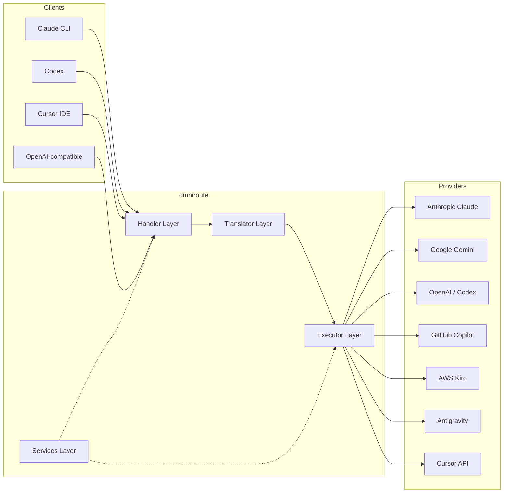

### Основной принцип: комплексный перевод

Вся трансляция формата проходит через **формат OpenAI в качестве концентратора**:

```
Client Format → [OpenAI Hub] → Provider Format    (request)
Provider Format → [OpenAI Hub] → Client Format    (response)
```

Это означает, что вам нужно только **N трансляторов** (по одному на каждый формат) вместо **N²** (каждая пара).

---

## 3. Структура проекта

```
omniroute/
├── open-sse/                  ← Core proxy library (portable, framework-agnostic)
│   ├── index.js               ← Main entry point, exports everything
│   ├── config/                ← Configuration & constants
│   ├── executors/             ← Provider-specific request execution
│   ├── handlers/              ← Request handling orchestration
│   ├── services/              ← Business logic (auth, models, fallback, usage)
│   ├── translator/            ← Format translation engine
│   │   ├── request/           ← Request translators (8 files)
│   │   ├── response/          ← Response translators (7 files)
│   │   └── helpers/           ← Shared translation utilities (6 files)
│   └── utils/                 ← Utility functions
├── src/                       ← Application layer (Express/Worker runtime)
│   ├── app/                   ← Web UI, API routes, middleware
│   ├── lib/                   ← Database, auth, and shared library code
│   ├── mitm/                  ← Man-in-the-middle proxy utilities
│   ├── models/                ← Database models
│   ├── shared/                ← Shared utilities (wrappers around open-sse)
│   ├── sse/                   ← SSE endpoint handlers
│   └── store/                 ← State management
├── data/                      ← Runtime data (credentials, logs)
│   └── provider-credentials.json   (external credentials override, gitignored)
└── tester/                    ← Test utilities
```

---

## 4. Разбивка по модулям

### 4.1 Конфигурация (`open-sse/config/`)

**Единый источник достоверной информации** для всех конфигураций провайдеров.

| Файл                          | Цель                                                                                                                                                                                                                                                             |
| ----------------------------- | ---------------------------------------------------------------------------------------------------------------------------------------------------------------------------------------------------------------------------------------------------------------- |
| `constants.ts`                | Объект `PROVIDERS` с базовыми URL-адресами, учетными данными OAuth (по умолчанию), заголовками и системными приглашениями по умолчанию для каждого поставщика. Также определяет `HTTP_STATUS`, `ERROR_TYPES`, `COOLDOWN_MS`, `BACKOFF_CONFIG` и `SKIP_PATTERNS`. |
| `credentialLoader.ts`         | Загружает внешние учетные данные из `data/provider-credentials.json` и объединяет их с жестко запрограммированными значениями по умолчанию в `PROVIDERS`. Сохраняет секреты вне контроля версий, сохраняя при этом обратную совместимость.                       |
| `providerModels.ts`           | Центральный реестр моделей: псевдонимы поставщиков карт → идентификаторы моделей. Такие функции, как `getModels()`, `getProviderByAlias()`.                                                                                                                      |
| `codexInstructions.ts`        | Системные инструкции, внедряемые в запросы Кодекса (ограничения редактирования, правила песочницы, политики утверждения).                                                                                                                                        |
| `defaultThinkingSignature.ts` | «Мыслящие» подписи по умолчанию для моделей Claude и Gemini.                                                                                                                                                                                                     |
| `ollamaModels.ts`             | Определение схемы для локальных моделей Олламы (имя, размер, семейство, квантование).                                                                                                                                                                            |

#### Процесс загрузки учетных данных

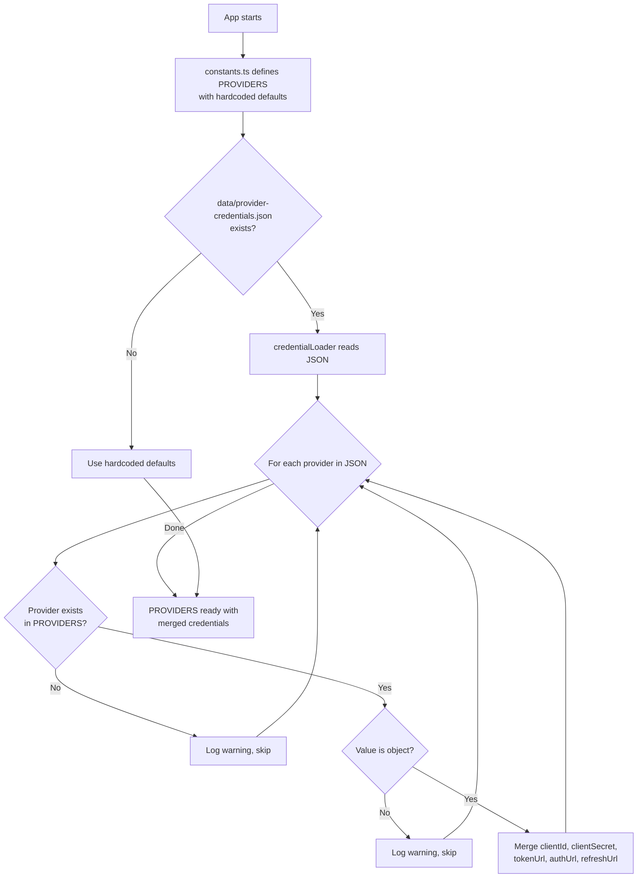

---

### 4.2 Исполнители (`open-sse/executors/`)

Исполнители инкапсулируют **логику, специфичную для поставщика**, используя **Шаблон стратегии**. Каждый исполнитель переопределяет базовые методы по мере необходимости.

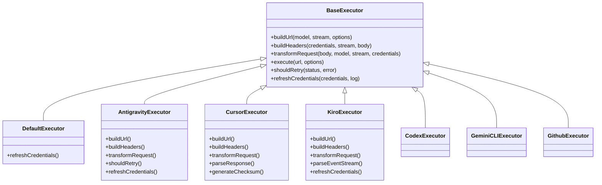

| Исполнитель      | Провайдер                                   | Ключевые специализации                                                                                                                                                               |
| ---------------- | ------------------------------------------- | ------------------------------------------------------------------------------------------------------------------------------------------------------------------------------------ |
| `base.ts`        | —                                           | Абстрактная база: построение URL-адресов, заголовки, логика повторов, обновление учетных данных                                                                                      |
| `default.ts`     | Клод, Близнецы, OpenAI, GLM, Кими, МиниМакс | Обновление общего токена OAuth для стандартных поставщиков                                                                                                                           |
| `antigravity.ts` | Облачный код Google                         | Генерация идентификатора проекта/сеанса, резервное копирование нескольких URL-адресов, настраиваемый повторный анализ сообщений об ошибках («сброс через 2 часа 7 минут 23 секунды») |
| `cursor.ts`      | Курсор IDE                                  | **Самое сложное**: проверка подлинности по контрольной сумме SHA-256, кодирование запроса Protobuf, двоичный поток событий → анализ ответа SSE                                       |
| `codex.ts`       | Кодекс OpenAI                               | Вводит системные инструкции, управляет уровнями мышления, удаляет неподдерживаемые параметры                                                                                         |
| `gemini-cli.ts`  | Интерфейс командной строки Google Gemini    | Создание собственного URL-адреса (`streamGenerateContent`), обновление токена Google OAuth                                                                                           |
| `github.ts`      | Второй пилот GitHub                         | Система двух токенов (GitHub OAuth + токен Copilot), имитация заголовка VSCode                                                                                                       |
| `kiro.ts`        | AWS CodeWhisperer                           | Бинарный анализ AWS EventStream, кадры событий AMZN, оценка токенов                                                                                                                  |
| `index.ts`       | —                                           | Фабрика: имя поставщика карт → класс исполнителя, с резервным вариантом по умолчанию                                                                                                 |

---

### 4.3 Обработчики (`open-sse/handlers/`)

**Уровень оркестрации** — координирует трансляцию, выполнение, потоковую передачу и обработку ошибок.

| Файл                  | Цель                                                                                                                                                                                                                                              |
| --------------------- | ------------------------------------------------------------------------------------------------------------------------------------------------------------------------------------------------------------------------------------------------- |
| `chatCore.ts`         | **Центральный оркестратор** (~600 строк). Обрабатывает полный жизненный цикл запроса: обнаружение формата → трансляция → отправка исполнителя → потоковый/непоточный ответ → обновление токена → обработка ошибок → журналирование использования. |
| `responsesHandler.ts` | Адаптер для API ответов OpenAI: преобразует формат ответов → Завершения чата → отправляет в `chatCore` → преобразует SSE обратно в формат ответов.                                                                                                |
| `embeddings.ts`       | Обработчик генерации внедрения: разрешает модель внедрения → поставщик, отправляет в API поставщика, возвращает ответ на внедрение, совместимый с OpenAI. Поддерживает 6+ провайдеров.                                                            |
| `imageGeneration.ts`  | Обработчик генерации изображений: определяет модель изображения → поставщик, поддерживает режимы OpenAI-совместимый, Gemini-image (Антигравитация) и резервный режим (Nebius). Возвращает изображения в формате Base64 или URL.                   |

#### Жизненный цикл запроса (chatCore.ts)

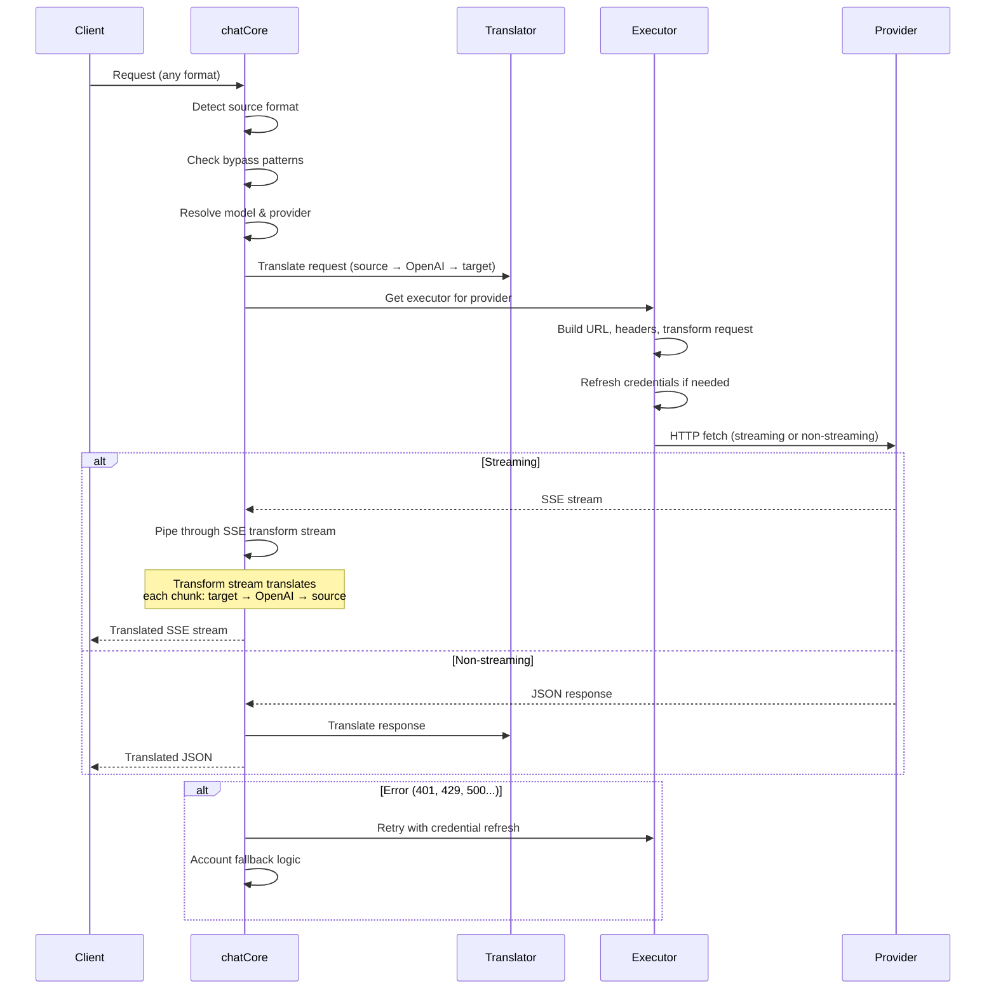

---

### 4.4 Услуги (`open-sse/services/`)

Бизнес-логика, поддерживающая обработчики и исполнители.

| Файл                 | Цель                                                                                                                                                                                                                                                                                                                                                                      |
| -------------------- | ------------------------------------------------------------------------------------------------------------------------------------------------------------------------------------------------------------------------------------------------------------------------------------------------------------------------------------------------------------------------- |
| `provider.ts`        | **Обнаружение формата** (`detectFormat`): анализирует структуру тела запроса для определения форматов Claude/OpenAI/Gemini/Antigravity/Responses (включая эвристику `max_tokens` для Claude). А также: построение URL, построение заголовков, нормализация конфигурации мышления. Поддерживает динамических поставщиков `openai-compatible-*` и `anthropic-compatible-*`. |
| `model.ts`           | Анализ строки модели (`claude/model-name` → `{provider: "claude", model: "model-name"}`), разрешение псевдонимов с обнаружением коллизий, очистка ввода (отклоняет обход пути/управляющие символы) и разрешение информации модели с поддержкой асинхронного метода получения псевдонимов.                                                                                 |
| `accountFallback.ts` | Обработка ограничения скорости: экспоненциальная отсрочка (1 с → 2 с → 4 с → максимум 2 минуты), управление временем восстановления учетной записи, классификация ошибок (какие ошибки вызывают откат, а какие нет).                                                                                                                                                      |
| `tokenRefresh.ts`    | Обновление токена OAuth для **каждого поставщика**: Google (Gemini, Antigravity), Claude, Codex, Qwen, iFlow, GitHub (OAuth + двойной токен Copilot), Kiro (AWS SSO OIDC + Social Auth). Включает в себя кэш дедупликации обещаний в реальном времени и повторные попытки с экспоненциальной задержкой.                                                                   |
| `combo.ts`           | **Комбо-модели**: цепочки резервных моделей. Если модель A дает сбой из-за ошибки, допускающей возврат, попробуйте модель B, затем C и т. д. Возвращает фактические коды состояния восходящего потока.                                                                                                                                                                    |
| `usage.ts`           | Извлекает данные о квотах/использовании из API-интерфейсов провайдера (квоты GitHub Copilot, квоты модели Antigravity, ограничения скорости Кодекса, разбивка использования Kiro, настройки Claude).                                                                                                                                                                      |
| `accountSelector.ts` | Интеллектуальный выбор учетной записи с алгоритмом оценки: учитывает приоритет, состояние здоровья, позицию циклического перебора и состояние перезарядки, чтобы выбрать оптимальную учетную запись для каждого запроса.                                                                                                                                                  |
| `contextManager.ts`  | Управление жизненным циклом контекста запроса: создает и отслеживает объекты контекста каждого запроса с метаданными (идентификатор запроса, временные метки, информация о поставщике) для отладки и журналирования.                                                                                                                                                      |
| `ipFilter.ts`        | Контроль доступа на основе IP: поддерживает режимы белого и черного списка. Проверяет IP-адрес клиента на соответствие настроенным правилам перед обработкой запросов API.                                                                                                                                                                                                |
| `sessionManager.ts`  | Отслеживание сеансов с помощью снятия отпечатков пальцев клиентов: отслеживает активные сеансы с использованием хешированных идентификаторов клиентов, отслеживает количество запросов и предоставляет метрики сеансов.                                                                                                                                                   |
| `signatureCache.ts`  | Кэш дедупликации на основе сигнатур запросов: предотвращает дублирование запросов за счет кэширования сигнатур последних запросов и возврата кэшированных ответов на идентичные запросы в течение определенного временного окна.                                                                                                                                          |
| `systemPrompt.ts`    | Глобальное внедрение системного приглашения: добавляет или добавляет настраиваемое системное приглашение ко всем запросам с обработкой совместимости для каждого поставщика.                                                                                                                                                                                              |
| `thinkingBudget.ts`  | Управление бюджетом токенов рассуждения: поддерживает сквозной, автоматический (конфигурация с ограничением мышления), пользовательский (фиксированный бюджет) и адаптивный (масштабируемый по сложности) режимы управления токенами мышления/рассуждения.                                                                                                                |
| `wildcardRouter.ts`  | Маршрутизация шаблонов модели с подстановочными знаками: разрешает шаблоны с подстановочными знаками (например, `*/claude-*`) для конкретных пар поставщик/модель на основе доступности и приоритета.                                                                                                                                                                     |

#### Дедупликация обновления токена

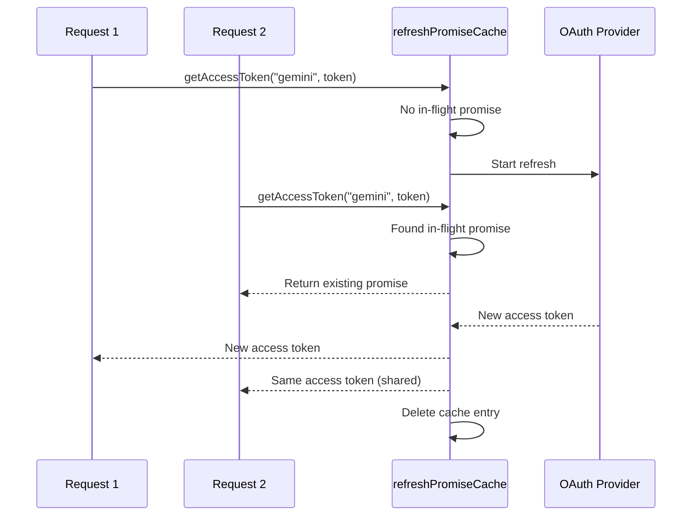

#### Резервный конечный автомат учетной записи

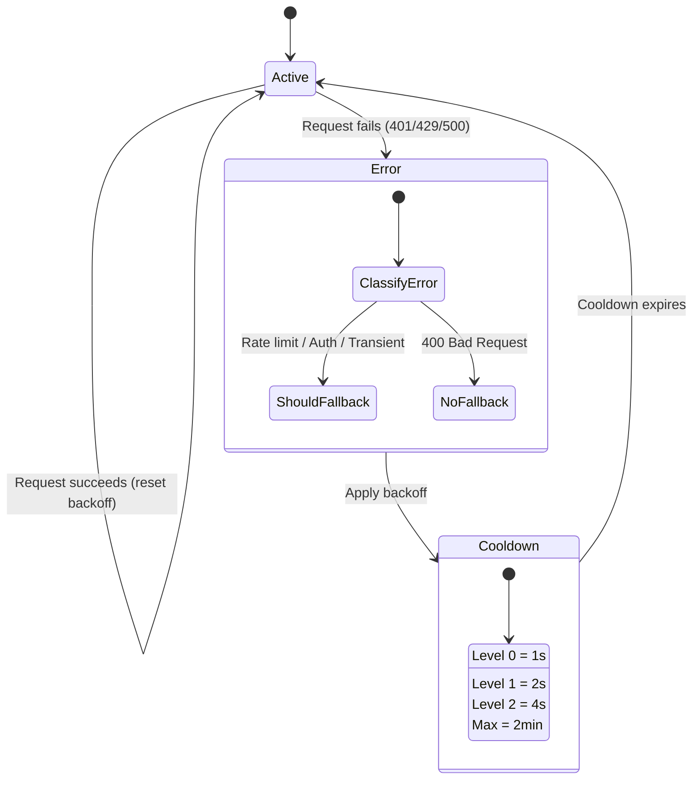

#### Комбо-цепочка моделей

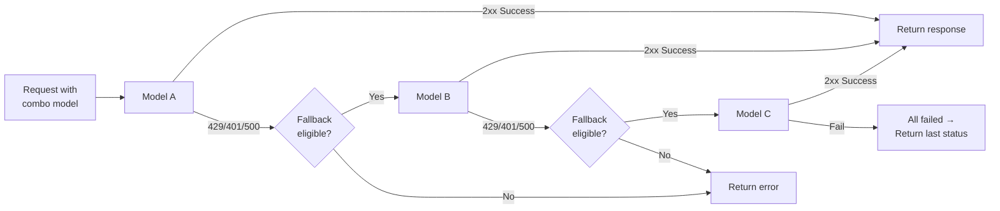

---

### 4.5 Переводчик (`open-sse/translator/`)

**Механизм перевода форматов**, использующий систему саморегистрирующихся плагинов.

#### Архитектура

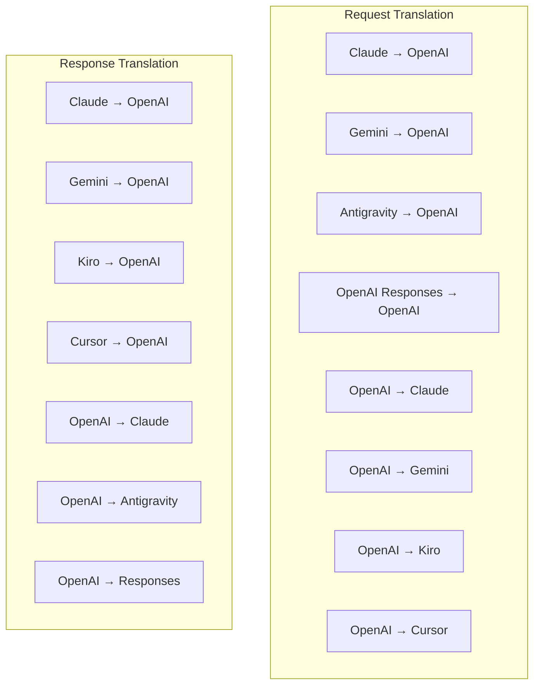

| Каталог      | Файлы          | Описание                                                                                                                                                                                                                                                                                            |
| ------------ | -------------- | --------------------------------------------------------------------------------------------------------------------------------------------------------------------------------------------------------------------------------------------------------------------------------------------------- |
| `request/`   | 8 переводчиков | Преобразование тел запросов между форматами. Каждый файл самостоятельно регистрируется через `register(from, to, fn)` при импорте.                                                                                                                                                                  |
| `response/`  | 7 переводчиков | Преобразование фрагментов потокового ответа между форматами. Обрабатывает типы событий SSE, блоки мышления, вызовы инструментов.                                                                                                                                                                    |
| `helpers/`   | 6 помощников   | Общие утилиты: `claudeHelper` (извлечение системных подсказок, конфигурация мышления), `geminiHelper` (сопоставление частей/содержимого), `openaiHelper` (фильтрация формата), `toolCallHelper` (генерация идентификатора, вставка отсутствующего ответа), `maxTokensHelper`, `responsesApiHelper`. |
| `index.ts`   | —              | Механизм перевода: `translateRequest()`, `translateResponse()`, управление состоянием, реестр.                                                                                                                                                                                                      |
| `formats.ts` | —              | Константы формата: `OPENAI`, `CLAUDE`, `GEMINI`, `ANTIGRAVITY`, `KIRO`, `CURSOR`, `OPENAI_RESPONSES`.                                                                                                                                                                                               |

#### Ключевой дизайн: саморегистрирующиеся плагины

```javascript
// Each translator file calls register() on import:
import { register } from "../index.js";
register("claude", "openai", translateClaudeToOpenAI);

// The index.js imports all translator files, triggering registration:
import "./request/claude-to-openai.js"; // ← self-registers
```

---

### 4.6 Утилиты (`open-sse/utils/`)

| Файл               | Цель                                                                                                                                                                                                                                                                                                                                        |
| ------------------ | ------------------------------------------------------------------------------------------------------------------------------------------------------------------------------------------------------------------------------------------------------------------------------------------------------------------------------------------- |
| `error.ts`         | Построение ответов об ошибках (формат, совместимый с OpenAI), анализ ошибок восходящего потока, извлечение времени повтора Антигравитации из сообщений об ошибках, потоковая передача ошибок SSE.                                                                                                                                           |
| `stream.ts`        | **SSE Transform Stream** — основной конвейер потоковой передачи. Два режима: `TRANSLATE` (полноформатный перевод) и `PASSTHROUGH` (нормализация + использование извлечения). Управляет буферизацией фрагментов, оценкой использования, отслеживанием длины контента. Экземпляры попоточного кодировщика/декодера избегают общего состояния. |
| `streamHelpers.ts` | Утилиты SSE низкого уровня: `parseSSELine` (толерантный к пробелам), `hasValuableContent` (фильтрует пустые фрагменты для OpenAI/Claude/Gemini), `fixInvalidId`, `formatSSE` (сериализация SSE с учетом формата с очисткой `perf_metrics`).                                                                                                 |
| `usageTracking.ts` | Извлечение использования токенов из любого формата (Claude/OpenAI/Gemini/Responses), оценка с помощью отдельных соотношений инструмента/сообщения на токен, добавление буфера (запас безопасности 2000 токенов), фильтрация полей для конкретного формата, ведение журнала консоли с цветами ANSI.                                          |
| `requestLogger.ts` | Ведение журнала запросов на основе файлов (согласие через `ENABLE_REQUEST_LOGS=true`). Создает папки сеансов с пронумерованными файлами: `1_req_client.json` → `7_res_client.txt`. Весь ввод-вывод является асинхронным (выстрелил и забыл). Маскирует чувствительные заголовки.                                                            |
| `bypassHandler.ts` | Перехватывает определенные шаблоны из Claude CLI (извлечение заголовков, прогрев, подсчет) и возвращает поддельные ответы без вызова какого-либо провайдера. Поддерживает как потоковую, так и непотоковую передачу. Намеренно ограничено областью действия Claude CLI.                                                                     |
| `networkProxy.ts`  | Разрешает URL-адрес исходящего прокси-сервера для данного поставщика с приоритетом: конфигурация конкретного поставщика → глобальная конфигурация → переменные среды (`HTTPS_PROXY`/`HTTP_PROXY`/`ALL_PROXY`). Поддерживает исключения `NO_PROXY`. Кэширует конфиг на 30 секунд.                                                            |

#### Потоковый конвейер SSE

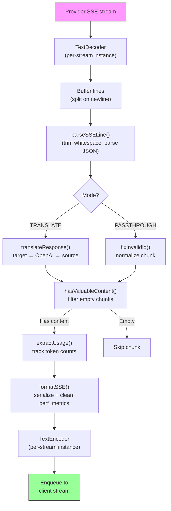

#### Структура сеанса регистратора запросов

```
logs/
└── claude_gemini_claude-sonnet_20260208_143045/
    ├── 1_req_client.json      ← Raw client request
    ├── 2_req_source.json      ← After initial conversion
    ├── 3_req_openai.json      ← OpenAI intermediate format
    ├── 4_req_target.json      ← Final target format
    ├── 5_res_provider.txt     ← Provider SSE chunks (streaming)
    ├── 5_res_provider.json    ← Provider response (non-streaming)
    ├── 6_res_openai.txt       ← OpenAI intermediate chunks
    ├── 7_res_client.txt       ← Client-facing SSE chunks
    └── 6_error.json           ← Error details (if any)
```

---

### 4.7 Прикладной уровень (`src/`)

| Каталог       | Цель                                                                                       |
| ------------- | ------------------------------------------------------------------------------------------ |
| `src/app/`    | Веб-интерфейс, маршруты API, промежуточное ПО Express, обработчики обратного вызова OAuth  |
| `src/lib/`    | Доступ к базе данных (`localDb.ts`, `usageDb.ts`), аутентификация, общий доступ            |
| `src/mitm/`   | Прокси-утилиты «Человек посередине» для перехвата трафика провайдера                       |
| `src/models/` | Определения модели базы данных                                                             |
| `src/shared/` | Обертки вокруг функций open-sse (поставщик, поток, ошибка и т. д.)                         |
| `src/sse/`    | Обработчики конечных точек SSE, которые подключают библиотеку open-sse к маршрутам Express |
| `src/store/`  | Управление состоянием приложения                                                           |

#### Известные маршруты API

| Маршрут                                       | Методы                     | Цель                                                                                                        |
| --------------------------------------------- | -------------------------- | ----------------------------------------------------------------------------------------------------------- |
| `/api/provider-models`                        | ПОЛУЧИТЬ/ОТПРАВИТЬ/УДАЛИТЬ | CRUD для пользовательских моделей для каждого поставщика                                                    |
| `/api/models/catalog`                         | ПОЛУЧИТЬ                   | Агрегированный каталог всех моделей (чат, встраивание, изображение, кастом), сгруппированный по поставщикам |
| `/api/settings/proxy`                         | ПОЛУЧИТЬ/ПОСТАВИТЬ/УДАЛИТЬ | Иерархическая конфигурация исходящего прокси-сервера (`global/providers/combos/keys`)                       |
| `/api/settings/proxy/test`                    | ПОСТ                       | Проверяет подключение прокси-сервера и возвращает общедоступный IP-адрес и задержку                         |
| `/v1/providers/[provider]/chat/completions`   | ПОСТ                       | Специальное завершение чата для каждого поставщика с проверкой модели                                       |
| `/v1/providers/[provider]/embeddings`         | ПОСТ                       | Выделенные внедрения для каждого поставщика с проверкой модели                                              |
| `/v1/providers/[provider]/images/generations` | ПОСТ                       | Специальное создание изображений для каждого поставщика с проверкой модели                                  |
| `/api/settings/ip-filter`                     | ПОЛУЧИТЬ/ПОСТАВИТЬ         | Управление списком разрешенных/черных IP-адресов                                                            |
| `/api/settings/thinking-budget`               | ПОЛУЧИТЬ/ПОСТАВИТЬ         | Конфигурация бюджета токена обоснования (сквозной/автоматический/пользовательский/адаптивный)               |
| `/api/settings/system-prompt`                 | ПОЛУЧИТЬ/ПОСТАВИТЬ         | Глобальная система быстрого внедрения для всех запросов                                                     |
| `/api/sessions`                               | ПОЛУЧИТЬ                   | Отслеживание активных сессий и метрики                                                                      |
| `/api/rate-limits`                            | ПОЛУЧИТЬ                   | Статус ограничения ставки для каждого аккаунта                                                              |

---

## 5. Ключевые шаблоны проектирования

### 5.1 Координатный перевод

Все форматы преобразуются через **формат OpenAI в качестве концентратора**. Для добавления нового провайдера требуется написать только **одну пару** трансляторов (в/из OpenAI), а не N пар.

### 5.2 Шаблон стратегии исполнителя

У каждого поставщика есть выделенный класс исполнителя, унаследованный от `BaseExecutor`. Фабрика в `executors/index.ts` выбирает правильный вариант во время выполнения.

### 5.3 Система саморегистрации плагинов

Модули переводчика регистрируются при импорте через `register()`. Добавление нового переводчика — это просто создание файла и его импорт.

### 5.4 Резервный аккаунт с экспоненциальным откатом

Когда провайдер возвращает 429/401/500, система может переключиться на следующую учетную запись, применяя экспоненциальное время восстановления (1 с → 2 с → 4 с → максимум 2 минуты).

### 5.5 Цепочки комбо-моделей

«Комбо» группирует несколько строк `provider/model`. Если первое не удалось, автоматически переходите к следующему.

### 5.6 Потоковая трансляция с сохранением состояния

Трансляция ответов поддерживает состояние блоков SSE (отслеживание мыслительных блоков, накопление вызовов инструментов, индексирование блоков контента) с помощью механизма `initState()`.

### 5.7 Использование буфера безопасности

К сообщаемому использованию добавляется буфер на 2000 токенов, чтобы клиенты не превышали ограничения контекстного окна из-за накладных расходов на системные подсказки и преобразование формата.

---

## 6. Поддерживаемые форматы

| Формат                                   | Направление     | Идентификатор      |
| ---------------------------------------- | --------------- | ------------------ |
| Завершения чата OpenAI                   | источник + цель | `openai`           |
| API ответов OpenAI                       | источник + цель | `openai-responses` |
| Антропный Клод                           | источник + цель | `claude`           |
| Google Близнецы                          | источник + цель | `gemini`           |
| Интерфейс командной строки Google Gemini | только цель     | `gemini-cli`       |
| Антигравитация                           | источник + цель | `antigravity`      |
| AWS Киро                                 | только цель     | `kiro`             |
| Курсор                                   | только цель     | `cursor`           |

---

## 7. Поддерживаемые провайдеры

| Провайдер                                | Метод аутентификации       | Исполнитель    | Ключевые примечания                                                      |
| ---------------------------------------- | -------------------------- | -------------- | ------------------------------------------------------------------------ |
| Антропный Клод                           | Ключ API или OAuth         | По умолчанию   | Использует заголовок `x-api-key`                                         |
| Google Близнецы                          | Ключ API или OAuth         | По умолчанию   | Использует заголовок `x-goog-api-key`                                    |
| Интерфейс командной строки Google Gemini | ОАутент                    | БлизнецыCLI    | Использует конечную точку `streamGenerateContent`                        |
| Антигравитация                           | ОАутент                    | Антигравитация | Резервный вариант нескольких URL-адресов, индивидуальный анализ повторов |
| ОпенАИ                                   | API-ключ                   | По умолчанию   | Проверка подлинности стандартного носителя                               |
| Кодекс                                   | ОАутент                    | Кодекс         | Вводит системные инструкции, управляет мышлением                         |
| Второй пилот GitHub                      | OAuth + токен Copilot      | Гитхаб         | Двойной токен, имитация заголовка VSCode                                 |
| Киро (AWS)                               | AWS SSO OIDC или Social    | Киро           | Анализ двоичного потока событий                                          |
| Курсор IDE                               | Проверка контрольной суммы | Курсор         | Кодирование Protobuf, контрольные суммы SHA-256                          |
| Квен                                     | ОАутент                    | По умолчанию   | Стандартная аутентификация                                               |
| iFlow                                    | OAuth (базовый + носитель) | По умолчанию   | Заголовок двойной аутентификации                                         |
| OpenRouter                               | API-ключ                   | По умолчанию   | Проверка подлинности стандартного носителя                               |
| ГЛМ, Кими, МиниМакс                      | API-ключ                   | По умолчанию   | Совместимость с Claude, используйте `x-api-key`                          |
| `openai-compatible-*`                    | API-ключ                   | По умолчанию   | Динамический: любая конечная точка, совместимая с OpenAI                 |
| `anthropic-compatible-*`                 | API-ключ                   | По умолчанию   | Динамический: любая конечная точка, совместимая с Claude                 |

---

## 8. Сводная информация о потоке данных

### Запрос потоковой передачи

```mermaid
flowchart LR
    A["Client"] --> B["detectFormat()"]
    B --> C["translateRequest()\nsource → OpenAI → target"]
    C --> D["Executor\nbuildUrl + buildHeaders"]
    D --> E["fetch(providerURL)"]
    E --> F["createSSEStream()\nTRANSLATE mode"]
    F --> G["parseSSELine()"]
    G --> H["translateResponse()\ntarget → OpenAI → source"]
    H --> I["extractUsage()\n+ addBuffer"]
    I --> J["formatSSE()"]
    J --> K["Client receives\ntranslated SSE"]
    K --> L["logUsage()\nsaveRequestUsage()"]
```

### Непотоковый запрос

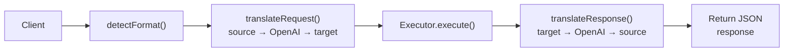

### Обход потока (Claude CLI)

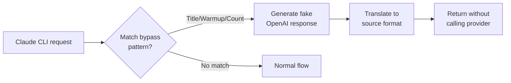
