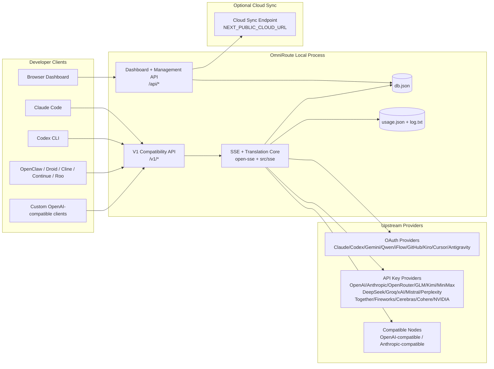
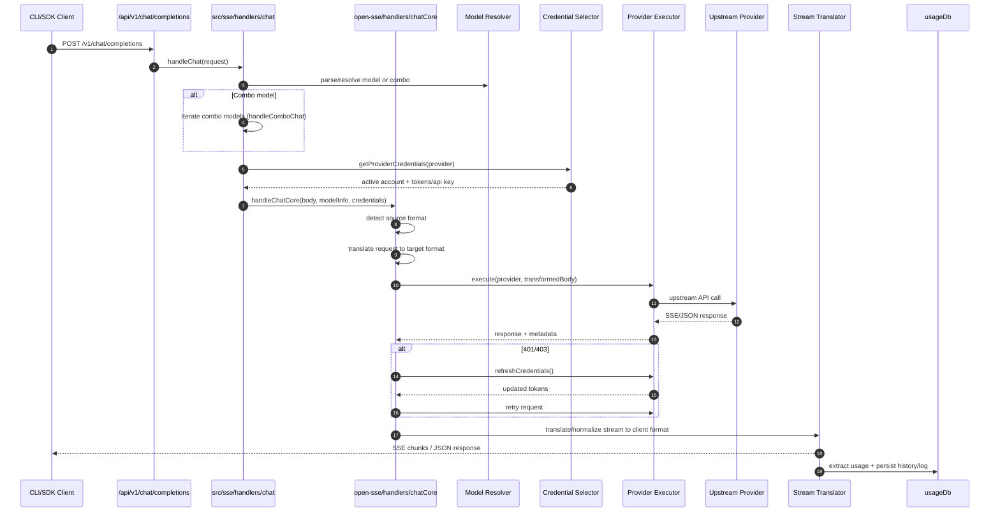
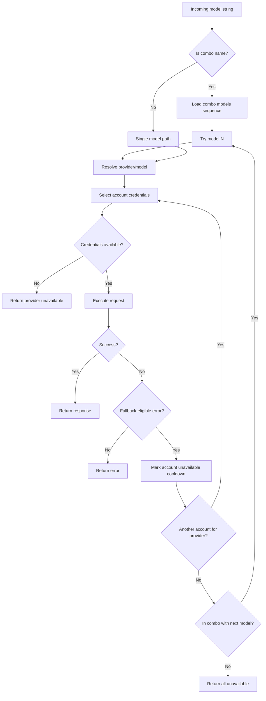
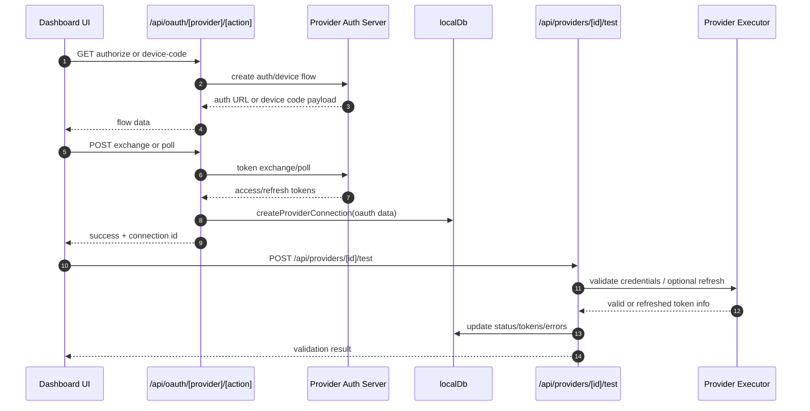
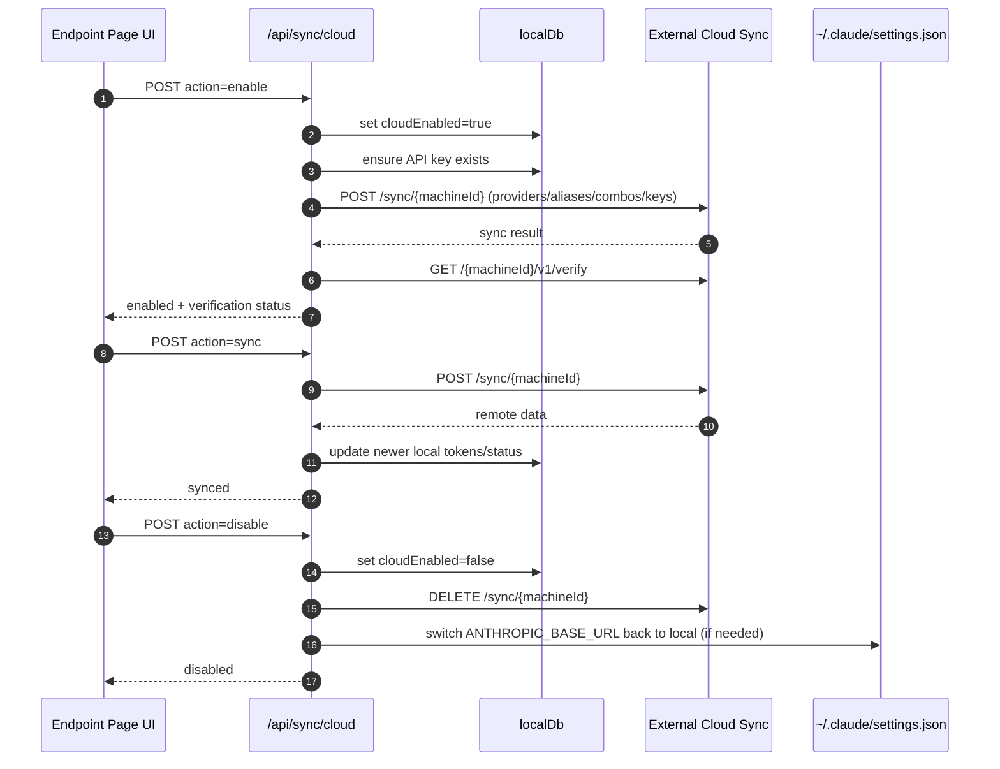
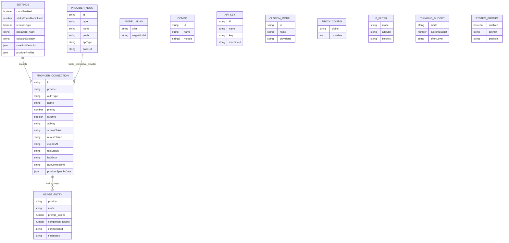
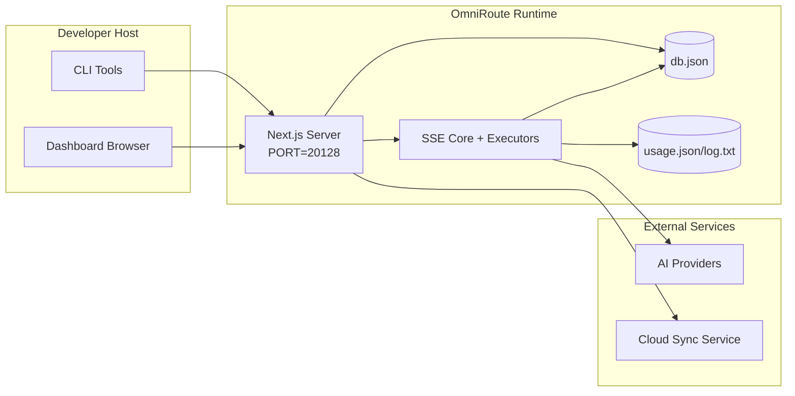

# Architektúra OmniRoute

🌐 **Languages:** 🇺🇸 [English](../../ARCHITECTURE.md) | 🇧🇷 [Português (Brasil)](../pt-BR/ARCHITECTURE.md) | 🇪🇸 [Español](../es/ARCHITECTURE.md) | 🇫🇷 [Français](../fr/ARCHITECTURE.md) | 🇮🇹 [Italiano](../it/ARCHITECTURE.md) | 🇷🇺 [Русский](../ru/ARCHITECTURE.md) | 🇨🇳 [中文 (简体)](../zh-CN/ARCHITECTURE.md) | 🇩🇪 [Deutsch](../de/ARCHITECTURE.md) | 🇮🇳 [हिन्दी](../in/ARCHITECTURE.md) | 🇹🇭 [ไทย](../th/ARCHITECTURE.md) | 🇺🇦 [Українська](../uk-UA/ARCHITECTURE.md) | 🇸🇦 [العربية](../ar/ARCHITECTURE.md) | 🇯🇵 [日本語](../ja/ARCHITECTURE.md) | 🇻🇳 [Tiếng Việt](../vi/ARCHITECTURE.md) | 🇧🇬 [Български](../bg/ARCHITECTURE.md) | 🇩🇰 [Dansk](../da/ARCHITECTURE.md) | 🇫🇮 [Suomi](../fi/ARCHITECTURE.md) | 🇮🇱 [עברית](../he/ARCHITECTURE.md) | 🇭🇺 [Magyar](../hu/ARCHITECTURE.md) | 🇮🇩 [Bahasa Indonesia](../id/ARCHITECTURE.md) | 🇰🇷 [한국어](../ko/ARCHITECTURE.md) | 🇲🇾 [Bahasa Melayu](../ms/ARCHITECTURE.md) | 🇳🇱 [Nederlands](../nl/ARCHITECTURE.md) | 🇳🇴 [Norsk](../no/ARCHITECTURE.md) | 🇵🇹 [Português (Portugal)](../pt/ARCHITECTURE.md) | 🇷🇴 [Română](../ro/ARCHITECTURE.md) | 🇵🇱 [Polski](../pl/ARCHITECTURE.md) | 🇸🇰 [Slovenčina](../sk/ARCHITECTURE.md) | 🇸🇪 [Svenska](../sv/ARCHITECTURE.md) | 🇵🇭 [Filipino](../phi/ARCHITECTURE.md)

_Posledná aktualizácia: 2026-02-18_

## Zhrnutie

OmniRoute je lokálna AI smerovacia brána a dashboard postavená na Next.js.
Poskytuje jeden koncový bod kompatibilný s OpenAI (`/v1/*`) a smeruje prevádzku medzi viacerých upstream poskytovateľov s prekladom, záložným, obnovovaním tokenov a sledovaním používania.

Základné schopnosti:

- OpenAI kompatibilný povrch API pre CLI/nástroje (28 poskytovateľov)
- Požiadavka / odpoveď na preklad medzi formátmi poskytovateľov
- Záložná kombinácia modelov (sekvencia viacerých modelov)
  – Záložný režim na úrovni účtu (viac účtov na poskytovateľa)
- Správa pripojenia poskytovateľa s kľúčom OAuth + API
- Generovanie vkladania prostredníctvom `/v1/embeddings` (6 poskytovateľov, 9 modelov)
- Generovanie obrázkov prostredníctvom `/v1/images/generations` (4 poskytovatelia, 9 modelov)
- Myslite na analýzu značiek (`<think>...</think>`) pre modely uvažovania
- Dezinfekcia odozvy pre prísnu kompatibilitu OpenAI SDK
- Normalizácia rolí (vývojár→systém, systém→používateľ) pre kompatibilitu medzi poskytovateľmi
- Konverzia štruktúrovaného výstupu (json_schema → Gemini responseSchema)
- Miestna perzistencia pre poskytovateľov, kľúče, aliasy, kombá, nastavenia, ceny
- Sledovanie používania / nákladov a zaznamenávanie žiadostí
- Voliteľná cloudová synchronizácia pre synchronizáciu viacerých zariadení/stavov
- Zoznam povolených/blokovaných IP adries pre riadenie prístupu k API
- Myslenie na správu rozpočtu (priechodový/automatický/vlastný/adaptívny)
- Rýchle vstrekovanie globálneho systému
- Sledovanie relácií a snímanie odtlačkov prstov
- Rozšírené obmedzenie sadzieb na účet s profilmi špecifickými pre poskytovateľov
- Vzor ističa pre odolnosť poskytovateľa
- Ochrana stáda proti hromu s blokovaním mutex
- Cache deduplikácie požiadaviek na základe podpisu
- Doménová vrstva: dostupnosť modelu, cenové pravidlá, záložná politika, politika blokovania
- Stálosť stavu domény (vyrovnávacia pamäť SQLite pre záložné zdroje, rozpočty, blokovania, ističe)
- Modul politiky pre centralizované vyhodnocovanie požiadaviek (uzamknutie → rozpočet → záložné)
- Požiadajte o telemetriu s agregáciou latencie p50/p95/p99
- ID korelácie (X-Request-Id) pre end-to-end sledovanie
- Protokolovanie auditu súladu s odhlásením podľa kľúča API
- Hodnotný rámec pre zabezpečenie kvality LLM
- Prístrojová doska UI Resilience so stavom ističa v reálnom čase
- Modulárni poskytovatelia OAuth (12 samostatných modulov pod `src/lib/oauth/providers/`)

Primárny runtime model:

– Trasy aplikácie Next.js pod `src/app/api/*` implementujú rozhrania API hlavného panela aj rozhrania API kompatibility
– Zdieľané jadro SSE/smerovanie v `src/sse/*` + `open-sse/*` sa stará o vykonávanie poskytovateľa, preklad, streamovanie, záložné zdroje a používanie

## Rozsah a hranice

### V rozsahu

- Runtime lokálnej brány
- Rozhrania API na správu informačných panelov
- Overenie poskytovateľa a obnovenie tokenu
- Požiadajte o preklad a streamovanie SSE
- Miestny stav + pretrvávanie používania
- Voliteľná orchestrácia synchronizácie s cloudom

### Mimo rozsah

- Implementácia cloudovej služby za `NEXT_PUBLIC_CLOUD_URL`
- Poskytovateľ SLA/riadiaca rovina mimo lokálneho procesu
- Samotné externé binárne súbory CLI (Claude CLI, Codex CLI atď.)

## Kontext systému na vysokej úrovni



## Základné komponenty runtime

## 1) API a Routing Layer (Next.js App Routes)

Hlavné adresáre:

- `src/app/api/v1/*` a `src/app/api/v1beta/*` pre rozhrania API kompatibility
- `src/app/api/*` pre spravovanie/konfiguráciu API
- Ďalšie prepisy na `next.config.mjs` mape `/v1/*` na `/api/v1/*`

Dôležité cesty kompatibility:

- `src/app/api/v1/chat/completions/route.ts`
- `src/app/api/v1/messages/route.ts`
- `src/app/api/v1/responses/route.ts`
  – `src/app/api/v1/models/route.ts` – zahŕňa vlastné modely s `custom: true`
- `src/app/api/v1/embeddings/route.ts` – generovanie vkladania (6 poskytovateľov)
- `src/app/api/v1/images/generations/route.ts` — generovanie obrázkov (4+ poskytovatelia vrátane Antigravity/Nebius)
- `src/app/api/v1/messages/count_tokens/route.ts`
- `src/app/api/v1/providers/[provider]/chat/completions/route.ts` – vyhradený chat pre jednotlivých poskytovateľov
- `src/app/api/v1/providers/[provider]/embeddings/route.ts` – vyhradené vloženia podľa jednotlivých poskytovateľov
- `src/app/api/v1/providers/[provider]/images/generations/route.ts` – vyhradené obrázky podľa jednotlivých poskytovateľov
- `src/app/api/v1beta/models/route.ts`
- `src/app/api/v1beta/models/[...path]/route.ts`

Manažérske domény:

- Autorizácia/nastavenia: `src/app/api/auth/*`, `src/app/api/settings/*`
  – Poskytovatelia/pripojenia: `src/app/api/providers*`
  – Uzly poskytovateľa: `src/app/api/provider-nodes*`
  – Vlastné modely: `src/app/api/provider-models` (GET/POST/DELETE)
- Katalóg modelov: `src/app/api/models/catalog` (GET)
- Konfigurácia proxy: `src/app/api/settings/proxy` (GET/PUT/DELETE) + `src/app/api/settings/proxy/test` (POST)
- OAuth: `src/app/api/oauth/*`
  – Kľúče/aliasy/kombá/ceny: `src/app/api/keys*`, `src/app/api/models/alias`, `src/app/api/combos*`, `src/app/api/pricing`
- Použitie: `src/app/api/usage/*`
  – Synchronizácia/cloud: `src/app/api/sync/*`, `src/app/api/cloud/*`
- Pomocníci nástrojov CLI: `src/app/api/cli-tools/*`
- IP filter: `src/app/api/settings/ip-filter` (GET/PUT)
- Rozpočet: `src/app/api/settings/thinking-budget` (GET/PUT)
- Systémová výzva: `src/app/api/settings/system-prompt` (GET/PUT)
- Relácie: `src/app/api/sessions` (GET)
- Limity sadzby: `src/app/api/rate-limits` (GET)
- Odolnosť: `src/app/api/resilience` (GET/PATCH) – profily poskytovateľa, istič, medzný stav rýchlosti
- Resetovanie odolnosti: `src/app/api/resilience/reset` (POST) - resetovanie ističov + cooldowny
- Štatistiky vyrovnávacej pamäte: `src/app/api/cache/stats` (GET/DELETE)
- Dostupnosť modelu: `src/app/api/models/availability` (GET/POST)
- Telemetria: `src/app/api/telemetry/summary` (GET)
- Rozpočet: `src/app/api/usage/budget` (GET/POST)
- Záložné reťazce: `src/app/api/fallback/chains` (GET/POST/DELETE)
- Audit súladu: `src/app/api/compliance/audit-log` (GET)
- Hodnoty: `src/app/api/evals` (GET/POST), `src/app/api/evals/[suiteId]` (GET)
  – Zásady: `src/app/api/policies` (GET/POST)

## 2) SSE + jadro prekladu

Hlavné prietokové moduly:

- Vstup: `src/sse/handlers/chat.ts`
- Základná orchestrácia: `open-sse/handlers/chatCore.ts`
- Spúšťacie adaptéry poskytovateľa: `open-sse/executors/*`
- Detekcia formátu/konfigurácia poskytovateľa: `open-sse/services/provider.ts`
- Analýza/rozlíšenie modelu: `src/sse/services/model.ts`, `open-sse/services/model.ts`
  – Logika záložného účtu: `open-sse/services/accountFallback.ts`
- Register prekladov: `open-sse/translator/index.ts`
- Transformácie streamu: `open-sse/utils/stream.ts`, `open-sse/utils/streamHandler.ts`
- Extrakcia/normalizácia použitia: `open-sse/utils/usageTracking.ts`
  – Analyzátor značiek Think: `open-sse/utils/thinkTagParser.ts`
- Obslužný nástroj vkladania: `open-sse/handlers/embeddings.ts`
  – Register poskytovateľov vkladania: `open-sse/config/embeddingRegistry.ts`
  – Obslužný program generovania obrázkov: `open-sse/handlers/imageGeneration.ts`
  – Register poskytovateľa obrázkov: `open-sse/config/imageRegistry.ts`
- Dezinfekcia odozvy: `open-sse/handlers/responseSanitizer.ts`
- Normalizácia rolí: `open-sse/services/roleNormalizer.ts`

Služby (obchodná logika):

- Výber účtu/bodovanie: `open-sse/services/accountSelector.ts`
- Kontextová správa životného cyklu: `open-sse/services/contextManager.ts`
- Vynútenie filtra IP: `open-sse/services/ipFilter.ts`
  – Sledovanie relácií: `open-sse/services/sessionManager.ts`
- Žiadosť o deduplikáciu: `open-sse/services/signatureCache.ts`
- Okamžité vloženie do systému: `open-sse/services/systemPrompt.ts`
- Myslenie na správu rozpočtu: `open-sse/services/thinkingBudget.ts`
- Smerovanie modelu so zástupným znakom: `open-sse/services/wildcardRouter.ts`
- Správa limitu sadzieb: `open-sse/services/rateLimitManager.ts`
- Istič: `open-sse/services/circuitBreaker.ts`

Moduly vrstvy domény:

- Dostupnosť modelu: `src/lib/domain/modelAvailability.ts`
- Cenové pravidlá/rozpočty: `src/lib/domain/costRules.ts`
  – Záložné pravidlá: `src/lib/domain/fallbackPolicy.ts`
- Kombinovaný prekladač: `src/lib/domain/comboResolver.ts`
  – Zásady blokovania: `src/lib/domain/lockoutPolicy.ts`
- Modul politiky: `src/domain/policyEngine.ts` – centralizované uzamknutie → rozpočet → záložné hodnotenie
  – Katalóg kódov chýb: `src/lib/domain/errorCodes.ts`
  – ID žiadosti: `src/lib/domain/requestId.ts`
  – Časový limit načítania: `src/lib/domain/fetchTimeout.ts`
- Vyžiadať telemetriu: `src/lib/domain/requestTelemetry.ts`
- Súlad/audit: `src/lib/domain/compliance/index.ts`
- Hodnotný bežec: `src/lib/domain/evalRunner.ts`
- Trvalosť stavu domény: `src/lib/db/domainState.ts` — SQLite CRUD pre záložné reťazce, rozpočty, históriu nákladov, stav uzamknutia, ističe

Moduly poskytovateľa OAuth (12 samostatných súborov pod `src/lib/oauth/providers/`):

- Index registra: `src/lib/oauth/providers/index.ts`
  – Jednotliví poskytovatelia: `claude.ts`, `codex.ts`, `gemini.ts`, `antigravity.ts`, `iflow.ts`, `github.ts`, `kiro.ts`, `cursor.ts`, `kilocode.ts`, `cline.ts`
- Tenký obal: `src/lib/oauth/providers.ts` – reexporty z jednotlivých modulov

## 3) Vrstva perzistencie

Primárny stav DB:

- `src/lib/localDb.ts`
- súbor: `${DATA_DIR}/db.json` (alebo `$XDG_CONFIG_HOME/omniroute/db.json`, ak je nastavený, inak `~/.omniroute/db.json`)
- entity: providerConnections, providerNodes, modelAliases, kombá, apiKeys, nastavenia, ceny, **customModels**, **proxyConfig**, **ipFilter**, **thinkingBudget**, **systemPrompt**

Použitie DB:

- `src/lib/usageDb.ts`
- súbory: `${DATA_DIR}/usage.json`, `${DATA_DIR}/log.txt`, `${DATA_DIR}/call_logs/`
- dodržiava rovnakú zásadu základného adresára ako `localDb` (`DATA_DIR`, potom `XDG_CONFIG_HOME/omniroute`, keď je nastavené)
- rozložené do zameraných podmodulov: `migrations.ts`, `usageHistory.ts`, `costCalculator.ts`, `usageStats.ts`, `callLogs.ts`

DB stavu domény (SQLite):

- `src/lib/db/domainState.ts` — operácie CRUD pre stav domény
  – Tabuľky (vytvorené v `src/lib/db/core.ts`): `domain_fallback_chains`, `domain_budgets`, `domain_cost_history`, `domain_lockout_state`, \_\_14_TOKEN
- Vzor vyrovnávacej pamäte pre zápis: mapy v pamäti sú autoritatívne za behu; mutácie sa zapisujú synchrónne do SQLite; stav sa obnoví z DB pri studenom štarte

## 4) Auth + Security Surfaces

– Overenie súboru cookie informačného panela: `src/proxy.ts`, `src/app/api/auth/login/route.ts`

- Generovanie/overenie kľúča API: `src/shared/utils/apiKey.ts`
- Tajomstvá poskytovateľa sa zachovali v `providerConnections` záznamoch
- Podpora odchádzajúceho proxy cez `open-sse/utils/proxyFetch.ts` (env vars) a `open-sse/utils/networkProxy.ts` (konfigurovateľné podľa poskytovateľa alebo globálne)

## 5) Cloud Sync

- Spustenie plánovača: `src/lib/initCloudSync.ts`, `src/shared/services/initializeCloudSync.ts`
- Pravidelná úloha: `src/shared/services/cloudSyncScheduler.ts`
- Kontrolná trasa: `src/app/api/sync/cloud/route.ts`

## Životný cyklus žiadosti (`/v1/chat/completions`)



## Kombinovaný tok + záložný tok účtu



Záložné rozhodnutia riadi `open-sse/services/accountFallback.ts` pomocou stavových kódov a heuristiky chybových správ.

## Registrácia OAuth a životný cyklus obnovenia tokenu



Obnovenie počas živej prevádzky sa vykonáva vo vnútri `open-sse/handlers/chatCore.ts` prostredníctvom spúšťača `refreshCredentials()`.

## Životný cyklus cloudovej synchronizácie (povoliť / synchronizovať / zakázať)



Pravidelnú synchronizáciu spúšťa `CloudSyncScheduler`, keď je povolený cloud.

## Dátový model a mapa úložiska



Súbory fyzického úložiska:

- hlavný stav: `${DATA_DIR}/db.json` (alebo `$XDG_CONFIG_HOME/omniroute/db.json`, keď je nastavený, inak `~/.omniroute/db.json`)
- štatistiky používania: `${DATA_DIR}/usage.json`
- riadky denníka žiadostí: `${DATA_DIR}/log.txt`
- voliteľné relácie ladenia prekladateľa/požiadavky: `<repo>/logs/...`

## Topológia nasadenia



## Mapovanie modulov (kritické rozhodnutie)

### Moduly trasy a API

- `src/app/api/v1/*`, `src/app/api/v1beta/*`: rozhrania API pre kompatibilitu
- `src/app/api/v1/providers/[provider]/*`: vyhradené trasy podľa jednotlivých poskytovateľov (čet, vkladanie, obrázky)
- `src/app/api/providers*`: poskytovateľ CRUD, validácia, testovanie
- `src/app/api/provider-nodes*`: správa vlastných kompatibilných uzlov
- `src/app/api/provider-models`: správa vlastného modelu (CRUD)
- `src/app/api/models/catalog`: API úplného katalógu modelov (všetky typy zoskupené podľa poskytovateľa)
- `src/app/api/oauth/*`: toky OAuth/kódu zariadenia
- `src/app/api/keys*`: životný cyklus lokálneho kľúča API
- `src/app/api/models/alias`: správa aliasov
- `src/app/api/combos*`: správa náhradných kombinácií
- `src/app/api/pricing`: prepísanie cien pre výpočet nákladov
- `src/app/api/settings/proxy`: konfigurácia proxy (GET/PUT/DELETE)
- `src/app/api/settings/proxy/test`: test outbound proxy konektivity (POST)
- `src/app/api/usage/*`: použitie a protokoly API
- `src/app/api/sync/*` + `src/app/api/cloud/*`: synchronizácia s cloudom a pomocníci s orientáciou na cloud
- `src/app/api/cli-tools/*`: miestne zapisovače/kontroly konfigurácie CLI
- `src/app/api/settings/ip-filter`: zoznam povolených/blokovaných adries IP (GET/PUT)
- `src/app/api/settings/thinking-budget`: konfigurácia rozpočtu tokenu myslenia (GET/PUT)
- `src/app/api/settings/system-prompt`: výzva globálneho systému (GET/PUT)
- `src/app/api/sessions`: zoznam aktívnej relácie (GET)
- `src/app/api/rate-limits`: stav limitu sadzby na účet (GET)

### Jadro smerovania a vykonávania

- `src/sse/handlers/chat.ts`: analýza požiadaviek, spracovanie komb, slučka výberu účtu
- `open-sse/handlers/chatCore.ts`: preklad, odoslanie vykonávateľa, spracovanie opakovania/obnovenia, nastavenie streamu
- `open-sse/executors/*`: správanie siete a formátu špecifické pre poskytovateľa

### Register prekladov a konvertory formátov

- `open-sse/translator/index.ts`: register prekladateľov a orchestrácia
  – Žiadosť prekladateľov: `open-sse/translator/request/*`
- Prekladatelia odpovedí: `open-sse/translator/response/*`
- Formátové konštanty: `open-sse/translator/formats.ts`

### Vytrvalosť

- `src/lib/localDb.ts`: trvalá konfigurácia/stav
- `src/lib/usageDb.ts`: história používania a priebežné protokoly požiadaviek

## Pokrytie poskytovateľa vykonávateľa (vzor stratégie)

Každý poskytovateľ má špecializovaný spúšťač rozširujúci `BaseExecutor` (v `open-sse/executors/base.ts`), ktorý poskytuje vytváranie URL, konštrukciu hlavičky, opakovanie s exponenciálnym stiahnutím, háky obnovenia poverení a metódu orchestrácie `execute()`.

| Exekútor              | Poskytovatelia                                                                                                                                               | Špeciálna manipulácia                                                          |
| --------------------- | ------------------------------------------------------------------------------------------------------------------------------------------------------------ | ------------------------------------------------------------------------------ |
| `DefaultExecutor`     | OpenAI, Claude, Gemini, Qwen, iFlow, OpenRouter, GLM, Kimi, MiniMax, DeepSeek, Groq, xAI, Mistral, Perplexity, Together, Fireworks, Cerebras, Cohere, NVIDIA | Konfigurácia dynamickej adresy URL/hlavičky podľa poskytovateľa                |
| `AntigravityExecutor` | Google Antigravity                                                                                                                                           | Vlastné ID projektu/relácie, Opakovať po analýze                               |
| `CodexExecutor`       | Kódex OpenAI                                                                                                                                                 | Vkladá pokyny systému, vynucuje úsilie na uvažovanie                           |
| `CursorExecutor`      | Kurzor IDE                                                                                                                                                   | Protokol ConnectRPC, kódovanie Protobuf, podpis požiadavky cez kontrolný súčet |
| `GithubExecutor`      | GitHub Copilot                                                                                                                                               | Obnovenie tokenu kopilota, hlavičky napodobňujúce VSCode                       |
| `KiroExecutor`        | AWS CodeWhisperer/Kiro                                                                                                                                       | Binárny formát AWS EventStream → Konverzia SSE                                 |
| `GeminiCLIExecutor`   | Gemini CLI                                                                                                                                                   | Cyklus obnovenia tokenu Google OAuth                                           |

Všetci ostatní poskytovatelia (vrátane vlastných kompatibilných uzlov) používajú `DefaultExecutor`.

## Matica kompatibility poskytovateľa

| Poskytovateľ     | Formát           | Auth                    | Stream               | Nestreamovať | Obnovenie tokenu | Použitie API        |
| ---------------- | ---------------- | ----------------------- | -------------------- | ------------ | ---------------- | ------------------- |
| Claude           | claude           | Kľúč API / OAuth        | ✅                   | ✅           | ✅               | ⚠️ Len správca      |
| Blíženci         | Blíženci         | Kľúč API / OAuth        | ✅                   | ✅           | ✅               | ⚠️ Cloudová konzola |
| Gemini CLI       | gemini-cli       | OAuth                   | ✅                   | ✅           | ✅               | ⚠️ Cloudová konzola |
| Antigravitácia   | antigravitácia   | OAuth                   | ✅                   | ✅           | ✅               | ✅ Plná kvóta API   |
| OpenAI           | openai           | API kľúč                | ✅                   | ✅           | ❌               | ❌                  |
| Kódex            | openai-responses | OAuth                   | ✅ nútený            | ❌           | ✅               | ✅ Sadzobné limity  |
| GitHub Copilot   | openai           | OAuth + token Copilot   | ✅                   | ✅           | ✅               | ✅ Snímky kvóty     |
| Kurzor           | kurzor           | Vlastný kontrolný súčet | ✅                   | ✅           | ❌               | ❌                  |
| Kiro             | kiro             | AWS SSO OIDC            | ✅ (Stream udalostí) | ❌           | ✅               | ✅ Limity použitia  |
| Qwen             | openai           | OAuth                   | ✅                   | ✅           | ✅               | ⚠️ Na požiadanie    |
| iFlow            | openai           | OAuth (základné)        | ✅                   | ✅           | ✅               | ⚠️ Na požiadanie    |
| OpenRouter       | openai           | API kľúč                | ✅                   | ✅           | ❌               | ❌                  |
| GLM/Kimi/MiniMax | claude           | API kľúč                | ✅                   | ✅           | ❌               | ❌                  |
| DeepSeek         | openai           | API kľúč                | ✅                   | ✅           | ❌               | ❌                  |
| Groq             | openai           | API kľúč                | ✅                   | ✅           | ❌               | ❌                  |
| xAI (Grok)       | openai           | API kľúč                | ✅                   | ✅           | ❌               | ❌                  |
| Mistral          | openai           | API kľúč                | ✅                   | ✅           | ❌               | ❌                  |
| Zmätok           | openai           | API kľúč                | ✅                   | ✅           | ❌               | ❌                  |
| Spolu AI         | openai           | API kľúč                | ✅                   | ✅           | ❌               | ❌                  |
| Ohňostroje AI    | openai           | API kľúč                | ✅                   | ✅           | ❌               | ❌                  |
| Cerebras         | openai           | API kľúč                | ✅                   | ✅           | ❌               | ❌                  |
| Cohere           | openai           | API kľúč                | ✅                   | ✅           | ❌               | ❌                  |
| NVIDIA NIM       | openai           | API kľúč                | ✅                   | ✅           | ❌               | ❌                  |

## Pokrytie formátu prekladu

Medzi zistené zdrojové formáty patria:

- `openai`
- `openai-responses`
- `claude`
- `gemini`

Cieľové formáty zahŕňajú:

- OpenAI chat/reakcie
- Claude
- Gemini/Gemini-CLI/Antigravitačná obálka
- Kiro
- Kurzor

Preklady používajú **OpenAI ako formát centra** — všetky konverzie prechádzajú cez OpenAI ako medziprodukt:

```
Source Format → OpenAI (hub) → Target Format
```

Preklady sa vyberajú dynamicky na základe tvaru zdroja a cieľového formátu poskytovateľa.

Ďalšie vrstvy spracovania v reťazci prekladu:

– **Dezinfekcia odpovedí** – Odstráni neštandardné polia z odpovedí vo formáte OpenAI (streamovaných aj nestreamovaných), aby sa zabezpečila prísna zhoda so súpravou SDK

- **Normalizácia rolí** – Konvertuje `developer` → `system` pre ciele mimo OpenAI; zlučuje `system` → `user` pre modely, ktoré odmietajú systémovú rolu (GLM, ERNIE)
  – **Think tagextrakcia** – analyzuje `<think>...</think>` bloky z obsahu do poľa `reasoning_content`
  – **Štruktúrovaný výstup** – Konvertuje OpenAI `response_format.json_schema` na Gemini `responseMimeType` + `responseSchema`

## Podporované koncové body API

| Koncový bod                                        | Formát                | Psovod                                                  |
| -------------------------------------------------- | --------------------- | ------------------------------------------------------- |
| `POST /v1/chat/completions`                        | OpenAI Chat           | `src/sse/handlers/chat.ts`                              |
| `POST /v1/messages`                                | Claude Správy         | Rovnaký handler (automaticky detekovaný)                |
| `POST /v1/responses`                               | Odpovede OpenAI       | `open-sse/handlers/responsesHandler.ts`                 |
| `POST /v1/embeddings`                              | OpenAI Embeddings     | `open-sse/handlers/embeddings.ts`                       |
| `GET /v1/embeddings`                               | Zoznam modelov        | Cesta API                                               |
| `POST /v1/images/generations`                      | Obrázky OpenAI        | `open-sse/handlers/imageGeneration.ts`                  |
| `GET /v1/images/generations`                       | Zoznam modelov        | Cesta API                                               |
| `POST /v1/providers/{provider}/chat/completions`   | OpenAI Chat           | Vyhradené pre každého poskytovateľa s overením modelu   |
| `POST /v1/providers/{provider}/embeddings`         | OpenAI Embeddings     | Vyhradené pre každého poskytovateľa s overením modelu   |
| `POST /v1/providers/{provider}/images/generations` | Obrázky OpenAI        | Vyhradené pre každého poskytovateľa s overením modelu   |
| `POST /v1/messages/count_tokens`                   | Počet tokenov Claude  | Cesta API                                               |
| `GET /v1/models`                                   | Zoznam modelov OpenAI | Cesta API (chat + vkladanie + obrázok + vlastné modely) |
| `GET /api/models/catalog`                          | Katalóg               | Všetky modely zoskupené podľa poskytovateľa + typ       |
| `POST /v1beta/models/*:streamGenerateContent`      | Rodák Blíženci        | Cesta API                                               |
| `GET/PUT/DELETE /api/settings/proxy`               | Konfigurácia proxy    | Konfigurácia sieťového proxy                            |
| `POST /api/settings/proxy/test`                    | Pripojenie proxy      | Koncový bod testu stavu proxy/konektivity               |
| `GET/POST/DELETE /api/provider-models`             | Vlastné modely        | Správa vlastného modelu podľa poskytovateľa             |

## Obchádzka

Obídená obsluha (`open-sse/utils/bypassHandler.ts`) zachytí známe požiadavky na „zahodenie“ od Claude CLI – zahrievacie pingy, extrakcie titulov a počty tokenov – a vráti **falošnú odpoveď** bez spotrebovania tokenov poskytovateľa upstream. Toto sa spustí iba vtedy, keď `User-Agent` obsahuje `claude-cli`.

## Request Logger Pipeline

Záznamník požiadaviek (`open-sse/utils/requestLogger.ts`) poskytuje 7-stupňový kanál zaznamenávania ladenia, ktorý je predvolene vypnutý, povolený prostredníctvom `ENABLE_REQUEST_LOGS=true`:

```
1_req_client.json → 2_req_source.json → 3_req_openai.json → 4_req_target.json
→ 5_res_provider.txt → 6_res_openai.txt → 7_res_client.txt
```

Súbory sa zapisujú do `<repo>/logs/<session>/` pre každú reláciu požiadavky.

## Režimy zlyhania a odolnosť

## 1) Dostupnosť účtu/poskytovateľa

- Ochladenie účtu poskytovateľa pri prechodných chybách/chybách rýchlosti/autorizácie
- záložný účet pred neúspešnou žiadosťou
- záložný kombinovaný model, keď je vyčerpaná aktuálna cesta modelu/poskytovateľa

## 2) Vypršanie platnosti tokenu

- predbežná kontrola a obnovenie s opätovným pokusom pre poskytovateľov obnoviteľných zdrojov
- 401/403 zopakovanie po pokuse o obnovenie v základnej ceste

## 3) Bezpečnosť toku

- regulátor prúdu s vedomím odpojenia
- tok prekladu s vyprázdnením konca toku a spracovaním `[DONE]`
- záložný odhad použitia, keď chýbajú metadáta používania poskytovateľa

## 4) Degradácia cloudovej synchronizácie

- Objavia sa chyby synchronizácie, ale lokálny runtime pokračuje
- plánovač má logiku schopnú opakovania, ale pravidelné vykonávanie v súčasnosti štandardne volá synchronizáciu na jeden pokus

## 5) Integrita údajov

- Migrácia/oprava tvaru DB pre chýbajúce kľúče
- poškodené ochranné prvky obnovenia JSON pre localDb a useDb

## Pozorovateľnosť a prevádzkové signály

Zdroje viditeľnosti pri spustení:

- protokoly konzoly z `src/sse/utils/logger.ts`
- súhrny využitia na žiadosť v `usage.json`
- prihlásenie stavu textovej požiadavky `log.txt`
- voliteľné protokoly hlbokých požiadaviek/prekladov pod `logs/`, keď `ENABLE_REQUEST_LOGS=true`
  – koncové body používania dashboardu (`/api/usage/*`) pre spotrebu používateľského rozhrania

## Hranice citlivé na bezpečnosť

- Tajný kľúč JWT (`JWT_SECRET`) zabezpečuje overenie/podpísanie súboru cookie relácie dashboardu
- Počiatočné záložné heslo (`INITIAL_PASSWORD`, predvolené `123456`) musí byť v reálnych nasadeniach prepísané
- Tajný kľúč API HMAC (`API_KEY_SECRET`) zabezpečuje vygenerovaný formát lokálneho kľúča API
- Tajomstvá poskytovateľa (kľúče/tokeny API) sú uložené v lokálnej databáze a mali by byť chránené na úrovni súborového systému
- Koncové body cloudovej synchronizácie sa spoliehajú na sémantiku kľúča API + ID stroja

## Prostredie a Runtime Matrix

Premenné prostredia aktívne používané kódom:

- Aplikácia/autorizácia: `JWT_SECRET`, `INITIAL_PASSWORD`
- Úložisko: `DATA_DIR`
- Kompatibilné správanie uzla: `ALLOW_MULTI_CONNECTIONS_PER_COMPAT_NODE`
- Voliteľné prepísanie základne úložiska (Linux/macOS, keď `DATA_DIR` nie je nastavené): `XDG_CONFIG_HOME`
  – Bezpečnostné hashovanie: `API_KEY_SECRET`, `MACHINE_ID_SALT`
- Prihlásenie: `ENABLE_REQUEST_LOGS`
  – Synchronizácia/cloudové URL: `NEXT_PUBLIC_BASE_URL`, `NEXT_PUBLIC_CLOUD_URL`
  – Outbound proxy: `HTTP_PROXY`, `HTTPS_PROXY`, `ALL_PROXY`, `NO_PROXY` a varianty s malými písmenami
- Príznaky funkcie SOCKS5: `ENABLE_SOCKS5_PROXY`, `NEXT_PUBLIC_ENABLE_SOCKS5_PROXY`
  – Pomocníci platformy/behu (nie konfigurácia špecifická pre aplikáciu): `APPDATA`, `NODE_ENV`, `PORT`, `HOSTNAME`

## Známe architektonické poznámky

1. `usageDb` a `localDb` teraz zdieľajú rovnakú politiku základného adresára (`DATA_DIR` -> `XDG_CONFIG_HOME/omniroute` -> `~/.omniroute`) s migráciou starších súborov.
2. `/api/v1/route.ts` vracia statický zoznam modelov a nie je hlavným zdrojom modelov, ktorý používa `/v1/models`.
3. Požiadavka zapisovača zapíše úplné hlavičky/telo, keď je povolené; považovať adresár denníka za citlivý.
4. Správanie cloudu závisí od správneho `NEXT_PUBLIC_BASE_URL` a dostupnosti koncového bodu cloudu.
5. Adresár `open-sse/` je publikovaný ako balík pracovného priestoru `@omniroute/open-sse` **npm**. Zdrojový kód ho importuje cez `@omniroute/open-sse/...` (vyriešené Next.js `transpilePackages`). Cesty k súborom v tomto dokumente stále používajú názov adresára `open-sse/` kvôli konzistencii.
6. Grafy na ovládacom paneli používajú **Recharts** (založené na SVG) na prístupné interaktívne analytické vizualizácie (stĺpcové grafy používania modelov, tabuľky rozdelenia poskytovateľov s mierou úspešnosti).
7. E2E testy používajú **Playwright** (`tests/e2e/`), prebiehajú cez `npm run test:e2e`. Testy jednotiek používajú **Node.js test runner** (`tests/unit/`), spúšťajú sa cez `npm run test:plan3`. Zdrojový kód pod `src/` je **TypeScript** (`.ts`/`.tsx`); pracovný priestor `open-sse/` zostáva JavaScriptom (`.js`).
8. Stránka s nastaveniami je usporiadaná do 5 záložiek: Zabezpečenie, Smerovanie (6 globálnych stratégií: fill-first, round-robin, p2c, náhodné, najmenej používané, nákladovo optimalizované), Resilience (upraviteľné limity sadzieb, istič, politiky), AI (rozpočet na myslenie, systémová výzva, prompt cache), Advanced (proxy).

## Kontrolný zoznam overenia prevádzky

- Zostavte zo zdroja: `npm run build`
- Vytvoriť obrázok Docker: `docker build -t omniroute .`
- Spustite službu a overte:
- `GET /api/settings`
- `GET /api/v1/models`
- Základná adresa URL cieľového CLI by mala byť `http://<host>:20128/v1`, keď `PORT=20128`
