# omniroute — dokumentácia kódovej základne

🌐 **Languages:** 🇺🇸 [English](../../CODEBASE_DOCUMENTATION.md) | 🇧🇷 [Português (Brasil)](../pt-BR/CODEBASE_DOCUMENTATION.md) | 🇪🇸 [Español](../es/CODEBASE_DOCUMENTATION.md) | 🇫🇷 [Français](../fr/CODEBASE_DOCUMENTATION.md) | 🇮🇹 [Italiano](../it/CODEBASE_DOCUMENTATION.md) | 🇷🇺 [Русский](../ru/CODEBASE_DOCUMENTATION.md) | 🇨🇳 [中文 (简体)](../zh-CN/CODEBASE_DOCUMENTATION.md) | 🇩🇪 [Deutsch](../de/CODEBASE_DOCUMENTATION.md) | 🇮🇳 [हिन्दी](../in/CODEBASE_DOCUMENTATION.md) | 🇹🇭 [ไทย](../th/CODEBASE_DOCUMENTATION.md) | 🇺🇦 [Українська](../uk-UA/CODEBASE_DOCUMENTATION.md) | 🇸🇦 [العربية](../ar/CODEBASE_DOCUMENTATION.md) | 🇯🇵 [日本語](../ja/CODEBASE_DOCUMENTATION.md) | 🇻🇳 [Tiếng Việt](../vi/CODEBASE_DOCUMENTATION.md) | 🇧🇬 [Български](../bg/CODEBASE_DOCUMENTATION.md) | 🇩🇰 [Dansk](../da/CODEBASE_DOCUMENTATION.md) | 🇫🇮 [Suomi](../fi/CODEBASE_DOCUMENTATION.md) | 🇮🇱 [עברית](../he/CODEBASE_DOCUMENTATION.md) | 🇭🇺 [Magyar](../hu/CODEBASE_DOCUMENTATION.md) | 🇮🇩 [Bahasa Indonesia](../id/CODEBASE_DOCUMENTATION.md) | 🇰🇷 [한국어](../ko/CODEBASE_DOCUMENTATION.md) | 🇲🇾 [Bahasa Melayu](../ms/CODEBASE_DOCUMENTATION.md) | 🇳🇱 [Nederlands](../nl/CODEBASE_DOCUMENTATION.md) | 🇳🇴 [Norsk](../no/CODEBASE_DOCUMENTATION.md) | 🇵🇹 [Português (Portugal)](../pt/CODEBASE_DOCUMENTATION.md) | 🇷🇴 [Română](../ro/CODEBASE_DOCUMENTATION.md) | 🇵🇱 [Polski](../pl/CODEBASE_DOCUMENTATION.md) | 🇸🇰 [Slovenčina](../sk/CODEBASE_DOCUMENTATION.md) | 🇸🇪 [Svenska](../sv/CODEBASE_DOCUMENTATION.md) | 🇵🇭 [Filipino](../phi/CODEBASE_DOCUMENTATION.md)

> Komplexný sprievodca **omniroute** multi-poskytovateľa AI proxy routera pre začiatočníkov.

---

## 1. Čo je omniroute?

omniroute je **proxy router**, ktorý sedí medzi klientmi AI (Claude CLI, Codex, Cursor IDE atď.) a poskytovateľmi AI (Anthropic, Google, OpenAI, AWS, GitHub atď.). Rieši jeden veľký problém:

> **Rôzni klienti AI hovoria rôznymi „jazykmi“ (formáty API) a rôzni poskytovatelia AI tiež očakávajú rôzne „jazyky“.** omniroute medzi nimi automaticky prekladá.

Predstavte si to ako univerzálny prekladateľ v Organizácii Spojených národov – každý delegát môže hovoriť akýmkoľvek jazykom a prekladateľ ho prevedie na akéhokoľvek iného delegáta.

---

## 2. Prehľad architektúry

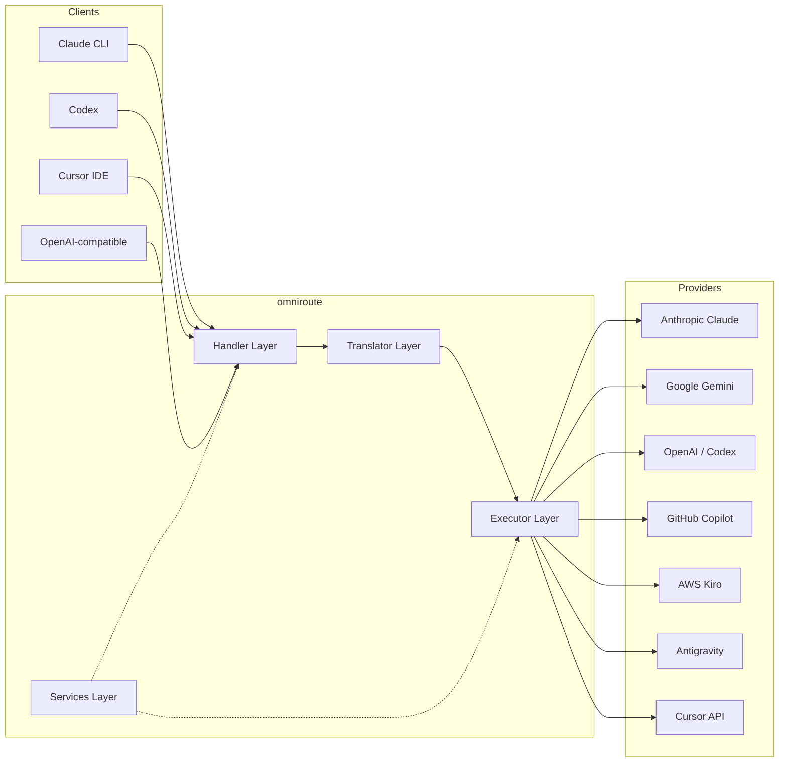

### Základný princíp: Hub-and-Spoke Translation

Celý preklad formátu prechádza cez **formát OpenAI ako centrum**:

```
Client Format → [OpenAI Hub] → Provider Format    (request)
Provider Format → [OpenAI Hub] → Client Format    (response)
```

To znamená, že potrebujete iba **N prekladateľov** (jeden na formát) namiesto **N²** (každý pár).

---

## 3. Štruktúra projektu

```
omniroute/
├── open-sse/                  ← Core proxy library (portable, framework-agnostic)
│   ├── index.js               ← Main entry point, exports everything
│   ├── config/                ← Configuration & constants
│   ├── executors/             ← Provider-specific request execution
│   ├── handlers/              ← Request handling orchestration
│   ├── services/              ← Business logic (auth, models, fallback, usage)
│   ├── translator/            ← Format translation engine
│   │   ├── request/           ← Request translators (8 files)
│   │   ├── response/          ← Response translators (7 files)
│   │   └── helpers/           ← Shared translation utilities (6 files)
│   └── utils/                 ← Utility functions
├── src/                       ← Application layer (Express/Worker runtime)
│   ├── app/                   ← Web UI, API routes, middleware
│   ├── lib/                   ← Database, auth, and shared library code
│   ├── mitm/                  ← Man-in-the-middle proxy utilities
│   ├── models/                ← Database models
│   ├── shared/                ← Shared utilities (wrappers around open-sse)
│   ├── sse/                   ← SSE endpoint handlers
│   └── store/                 ← State management
├── data/                      ← Runtime data (credentials, logs)
│   └── provider-credentials.json   (external credentials override, gitignored)
└── tester/                    ← Test utilities
```

---

## 4. Rozdelenie podľa jednotlivých modulov

### 4.1 Config (`open-sse/config/`)

**Jediný zdroj pravdy** pre všetky konfigurácie poskytovateľov.

| Súbor                         | Účel                                                                                                                                                                                                                                                   |
| ----------------------------- | ------------------------------------------------------------------------------------------------------------------------------------------------------------------------------------------------------------------------------------------------------ |
| `constants.ts`                | `PROVIDERS` objekt so základnými adresami URL, povereniami OAuth (predvolené), hlavičkami a predvolenými systémovými výzvami pre každého poskytovateľa. Definuje tiež `HTTP_STATUS`, `ERROR_TYPES`, `COOLDOWN_MS`, `BACKOFF_CONFIG` a `SKIP_PATTERNS`. |
| `credentialLoader.ts`         | Načíta externé poverenia z `data/provider-credentials.json` a zlúči ich s pevne zakódovanými predvolenými nastaveniami v `PROVIDERS`. Udržuje tajomstvá mimo kontroly zdroja pri zachovaní spätnej kompatibility.                                      |
| `providerModels.ts`           | Centrálny register modelov: mapuje aliasy poskytovateľa → ID modelov. Funkcie ako `getModels()`, `getProviderByAlias()`.                                                                                                                               |
| `codexInstructions.ts`        | Systémové pokyny vložené do požiadaviek kódexu (obmedzenia úprav, pravidlá karantény, zásady schvaľovania).                                                                                                                                            |
| `defaultThinkingSignature.ts` | Predvolené „mysliace“ podpisy pre modely Claude a Gemini.                                                                                                                                                                                              |
| `ollamaModels.ts`             | Definícia schémy pre lokálne modely Ollama (názov, veľkosť, rodina, kvantizácia).                                                                                                                                                                      |

#### Tok načítania poverení

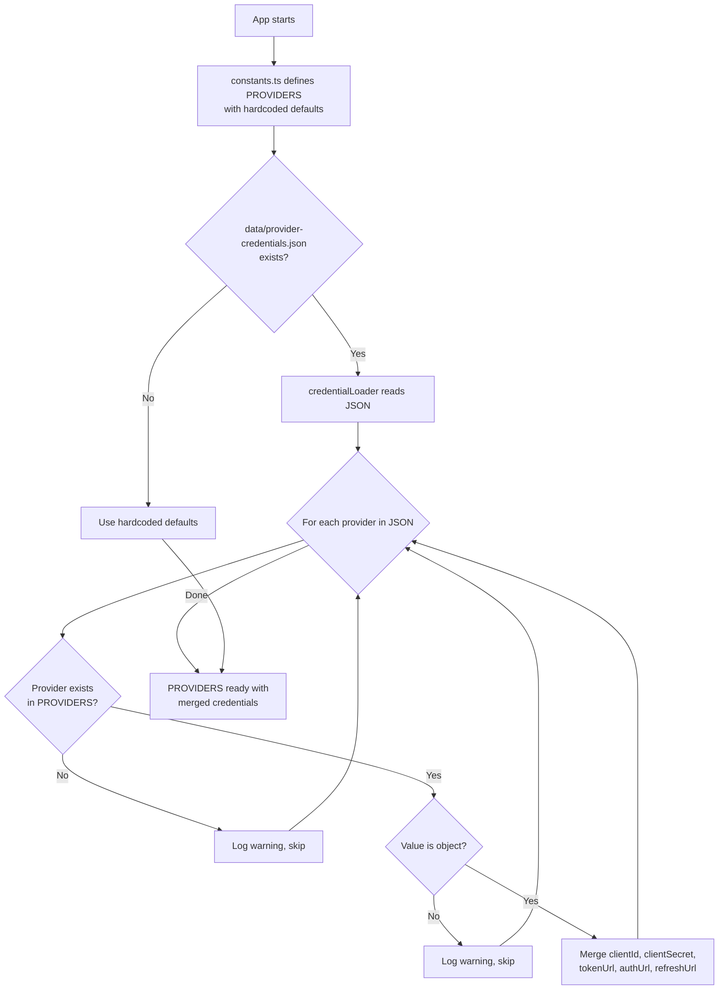

---

### 4.2 Vykonávatelia (`open-sse/executors/`)

Vykonávatelia zapuzdrujú **logiku špecifickú pre poskytovateľa** pomocou **Strategy Pattern**. Každý exekútor podľa potreby prepíše základné metódy.

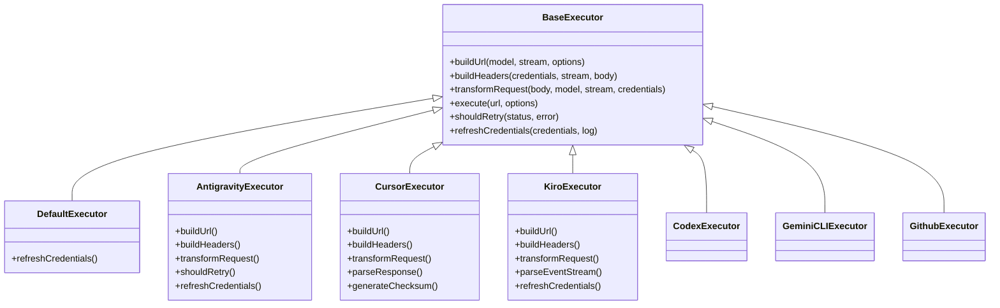

| Exekútor         | Poskytovateľ                               | Kľúčové špecializácie                                                                                                                           |
| ---------------- | ------------------------------------------ | ----------------------------------------------------------------------------------------------------------------------------------------------- |
| `base.ts`        | —                                          | Abstraktný základ: vytváranie URL, hlavičky, logika opakovania, obnovenie poverení                                                              |
| `default.ts`     | Claude, Gemini, OpenAI, GLM, Kimi, MiniMax | Obnovenie všeobecného tokenu OAuth pre štandardných poskytovateľov                                                                              |
| `antigravity.ts` | Google Cloud Code                          | Generovanie ID projektu/relácie, záložné riešenie s viacerými adresami URL, vlastná opätovná analýza chybových hlásení ("resetovať po 2h7m23s") |
| `cursor.ts`      | Kurzor IDE                                 | **Najkomplexnejšie**: overenie kontrolného súčtu SHA-256, kódovanie požiadavky Protobuf, binárny prúd udalostí → analýza odpovede SSE           |
| `codex.ts`       | Kódex OpenAI                               | Vkladá systémové pokyny, riadi úrovne myslenia, odstraňuje nepodporované parametre                                                              |
| `gemini-cli.ts`  | Google Gemini CLI                          | Vytvorenie vlastnej adresy URL (`streamGenerateContent`), obnovenie tokenu Google OAuth                                                         |
| `github.ts`      | GitHub Copilot                             | Systém duálneho tokenu (GitHub OAuth + token Copilot), napodobňovanie hlavičky VSCode                                                           |
| `kiro.ts`        | AWS CodeWhisperer                          | Binárne analyzovanie AWS EventStream, rámce udalostí AMZN, odhad tokenu                                                                         |
| `index.ts`       | —                                          | Továreň: názov poskytovateľa máp → trieda vykonávateľa, s predvolenou rezervou                                                                  |

---

### 4.3 obslužné nástroje (`open-sse/handlers/`)

**orchestačná vrstva** – koordinuje preklad, vykonávanie, streamovanie a spracovanie chýb.

| Súbor                 | Účel                                                                                                                                                                                                                                      |
| --------------------- | ----------------------------------------------------------------------------------------------------------------------------------------------------------------------------------------------------------------------------------------- |
| `chatCore.ts`         | **Central orchestrator** (~600 lines). Zvláda celý životný cyklus požiadavky: detekcia formátu → preklad → odoslanie vykonávateľa → odozva streamovania/nestreamovania → obnovenie tokenu → spracovanie chýb → protokolovanie používania. |
| `responsesHandler.ts` | Adaptér pre API Responses API OpenAI: konvertuje formát odpovedí → Dokončenia chatu → odosiela do `chatCore` → konvertuje SSE späť na formát odpovedí.                                                                                    |
| `embeddings.ts`       | Obslužný program generovania vkladania: rieši model vkladania → poskytovateľ, odošle poskytovateľovi API, vracia odpoveď na vkladanie kompatibilnú s OpenAI. Podporuje 6+ poskytovateľov.                                                 |
| `imageGeneration.ts`  | Obslužný program generovania obrázkov: rieši obrazový model → poskytovateľ, podporuje režimy kompatibilné s OpenAI, Gemini-image (Antigravity) a núdzový režim (Nebius). Vráti base64 alebo obrázky URL.                                  |

#### Životný cyklus žiadosti (chatCore.ts)

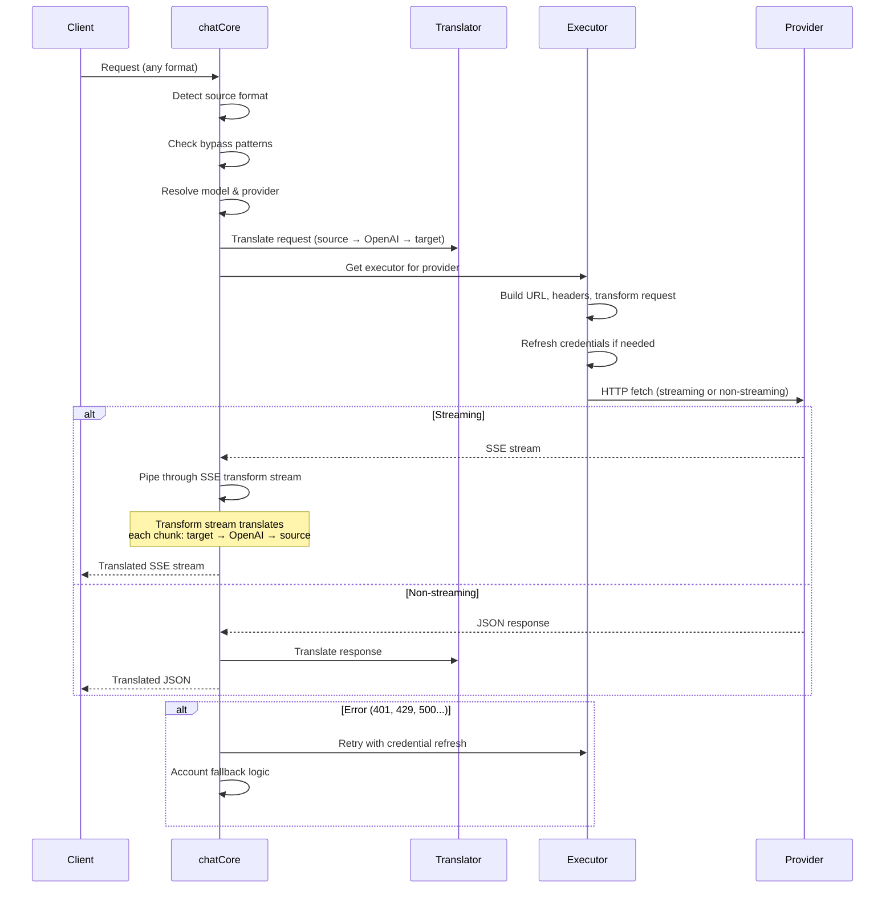

---

### 4.4 Služby (`open-sse/services/`)

Obchodná logika, ktorá podporuje manipulátory a vykonávateľov.

| Súbor                | Účel                                                                                                                                                                                                                                                                                                                                                                       |
| -------------------- | -------------------------------------------------------------------------------------------------------------------------------------------------------------------------------------------------------------------------------------------------------------------------------------------------------------------------------------------------------------------------- |
| `provider.ts`        | **Detekcia formátu** (`detectFormat`): analyzuje štruktúru tela požiadavky na identifikáciu formátov Claude/OpenAI/Gemini/Antigravity/Responses (zahŕňa heuristiku `max_tokens` pre Claude). Tiež: vytváranie adries URL, vytváranie hlavičiek, normalizácia konfigurácie myslenia. Podporuje dynamických poskytovateľov `openai-compatible-*` a `anthropic-compatible-*`. |
| `model.ts`           | Analýza reťazca modelu (`claude/model-name` → `{provider: "claude", model: "model-name"}`), rozlíšenie alias s detekciou kolízií, dezinfekcia vstupu (odmietne prechádzanie cesty/riadiace znaky) a rozlíšenie informácií o modeli s podporou asynchrónneho získavania aliasov.                                                                                            |
| `accountFallback.ts` | Spracovanie limitu rýchlosti: exponenciálne stiahnutie (1s → 2s → 4s → max 2min), správa ochladzovania účtu, klasifikácia chýb (ktoré chyby spúšťajú záložné riešenie a nie).                                                                                                                                                                                              |
| `tokenRefresh.ts`    | Obnovenie tokenu OAuth pre **každého poskytovateľa**: Google (Gemini, Antigravity), Claude, Codex, Qwen, iFlow, GitHub (dvojitý token OAuth + Copilot), Kiro (AWS SSO OIDC + Social Auth). Zahŕňa vyrovnávaciu pamäť na deduplikáciu sľubov počas letu a opakovanie s exponenciálnym sťahovaním.                                                                           |
| `combo.ts`           | **Kombinované modely**: reťazce záložných modelov. Ak model A zlyhá s chybou, ktorá je vhodná pre záložné riešenie, vyskúšajte model B, potom C atď. Vráti aktuálne stavové kódy proti prúdu.                                                                                                                                                                              |
| `usage.ts`           | Načítava údaje o kvótach/využívaní z rozhraní API poskytovateľa (kvóty GitHub Copilot, kvóty antigravitačného modelu, limity rýchlosti kódexu, rozpisy používania Kiro, nastavenia Claude).                                                                                                                                                                                |
| `accountSelector.ts` | Inteligentný výber účtu s algoritmom hodnotenia: zohľadňuje prioritu, zdravotný stav, priebežnú pozíciu a stav chladenia, aby sa vybral optimálny účet pre každú požiadavku.                                                                                                                                                                                               |
| `contextManager.ts`  | Správa životného cyklu kontextu požiadavky: vytvára a sleduje kontextové objekty pre každú požiadavku s metadátami (ID požiadavky, časové pečiatky, informácie o poskytovateľovi) na ladenie a protokolovanie.                                                                                                                                                             |
| `ipFilter.ts`        | Riadenie prístupu na základe IP: podporuje režimy zoznamu povolených a blokovaných. Pred spracovaním požiadaviek API overí IP klienta podľa nakonfigurovaných pravidiel.                                                                                                                                                                                                   |
| `sessionManager.ts`  | Sledovanie relácií pomocou odtlačkov prstov klienta: sleduje aktívne relácie pomocou hashovaných identifikátorov klienta, monitoruje počet žiadostí a poskytuje metriky relácie.                                                                                                                                                                                           |
| `signatureCache.ts`  | Vyrovnávacia pamäť pre deduplikáciu založenú na podpisoch: zabraňuje duplicitným požiadavkám tým, že ukladá do vyrovnávacej pamäte posledné podpisy požiadaviek a vracia odpovede uložené vo vyrovnávacej pamäti pre identické požiadavky v rámci časového okna.                                                                                                           |
| `systemPrompt.ts`    | Globálne vloženie systémovej výzvy: predpíše alebo pridá konfigurovateľnú systémovú výzvu ku všetkým požiadavkám so spracovaním kompatibility jednotlivých poskytovateľov.                                                                                                                                                                                                 |
| `thinkingBudget.ts`  | Správa rozpočtu tokenu uvažovania: podporuje režimy passthrough, auto (konfigurácia uvažovania v pásme), vlastné (pevný rozpočet) a adaptívne (škálované na komplexnosť) na riadenie tokenov myslenia/uvažovania.                                                                                                                                                          |
| `wildcardRouter.ts`  | Smerovanie vzoru zástupných znakov: rozdeľuje vzory zástupných znakov (napr. `*/claude-*`) na konkrétne páry poskytovateľ/model na základe dostupnosti a priority.                                                                                                                                                                                                         |

#### Deduplikácia obnovenia tokenu

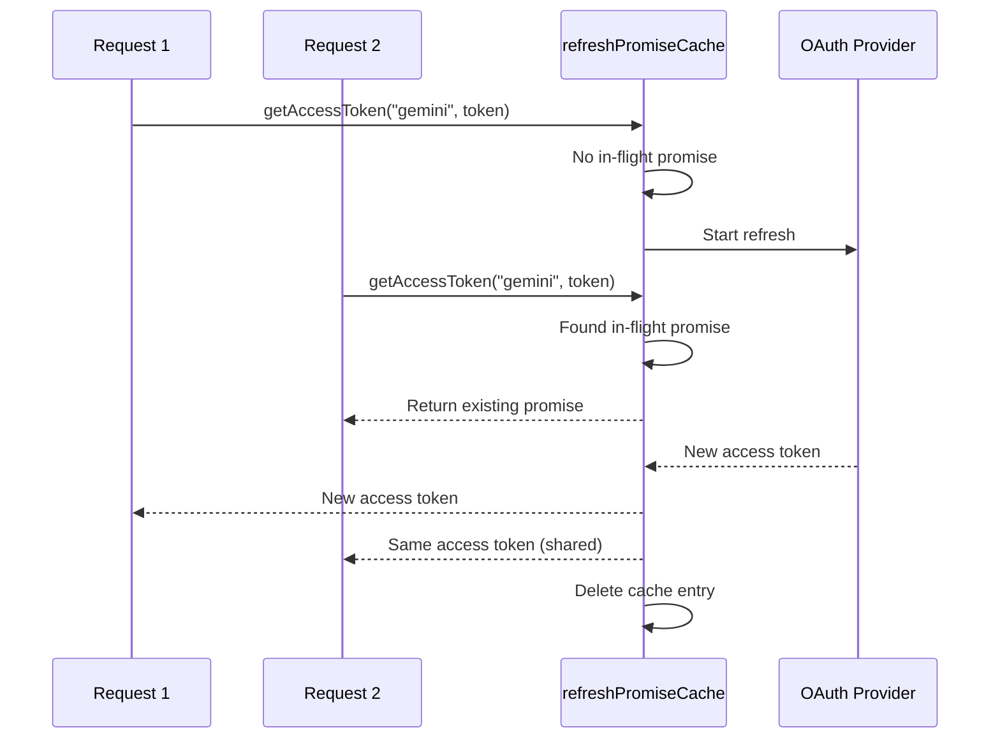

#### Stav záložného účtu

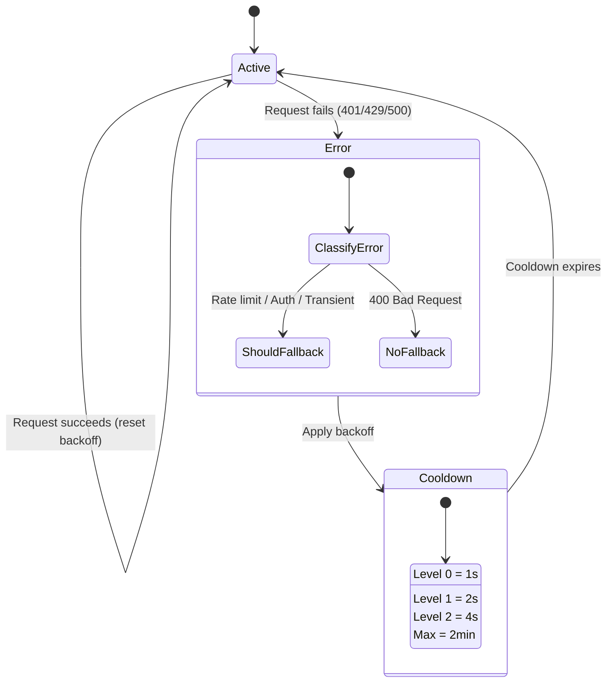

#### Kombinovaný modelový reťazec

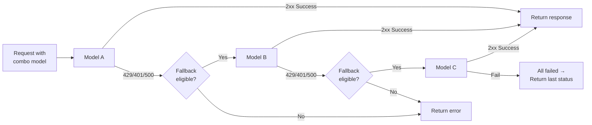

---

### 4.5 Translator (`open-sse/translator/`)

**Formátový prekladový nástroj** využívajúci samoregistračný systém doplnkov.

#### Architektúra

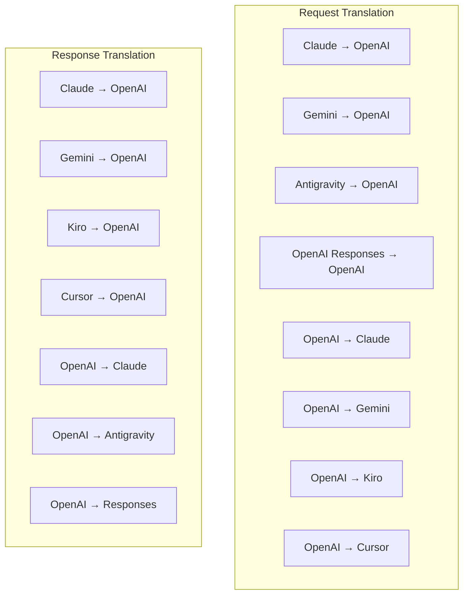

| Adresár      | Súbory          | Popis                                                                                                                                                                                                                                |
| ------------ | --------------- | ------------------------------------------------------------------------------------------------------------------------------------------------------------------------------------------------------------------------------------ |
| `request/`   | 8 prekladateľov | Prevod tela požiadaviek medzi formátmi. Každý súbor sa pri importe sám zaregistruje prostredníctvom `register(from, to, fn)`.                                                                                                        |
| `response/`  | 7 prekladateľov | Konvertujte časti odozvy streamovania medzi formátmi. Zvláda typy udalostí SSE, bloky myslenia, volania nástrojov.                                                                                                                   |
| `helpers/`   | 6 pomocníkov    | Zdieľané nástroje: `claudeHelper` (extrakcia systémového promptu, konfigurácia myslenia), `geminiHelper` (mapovanie častí/obsahu), `openaiHelper` (filtrovanie formátu), `toolCallHelper` (generovanie ID ), 1 `responsesApiHelper`. |
| `index.ts`   | —               | Prekladový stroj: `translateRequest()`, `translateResponse()`, správa štátu, registratúra.                                                                                                                                           |
| `formats.ts` | —               | Formátové konštanty: `OPENAI`, `CLAUDE`, `GEMINI`, `ANTIGRAVITY`, `KIRO`, ,                                                                                                                                                          |

#### Kľúčový dizajn: Samoregistračné doplnky

```javascript
// Each translator file calls register() on import:
import { register } from "../index.js";
register("claude", "openai", translateClaudeToOpenAI);

// The index.js imports all translator files, triggering registration:
import "./request/claude-to-openai.js"; // ← self-registers
```

---

### 4.6 Utils (`open-sse/utils/`)

| Súbor              | Účel                                                                                                                                                                                                                                                                                                                |
| ------------------ | ------------------------------------------------------------------------------------------------------------------------------------------------------------------------------------------------------------------------------------------------------------------------------------------------------------------- |
| `error.ts`         | Vytváranie odozvy na chyby (formát kompatibilný s OpenAI), analyzovanie chýb upstream, extrakcia opakovania antigravitácie z chybových správ, streamovanie chýb SSE.                                                                                                                                                |
| `stream.ts`        | **SSE Transform Stream** – hlavný streamingový kanál. Dva režimy: `TRANSLATE` (preklad plného formátu) a `PASSTHROUGH` (normalizácia + extrahovanie). Rieši ukladanie kúskov do vyrovnávacej pamäte, odhad využitia, sledovanie dĺžky obsahu. Inštancie kódovača/dekodéra podľa prúdu sa vyhýbajú zdieľanému stavu. |
| `streamHelpers.ts` | Nízkoúrovňové nástroje SSE: `parseSSELine` (tolerujúce biele miesta), `hasValuableContent` (filtruje prázdne časti pre OpenAI/Claude/Gemini), `fixInvalidId`, `formatSSE` (sériový formát so SformatSE\_) `perf_metrics` čistenie).                                                                                 |
| `usageTracking.ts` | Extrakcia použitia tokenov z ľubovoľného formátu (Claude/OpenAI/Gemini/Responses), odhad so samostatnými pomermi znakov na token/nástroje/správy, pridanie do vyrovnávacej pamäte (bezpečnostná rezerva 2000 tokenov), filtrovanie polí podľa formátu, protokolovanie konzoly s farbami ANSI.                       |
| `requestLogger.ts` | Protokolovanie žiadostí na základe súborov (prihlásenie cez `ENABLE_REQUEST_LOGS=true`). Vytvára priečinky relácie s očíslovanými súbormi: `1_req_client.json` → `7_res_client.txt`. Všetky I/O sú asynchrónne (fire-and-forget). Maskuje citlivé hlavičky.                                                         |
| `bypassHandler.ts` | Zachytáva špecifické vzory z Claude CLI (extrakcia titulov, zahrievanie, počet) a vracia falošné odpovede bez volania akéhokoľvek poskytovateľa. Podporuje streamovanie aj nestreamovanie. Zámerne obmedzené na rozsah Claude CLI.                                                                                  |
| `networkProxy.ts`  | Vyrieši adresu URL odchádzajúcej proxy pre daného poskytovateľa s prioritou: konfigurácia špecifická pre poskytovateľa → globálna konfigurácia → premenné prostredia (`HTTPS_PROXY`/`HTTP_PROXY`/`ALL_PROXY`). Podporuje `NO_PROXY` vylúčenia. Konfiguráciu vyrovnávacej pamäte na 30 sekúnd.                       |

#### Streamovací kanál SSE

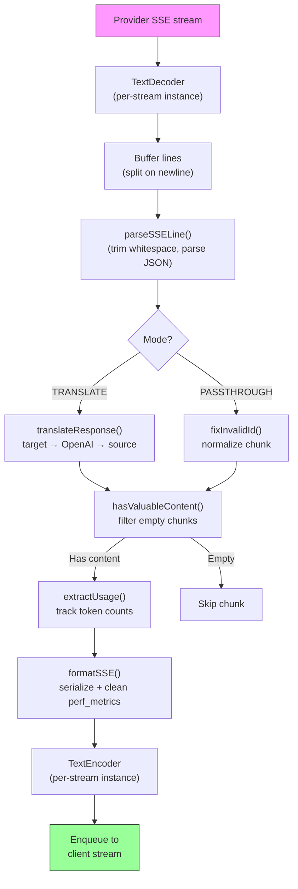

#### Požiadať o štruktúru relácie zapisovača

```
logs/
└── claude_gemini_claude-sonnet_20260208_143045/
    ├── 1_req_client.json      ← Raw client request
    ├── 2_req_source.json      ← After initial conversion
    ├── 3_req_openai.json      ← OpenAI intermediate format
    ├── 4_req_target.json      ← Final target format
    ├── 5_res_provider.txt     ← Provider SSE chunks (streaming)
    ├── 5_res_provider.json    ← Provider response (non-streaming)
    ├── 6_res_openai.txt       ← OpenAI intermediate chunks
    ├── 7_res_client.txt       ← Client-facing SSE chunks
    └── 6_error.json           ← Error details (if any)
```

---

### 4.7 Aplikačná vrstva (`src/`)

| Adresár       | Účel                                                                                          |
| ------------- | --------------------------------------------------------------------------------------------- |
| `src/app/`    | Web UI, API routes, Express middleware, OAuth obslužné programy pre spätné volania            |
| `src/lib/`    | Prístup k databáze (`localDb.ts`, `usageDb.ts`), overenie, zdieľané                           |
| `src/mitm/`   | Man-in-the-middle proxy nástroje na zachytenie prevádzky poskytovateľa                        |
| `src/models/` | Definície databázových modelov                                                                |
| `src/shared/` | Obal okolo funkcií open-sse (poskytovateľ, stream, chyba atď.)                                |
| `src/sse/`    | Obslužné nástroje koncových bodov SSE, ktoré prepájajú knižnicu open-sse s expresnými cestami |
| `src/store/`  | Správa stavu aplikácie                                                                        |

#### Pozoruhodné trasy API

| Trasa                                         | Metódy                | Účel                                                                                            |
| --------------------------------------------- | --------------------- | ----------------------------------------------------------------------------------------------- |
| `/api/provider-models`                        | ZÍSKAŤ/POSLAŤ/VYMAZAŤ | CRUD pre vlastné modely podľa poskytovateľa                                                     |
| `/api/models/catalog`                         | ZÍSKAJTE              | Súhrnný katalóg všetkých modelov (chat, embedding, image, custom) zoskupený podľa poskytovateľa |
| `/api/settings/proxy`                         | GET/PUT/DELETE        | Hierarchická konfigurácia outbound proxy (`global/providers/combos/keys`)                       |
| `/api/settings/proxy/test`                    | Zverejniť             | Overí pripojenie proxy a vráti verejnú IP/latenciu                                              |
| `/v1/providers/[provider]/chat/completions`   | Zverejniť             | Vyhradené dokončenia chatu podľa poskytovateľa s overením modelu                                |
| `/v1/providers/[provider]/embeddings`         | Zverejniť             | Vyhradené vloženia podľa jednotlivých poskytovateľov s overením modelu                          |
| `/v1/providers/[provider]/images/generations` | Zverejniť             | Vyhradené generovanie obrázkov podľa poskytovateľa s overením modelu                            |
| `/api/settings/ip-filter`                     | GET/PUT               | Správa zoznamu povolených/blokovaných IP                                                        |
| `/api/settings/thinking-budget`               | GET/PUT               | Konfigurácia rozpočtu tokenu odôvodnenia (priechodový/automatický/vlastný/adaptívny)            |
| `/api/settings/system-prompt`                 | GET/PUT               | Globálna systémová okamžitá injekcia pre všetky požiadavky                                      |
| `/api/sessions`                               | ZÍSKAJTE              | Sledovanie aktívnych relácií a metriky                                                          |
| `/api/rate-limits`                            | ZÍSKAJTE              | Stav limitu sadzby na účet                                                                      |

---

## 5. Kľúčové dizajnové vzory

### 5.1 Hub-and-Spoke preklad

Všetky formáty sa prekladajú cez **formát OpenAI ako centrum**. Pridanie nového poskytovateľa vyžaduje iba napísanie **jedného páru** prekladateľov (do/z OpenAI), nie N párov.

### 5.2 Vzor stratégie vykonávateľa

Každý poskytovateľ má vyhradenú triedu spúšťača, ktorá zdedí z `BaseExecutor`. Továreň v `executors/index.ts` vyberie ten správny za behu.

### 5.3 Systém zásuvných modulov s automatickou registráciou

Moduly prekladateľov sa pri importe zaregistrujú prostredníctvom `register()`. Pridanie nového prekladača je len vytvorenie súboru a jeho importovanie.

### 5.4 Zálohovanie účtu s exponenciálnym spätným odkladom

Keď poskytovateľ vráti 429/401/500, systém sa môže prepnúť na ďalší účet, pričom použije exponenciálne cooldowny (1s → 2s → 4s → max 2min).

### 5.5 Kombinované modelové reťaze

„Komba“ zoskupuje viacero reťazcov `provider/model`. Ak prvý zlyhá, automaticky sa vráťte k ďalšiemu.

### 5.6 Stavový preklad streamovania

Preklad odozvy udržiava stav naprieč kúskami SSE (sledovanie blokov myslenia, akumulácia volaní nástrojov, indexovanie blokov obsahu) prostredníctvom mechanizmu `initState()`.

### 5.7 Bezpečnostná vyrovnávacia pamäť používania

K nahlásenému použitiu je pridaná vyrovnávacia pamäť s 2000 tokenmi, aby sa klientom zabránilo naraziť na limity kontextového okna kvôli réžii systémových výziev a prekladu formátu.

---

## 6. Podporované formáty

| Formát                  | Smer         | Identifikátor      |
| ----------------------- | ------------ | ------------------ |
| Dokončenia chatu OpenAI | zdroj + cieľ | `openai`           |
| OpenAI Responses API    | zdroj + cieľ | `openai-responses` |
| Antropický Claude       | zdroj + cieľ | `claude`           |
| Google Gemini           | zdroj + cieľ | `gemini`           |
| Google Gemini CLI       | iba cieľ     | `gemini-cli`       |
| Antigravitácia          | zdroj + cieľ | `antigravity`      |
| AWS Kiro                | iba cieľ     | `kiro`             |
| Kurzor                  | iba cieľ     | `cursor`           |

---

## 7. Podporovaní poskytovatelia

| Poskytovateľ             | Spôsob overenia                   | Exekútor       | Kľúčové poznámky                                               |
| ------------------------ | --------------------------------- | -------------- | -------------------------------------------------------------- |
| Antropický Claude        | API kľúč alebo OAuth              | Predvolené     | Používa hlavičku `x-api-key`                                   |
| Google Gemini            | API kľúč alebo OAuth              | Predvolené     | Používa hlavičku `x-goog-api-key`                              |
| Google Gemini CLI        | OAuth                             | GeminiCLI      | Používa koncový bod `streamGenerateContent`                    |
| Antigravitácia           | OAuth                             | Antigravitácia | Záložná ochrana viacerých adries URL, vlastná opätovná analýza |
| OpenAI                   | API kľúč                          | Predvolené     | Štandardné overenie nosiča                                     |
| Kódex                    | OAuth                             | Kódex          | Vkladá systémové pokyny, riadi myslenie                        |
| GitHub Copilot           | OAuth + token Copilot             | Github         | Dvojitý token, hlavička VSCode napodobňujúca                   |
| Kiro (AWS)               | AWS SSO OIDC alebo sociálne siete | Kiro           | Analýza binárneho EventStreamu                                 |
| Kurzor IDE               | Overenie kontrolného súčtu        | Kurzor         | Kódovanie Protobuf, kontrolné súčty SHA-256                    |
| Qwen                     | OAuth                             | Predvolené     | Štandardné overenie                                            |
| iFlow                    | OAuth (základný + nosič)          | Predvolené     | Hlavička s dvojitým overením                                   |
| OpenRouter               | API kľúč                          | Predvolené     | Štandardné overenie nosiča                                     |
| GLM, Kimi, MiniMax       | API kľúč                          | Predvolené     | Kompatibilné s Claude, použite `x-api-key`                     |
| `openai-compatible-*`    | API kľúč                          | Predvolené     | Dynamický: akýkoľvek koncový bod kompatibilný s OpenAI         |
| `anthropic-compatible-*` | API kľúč                          | Predvolené     | Dynamický: akýkoľvek koncový bod kompatibilný s Claude         |

---

## 8. Zhrnutie toku údajov

### Žiadosť o streamovanie

```mermaid
flowchart LR
    A["Client"] --> B["detectFormat()"]
    B --> C["translateRequest()\nsource → OpenAI → target"]
    C --> D["Executor\nbuildUrl + buildHeaders"]
    D --> E["fetch(providerURL)"]
    E --> F["createSSEStream()\nTRANSLATE mode"]
    F --> G["parseSSELine()"]
    G --> H["translateResponse()\ntarget → OpenAI → source"]
    H --> I["extractUsage()\n+ addBuffer"]
    I --> J["formatSSE()"]
    J --> K["Client receives\ntranslated SSE"]
    K --> L["logUsage()\nsaveRequestUsage()"]
```

### Žiadosť o nestreamovanie

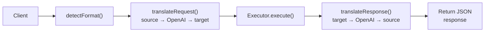

### Obtokový tok (Claude CLI)

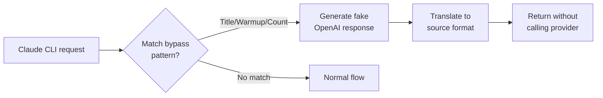
