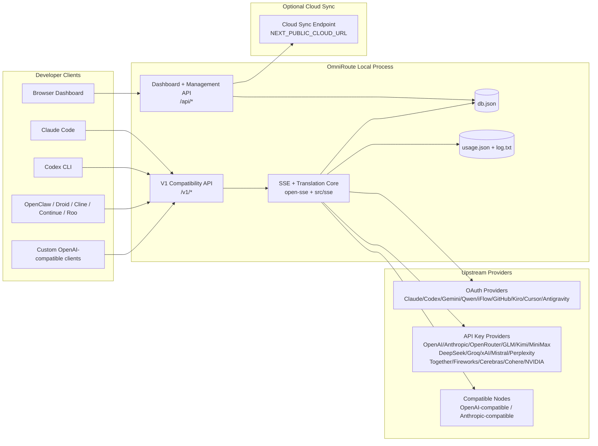
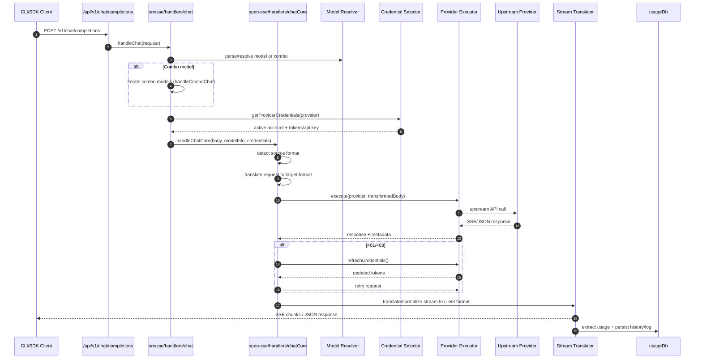
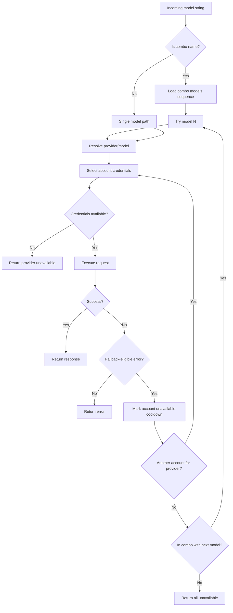
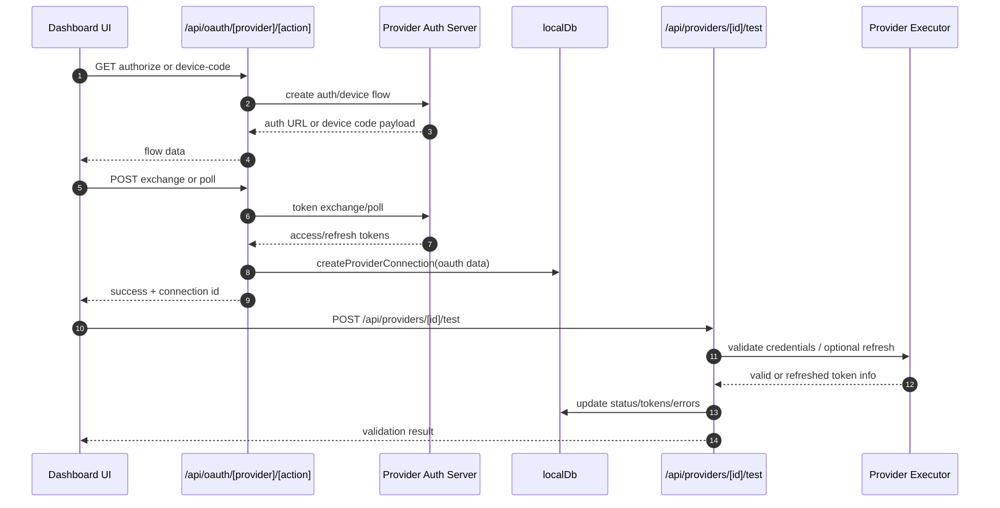
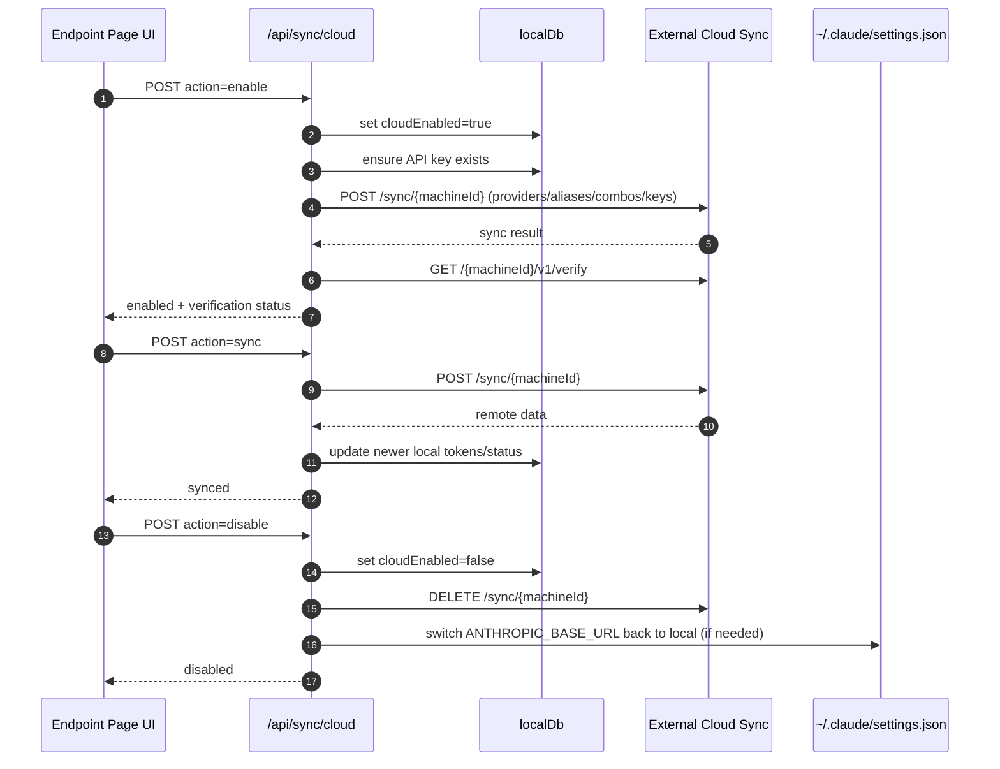
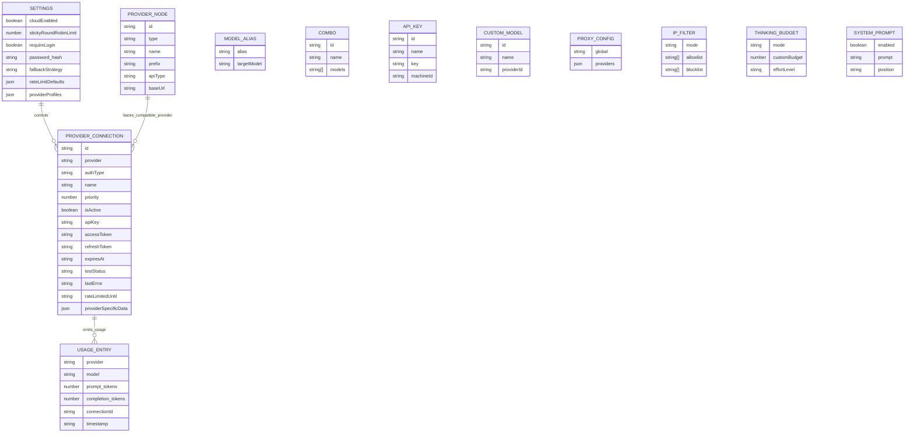
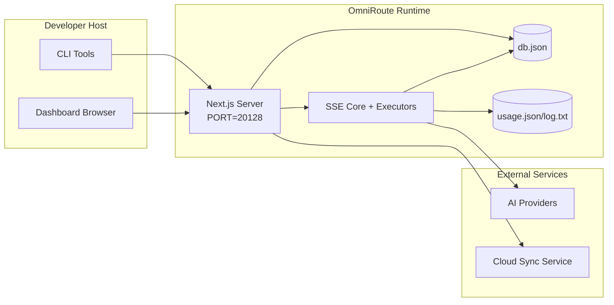

# OmniRoute-arkitektur

🌐 **Languages:** 🇺🇸 [English](../../ARCHITECTURE.md) | 🇧🇷 [Português (Brasil)](../pt-BR/ARCHITECTURE.md) | 🇪🇸 [Español](../es/ARCHITECTURE.md) | 🇫🇷 [Français](../fr/ARCHITECTURE.md) | 🇮🇹 [Italiano](../it/ARCHITECTURE.md) | 🇷🇺 [Русский](../ru/ARCHITECTURE.md) | 🇨🇳 [中文 (简体)](../zh-CN/ARCHITECTURE.md) | 🇩🇪 [Deutsch](../de/ARCHITECTURE.md) | 🇮🇳 [हिन्दी](../in/ARCHITECTURE.md) | 🇹🇭 [ไทย](../th/ARCHITECTURE.md) | 🇺🇦 [Українська](../uk-UA/ARCHITECTURE.md) | 🇸🇦 [العربية](../ar/ARCHITECTURE.md) | 🇯🇵 [日本語](../ja/ARCHITECTURE.md) | 🇻🇳 [Tiếng Việt](../vi/ARCHITECTURE.md) | 🇧🇬 [Български](../bg/ARCHITECTURE.md) | 🇩🇰 [Dansk](../da/ARCHITECTURE.md) | 🇫🇮 [Suomi](../fi/ARCHITECTURE.md) | 🇮🇱 [עברית](../he/ARCHITECTURE.md) | 🇭🇺 [Magyar](../hu/ARCHITECTURE.md) | 🇮🇩 [Bahasa Indonesia](../id/ARCHITECTURE.md) | 🇰🇷 [한국어](../ko/ARCHITECTURE.md) | 🇲🇾 [Bahasa Melayu](../ms/ARCHITECTURE.md) | 🇳🇱 [Nederlands](../nl/ARCHITECTURE.md) | 🇳🇴 [Norsk](../no/ARCHITECTURE.md) | 🇵🇹 [Português (Portugal)](../pt/ARCHITECTURE.md) | 🇷🇴 [Română](../ro/ARCHITECTURE.md) | 🇵🇱 [Polski](../pl/ARCHITECTURE.md) | 🇸🇰 [Slovenčina](../sk/ARCHITECTURE.md) | 🇸🇪 [Svenska](../sv/ARCHITECTURE.md) | 🇵🇭 [Filipino](../phi/ARCHITECTURE.md)

_Senast uppdaterad: 2026-02-18_

## Sammanfattning

OmniRoute är en lokal AI-routinggateway och instrumentpanel byggd på Next.js.
Den tillhandahåller en enda OpenAI-kompatibel slutpunkt (`/v1/*`) och dirigerar trafik över flera uppströmsleverantörer med översättning, reserv, tokenuppdatering och användningsspårning.

Kärnfunktioner:

- OpenAI-kompatibel API-yta för CLI/verktyg (28 leverantörer)
- Begäran/svar översättning över leverantörsformat
- Modellkombination fallback (flermodellsekvens)
- Reservkonto på kontonivå (flera konto per leverantör)
- Anslutningshantering för OAuth + API-nyckelleverantör
- Inbäddningsgenerering via `/v1/embeddings` (6 leverantörer, 9 modeller)
- Bildgenerering via `/v1/images/generations` (4 leverantörer, 9 modeller)
- Tänk taggparsning (`<think>...</think>`) för resonemangsmodeller
- Svarssanering för strikt OpenAI SDK-kompatibilitet
- Rollnormalisering (utvecklare→system, system→användare) för kompatibilitet mellan olika leverantörer
- Strukturerad utdatakonvertering (json_schema → Gemini responseSchema)
- Lokal beständighet för leverantörer, nycklar, alias, kombinationer, inställningar, prissättning
- Användnings-/kostnadsspårning och förfrågningsloggning
- Valfri molnsynkronisering för synkronisering av flera enheter/tillstånd
- IP-godkännandelista/blockeringslista för API-åtkomstkontroll
- Tänkande budgethantering (genomföring/auto/custom/adaptiv)
- Global systeminjektion
- Sessionsspårning och fingeravtryck
- Förbättrad prisbegränsning per konto med leverantörsspecifika profiler
- Strömbrytarmönster för leverantörens motståndskraft
- Åskskyddande flockskydd med mutex-låsning
- Signaturbaserad cache för begärandeduplicering
- Domänlager: modelltillgänglighet, kostnadsregler, reservpolicy, lockoutpolicy
- Beständig domäntillstånd (SQLite-genomskrivningscache för reservdelar, budgetar, lockouter, strömbrytare)
- Policymotor för centraliserad förfrågningsutvärdering (lockout → budget → reserv)
- Begär telemetri med p50/p95/p99 latensaggregation
- Korrelations-ID (X-Request-Id) för spårning från början till slut
- Loggning av efterlevnadsrevision med opt-out per API-nyckel
- Utvärderingsramverk för LLM kvalitetssäkring
- Resilience UI-instrumentpanel med strömbrytarstatus i realtid
- Modulära OAuth-leverantörer (12 individuella moduler under `src/lib/oauth/providers/`)

Primär körtidsmodell:

- Next.js-apprutter under `src/app/api/*` implementerar både instrumentpanelens API:er och kompatibilitets-API:er
- En delad SSE/routingkärna i `src/sse/*` + `open-sse/*` hanterar leverantörsexekvering, översättning, streaming, reserv och användning

## Omfattning och gränser

### I omfattning

- Lokal gateway körtid
- Dashboard management API:er
- Leverantörsautentisering och tokenuppdatering
- Begär översättning och SSE-streaming
- Lokal stat + användningsbeständighet
- Valfri molnsynkroniseringsorkestrering

### Utanför räckvidd

- Implementering av molntjänster bakom `NEXT_PUBLIC_CLOUD_URL`
- Leverantör SLA/kontrollplan utanför lokal process
- Externa CLI-binärer själva (Claude CLI, Codex CLI, etc.)

## Systemkontext på hög nivå



## Core Runtime Components

## 1) API och Routing Layer (Next.js App Routes)

Huvudkataloger:

- `src/app/api/v1/*` och `src/app/api/v1beta/*` för kompatibilitets-API:er
- `src/app/api/*` för hanterings-/konfigurations-API:er
- Nästa omskrivning i `next.config.mjs` kartan `/v1/*` till `/api/v1/*`

Viktiga kompatibilitetsvägar:

- `src/app/api/v1/chat/completions/route.ts`
- `src/app/api/v1/messages/route.ts`
- `src/app/api/v1/responses/route.ts`
- `src/app/api/v1/models/route.ts` — inkluderar anpassade modeller med `custom: true`
- `src/app/api/v1/embeddings/route.ts` — inbäddningsgenerering (6 leverantörer)
- `src/app/api/v1/images/generations/route.ts` — bildgenerering (4+ leverantörer inkl. Antigravity/Nebius)
- `src/app/api/v1/messages/count_tokens/route.ts`
- `src/app/api/v1/providers/[provider]/chat/completions/route.ts` — dedikerad chatt per leverantör
- `src/app/api/v1/providers/[provider]/embeddings/route.ts` — dedikerade inbäddningar per leverantör
- `src/app/api/v1/providers/[provider]/images/generations/route.ts` — dedikerade bilder per leverantör
- `src/app/api/v1beta/models/route.ts`
- `src/app/api/v1beta/models/[...path]/route.ts`

Hanteringsdomäner:

- Auth/inställningar: `src/app/api/auth/*`, `src/app/api/settings/*`
- Leverantörer/anslutningar: `src/app/api/providers*`
- Leverantörsnoder: `src/app/api/provider-nodes*`
- Anpassade modeller: `src/app/api/provider-models` (GET/POST/DELETE)
- Modellkatalog: `src/app/api/models/catalog` (GET)
- Proxykonfiguration: `src/app/api/settings/proxy` (GET/PUT/DELETE) + `src/app/api/settings/proxy/test` (POST)
- OAuth: `src/app/api/oauth/*`
- Nycklar/alias/kombinationer/prissättning: `src/app/api/keys*`, `src/app/api/models/alias`, `src/app/api/combos*`, `src/app/api/pricing`
- Användning: `src/app/api/usage/*`
- Synkronisera/moln: `src/app/api/sync/*`, `src/app/api/cloud/*`
- CLI-verktygshjälpare: `src/app/api/cli-tools/*`
- IP-filter: `src/app/api/settings/ip-filter` (GET/PUT)
- Tänkande budget: `src/app/api/settings/thinking-budget` (GET/PUT)
- Systemprompt: `src/app/api/settings/system-prompt` (GET/PUT)
- Sessioner: `src/app/api/sessions` (GET)
- Prisgränser: `src/app/api/rate-limits` (GET)
- Motståndskraft: `src/app/api/resilience` (GET/PATCH) — leverantörsprofiler, strömbrytare, hastighetsgränstillstånd
- Återställning av motståndskraft: `src/app/api/resilience/reset` (POST) — återställ brytare + nedkylningar
- Cachestatistik: `src/app/api/cache/stats` (GET/DELETE)
- Modelltillgänglighet: `src/app/api/models/availability` (GET/POST)
- Telemetri: `src/app/api/telemetry/summary` (GET)
- Budget: `src/app/api/usage/budget` (GET/POST)
- Reservkedjor: `src/app/api/fallback/chains` (GET/POST/DELETE)
- Efterlevnadsrevision: `src/app/api/compliance/audit-log` (GET)
- Evaler: `src/app/api/evals` (GET/POST), `src/app/api/evals/[suiteId]` (GET)
- Policyer: `src/app/api/policies` (GET/POST)

## 2) SSE + Translation Core

Huvudflödesmoduler:

- Inträde: `src/sse/handlers/chat.ts`
- Kärnorkestrering: `open-sse/handlers/chatCore.ts`
- Leverantörs exekveringsadaptrar: `open-sse/executors/*`
- Formatidentifiering/leverantörskonfiguration: `open-sse/services/provider.ts`
- Modellanalys/upplösning: `src/sse/services/model.ts`, `open-sse/services/model.ts`
- Reservlogik för konto: `open-sse/services/accountFallback.ts`
- Översättningsregister: `open-sse/translator/index.ts`
- Strömomvandlingar: `open-sse/utils/stream.ts`, `open-sse/utils/streamHandler.ts`
- Användningsextraktion/normalisering: `open-sse/utils/usageTracking.ts`
- Tänk taggtolkare: `open-sse/utils/thinkTagParser.ts`
- Inbäddningshanterare: `open-sse/handlers/embeddings.ts`
- Inbäddningsleverantörsregister: `open-sse/config/embeddingRegistry.ts`
- Hanterare för bildgenerering: `open-sse/handlers/imageGeneration.ts`
- Bildleverantörsregister: `open-sse/config/imageRegistry.ts`
- Svarssanering: `open-sse/handlers/responseSanitizer.ts`
- Rollnormalisering: `open-sse/services/roleNormalizer.ts`

Tjänster (affärslogik):

- Val av konto/poäng: `open-sse/services/accountSelector.ts`
- Kontextlivscykelhantering: `open-sse/services/contextManager.ts`
- IP-filtertillämpning: `open-sse/services/ipFilter.ts`
- Sessionsspårning: `open-sse/services/sessionManager.ts`
- Begär deduplicering: `open-sse/services/signatureCache.ts`
- Systemprompt injektion: `open-sse/services/systemPrompt.ts`
- Tänkande budgethantering: `open-sse/services/thinkingBudget.ts`
- Jokertecken modell routing: `open-sse/services/wildcardRouter.ts`
- Hantering av prisgränser: `open-sse/services/rateLimitManager.ts`
- Strömbrytare: `open-sse/services/circuitBreaker.ts`

Domänlagermoduler:

- Modelltillgänglighet: `src/lib/domain/modelAvailability.ts`
- Kostnadsregler/budgetar: `src/lib/domain/costRules.ts`
- Reservpolicy: `src/lib/domain/fallbackPolicy.ts`
- Kombinationslösare: `src/lib/domain/comboResolver.ts`
- Lockoutpolicy: `src/lib/domain/lockoutPolicy.ts`
- Policymotor: `src/domain/policyEngine.ts` — centraliserad lockout → budget → reservutvärdering
- Felkodskatalog: `src/lib/domain/errorCodes.ts`
- Begärans ID: `src/lib/domain/requestId.ts`
- Timeout för hämtning: `src/lib/domain/fetchTimeout.ts`
- Begär telemetri: `src/lib/domain/requestTelemetry.ts`
- Efterlevnad/revision: `src/lib/domain/compliance/index.ts`
- Eval löpare: `src/lib/domain/evalRunner.ts`
- Beständig domäntillstånd: `src/lib/db/domainState.ts` — SQLite CRUD för reservkedjor, budgetar, kostnadshistorik, lockout-tillstånd, strömbrytare

OAuth-leverantörsmoduler (12 enskilda filer under `src/lib/oauth/providers/`):

- Registerindex: `src/lib/oauth/providers/index.ts`
- Individuella leverantörer: `claude.ts`, `codex.ts`, `gemini.ts`, `antigravity.ts`, `iflow.ts`, `qwen.ts`, **\*119**, **\_119**, `kiro.ts`, `cursor.ts`, `kilocode.ts`, `cline.ts`
- Tunt omslag: `src/lib/oauth/providers.ts` — återexport från enskilda moduler

## 3) Persistenslager

Primärt tillstånd DB:

- `src/lib/localDb.ts`
- fil: `${DATA_DIR}/db.json` (eller `$XDG_CONFIG_HOME/omniroute/db.json` när inställd, annars `~/.omniroute/db.json`)
- enheter: providerConnections, providerNodes, modelAlias, combos, apiKeys, settings, prissättning, **customModels**, **proxyConfig**, **ipFilter**, **thinkingBudget**, **systemPrompt**

Användnings-DB:

- `src/lib/usageDb.ts`
- filer: `${DATA_DIR}/usage.json`, `${DATA_DIR}/log.txt`, `${DATA_DIR}/call_logs/`
- följer samma baskatalogpolicy som `localDb` (`DATA_DIR`, sedan `XDG_CONFIG_HOME/omniroute` när inställd)
- uppdelad i fokuserade undermoduler: `migrations.ts`, `usageHistory.ts`, `costCalculator.ts`, `usageStats.ts`, `callLogs.ts`

Domain State DB (SQLite):

- `src/lib/db/domainState.ts` — CRUD-operationer för domäntillstånd
- Tabeller (skapade i `src/lib/db/core.ts`): `domain_fallback_chains`, `domain_budgets`, `domain_cost_history`, `domain_lockout_state`, `domain_circuit_breakers`
- Genomskrivningscachemönster: i minneskartor är auktoritativa under körning; mutationer skrivs synkront till SQLite; tillståndet återställs från DB vid kallstart

## 4) Auth + Säkerhetsytor

- Dashboard-cookieauth: `src/proxy.ts`, `src/app/api/auth/login/route.ts`
- Generering/verifiering av API-nyckel: `src/shared/utils/apiKey.ts`
- Leverantörshemligheter kvarstod i `providerConnections`-poster
- Utgående proxystöd via `open-sse/utils/proxyFetch.ts` (env vars) och `open-sse/utils/networkProxy.ts` (konfigurerbart per leverantör eller globalt)

## 5) Molnsynkronisering

- Schemaläggare init: `src/lib/initCloudSync.ts`, `src/shared/services/initializeCloudSync.ts`
- Periodisk uppgift: `src/shared/services/cloudSyncScheduler.ts`
- Kontrollrutt: `src/app/api/sync/cloud/route.ts`

## Begär livscykel (`/v1/chat/completions`)



## Combo + konto reservflöde



Reservbeslut drivs av `open-sse/services/accountFallback.ts` med hjälp av statuskoder och felmeddelandeheuristik.

## OAuth Onboarding och Token Refresh Lifecycle



Uppdatering under livetrafik utförs inuti `open-sse/handlers/chatCore.ts` via executorn `refreshCredentials()`.

## Cloud Sync Lifecycle (Aktivera / Synkronisera / Inaktivera)



Periodisk synkronisering utlöses av `CloudSyncScheduler` när molnet är aktiverat.

## Datamodell och lagringskarta



Fysiska lagringsfiler:

- huvudtillstånd: `${DATA_DIR}/db.json` (eller `$XDG_CONFIG_HOME/omniroute/db.json` när inställt, annars `~/.omniroute/db.json`)
- användningsstatistik: `${DATA_DIR}/usage.json`
- begär loggrader: `${DATA_DIR}/log.txt`
- valfria översättare/begäran felsökningssessioner: `<repo>/logs/...`

## Distributionstopologi



## Modulmappning (beslutskritisk)

### Rutt- och API-moduler

- `src/app/api/v1/*`, `src/app/api/v1beta/*`: kompatibilitets-API:er
- `src/app/api/v1/providers/[provider]/*`: dedikerade rutter per leverantör (chatt, inbäddningar, bilder)
- `src/app/api/providers*`: leverantör CRUD, validering, testning
- `src/app/api/provider-nodes*`: anpassad kompatibel nodhantering
- `src/app/api/provider-models`: anpassad modellhantering (CRUD)
- `src/app/api/models/catalog`: fullständig modellkatalog API (alla typer grupperade efter leverantör)
- `src/app/api/oauth/*`: OAuth/enhetskod flöden
- `src/app/api/keys*`: lokal API-nyckellivscykel
- `src/app/api/models/alias`: aliashantering
- `src/app/api/combos*`: reservkombohantering
- `src/app/api/pricing`: åsidosättande av prissättning för kostnadsberäkning
- `src/app/api/settings/proxy`: proxykonfiguration (GET/PUT/DELETE)
- `src/app/api/settings/proxy/test`: test av utgående proxyanslutning (POST)
- `src/app/api/usage/*`: API:er för användning och loggar
- `src/app/api/sync/*` + `src/app/api/cloud/*`: molnsynkronisering och molnvända hjälpare
- `src/app/api/cli-tools/*`: lokala CLI-konfigurationsförfattare/checkers
- `src/app/api/settings/ip-filter`: IP-godkännandelista/blockeringslista (GET/PUT)
- `src/app/api/settings/thinking-budget`: budgetkonfig för tänkande token (GET/PUT)
- `src/app/api/settings/system-prompt`: global systemprompt (GET/PUT)
- `src/app/api/sessions`: aktiv sessionslista (GET)
- `src/app/api/rate-limits`: räntegränsstatus per konto (GET)

### Routing and Execution Core

- `src/sse/handlers/chat.ts`: begäran om analys, kombinationshantering, kontovalsloop
- `open-sse/handlers/chatCore.ts`: översättning, exekutorutskick, försök igen/uppdatera hantering, strömkonfiguration
- `open-sse/executors/*`: leverantörsspecifikt nätverk och formatbeteende

### Översättningsregister och formatomvandlare

- `open-sse/translator/index.ts`: översättarregister och orkestrering
- Begär översättare: `open-sse/translator/request/*`
- Svarsöversättare: `open-sse/translator/response/*`
- Formatkonstanter: `open-sse/translator/formats.ts`

### Uthållighet

- `src/lib/localDb.ts`: beständig konfiguration/tillstånd
- `src/lib/usageDb.ts`: användningshistorik och rullande förfrågningsloggar

## Provider Executor Täckning (strategimönster)

Varje leverantör har en specialiserad exekutor som utökar `BaseExecutor` (i `open-sse/executors/base.ts`), som tillhandahåller URL-byggande, rubrikkonstruktion, återförsök med exponentiell backoff, autentiseringsuppdateringskrokar och `execute()` orkestreringsmetoden.

| Exekutor              | Leverantör(er)                                                                                                                                               | Specialhantering                                                               |
| --------------------- | ------------------------------------------------------------------------------------------------------------------------------------------------------------ | ------------------------------------------------------------------------------ |
| `DefaultExecutor`     | OpenAI, Claude, Gemini, Qwen, iFlow, OpenRouter, GLM, Kimi, MiniMax, DeepSeek, Groq, xAI, Mistral, Perplexity, Together, Fireworks, Cerebras, Cohere, NVIDIA | Dynamisk URL/header-konfiguration per leverantör                               |
| `AntigravityExecutor` | Google Antigravity                                                                                                                                           | Anpassade projekt-/sessions-ID:n, försök igen-efter analys                     |
| `CodexExecutor`       | OpenAI Codex                                                                                                                                                 | Injicerar systeminstruktioner, tvingar fram resonemang                         |
| `CursorExecutor`      | Markör IDE                                                                                                                                                   | ConnectRPC-protokoll, Protobuf-kodning, begäran om signering via kontrollsumma |
| `GithubExecutor`      | GitHub Copilot                                                                                                                                               | Copilot token uppdatering, VSCode-härmar rubriker                              |
| `KiroExecutor`        | AWS CodeWhisperer/Kiro                                                                                                                                       | AWS EventStream binärt format → SSE-konvertering                               |
| `GeminiCLIExecutor`   | Gemini CLI                                                                                                                                                   | Uppdateringscykel för Google OAuth-token                                       |

Alla andra leverantörer (inklusive anpassade kompatibla noder) använder `DefaultExecutor`.

## Leverantörskompatibilitetsmatris

| Leverantör       | Format          | Auth                   | Streama          | Icke-stream | Token Refresh | Användnings-API       |
| ---------------- | --------------- | ---------------------- | ---------------- | ----------- | ------------- | --------------------- |
| Claude           | claude          | API-nyckel / OAuth     | ✅               | ✅          | ✅            | ⚠️ Endast admin       |
| Tvillingarna     | Tvillingarna    | API-nyckel / OAuth     | ✅               | ✅          | ✅            | ⚠️ Cloud Console      |
| Gemini CLI       | gemini-cli      | OAuth                  | ✅               | ✅          | ✅            | ⚠️ Cloud Console      |
| Antigravitation  | antigravitation | OAuth                  | ✅               | ✅          | ✅            | ✅ Full kvot API      |
| OpenAI           | openai          | API-nyckel             | ✅               | ✅          | ❌            | ❌                    |
| Codex            | openai-svar     | OAuth                  | ✅ tvingad       | ❌          | ✅            | ✅ Prisgränser        |
| GitHub Copilot   | openai          | OAuth + Copilot Token  | ✅               | ✅          | ✅            | ✅ Kvotbilder         |
| Markör           | markören        | Anpassad kontrollsumma | ✅               | ✅          | ❌            | ❌                    |
| Kiro             | kiro            | AWS SSO OIDC           | ✅ (EventStream) | ❌          | ✅            | ✅ Användningsgränser |
| Qwen             | openai          | OAuth                  | ✅               | ✅          | ✅            | ⚠️ Per förfrågan      |
| iFlow            | openai          | OAuth (Grundläggande)  | ✅               | ✅          | ✅            | ⚠️ Per förfrågan      |
| OpenRouter       | openai          | API-nyckel             | ✅               | ✅          | ❌            | ❌                    |
| GLM/Kimi/MiniMax | claude          | API-nyckel             | ✅               | ✅          | ❌            | ❌                    |
| DeepSeek         | openai          | API-nyckel             | ✅               | ✅          | ❌            | ❌                    |
| Groq             | openai          | API-nyckel             | ✅               | ✅          | ❌            | ❌                    |
| xAI (Grok)       | openai          | API-nyckel             | ✅               | ✅          | ❌            | ❌                    |
| Mistral          | openai          | API-nyckel             | ✅               | ✅          | ❌            | ❌                    |
| Förvirring       | openai          | API-nyckel             | ✅               | ✅          | ❌            | ❌                    |
| Tillsammans AI   | openai          | API-nyckel             | ✅               | ✅          | ❌            | ❌                    |
| Fireworks AI     | openai          | API-nyckel             | ✅               | ✅          | ❌            | ❌                    |
| Cerebras         | openai          | API-nyckel             | ✅               | ✅          | ❌            | ❌                    |
| Sammanhålla      | openai          | API-nyckel             | ✅               | ✅          | ❌            | ❌                    |
| NVIDIA NIM       | openai          | API-nyckel             | ✅               | ✅          | ❌            | ❌                    |

## Formatöversättningstäckning

Upptäckta källformat inkluderar:

- `openai`
- `openai-responses`
- `claude`
- `gemini`

Målformat inkluderar:

- OpenAI chatt/svar
- Claude
- Gemini/Gemini-CLI/Antigravity kuvert
- Kiro
- Markör

Översättningar använder **OpenAI som navformat** — alla konverteringar går via OpenAI som mellanliggande:

```
Source Format → OpenAI (hub) → Target Format
```

Översättningar väljs dynamiskt baserat på källnyttolastens form och leverantörens målformat.

Ytterligare bearbetningslager i översättningspipelinen:

- **Responssanering** — Tar bort icke-standardiserade fält från svar i OpenAI-format (både strömmande och icke-strömmande) för att säkerställa strikt SDK-efterlevnad
- **Rollnormalisering** — Konverterar `developer` → `system` för icke-OpenAI-mål; slår samman `system` → `user` för modeller som avvisar systemrollen (GLM, ERNIE)
- **Tänk taggextraktion** — Parsar `<think>...</think>` block från innehåll till fältet `reasoning_content`
- **Structured output** — Konverterar OpenAI `response_format.json_schema` till Gemini's `responseMimeType` + `responseSchema`

## API-slutpunkter som stöds

| Slutpunkt                                          | Format              | Handlare                                                  |
| -------------------------------------------------- | ------------------- | --------------------------------------------------------- |
| `POST /v1/chat/completions`                        | OpenAI Chat         | `src/sse/handlers/chat.ts`                                |
| `POST /v1/messages`                                | Claude Meddelanden  | Samma hanterare (automatiskt upptäckt)                    |
| `POST /v1/responses`                               | OpenAI-svar         | `open-sse/handlers/responsesHandler.ts`                   |
| `POST /v1/embeddings`                              | OpenAI Inbäddningar | `open-sse/handlers/embeddings.ts`                         |
| `GET /v1/embeddings`                               | Modelllista         | API-rutt                                                  |
| `POST /v1/images/generations`                      | OpenAI bilder       | `open-sse/handlers/imageGeneration.ts`                    |
| `GET /v1/images/generations`                       | Modelllista         | API-rutt                                                  |
| `POST /v1/providers/{provider}/chat/completions`   | OpenAI Chat         | Dedikerad per leverantör med modellvalidering             |
| `POST /v1/providers/{provider}/embeddings`         | OpenAI Inbäddningar | Dedikerad per leverantör med modellvalidering             |
| `POST /v1/providers/{provider}/images/generations` | OpenAI bilder       | Dedikerad per leverantör med modellvalidering             |
| `POST /v1/messages/count_tokens`                   | Claude Token Count  | API-rutt                                                  |
| `GET /v1/models`                                   | OpenAI-modelllista  | API-rutt (chatt + inbäddning + bild + anpassade modeller) |
| `GET /api/models/catalog`                          | Katalog             | Alla modeller grupperade efter leverantör + typ           |
| `POST /v1beta/models/*:streamGenerateContent`      | Tvillinginfödd      | API-rutt                                                  |
| `GET/PUT/DELETE /api/settings/proxy`               | Proxykonfiguration  | Nätverksproxykonfiguration                                |
| `POST /api/settings/proxy/test`                    | Proxyanslutning     | Proxy hälsa/anslutningstest slutpunkt                     |
| `GET/POST/DELETE /api/provider-models`             | Anpassade modeller  | Anpassad modellhantering per leverantör                   |

## Bypass-hanterare

Bypass-hanteraren (`open-sse/utils/bypassHandler.ts`) fångar upp kända "kastningsförfrågningar" från Claude CLI – uppvärmningsping, titelextraktioner och tokenräkningar – och returnerar ett **falskt svar** utan att konsumera uppströmsleverantörstokens. Detta utlöses endast när `User-Agent` innehåller `claude-cli`.

## Begär Logger Pipeline

Begäranloggaren (`open-sse/utils/requestLogger.ts`) tillhandahåller en 7-stegs felsökningsloggningspipeline, inaktiverad som standard, aktiverad via `ENABLE_REQUEST_LOGS=true`:

```
1_req_client.json → 2_req_source.json → 3_req_openai.json → 4_req_target.json
→ 5_res_provider.txt → 6_res_openai.txt → 7_res_client.txt
```

Filer skrivs till `<repo>/logs/<session>/` för varje begäranssession.

## Fellägen och motståndskraft

## 1) Tillgänglighet för konto/leverantör

- Nedkylning av leverantörskonto på övergående/hastighets-/auth-fel
- reservkonto innan begäran misslyckas
- kombimodell fallback när nuvarande modell/leverantörsväg är uttömd

## 2) Tokens utgång

- Förkontroll och uppdatera med ett nytt försök för uppdateringsbara leverantörer
- 401/403 försök igen efter uppdateringsförsök i kärnvägen

## 3) Strömsäkerhet

- frånkopplingsmedveten strömkontroller
- översättningsström med end-of-stream-spolning och `[DONE]`-hantering
- användningsuppskattning fallback när leverantörens användningsmetadata saknas

## 4) Molnsynkroniseringsförsämring

- Synkroniseringsfel dyker upp men den lokala körtiden fortsätter
- Schemaläggaren har logik som kan försöka igen, men periodisk exekvering anropar för närvarande synkronisering med ett enda försök som standard

## 5) Dataintegritet

- DB-formmigrering/reparation för saknade nycklar
- korrupta JSON-återställningsskydd för localDb och usageDb

## Observerbarhet och operativa signaler

Källor för synlighet vid körning:

- konsolloggar från `src/sse/utils/logger.ts`
- användningsaggregat per begäran i `usage.json`
- textförfrågan status logga in `log.txt`
- valfria djupa förfrågningar/översättningsloggar under `logs/` när `ENABLE_REQUEST_LOGS=true`
- slutpunkter för användning av instrumentpanelen (`/api/usage/*`) för användargränssnittsförbrukning

## Säkerhetskänsliga gränser

- JWT-hemlighet (`JWT_SECRET`) säkrar verifiering/signering av cookies på instrumentpanelen
- Initialt reservlösenord (`INITIAL_PASSWORD`, standard `123456`) måste åsidosättas i verkliga distributioner
- API-nyckel HMAC-hemlighet (`API_KEY_SECRET`) säkrar genererat lokalt API-nyckelformat
- Leverantörshemligheter (API-nycklar/tokens) finns kvar i lokal DB och bör skyddas på filsystemnivå
- Slutpunkter för molnsynkronisering är beroende av API-nyckelbehörighet + maskin-id-semantik

## Miljö- och körtidsmatris

Miljövariabler som används aktivt av kod:

- App/auth: `JWT_SECRET`, `INITIAL_PASSWORD`
- Lagring: `DATA_DIR`
- Kompatibelt nodbeteende: `ALLOW_MULTI_CONNECTIONS_PER_COMPAT_NODE`
- Valfri åsidosättning av lagringsbas (Linux/macOS när `DATA_DIR` inte är inställd): `XDG_CONFIG_HOME`
- Säkerhetshashing: `API_KEY_SECRET`, `MACHINE_ID_SALT`
- Loggning: `ENABLE_REQUEST_LOGS`
- Synkronisera/molnwebbadress: `NEXT_PUBLIC_BASE_URL`, `NEXT_PUBLIC_CLOUD_URL`
- Utgående proxy: `HTTP_PROXY`, `HTTPS_PROXY`, `ALL_PROXY`, `NO_PROXY` och varianter med små bokstäver
- SOCKS5-funktionsflaggor: `ENABLE_SOCKS5_PROXY`, `NEXT_PUBLIC_ENABLE_SOCKS5_PROXY`
- Plattforms-/runtime-hjälpare (inte appspecifik konfiguration): `APPDATA`, `NODE_ENV`, `PORT`, `HOSTNAME`

## Kända arkitektoniska anteckningar

1. `usageDb` och `localDb` delar nu samma baskatalogpolicy (`DATA_DIR` -> `XDG_CONFIG_HOME/omniroute` -> `~/.omniroute`) med äldre filmigrering.
2. `/api/v1/route.ts` returnerar en statisk modelllista och är inte den huvudsakliga modellkällan som används av `/v1/models`.
3. Request logger skriver fullständiga rubriker/text när den är aktiverad; behandla loggkatalogen som känslig.
4. Molnets beteende beror på korrekt `NEXT_PUBLIC_BASE_URL` och molnets slutpunkts tillgänglighet.
5. Katalogen `open-sse/` publiceras som `@omniroute/open-sse` **npm workspace-paketet**. Källkoden importerar den via `@omniroute/open-sse/...` (löst av Next.js `transpilePackages`). Filsökvägar i det här dokumentet använder fortfarande katalognamnet `open-sse/` för konsekvens.
6. Diagram i instrumentpanelen använder **Recharts** (SVG-baserad) för tillgängliga, interaktiva analysvisualiseringar (stapeldiagram för modellanvändning, leverantörsuppdelningstabeller med framgångsfrekvenser).
7. E2E-tester använder **dramatiker** (`tests/e2e/`), körs via `npm run test:e2e`. Enhetstester använder **Node.js testrunner** (`tests/unit/`), körs via `npm run test:plan3`. Källkoden under `src/` är **TypeScript** (`.ts`/`.tsx`); arbetsytan `open-sse/` förblir JavaScript (`.js`).
8. Inställningssidan är organiserad i 5 flikar: Säkerhet, Routing (6 globala strategier: fill-first, round-robin, p2c, slumpmässig, minst använda, kostnadsoptimerad), Resiliens (redigerbara hastighetsgränser, strömbrytare, policyer), AI (tänkande budget, systemprompt, promptcache), Advanced (proxy).

## Checklista för operativ verifiering

- Bygg från källa: `npm run build`
- Bygg Docker-bild: `docker build -t omniroute .`
- Starta tjänsten och verifiera:
- `GET /api/settings`
- `GET /api/v1/models`
- CLI-målbasadressen ska vara `http://<host>:20128/v1` när `PORT=20128`
