# omniroute — Kodbasdokumentation

🌐 **Languages:** 🇺🇸 [English](../../CODEBASE_DOCUMENTATION.md) | 🇧🇷 [Português (Brasil)](../pt-BR/CODEBASE_DOCUMENTATION.md) | 🇪🇸 [Español](../es/CODEBASE_DOCUMENTATION.md) | 🇫🇷 [Français](../fr/CODEBASE_DOCUMENTATION.md) | 🇮🇹 [Italiano](../it/CODEBASE_DOCUMENTATION.md) | 🇷🇺 [Русский](../ru/CODEBASE_DOCUMENTATION.md) | 🇨🇳 [中文 (简体)](../zh-CN/CODEBASE_DOCUMENTATION.md) | 🇩🇪 [Deutsch](../de/CODEBASE_DOCUMENTATION.md) | 🇮🇳 [हिन्दी](../in/CODEBASE_DOCUMENTATION.md) | 🇹🇭 [ไทย](../th/CODEBASE_DOCUMENTATION.md) | 🇺🇦 [Українська](../uk-UA/CODEBASE_DOCUMENTATION.md) | 🇸🇦 [العربية](../ar/CODEBASE_DOCUMENTATION.md) | 🇯🇵 [日本語](../ja/CODEBASE_DOCUMENTATION.md) | 🇻🇳 [Tiếng Việt](../vi/CODEBASE_DOCUMENTATION.md) | 🇧🇬 [Български](../bg/CODEBASE_DOCUMENTATION.md) | 🇩🇰 [Dansk](../da/CODEBASE_DOCUMENTATION.md) | 🇫🇮 [Suomi](../fi/CODEBASE_DOCUMENTATION.md) | 🇮🇱 [עברית](../he/CODEBASE_DOCUMENTATION.md) | 🇭🇺 [Magyar](../hu/CODEBASE_DOCUMENTATION.md) | 🇮🇩 [Bahasa Indonesia](../id/CODEBASE_DOCUMENTATION.md) | 🇰🇷 [한국어](../ko/CODEBASE_DOCUMENTATION.md) | 🇲🇾 [Bahasa Melayu](../ms/CODEBASE_DOCUMENTATION.md) | 🇳🇱 [Nederlands](../nl/CODEBASE_DOCUMENTATION.md) | 🇳🇴 [Norsk](../no/CODEBASE_DOCUMENTATION.md) | 🇵🇹 [Português (Portugal)](../pt/CODEBASE_DOCUMENTATION.md) | 🇷🇴 [Română](../ro/CODEBASE_DOCUMENTATION.md) | 🇵🇱 [Polski](../pl/CODEBASE_DOCUMENTATION.md) | 🇸🇰 [Slovenčina](../sk/CODEBASE_DOCUMENTATION.md) | 🇸🇪 [Svenska](../sv/CODEBASE_DOCUMENTATION.md) | 🇵🇭 [Filipino](../phi/CODEBASE_DOCUMENTATION.md)

> En omfattande, nybörjarvänlig guide till **omniroute** AI-proxyrouter med flera leverantörer.

---

## 1. Vad är omniroute?

omniroute är en **proxyrouter** som sitter mellan AI-klienter (Claude CLI, Codex, Cursor IDE, etc.) och AI-leverantörer (Anthropic, Google, OpenAI, AWS, GitHub, etc.). Det löser ett stort problem:

> **Olika AI-klienter talar olika "språk" (API-format), och olika AI-leverantörer förväntar sig också olika "språk".** omniroute översätter mellan dem automatiskt.

Tänk på det som en universell översättare vid Förenta Nationerna - vilken delegat som helst kan tala vilket språk som helst, och översättaren konverterar det till vilken annan delegat som helst.

---

## 2. Arkitekturöversikt

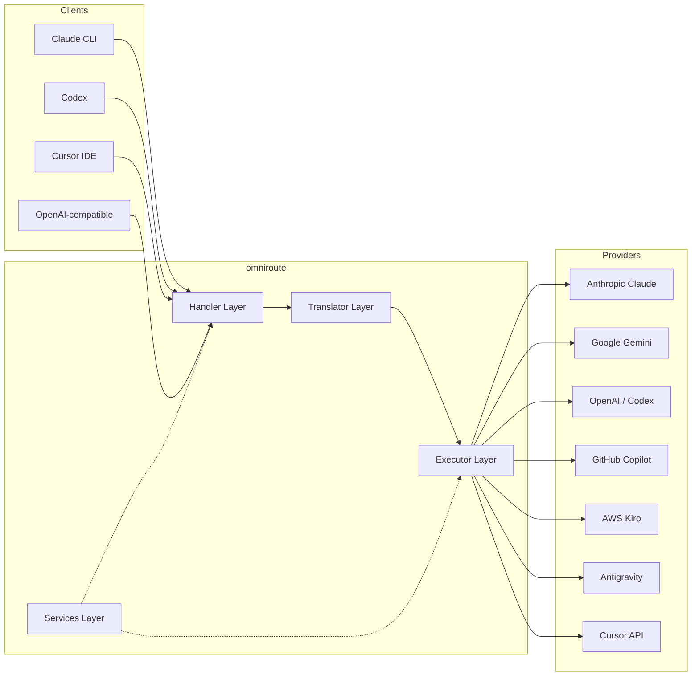

### Kärnprincip: Översättning av nav och eker

All formatöversättning går genom **OpenAI-formatet som navet**:

```
Client Format → [OpenAI Hub] → Provider Format    (request)
Provider Format → [OpenAI Hub] → Client Format    (response)
```

Det betyder att du bara behöver **N översättare** (en per format) istället för **N²** (varje par).

---

## 3. Projektets struktur

```
omniroute/
├── open-sse/                  ← Core proxy library (portable, framework-agnostic)
│   ├── index.js               ← Main entry point, exports everything
│   ├── config/                ← Configuration & constants
│   ├── executors/             ← Provider-specific request execution
│   ├── handlers/              ← Request handling orchestration
│   ├── services/              ← Business logic (auth, models, fallback, usage)
│   ├── translator/            ← Format translation engine
│   │   ├── request/           ← Request translators (8 files)
│   │   ├── response/          ← Response translators (7 files)
│   │   └── helpers/           ← Shared translation utilities (6 files)
│   └── utils/                 ← Utility functions
├── src/                       ← Application layer (Express/Worker runtime)
│   ├── app/                   ← Web UI, API routes, middleware
│   ├── lib/                   ← Database, auth, and shared library code
│   ├── mitm/                  ← Man-in-the-middle proxy utilities
│   ├── models/                ← Database models
│   ├── shared/                ← Shared utilities (wrappers around open-sse)
│   ├── sse/                   ← SSE endpoint handlers
│   └── store/                 ← State management
├── data/                      ← Runtime data (credentials, logs)
│   └── provider-credentials.json   (external credentials override, gitignored)
└── tester/                    ← Test utilities
```

---

## 4. Uppdelning av modul för modul

### 4.1 Config (`open-sse/config/`)

Den **enda källan till sanning** för alla leverantörskonfigurationer.

| Arkiv                         | Syfte                                                                                                                                                                                                                                 |
| ----------------------------- | ------------------------------------------------------------------------------------------------------------------------------------------------------------------------------------------------------------------------------------- |
| `constants.ts`                | `PROVIDERS` objekt med bas-URL:er, OAuth-referenser (standard), rubriker och standardsystemuppmaningar för varje leverantör. Definierar även `HTTP_STATUS`, `ERROR_TYPES`, `COOLDOWN_MS`, `BACKOFF_CONFIG` och `SKIP_PATTERNS`.       |
| `credentialLoader.ts`         | Laddar externa referenser från `data/provider-credentials.json` och slår samman dem över de hårdkodade standardinställningarna i `PROVIDERS`. Håller hemligheter utom källans kontroll samtidigt som bakåtkompatibiliteten bibehålls. |
| `providerModels.ts`           | Centralt modellregister: kartleverantörsalias → modell-ID:n. Funktioner som `getModels()`, `getProviderByAlias()`.                                                                                                                    |
| `codexInstructions.ts`        | Systeminstruktioner injicerade i Codex-förfrågningar (redigeringsbegränsningar, sandlåderegler, godkännandepolicyer).                                                                                                                 |
| `defaultThinkingSignature.ts` | Standard "tänkande" signaturer för Claude och Gemini modeller.                                                                                                                                                                        |
| `ollamaModels.ts`             | Schemadefinition för lokala Ollama-modeller (namn, storlek, familj, kvantisering).                                                                                                                                                    |

#### Behörighetsladdningsflöde

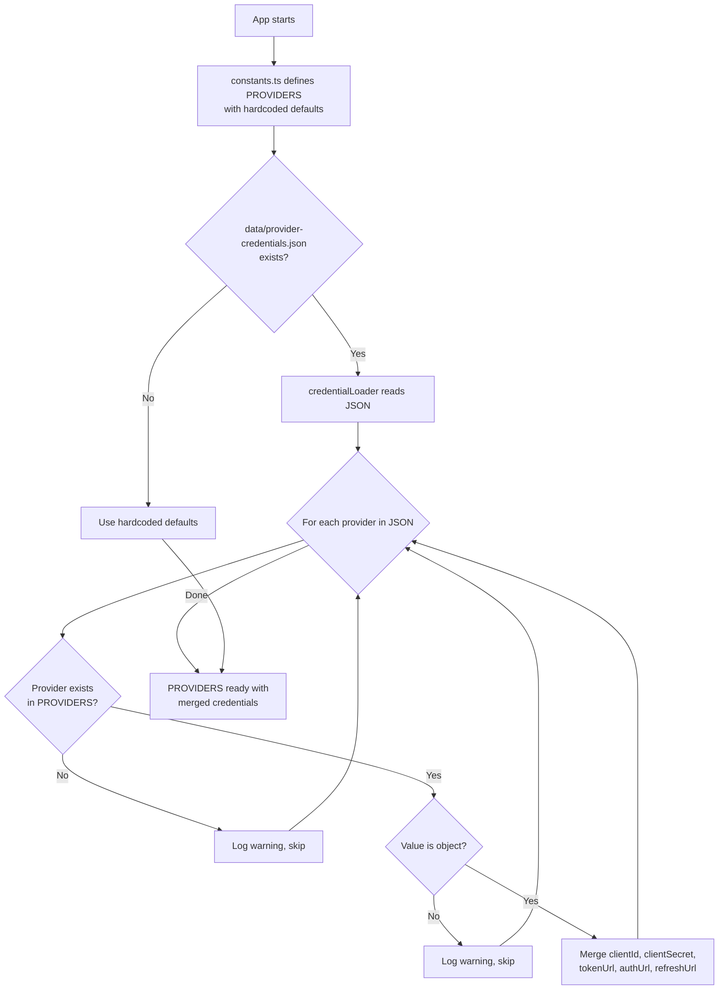

---

### 4.2 Exekutorer (`open-sse/executors/`)

Exekutorer kapslar in **leverantörsspecifik logik** med hjälp av **Strategy Pattern**. Varje executor åsidosätter basmetoder efter behov.

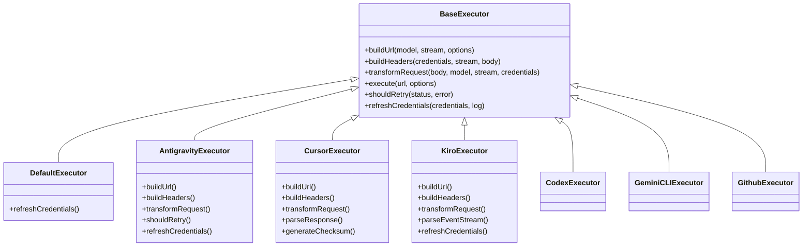

| Exekutor         | Leverantör                                 | Nyckelspecialiseringar                                                                                                                                |
| ---------------- | ------------------------------------------ | ----------------------------------------------------------------------------------------------------------------------------------------------------- |
| `base.ts`        | —                                          | Abstrakt bas: URL-byggnad, rubriker, logik för försök igen, uppdatering av autentiseringsuppgifter                                                    |
| `default.ts`     | Claude, Gemini, OpenAI, GLM, Kimi, MiniMax | Generisk OAuth-tokenuppdatering för standardleverantörer                                                                                              |
| `antigravity.ts` | Google Cloud Code                          | Generering av projekt-/sessions-ID, reserv för flera webbadresser, anpassad försök att analysera igen från felmeddelanden ("återställ efter 2h7m23s") |
| `cursor.ts`      | Markör IDE                                 | **Mest komplex**: SHA-256 kontrollsummaauth, Protobuf-begärankodning, binär EventStream → SSE-svarsanalys                                             |
| `codex.ts`       | OpenAI Codex                               | Injicerar systeminstruktioner, hanterar tankenivåer, tar bort parametrar som inte stöds                                                               |
| `gemini-cli.ts`  | Google Gemini CLI                          | Byggande av anpassad webbadress (`streamGenerateContent`), uppdatering av Google OAuth-token                                                          |
| `github.ts`      | GitHub Copilot                             | Dubbla tokensystem (GitHub OAuth + Copilot-token), VSCode-huvudhärmare                                                                                |
| `kiro.ts`        | AWS CodeWhisperer                          | AWS EventStream binär analys, AMZN-händelseramar, tokenuppskattning                                                                                   |
| `index.ts`       | —                                          | Fabrik: maps provider name → executor class, with default fallback                                                                                    |

---

### 4.3 Hanterare (`open-sse/handlers/`)

**orkestreringsskiktet** — koordinerar översättning, exekvering, streaming och felhantering.

| Arkiv                 | Syfte                                                                                                                                                                                                             |
| --------------------- | ----------------------------------------------------------------------------------------------------------------------------------------------------------------------------------------------------------------- |
| `chatCore.ts`         | **Centralorkester** (~600 rader). Hanterar hela begärans livscykel: formatdetektering → översättning → exekutorutskick → strömmande/icke-strömmande svar → tokenuppdatering → felhantering → användningsloggning. |
| `responsesHandler.ts` | Adapter för OpenAI:s Responses API: konverterar svarsformat → Chattavslut → skickar till `chatCore` → konverterar SSE tillbaka till svarsformat.                                                                  |
| `embeddings.ts`       | Inbäddningsgenereringshanterare: löser inbäddningsmodell → leverantör, skickar till leverantörs API, returnerar OpenAI-kompatibelt inbäddningssvar. Stöder 6+ leverantörer.                                       |
| `imageGeneration.ts`  | Bildgenereringshanterare: löser bildmodell → leverantör, stöder OpenAI-kompatibla, Gemini-bild (Antigravity) och reservläge (Nebius). Returnerar base64- eller URL-bilder.                                        |

#### Begär livscykel (chatCore.ts)

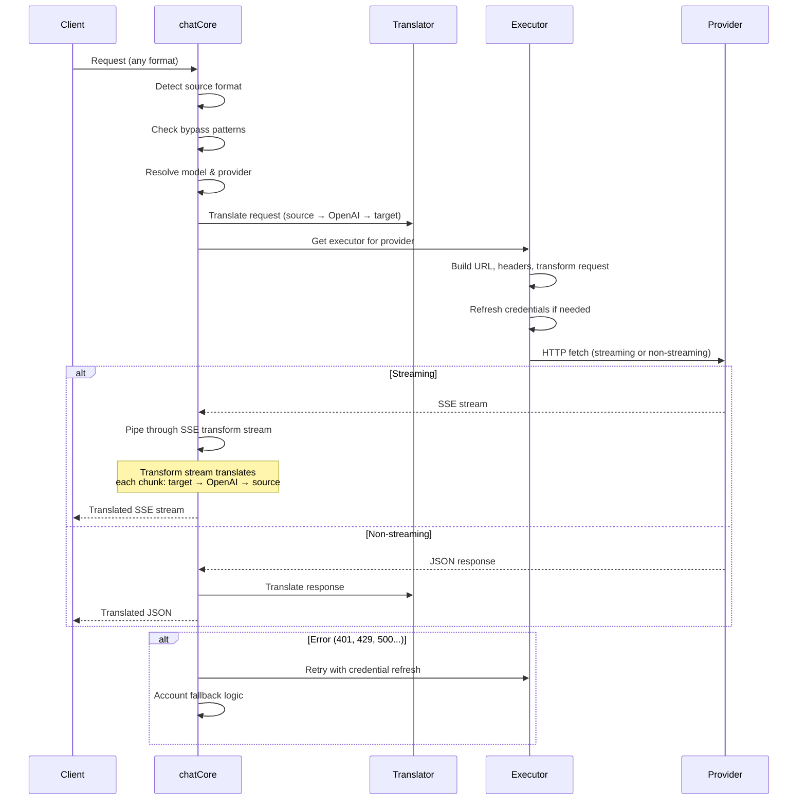

---

### 4.4 Tjänster (`open-sse/services/`)

Affärslogik som stödjer hanterarna och utförarna.

| Arkiv                | Syfte                                                                                                                                                                                                                                                                                                                                                              |
| -------------------- | ------------------------------------------------------------------------------------------------------------------------------------------------------------------------------------------------------------------------------------------------------------------------------------------------------------------------------------------------------------------ |
| `provider.ts`        | **Formatdetektering** (`detectFormat`): analyserar begäran om kroppsstruktur för att identifiera Claude/OpenAI/Gemini/Antigravity/Responses-format (inkluderar `max_tokens` heuristik för Claude). Dessutom: URL-byggande, header-byggande, normalisering av tankekonfiguration. Stöder `openai-compatible-*` och `anthropic-compatible-*` dynamiska leverantörer. |
| `model.ts`           | Modellsträngsanalys (`claude/model-name` → `{provider: "claude", model: "model-name"}`), aliasupplösning med kollisionsdetektering, ingångssanering (avvisar vägövergång/kontrolltecken) och modellinformationsupplösning med stöd för asynkront alias getter.                                                                                                     |
| `accountFallback.ts` | Hantering av hastighetsgränser: exponentiell backoff (1s → 2s → 4s → max 2min), hantering av kontonedkylning, felklassificering (vilka fel utlöser fallback kontra inte).                                                                                                                                                                                          |
| `tokenRefresh.ts`    | OAuth-tokenuppdatering för **alla leverantörer**: Google (Gemini, Antigravity), Claude, Codex, Qwen, iFlow, GitHub (OAuth + Copilot dual-token), Kiro (AWS SSO OIDC + Social Auth). Inkluderar löftesdedupliceringscache under flygning och försök igen med exponentiell backoff.                                                                                  |
| `combo.ts`           | **Kombomodeller**: kedjor av reservmodeller. Om modell A misslyckas med ett fallback-berättigat fel, prova modell B, sedan C osv. Returnerar faktiska uppströmsstatuskoder.                                                                                                                                                                                        |
| `usage.ts`           | Hämtar kvot/användningsdata från leverantörens API:er (GitHub Copilot-kvoter, Antigravity-modellkvoter, Codex-hastighetsgränser, Kiro-användningsuppdelningar, Claude-inställningar).                                                                                                                                                                              |
| `accountSelector.ts` | Smart kontoval med poängalgoritm: tar hänsyn till prioritet, hälsostatus, round-robin-position och nedkylningsläge för att välja det optimala kontot för varje begäran.                                                                                                                                                                                            |
| `contextManager.ts`  | Begär kontext livscykelhantering: skapar och spårar per begäran kontextobjekt med metadata (begäran ID, tidsstämplar, leverantörsinformation) för felsökning och loggning.                                                                                                                                                                                         |
| `ipFilter.ts`        | IP-baserad åtkomstkontroll: stöder tillstånds- och blockeringslägen. Validerar klient-IP mot konfigurerade regler innan API-förfrågningar behandlas.                                                                                                                                                                                                               |
| `sessionManager.ts`  | Sessionsspårning med klientfingeravtryck: spårar aktiva sessioner med hashade klientidentifierare, övervakar antalet begäranden och tillhandahåller sessionsstatistik.                                                                                                                                                                                             |
| `signatureCache.ts`  | Begär signaturbaserad dedupliceringscache: förhindrar dubbletter av begäranden genom att cachelagra senaste begäransignaturer och returnera cachade svar för identiska förfrågningar inom ett tidsfönster.                                                                                                                                                         |
| `systemPrompt.ts`    | Global systempromptinjektion: lägger till eller lägger till en konfigurerbar systemprompt till alla förfrågningar, med kompatibilitetshantering per leverantör.                                                                                                                                                                                                    |
| `thinkingBudget.ts`  | Hantering av resonerande tokenbudget: stöder passthrough, auto (strip thinking config), anpassade (fast budget) och adaptiva (komplexitetsskalade) lägen för att kontrollera tänkande/resonemangstokens.                                                                                                                                                           |
| `wildcardRouter.ts`  | Jokerteckenmodellmönsterrouting: löser jokerteckenmönster (t.ex. `*/claude-*`) till konkreta leverantör/modellpar baserat på tillgänglighet och prioritet.                                                                                                                                                                                                         |

#### Token Refresh Deduplication

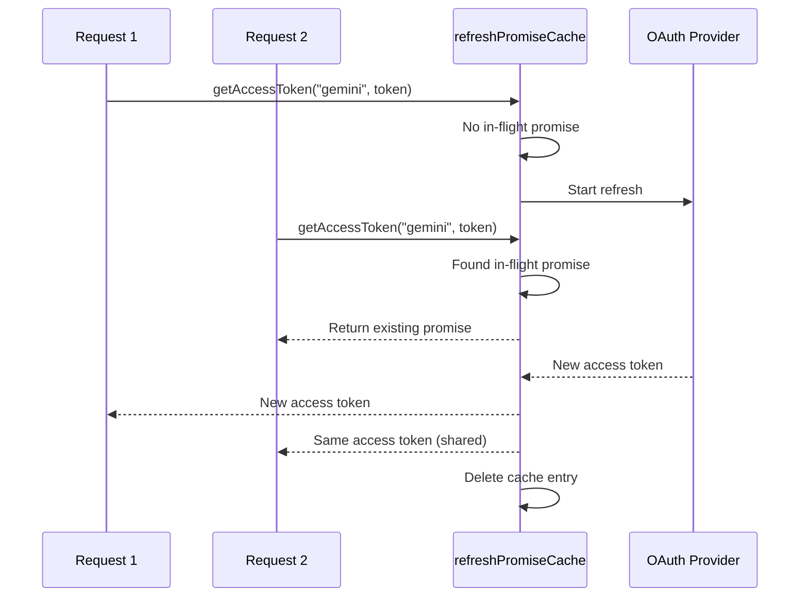

#### Konto reservtillståndsmaskin

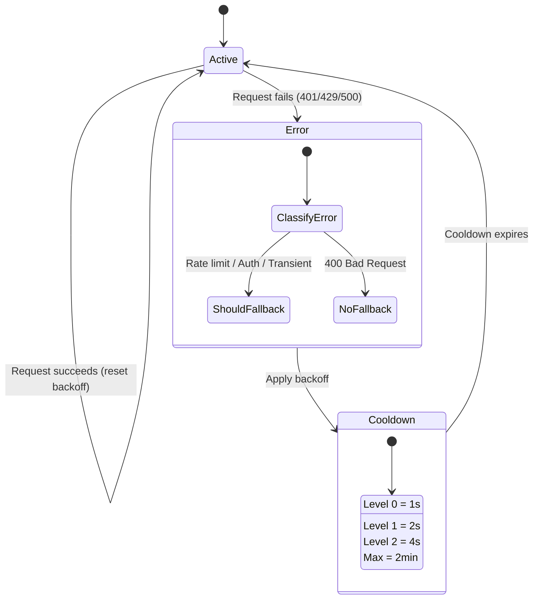

#### Kombinerad modellkedja

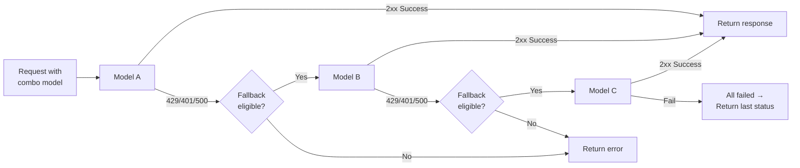

---

### 4.5 Översättare (`open-sse/translator/`)

**formatöversättningsmotorn** använder ett självregistrerande pluginsystem.

#### Arkitektur

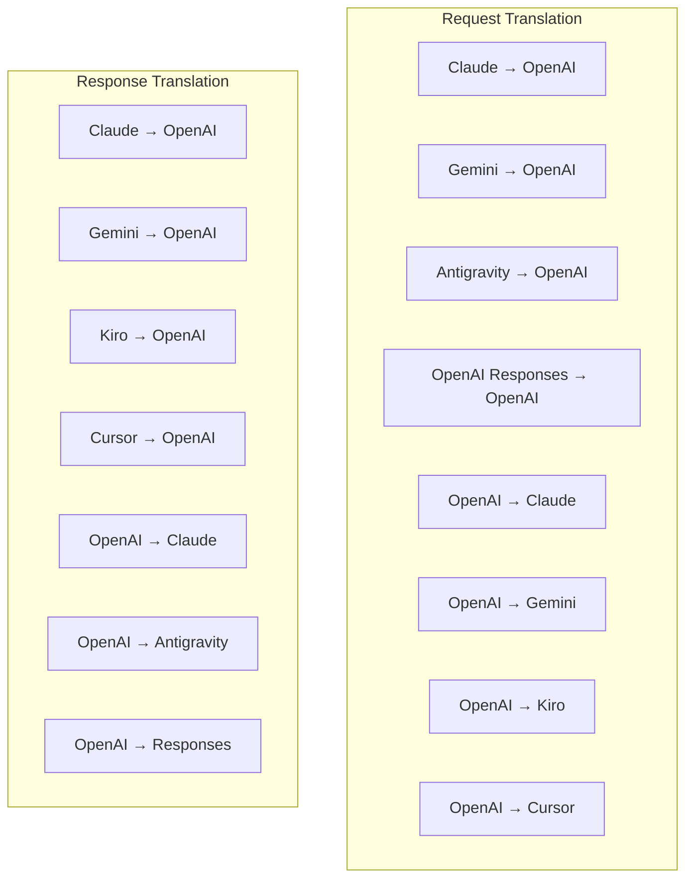

| Katalog      | Filer         | Beskrivning                                                                                                                                                                                                                                                            |
| ------------ | ------------- | ---------------------------------------------------------------------------------------------------------------------------------------------------------------------------------------------------------------------------------------------------------------------- |
| `request/`   | 8 översättare | Konvertera begärandekroppar mellan format. Varje fil självregistreras via `register(from, to, fn)` vid import.                                                                                                                                                         |
| `response/`  | 7 översättare | Konvertera strömmande svarsbitar mellan format. Hanterar SSE-händelsetyper, tankeblock, verktygsanrop.                                                                                                                                                                 |
| `helpers/`   | 6 hjälpare    | Delade verktyg: `claudeHelper` (extrahering av systemprompt, tankekonfiguration), `geminiHelper` (mappning av delar/innehåll), `openaiHelper` (formatfiltrering), `toolCallHelper` (ID-generering, injektion av saknat svar), `maxTokensHelper`, `responsesApiHelper`. |
| `index.ts`   | —             | Översättningsmotor: `translateRequest()`, `translateResponse()`, statlig ledning, register.                                                                                                                                                                            |
| `formats.ts` | —             | Formatkonstanter: `OPENAI`, `CLAUDE`, `GEMINI`, `ANTIGRAVITY`, `KIRO`, `CURSOR`, `OPENAI_RESPONSES`.                                                                                                                                                                   |

#### Nyckeldesign: Självregistrerande plugins

```javascript
// Each translator file calls register() on import:
import { register } from "../index.js";
register("claude", "openai", translateClaudeToOpenAI);

// The index.js imports all translator files, triggering registration:
import "./request/claude-to-openai.js"; // ← self-registers
```

---

### 4.6 Utils (`open-sse/utils/`)

| Arkiv              | Syfte                                                                                                                                                                                                                                                                                                  |
| ------------------ | ------------------------------------------------------------------------------------------------------------------------------------------------------------------------------------------------------------------------------------------------------------------------------------------------------ |
| `error.ts`         | Byggande av felsvar (OpenAI-kompatibelt format), uppströms felanalys, Antigravity-återförsöksextraktion från felmeddelanden, SSE-felströmning.                                                                                                                                                         |
| `stream.ts`        | **SSE Transform Stream** — kärnan för streaming. Två lägen: `TRANSLATE` (översättning i fullformat) och `PASSTHROUGH` (normalisera + extrahera användning). Hanterar chunkbuffring, användningsuppskattning, spårning av innehållslängd. Encoder/decoder-instanser per ström undviker delat tillstånd. |
| `streamHelpers.ts` | SSE-verktyg på låg nivå: `parseSSELine` (tolerant för blanksteg), `hasValuableContent` (filtrerar tomma bitar för OpenAI/Claude/Gemini), `fixInvalidId`, `formatSSE` (formatmedveten SSE-serialisering med med ).                                                                                      |
| `usageTracking.ts` | Extrahering av tokenanvändning från valfritt format (Claude/OpenAI/Gemini/Responses), uppskattning med separata verktyg/meddelande-char-per-token-förhållanden, bufferttillägg (säkerhetsmarginal för 2000 tokens), formatspecifik fältfiltrering, konsolloggning med ANSI-färger.                     |
| `requestLogger.ts` | Filbaserad förfrågningsloggning (opt-in via `ENABLE_REQUEST_LOGS=true`). Skapar sessionsmappar med numrerade filer: `1_req_client.json` → `7_res_client.txt`. All I/O är asynkron (eld-och-glöm). Maskerar känsliga rubriker.                                                                          |
| `bypassHandler.ts` | Fångar upp specifika mönster från Claude CLI (titelextraktion, uppvärmning, räkning) och returnerar falska svar utan att ringa någon leverantör. Stöder både streaming och icke-streaming. Avsiktligt begränsad till Claude CLI omfattning.                                                            |
| `networkProxy.ts`  | Löser utgående proxy-URL för en given leverantör med prioritet: leverantörsspecifik konfiguration → global konfiguration → miljövariabler (`HTTPS_PROXY`/`HTTP_PROXY`/`ALL_PROXY`). Stöder `NO_PROXY` undantag. Caches konfiguration för 30s.                                                          |

#### SSE Streaming Pipeline

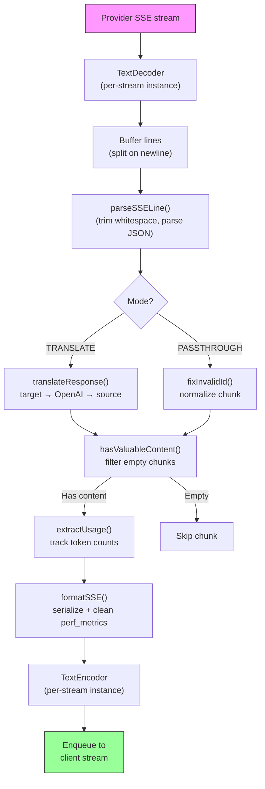

#### Begär Logger Session Struktur

```
logs/
└── claude_gemini_claude-sonnet_20260208_143045/
    ├── 1_req_client.json      ← Raw client request
    ├── 2_req_source.json      ← After initial conversion
    ├── 3_req_openai.json      ← OpenAI intermediate format
    ├── 4_req_target.json      ← Final target format
    ├── 5_res_provider.txt     ← Provider SSE chunks (streaming)
    ├── 5_res_provider.json    ← Provider response (non-streaming)
    ├── 6_res_openai.txt       ← OpenAI intermediate chunks
    ├── 7_res_client.txt       ← Client-facing SSE chunks
    └── 6_error.json           ← Error details (if any)
```

---

### 4.7 Application Layer (`src/`)

| Katalog       | Syfte                                                                                  |
| ------------- | -------------------------------------------------------------------------------------- |
| `src/app/`    | Webbgränssnitt, API-rutter, Express-mellanprogramvara, OAuth-återuppringningshanterare |
| `src/lib/`    | Databasåtkomst (`localDb.ts`, `usageDb.ts`), autentisering, delad                      |
| `src/mitm/`   | Man-in-the-middle-proxyverktyg för att avlyssna leverantörstrafik                      |
| `src/models/` | Databasmodelldefinitioner                                                              |
| `src/shared/` | Omslag runt öppna-sse-funktioner (leverantör, stream, fel, etc.)                       |
| `src/sse/`    | SSE-slutpunktshanterare som kopplar open-sse-biblioteket till Express-rutter           |
| `src/store/`  | Tillståndshantering för applikationer                                                  |

#### Anmärkningsvärda API-rutter

| Rutt                                          | Metoder          | Syfte                                                                                                 |
| --------------------------------------------- | ---------------- | ----------------------------------------------------------------------------------------------------- |
| `/api/provider-models`                        | GET/POSTA/RADERA | CRUD för anpassade modeller per leverantör                                                            |
| `/api/models/catalog`                         | FÅ               | Aggregerad katalog över alla modeller (chatt, inbäddning, bild, anpassad) grupperade efter leverantör |
| `/api/settings/proxy`                         | GET/PUT/DELETE   | Hierarkisk utgående proxykonfiguration (`global/providers/combos/keys`)                               |
| `/api/settings/proxy/test`                    | POST             | Validerar proxyanslutning och returnerar offentlig IP/latency                                         |
| `/v1/providers/[provider]/chat/completions`   | POST             | Dedikerade chattkompletteringar per leverantör med modellvalidering                                   |
| `/v1/providers/[provider]/embeddings`         | POST             | Dedikerade inbäddningar per leverantör med modellvalidering                                           |
| `/v1/providers/[provider]/images/generations` | POST             | Dedikerad bildgenerering per leverantör med modellvalidering                                          |
| `/api/settings/ip-filter`                     | GET/PUT          | Hantering av IP-tillståndslistor/blockeringslistor                                                    |
| `/api/settings/thinking-budget`               | GET/PUT          | Resonemangstokens budgetkonfiguration (passthrough/auto/custom/adaptive)                              |
| `/api/settings/system-prompt`                 | GET/PUT          | Global systeminjektion för alla förfrågningar                                                         |
| `/api/sessions`                               | FÅ               | Aktiv sessionsspårning och mätvärden                                                                  |
| `/api/rate-limits`                            | FÅ               | Räntegränsstatus per konto                                                                            |

---

## 5. Nyckeldesignmönster

### 5.1 Hub-and-Speake-översättning

Alla format översätts genom **OpenAI-formatet som navet**. Att lägga till en ny leverantör kräver bara att man skriver **ett par** översättare (till/från OpenAI), inte N par.

### 5.2 Exekutorstrategimönster

Varje leverantör har en dedikerad executor-klass som ärver från `BaseExecutor`. Fabriken i `executors/index.ts` väljer rätt vid körning.

### 5.3 Självregistrerande pluginsystem

Översättningsmoduler registrerar sig själva vid import via `register()`. Att lägga till en ny översättare är bara att skapa en fil och importera den.

### 5.4 Kontoåtgång med exponentiell backoff

När en leverantör returnerar 429/401/500 kan systemet byta till nästa konto genom att tillämpa exponentiell nedkylning (1s → 2s → 4s → max 2min).

### 5.5 Combo modellkedjor

En "combo" grupperar flera `provider/model`-strängar. Om den första misslyckas, återgå automatiskt till nästa.

### 5.6 Stateful Streaming Translation

Svarsöversättning upprätthåller tillstånd över SSE-bitar (tänkeblockspårning, verktygsanropsackumulering, innehållsblockindexering) via mekanismen `initState()`.

### 5.7 Användningssäkerhetsbuffert

En buffert på 2000 token läggs till rapporterad användning för att förhindra att klienter når kontextfönstergränser på grund av overhead från systemuppmaningar och formatöversättning.

---

## 6. Format som stöds

| Format                | Riktning    | Identifierare      |
| --------------------- | ----------- | ------------------ |
| OpenAI Chat Slutförda | källa + mål | `openai`           |
| OpenAI Responses API  | källa + mål | `openai-responses` |
| Antropisk Claude      | källa + mål | `claude`           |
| Google Tvillingarna   | källa + mål | `gemini`           |
| Google Gemini CLI     | endast mål  | `gemini-cli`       |
| Antigravitation       | källa + mål | `antigravity`      |
| AWS Kiro              | endast mål  | `kiro`             |
| Markör                | endast mål  | `cursor`           |

---

## 7. Leverantörer som stöds

| Leverantör               | Auth Method                    | Exekutor        | Viktiga anmärkningar                                                  |
| ------------------------ | ------------------------------ | --------------- | --------------------------------------------------------------------- |
| Antropisk Claude         | API-nyckel eller OAuth         | Standard        | Använder `x-api-key` header                                           |
| Google Tvillingarna      | API-nyckel eller OAuth         | Standard        | Använder `x-goog-api-key` header                                      |
| Google Gemini CLI        | OAuth                          | GeminiCLI       | Använder `streamGenerateContent` slutpunkt                            |
| Antigravitation          | OAuth                          | Antigravitation | Alternativ för flera webbadresser, anpassad försök att analysera igen |
| OpenAI                   | API-nyckel                     | Standard        | Standardbärare auth                                                   |
| Codex                    | OAuth                          | Codex           | Injicerar systeminstruktioner, hanterar tänkande                      |
| GitHub Copilot           | OAuth + Copilot-token          | Github          | Dubbla token, VSCode-huvudhärmar                                      |
| Kiro (AWS)               | AWS SSO OIDC eller Social      | Kiro            | Binär EventStream-analys                                              |
| Markör IDE               | Kontrollsumma auth             | Markör          | Protobuf-kodning, SHA-256 kontrollsummor                              |
| Qwen                     | OAuth                          | Standard        | Standardauth                                                          |
| iFlow                    | OAuth (Grundläggande + Bärare) | Standard        | Dubbla autentiseringshuvud                                            |
| OpenRouter               | API-nyckel                     | Standard        | Standardbärare auth                                                   |
| GLM, Kimi, MiniMax       | API-nyckel                     | Standard        | Claude-kompatibel, använd `x-api-key`                                 |
| `openai-compatible-*`    | API-nyckel                     | Standard        | Dynamisk: alla OpenAI-kompatibla slutpunkter                          |
| `anthropic-compatible-*` | API-nyckel                     | Standard        | Dynamisk: valfri Claude-kompatibel slutpunkt                          |

---

## 8. Dataflödessammanfattning

### Strömningsförfrågan

```mermaid
flowchart LR
    A["Client"] --> B["detectFormat()"]
    B --> C["translateRequest()\nsource → OpenAI → target"]
    C --> D["Executor\nbuildUrl + buildHeaders"]
    D --> E["fetch(providerURL)"]
    E --> F["createSSEStream()\nTRANSLATE mode"]
    F --> G["parseSSELine()"]
    G --> H["translateResponse()\ntarget → OpenAI → source"]
    H --> I["extractUsage()\n+ addBuffer"]
    I --> J["formatSSE()"]
    J --> K["Client receives\ntranslated SSE"]
    K --> L["logUsage()\nsaveRequestUsage()"]
```

### Begäran om icke-streaming

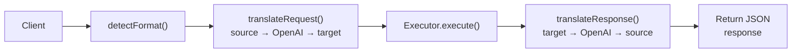

### Bypass Flow (Claude CLI)

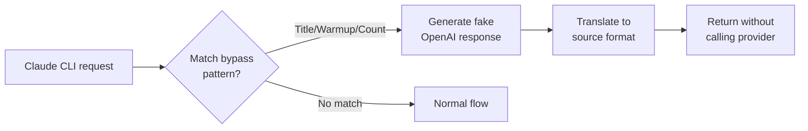
