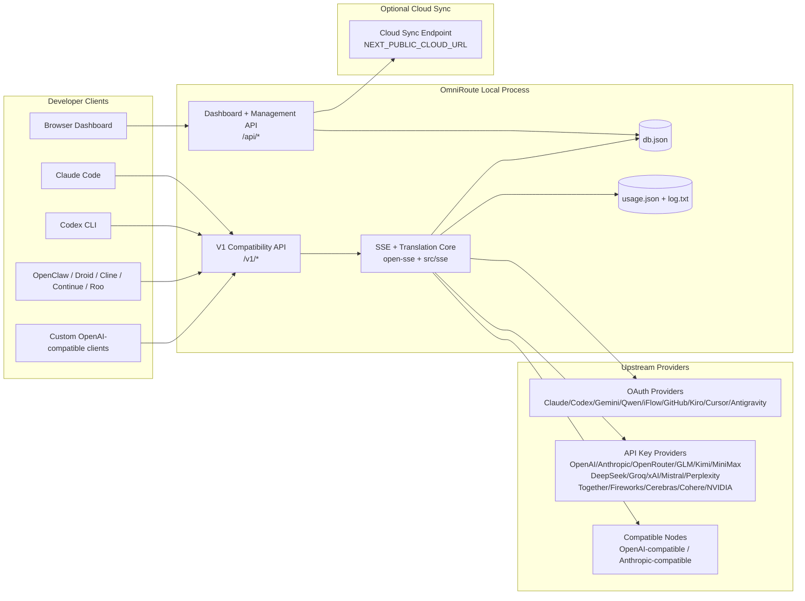
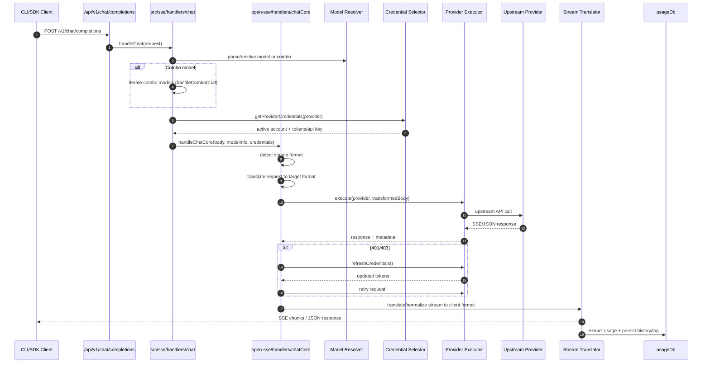
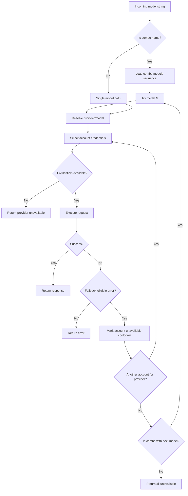
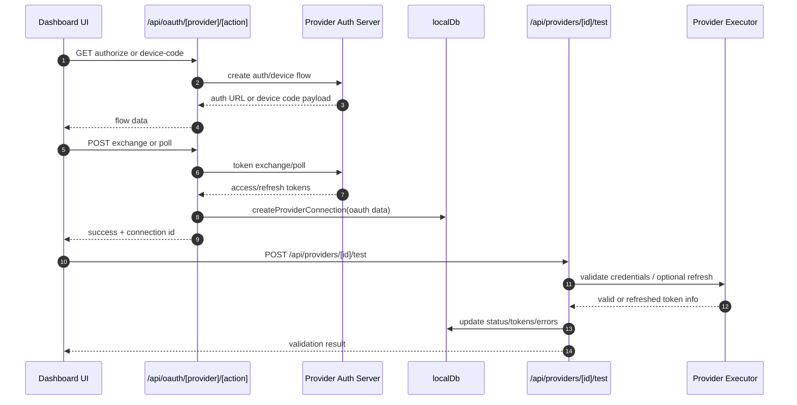
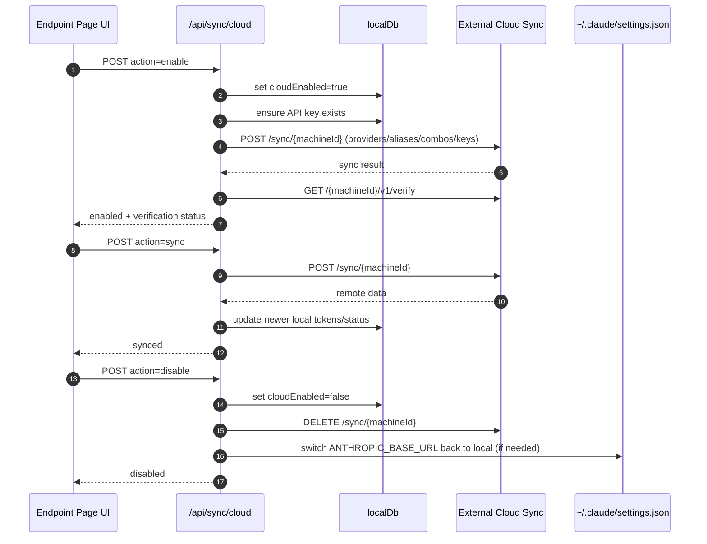
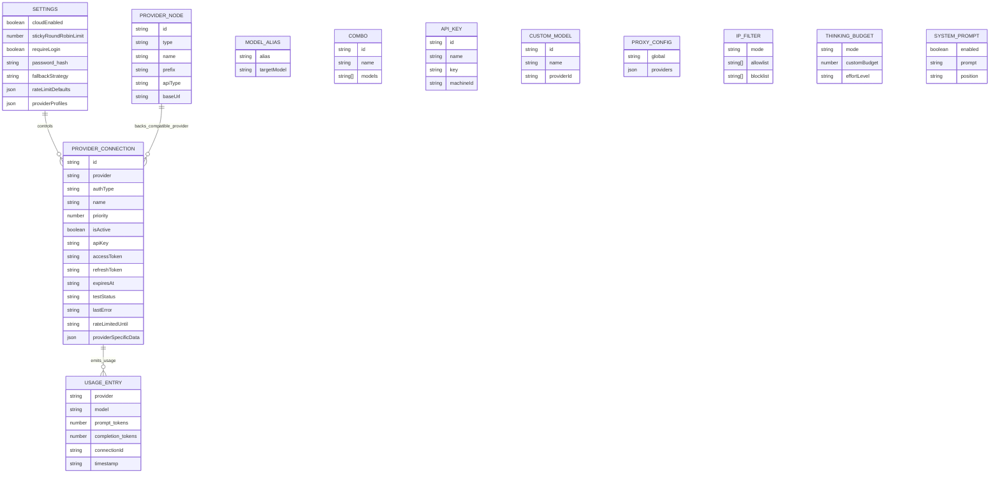
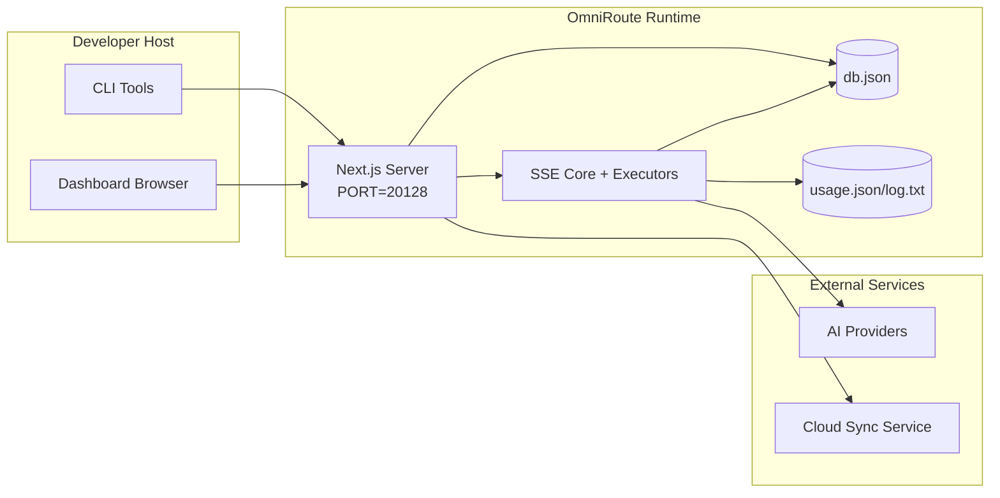

# สถาปัตยกรรม OmniRoute

🌐 **Languages:** 🇺🇸 [English](../../ARCHITECTURE.md) | 🇧🇷 [Português (Brasil)](../pt-BR/ARCHITECTURE.md) | 🇪🇸 [Español](../es/ARCHITECTURE.md) | 🇫🇷 [Français](../fr/ARCHITECTURE.md) | 🇮🇹 [Italiano](../it/ARCHITECTURE.md) | 🇷🇺 [Русский](../ru/ARCHITECTURE.md) | 🇨🇳 [中文 (简体)](../zh-CN/ARCHITECTURE.md) | 🇩🇪 [Deutsch](../de/ARCHITECTURE.md) | 🇮🇳 [हिन्दी](../in/ARCHITECTURE.md) | 🇹🇭 [ไทย](../th/ARCHITECTURE.md) | 🇺🇦 [Українська](../uk-UA/ARCHITECTURE.md) | 🇸🇦 [العربية](../ar/ARCHITECTURE.md) | 🇯🇵 [日本語](../ja/ARCHITECTURE.md) | 🇻🇳 [Tiếng Việt](../vi/ARCHITECTURE.md) | 🇧🇬 [Български](../bg/ARCHITECTURE.md) | 🇩🇰 [Dansk](../da/ARCHITECTURE.md) | 🇫🇮 [Suomi](../fi/ARCHITECTURE.md) | 🇮🇱 [עברית](../he/ARCHITECTURE.md) | 🇭🇺 [Magyar](../hu/ARCHITECTURE.md) | 🇮🇩 [Bahasa Indonesia](../id/ARCHITECTURE.md) | 🇰🇷 [한국어](../ko/ARCHITECTURE.md) | 🇲🇾 [Bahasa Melayu](../ms/ARCHITECTURE.md) | 🇳🇱 [Nederlands](../nl/ARCHITECTURE.md) | 🇳🇴 [Norsk](../no/ARCHITECTURE.md) | 🇵🇹 [Português (Portugal)](../pt/ARCHITECTURE.md) | 🇷🇴 [Română](../ro/ARCHITECTURE.md) | 🇵🇱 [Polski](../pl/ARCHITECTURE.md) | 🇸🇰 [Slovenčina](../sk/ARCHITECTURE.md) | 🇸🇪 [Svenska](../sv/ARCHITECTURE.md) | 🇵🇭 [Filipino](../phi/ARCHITECTURE.md)

_อัพเดตล่าสุด: 2026-02-18_

## บทสรุปผู้บริหาร

OmniRoute เป็นเกตเวย์การกำหนดเส้นทาง AI ในพื้นที่และแดชบอร์ดที่สร้างขึ้นบน Next.js
โดยให้จุดสิ้นสุดที่เข้ากันได้กับ OpenAI จุดเดียว (`/v1/*`) และกำหนดเส้นทางการรับส่งข้อมูลผ่านผู้ให้บริการอัปสตรีมหลายรายพร้อมการแปล ทางเลือกสำรอง การรีเฟรชโทเค็น และการติดตามการใช้งาน

ความสามารถหลัก:

- พื้นผิว API ที่เข้ากันได้กับ OpenAI สำหรับ CLI/เครื่องมือ (ผู้ให้บริการ 28 ราย)
- การแปลคำขอ/ตอบกลับในรูปแบบต่างๆ ของผู้ให้บริการ
- ทางเลือกคำสั่งผสมโมเดล (ลำดับหลายรุ่น)
- ทางเลือกระดับบัญชี (หลายบัญชีต่อผู้ให้บริการ)
- การจัดการการเชื่อมต่อผู้ให้บริการ OAuth + API-key
- การสร้างการฝังผ่าน `/v1/embeddings` (ผู้ให้บริการ 6 ราย, 9 โมเดล)
- การสร้างภาพผ่าน `/v1/images/generations` (ผู้ให้บริการ 4 ราย, 9 รุ่น)
- คิดว่าการแยกวิเคราะห์แท็ก (`<think>...</think>`) สำหรับโมเดลการให้เหตุผล
- การตอบสนองการฆ่าเชื้อสำหรับความเข้ากันได้ของ OpenAI SDK ที่เข้มงวด
- การปรับบทบาทให้เป็นมาตรฐาน (ผู้พัฒนา → ระบบ, ระบบ → ผู้ใช้) เพื่อความเข้ากันได้ระหว่างผู้ให้บริการ
- การแปลงเอาต์พุตที่มีโครงสร้าง (json_schema → Gemini responseSchema)
- ความคงอยู่ในท้องถิ่นสำหรับผู้ให้บริการ คีย์ นามแฝง คอมโบ การตั้งค่า การกำหนดราคา
- การติดตามการใช้งาน/ต้นทุน และขอบันทึก
- ตัวเลือกการซิงค์บนคลาวด์สำหรับการซิงค์หลายอุปกรณ์/สถานะ
- รายการที่อนุญาต/รายการบล็อก IP สำหรับการควบคุมการเข้าถึง API
- คิดการจัดการงบประมาณ (ส่งผ่าน/อัตโนมัติ/กำหนดเอง/ปรับเปลี่ยน)
- ระบบฉีดพร้อมท์ทั่วโลก
- การติดตามเซสชันและการพิมพ์ลายนิ้วมือ
- การจำกัดอัตราการปรับปรุงต่อบัญชีด้วยโปรไฟล์เฉพาะของผู้ให้บริการ
- รูปแบบเซอร์กิตเบรกเกอร์เพื่อความยืดหยุ่นของผู้ให้บริการ
- ป้องกันฝูงฟ้าผ่าพร้อมระบบล็อค mutex
- แคชการขจัดข้อมูลซ้ำซ้อนของคำขอตามลายเซ็น
- เลเยอร์โดเมน: ความพร้อมใช้งานของโมเดล กฎต้นทุน นโยบายทางเลือก นโยบายการล็อก
- การคงอยู่ของสถานะโดเมน (แคชการเขียนผ่าน SQLite สำหรับทางเลือกสำรอง งบประมาณ การล็อคเอาต์ เซอร์กิตเบรกเกอร์)
- กลไกนโยบายสำหรับการประเมินคำขอแบบรวมศูนย์ (ล็อค → งบประมาณ → ทางเลือก)
- ขอการตรวจวัดทางไกลด้วยการรวมเวลาแฝง p50/p95/p99
- Correlation ID (X-Request-Id) สำหรับการติดตามจากต้นทางถึงปลายทาง
- การบันทึกการตรวจสอบการปฏิบัติตามข้อกำหนดโดยเลือกไม่ใช้ต่อคีย์ API
- กรอบการประเมินสำหรับการประกันคุณภาพ LLM
- แดชบอร์ด UI ความยืดหยุ่นพร้อมสถานะเบรกเกอร์แบบเรียลไทม์
- ผู้ให้บริการ OAuth แบบโมดูลาร์ (12 โมดูลแต่ละโมดูลภายใต้ `src/lib/oauth/providers/`)

โมเดลรันไทม์หลัก:

- เส้นทางแอป Next.js ภายใต้ `src/app/api/*` ใช้ทั้ง API แดชบอร์ดและ API ที่เข้ากันได้
- SSE/แกนการกำหนดเส้นทางที่ใช้ร่วมกันใน `src/sse/*` + `open-sse/*` จัดการการดำเนินการของผู้ให้บริการ การแปล การสตรีม ทางเลือกสำรอง และการใช้งาน

## ขอบเขตและขอบเขต

### ในขอบเขต

- รันไทม์เกตเวย์ท้องถิ่น
- API การจัดการแดชบอร์ด
- การรับรองความถูกต้องของผู้ให้บริการและการรีเฟรชโทเค็น
- ขอการแปลและการสตรีม SSE
- สภาพท้องถิ่น + ความคงทนในการใช้งาน
- การประสานการซิงค์บนคลาวด์เสริม

### อยู่นอกขอบเขต

- การใช้งานบริการคลาวด์เบื้องหลัง `NEXT_PUBLIC_CLOUD_URL`
- SLA ของผู้ให้บริการ/ระนาบควบคุมอยู่นอกกระบวนการท้องถิ่น
- ไบนารี CLI ภายนอกเอง (Claude CLI, Codex CLI ฯลฯ )

## บริบทของระบบระดับสูง



## ส่วนประกอบรันไทม์หลัก

## 1) API และเลเยอร์การกำหนดเส้นทาง (เส้นทางแอป Next.js)

ไดเรกทอรีหลัก:

- `src/app/api/v1/*` และ `src/app/api/v1beta/*` สำหรับ API ที่เข้ากันได้
- `src/app/api/*` สำหรับ API การจัดการ/การกำหนดค่า
- เขียนใหม่ครั้งต่อไปใน `next.config.mjs` แผนที่ `/v1/*` ถึง `/api/v1/*`

เส้นทางความเข้ากันได้ที่สำคัญ:

- `src/app/api/v1/chat/completions/route.ts`
- `src/app/api/v1/messages/route.ts`
- `src/app/api/v1/responses/route.ts`
- `src/app/api/v1/models/route.ts` — รวมโมเดลที่กำหนดเองด้วย `custom: true`
- `src/app/api/v1/embeddings/route.ts` — การสร้างการฝัง (ผู้ให้บริการ 6 ราย)
- `src/app/api/v1/images/generations/route.ts` — การสร้างภาพ (ผู้ให้บริการ 4+ รายรวม Antigravity/Nebius)
- `src/app/api/v1/messages/count_tokens/route.ts`
- `src/app/api/v1/providers/[provider]/chat/completions/route.ts` — แชทเฉพาะต่อผู้ให้บริการ
- `src/app/api/v1/providers/[provider]/embeddings/route.ts` — การฝังต่อผู้ให้บริการโดยเฉพาะ
- `src/app/api/v1/providers/[provider]/images/generations/route.ts` — อิมเมจต่อผู้ให้บริการโดยเฉพาะ
- `src/app/api/v1beta/models/route.ts`
- `src/app/api/v1beta/models/[...path]/route.ts`

โดเมนการจัดการ:

- การรับรองความถูกต้อง/การตั้งค่า: `src/app/api/auth/*`, `src/app/api/settings/*`
- ผู้ให้บริการ/การเชื่อมต่อ: `src/app/api/providers*`
- โหนดผู้ให้บริการ: `src/app/api/provider-nodes*`
- โมเดลที่กำหนดเอง: `src/app/api/provider-models` (GET/POST/DELETE)
- แคตตาล็อกรุ่น: `src/app/api/models/catalog` (GET)
- การกำหนดค่าพร็อกซี: `src/app/api/settings/proxy` (GET/PUT/DELETE) + `src/app/api/settings/proxy/test` (POST)
- OAuth: `src/app/api/oauth/*`
- คีย์/นามแฝง/คอมโบ/ราคา: `src/app/api/keys*`, `src/app/api/models/alias`, `src/app/api/combos*`, `src/app/api/pricing`
- การใช้งาน: `src/app/api/usage/*`
- ซิงค์/คลาวด์: `src/app/api/sync/*`, `src/app/api/cloud/*`
- ผู้ช่วยเครื่องมือ CLI: `src/app/api/cli-tools/*`
- ตัวกรอง IP: `src/app/api/settings/ip-filter` (GET/PUT)
- งบประมาณการคิด: `src/app/api/settings/thinking-budget` (GET/PUT)
- ระบบแจ้ง: `src/app/api/settings/system-prompt` (GET/PUT)
- เซสชัน: `src/app/api/sessions` (GET)
- ขีดจำกัดอัตรา: `src/app/api/rate-limits` (GET)
- ความยืดหยุ่น: `src/app/api/resilience` (GET/PATCH) — โปรไฟล์ผู้ให้บริการ, เซอร์กิตเบรกเกอร์, สถานะขีดจำกัดอัตรา
- รีเซ็ตความยืดหยุ่น: `src/app/api/resilience/reset` (POST) — รีเซ็ตเบรกเกอร์ + คูลดาวน์
- สถิติแคช: `src/app/api/cache/stats` (GET/DELETE)
- ความพร้อมของรุ่น: `src/app/api/models/availability` (GET/POST)
- การวัดและส่งข้อมูลทางไกล: `src/app/api/telemetry/summary` (GET)
- งบประมาณ: `src/app/api/usage/budget` (GET/POST)
- เชนทางเลือก: `src/app/api/fallback/chains` (GET/POST/DELETE)
- การตรวจสอบการปฏิบัติตามข้อกำหนด: `src/app/api/compliance/audit-log` (GET)
- คะแนน: `src/app/api/evals` (GET/POST), `src/app/api/evals/[suiteId]` (GET)
- นโยบาย: `src/app/api/policies` (GET/POST)

## 2) SSE + แกนการแปล

โมดูลการไหลหลัก:

- รายการ: `src/sse/handlers/chat.ts`
- การประสานหลัก: `open-sse/handlers/chatCore.ts`
- อะแดปเตอร์การดำเนินการของผู้ให้บริการ: `open-sse/executors/*`
- รูปแบบการตรวจจับ/การกำหนดค่าผู้ให้บริการ: `open-sse/services/provider.ts`
- โมเดลแยกวิเคราะห์/แก้ไข: `src/sse/services/model.ts`, `open-sse/services/model.ts`
- ตรรกะทางเลือกของบัญชี: `open-sse/services/accountFallback.ts`
- รีจิสทรีการแปล: `open-sse/translator/index.ts`
- การแปลงสตรีม: `open-sse/utils/stream.ts`, `open-sse/utils/streamHandler.ts`
- การแยกการใช้งาน/การทำให้เป็นมาตรฐาน: `open-sse/utils/usageTracking.ts`
- คิดว่าตัวแยกวิเคราะห์แท็ก: `open-sse/utils/thinkTagParser.ts`
- ตัวจัดการการฝัง: `open-sse/handlers/embeddings.ts`
- การลงทะเบียนผู้ให้บริการการฝัง: `open-sse/config/embeddingRegistry.ts`
- ตัวจัดการการสร้างอิมเมจ: `open-sse/handlers/imageGeneration.ts`
- รีจิสทรีของผู้ให้บริการอิมเมจ: `open-sse/config/imageRegistry.ts`
- การตอบสนองการฆ่าเชื้อ: `open-sse/handlers/responseSanitizer.ts`
- การทำให้บทบาทเป็นมาตรฐาน: `open-sse/services/roleNormalizer.ts`

บริการ (ตรรกะทางธุรกิจ):

- การเลือกบัญชี/การให้คะแนน: `open-sse/services/accountSelector.ts`
- การจัดการวงจรชีวิตบริบท: `open-sse/services/contextManager.ts`
- การบังคับใช้ตัวกรอง IP: `open-sse/services/ipFilter.ts`
- การติดตามเซสชัน: `open-sse/services/sessionManager.ts`
- ขอการขจัดข้อมูลซ้ำซ้อน: `open-sse/services/signatureCache.ts`
- ระบบพร้อมท์การฉีด: `open-sse/services/systemPrompt.ts`
- คิดการจัดการงบประมาณ: `open-sse/services/thinkingBudget.ts`
- การกำหนดเส้นทางโมเดลตัวแทน: `open-sse/services/wildcardRouter.ts`
- การจัดการขีดจำกัดอัตรา: `open-sse/services/rateLimitManager.ts`
- เบรกเกอร์: `open-sse/services/circuitBreaker.ts`

โมดูลเลเยอร์โดเมน:

- รุ่นที่มีวางจำหน่าย: `src/lib/domain/modelAvailability.ts`
- กฎต้นทุน/งบประมาณ: `src/lib/domain/costRules.ts`
- นโยบายสำรอง: `src/lib/domain/fallbackPolicy.ts`
- ตัวแก้ไขคำสั่งผสม: `src/lib/domain/comboResolver.ts`
- นโยบายการล็อก: `src/lib/domain/lockoutPolicy.ts`
- กลไกนโยบาย: `src/domain/policyEngine.ts` — การล็อคแบบรวมศูนย์ → งบประมาณ → การประเมินทางเลือก
- แค็ตตาล็อกรหัสข้อผิดพลาด: `src/lib/domain/errorCodes.ts`
- รหัสคำขอ: `src/lib/domain/requestId.ts`
- หมดเวลาดึงข้อมูล: `src/lib/domain/fetchTimeout.ts`
- ขอการตรวจวัดระยะไกล: `src/lib/domain/requestTelemetry.ts`
- การปฏิบัติตามข้อกำหนด/การตรวจสอบ: `src/lib/domain/compliance/index.ts`
- นักวิ่งประเมิน: `src/lib/domain/evalRunner.ts`
- การคงอยู่ของสถานะโดเมน: `src/lib/db/domainState.ts` — SQLite CRUD สำหรับเชนสำรอง งบประมาณ ประวัติต้นทุน สถานะการล็อกเอาต์ เซอร์กิตเบรกเกอร์

โมดูลผู้ให้บริการ OAuth (12 ไฟล์แต่ละไฟล์ภายใต้ `src/lib/oauth/providers/`):

- ดัชนีรีจิสทรี: `src/lib/oauth/providers/index.ts`
- ผู้ให้บริการส่วนบุคคล: `claude.ts`, `codex.ts`, `gemini.ts`, `antigravity.ts`, `iflow.ts`, `qwen.ts`, `kimi-coding.ts`, `github.ts`, `kiro.ts`, `cursor.ts`, `kilocode.ts`, `cline.ts`
- กระดาษห่อแบบบาง: `src/lib/oauth/providers.ts` — ส่งออกซ้ำจากแต่ละโมดูล

## 3) เลเยอร์การคงอยู่

ฐานข้อมูลสถานะหลัก:

- `src/lib/localDb.ts`
- ไฟล์: `${DATA_DIR}/db.json` (หรือ `$XDG_CONFIG_HOME/omniroute/db.json` เมื่อตั้งค่า มิฉะนั้น `~/.omniroute/db.json`)
- เอนทิตี: providerConnections, providerNodes, modelAliases, คอมโบ, apiKeys, การตั้งค่า, การกำหนดราคา, **customModels**, **proxyConfig**, **ipFilter**, **thinkingBudget**, **systemPrompt**

ฐานข้อมูลการใช้งาน:

- `src/lib/usageDb.ts`
- ไฟล์: `${DATA_DIR}/usage.json`, `${DATA_DIR}/log.txt`, `${DATA_DIR}/call_logs/`
- เป็นไปตามนโยบายไดเรกทอรีฐานเดียวกันกับ `localDb` (`DATA_DIR` จากนั้น `XDG_CONFIG_HOME/omniroute` เมื่อตั้งค่า)
- แบ่งออกเป็นโมดูลย่อยที่เน้น: `migrations.ts`, `usageHistory.ts`, `costCalculator.ts`, `usageStats.ts`, `callLogs.ts`

ฐานข้อมูลสถานะโดเมน (SQLite):

- `src/lib/db/domainState.ts` — การดำเนินการ CRUD สำหรับสถานะโดเมน
- ตาราง (สร้างใน `src/lib/db/core.ts`): `domain_fallback_chains`, `domain_budgets`, `domain_cost_history`, `domain_lockout_state`, `domain_circuit_breakers`
- รูปแบบแคชการเขียนผ่าน: แผนที่ในหน่วยความจำเชื่อถือได้ ณ รันไทม์ การกลายพันธุ์จะถูกเขียนพร้อมกันกับ SQLite; สถานะถูกกู้คืนจาก DB เมื่อสตาร์ทขณะเย็น

## 4) การรับรองความถูกต้อง + พื้นผิวการรักษาความปลอดภัย

- การตรวจสอบคุกกี้แดชบอร์ด: `src/proxy.ts`, `src/app/api/auth/login/route.ts`
- การสร้าง/การตรวจสอบคีย์ API: `src/shared/utils/apiKey.ts`
- ข้อมูลลับของผู้ให้บริการยังคงอยู่ในรายการ `providerConnections`
- รองรับพร็อกซีขาออกผ่าน `open-sse/utils/proxyFetch.ts` (env vars) และ `open-sse/utils/networkProxy.ts` (กำหนดค่าได้ต่อผู้ให้บริการหรือทั่วโลก)

## 5) การซิงค์บนคลาวด์

- เริ่มต้นตัวกำหนดเวลา: `src/lib/initCloudSync.ts`, `src/shared/services/initializeCloudSync.ts`
- งานประจำ: `src/shared/services/cloudSyncScheduler.ts`
- เส้นทางควบคุม: `src/app/api/sync/cloud/route.ts`

## ระยะเวลาคำขอ (`/v1/chat/completions`)



## Combo + ขั้นตอนทางเลือกของบัญชี



การตัดสินใจทางเลือกถูกขับเคลื่อนโดย `open-sse/services/accountFallback.ts` โดยใช้รหัสสถานะและการวิเคราะห์พฤติกรรมข้อความแสดงข้อผิดพลาด

## การเริ่มต้นใช้งาน OAuth และวงจรการรีเฟรชโทเค็น



การรีเฟรชระหว่างการรับส่งข้อมูลสดจะดำเนินการภายใน `open-sse/handlers/chatCore.ts` ผ่านตัวดำเนินการ `refreshCredentials()`

## วงจรการใช้งาน Cloud Sync (เปิดใช้งาน / ซิงค์ / ปิดใช้งาน)



การซิงค์เป็นระยะจะถูกทริกเกอร์โดย `CloudSyncScheduler` เมื่อเปิดใช้งานระบบคลาวด์

## แบบจำลองข้อมูลและแผนที่การจัดเก็บ



ไฟล์จัดเก็บข้อมูลทางกายภาพ:

- สถานะหลัก: `${DATA_DIR}/db.json` (หรือ `$XDG_CONFIG_HOME/omniroute/db.json` เมื่อตั้งค่า มิฉะนั้น `~/.omniroute/db.json`)
- สถิติการใช้งาน: `${DATA_DIR}/usage.json`
- ขอบรรทัดบันทึก: `${DATA_DIR}/log.txt`
- ตัวเลือกนักแปล/ร้องขอเซสชันการแก้ไขข้อบกพร่อง: `<repo>/logs/...`

## โทโพโลยีการปรับใช้



## การทำแผนที่โมดูล (การตัดสินใจที่สำคัญ)

### เส้นทางและโมดูล API

- `src/app/api/v1/*`, `src/app/api/v1beta/*`: API ความเข้ากันได้
- `src/app/api/v1/providers/[provider]/*`: เส้นทางเฉพาะต่อผู้ให้บริการ (แชท การฝัง รูปภาพ)
- `src/app/api/providers*`: ผู้ให้บริการ CRUD, การตรวจสอบความถูกต้อง, การทดสอบ
- `src/app/api/provider-nodes*`: การจัดการโหนดที่เข้ากันได้แบบกำหนดเอง
- `src/app/api/provider-models`: การจัดการโมเดลแบบกำหนดเอง (CRUD)
- `src/app/api/models/catalog`: API แคตตาล็อกโมเดลแบบเต็ม (ทุกประเภทจัดกลุ่มตามผู้ให้บริการ)
- `src/app/api/oauth/*`: การไหลของ OAuth/รหัสอุปกรณ์
- `src/app/api/keys*`: วงจรการใช้งานคีย์ API ภายในเครื่อง
- `src/app/api/models/alias`: การจัดการนามแฝง
- `src/app/api/combos*`: การจัดการคอมโบทางเลือก
- `src/app/api/pricing`: แทนที่การกำหนดราคาสำหรับการคำนวณต้นทุน
- `src/app/api/settings/proxy`: การกำหนดค่าพร็อกซี (GET/PUT/DELETE)
- `src/app/api/settings/proxy/test`: การทดสอบการเชื่อมต่อพร็อกซีขาออก (POST)
- `src/app/api/usage/*`: การใช้งานและบันทึก API
- `src/app/api/sync/*` + `src/app/api/cloud/*`: การซิงค์บนคลาวด์และผู้ช่วยเหลือบนคลาวด์
- `src/app/api/cli-tools/*`: ตัวเขียน/ตัวตรวจสอบการกำหนดค่า CLI ในเครื่อง
- `src/app/api/settings/ip-filter`: รายการ IP ที่อนุญาต/รายการบล็อก (GET/PUT)
- `src/app/api/settings/thinking-budget`: คิดการกำหนดค่างบประมาณโทเค็น (GET/PUT)
- `src/app/api/settings/system-prompt`: พร้อมท์ระบบทั่วโลก (GET/PUT)
- `src/app/api/sessions`: รายการเซสชันที่ใช้งานอยู่ (GET)
- `src/app/api/rate-limits`: สถานะขีดจำกัดอัตราต่อบัญชี (GET)

### แกนการกำหนดเส้นทางและการดำเนินการ

- `src/sse/handlers/chat.ts`: คำขอแยกวิเคราะห์ การจัดการคำสั่งผสม วนรอบการเลือกบัญชี
- `open-sse/handlers/chatCore.ts`: การแปล การดำเนินการจัดส่ง การจัดการลองใหม่/รีเฟรช การตั้งค่าสตรีม
- `open-sse/executors/*`: เครือข่ายเฉพาะผู้ให้บริการและพฤติกรรมรูปแบบ

### รีจิสทรีการแปลและตัวแปลงรูปแบบ

- `open-sse/translator/index.ts`: ทะเบียนนักแปลและเรียบเรียง
- ขอนักแปล: `open-sse/translator/request/*`
- ผู้แปลคำตอบ: `open-sse/translator/response/*`
- รูปแบบค่าคงที่: `open-sse/translator/formats.ts`

### ความคงอยู่

- `src/lib/localDb.ts`: การกำหนดค่า/สถานะแบบถาวร
- `src/lib/usageDb.ts`: ประวัติการใช้งานและบันทึกคำขอแบบต่อเนื่อง

## ความครอบคลุมของผู้ให้บริการ (รูปแบบกลยุทธ์)

ผู้ให้บริการแต่ละรายมีตัวดำเนินการเฉพาะที่ขยาย `BaseExecutor` (ใน `open-sse/executors/base.ts`) ซึ่งจัดเตรียมการสร้าง URL การสร้างส่วนหัว การลองอีกครั้งด้วย Exponential Backoff ฮุคการรีเฟรชข้อมูลประจำตัว และวิธีการประสาน `execute()`

| ผู้ดำเนินการ          | ผู้ให้บริการ                                                                                                                                                    | การจัดการพิเศษ                                                   |
| --------------------- | --------------------------------------------------------------------------------------------------------------------------------------------------------------- | ---------------------------------------------------------------- |
| `DefaultExecutor`     | OpenAI, Claude, Gemini, Qwen, iFlow, OpenRouter, GLM, Kimi, MiniMax, DeepSeek, Groq, xAI, Mistral, ความฉงนสนเท่ห์, Together, ดอกไม้ไฟ, Cerebras, Cohere, NVIDIA | URL แบบไดนามิก/การกำหนดค่าส่วนหัวต่อผู้ให้บริการ                 |
| `AntigravityExecutor` | Google ต้านแรงโน้มถ่วง                                                                                                                                          | รหัสโปรเจ็กต์/เซสชันแบบกำหนดเอง ลองอีกครั้งหลังจากแยกวิเคราะห์   |
| `CodexExecutor`       | OpenAI Codex                                                                                                                                                    | แทรกคำสั่งของระบบ บังคับใช้ความพยายามในการให้เหตุผล              |
| `CursorExecutor`      | เคอร์เซอร์ IDE                                                                                                                                                  | โปรโตคอล ConnectRPC, การเข้ารหัส Protobuf, ขอการลงนามผ่านเช็คซัม |
| `GithubExecutor`      | นักบิน GitHub                                                                                                                                                   | การรีเฟรชโทเค็น Copilot ส่วนหัวการเลียนแบบ VSCode                |
| `KiroExecutor`        | AWS CodeWhisperer/Kiro                                                                                                                                          | รูปแบบไบนารี AWS EventStream → การแปลง SSE                       |
| `GeminiCLIExecutor`   | ราศีเมถุน CLI                                                                                                                                                   | วงจรการรีเฟรชโทเค็น Google OAuth                                 |

ผู้ให้บริการรายอื่นทั้งหมด (รวมถึงโหนดที่เข้ากันได้แบบกำหนดเอง) ใช้ `DefaultExecutor`

## เมทริกซ์ความเข้ากันได้ของผู้ให้บริการ

| ผู้ให้บริการ        | รูปแบบ          | รับรองความถูกต้อง      | สตรีม            | ไม่ใช่สตรีม | รีเฟรชโทเค็น | API การใช้งาน         |
| ------------------- | --------------- | ---------------------- | ---------------- | ----------- | ------------ | --------------------- |
| คลอดด์              | คลอด            | คีย์ API / OAuth       | ✅               | ✅          | ✅           | ⚠️เฉพาะแอดมินเท่านั้น |
| ราศีเมถุน           | ราศีเมถุน       | คีย์ API / OAuth       | ✅               | ✅          | ✅           | ⚠️ คลาวด์คอนโซล       |
| ราศีเมถุน CLI       | ราศีเมถุน-cli   | OAuth                  | ✅               | ✅          | ✅           | ⚠️ คลาวด์คอนโซล       |
| ต้านแรงโน้มถ่วง     | ต้านแรงโน้มถ่วง | OAuth                  | ✅               | ✅          | ✅           | ✅ API โควต้าเต็ม     |
| OpenAI              | เปิดใจ          | คีย์ API               | ✅               | ✅          | ❌           | ❌                    |
| โคเด็กซ์            | openai ตอบกลับ  | OAuth                  | ✅บังคับ         | ❌          | ✅           | ✅ ขีดจำกัดอัตรา      |
| นักบิน GitHub       | เปิดใจ          | OAuth + โทเค็น Copilot | ✅               | ✅          | ✅           | ✅ สแนปชอตโควต้า      |
| เคอร์เซอร์          | เคอร์เซอร์      | เช็คซัมแบบกำหนดเอง     | ✅               | ✅          | ❌           | ❌                    |
| คิโระ               | คิโระ           | AWS SSO OIDC           | ✅ (EventStream) | ❌          | ✅           | ✅ ขีดจำกัดการใช้งาน  |
| ควีน                | เปิดใจ          | OAuth                  | ✅               | ✅          | ✅           | ⚠️ตามคำขอ             |
| ไอโฟลว์             | เปิดใจ          | OAuth (พื้นฐาน)        | ✅               | ✅          | ✅           | ⚠️ตามคำขอ             |
| OpenRouter          | เปิดใจ          | คีย์ API               | ✅               | ✅          | ❌           | ❌                    |
| GLM/คิมิ/มินิแม็กซ์ | คลอด            | คีย์ API               | ✅               | ✅          | ❌           | ❌                    |
| DeepSeek            | เปิดใจ          | คีย์ API               | ✅               | ✅          | ❌           | ❌                    |
| กรอค                | เปิดใจ          | คีย์ API               | ✅               | ✅          | ❌           | ❌                    |
| xAI (โกรก)          | เปิดใจ          | คีย์ API               | ✅               | ✅          | ❌           | ❌                    |
| มิสทรัล             | เปิดใจ          | คีย์ API               | ✅               | ✅          | ❌           | ❌                    |
| ความฉงนสนเท่ห์      | เปิดใจ          | คีย์ API               | ✅               | ✅          | ❌           | ❌                    |
| ร่วมกัน AI          | เปิดใจ          | คีย์ API               | ✅               | ✅          | ❌           | ❌                    |
| ดอกไม้ไฟ AI         | เปิดใจ          | คีย์ API               | ✅               | ✅          | ❌           | ❌                    |
| สมอง                | เปิดใจ          | คีย์ API               | ✅               | ✅          | ❌           | ❌                    |
| เชื่อมโยง           | เปิดใจ          | คีย์ API               | ✅               | ✅          | ❌           | ❌                    |
| NVIDIA NIM          | เปิดใจ          | คีย์ API               | ✅               | ✅          | ❌           | ❌                    |

## รูปแบบความครอบคลุมการแปล

รูปแบบแหล่งที่มาที่ตรวจพบ ได้แก่:

- `openai`
- `openai-responses`
- `claude`
- `gemini`

รูปแบบเป้าหมายได้แก่:

- แชท / ตอบกลับ OpenAI
- คลอดด์
- Gemini/Gemini-CLI/ซองต้านแรงโน้มถ่วง
- คิโระ
- เคอร์เซอร์

การแปลใช้ **OpenAI เป็นรูปแบบฮับ** — การแปลงทั้งหมดผ่าน OpenAI เป็นตัวกลาง:

```
Source Format → OpenAI (hub) → Target Format
```

การแปลจะถูกเลือกแบบไดนามิกตามรูปร่างเพย์โหลดต้นทางและรูปแบบเป้าหมายของผู้ให้บริการ

เลเยอร์การประมวลผลเพิ่มเติมในไปป์ไลน์การแปล:

- **การฆ่าเชื้อการตอบสนอง** — ตัดช่องที่ไม่ได้มาตรฐานออกจากการตอบสนองในรูปแบบ OpenAI (ทั้งแบบสตรีมมิ่งและไม่ใช่สตรีมมิ่ง) เพื่อให้มั่นใจว่าสอดคล้องกับ SDK ที่เข้มงวด
- **การปรับบทบาทให้เป็นมาตรฐาน** — แปลง `developer` → `system` สำหรับเป้าหมายที่ไม่ใช่ OpenAI ผสาน `system` → `user` สำหรับโมเดลที่ปฏิเสธบทบาทของระบบ (GLM, ERNIE)
- **ลองแยกแท็ก** — แยกวิเคราะห์บล็อก `<think>...</think>` จากเนื้อหาลงในฟิลด์ `reasoning_content`
- **เอาต์พุตที่มีโครงสร้าง** — แปลง OpenAI `response_format.json_schema` เป็น `responseMimeType` + `responseSchema` ของ Gemini

## จุดสิ้นสุด API ที่รองรับ

| จุดสิ้นสุด                                         | Format                | ตัวจัดการ                                              |
| -------------------------------------------------- | --------------------- | ------------------------------------------------------ |
| `POST /v1/chat/completions`                        | แชท OpenAI            | `src/sse/handlers/chat.ts`                             |
| `POST /v1/messages`                                | ข้อความของคลอดด์      | ตัวจัดการเดียวกัน (ตรวจพบอัตโนมัติ)                    |
| `POST /v1/responses`                               | การตอบสนองของ OpenAI  | `open-sse/handlers/responsesHandler.ts`                |
| `POST /v1/embeddings`                              | การฝัง OpenAI         | `open-sse/handlers/embeddings.ts`                      |
| `GET /v1/embeddings`                               | รายการรุ่น            | เส้นทาง API                                            |
| `POST /v1/images/generations`                      | รูปภาพ OpenAI         | `open-sse/handlers/imageGeneration.ts`                 |
| `GET /v1/images/generations`                       | รายการรุ่น            | เส้นทาง API                                            |
| `POST /v1/providers/{provider}/chat/completions`   | แชท OpenAI            | เฉพาะต่อผู้ให้บริการพร้อมการตรวจสอบโมเดล               |
| `POST /v1/providers/{provider}/embeddings`         | การฝัง OpenAI         | เฉพาะต่อผู้ให้บริการพร้อมการตรวจสอบโมเดล               |
| `POST /v1/providers/{provider}/images/generations` | รูปภาพ OpenAI         | เฉพาะต่อผู้ให้บริการพร้อมการตรวจสอบโมเดล               |
| `POST /v1/messages/count_tokens`                   | จำนวนโทเค็นของ Claude | เส้นทาง API                                            |
| `GET /v1/models`                                   | รายการโมเดล OpenAI    | เส้นทาง API (แชท + การฝัง + รูปภาพ + โมเดลที่กำหนดเอง) |
| `GET /api/models/catalog`                          | แคตตาล็อก             | ทุกรุ่นจัดกลุ่มตามผู้ให้บริการ + ประเภท                |
| `POST /v1beta/models/*:streamGenerateContent`      | ชาวราศีเมถุนพื้นเมือง | เส้นทาง API                                            |
| `GET/PUT/DELETE /api/settings/proxy`               | การกำหนดค่าพร็อกซี    | การกำหนดค่าพร็อกซีเครือข่าย                            |
| `POST /api/settings/proxy/test`                    | การเชื่อมต่อพร็อกซี   | จุดสิ้นสุดการทดสอบความสมบูรณ์ของพร็อกซี/การเชื่อมต่อ   |
| `GET/POST/DELETE /api/provider-models`             | โมเดลที่กำหนดเอง      | การจัดการโมเดลแบบกำหนดเองต่อผู้ให้บริการ               |

## บายพาสตัวจัดการ

ตัวจัดการบายพาส (`open-sse/utils/bypassHandler.ts`) สกัดกั้นคำขอ "ทิ้ง" ที่รู้จักจาก Claude CLI - การปิงอุ่นเครื่อง การแยกชื่อ และจำนวนโทเค็น - และส่งคืน **การตอบกลับปลอม** โดยไม่ต้องใช้โทเค็นของผู้ให้บริการอัปสตรีม สิ่งนี้จะถูกทริกเกอร์เฉพาะเมื่อ `User-Agent` มี `claude-cli`

## ขอไปป์ไลน์ Logger

ตัวบันทึกคำขอ (`open-sse/utils/requestLogger.ts`) จัดเตรียมไปป์ไลน์การบันทึกการดีบัก 7 ขั้นตอน ซึ่งปิดใช้งานโดยค่าเริ่มต้น เปิดใช้งานผ่าน `ENABLE_REQUEST_LOGS=true`:

```
1_req_client.json → 2_req_source.json → 3_req_openai.json → 4_req_target.json
→ 5_res_provider.txt → 6_res_openai.txt → 7_res_client.txt
```

ไฟล์ถูกเขียนไปที่ `<repo>/logs/<session>/` สำหรับแต่ละเซสชันคำขอ

## โหมดความล้มเหลวและความยืดหยุ่น

## 1) ความพร้อมใช้งานของบัญชี/ผู้ให้บริการ

- คูลดาวน์บัญชีผู้ให้บริการเกี่ยวกับข้อผิดพลาดชั่วคราว/อัตรา/การตรวจสอบสิทธิ์
- ทางเลือกบัญชีก่อนที่จะล้มเหลวในการร้องขอ
- ทางเลือกของโมเดลคอมโบเมื่อพาธของโมเดล/ผู้ให้บริการปัจจุบันหมดลง

## 2) โทเค็นหมดอายุ

- ตรวจสอบล่วงหน้าและรีเฟรชด้วยการลองอีกครั้งสำหรับผู้ให้บริการที่รีเฟรชได้
- 401/403 ลองอีกครั้งหลังจากพยายามรีเฟรชในเส้นทางหลัก

## 3) ความปลอดภัยของสตรีม

- ตัวควบคุมสตรีมที่รับรู้การตัดการเชื่อมต่อ
- สตรีมการแปลพร้อมฟลัชปลายสตรีมและการจัดการ `[DONE]`
- การประมาณการใช้งานสำรองเมื่อข้อมูลเมตาการใช้งานของผู้ให้บริการหายไป

## 4) การเสื่อมสภาพของ Cloud Sync

- ข้อผิดพลาดในการซิงค์ปรากฏขึ้น แต่รันไทม์ในเครื่องยังคงดำเนินต่อไป
- ตัวกำหนดตารางเวลามีตรรกะที่สามารถลองใหม่ได้ แต่การดำเนินการตามระยะเวลาในปัจจุบันจะเรียกการซิงค์แบบพยายามครั้งเดียวตามค่าเริ่มต้น

## 5) ความสมบูรณ์ของข้อมูล

- การโยกย้าย / ซ่อมแซมรูปร่าง DB สำหรับคีย์ที่หายไป
- การป้องกันการรีเซ็ต JSON ที่เสียหายสำหรับ localDb และการใช้งานDb

## ความสามารถในการสังเกตและสัญญาณการปฏิบัติงาน

แหล่งที่มาของการมองเห็นรันไทม์:

- บันทึกคอนโซลจาก `src/sse/utils/logger.ts`
- รวมการใช้งานต่อคำขอใน `usage.json`
- บันทึกสถานะคำขอที่เป็นข้อความใน `log.txt`
- บันทึกคำขอ/การแปลเชิงลึกเพิ่มเติมภายใต้ `logs/` เมื่อ `ENABLE_REQUEST_LOGS=true`
- จุดสิ้นสุดการใช้งานแดชบอร์ด (`/api/usage/*`) สำหรับการใช้ UI

## ขอบเขตที่ละเอียดอ่อนด้านความปลอดภัย

- ความลับ JWT (`JWT_SECRET`) รักษาความปลอดภัยการตรวจสอบ / การลงนามคุกกี้เซสชันแดชบอร์ด
- ทางเลือกรหัสผ่านเริ่มต้น (`INITIAL_PASSWORD`, ค่าเริ่มต้น `123456`) จะต้องถูกแทนที่ในการปรับใช้จริง
- คีย์ API ความลับ HMAC (`API_KEY_SECRET`) รักษาความปลอดภัยรูปแบบคีย์ API ในเครื่องที่สร้างขึ้น
- ความลับของผู้ให้บริการ (คีย์/โทเค็น API) ยังคงอยู่ในฐานข้อมูลในเครื่องและควรได้รับการปกป้องในระดับระบบไฟล์
- จุดสิ้นสุดการซิงค์บนคลาวด์อาศัยการตรวจสอบสิทธิ์คีย์ API + ซีแมนทิกส์รหัสเครื่อง

## สภาพแวดล้อมและเมทริกซ์รันไทม์

ตัวแปรสภาพแวดล้อมที่ใช้งานโดยโค้ด:

- แอป/การรับรองความถูกต้อง: `JWT_SECRET`, `INITIAL_PASSWORD`
- ที่เก็บข้อมูล: `DATA_DIR`
- ลักษณะการทำงานของโหนดที่เข้ากันได้: `ALLOW_MULTI_CONNECTIONS_PER_COMPAT_NODE`
- การแทนที่ฐานจัดเก็บข้อมูลเสริม (Linux/macOS เมื่อ `DATA_DIR` ไม่ได้ตั้งค่า): `XDG_CONFIG_HOME`
- การรักษาความปลอดภัย: `API_KEY_SECRET`, `MACHINE_ID_SALT`
- การบันทึก: `ENABLE_REQUEST_LOGS`
- การซิงโครไนซ์/คลาวด์ URL: `NEXT_PUBLIC_BASE_URL`, `NEXT_PUBLIC_CLOUD_URL`
- พร็อกซีขาออก: `HTTP_PROXY`, `HTTPS_PROXY`, `ALL_PROXY`, `NO_PROXY` และรูปแบบตัวพิมพ์เล็ก
- ธงคุณลักษณะ SOCKS5: `ENABLE_SOCKS5_PROXY`, `NEXT_PUBLIC_ENABLE_SOCKS5_PROXY`
- ตัวช่วยแพลตฟอร์ม/รันไทม์ (ไม่ใช่การกำหนดค่าเฉพาะแอป): `APPDATA`, `NODE_ENV`, `PORT`, `HOSTNAME`

## หมายเหตุทางสถาปัตยกรรมที่เป็นที่รู้จัก

1. `usageDb` และ `localDb` แชร์นโยบายไดเรกทอรีฐานเดียวกัน (`DATA_DIR` -> `XDG_CONFIG_HOME/omniroute` -> `~/.omniroute`) ด้วยการย้ายไฟล์แบบเดิม
2. `/api/v1/route.ts` ส่งคืนรายการโมเดลแบบคงที่ และไม่ใช่แหล่งที่มาของโมเดลหลักที่ใช้โดย `/v1/models`
3. ตัวบันทึกคำขอเขียนส่วนหัว/เนื้อหาแบบเต็มเมื่อเปิดใช้งาน ถือว่าไดเร็กทอรีบันทึกมีความละเอียดอ่อน
4. พฤติกรรมของคลาวด์ขึ้นอยู่กับ `NEXT_PUBLIC_BASE_URL` ที่ถูกต้องและความสามารถในการเข้าถึงจุดสิ้นสุดของคลาวด์
5. ไดเร็กทอรี `open-sse/` ได้รับการเผยแพร่เป็น `@omniroute/open-sse` **แพ็กเกจพื้นที่ทำงาน npm** ซอร์สโค้ดนำเข้าผ่าน `@omniroute/open-sse/...` (แก้ไขโดย Next.js `transpilePackages`) พาธของไฟล์ในเอกสารนี้ยังคงใช้ชื่อไดเร็กทอรี `open-sse/` เพื่อความสอดคล้องกัน
6. แผนภูมิในแดชบอร์ดใช้ **แผนภูมิใหม่** (อิงตาม SVG) สำหรับการแสดงภาพการวิเคราะห์เชิงโต้ตอบที่เข้าถึงได้ (แผนภูมิแท่งการใช้งานโมเดล ตารางแจกแจงผู้ให้บริการพร้อมอัตราความสำเร็จ)
7. การทดสอบ E2E ใช้ **นักเขียนบทละคร** (`tests/e2e/`) รันผ่าน `npm run test:e2e` การทดสอบหน่วยใช้ **ตัวดำเนินการทดสอบ Node.js** (`tests/unit/`) รันผ่าน `npm run test:plan3` ซอร์สโค้ดภายใต้ `src/` คือ **TypeScript** (`.ts`/`.tsx`); เวิร์กสเปซ `open-sse/` ยังคงเป็น JavaScript (`.js`)
8. หน้าการตั้งค่าแบ่งออกเป็น 5 แท็บ: ความปลอดภัย การกำหนดเส้นทาง (6 กลยุทธ์ระดับโลก: เติมก่อน ปัดเศษ p2c สุ่ม ใช้น้อยที่สุด ปรับต้นทุนให้เหมาะสม) ความยืดหยุ่น (จำกัดอัตราที่แก้ไขได้ เซอร์กิตเบรกเกอร์ นโยบาย) AI (การคิดงบประมาณ พรอมต์ของระบบ แคชพร้อมต์) ขั้นสูง (พร็อกซี)

## รายการตรวจสอบการตรวจสอบการปฏิบัติงาน

- สร้างจากแหล่งที่มา: `npm run build`
- สร้างอิมเมจนักเทียบท่า: `docker build -t omniroute .`
- เริ่มบริการและตรวจสอบ:
- `GET /api/settings`
- `GET /api/v1/models`
- URL ฐานเป้าหมาย CLI ควรเป็น `http://<host>:20128/v1` เมื่อ `PORT=20128`
