# omniroute — เอกสาร Codebase

🌐 **Languages:** 🇺🇸 [English](../../CODEBASE_DOCUMENTATION.md) | 🇧🇷 [Português (Brasil)](../pt-BR/CODEBASE_DOCUMENTATION.md) | 🇪🇸 [Español](../es/CODEBASE_DOCUMENTATION.md) | 🇫🇷 [Français](../fr/CODEBASE_DOCUMENTATION.md) | 🇮🇹 [Italiano](../it/CODEBASE_DOCUMENTATION.md) | 🇷🇺 [Русский](../ru/CODEBASE_DOCUMENTATION.md) | 🇨🇳 [中文 (简体)](../zh-CN/CODEBASE_DOCUMENTATION.md) | 🇩🇪 [Deutsch](../de/CODEBASE_DOCUMENTATION.md) | 🇮🇳 [हिन्दी](../in/CODEBASE_DOCUMENTATION.md) | 🇹🇭 [ไทย](../th/CODEBASE_DOCUMENTATION.md) | 🇺🇦 [Українська](../uk-UA/CODEBASE_DOCUMENTATION.md) | 🇸🇦 [العربية](../ar/CODEBASE_DOCUMENTATION.md) | 🇯🇵 [日本語](../ja/CODEBASE_DOCUMENTATION.md) | 🇻🇳 [Tiếng Việt](../vi/CODEBASE_DOCUMENTATION.md) | 🇧🇬 [Български](../bg/CODEBASE_DOCUMENTATION.md) | 🇩🇰 [Dansk](../da/CODEBASE_DOCUMENTATION.md) | 🇫🇮 [Suomi](../fi/CODEBASE_DOCUMENTATION.md) | 🇮🇱 [עברית](../he/CODEBASE_DOCUMENTATION.md) | 🇭🇺 [Magyar](../hu/CODEBASE_DOCUMENTATION.md) | 🇮🇩 [Bahasa Indonesia](../id/CODEBASE_DOCUMENTATION.md) | 🇰🇷 [한국어](../ko/CODEBASE_DOCUMENTATION.md) | 🇲🇾 [Bahasa Melayu](../ms/CODEBASE_DOCUMENTATION.md) | 🇳🇱 [Nederlands](../nl/CODEBASE_DOCUMENTATION.md) | 🇳🇴 [Norsk](../no/CODEBASE_DOCUMENTATION.md) | 🇵🇹 [Português (Portugal)](../pt/CODEBASE_DOCUMENTATION.md) | 🇷🇴 [Română](../ro/CODEBASE_DOCUMENTATION.md) | 🇵🇱 [Polski](../pl/CODEBASE_DOCUMENTATION.md) | 🇸🇰 [Slovenčina](../sk/CODEBASE_DOCUMENTATION.md) | 🇸🇪 [Svenska](../sv/CODEBASE_DOCUMENTATION.md) | 🇵🇭 [Filipino](../phi/CODEBASE_DOCUMENTATION.md)

> คู่มือที่ครอบคลุมและเหมาะสำหรับผู้เริ่มต้นสำหรับเราเตอร์พร็อกซี AI ของผู้ให้บริการหลายราย **omniroute**

---

## 1. Omniroute คืออะไร?

Omniroute คือ **เราเตอร์พร็อกซี** ที่อยู่ระหว่างไคลเอนต์ AI (Claude CLI, Codex, Cursor IDE ฯลฯ) และผู้ให้บริการ AI (Anthropic, Google, OpenAI, AWS, GitHub ฯลฯ) มันแก้ปัญหาใหญ่อย่างหนึ่ง:

> **ไคลเอนต์ AI ต่างกันพูด "ภาษา" ที่แตกต่างกัน (รูปแบบ API) และผู้ให้บริการ AI ต่างคาดหวัง "ภาษา" ที่แตกต่างกันเช่นกัน** การแปลทุกเส้นทางระหว่างกันโดยอัตโนมัติ

ลองคิดดูว่าสิ่งนี้เหมือนกับนักแปลสากลขององค์การสหประชาชาติ ผู้แทนทุกคนสามารถพูดภาษาใดก็ได้ และผู้แปลจะแปลงภาษาดังกล่าวให้กับผู้แทนคนอื่นๆ

---

## 2. ภาพรวมสถาปัตยกรรม

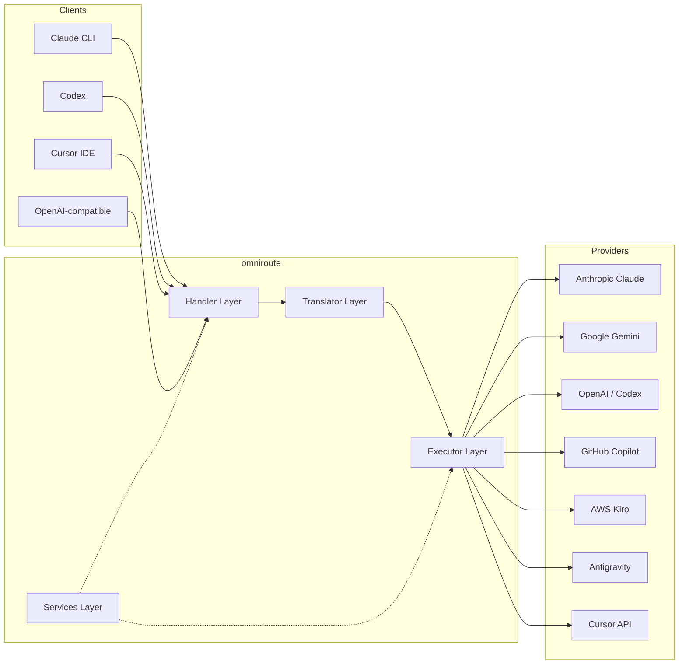

### หลักการสำคัญ: การแปลแบบ Hub-and-Spoke

การแปลทุกรูปแบบผ่าน **รูปแบบ OpenAI เป็นศูนย์กลาง**:

```
Client Format → [OpenAI Hub] → Provider Format    (request)
Provider Format → [OpenAI Hub] → Client Format    (response)
```

ซึ่งหมายความว่าคุณต้องการเพียง **N ตัวแปล** (หนึ่งตัวต่อรูปแบบ) แทนที่จะเป็น **N²** (ทุกคู่)

---

## 3. โครงสร้างโครงการ

```
omniroute/
├── open-sse/                  ← Core proxy library (portable, framework-agnostic)
│   ├── index.js               ← Main entry point, exports everything
│   ├── config/                ← Configuration & constants
│   ├── executors/             ← Provider-specific request execution
│   ├── handlers/              ← Request handling orchestration
│   ├── services/              ← Business logic (auth, models, fallback, usage)
│   ├── translator/            ← Format translation engine
│   │   ├── request/           ← Request translators (8 files)
│   │   ├── response/          ← Response translators (7 files)
│   │   └── helpers/           ← Shared translation utilities (6 files)
│   └── utils/                 ← Utility functions
├── src/                       ← Application layer (Express/Worker runtime)
│   ├── app/                   ← Web UI, API routes, middleware
│   ├── lib/                   ← Database, auth, and shared library code
│   ├── mitm/                  ← Man-in-the-middle proxy utilities
│   ├── models/                ← Database models
│   ├── shared/                ← Shared utilities (wrappers around open-sse)
│   ├── sse/                   ← SSE endpoint handlers
│   └── store/                 ← State management
├── data/                      ← Runtime data (credentials, logs)
│   └── provider-credentials.json   (external credentials override, gitignored)
└── tester/                    ← Test utilities
```

---

## 4. การแยกย่อยแบบโมดูลต่อโมดูล

### 4.1 การกำหนดค่า (`open-sse/config/`)

**แหล่งความจริงแหล่งเดียว** สำหรับการกำหนดค่าของผู้ให้บริการทั้งหมด

| ไฟล์                          | วัตถุประสงค์                                                                                                                                                                                                                     |
| ----------------------------- | -------------------------------------------------------------------------------------------------------------------------------------------------------------------------------------------------------------------------------- |
| `constants.ts`                | `PROVIDERS` ออบเจ็กต์ที่มี URL พื้นฐาน ข้อมูลประจำตัว OAuth (ค่าเริ่มต้น) ส่วนหัว และระบบแจ้งเริ่มต้นสำหรับผู้ให้บริการทุกราย ยังกำหนด `HTTP_STATUS`, `ERROR_TYPES`, `COOLDOWN_MS`, `BACKOFF_CONFIG` และ `SKIP_PATTERNS` อีกด้วย |
| `credentialLoader.ts`         | โหลดข้อมูลรับรองภายนอกจาก `data/provider-credentials.json` และรวมเข้ากับค่าเริ่มต้นที่ฮาร์ดโค้ดใน `PROVIDERS` เก็บความลับไว้นอกเหนือการควบคุมของแหล่งที่มาในขณะที่ยังคงความเข้ากันได้แบบย้อนหลัง                                 |
| `providerModels.ts`           | การลงทะเบียนโมเดลส่วนกลาง: นามแฝงของผู้ให้บริการแผนที่ → รหัสโมเดล ฟังก์ชันเช่น `getModels()`, `getProviderByAlias()`                                                                                                            |
| `codexInstructions.ts`        | คำแนะนำของระบบที่แทรกเข้าไปในคำขอ Codex (การแก้ไขข้อจำกัด กฎแซนด์บ็อกซ์ นโยบายการอนุมัติ)                                                                                                                                        |
| `defaultThinkingSignature.ts` | ลายเซ็น "การคิด" เริ่มต้นสำหรับโมเดล Claude และ Gemini                                                                                                                                                                           |
| `ollamaModels.ts`             | คำจำกัดความของสคีมาสำหรับโมเดล Ollama ท้องถิ่น (ชื่อ ขนาด ตระกูล การหาปริมาณ)                                                                                                                                                    |

#### ขั้นตอนการโหลดข้อมูลรับรอง

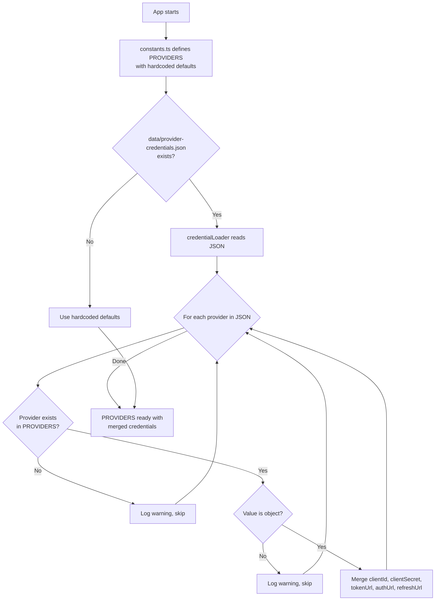

---

### 4.2 ผู้ดำเนินการ (`open-sse/executors/`)

ผู้ดำเนินการสรุป **ตรรกะเฉพาะของผู้ให้บริการ** โดยใช้ **รูปแบบกลยุทธ์** ตัวดำเนินการแต่ละตัวจะแทนที่วิธีพื้นฐานตามความจำเป็น

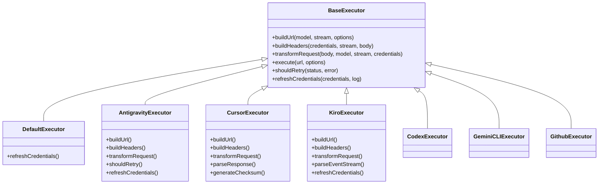

| ผู้ดำเนินการ     | ผู้ให้บริการ                              | ความเชี่ยวชาญพิเศษที่สำคัญ                                                                                                                       |
| ---------------- | ----------------------------------------- | ------------------------------------------------------------------------------------------------------------------------------------------------ |
| `base.ts`        | —                                         | ฐานบทคัดย่อ: การสร้าง URL, ส่วนหัว, ตรรกะการลองใหม่, การรีเฟรชข้อมูลรับรอง                                                                       |
| `default.ts`     | Claude, เมถุน, OpenAI, GLM, Kimi, MiniMax | การรีเฟรชโทเค็น OAuth ทั่วไปสำหรับผู้ให้บริการมาตรฐาน                                                                                            |
| `antigravity.ts` | รหัส Google Cloud                         | การสร้างรหัสโปรเจ็กต์/เซสชัน, ทางเลือกหลาย URL, ลองแยกวิเคราะห์ข้อความแสดงข้อผิดพลาดแบบกำหนดเองอีกครั้ง ("รีเซ็ตหลังจาก 2 ชม. 7 นาที 23 วินาที") |
| `cursor.ts`      | เคอร์เซอร์ IDE                            | **ซับซ้อนที่สุด**: การตรวจสอบสิทธิ์การตรวจสอบ SHA-256, การเข้ารหัสคำขอ Protobuf, ไบนารี EventStream → การแยกวิเคราะห์การตอบสนอง SSE              |
| `codex.ts`       | OpenAI Codex                              | ใส่คำสั่งของระบบ จัดการระดับการคิด ลบพารามิเตอร์ที่ไม่รองรับ                                                                                     |
| `gemini-cli.ts`  | Google ราศีเมถุน CLI                      | การสร้าง URL ที่กำหนดเอง (`streamGenerateContent`), การรีเฟรชโทเค็น Google OAuth                                                                 |
| `github.ts`      | นักบิน GitHub                             | ระบบโทเค็นคู่ (โทเค็น GitHub OAuth + โทเค็น Copilot) การเลียนแบบส่วนหัว VSCode                                                                   |
| `kiro.ts`        | AWS CodeWhisperer                         | การแยกวิเคราะห์ไบนารี AWS EventStream, เฟรมเหตุการณ์ AMZN, การประมาณโทเค็น                                                                       |
| `index.ts`       | —                                         | โรงงาน: ชื่อผู้ให้บริการแผนที่ → คลาสผู้ดำเนินการ โดยมีค่าเริ่มต้นสำรอง                                                                          |

---

### 4.3 ตัวจัดการ (`open-sse/handlers/`)

**เลเยอร์การเรียบเรียง** — ประสานงานการแปล การดำเนินการ การสตรีม และการจัดการข้อผิดพลาด

| ไฟล์                  | วัตถุประสงค์                                                                                                                                                                                                    |
| --------------------- | --------------------------------------------------------------------------------------------------------------------------------------------------------------------------------------------------------------- |
| `chatCore.ts`         | **ผู้เรียบเรียงกลาง** (~600 บรรทัด) จัดการวงจรคำขอที่สมบูรณ์: การตรวจจับรูปแบบ → การแปล → การส่งตัวดำเนินการ → การตอบสนองแบบสตรีมมิ่ง/ไม่สตรีมมิ่ง → การรีเฟรชโทเค็น → การจัดการข้อผิดพลาด → การบันทึกการใช้งาน |
| `responsesHandler.ts` | อะแดปเตอร์สำหรับ Responses API ของ OpenAI: แปลงรูปแบบการตอบกลับ → การแชทเสร็จสิ้น → ส่งไปที่ `chatCore` → แปลง SSE กลับเป็นรูปแบบการตอบกลับ                                                                     |
| `embeddings.ts`       | ตัวจัดการการสร้างการฝัง: แก้ไขโมเดลการฝัง → ผู้ให้บริการ, ส่งไปยัง API ของผู้ให้บริการ, ส่งคืนการตอบสนองการฝังที่เข้ากันได้กับ OpenAI รองรับผู้ให้บริการ 6+ ราย                                                 |
| `imageGeneration.ts`  | ตัวจัดการการสร้างรูปภาพ: แก้ไขโมเดลรูปภาพ → ผู้ให้บริการ รองรับโหมดที่เข้ากันได้กับ OpenAI, Gemini-image (ต้านแรงโน้มถ่วง) และโหมดทางเลือก (Nebius) ส่งกลับภาพ base64 หรือ URL                                  |

#### ระยะเวลาคำขอ (chatCore.ts)

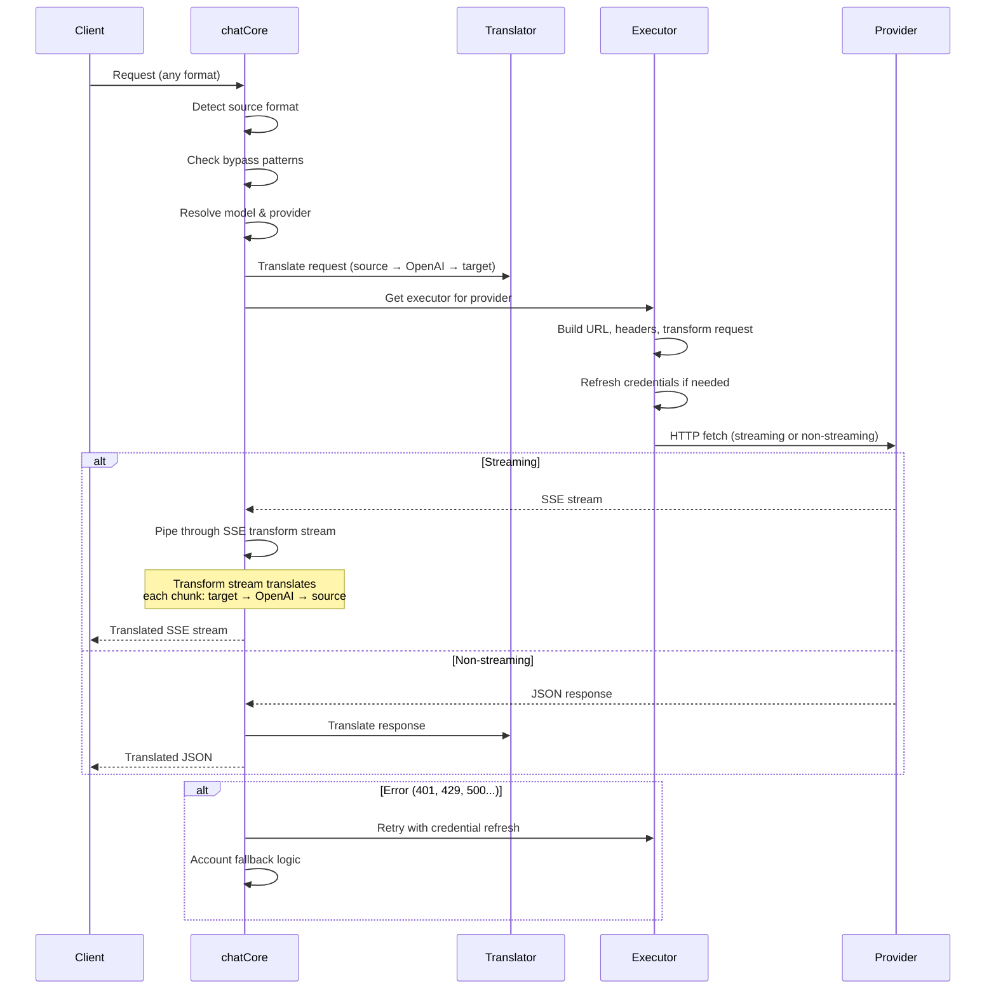

---

### 4.4 บริการ (`open-sse/services/`)

ตรรกะทางธุรกิจที่สนับสนุนตัวจัดการและผู้ดำเนินการ

| ไฟล์                 | วัตถุประสงค์                                                                                                                                                                                                                                                                                                                    |
| -------------------- | ------------------------------------------------------------------------------------------------------------------------------------------------------------------------------------------------------------------------------------------------------------------------------------------------------------------------------- |
| `provider.ts`        | **การตรวจจับรูปแบบ** (`detectFormat`): วิเคราะห์โครงสร้างคำขอเพื่อระบุรูปแบบ Claude/OpenAI/Gemini/Antigravity/Responses (รวมถึง `max_tokens` heuristic สำหรับ Claude) นอกจากนี้: การสร้าง URL, การสร้างส่วนหัว, การคิดการกำหนดค่าให้เป็นมาตรฐาน รองรับผู้ให้บริการแบบไดนามิก `openai-compatible-*` และ `anthropic-compatible-*` |
| `model.ts`           | การแยกวิเคราะห์สตริงโมเดล (`claude/model-name` → `{provider: "claude", model: "model-name"}`), การแก้ไขนามแฝงด้วยการตรวจจับการชนกัน, การดูแลอินพุต (ปฏิเสธอักขระการแวะผ่านพาธ/อักขระควบคุม) และการแก้ไขข้อมูลโมเดลด้วยการสนับสนุน getter นามแฝง async                                                                           |
| `accountFallback.ts` | การจัดการขีดจำกัดอัตรา: การถอยกลับแบบเอ็กซ์โปเนนเชียล (1 วินาที → 2 วินาที → 4 วินาที → สูงสุด 2 นาที), การจัดการคูลดาวน์บัญชี, การจัดหมวดหมู่ข้อผิดพลาด (ซึ่งข้อผิดพลาดทำให้เกิดทางเลือกเทียบกับไม่)                                                                                                                           |
| `tokenRefresh.ts`    | การรีเฟรชโทเค็น OAuth สำหรับ **ผู้ให้บริการทุกราย**: Google (Gemini, Antigravity), Claude, Codex, Qwen, iFlow, GitHub (OAuth + Copilot dual-token), Kiro (AWS SSO OIDC + Social Auth) รวมแคชการขจัดความซ้ำซ้อนตามสัญญาในเที่ยวบิน และลองอีกครั้งโดยใช้การแบ็คออฟแบบเอ็กซ์โปเนนเชียล                                             |
| `combo.ts`           | **โมเดลคอมโบ**: เชนของโมเดลสำรอง หากโมเดล A ล้มเหลวโดยมีข้อผิดพลาดที่มีสิทธิ์ใช้ทางเลือก ให้ลองใช้โมเดล B จากนั้นตามด้วย C ฯลฯ ส่งกลับรหัสสถานะอัปสตรีมจริง                                                                                                                                                                     |
| `usage.ts`           | ดึงข้อมูลโควต้า/การใช้งานจาก API ของผู้ให้บริการ (โควต้า GitHub Copilot, โควต้าโมเดล Antigravity, ขีดจำกัดอัตรา Codex, การแจกแจงการใช้งาน Kiro, การตั้งค่า Claude)                                                                                                                                                              |
| `accountSelector.ts` | การเลือกบัญชีอัจฉริยะพร้อมอัลกอริธึมการให้คะแนน: พิจารณาลำดับความสำคัญ สถานะสุขภาพ ตำแหน่งการวนซ้ำ และสถานะคูลดาวน์ เพื่อเลือกบัญชีที่เหมาะสมที่สุดสำหรับคำขอแต่ละรายการ                                                                                                                                                        |
| `contextManager.ts`  | การจัดการวงจรชีวิตของคำขอ: สร้างและติดตามออบเจ็กต์บริบทต่อคำขอด้วยข้อมูลเมตา (ID คำขอ การประทับเวลา ข้อมูลผู้ให้บริการ) สำหรับการดีบักและการบันทึก                                                                                                                                                                              |
| `ipFilter.ts`        | การควบคุมการเข้าถึงตาม IP: รองรับโหมดรายการที่อนุญาตและรายการที่บล็อก ตรวจสอบ IP ไคลเอ็นต์กับกฎที่กำหนดค่าไว้ก่อนที่จะประมวลผลคำขอ API                                                                                                                                                                                          |
| `sessionManager.ts`  | การติดตามเซสชันด้วยการพิมพ์ลายนิ้วมือไคลเอ็นต์: ติดตามเซสชันที่ใช้งานอยู่โดยใช้ตัวระบุไคลเอ็นต์แบบแฮช ตรวจสอบจำนวนคำขอ และจัดเตรียมตัววัดเซสชัน                                                                                                                                                                                 |
| `signatureCache.ts`  | ขอแคชการขจัดข้อมูลซ้ำซ้อนตามลายเซ็น: ป้องกันคำขอที่ซ้ำกันโดยการแคชลายเซ็นคำขอล่าสุด และส่งคืนการตอบกลับที่แคชไว้สำหรับคำขอที่เหมือนกันภายในกรอบเวลา                                                                                                                                                                             |
| `systemPrompt.ts`    | การแทรกพร้อมท์ของระบบทั่วโลก: เพิ่มหรือต่อท้ายพรอมต์ระบบที่กำหนดค่าได้สำหรับคำขอทั้งหมด โดยมีการจัดการความเข้ากันได้ต่อผู้ให้บริการ                                                                                                                                                                                             |
| `thinkingBudget.ts`  | การจัดการงบประมาณโทเค็นการใช้เหตุผล: รองรับโหมดส่งผ่าน, อัตโนมัติ (กำหนดค่าการคิดแบบสตริป), กำหนดเอง (งบประมาณคงที่) และโหมดการปรับตัว (ปรับขนาดความซับซ้อน) สำหรับการควบคุมโทเค็นการคิด/การใช้เหตุผล                                                                                                                           |
| `wildcardRouter.ts`  | การกำหนดเส้นทางรูปแบบโมเดลไวด์การ์ด: แก้ไขรูปแบบไวด์การ์ด (เช่น `*/claude-*`) ให้เป็นคู่ผู้ให้บริการ/โมเดลที่เป็นรูปธรรมโดยขึ้นอยู่กับความพร้อมใช้งานและลำดับความสำคัญ                                                                                                                                                          |

#### การรีเฟรชโทเค็นซ้ำซ้อน

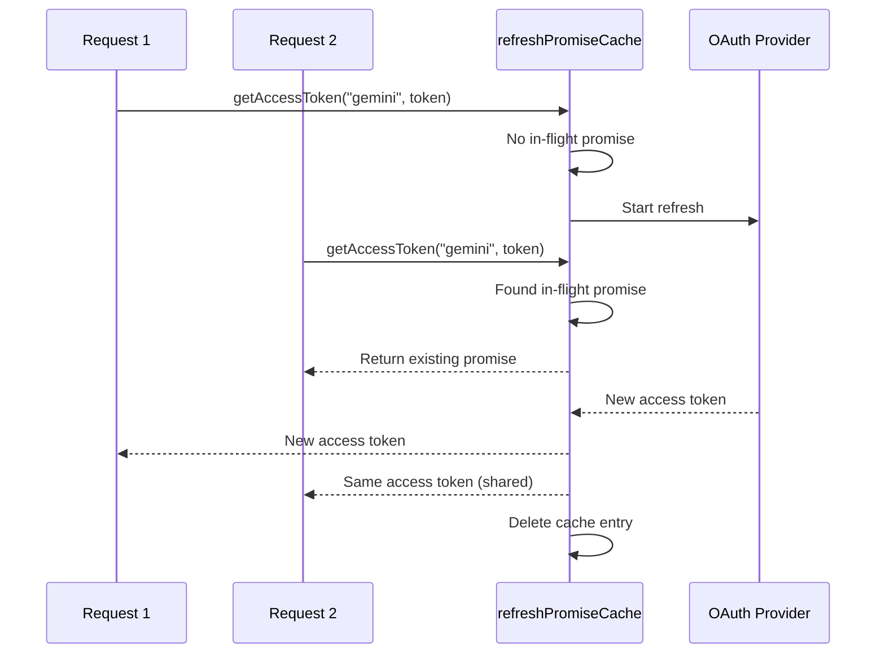

#### เครื่องสถานะสำรองบัญชี

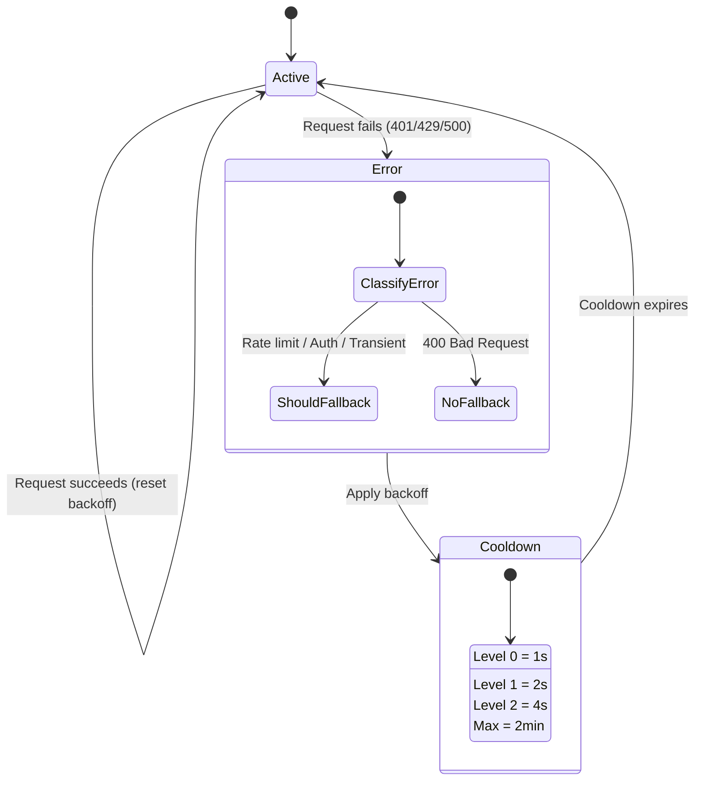

#### โซ่โมเดลคอมโบ

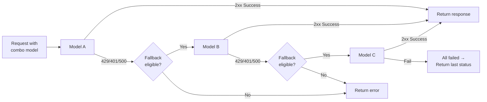

---

### 4.5 นักแปล (`open-sse/translator/`)

**เครื่องมือแปลรูปแบบ** ใช้ระบบปลั๊กอินที่ลงทะเบียนด้วยตนเอง

#### สถาปัตยกรรม

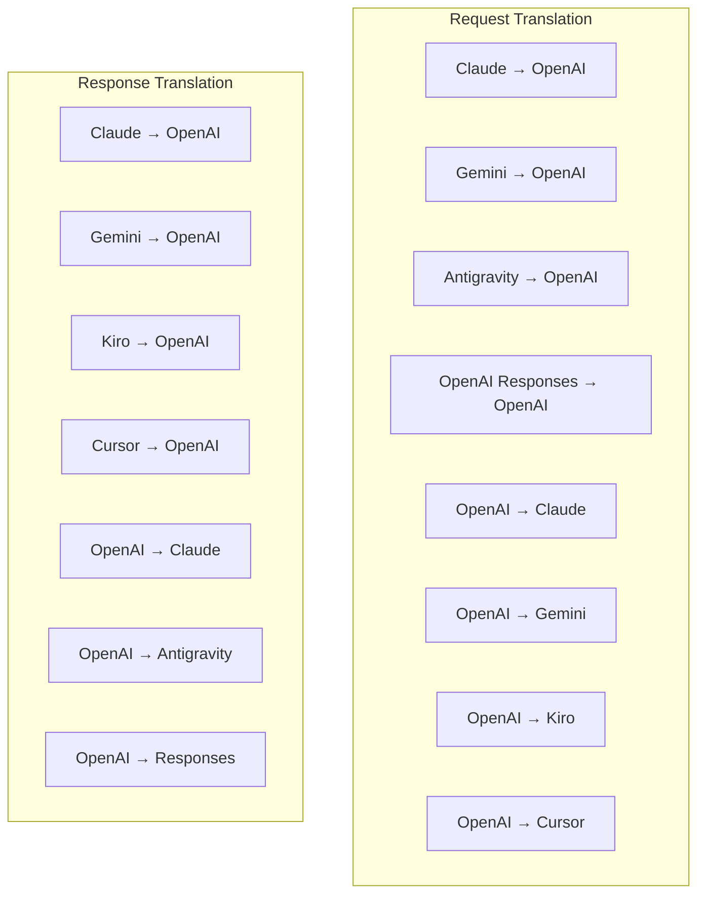

| ไดเรกทอรี    | ไฟล์        | คำอธิบาย                                                                                                                                                                                                                                                         |
| ------------ | ----------- | ---------------------------------------------------------------------------------------------------------------------------------------------------------------------------------------------------------------------------------------------------------------- |
| `request/`   | นักแปล 8 คน | แปลงเนื้อหาคำขอระหว่างรูปแบบ แต่ละไฟล์ลงทะเบียนด้วยตนเองผ่าน `register(from, to, fn)` เมื่อนำเข้า                                                                                                                                                                |
| `response/`  | นักแปล 7 คน | แปลงส่วนการตอบสนองการสตรีมระหว่างรูปแบบ จัดการประเภทเหตุการณ์ SSE, บล็อกการคิด, การเรียกใช้เครื่องมือ                                                                                                                                                            |
| `helpers/`   | 6 ตัวช่วย   | ยูทิลิตี้ที่ใช้ร่วมกัน: `claudeHelper` (การแยกพร้อมท์ของระบบ, การกำหนดค่าการคิด), `geminiHelper` (การแมปชิ้นส่วน/เนื้อหา), `openaiHelper` (การกรองรูปแบบ), `toolCallHelper` (การสร้าง ID, การแทรกการตอบสนองที่ขาดหายไป), `maxTokensHelper`, `responsesApiHelper` |
| `index.ts`   | —           | เครื่องมือการแปล: `translateRequest()`, `translateResponse()`, การจัดการสถานะ, การลงทะเบียน                                                                                                                                                                      |
| `formats.ts` | —           | รูปแบบค่าคงที่: `OPENAI`, `CLAUDE`, `GEMINI`, `ANTIGRAVITY`, `KIRO`, `CURSOR`, `OPENAI_RESPONSES`                                                                                                                                                                |

#### การออกแบบหลัก: ปลั๊กอินที่ลงทะเบียนด้วยตนเอง

```javascript
// Each translator file calls register() on import:
import { register } from "../index.js";
register("claude", "openai", translateClaudeToOpenAI);

// The index.js imports all translator files, triggering registration:
import "./request/claude-to-openai.js"; // ← self-registers
```

---

### 4.6 การใช้งาน (`open-sse/utils/`)

| ไฟล์               | วัตถุประสงค์                                                                                                                                                                                                                                                                           |
| ------------------ | -------------------------------------------------------------------------------------------------------------------------------------------------------------------------------------------------------------------------------------------------------------------------------------- |
| `error.ts`         | การสร้างการตอบสนองข้อผิดพลาด (รูปแบบที่เข้ากันได้กับ OpenAI), การแยกวิเคราะห์ข้อผิดพลาดอัปสตรีม, การแยกเวลาลองต้านแรงโน้มถ่วงอีกครั้งจากข้อความแสดงข้อผิดพลาด, การสตรีมข้อผิดพลาด SSE                                                                                                  |
| `stream.ts`        | **SSE Transform Stream** — ไปป์ไลน์การสตรีมหลัก สองโหมด: `TRANSLATE` (การแปลรูปแบบเต็ม) และ `PASSTHROUGH` (ทำให้เป็นมาตรฐาน + แยกการใช้งาน) จัดการการบัฟเฟอร์แบบก้อน การประมาณการใช้งาน การติดตามความยาวของเนื้อหา อินสแตนซ์ตัวเข้ารหัส/ตัวถอดรหัสต่อสตรีมหลีกเลี่ยงสถานะที่ใช้ร่วมกัน |
| `streamHelpers.ts` | ยูทิลิตี้ SSE ระดับต่ำ: `parseSSELine` (ทนต่อช่องว่าง), `hasValuableContent` (กรองส่วนว่างสำหรับ OpenAI/Claude/Gemini), `fixInvalidId`, `formatSSE` (การจัดลำดับ SSE ที่รับรู้รูปแบบด้วยการล้างข้อมูล `perf_metrics`)                                                                  |
| `usageTracking.ts` | การแยกการใช้โทเค็นจากรูปแบบใดๆ (Claude/OpenAI/Gemini/Responses) การประมาณค่าด้วยอัตราส่วนเครื่องมือ/ข้อความที่แยกจากกันต่ออักขระ การเพิ่มบัฟเฟอร์ (อัตราความปลอดภัยของโทเค็น 2,000 โทเค็น) การกรองฟิลด์เฉพาะรูปแบบ การบันทึกคอนโซลด้วยสี ANSI                                          |
| `requestLogger.ts` | การบันทึกคำขอตามไฟล์ (เลือกใช้ผ่าน `ENABLE_REQUEST_LOGS=true`) สร้างโฟลเดอร์เซสชันด้วยไฟล์ที่มีหมายเลขกำกับ: `1_req_client.json` → `7_res_client.txt` I/O ทั้งหมดเป็นแบบอะซิงโครนัส (fire-and-forget) มาสก์ส่วนหัวที่ละเอียดอ่อน                                                       |
| `bypassHandler.ts` | สกัดกั้นรูปแบบเฉพาะจาก Claude CLI (การแยกชื่อ การอุ่นเครื่อง การนับ) และส่งคืนการตอบกลับปลอมโดยไม่ต้องโทรหาผู้ให้บริการใดๆ รองรับทั้งสตรีมมิ่งและไม่สตรีมมิ่ง จำกัดโดยเจตนาไว้ที่ขอบเขตของ Claude CLI                                                                                  |
| `networkProxy.ts`  | แก้ไข URL พร็อกซีขาออกสำหรับผู้ให้บริการที่กำหนดโดยมีความสำคัญ: การกำหนดค่าเฉพาะผู้ให้บริการ → การกำหนดค่าส่วนกลาง → ตัวแปรสภาพแวดล้อม (`HTTPS_PROXY`/`HTTP_PROXY`/`ALL_PROXY`) รองรับการยกเว้น `NO_PROXY` กำหนดค่าแคชเป็นเวลา 30 วินาที                                               |

#### ไปป์ไลน์สตรีมมิ่ง SSE

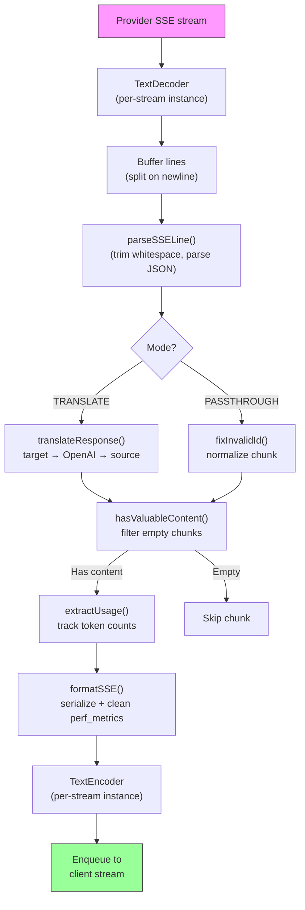

#### โครงสร้างเซสชันตัวบันทึกคำขอ

```
logs/
└── claude_gemini_claude-sonnet_20260208_143045/
    ├── 1_req_client.json      ← Raw client request
    ├── 2_req_source.json      ← After initial conversion
    ├── 3_req_openai.json      ← OpenAI intermediate format
    ├── 4_req_target.json      ← Final target format
    ├── 5_res_provider.txt     ← Provider SSE chunks (streaming)
    ├── 5_res_provider.json    ← Provider response (non-streaming)
    ├── 6_res_openai.txt       ← OpenAI intermediate chunks
    ├── 7_res_client.txt       ← Client-facing SSE chunks
    └── 6_error.json           ← Error details (if any)
```

---

### 4.7 ชั้นแอปพลิเคชัน (`src/`)

| ไดเรกทอรี     | วัตถุประสงค์                                                                          |
| ------------- | ------------------------------------------------------------------------------------- |
| `src/app/`    | UI ของเว็บ, เส้นทาง API, มิดเดิลแวร์ด่วน, ตัวจัดการการเรียกกลับ OAuth                 |
| `src/lib/`    | การเข้าถึงฐานข้อมูล (`localDb.ts`, `usageDb.ts`), การรับรองความถูกต้อง, ที่ใช้ร่วมกัน |
| `src/mitm/`   | ยูทิลิตี้พร็อกซีแบบ Man-in-the-middle สำหรับการสกัดกั้นการรับส่งข้อมูลของผู้ให้บริการ |
| `src/models/` | คำจำกัดความของโมเดลฐานข้อมูล                                                          |
| `src/shared/` | Wrappers รอบฟังก์ชัน open-sse (ผู้ให้บริการ สตรีม ข้อผิดพลาด ฯลฯ)                     |
| `src/sse/`    | ตัวจัดการตำแหน่งข้อมูล SSE ที่เชื่อมต่อไลบรารี open-sse ไปยังเส้นทางด่วน              |
| `src/store/`  | การจัดการสถานะแอปพลิเคชัน                                                             |

#### เส้นทาง API ที่โดดเด่น

| เส้นทาง                                       | วิธีการ      | วัตถุประสงค์                                                                  |
| --------------------------------------------- | ------------ | ----------------------------------------------------------------------------- | ------- |
| `/api/provider-models`                        | รับ/โพสต์/ลบ | CRUD สำหรับโมเดลที่กำหนดเองต่อผู้ให้บริการ                                    |
| `/api/models/catalog`                         | รับ          | แค็ตตาล็อกรวมของทุกรุ่น (แชท การฝัง รูปภาพ กำหนดเอง) จัดกลุ่มตามผู้ให้บริการ  |
| `/api/settings/proxy`                         | รับ/วาง/ลบ   | การกำหนดค่าพร็อกซีขาออกแบบลำดับชั้น (`global/providers/combos/keys`)          |
| `/api/settings/proxy/test`                    | โพสต์        | ตรวจสอบการเชื่อมต่อพร็อกซีและส่งคืน IP/เวลาแฝง                                | สาธารณะ |
| `/v1/providers/[provider]/chat/completions`   | โพสต์        | การแชทต่อผู้ให้บริการโดยเฉพาะพร้อมการตรวจสอบความถูกต้องของโมเดล               |
| `/v1/providers/[provider]/embeddings`         | โพสต์        | การฝังต่อผู้ให้บริการโดยเฉพาะพร้อมการตรวจสอบความถูกต้องของโมเดล               |
| `/v1/providers/[provider]/images/generations` | โพสต์        | การสร้างอิมเมจต่อผู้ให้บริการโดยเฉพาะพร้อมการตรวจสอบโมเดล                     |
| `/api/settings/ip-filter`                     | รับ/ใส่      | การจัดการรายการ IP ที่อนุญาต/รายการบล็อก                                      |
| `/api/settings/thinking-budget`               | รับ/ใส่      | การกำหนดค่างบประมาณโทเค็นการให้เหตุผล (ส่งผ่าน/อัตโนมัติ/กำหนดเอง/แบบปรับได้) |
| `/api/settings/system-prompt`                 | รับ/ใส่      | ระบบ Global พร้อมฉีดสำหรับทุกคำขอ                                             |
| `/api/sessions`                               | รับ          | การติดตามเซสชันและตัวชี้วัดที่ใช้งานอยู่                                      |
| `/api/rate-limits`                            | รับ          | สถานะขีดจำกัดอัตราต่อบัญชี                                                    |

---

## 5. รูปแบบการออกแบบที่สำคัญ

### 5.1 การแปลแบบ Hub และ Spoke

ทุกรูปแบบแปลผ่าน **รูปแบบ OpenAI เป็นศูนย์กลาง** การเพิ่มผู้ให้บริการใหม่จำเป็นต้องมีการเขียนนักแปล **หนึ่งคู่** (ถึง/จาก OpenAI) ไม่ใช่ N คู่

### 5.2 รูปแบบกลยุทธ์ผู้บริหาร

ผู้ให้บริการแต่ละรายมีคลาสตัวดำเนินการเฉพาะที่สืบทอดมาจาก `BaseExecutor` โรงงานใน `executors/index.ts` เลือกโรงงานที่เหมาะสมขณะรันไทม์

### 5.3 ระบบปลั๊กอินลงทะเบียนด้วยตนเอง

โมดูลนักแปลลงทะเบียนตัวเองในการนำเข้าผ่าน `register()` การเพิ่มนักแปลใหม่เป็นเพียงการสร้างไฟล์และนำเข้าเท่านั้น

### 5.4 บัญชีสำรองพร้อม Exponential Backoff

เมื่อผู้ให้บริการส่งคืน 429/401/500 ระบบสามารถสลับไปยังบัญชีถัดไป โดยใช้คูลดาวน์แบบเอ็กซ์โพเนนเชียล (1 วินาที → 2 วินาที → 4 วินาที → สูงสุด 2 นาที)

### 5.5 โซ่รุ่นคอมโบ

"คำสั่งผสม" จัดกลุ่มสตริง `provider/model` หลายรายการ หากรายการแรกล้มเหลว ให้ถอยกลับไปยังรายการถัดไปโดยอัตโนมัติ

### 5.6 การแปลสตรีมมิ่งแบบ stateful

การแปลการตอบสนองจะรักษาสถานะทั่วทั้งกลุ่ม SSE (การติดตามบล็อกความคิด การสะสมการเรียกเครื่องมือ การทำดัชนีบล็อกเนื้อหา) ผ่านกลไก `initState()`

### 5.7 บัฟเฟอร์ความปลอดภัยในการใช้งาน

มีการเพิ่มบัฟเฟอร์ 2,000 โทเค็นในการใช้งานที่รายงาน เพื่อป้องกันไม่ให้ไคลเอ็นต์เข้าถึงขีดจำกัดหน้าต่างบริบท เนื่องจากโอเวอร์เฮดจากการแจ้งเตือนของระบบและการแปลรูปแบบ

---

## 6. รูปแบบที่รองรับ

| รูปแบบ                   | ทิศทาง                | ตัวระบุ            |
| ------------------------ | --------------------- | ------------------ |
| การแชท OpenAI เสร็จสิ้น  | แหล่งที่มา + เป้าหมาย | `openai`           |
| API การตอบสนองของ OpenAI | แหล่งที่มา + เป้าหมาย | `openai-responses` |
| มานุษยวิทยาคลอด          | แหล่งที่มา + เป้าหมาย | `claude`           |
| Google ราศีเมถุน         | แหล่งที่มา + เป้าหมาย | `gemini`           |
| Google ราศีเมถุน CLI     | กำหนดเป้าหมายเท่านั้น | `gemini-cli`       |
| ต้านแรงโน้มถ่วง          | แหล่งที่มา + เป้าหมาย | `antigravity`      |
| AWS Kiro                 | กำหนดเป้าหมายเท่านั้น | `kiro`             |
| เคอร์เซอร์               | กำหนดเป้าหมายเท่านั้น | `cursor`           |

---

## 7. ผู้ให้บริการที่รองรับ

| ผู้ให้บริการ             | วิธีการรับรองความถูกต้อง | ผู้ดำเนินการ    | หมายเหตุสำคัญ                                        |
| ------------------------ | ------------------------ | --------------- | ---------------------------------------------------- |
| มานุษยวิทยาคลอด          | คีย์ API หรือ OAuth      | ค่าเริ่มต้น     | ใช้ `x-api-key` ส่วนหัว                              |
| Google ราศีเมถุน         | คีย์ API หรือ OAuth      | ค่าเริ่มต้น     | ใช้ `x-goog-api-key` ส่วนหัว                         |
| Google ราศีเมถุน CLI     | OAuth                    | GeminiCLI       | ใช้ปลายทาง `streamGenerateContent`                   |
| ต้านแรงโน้มถ่วง          | OAuth                    | ต้านแรงโน้มถ่วง | ทางเลือกหลาย URL, ลองแยกวิเคราะห์อีกครั้งแบบกำหนดเอง |
| OpenAI                   | คีย์ API                 | ค่าเริ่มต้น     | ผู้ถือมาตรฐานรับรองความถูกต้อง                       |
| โคเด็กซ์                 | OAuth                    | โคเด็กซ์        | อัดคำสั่งระบบ จัดการการคิด                           |
| นักบิน GitHub            | OAuth + โทเค็น Copilot   | Github          | โทเค็นคู่, ส่วนหัว VSCode เลียนแบบ                   |
| คิโระ (AWS)              | AWS SSO OIDC หรือโซเชียล | คิโระ           | การแยกวิเคราะห์ EventStream ไบนารี                   |
| เคอร์เซอร์ IDE           | การตรวจสอบความถูกต้อง    | เคอร์เซอร์      | การเข้ารหัส Protobuf, เช็คซัม SHA-256                |
| ควีน                     | OAuth                    | ค่าเริ่มต้น     | การรับรองมาตรฐาน                                     |
| ไอโฟลว์                  | OAuth (พื้นฐาน + ผู้ถือ) | ค่าเริ่มต้น     | ส่วนหัวการรับรองความถูกต้องแบบคู่                    |
| OpenRouter               | คีย์ API                 | ค่าเริ่มต้น     | ผู้ถือมาตรฐานรับรองความถูกต้อง                       |
| GLM, Kimi, MiniMax       | คีย์ API                 | ค่าเริ่มต้น     | เข้ากันได้กับ Claude ใช้ `x-api-key`                 |
| `openai-compatible-*`    | คีย์ API                 | ค่าเริ่มต้น     | ไดนามิก: จุดสิ้นสุดที่เข้ากันได้กับ OpenAI           |
| `anthropic-compatible-*` | คีย์ API                 | ค่าเริ่มต้น     | ไดนามิก: จุดสิ้นสุดที่เข้ากันได้กับ Claude           |

---

## 8. สรุปการไหลของข้อมูล

### คำขอสตรีมมิ่ง

```mermaid
flowchart LR
    A["Client"] --> B["detectFormat()"]
    B --> C["translateRequest()\nsource → OpenAI → target"]
    C --> D["Executor\nbuildUrl + buildHeaders"]
    D --> E["fetch(providerURL)"]
    E --> F["createSSEStream()\nTRANSLATE mode"]
    F --> G["parseSSELine()"]
    G --> H["translateResponse()\ntarget → OpenAI → source"]
    H --> I["extractUsage()\n+ addBuffer"]
    I --> J["formatSSE()"]
    J --> K["Client receives\ntranslated SSE"]
    K --> L["logUsage()\nsaveRequestUsage()"]
```

### คำขอที่ไม่ใช่สตรีมมิ่ง

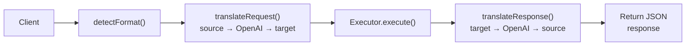

### บายพาสโฟลว์ (Claude CLI)

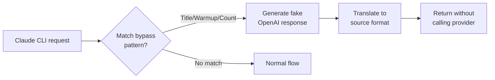
