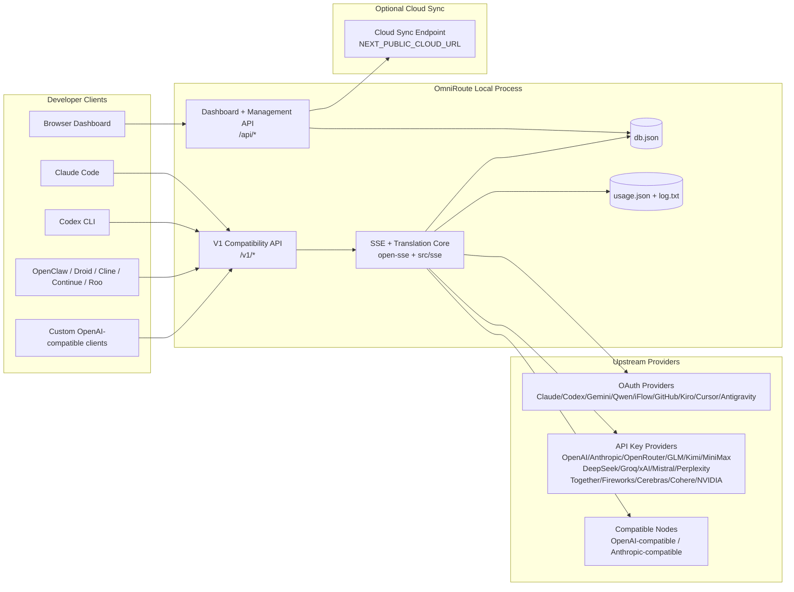
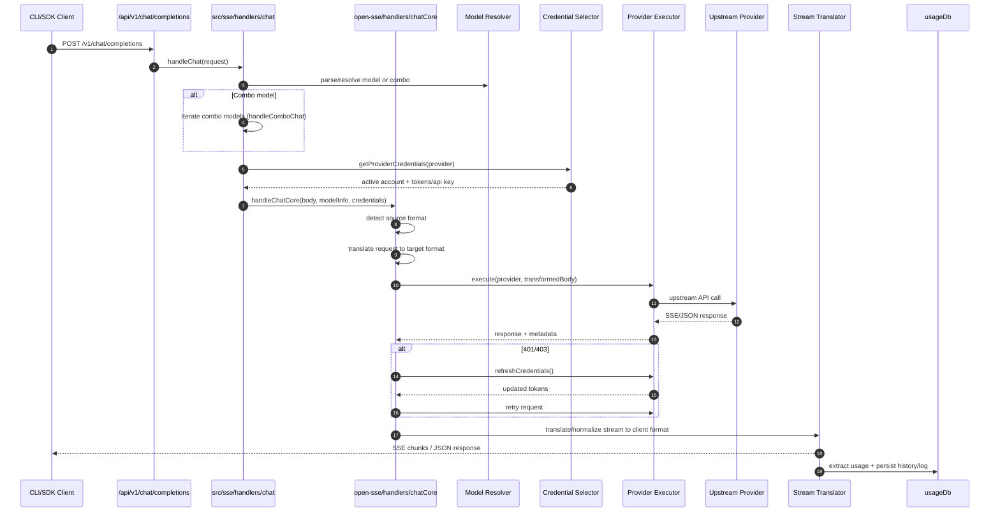
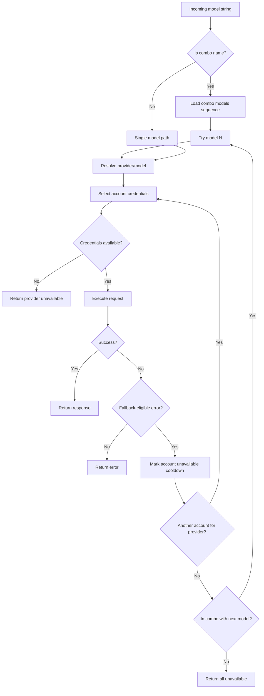
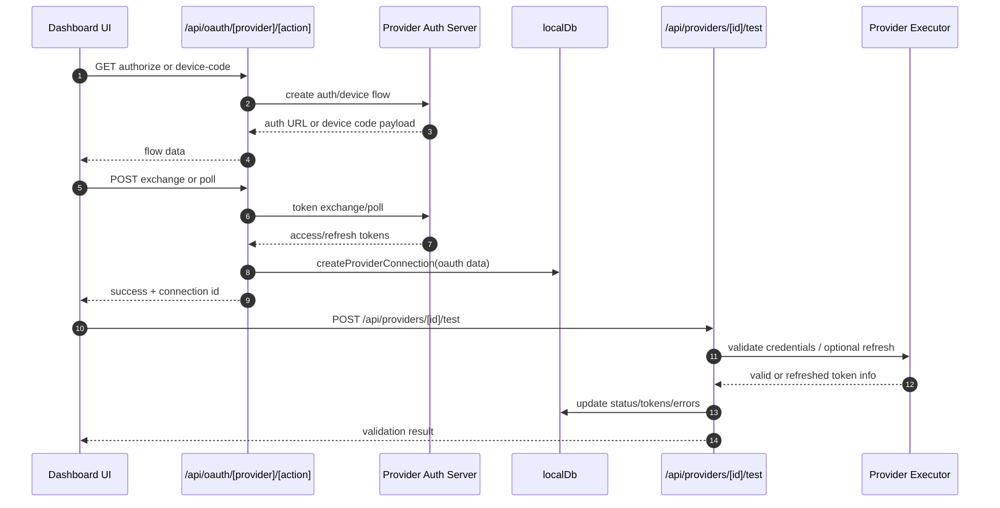
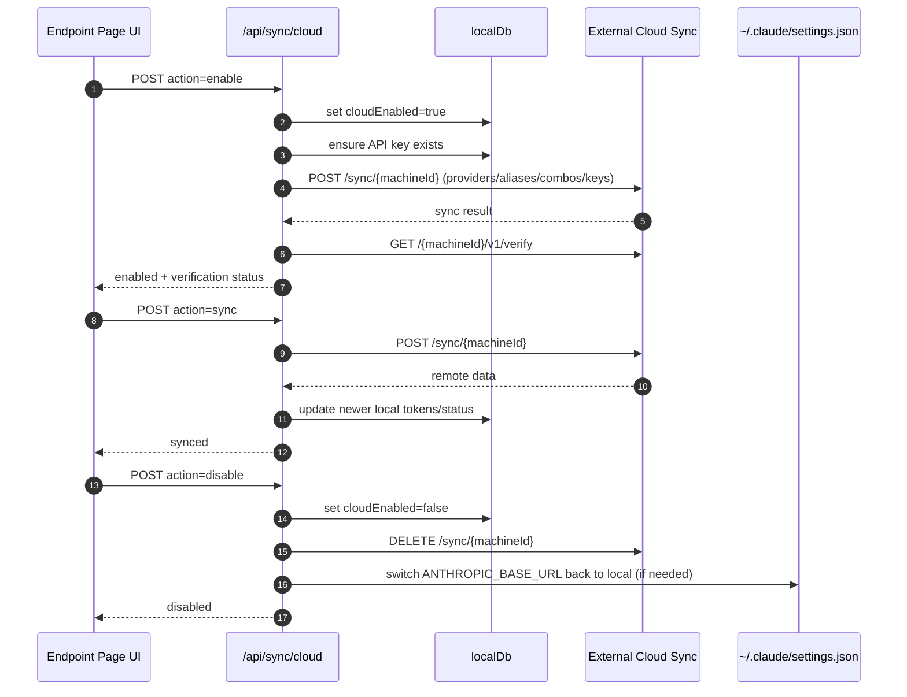
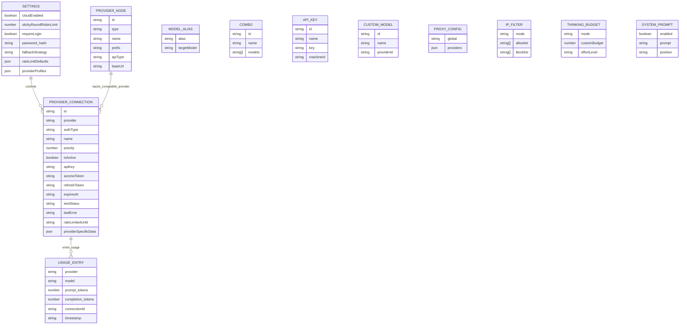
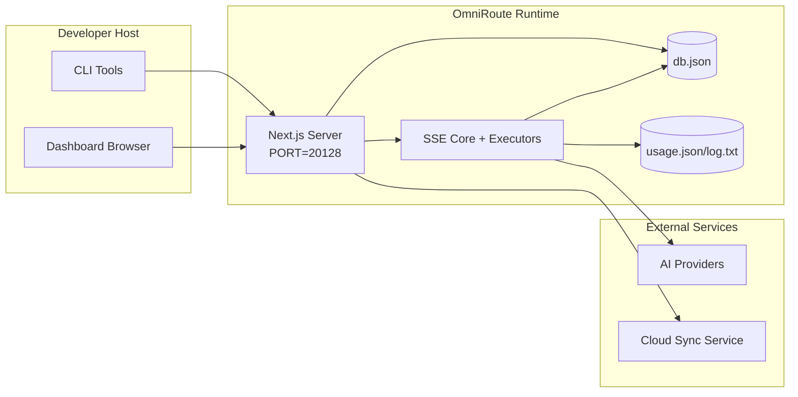

# Архітектура OmniRoute

🌐 **Languages:** 🇺🇸 [English](../../ARCHITECTURE.md) | 🇧🇷 [Português (Brasil)](../pt-BR/ARCHITECTURE.md) | 🇪🇸 [Español](../es/ARCHITECTURE.md) | 🇫🇷 [Français](../fr/ARCHITECTURE.md) | 🇮🇹 [Italiano](../it/ARCHITECTURE.md) | 🇷🇺 [Русский](../ru/ARCHITECTURE.md) | 🇨🇳 [中文 (简体)](../zh-CN/ARCHITECTURE.md) | 🇩🇪 [Deutsch](../de/ARCHITECTURE.md) | 🇮🇳 [हिन्दी](../in/ARCHITECTURE.md) | 🇹🇭 [ไทย](../th/ARCHITECTURE.md) | 🇺🇦 [Українська](../uk-UA/ARCHITECTURE.md) | 🇸🇦 [العربية](../ar/ARCHITECTURE.md) | 🇯🇵 [日本語](../ja/ARCHITECTURE.md) | 🇻🇳 [Tiếng Việt](../vi/ARCHITECTURE.md) | 🇧🇬 [Български](../bg/ARCHITECTURE.md) | 🇩🇰 [Dansk](../da/ARCHITECTURE.md) | 🇫🇮 [Suomi](../fi/ARCHITECTURE.md) | 🇮🇱 [עברית](../he/ARCHITECTURE.md) | 🇭🇺 [Magyar](../hu/ARCHITECTURE.md) | 🇮🇩 [Bahasa Indonesia](../id/ARCHITECTURE.md) | 🇰🇷 [한국어](../ko/ARCHITECTURE.md) | 🇲🇾 [Bahasa Melayu](../ms/ARCHITECTURE.md) | 🇳🇱 [Nederlands](../nl/ARCHITECTURE.md) | 🇳🇴 [Norsk](../no/ARCHITECTURE.md) | 🇵🇹 [Português (Portugal)](../pt/ARCHITECTURE.md) | 🇷🇴 [Română](../ro/ARCHITECTURE.md) | 🇵🇱 [Polski](../pl/ARCHITECTURE.md) | 🇸🇰 [Slovenčina](../sk/ARCHITECTURE.md) | 🇸🇪 [Svenska](../sv/ARCHITECTURE.md) | 🇵🇭 [Filipino](../phi/ARCHITECTURE.md)

_Останнє оновлення: 2026-02-18_

## Резюме

OmniRoute — це локальний шлюз штучного інтелекту та інформаційна панель, побудована на Next.js.
Він надає єдину кінцеву точку, сумісну з OpenAI (`/v1/*`), і направляє трафік між декількома вихідними постачальниками з перекладом, резервним варіантом, оновленням маркерів і відстеженням використання.

Основні можливості:

- OpenAI-сумісна поверхня API для CLI/інструментів (28 постачальників)
- Переклад запитів/відповідей між форматами постачальників
- Запасна комбінована модель (багатомодельна послідовність)
- Запасний варіант на рівні облікового запису (декілька облікових записів на постачальника)
- OAuth + API-ключ управління підключенням провайдера
- Генерація вбудовування через `/v1/embeddings` (6 провайдерів, 9 моделей)
- Генерація зображення через `/v1/images/generations` (4 постачальники, 9 моделей)
- Аналіз тегів мислення (`<think>...</think>`) для моделей міркування
  — Дезінфекція відповіді для суворої сумісності з OpenAI SDK
  — Нормалізація ролі (розробник→система, система→користувач) для сумісності між постачальниками
- Перетворення структурованого виводу (json_schema → Gemini responseSchema)
- Локальна постійність для провайдерів, ключів, псевдонімів, комбо, налаштувань, ціноутворення
- Відстеження використання/вартості та реєстрація запитів
- Додаткова хмарна синхронізація для синхронізації кількох пристроїв/станів
  — Список дозволених/чорних IP-адрес для контролю доступу до API
- Продумане управління бюджетом (прохідний/автоматичний/спеціальний/адаптивний)
- Оперативна ін'єкція глобальної системи
- Відстеження сесії та відбитки пальців
- Розширене обмеження швидкості для кожного облікового запису за допомогою профілів постачальника
- Схема автоматичного вимикача для стійкості провайдера
- Захист стада від грому з блокуванням м'ютексу
  — Кеш дедуплікації запитів на основі підпису
- Рівень домену: доступність моделі, правила вартості, резервна політика, політика блокування
- Постійність стану домену (скрізний кеш SQLite для резервних копій, бюджетів, блокувань, автоматичних вимикачів)
- Механізм політики для централізованої оцінки запитів (блокування → бюджет → резервний варіант)
- Запит телеметрії з агрегацією затримок p50/p95/p99
- Ідентифікатор кореляції (X-Request-Id) для наскрізного відстеження
- Журнал аудиту відповідності з відмовою для кожного ключа API
- Eval framework для забезпечення якості LLM
  — Панель інструментів інтерфейсу Resilience зі статусом автоматичного вимикача в режимі реального часу
- Модульні постачальники OAuth (12 окремих модулів під `src/lib/oauth/providers/`)

Основна модель середовища виконання:

- Маршрути програми Next.js під `src/app/api/*` реалізують як API панелі керування, так і API сумісності
- Спільне ядро SSE/маршрутизації в `src/sse/*` + `open-sse/*` обробляє виконання провайдера, переклад, потокове передавання, відкат і використання

## Обсяг і межі

### У межах

- Час виконання локального шлюзу
- API керування інформаційною панеллю
- Автентифікація постачальника та оновлення маркера
- Запит на переклад і потокове передавання SSE
  — Локальний стан + постійність використання
  — Додаткова синхронізація з хмарою

### Поза межами

- Реалізація хмарної служби за `NEXT_PUBLIC_CLOUD_URL`
- Площина SLA/контроль постачальника поза локальним процесом
- Самі зовнішні двійкові файли CLI (Claude CLI, Codex CLI тощо)

## Системний контекст високого рівня



## Основні компоненти середовища виконання

## 1) API та рівень маршрутизації (маршрути програми Next.js)

Основні каталоги:

- `src/app/api/v1/*` та `src/app/api/v1beta/*` для API сумісності
- `src/app/api/*` для API керування/конфігурації
- Далі перезаписує в `next.config.mjs` карту `/v1/*` на `/api/v1/*`

Важливі маршрути сумісності:

- `src/app/api/v1/chat/completions/route.ts`
- `src/app/api/v1/messages/route.ts`
- `src/app/api/v1/responses/route.ts`
- `src/app/api/v1/models/route.ts` — включає власні моделі з `custom: true`
- `src/app/api/v1/embeddings/route.ts` — генерація вбудовування (6 провайдерів)
- `src/app/api/v1/images/generations/route.ts` — генерація зображень (4+ провайдери вкл. Antigravity/Nebius)
- `src/app/api/v1/messages/count_tokens/route.ts`
- `src/app/api/v1/providers/[provider]/chat/completions/route.ts` — спеціальний чат для кожного провайдера
- `src/app/api/v1/providers/[provider]/embeddings/route.ts` — виділені вбудовування для кожного постачальника
- `src/app/api/v1/providers/[provider]/images/generations/route.ts` — виділені зображення для кожного постачальника
- `src/app/api/v1beta/models/route.ts`
- `src/app/api/v1beta/models/[...path]/route.ts`

Домени керування:

- Аутентифікація/налаштування: `src/app/api/auth/*`, `src/app/api/settings/*`
- Постачальники/підключення: `src/app/api/providers*`
- Вузли постачальника: `src/app/api/provider-nodes*`
- Спеціальні моделі: `src/app/api/provider-models` (GET/POST/DELETE)
- Каталог моделей: `src/app/api/models/catalog` (GET)
- Конфігурація проксі: `src/app/api/settings/proxy` (GET/PUT/DELETE) + `src/app/api/settings/proxy/test` (POST)
- OAuth: `src/app/api/oauth/*`
- Ключі/псевдоніми/комбінації/ціни: `src/app/api/keys*`, `src/app/api/models/alias`, `src/app/api/combos*`, `src/app/api/pricing`
- Використання: `src/app/api/usage/*`
- Синхронізація/хмара: `src/app/api/sync/*`, `src/app/api/cloud/*`
- Допоміжні інструменти CLI: `src/app/api/cli-tools/*`
- IP-фільтр: `src/app/api/settings/ip-filter` (GET/PUT)
- Бюджет мислення: `src/app/api/settings/thinking-budget` (GET/PUT)
- Системне повідомлення: `src/app/api/settings/system-prompt` (GET/PUT)
- Сеанси: `src/app/api/sessions` (ОТРИМАТИ)
- Обмеження швидкості: `src/app/api/rate-limits` (GET)
- Стійкість: `src/app/api/resilience` (GET/PATCH) — профілі постачальників, автоматичний вимикач, граничний стан швидкості
- Скидання стійкості: `src/app/api/resilience/reset` (POST) — скидання вимикачів + відновлення
- Статистика кешу: `src/app/api/cache/stats` (GET/DELETE)
- Доступність моделі: `src/app/api/models/availability` (GET/POST)
- Телеметрія: `src/app/api/telemetry/summary` (GET)
- Бюджет: `src/app/api/usage/budget` (GET/POST)
- Резервні ланцюжки: `src/app/api/fallback/chains` (GET/POST/DELETE)
- Аудит відповідності: `src/app/api/compliance/audit-log` (GET)
- Оцінки: `src/app/api/evals` (GET/POST), `src/app/api/evals/[suiteId]` (GET)
- Правила: `src/app/api/policies` (GET/POST)

## 2) SSE + Translation Core

Основні модулі потоку:

- Запис: `src/sse/handlers/chat.ts`
- Оркестровка ядра: `open-sse/handlers/chatCore.ts`
- Адаптери виконання постачальника: `open-sse/executors/*`
- Виявлення формату/конфігурація постачальника: `open-sse/services/provider.ts`
- Розбір/вирішення моделі: `src/sse/services/model.ts`, `open-sse/services/model.ts`
- Резервна логіка облікового запису: `open-sse/services/accountFallback.ts`
- Реєстр перекладів: `open-sse/translator/index.ts`
- Трансформації потоку: `open-sse/utils/stream.ts`, `open-sse/utils/streamHandler.ts`
- Вилучення/нормалізація використання: `open-sse/utils/usageTracking.ts`
- Розбір тегів Think: `open-sse/utils/thinkTagParser.ts`
- Обробник вбудовування: `open-sse/handlers/embeddings.ts`
- Реєстр постачальника вбудовування: `open-sse/config/embeddingRegistry.ts`
- Обробник створення зображення: `open-sse/handlers/imageGeneration.ts`
- Реєстр постачальників зображень: `open-sse/config/imageRegistry.ts`
- Дезінфекція відповіді: `open-sse/handlers/responseSanitizer.ts`
- Нормалізація ролі: `open-sse/services/roleNormalizer.ts`

Послуги (бізнес-логіка):

- Вибір облікового запису/оцінка: `open-sse/services/accountSelector.ts`
- Керування життєвим циклом контексту: `open-sse/services/contextManager.ts`
- Примусовий IP-фільтр: `open-sse/services/ipFilter.ts`
- Відстеження сесії: `open-sse/services/sessionManager.ts`
- Запит на дедуплікацію: `open-sse/services/signatureCache.ts`
- Системна підказка: `open-sse/services/systemPrompt.ts`
- Продумане управління бюджетом: `open-sse/services/thinkingBudget.ts`
- Маршрутизація моделі підстановок: `open-sse/services/wildcardRouter.ts`
- Керування обмеженнями швидкості: `open-sse/services/rateLimitManager.ts`
- Автоматичний вимикач: `open-sse/services/circuitBreaker.ts`

Модулі рівня домену:

- Доступність моделі: `src/lib/domain/modelAvailability.ts`
- Правила витрат/бюджети: `src/lib/domain/costRules.ts`
- Резервна політика: `src/lib/domain/fallbackPolicy.ts`
- Комбінований розпізнавач: `src/lib/domain/comboResolver.ts`
- Політика блокування: `src/lib/domain/lockoutPolicy.ts`
- Механізм політики: `src/domain/policyEngine.ts` — централізоване блокування → бюджет → резервна оцінка
- Каталог кодів помилок: `src/lib/domain/errorCodes.ts`
- Ідентифікатор запиту: `src/lib/domain/requestId.ts`
- Час очікування отримання: `src/lib/domain/fetchTimeout.ts`
- Запит телеметрії: `src/lib/domain/requestTelemetry.ts`
- Відповідність/аудит: `src/lib/domain/compliance/index.ts`
- Eval runner: `src/lib/domain/evalRunner.ts`
- Постійність стану домену: `src/lib/db/domainState.ts` — SQLite CRUD для резервних ланцюжків, бюджетів, історії витрат, стану блокування, автоматичних вимикачів

Модулі постачальника OAuth (12 окремих файлів під `src/lib/oauth/providers/`):

- Індекс реєстру: `src/lib/oauth/providers/index.ts`
- Окремі постачальники: `claude.ts`, `codex.ts`, `gemini.ts`, `antigravity.ts`, `iflow.ts`, `qwen.ts`, `kimi-coding.ts`, `github.ts`, `kiro.ts`, `cursor.ts`, `kilocode.ts`, `cline.ts`
- Тонка оболонка: `src/lib/oauth/providers.ts` — реекспорт з окремих модулів

## 3) Рівень стійкості

База даних первинного стану:

- `src/lib/localDb.ts`
- файл: `${DATA_DIR}/db.json` (або `$XDG_CONFIG_HOME/omniroute/db.json`, якщо встановлено, інакше `~/.omniroute/db.json`)
- сутності: providerConnections, providerNodes, modelAliases, combos, apiKeys, settings, pricing, **customModels**, **proxyConfig**, **ipFilter**, **thinkingBudget**, **systemPrompt**

БД використання:

- `src/lib/usageDb.ts`
- файли: `${DATA_DIR}/usage.json`, `${DATA_DIR}/log.txt`, `${DATA_DIR}/call_logs/`
- дотримується тієї ж базової політики каталогу, що й `localDb` (`DATA_DIR`, потім `XDG_CONFIG_HOME/omniroute`, якщо встановлено)
- розкладено на підмодулі: `migrations.ts`, `usageHistory.ts`, `costCalculator.ts`, `usageStats.ts`, `callLogs.ts`

БД стану домену (SQLite):

- `src/lib/db/domainState.ts` — операції CRUD для стану домену
- Таблиці (створені в `src/lib/db/core.ts`): `domain_fallback_chains`, `domain_budgets`, `domain_cost_history`, `domain_lockout_state`, `domain_circuit_breakers`
- Шаблон кешу наскрізного запису: Карти в пам'яті є авторитетними під час виконання; мутації записуються синхронно в SQLite; стан відновлюється з БД при холодному запуску

## 4) Auth + Security Surfaces

- Автентифікація файлів cookie інформаційної панелі: `src/proxy.ts`, `src/app/api/auth/login/route.ts`
- Генерація/перевірка ключа API: `src/shared/utils/apiKey.ts`
- Секрети постачальника зберігаються в `providerConnections` записах
- Підтримка вихідного проксі-сервера через `open-sse/utils/proxyFetch.ts` (env vars) і `open-sse/utils/networkProxy.ts` (налаштовується для кожного постачальника або глобально)

## 5) Хмарна синхронізація

- Ініціалізація планувальника: `src/lib/initCloudSync.ts`, `src/shared/services/initializeCloudSync.ts`
- Періодичне завдання: `src/shared/services/cloudSyncScheduler.ts`
- Контрольний маршрут: `src/app/api/sync/cloud/route.ts`

## Життєвий цикл запиту (`/v1/chat/completions`)



## Combo + Потік резервного облікового запису



Резервні рішення керуються `open-sse/services/accountFallback.ts` за допомогою кодів стану та евристики повідомлень про помилки.

## Введення OAuth і життєвий цикл оновлення маркерів



Оновлення під час живого трафіку виконується всередині `open-sse/handlers/chatCore.ts` через виконавець `refreshCredentials()`.

## Життєвий цикл Cloud Sync (Увімкнути / Синхронізувати / Вимкнути)



Періодичну синхронізацію запускає `CloudSyncScheduler`, коли хмару ввімкнено.

## Модель даних і карта зберігання



Файли фізичного зберігання:

- основний стан: `${DATA_DIR}/db.json` (або `$XDG_CONFIG_HOME/omniroute/db.json`, якщо встановлено, інакше `~/.omniroute/db.json`)
- статистика використання: `${DATA_DIR}/usage.json`
- рядки журналу запитів: `${DATA_DIR}/log.txt`
- додатковий перекладач/сеанси налагодження запитів: `<repo>/logs/...`

## Топологія розгортання



## Відображення модулів (важливо для прийняття рішень)

### Модулі маршруту та API

- `src/app/api/v1/*`, `src/app/api/v1beta/*`: API сумісності
- `src/app/api/v1/providers/[provider]/*`: виділені маршрути для кожного постачальника (чат, вбудовування, зображення)
- `src/app/api/providers*`: CRUD провайдера, перевірка, тестування
- `src/app/api/provider-nodes*`: настроюване сумісне керування вузлом
- `src/app/api/provider-models`: користувацьке керування моделлю (CRUD)
- `src/app/api/models/catalog`: API каталогу повної моделі (усі типи згруповані за постачальником)
- `src/app/api/oauth/*`: потоки OAuth/код пристрою
- `src/app/api/keys*`: життєвий цикл локального ключа API
- `src/app/api/models/alias`: керування псевдонімами
- `src/app/api/combos*`: резервне керування комбо
- `src/app/api/pricing`: заміна ціноутворення для розрахунку вартості
- `src/app/api/settings/proxy`: конфігурація проксі (GET/PUT/DELETE)
- `src/app/api/settings/proxy/test`: тест підключення вихідного проксі (POST)
- `src/app/api/usage/*`: API використання та журналів
- `src/app/api/sync/*` + `src/app/api/cloud/*`: хмарна синхронізація та помічники в хмарі
- `src/app/api/cli-tools/*`: локальні автори/перевірки конфігурації CLI
- `src/app/api/settings/ip-filter`: список дозволених/чорних IP-адрес (GET/PUT)
- `src/app/api/settings/thinking-budget`: конфігурація бюджету маркера мислення (GET/PUT)
- `src/app/api/settings/system-prompt`: глобальна системна підказка (GET/PUT)
- `src/app/api/sessions`: список активних сеансів (GET)
- `src/app/api/rate-limits`: статус ліміту ставки на обліковий запис (GET)

### Ядро маршрутизації та виконання

- `src/sse/handlers/chat.ts`: синтаксичний аналіз запиту, комбінована обробка, цикл вибору облікового запису
- `open-sse/handlers/chatCore.ts`: переклад, розсилка виконавця, обробка повторів/оновлень, налаштування потоку
- `open-sse/executors/*`: поведінка мережі та формату залежно від постачальника

### Реєстр перекладів і конвертери форматів

- `open-sse/translator/index.ts`: реєстр перекладачів і оркестровка
- Запит перекладачів: `open-sse/translator/request/*`
- Перекладачі відповідей: `open-sse/translator/response/*`
- Константи формату: `open-sse/translator/formats.ts`

### Наполегливість

- `src/lib/localDb.ts`: постійна конфігурація/стан
- `src/lib/usageDb.ts`: історія використання та журнали поточних запитів

## Покриття виконавця постачальника (шаблон стратегії)

Кожен постачальник має спеціалізований виконавець, що розширює `BaseExecutor` (у `open-sse/executors/base.ts`), який забезпечує побудову URL-адреси, побудову заголовка, повторну спробу з експоненційною відстрочкою, перехоплювачі оновлення облікових даних і метод оркестровки `execute()`.

| Виконавець            | Постачальник(и)                                                                                                                                              | Спеціальна обробка                                                            |
| --------------------- | ------------------------------------------------------------------------------------------------------------------------------------------------------------ | ----------------------------------------------------------------------------- |
| `DefaultExecutor`     | OpenAI, Claude, Gemini, Qwen, iFlow, OpenRouter, GLM, Kimi, MiniMax, DeepSeek, Groq, xAI, Mistral, Perplexity, Together, Fireworks, Cerebras, Cohere, NVIDIA | Конфігурація динамічної URL-адреси/заголовка для кожного постачальника        |
| `AntigravityExecutor` | Антигравітація Google                                                                                                                                        | Ідентифікатори користувацьких проектів/сеансів, повторна спроба після аналізу |
| `CodexExecutor`       | OpenAI Codex                                                                                                                                                 | Впроваджує системні інструкції, змушує міркувати                              |
| `CursorExecutor`      | Курсор IDE                                                                                                                                                   | Протокол ConnectRPC, кодування Protobuf, підпис запиту через контрольну суму  |
| `GithubExecutor`      | Копілот GitHub                                                                                                                                               | Оновлення маркера Copilot, заголовки, що імітують VSCode                      |
| `KiroExecutor`        | AWS CodeWhisperer/Kiro                                                                                                                                       | Двійковий формат AWS EventStream → Перетворення SSE                           |
| `GeminiCLIExecutor`   | Gemini CLI                                                                                                                                                   | Цикл оновлення маркера Google OAuth                                           |

Усі інші постачальники (включно з настроюваними сумісними вузлами) використовують `DefaultExecutor`.

## Матриця сумісності постачальників

| Постачальник     | Формат           | Авторизація            | Потік            | Непотоковий | Токен Оновити | Використання API          |
| ---------------- | ---------------- | ---------------------- | ---------------- | ----------- | ------------- | ------------------------- |
| Клод             | Клод             | Ключ API / OAuth       | ✅               | ✅          | ✅            | ⚠️ Лише адміністратор     |
| Близнюки         | близнюки         | Ключ API / OAuth       | ✅               | ✅          | ✅            | ⚠️ Хмарна консоль         |
| Gemini CLI       | gemini-cli       | OAuth                  | ✅               | ✅          | ✅            | ⚠️ Хмарна консоль         |
| Антигравітація   | антигравітація   | OAuth                  | ✅               | ✅          | ✅            | ✅ Повна квота API        |
| OpenAI           | openai           | Ключ API               | ✅               | ✅          | ❌            | ❌                        |
| Кодекс           | openai-відповіді | OAuth                  | ✅ примусовий    | ❌          | ✅            | ✅ Обмеження тарифів      |
| Копілот GitHub   | openai           | OAuth + Copilot Token  | ✅               | ✅          | ✅            | ✅ Знімки квот            |
| Курсор           | курсор           | Власна контрольна сума | ✅               | ✅          | ❌            | ❌                        |
| Кіро             | kiro             | AWS SSO OIDC           | ✅ (EventStream) | ❌          | ✅            | ✅ Обмеження використання |
| Квен             | openai           | OAuth                  | ✅               | ✅          | ✅            | ⚠️ За запитом             |
| iFlow            | openai           | OAuth (базовий)        | ✅               | ✅          | ✅            | ⚠️ За запитом             |
| OpenRouter       | openai           | Ключ API               | ✅               | ✅          | ❌            | ❌                        |
| GLM/Kimi/MiniMax | Клод             | Ключ API               | ✅               | ✅          | ❌            | ❌                        |
| DeepSeek         | openai           | Ключ API               | ✅               | ✅          | ❌            | ❌                        |
| Groq             | openai           | Ключ API               | ✅               | ✅          | ❌            | ❌                        |
| xAI (Грок)       | openai           | Ключ API               | ✅               | ✅          | ❌            | ❌                        |
| Містраль         | openai           | Ключ API               | ✅               | ✅          | ❌            | ❌                        |
| Розгубленість    | openai           | Ключ API               | ✅               | ✅          | ❌            | ❌                        |
| Разом AI         | openai           | Ключ API               | ✅               | ✅          | ❌            | ❌                        |
| Феєрверк AI      | openai           | Ключ API               | ✅               | ✅          | ❌            | ❌                        |
| Головний мозок   | openai           | Ключ API               | ✅               | ✅          | ❌            | ❌                        |
| Cohere           | openai           | Ключ API               | ✅               | ✅          | ❌            | ❌                        |
| NVIDIA NIM       | openai           | Ключ API               | ✅               | ✅          | ❌            | ❌                        |

## Покриття перекладу формату

Виявлені вихідні формати включають:

- `openai`
- `openai-responses`
- `claude`
- `gemini`

Цільові формати включають:

- Чат/Відповіді OpenAI
- Клод
- Gemini/Gemini-CLI/Антигравітаційна оболонка
- Кіро
- Курсор

Для перекладу використовується **OpenAI як центральний формат** — усі перетворення проходять через OpenAI як проміжний:

```
Source Format → OpenAI (hub) → Target Format
```

Переклади вибираються динамічно на основі форми вихідного корисного навантаження та цільового формату постачальника.

Додаткові рівні обробки в конвеєрі перекладу:

- **Дезінфікація відповіді** — видаляє нестандартні поля з відповідей у форматі OpenAI (як потокових, так і не потокових), щоб забезпечити сувору відповідність SDK
- **Нормалізація ролі** — перетворює `developer` → `system` для цілей, що не є OpenAI; об’єднує `system` → `user` для моделей, які відхиляють системну роль (GLM, ERNIE)
- **Вилучення тегів мислення** — аналізує блоки `<think>...</think>` з вмісту в поле `reasoning_content`
- **Структурований вихід** — перетворює OpenAI `response_format.json_schema` на `responseMimeType` + `responseSchema` Gemini

## Підтримувані кінцеві точки API

| Кінцева точка                                      | Формат                | Обробник                                                          |
| -------------------------------------------------- | --------------------- | ----------------------------------------------------------------- |
| `POST /v1/chat/completions`                        | Чат OpenAI            | `src/sse/handlers/chat.ts`                                        |
| `POST /v1/messages`                                | Повідомлення Клода    | Той самий обробник (визначено автоматично)                        |
| `POST /v1/responses`                               | Відповіді OpenAI      | `open-sse/handlers/responsesHandler.ts`                           |
| `POST /v1/embeddings`                              | Вбудовування OpenAI   | `open-sse/handlers/embeddings.ts`                                 |
| `GET /v1/embeddings`                               | Список моделей        | Маршрут API                                                       |
| `POST /v1/images/generations`                      | Зображення OpenAI     | `open-sse/handlers/imageGeneration.ts`                            |
| `GET /v1/images/generations`                       | Список моделей        | Маршрут API                                                       |
| `POST /v1/providers/{provider}/chat/completions`   | Чат OpenAI            | Виділено для кожного постачальника з перевіркою моделі            |
| `POST /v1/providers/{provider}/embeddings`         | Вбудовування OpenAI   | Виділено для кожного постачальника з перевіркою моделі            |
| `POST /v1/providers/{provider}/images/generations` | Зображення OpenAI     | Виділено для кожного постачальника з перевіркою моделі            |
| `POST /v1/messages/count_tokens`                   | Клод Токен Підрахунок | Маршрут API                                                       |
| `GET /v1/models`                                   | Список моделей OpenAI | Маршрут API (чат + вбудовування + зображення + спеціальні моделі) |
| `GET /api/models/catalog`                          | Каталог               | Усі моделі згруповані за постачальником + тип                     |
| `POST /v1beta/models/*:streamGenerateContent`      | Близнюки рідні        | Маршрут API                                                       |
| `GET/PUT/DELETE /api/settings/proxy`               | Конфігурація проксі   | Налаштування мережевого проксі                                    |
| `POST /api/settings/proxy/test`                    | З'єднання проксі      | Кінцева точка перевірки справності/з’єднання проксі               |
| `GET/POST/DELETE /api/provider-models`             | Спеціальні моделі     | Керування індивідуальною моделлю для кожного постачальника        |

## Обхідний обробник

Обхідний обробник (`open-sse/utils/bypassHandler.ts`) перехоплює відомі запити на «викидання» від Claude CLI — пінг розігріву, вилучення заголовків і підрахунок токенів — і повертає **підроблену відповідь**, не споживаючи токени постачальника вищестоящих даних. Це спрацьовує лише тоді, коли `User-Agent` містить `claude-cli`.

## Конвеєр реєстратора запитів

Реєстратор запитів (`open-sse/utils/requestLogger.ts`) забезпечує 7-етапний конвеєр журналювання налагодження, вимкнений за замовчуванням, увімкнений через `ENABLE_REQUEST_LOGS=true`:

```
1_req_client.json → 2_req_source.json → 3_req_openai.json → 4_req_target.json
→ 5_res_provider.txt → 6_res_openai.txt → 7_res_client.txt
```

Файли записуються в `<repo>/logs/<session>/` для кожного сеансу запиту.

## Режими відмов і стійкість

## 1) Доступність облікового запису/постачальника

- час відновлення облікового запису постачальника через тимчасові помилки/помилки швидкості/автентифікації
- резервний обліковий запис перед невдалим запитом
- резервна комбінована модель, коли поточний шлях моделі/постачальника вичерпано

## 2) Термін дії маркера

- попередня перевірка та оновлення з повторною спробою для оновлюваних постачальників
- Повторна спроба 401/403 після спроби оновлення в основному шляху

## 3) Безпека потоку

- контролер потоку з відключенням
- потік перекладу зі змивом у кінці потоку та обробкою `[DONE]`
- резервна оцінка використання, якщо метадані використання постачальника відсутні

## 4) Деградація хмарної синхронізації

- виникають помилки синхронізації, але локальне виконання продовжується
- планувальник має логіку повторної спроби, але періодичне виконання наразі викликає синхронізацію з одноразовою спробою за замовчуванням

## 5) Цілісність даних

— Міграція/відновлення форми БД для відсутніх ключів

- пошкоджені гарантії скидання JSON для localDb і usageDb

## Спостережливість і робочі сигнали

Джерела видимості під час виконання:

- журнали консолі від `src/sse/utils/logger.ts`
- сукупні дані про використання за запитом у `usage.json`
- текстовий журнал статусу запиту `log.txt`
- додаткові глибокі журнали запитів/перекладів під `logs/`, коли `ENABLE_REQUEST_LOGS=true`
- кінцеві точки використання інформаційної панелі (`/api/usage/*`) для використання інтерфейсу користувача

## Чутливі до безпеки межі

- Секрет JWT (`JWT_SECRET`) захищає перевірку/підпис файлів cookie сеансу інструментальної панелі
- Початковий резервний пароль (`INITIAL_PASSWORD`, за замовчуванням `123456`) має бути перевизначений у реальних розгортаннях
- Ключ API HMAC Secret (`API_KEY_SECRET`) захищає згенерований локальний формат ключа API
- Секрети постачальника (ключі/токени API) зберігаються в локальній БД і повинні бути захищені на рівні файлової системи
- Кінцеві точки хмарної синхронізації покладаються на автентику ключа API + семантику ідентифікатора машини

## Середовище та матриця виконання

Змінні середовища, які активно використовуються кодом:

- Додаток/автентифікація: `JWT_SECRET`, `INITIAL_PASSWORD`
- Зберігання: `DATA_DIR`
- Сумісна поведінка вузла: `ALLOW_MULTI_CONNECTIONS_PER_COMPAT_NODE`
- Перевизначення додаткової бази пам’яті (Linux/macOS, коли `DATA_DIR` не встановлено): `XDG_CONFIG_HOME`
- Хешування безпеки: `API_KEY_SECRET`, `MACHINE_ID_SALT`
- Журнал: `ENABLE_REQUEST_LOGS`
- URL-адреси синхронізації/хмари: `NEXT_PUBLIC_BASE_URL`, `NEXT_PUBLIC_CLOUD_URL`
- Вихідний проксі: `HTTP_PROXY`, `HTTPS_PROXY`, `ALL_PROXY`, `NO_PROXY` та варіанти в нижньому регістрі
- Прапори функції SOCKS5: `ENABLE_SOCKS5_PROXY`, `NEXT_PUBLIC_ENABLE_SOCKS5_PROXY`
- Помічники платформи/виконання (не для конкретної програми): `APPDATA`, `NODE_ENV`, `PORT`, `HOSTNAME`

## Відомі архітектурні примітки

1. `usageDb` та `localDb` тепер спільно використовують ту саму базову політику каталогу (`DATA_DIR` -> `XDG_CONFIG_HOME/omniroute` -> `~/.omniroute`) із переміщенням файлів у старі версії.
2. `/api/v1/route.ts` повертає список статичних моделей і не є основним джерелом моделей, яке використовує `/v1/models`.
3. Реєстратор запитів записує повні заголовки/тіло, якщо ввімкнено; вважати каталог журналу конфіденційним.
4. Поведінка хмари залежить від правильності `NEXT_PUBLIC_BASE_URL` та доступності кінцевої точки хмари.
5. Каталог `open-sse/` опубліковано як `@omniroute/open-sse` **пакет робочої області npm**. Вихідний код імпортує його через `@omniroute/open-sse/...` (вирішено Next.js `transpilePackages`). Шляхи до файлів у цьому документі все ще використовують назву каталогу `open-sse/` для узгодженості.
6. Діаграми на інформаційній панелі використовують **Recharts** (на основі SVG) для доступної інтерактивної візуалізації аналітики (гістограми використання моделі, таблиці розбивки постачальників із показниками успіху).
7. Тести E2E використовують **Playwright** (`tests/e2e/`), запускають через `npm run test:e2e`. У модульних тестах використовується **Node.js Test Runner** (`tests/unit/`), запускається через `npm run test:plan3`. Вихідним кодом під `src/` є **TypeScript** (`.ts`/`.tsx`); робоча область `open-sse/` залишається JavaScript (`.js`).
8. Сторінка налаштувань організована на 5 вкладках: Безпека, Маршрутизація (6 глобальних стратегій: спочатку заповнює, циклічна, p2c, випадкова, найменш використовувана, оптимізована за витратами), Стійкість (редаговані обмеження швидкості, автоматичний вимикач, політики), ШІ (бюджет мислення, системна підказка, кеш підказок), Додатково (проксі).

## Контрольний список операційної перевірки

- Збірка з джерела: `npm run build`
- Створити образ Docker: `docker build -t omniroute .`
- Запустіть службу та перевірте:
- `GET /api/settings`
- `GET /api/v1/models`
- Цільова базова URL-адреса CLI має бути `http://<host>:20128/v1`, коли `PORT=20128`
