# omniroute — Документація кодової бази

🌐 **Languages:** 🇺🇸 [English](../../CODEBASE_DOCUMENTATION.md) | 🇧🇷 [Português (Brasil)](../pt-BR/CODEBASE_DOCUMENTATION.md) | 🇪🇸 [Español](../es/CODEBASE_DOCUMENTATION.md) | 🇫🇷 [Français](../fr/CODEBASE_DOCUMENTATION.md) | 🇮🇹 [Italiano](../it/CODEBASE_DOCUMENTATION.md) | 🇷🇺 [Русский](../ru/CODEBASE_DOCUMENTATION.md) | 🇨🇳 [中文 (简体)](../zh-CN/CODEBASE_DOCUMENTATION.md) | 🇩🇪 [Deutsch](../de/CODEBASE_DOCUMENTATION.md) | 🇮🇳 [हिन्दी](../in/CODEBASE_DOCUMENTATION.md) | 🇹🇭 [ไทย](../th/CODEBASE_DOCUMENTATION.md) | 🇺🇦 [Українська](../uk-UA/CODEBASE_DOCUMENTATION.md) | 🇸🇦 [العربية](../ar/CODEBASE_DOCUMENTATION.md) | 🇯🇵 [日本語](../ja/CODEBASE_DOCUMENTATION.md) | 🇻🇳 [Tiếng Việt](../vi/CODEBASE_DOCUMENTATION.md) | 🇧🇬 [Български](../bg/CODEBASE_DOCUMENTATION.md) | 🇩🇰 [Dansk](../da/CODEBASE_DOCUMENTATION.md) | 🇫🇮 [Suomi](../fi/CODEBASE_DOCUMENTATION.md) | 🇮🇱 [עברית](../he/CODEBASE_DOCUMENTATION.md) | 🇭🇺 [Magyar](../hu/CODEBASE_DOCUMENTATION.md) | 🇮🇩 [Bahasa Indonesia](../id/CODEBASE_DOCUMENTATION.md) | 🇰🇷 [한국어](../ko/CODEBASE_DOCUMENTATION.md) | 🇲🇾 [Bahasa Melayu](../ms/CODEBASE_DOCUMENTATION.md) | 🇳🇱 [Nederlands](../nl/CODEBASE_DOCUMENTATION.md) | 🇳🇴 [Norsk](../no/CODEBASE_DOCUMENTATION.md) | 🇵🇹 [Português (Portugal)](../pt/CODEBASE_DOCUMENTATION.md) | 🇷🇴 [Română](../ro/CODEBASE_DOCUMENTATION.md) | 🇵🇱 [Polski](../pl/CODEBASE_DOCUMENTATION.md) | 🇸🇰 [Slovenčina](../sk/CODEBASE_DOCUMENTATION.md) | 🇸🇪 [Svenska](../sv/CODEBASE_DOCUMENTATION.md) | 🇵🇭 [Filipino](../phi/CODEBASE_DOCUMENTATION.md)

> Вичерпний, зручний для початківців посібник із **omniroute** багатопровайдерного проксі-маршрутизатора AI.

---

## 1. Що таке omniroute?

omniroute — це **проксі-маршрутизатор**, який знаходиться між клієнтами AI (Claude CLI, Codex, Cursor IDE тощо) та постачальниками AI (Anthropic, Google, OpenAI, AWS, GitHub тощо). Це вирішує одну велику проблему:

> **Різні клієнти ШІ розмовляють різними «мовами» (форматами API), і різні постачальники ШІ також очікують різних «мов».** omniroute автоматично перекладає між ними.

Думайте про це як про універсального перекладача в Організації Об’єднаних Націй — будь-який делегат може говорити будь-якою мовою, і перекладач перетворює її для будь-якого іншого делегата.

---

## 2. Огляд архітектури

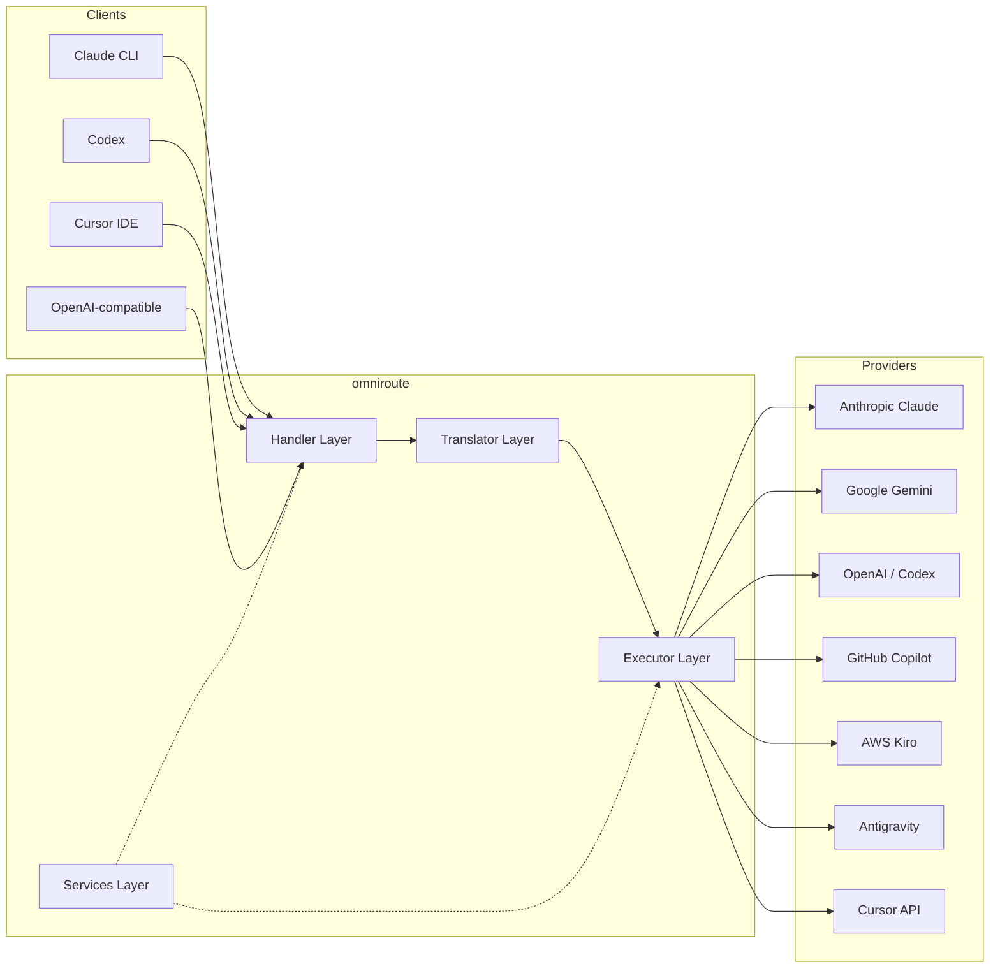

### Основний принцип: комплексний переклад

Усі трансляції форматів проходять через **формат OpenAI як центр**:

```
Client Format → [OpenAI Hub] → Provider Format    (request)
Provider Format → [OpenAI Hub] → Client Format    (response)
```

Це означає, що вам потрібно лише **N перекладачів** (по одному на формат) замість **N²** (кожна пара).

---

## 3. Структура проекту

```
omniroute/
├── open-sse/                  ← Core proxy library (portable, framework-agnostic)
│   ├── index.js               ← Main entry point, exports everything
│   ├── config/                ← Configuration & constants
│   ├── executors/             ← Provider-specific request execution
│   ├── handlers/              ← Request handling orchestration
│   ├── services/              ← Business logic (auth, models, fallback, usage)
│   ├── translator/            ← Format translation engine
│   │   ├── request/           ← Request translators (8 files)
│   │   ├── response/          ← Response translators (7 files)
│   │   └── helpers/           ← Shared translation utilities (6 files)
│   └── utils/                 ← Utility functions
├── src/                       ← Application layer (Express/Worker runtime)
│   ├── app/                   ← Web UI, API routes, middleware
│   ├── lib/                   ← Database, auth, and shared library code
│   ├── mitm/                  ← Man-in-the-middle proxy utilities
│   ├── models/                ← Database models
│   ├── shared/                ← Shared utilities (wrappers around open-sse)
│   ├── sse/                   ← SSE endpoint handlers
│   └── store/                 ← State management
├── data/                      ← Runtime data (credentials, logs)
│   └── provider-credentials.json   (external credentials override, gitignored)
└── tester/                    ← Test utilities
```

---

## 4. Розбивка по модулях

### 4.1 Конфігурація (`open-sse/config/`)

**Єдине джерело правди** для всіх конфігурацій постачальників.

| Файл                          | Призначення                                                                                                                                                                                                                                                               |
| ----------------------------- | ------------------------------------------------------------------------------------------------------------------------------------------------------------------------------------------------------------------------------------------------------------------------- |
| `constants.ts`                | Об’єкт `PROVIDERS` з базовими URL-адресами, обліковими даними OAuth (за замовчуванням), заголовками та системними підказками за замовчуванням для кожного постачальника. Також визначає `HTTP_STATUS`, `ERROR_TYPES`, `COOLDOWN_MS`, `BACKOFF_CONFIG` та `SKIP_PATTERNS`. |
| `credentialLoader.ts`         | Завантажує зовнішні облікові дані з `data/provider-credentials.json` та об’єднує їх із жорстко запрограмованими параметрами за замовчуванням у `PROVIDERS`. Зберігає секрети поза контролем джерела, зберігаючи зворотну сумісність.                                      |
| `providerModels.ts`           | Центральний реєстр моделей: псевдоніми постачальників карт → ідентифікатори моделей. Такі функції, як `getModels()`, `getProviderByAlias()`.                                                                                                                              |
| `codexInstructions.ts`        | Системні інструкції, введені в запити Codex (обмеження редагування, правила пісочниці, політики затвердження).                                                                                                                                                            |
| `defaultThinkingSignature.ts` | Стандартні «мислячі» підписи для моделей Claude і Gemini.                                                                                                                                                                                                                 |
| `ollamaModels.ts`             | Визначення схеми для локальних моделей Ollama (назва, розмір, сімейство, квантування).                                                                                                                                                                                    |

#### Потік завантаження облікових даних

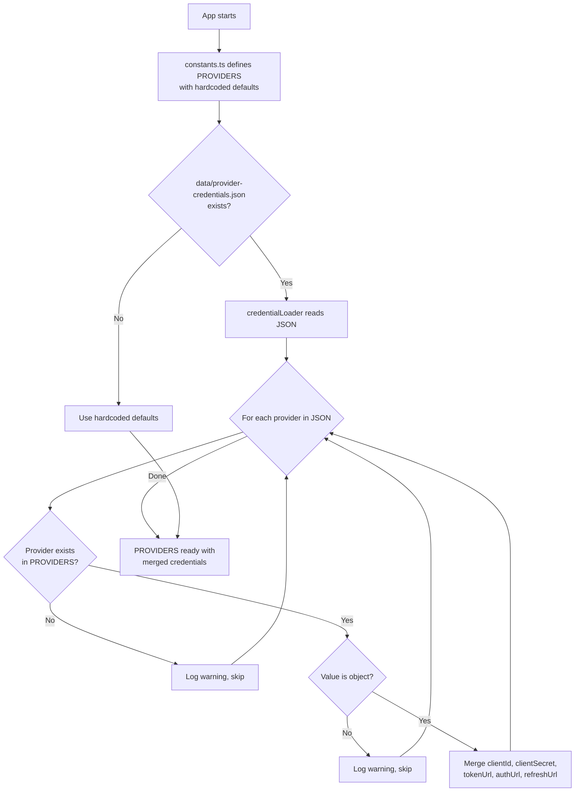

---

### 4.2 Виконавці (`open-sse/executors/`)

Виконавці інкапсулюють **специфічну логіку постачальника** за допомогою **шаблону стратегії**. Кожен виконавець замінює базові методи за потреби.

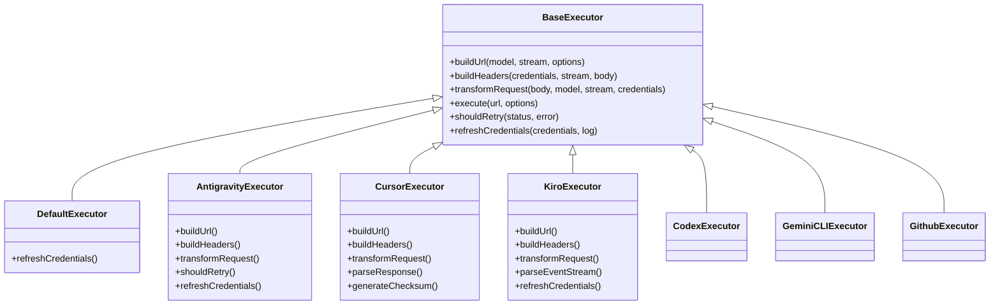

| Виконавець       | Постачальник                               | Ключові спеціалізації                                                                                                                                                            |
| ---------------- | ------------------------------------------ | -------------------------------------------------------------------------------------------------------------------------------------------------------------------------------- |
| `base.ts`        | —                                          | Абстрактна база: створення URL-адреси, заголовки, логіка повтору, оновлення облікових даних                                                                                      |
| `default.ts`     | Claude, Gemini, OpenAI, GLM, Kimi, MiniMax | Оновлення універсального маркера OAuth для стандартних постачальників                                                                                                            |
| `antigravity.ts` | Google Cloud Code                          | Генерація ідентифікатора проекту/сеансу, резервна копія кількох URL-адрес, користувацький аналіз повторної спроби з повідомлень про помилку ("скинути через 2 год. 7 хв. 23 с.") |
| `cursor.ts`      | Курсор IDE                                 | **Найскладніше**: автентифікація контрольної суми SHA-256, кодування запиту Protobuf, двійковий EventStream → аналіз відповіді SSE                                               |
| `codex.ts`       | OpenAI Codex                               | Впроваджує системні інструкції, керує рівнями мислення, видаляє непідтримувані параметри                                                                                         |
| `gemini-cli.ts`  | Google Gemini CLI                          | Створення спеціальної URL-адреси (`streamGenerateContent`), оновлення маркера Google OAuth                                                                                       |
| `github.ts`      | Копілот GitHub                             | Подвійна система маркерів (GitHub OAuth + маркер Copilot), імітація заголовка VSCode                                                                                             |
| `kiro.ts`        | AWS CodeWhisperer                          | Двійковий аналіз AWS EventStream, кадри подій AMZN, оцінка маркерів                                                                                                              |
| `index.ts`       | —                                          | Фабрика: відображає ім’я постачальника → клас виконавця, із резервним варіантом за замовчуванням                                                                                 |

---

### 4.3 Обробники (`open-sse/handlers/`)

**Рівень оркестровки** — координує переклад, виконання, потокове передавання та обробку помилок.

| Файл                  | Призначення                                                                                                                                                                                                                  |
| --------------------- | ---------------------------------------------------------------------------------------------------------------------------------------------------------------------------------------------------------------------------- |
| `chatCore.ts`         | **Центральний оркестр** (~600 рядків). Обробляє повний життєвий цикл запиту: виявлення формату → переклад → відправка виконавця → потокова/непотокова відповідь → оновлення маркера → обробка помилок → журнал використання. |
| `responsesHandler.ts` | Адаптер для API відповідей OpenAI: перетворює формат відповідей → Завершення чату → надсилає до `chatCore` → перетворює SSE назад у формат відповідей.                                                                       |
| `embeddings.ts`       | Обробник генерації вбудовування: розпізнає модель вбудовування → постачальник, надсилає до API постачальника, повертає відповідь на вбудовування, сумісну з OpenAI. Підтримує 6+ провайдерів.                                |
| `imageGeneration.ts`  | Обробник генерації зображень: розпізнає модель зображення → постачальник, підтримує режими, сумісні з OpenAI, Gemini-image (Antigravity) і резервний (Nebius). Повертає base64 або URL-зображення.                           |

#### Життєвий цикл запиту (chatCore.ts)

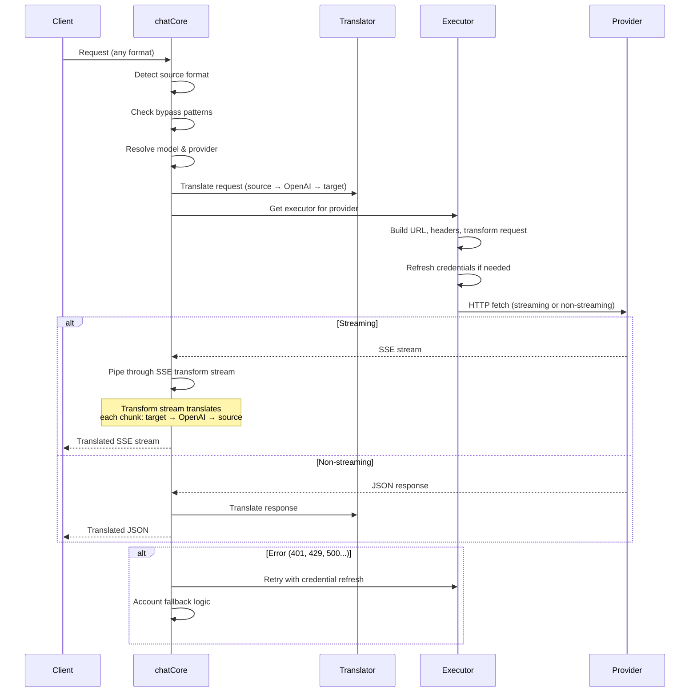

---

### 4.4 Послуги (`open-sse/services/`)

Бізнес-логіка, яка підтримує обробники та виконавці.

| Файл                 | Призначення                                                                                                                                                                                                                                                                                                                                                        |
| -------------------- | ------------------------------------------------------------------------------------------------------------------------------------------------------------------------------------------------------------------------------------------------------------------------------------------------------------------------------------------------------------------ |
| `provider.ts`        | **Виявлення формату** (`detectFormat`): аналізує структуру тіла запиту, щоб визначити формати Claude/OpenAI/Gemini/Antigravity/Responses (включає `max_tokens` евристику для Claude). Також: створення URL-адрес, створення заголовків, нормалізація конфігурації мислення. Підтримує динамічних постачальників `openai-compatible-*` та `anthropic-compatible-*`. |
| `model.ts`           | Синтаксичний аналіз рядка моделі (`claude/model-name` → `{provider: "claude", model: "model-name"}`), вирішення псевдонімів із виявленням зіткнень, очищення вхідних даних (відхиляє обхід шляхів/контрольні символи) та вирішення інформації про модель із підтримкою асинхронного засобу отримання псевдонімів.                                                  |
| `accountFallback.ts` | Обробка ліміту швидкості: експоненціальна віддача (1 с → 2 с → 4 с → макс. 2 хв), керування відновленням облікового запису, класифікація помилок (які помилки викликають відкат, а які ні).                                                                                                                                                                        |
| `tokenRefresh.ts`    | Оновлення маркерів OAuth для **кожного постачальника**: Google (Gemini, Antigravity), Claude, Codex, Qwen, iFlow, GitHub (OAuth + Copilot dual-token), Kiro (AWS SSO OIDC + Social Auth). Включає в себе кеш дедуплікації обіцянок у польоті та повторну спробу з експоненціальним відстрочкою.                                                                    |
| `combo.ts`           | **Комбіновані моделі**: ланцюжки резервних моделей. Якщо модель A виходить з ладу через помилку, придатну для повернення, спробуйте модель B, потім C тощо. Повертає фактичні коди стану висхідного каналу.                                                                                                                                                        |
| `usage.ts`           | Отримує дані про квоту/використання з API постачальника (квоти GitHub Copilot, квоти моделі Antigravity, обмеження швидкості Codex, аналіз використання Kiro, налаштування Claude).                                                                                                                                                                                |
| `accountSelector.ts` | Інтелектуальний вибір облікового запису з алгоритмом підрахунку балів: враховує пріоритет, стан здоров’я, позицію циклічного циклу та стан відновлення, щоб вибрати оптимальний обліковий запис для кожного запиту.                                                                                                                                                |
| `contextManager.ts`  | Керування життєвим циклом контексту запиту: створює та відстежує об’єкти контексту кожного запиту з метаданими (ідентифікатор запиту, часові позначки, інформація про постачальника) для налагодження та журналювання.                                                                                                                                             |
| `ipFilter.ts`        | Контроль доступу на основі IP: підтримує режими білого та чорного списків. Перевіряє IP клієнта на відповідність налаштованим правилам перед обробкою запитів API.                                                                                                                                                                                                 |
| `sessionManager.ts`  | Відстеження сеансу за допомогою відбитків пальців клієнта: відстежує активні сеанси за допомогою хешованих ідентифікаторів клієнта, відстежує кількість запитів і надає показники сеансу.                                                                                                                                                                          |
| `signatureCache.ts`  | Кеш дедуплікації на основі підписів запитів: запобігає повторюваним запитам, кешуючи останні підписи запитів і повертаючи кешовані відповіді для ідентичних запитів протягом певного періоду часу.                                                                                                                                                                 |
| `systemPrompt.ts`    | Впровадження глобальної системної підказки: додає або додає настроювану системну підказку до всіх запитів із обробкою сумісності для кожного постачальника.                                                                                                                                                                                                        |
| `thinkingBudget.ts`  | Управління бюджетом резонансних токенів: підтримує прохідний, автоматичний (конфігурація розгалуженого мислення), спеціальний (фіксований бюджет) і адаптивний (з урахуванням складності) режими для керування жетонами мислення/міркування.                                                                                                                       |
| `wildcardRouter.ts`  | Маршрутизація шаблонів шаблонів підстановки: розв’язує шаблони підстановки (наприклад, `*/claude-*`) до конкретних пар постачальник/модель на основі доступності та пріоритету.                                                                                                                                                                                    |

#### Дедуплікація оновлення маркера

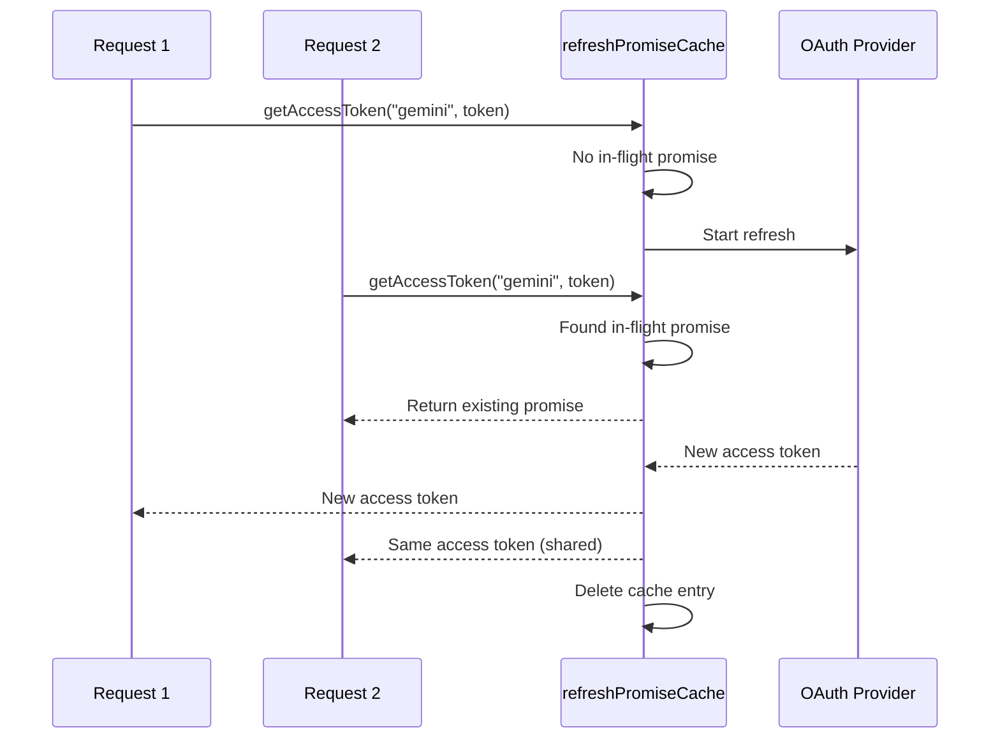

#### Запасний автомат стану облікового запису

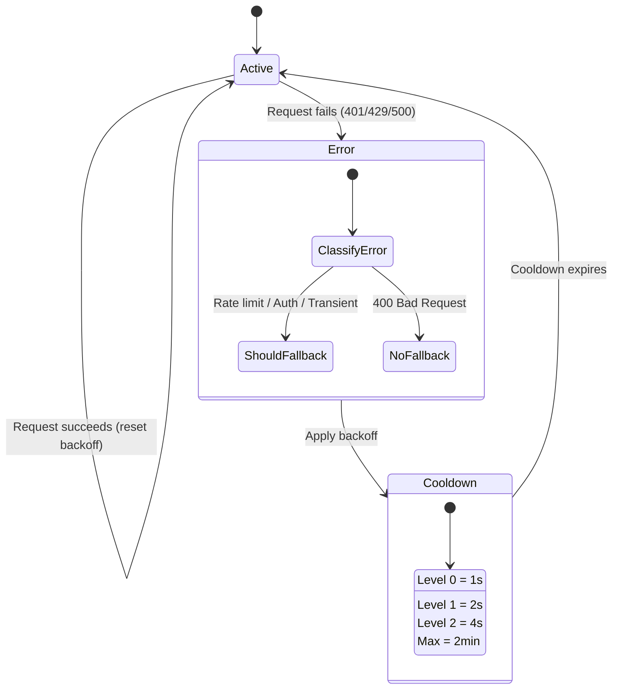

#### Комбінована модель ланцюжка

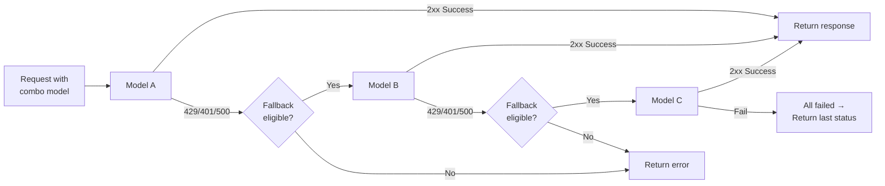

---

### 4.5 Перекладач (`open-sse/translator/`)

**Система перекладу форматів**, яка використовує систему плагінів із самореєстрацією.

#### Архітектура

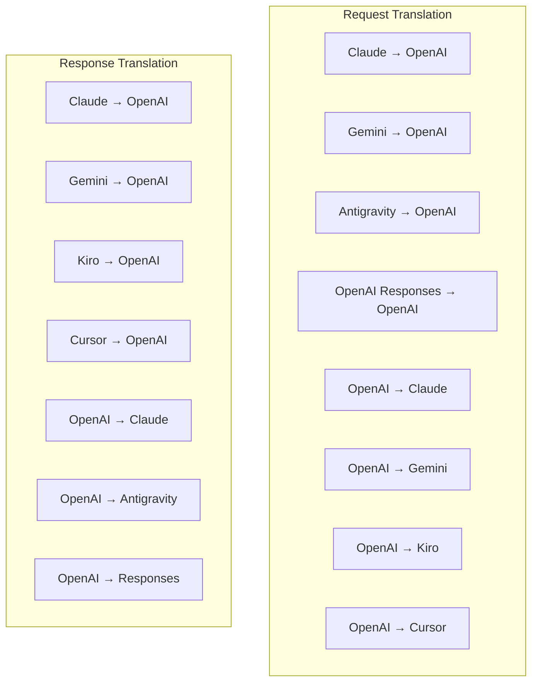

| Довідник     | Файли          | Опис                                                                                                                                                                                                                                                                                                |
| ------------ | -------------- | --------------------------------------------------------------------------------------------------------------------------------------------------------------------------------------------------------------------------------------------------------------------------------------------------- |
| `request/`   | 8 перекладачів | Перетворюйте тіла запиту між форматами. Кожен файл самостійно реєструється через `register(from, to, fn)` під час імпорту.                                                                                                                                                                          |
| `response/`  | 7 перекладачів | Перетворюйте фрагменти потокової відповіді між форматами. Обробляє типи подій SSE, блоки мислення, виклики інструментів.                                                                                                                                                                            |
| `helpers/`   | 6 помічників   | Спільні утиліти: `claudeHelper` (вилучення системних підказок, конфігурація мислення), `geminiHelper` (відображення частин/вмісту), `openaiHelper` (фільтрування формату), `toolCallHelper` (генерація ідентифікатора, впровадження відсутніх відповідей), `maxTokensHelper`, `responsesApiHelper`. |
| `index.ts`   | —              | Система перекладу: `translateRequest()`, `translateResponse()`, державне управління, реєстр.                                                                                                                                                                                                        |
| `formats.ts` | —              | Константи формату: `OPENAI`, `CLAUDE`, `GEMINI`, `ANTIGRAVITY`, `KIRO`, `CURSOR`, `OPENAI_RESPONSES`.                                                                                                                                                                                               |

#### Дизайн ключа: плагіни, що самостійно реєструються

```javascript
// Each translator file calls register() on import:
import { register } from "../index.js";
register("claude", "openai", translateClaudeToOpenAI);

// The index.js imports all translator files, triggering registration:
import "./request/claude-to-openai.js"; // ← self-registers
```

---

### 4.6 Утиліти (`open-sse/utils/`)

| Файл               | Призначення                                                                                                                                                                                                                                                                                                              |
| ------------------ | ------------------------------------------------------------------------------------------------------------------------------------------------------------------------------------------------------------------------------------------------------------------------------------------------------------------------ |
| `error.ts`         | Формування відповіді на помилку (формат, сумісний з OpenAI), синтаксичний аналіз помилок вгорі, вилучення часу повторної спроби Antigravity з повідомлень про помилки, потокова передача помилок SSE.                                                                                                                    |
| `stream.ts`        | **SSE Transform Stream** — основний потоковий конвеєр. Два режими: `TRANSLATE` (повноформатний переклад) і `PASSTHROUGH` (нормалізувати + витягнути використання). Керується буферизацією фрагментів, оцінкою використання, відстеженням довжини вмісту. Екземпляри потокового кодера/декодера уникають спільного стану. |
| `streamHelpers.ts` | Утиліти SSE низького рівня: `parseSSELine` (толерантний до пробілів), `hasValuableContent` (фільтрує порожні фрагменти для OpenAI/Claude/Gemini), `fixInvalidId`, `formatSSE` (серіалізація SSE з урахуванням формату за допомогою `perf_metrics` очищення).                                                             |
| `usageTracking.ts` | Видалення використання маркерів із будь-якого формату (Claude/OpenAI/Gemini/Responses), оцінка з окремими співвідношеннями символів на маркер для інструментів/повідомлень, додавання буфера (2000 запасів маркерів), фільтрація полів для певного формату, консольне журналювання з кольорами ANSI.                     |
| `requestLogger.ts` | Реєстрація запитів на основі файлів (увімкніться через `ENABLE_REQUEST_LOGS=true`). Створює папки сеансу з пронумерованими файлами: `1_req_client.json` → `7_res_client.txt`. Весь ввід-вивід є асинхронним (запустив і забув). Маскує чутливі заголовки.                                                                |
| `bypassHandler.ts` | Перехоплює певні шаблони від Claude CLI (вилучення заголовків, розминка, підрахунок) і повертає фальшиві відповіді без виклику жодного постачальника. Підтримує як потокове, так і не потокове. Навмисно обмежено областю CLI Claude.                                                                                    |
| `networkProxy.ts`  | Вирішує URL-адресу вихідного проксі-сервера для даного постачальника з пріоритетом: конфігурація для конкретного постачальника → глобальна конфігурація → змінні середовища (`HTTPS_PROXY`/`HTTP_PROXY`/`ALL_PROXY`). Підтримує виключення `NO_PROXY`. Кеш конфігурації на 30 с.                                         |

#### SSE Streaming Pipeline

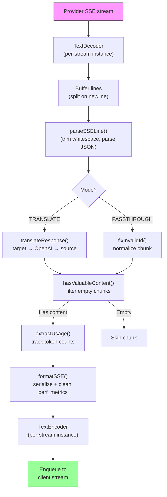

#### Структура сеансу реєстратора запитів

```
logs/
└── claude_gemini_claude-sonnet_20260208_143045/
    ├── 1_req_client.json      ← Raw client request
    ├── 2_req_source.json      ← After initial conversion
    ├── 3_req_openai.json      ← OpenAI intermediate format
    ├── 4_req_target.json      ← Final target format
    ├── 5_res_provider.txt     ← Provider SSE chunks (streaming)
    ├── 5_res_provider.json    ← Provider response (non-streaming)
    ├── 6_res_openai.txt       ← OpenAI intermediate chunks
    ├── 7_res_client.txt       ← Client-facing SSE chunks
    └── 6_error.json           ← Error details (if any)
```

---

### 4.7 Рівень програми (`src/`)

| Довідник      | Призначення                                                                                                          |
| ------------- | -------------------------------------------------------------------------------------------------------------------- |
| `src/app/`    | Веб-інтерфейс користувача, маршрути API, проміжне програмне забезпечення Express, обробники зворотного виклику OAuth |
| `src/lib/`    | Доступ до бази даних (`localDb.ts`, `usageDb.ts`), автентифікація, спільний                                          |
| `src/mitm/`   | Проксі-утиліти Man-in-the-middle для перехоплення трафіку провайдера                                                 |
| `src/models/` | Визначення моделі бази даних                                                                                         |
| `src/shared/` | Обгортки навколо функцій open-sse (провайдер, потік, помилка тощо)                                                   |
| `src/sse/`    | Обробники кінцевих точок SSE, які підключають бібліотеку open-sse до експрес-маршрутів                               |
| `src/store/`  | Застосування управління станом                                                                                       |

#### Відомі маршрути API

| Маршрут                                       | Методи          | Призначення                                                                                                |
| --------------------------------------------- | --------------- | ---------------------------------------------------------------------------------------------------------- |
| `/api/provider-models`                        | GET/POST/DELETE | CRUD для спеціальних моделей на постачальника                                                              |
| `/api/models/catalog`                         | ОТРИМАТИ        | Зведений каталог усіх моделей (чат, вбудовування, зображення, настроювання), згрупований за постачальником |
| `/api/settings/proxy`                         | GET/PUT/DELETE  | Конфігурація ієрархічного вихідного проксі (`global/providers/combos/keys`)                                |
| `/api/settings/proxy/test`                    | Опублікувати    | Перевіряє підключення проксі та повертає загальнодоступну IP-адресу/затримку                               |
| `/v1/providers/[provider]/chat/completions`   | Опублікувати    | Спеціальне завершення чату для кожного постачальника з перевіркою моделі                                   |
| `/v1/providers/[provider]/embeddings`         | Опублікувати    | Спеціальне вбудовування для кожного постачальника з перевіркою моделі                                      |
| `/v1/providers/[provider]/images/generations` | Опублікувати    | Спеціальне створення зображень для кожного постачальника з перевіркою моделі                               |
| `/api/settings/ip-filter`                     | GET/PUT         | Керування списком дозволених/чорних IP-адрес                                                               |
| `/api/settings/thinking-budget`               | GET/PUT         | Конфігурація бюджету токена міркування (прохідний/автоматичний/спеціальний/адаптивний)                     |
| `/api/settings/system-prompt`                 | GET/PUT         | Глобальна системна підказка для всіх запитів                                                               |
| `/api/sessions`                               | ОТРИМАТИ        | Відстеження активної сесії та метрики                                                                      |
| `/api/rate-limits`                            | ОТРИМАТИ        | Статус обмеження ставки на обліковий запис                                                                 |

---

## 5. Ключові шаблони проектування

### 5.1 Переклад Hub-and-Spoke

Усі формати перекладаються через **формат OpenAI як центр**. Додавання нового постачальника вимагає лише написання **однієї пари** перекладачів (до/з OpenAI), а не N пар.

### 5.2 Шаблон стратегії виконавця

Кожен провайдер має спеціальний клас виконавця, успадкований від `BaseExecutor`. Фабрика в `executors/index.ts` вибирає правильний під час виконання.

### 5.3 Система плагінів із самореєстрацією

Модулі перекладача реєструються під час імпорту через `register()`. Додавання нового перекладача означає лише створення файлу та його імпорт.

### 5.4 Резервний обліковий запис із експоненціальним відстрочкою

Коли постачальник повертає 429/401/500, система може перейти до наступного облікового запису, застосовуючи експоненціальне відновлення (1 с → 2 с → 4 с → макс. 2 хв).

### Ланцюги комбінованих моделей 5.5

"Combo" групує кілька рядків `provider/model`. Якщо перший не вдається, автоматично поверніться до наступного.

### 5.6 Потоковий переклад із збереженням стану

Трансляція відповіді підтримує стан у блоках SSE (відстеження блоків мислення, накопичення викликів інструментів, індексація блоків вмісту) через механізм `initState()`.

### 5.7 Буфер безпеки використання

Буфер на 2000 маркерів додається до звітів про використання, щоб запобігти перевищенню клієнтами обмежень вікон контексту через накладні витрати на системні підказки та переклад формату.

---

## 6. Підтримувані формати

| Формат                 | Напрям         | Ідентифікатор      |
| ---------------------- | -------------- | ------------------ |
| Завершення чату OpenAI | джерело + ціль | `openai`           |
| OpenAI Responses API   | джерело + ціль | `openai-responses` |
| Антропний Клод         | джерело + ціль | `claude`           |
| Google Gemini          | джерело + ціль | `gemini`           |
| Google Gemini CLI      | тільки мета    | `gemini-cli`       |
| Антигравітація         | джерело + ціль | `antigravity`      |
| AWS Kiro               | тільки мета    | `kiro`             |
| Курсор                 | тільки мета    | `cursor`           |

---

## 7. Підтримувані постачальники

| Постачальник             | Метод авторизації               | Виконавець       | Ключові примітки                                                          |
| ------------------------ | ------------------------------- | ---------------- | ------------------------------------------------------------------------- |
| Антропний Клод           | Ключ API або OAuth              | За замовчуванням | Використовує заголовок `x-api-key`                                        |
| Google Gemini            | Ключ API або OAuth              | За замовчуванням | Використовує заголовок `x-goog-api-key`                                   |
| Google Gemini CLI        | OAuth                           | GeminiCLI        | Використовує кінцеву точку `streamGenerateContent`                        |
| Антигравітація           | OAuth                           | Антигравітація   | Резервний варіант із кількома URL-адресами, настроюваний повторний аналіз |
| OpenAI                   | Ключ API                        | За замовчуванням | Автентифікація стандартного носія                                         |
| Кодекс                   | OAuth                           | Кодекс           | Впроваджує системні інструкції, керує мисленням                           |
| Копілот GitHub           | OAuth + маркер Copilot          | Github           | Подвійний маркер, імітація заголовка VSCode                               |
| Кіро (AWS)               | AWS SSO OIDC або Social         | Кіро             | Розбір двійкового потоку подій                                            |
| Курсор IDE               | Аутентифікація контрольної суми | Курсор           | Кодування Protobuf, контрольні суми SHA-256                               |
| Квен                     | OAuth                           | За замовчуванням | Стандартна авторизація                                                    |
| iFlow                    | OAuth (базовий + носій)         | За замовчуванням | Заголовок подвійної авторизації                                           |
| OpenRouter               | Ключ API                        | За замовчуванням | Автентифікація стандартного носія                                         |
| GLM, Kimi, MiniMax       | Ключ API                        | За замовчуванням | Claude-сумісний, використовуйте `x-api-key`                               |
| `openai-compatible-*`    | Ключ API                        | За замовчуванням | Динамічний: будь-яка кінцева точка, сумісна з OpenAI                      |
| `anthropic-compatible-*` | Ключ API                        | За замовчуванням | Динамічний: будь-яка Claude-сумісна кінцева точка                         |

---

## 8. Підсумок потоку даних

### Запит на потокове передавання

```mermaid
flowchart LR
    A["Client"] --> B["detectFormat()"]
    B --> C["translateRequest()\nsource → OpenAI → target"]
    C --> D["Executor\nbuildUrl + buildHeaders"]
    D --> E["fetch(providerURL)"]
    E --> F["createSSEStream()\nTRANSLATE mode"]
    F --> G["parseSSELine()"]
    G --> H["translateResponse()\ntarget → OpenAI → source"]
    H --> I["extractUsage()\n+ addBuffer"]
    I --> J["formatSSE()"]
    J --> K["Client receives\ntranslated SSE"]
    K --> L["logUsage()\nsaveRequestUsage()"]
```

### Непотоковий запит

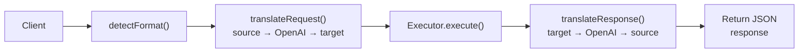

### Обхідний потік (Claude CLI)

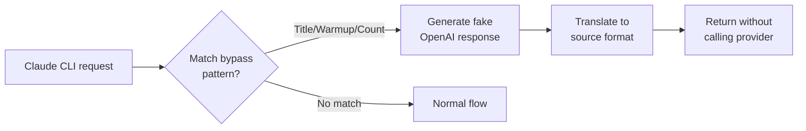
