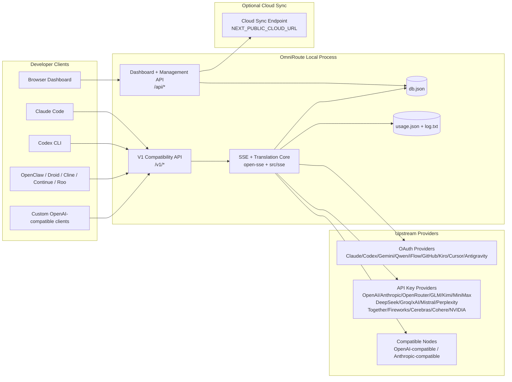
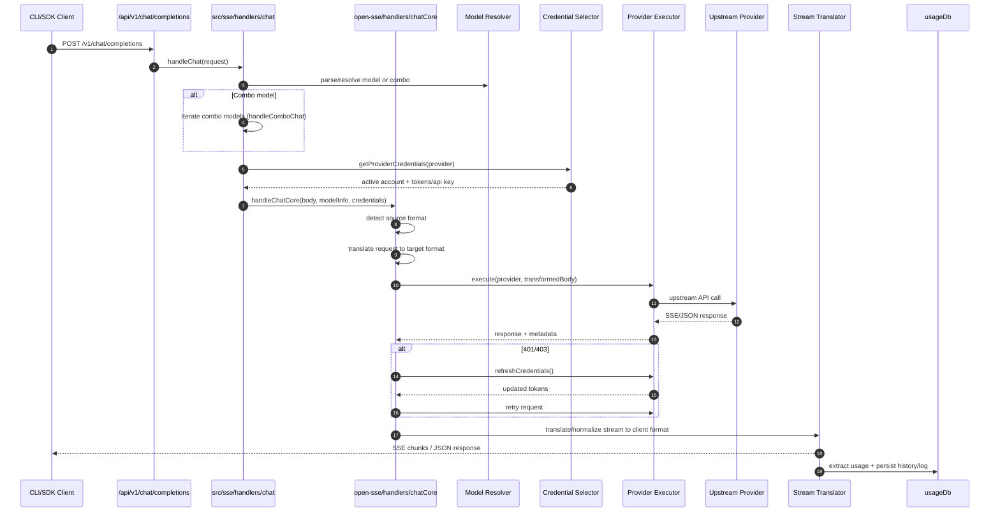
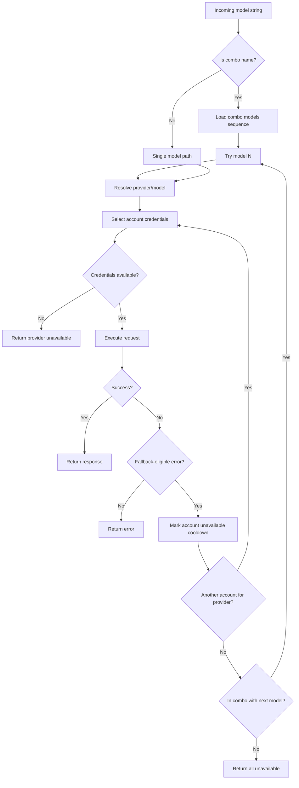
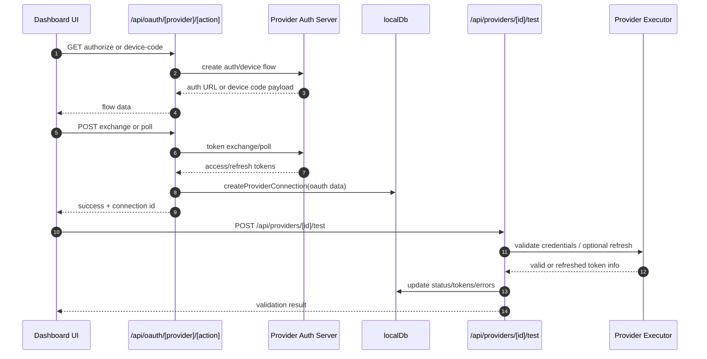
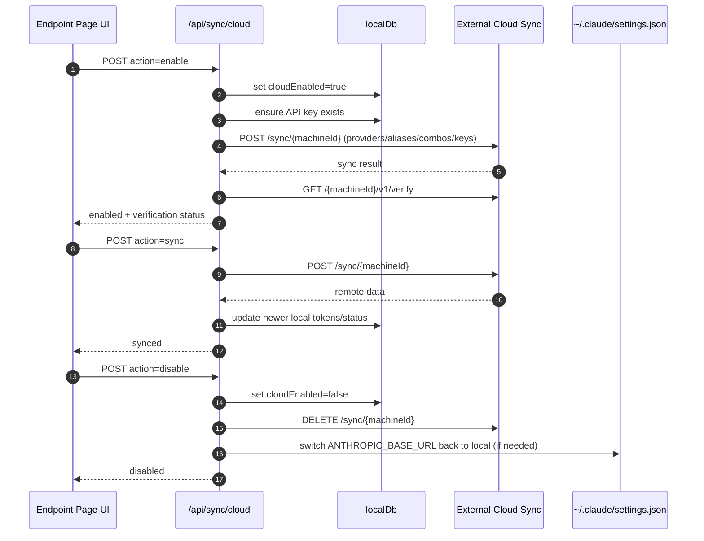
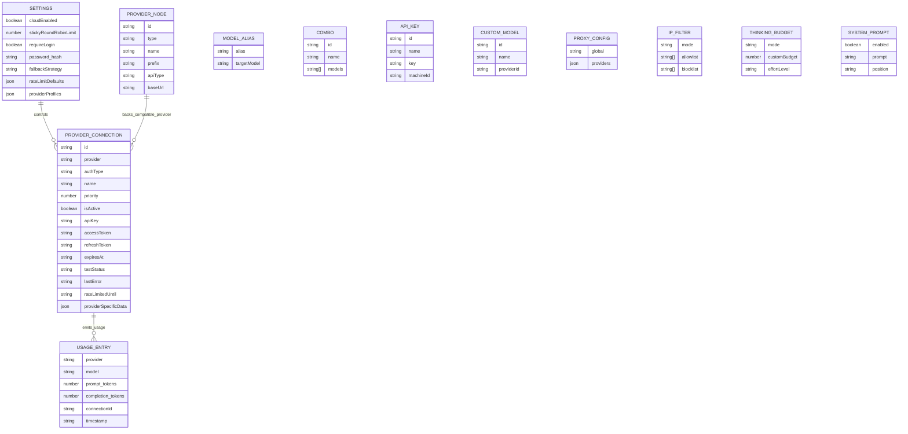
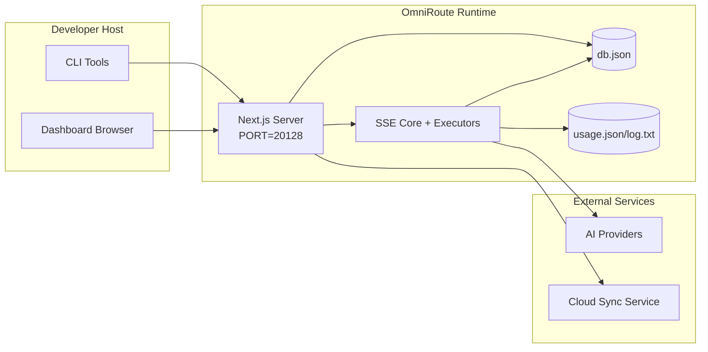

# Kiến trúc OmniRoute

🌐 **Languages:** 🇺🇸 [English](../../ARCHITECTURE.md) | 🇧🇷 [Português (Brasil)](../pt-BR/ARCHITECTURE.md) | 🇪🇸 [Español](../es/ARCHITECTURE.md) | 🇫🇷 [Français](../fr/ARCHITECTURE.md) | 🇮🇹 [Italiano](../it/ARCHITECTURE.md) | 🇷🇺 [Русский](../ru/ARCHITECTURE.md) | 🇨🇳 [中文 (简体)](../zh-CN/ARCHITECTURE.md) | 🇩🇪 [Deutsch](../de/ARCHITECTURE.md) | 🇮🇳 [हिन्दी](../in/ARCHITECTURE.md) | 🇹🇭 [ไทย](../th/ARCHITECTURE.md) | 🇺🇦 [Українська](../uk-UA/ARCHITECTURE.md) | 🇸🇦 [العربية](../ar/ARCHITECTURE.md) | 🇯🇵 [日本語](../ja/ARCHITECTURE.md) | 🇻🇳 [Tiếng Việt](../vi/ARCHITECTURE.md) | 🇧🇬 [Български](../bg/ARCHITECTURE.md) | 🇩🇰 [Dansk](../da/ARCHITECTURE.md) | 🇫🇮 [Suomi](../fi/ARCHITECTURE.md) | 🇮🇱 [עברית](../he/ARCHITECTURE.md) | 🇭🇺 [Magyar](../hu/ARCHITECTURE.md) | 🇮🇩 [Bahasa Indonesia](../id/ARCHITECTURE.md) | 🇰🇷 [한국어](../ko/ARCHITECTURE.md) | 🇲🇾 [Bahasa Melayu](../ms/ARCHITECTURE.md) | 🇳🇱 [Nederlands](../nl/ARCHITECTURE.md) | 🇳🇴 [Norsk](../no/ARCHITECTURE.md) | 🇵🇹 [Português (Portugal)](../pt/ARCHITECTURE.md) | 🇷🇴 [Română](../ro/ARCHITECTURE.md) | 🇵🇱 [Polski](../pl/ARCHITECTURE.md) | 🇸🇰 [Slovenčina](../sk/ARCHITECTURE.md) | 🇸🇪 [Svenska](../sv/ARCHITECTURE.md) | 🇵🇭 [Filipino](../phi/ARCHITECTURE.md)

_Cập nhật lần cuối: 2026-02-18_

## Tóm tắt điều hành

OmniRoute là cổng định tuyến và bảng thông tin AI cục bộ được xây dựng trên Next.js.
Nó cung cấp một điểm cuối tương thích với OpenAI (`/v1/*`) và định tuyến lưu lượng truy cập trên nhiều nhà cung cấp ngược dòng với tính năng dịch thuật, dự phòng, làm mới mã thông báo và theo dõi việc sử dụng.

Khả năng cốt lõi:

- Bề mặt API tương thích OpenAI cho CLI/công cụ (28 nhà cung cấp)
- Dịch yêu cầu/phản hồi trên các định dạng của nhà cung cấp
- Dự phòng kết hợp mô hình (chuỗi nhiều mô hình)
- Dự phòng cấp tài khoản (nhiều tài khoản cho mỗi nhà cung cấp)
- Quản lý kết nối nhà cung cấp khóa OAuth + API
- Tạo nhúng thông qua `/v1/embeddings` (6 nhà cung cấp, 9 mô hình)
- Tạo hình ảnh qua `/v1/images/generations` (4 nhà cung cấp, 9 kiểu máy)
- Suy nghĩ phân tích thẻ (`<think>...</think>`) cho các mô hình suy luận
- Dọn dẹp phản hồi để tương thích nghiêm ngặt với OpenAI SDK
- Chuẩn hóa vai trò (nhà phát triển→hệ thống, hệ thống→người dùng) để tương thích giữa các nhà cung cấp
- Chuyển đổi đầu ra có cấu trúc (json_schema → GeminiResponseSchema)
- Tính bền vững cục bộ cho nhà cung cấp, khóa, bí danh, tổ hợp, cài đặt, giá cả
- Theo dõi việc sử dụng/chi phí và ghi nhật ký yêu cầu
- Đồng bộ hóa đám mây tùy chọn để đồng bộ hóa nhiều thiết bị/trạng thái
- Danh sách cho phép/danh sách chặn IP để kiểm soát truy cập API
- Tư duy quản lý ngân sách (passthrough/auto/custom/adaptive)
- Tiêm nhắc nhở hệ thống toàn cầu
- Theo dõi phiên và lấy dấu vân tay
- Giới hạn tỷ lệ nâng cao cho mỗi tài khoản với hồ sơ dành riêng cho nhà cung cấp
- Mô hình ngắt mạch cho khả năng phục hồi của nhà cung cấp
- Bảo vệ đàn chống sét bằng khóa mutex
- Bộ đệm chống trùng lặp yêu cầu dựa trên chữ ký
- Lớp miền: tính khả dụng của mô hình, quy tắc chi phí, chính sách dự phòng, chính sách khóa
- Tính bền vững của trạng thái miền (bộ đệm ghi SQLite dành cho dự phòng, ngân sách, khóa, bộ ngắt mạch)
- Công cụ chính sách để đánh giá yêu cầu tập trung (khóa → ngân sách → dự phòng)
- Yêu cầu đo từ xa với tổng hợp độ trễ p50/p95/p99
- ID tương quan (X-Request-Id) để theo dõi từ đầu đến cuối
- Ghi nhật ký kiểm tra tuân thủ với tính năng chọn không tham gia trên mỗi khóa API
- Khung đánh giá để đảm bảo chất lượng LLM
- Bảng điều khiển UI có khả năng phục hồi với trạng thái ngắt mạch theo thời gian thực
- Nhà cung cấp OAuth mô-đun (12 mô-đun riêng lẻ trong `src/lib/oauth/providers/`)

Mô hình thời gian chạy chính:

- Các tuyến ứng dụng Next.js trong `src/app/api/*` triển khai cả API trang tổng quan và API tương thích
- Lõi định tuyến/SSE được chia sẻ trong `src/sse/*` + `open-sse/*` xử lý việc thực thi, dịch thuật, phát trực tuyến, dự phòng và sử dụng của nhà cung cấp

## Phạm vi và ranh giới

### Trong phạm vi

- Thời gian chạy cổng cục bộ
- API quản lý bảng điều khiển
- Xác thực nhà cung cấp và làm mới mã thông báo
- Yêu cầu dịch và truyền phát SSE
- Trạng thái cục bộ + kiên trì sử dụng
- Phối hợp đồng bộ hóa đám mây tùy chọn

### Ngoài phạm vi

- Triển khai dịch vụ đám mây đằng sau `NEXT_PUBLIC_CLOUD_URL`
- Nhà cung cấp SLA/mặt phẳng điều khiển bên ngoài quy trình cục bộ
- Bản thân các tệp nhị phân CLI bên ngoài (Claude CLI, Codex CLI, v.v.)

## Bối cảnh hệ thống cấp cao



## Thành phần thời gian chạy cốt lõi

## 1) API và Lớp định tuyến (Tuyến ứng dụng Next.js)

Các thư mục chính:

- `src/app/api/v1/*` và `src/app/api/v1beta/*` cho các API tương thích
- `src/app/api/*` dành cho API quản lý/cấu hình
- Viết lại tiếp theo trong `next.config.mjs` bản đồ `/v1/*` tới `/api/v1/*`

Các tuyến tương thích quan trọng:

- `src/app/api/v1/chat/completions/route.ts`
- `src/app/api/v1/messages/route.ts`
- `src/app/api/v1/responses/route.ts`
- `src/app/api/v1/models/route.ts` — bao gồm các mô hình tùy chỉnh với `custom: true`
- `src/app/api/v1/embeddings/route.ts` — thế hệ nhúng (6 nhà cung cấp)
- `src/app/api/v1/images/generations/route.ts` — tạo hình ảnh (4+ nhà cung cấp bao gồm Anti Gravity/Nebius)
- `src/app/api/v1/messages/count_tokens/route.ts`
- `src/app/api/v1/providers/[provider]/chat/completions/route.ts` — cuộc trò chuyện dành riêng cho từng nhà cung cấp
- `src/app/api/v1/providers/[provider]/embeddings/route.ts` — phần nhúng dành riêng cho mỗi nhà cung cấp
- `src/app/api/v1/providers/[provider]/images/generations/route.ts` — hình ảnh dành riêng cho mỗi nhà cung cấp
- `src/app/api/v1beta/models/route.ts`
- `src/app/api/v1beta/models/[...path]/route.ts`

Các miền quản lý:

- Xác thực/cài đặt: `src/app/api/auth/*`, `src/app/api/settings/*`
- Nhà cung cấp/kết nối: `src/app/api/providers*`
- Nút nhà cung cấp: `src/app/api/provider-nodes*`
- Mẫu tùy chỉnh: `src/app/api/provider-models` (GET/POST/DELETE)
- Danh mục mẫu: `src/app/api/models/catalog` (GET)
- Cấu hình proxy: `src/app/api/settings/proxy` (GET/PUT/DELETE) + `src/app/api/settings/proxy/test` (POST)
- OAuth: `src/app/api/oauth/*`
- Khóa/bí danh/combo/giá: `src/app/api/keys*`, `src/app/api/models/alias`, `src/app/api/combos*`, `src/app/api/pricing`
- Cách sử dụng: `src/app/api/usage/*`
- Đồng bộ hóa/đám mây: `src/app/api/sync/*`, `src/app/api/cloud/*`
- Người trợ giúp công cụ CLI: `src/app/api/cli-tools/*`
- Bộ lọc IP: `src/app/api/settings/ip-filter` (GET/PUT)
- Ngân sách suy nghĩ: `src/app/api/settings/thinking-budget` (GET/PUT)
- Lời nhắc hệ thống: `src/app/api/settings/system-prompt` (GET/PUT)
- Phiên: `src/app/api/sessions` (GET)
- Giới hạn tỷ lệ: `src/app/api/rate-limits` (GET)
- Khả năng phục hồi: `src/app/api/resilience` (GET/PATCH) — hồ sơ nhà cung cấp, bộ ngắt mạch, trạng thái giới hạn tốc độ
- Đặt lại khả năng phục hồi: `src/app/api/resilience/reset` (POST) — đặt lại bộ ngắt + thời gian hồi chiêu
- Thống kê bộ đệm: `src/app/api/cache/stats` (GET/DELETE)
- Tính sẵn có của mẫu: `src/app/api/models/availability` (GET/POST)
- Đo từ xa: `src/app/api/telemetry/summary` (GET)
- Ngân sách: `src/app/api/usage/budget` (GET/POST)
- Chuỗi dự phòng: `src/app/api/fallback/chains` (GET/POST/DELETE)
- Kiểm tra tuân thủ: `src/app/api/compliance/audit-log` (GET)
- Đánh giá: `src/app/api/evals` (GET/POST), `src/app/api/evals/[suiteId]` (GET)
- Chính sách: `src/app/api/policies` (GET/POST)

##2) SSE + Lõi dịch thuật

Các mô-đun dòng chảy chính:

- Mục nhập: `src/sse/handlers/chat.ts`
- Điều phối cốt lõi: `open-sse/handlers/chatCore.ts`
- Bộ điều hợp thực thi của nhà cung cấp: `open-sse/executors/*`
- Cấu hình nhà cung cấp/phát hiện định dạng: `open-sse/services/provider.ts`
- Phân tích/giải quyết mô hình: `src/sse/services/model.ts`, `open-sse/services/model.ts`
- Logic dự phòng tài khoản: `open-sse/services/accountFallback.ts`
- Đăng ký dịch thuật: `open-sse/translator/index.ts`
- Chuyển đổi luồng: `open-sse/utils/stream.ts`, `open-sse/utils/streamHandler.ts`
- Trích xuất/chuẩn hóa cách sử dụng: `open-sse/utils/usageTracking.ts`
- Trình phân tích cú pháp thẻ suy nghĩ: `open-sse/utils/thinkTagParser.ts`
- Trình xử lý nhúng: `open-sse/handlers/embeddings.ts`
- Đăng ký nhà cung cấp nhúng: `open-sse/config/embeddingRegistry.ts`
- Trình xử lý tạo ảnh: `open-sse/handlers/imageGeneration.ts`
- Đăng ký nhà cung cấp hình ảnh: `open-sse/config/imageRegistry.ts`
- Khử trùng phản hồi: `open-sse/handlers/responseSanitizer.ts`
- Chuẩn hóa vai trò: `open-sse/services/roleNormalizer.ts`

Dịch vụ (logic nghiệp vụ):

- Lựa chọn/chấm điểm tài khoản: `open-sse/services/accountSelector.ts`
- Quản lý vòng đời bối cảnh: `open-sse/services/contextManager.ts`
- Thực thi bộ lọc IP: `open-sse/services/ipFilter.ts`
- Theo dõi phiên: `open-sse/services/sessionManager.ts`
- Yêu cầu loại bỏ trùng lặp: `open-sse/services/signatureCache.ts`
- Nội dung nhắc nhở của hệ thống: `open-sse/services/systemPrompt.ts`
- Tư duy quản lý ngân sách: `open-sse/services/thinkingBudget.ts`
- Định tuyến mô hình ký tự đại diện: `open-sse/services/wildcardRouter.ts`
- Quản lý giới hạn tỷ lệ: `open-sse/services/rateLimitManager.ts`
- Cầu dao: `open-sse/services/circuitBreaker.ts`

Các mô-đun lớp miền:

- Tính sẵn có của mẫu: `src/lib/domain/modelAvailability.ts`
- Quy tắc chi phí/ngân sách: `src/lib/domain/costRules.ts`
- Chính sách dự phòng: `src/lib/domain/fallbackPolicy.ts`
- Trình giải quyết kết hợp: `src/lib/domain/comboResolver.ts`
- Chính sách khóa: `src/lib/domain/lockoutPolicy.ts`
- Công cụ chính sách: `src/domain/policyEngine.ts` — khóa tập trung → ngân sách → đánh giá dự phòng
- Danh mục mã lỗi: `src/lib/domain/errorCodes.ts`
- ID yêu cầu: `src/lib/domain/requestId.ts`
- Thời gian chờ tìm nạp: `src/lib/domain/fetchTimeout.ts`
- Yêu cầu đo từ xa: `src/lib/domain/requestTelemetry.ts`
- Tuân thủ/kiểm toán: `src/lib/domain/compliance/index.ts`
- Người chạy đánh giá: `src/lib/domain/evalRunner.ts`
- Tính bền vững của trạng thái miền: `src/lib/db/domainState.ts` — SQLite CRUD dành cho chuỗi dự phòng, ngân sách, lịch sử chi phí, trạng thái khóa, bộ ngắt mạch

Mô-đun nhà cung cấp OAuth (12 tệp riêng lẻ trong `src/lib/oauth/providers/`):

- Chỉ số đăng ký: `src/lib/oauth/providers/index.ts`
- Nhà cung cấp cá nhân: `claude.ts`, `codex.ts`, `gemini.ts`, `antigravity.ts`, `iflow.ts`, `qwen.ts`, `kimi-coding.ts`, `github.ts`, `kiro.ts`, `cursor.ts`, `kilocode.ts`, `cline.ts`
- Trình bao bọc mỏng: `src/lib/oauth/providers.ts` — tái xuất từ các mô-đun riêng lẻ

## 3) Lớp kiên trì

DB trạng thái chính:

- `src/lib/localDb.ts`
- tệp: `${DATA_DIR}/db.json` (hoặc `$XDG_CONFIG_HOME/omniroute/db.json` khi được đặt, nếu không thì `~/.omniroute/db.json`)
- thực thể: nhà cung cấpKết nối, nhà cung cấpNodes, modelAliases, combo, apiKeys, cài đặt, giá cả, **customModels**, **proxyConfig**, **ipFilter**, **thinkingBudget**, **systemPrompt**

Cách sử dụng cơ sở dữ liệu:

- `src/lib/usageDb.ts`
- tập tin: `${DATA_DIR}/usage.json`, `${DATA_DIR}/log.txt`, `${DATA_DIR}/call_logs/`
- tuân theo chính sách thư mục cơ sở giống như `localDb` (`DATA_DIR`, sau đó `XDG_CONFIG_HOME/omniroute` khi được đặt)
- được phân tách thành các mô-đun phụ tập trung: `migrations.ts`, `usageHistory.ts`, `costCalculator.ts`, `usageStats.ts`, `callLogs.ts`

Cơ sở dữ liệu trạng thái miền (SQLite):

- `src/lib/db/domainState.ts` — Thao tác CRUD cho trạng thái miền
- Các bảng (được tạo trong `src/lib/db/core.ts`): `domain_fallback_chains`, `domain_budgets`, `domain_cost_history`, `domain_lockout_state`, `domain_circuit_breakers`
- Mẫu bộ đệm ghi qua: Bản đồ trong bộ nhớ có thẩm quyền trong thời gian chạy; các đột biến được ghi đồng bộ vào SQLite; trạng thái được khôi phục từ DB khi khởi động nguội

##4) Xác thực + Bề mặt bảo mật

- Xác thực cookie trang tổng quan: `src/proxy.ts`, `src/app/api/auth/login/route.ts`
- Tạo/xác minh khóa API: `src/shared/utils/apiKey.ts`
- Bí mật của nhà cung cấp vẫn tồn tại trong mục `providerConnections`
- Hỗ trợ proxy gửi đi thông qua `open-sse/utils/proxyFetch.ts` (env vars) và `open-sse/utils/networkProxy.ts` (có thể định cấu hình cho mỗi nhà cung cấp hoặc toàn cầu)

## 5) Đồng bộ đám mây

- Khởi tạo bộ lập lịch: `src/lib/initCloudSync.ts`, `src/shared/services/initializeCloudSync.ts`
- Nhiệm vụ định kỳ: `src/shared/services/cloudSyncScheduler.ts`
- Lộ trình điều khiển: `src/app/api/sync/cloud/route.ts`

## Vòng đời yêu cầu (`/v1/chat/completions`)



## Combo + Luồng dự phòng tài khoản



Các quyết định dự phòng được điều khiển bởi `open-sse/services/accountFallback.ts` bằng cách sử dụng mã trạng thái và phương pháp phỏng đoán thông báo lỗi.

## Vòng đời giới thiệu OAuth và làm mới mã thông báo



Làm mới trong khi lưu lượng truy cập trực tiếp được thực thi bên trong `open-sse/handlers/chatCore.ts` thông qua người thực thi `refreshCredentials()`.

## Vòng đời đồng bộ hóa đám mây (Bật / Đồng bộ hóa / Tắt)



Đồng bộ hóa định kỳ được kích hoạt bởi `CloudSyncScheduler` khi bật đám mây.

## Mô hình dữ liệu và bản đồ lưu trữ



Tệp lưu trữ vật lý:

- trạng thái chính: `${DATA_DIR}/db.json` (hoặc `$XDG_CONFIG_HOME/omniroute/db.json` khi được đặt, nếu không thì `~/.omniroute/db.json`)
- số liệu thống kê sử dụng: `${DATA_DIR}/usage.json`
- dòng nhật ký yêu cầu: `${DATA_DIR}/log.txt`
- phiên gỡ lỗi yêu cầu/trình dịch tùy chọn: `<repo>/logs/...`

## Cấu trúc liên kết triển khai



## Ánh xạ mô-đun (Quyết định quan trọng)

### Mô-đun tuyến đường và API

- `src/app/api/v1/*`, `src/app/api/v1beta/*`: API tương thích
- `src/app/api/v1/providers/[provider]/*`: các tuyến dành riêng cho mỗi nhà cung cấp (trò chuyện, nội dung nhúng, hình ảnh)
- `src/app/api/providers*`: CRUD của nhà cung cấp, xác thực, kiểm tra
- `src/app/api/provider-nodes*`: quản lý nút tương thích tùy chỉnh
- `src/app/api/provider-models`: quản lý mô hình tùy chỉnh (CRUD)
- `src/app/api/models/catalog`: API danh mục mô hình đầy đủ (tất cả các loại được nhóm theo nhà cung cấp)
- `src/app/api/oauth/*`: Luồng OAuth/mã thiết bị
- `src/app/api/keys*`: vòng đời khóa API cục bộ
- `src/app/api/models/alias`: quản lý bí danh
- `src/app/api/combos*`: quản lý kết hợp dự phòng
- `src/app/api/pricing`: ghi đè giá để tính chi phí
- `src/app/api/settings/proxy`: cấu hình proxy (GET/PUT/DELETE)
- `src/app/api/settings/proxy/test`: kiểm tra kết nối proxy gửi đi (POST)
- `src/app/api/usage/*`: API sử dụng và nhật ký
- `src/app/api/sync/*` + `src/app/api/cloud/*`: trợ giúp đồng bộ hóa đám mây và hướng tới đám mây
- `src/app/api/cli-tools/*`: trình soạn thảo/kiểm tra cấu hình CLI cục bộ
- `src/app/api/settings/ip-filter`: Danh sách cho phép/danh sách chặn IP (GET/PUT)
- `src/app/api/settings/thinking-budget`: cấu hình ngân sách mã thông báo suy nghĩ (GET/PUT)
- `src/app/api/settings/system-prompt`: lời nhắc hệ thống toàn cầu (GET/PUT)
- `src/app/api/sessions`: danh sách phiên hoạt động (GET)
- `src/app/api/rate-limits`: trạng thái giới hạn tỷ lệ cho mỗi tài khoản (GET)

### Lõi định tuyến và thực thi

- `src/sse/handlers/chat.ts`: phân tích cú pháp yêu cầu, xử lý kết hợp, vòng lặp chọn tài khoản
- `open-sse/handlers/chatCore.ts`: dịch, gửi người thực thi, xử lý thử lại/làm mới, thiết lập luồng
- `open-sse/executors/*`: hành vi định dạng và mạng dành riêng cho nhà cung cấp

### Bộ chuyển đổi định dạng và đăng ký dịch thuật

- `open-sse/translator/index.ts`: đăng ký dịch giả và điều phối
- Yêu cầu người dịch: `open-sse/translator/request/*`
- Người dịch phản hồi: `open-sse/translator/response/*`
- Hằng định dạng: `open-sse/translator/formats.ts`

### Kiên trì

- `src/lib/localDb.ts`: trạng thái/cấu hình liên tục
- `src/lib/usageDb.ts`: lịch sử sử dụng và nhật ký yêu cầu luân phiên

## Bảo hiểm người thực thi nhà cung cấp (Mẫu chiến lược)

Mỗi nhà cung cấp có một trình thực thi chuyên biệt mở rộng `BaseExecutor` (trong `open-sse/executors/base.ts`), cung cấp việc xây dựng URL, xây dựng tiêu đề, thử lại với thời gian chờ theo cấp số nhân, móc làm mới thông tin xác thực và phương thức điều phối `execute()`.

| Người thi hành        | (Các) nhà cung cấp                                                                                                                                           | Xử lý đặc biệt                                                      |
| --------------------- | ------------------------------------------------------------------------------------------------------------------------------------------------------------ | ------------------------------------------------------------------- |
| `DefaultExecutor`     | OpenAI, Claude, Gemini, Qwen, iFlow, OpenRouter, GLM, Kimi, MiniMax, DeepSeek, Groq, xAI, Mistral, Perplexity, Together, Fireworks, Cerebras, Cohere, NVIDIA | Cấu hình URL/tiêu đề động cho mỗi nhà cung cấp                      |
| `AntigravityExecutor` | Google phản lực hấp dẫn                                                                                                                                      | ID dự án/phiên tùy chỉnh, Thử lại sau khi phân tích cú pháp         |
| `CodexExecutor`       | OpenAI Codex                                                                                                                                                 | Đưa vào các hướng dẫn hệ thống, buộc nỗ lực suy luận                |
| `CursorExecutor`      | IDE con trỏ                                                                                                                                                  | Giao thức ConnectRPC, mã hóa Protobuf, ký yêu cầu qua tổng kiểm tra |
| `GithubExecutor`      | Phi công phụ GitHub                                                                                                                                          | Làm mới mã thông báo Copilot, tiêu đề bắt chước VSCode              |
| `KiroExecutor`        | AWS CodeWhisperer/Kiro                                                                                                                                       | Định dạng nhị phân AWS EventStream → Chuyển đổi SSE                 |
| `GeminiCLIExecutor`   | Song Tử CLI                                                                                                                                                  | Chu kỳ làm mới mã thông báo Google OAuth                            |

Tất cả các nhà cung cấp khác (bao gồm các nút tương thích tùy chỉnh) đều sử dụng `DefaultExecutor`.

## Ma trận tương thích của nhà cung cấp

| Nhà cung cấp        | Định dạng       | Xác thực                      | Truyền phát      | Không phát trực tuyến | Làm mới mã thông báo | API sử dụng                   |
| ------------------- | --------------- | ----------------------------- | ---------------- | --------------------- | -------------------- | ----------------------------- |
| Claude              | Claude          | Khóa API / OAuth              | ✅               | ✅                    | ✅                   | ⚠️ Chỉ dành cho quản trị viên |
| Song Tử             | song tử         | Khóa API / OAuth              | ✅               | ✅                    | ✅                   | ⚠️ Bảng điều khiển đám mây    |
| Song Tử CLI         | gemini-cli      | OAuth                         | ✅               | ✅                    | ✅                   | ⚠️ Bảng điều khiển đám mây    |
| Phản lực hấp dẫn    | phản trọng lực  | OAuth                         | ✅               | ✅                    | ✅                   | ✅ API hạn ngạch đầy đủ       |
| OpenAI              | mở              | Khóa API                      | ✅               | ✅                    | ❌                   | ❌                            |
| Codex               | phản hồi openai | OAuth                         | ✅ ép buộc       | ❌                    | ✅                   | ✅ Giới hạn tỷ lệ             |
| Phi công phụ GitHub | mở              | OAuth + Mã thông báo đồng lái | ✅               | ✅                    | ✅                   | ✅ Ảnh chụp nhanh hạn ngạch   |
| Con trỏ             | con trỏ         | Tổng kiểm tra tùy chỉnh       | ✅               | ✅                    | ❌                   | ❌                            |
| Kiro                | kiro            | AWS SSO OIDC                  | ✅ (EventStream) | ❌                    | ✅                   | ✅ Giới hạn sử dụng           |
| Qwen                | mở              | OAuth                         | ✅               | ✅                    | ✅                   | ⚠️ Theo yêu cầu               |
| iFlow               | mở              | OAuth (Cơ bản)                | ✅               | ✅                    | ✅                   | ⚠️ Theo yêu cầu               |
| OpenRouter          | mở              | Khóa API                      | ✅               | ✅                    | ❌                   | ❌                            |
| GLM/Kimi/MiniMax    | Claude          | Khóa API                      | ✅               | ✅                    | ❌                   | ❌                            |
| DeepSeek            | mở              | Khóa API                      | ✅               | ✅                    | ❌                   | ❌                            |
| Groq                | mở              | Khóa API                      | ✅               | ✅                    | ❌                   | ❌                            |
| xAI (Grok)          | mở              | Khóa API                      | ✅               | ✅                    | ❌                   | ❌                            |
| Mistral             | mở              | Khóa API                      | ✅               | ✅                    | ❌                   | ❌                            |
| Lúng túng           | mở              | Khóa API                      | ✅               | ✅                    | ❌                   | ❌                            |
| Cùng AI             | mở              | Khóa API                      | ✅               | ✅                    | ❌                   | ❌                            |
| Pháo hoa AI         | mở              | Khóa API                      | ✅               | ✅                    | ❌                   | ❌                            |
| Não                 | mở              | Khóa API                      | ✅               | ✅                    | ❌                   | ❌                            |
| Kết hợp             | mở              | Khóa API                      | ✅               | ✅                    | ❌                   | ❌                            |
| NVIDIA NIM          | mở              | Khóa API                      | ✅               | ✅                    | ❌                   | ❌                            |

## Phạm vi dịch định dạng

Các định dạng nguồn được phát hiện bao gồm:

- `openai`
- `openai-responses`
- `claude`
- `gemini`

Các định dạng mục tiêu bao gồm:

- Trò chuyện/Phản hồi OpenAI
- Claude
- Phong bì Song Tử/Song Tử-CLI/Phản trọng lực
- Kiro
- Con trỏ

Các bản dịch sử dụng **OpenAI làm định dạng trung tâm** — tất cả các chuyển đổi đều thông qua OpenAI dưới dạng trung gian:

```
Source Format → OpenAI (hub) → Target Format
```

Các bản dịch được chọn linh hoạt dựa trên hình dạng tải trọng nguồn và định dạng mục tiêu của nhà cung cấp.

Các lớp xử lý bổ sung trong quy trình dịch thuật:

- **Sạch hóa phản hồi** — Loại bỏ các trường không chuẩn khỏi phản hồi ở định dạng OpenAI (cả phát trực tuyến và không phát trực tuyến) để đảm bảo tuân thủ nghiêm ngặt SDK
- **Chuẩn hóa vai trò** — Chuyển đổi `developer` → `system` cho các mục tiêu không phải OpenAI; hợp nhất `system` → `user` cho các mô hình từ chối vai trò hệ thống (GLM, ERNIE)
- **Suy nghĩ trích xuất thẻ** — Phân tích cú pháp `<think>...</think>` chặn nội dung vào trường `reasoning_content`
- **Đầu ra có cấu trúc** — Chuyển đổi OpenAI `response_format.json_schema` thành `responseMimeType` + `responseSchema` của Gemini

## Điểm cuối API được hỗ trợ

| Điểm cuối                                          | Định dạng                    | Người xử lý                                                   |
| -------------------------------------------------- | ---------------------------- | ------------------------------------------------------------- |
| `POST /v1/chat/completions`                        | Trò chuyện OpenAI            | `src/sse/handlers/chat.ts`                                    |
| `POST /v1/messages`                                | Tin nhắn Claude              | Trình xử lý tương tự (tự động phát hiện)                      |
| `POST /v1/responses`                               | Phản hồi OpenAI              | `open-sse/handlers/responsesHandler.ts`                       |
| `POST /v1/embeddings`                              | Nhúng OpenAI                 | `open-sse/handlers/embeddings.ts`                             |
| `GET /v1/embeddings`                               | Danh sách mô hình            | Tuyến đường API                                               |
| `POST /v1/images/generations`                      | Hình ảnh OpenAI              | `open-sse/handlers/imageGeneration.ts`                        |
| `GET /v1/images/generations`                       | Danh sách mô hình            | Tuyến đường API                                               |
| `POST /v1/providers/{provider}/chat/completions`   | Trò chuyện OpenAI            | Dành riêng cho mỗi nhà cung cấp với xác thực mô hình          |
| `POST /v1/providers/{provider}/embeddings`         | Nhúng OpenAI                 | Dành riêng cho mỗi nhà cung cấp với xác thực mô hình          |
| `POST /v1/providers/{provider}/images/generations` | Hình ảnh OpenAI              | Dành riêng cho mỗi nhà cung cấp với xác thực mô hình          |
| `POST /v1/messages/count_tokens`                   | Số lượng mã thông báo Claude | Tuyến đường API                                               |
| `GET /v1/models`                                   | Danh sách mô hình OpenAI     | Tuyến API (trò chuyện + nhúng + hình ảnh + mô hình tùy chỉnh) |
| `GET /api/models/catalog`                          | Danh mục                     | Tất cả các mô hình được nhóm theo nhà cung cấp + loại         |
| `POST /v1beta/models/*:streamGenerateContent`      | Song Tử bản địa              | Tuyến đường API                                               |
| `GET/PUT/DELETE /api/settings/proxy`               | Cấu hình proxy               | Cấu hình proxy mạng                                           |
| `POST /api/settings/proxy/test`                    | Kết nối proxy                | Điểm cuối kiểm tra tình trạng/kết nối proxy                   |
| `GET/POST/DELETE /api/provider-models`             | Mô hình tùy chỉnh            | Quản lý mô hình tùy chỉnh cho mỗi nhà cung cấp                |

## Trình xử lý bỏ qua

Trình xử lý bỏ qua (`open-sse/utils/bypassHandler.ts`) chặn các yêu cầu "loại bỏ" đã biết từ Claude CLI — ping khởi động, trích xuất tiêu đề và số lượng mã thông báo — và trả về **phản hồi giả** mà không tiêu tốn mã thông báo của nhà cung cấp ngược dòng. Điều này chỉ được kích hoạt khi `User-Agent` chứa `claude-cli`.

## Yêu cầu đường dẫn trình ghi nhật ký

Trình ghi nhật ký yêu cầu (`open-sse/utils/requestLogger.ts`) cung cấp quy trình ghi nhật ký gỡ lỗi gồm 7 giai đoạn, bị tắt theo mặc định, được bật qua `ENABLE_REQUEST_LOGS=true`:

```
1_req_client.json → 2_req_source.json → 3_req_openai.json → 4_req_target.json
→ 5_res_provider.txt → 6_res_openai.txt → 7_res_client.txt
```

Các tệp được ghi vào `<repo>/logs/<session>/` cho mỗi phiên yêu cầu.

## Các chế độ thất bại và khả năng phục hồi

## 1) Tính khả dụng của tài khoản/nhà cung cấp

- thời gian hồi chiêu của tài khoản nhà cung cấp đối với các lỗi tạm thời/tỷ lệ/xác thực
- dự phòng tài khoản trước khi yêu cầu không thành công
- dự phòng mô hình kết hợp khi đường dẫn mô hình/nhà cung cấp hiện tại đã hết

## 2) Mã thông báo hết hạn

- kiểm tra trước và làm mới bằng cách thử lại đối với các nhà cung cấp có thể làm mới
- Thử lại 401/403 sau lần thử làm mới trong đường dẫn lõi

##3) An toàn khi truyền phát

- bộ điều khiển luồng nhận biết ngắt kết nối
- luồng dịch với tính năng xóa cuối luồng và xử lý `[DONE]`
- dự phòng ước tính sử dụng khi thiếu siêu dữ liệu sử dụng của nhà cung cấp

## 4) Suy giảm đồng bộ đám mây

- lỗi đồng bộ hóa xuất hiện nhưng thời gian chạy cục bộ vẫn tiếp tục
- bộ lập lịch có logic có khả năng thử lại, nhưng việc thực thi định kỳ hiện gọi đồng bộ hóa một lần thử theo mặc định

## 5) Toàn vẹn dữ liệu

- Di chuyển/sửa chữa hình dạng DB cho các khóa bị thiếu
- các biện pháp bảo vệ đặt lại JSON bị hỏng cho localDb và useDb

## Tín hiệu quan sát và hoạt động

Nguồn hiển thị thời gian chạy:

- nhật ký bảng điều khiển từ `src/sse/utils/logger.ts`
- tổng mức sử dụng theo yêu cầu trong `usage.json`
- nhật ký trạng thái yêu cầu bằng văn bản trong `log.txt`
- nhật ký dịch/yêu cầu sâu tùy chọn trong `logs/` khi `ENABLE_REQUEST_LOGS=true`
- điểm cuối sử dụng trang tổng quan (`/api/usage/*`) để sử dụng giao diện người dùng

## Ranh giới nhạy cảm về bảo mật

- Bí mật JWT (`JWT_SECRET`) bảo mật việc xác minh/ký cookie phiên bảng điều khiển
- Dự phòng mật khẩu ban đầu (`INITIAL_PASSWORD`, mặc định `123456`) phải được ghi đè trong quá trình triển khai thực tế
- Khóa API Bí mật HMAC (`API_KEY_SECRET`) bảo mật định dạng khóa API cục bộ được tạo
- Bí mật của nhà cung cấp (khóa API/mã thông báo) được lưu giữ trong DB cục bộ và phải được bảo vệ ở cấp hệ thống tệp
- Điểm cuối đồng bộ hóa đám mây dựa vào ngữ nghĩa xác thực khóa API + id máy

## Ma trận môi trường và thời gian chạy

Các biến môi trường được mã sử dụng tích cực:

- Ứng dụng/xác thực: `JWT_SECRET`, `INITIAL_PASSWORD`
- Bộ nhớ: `DATA_DIR`
- Hành vi của nút tương thích: `ALLOW_MULTI_CONNECTIONS_PER_COMPAT_NODE`
- Ghi đè cơ sở lưu trữ tùy chọn (Linux/macOS khi `DATA_DIR` không được đặt): `XDG_CONFIG_HOME`
- Băm bảo mật: `API_KEY_SECRET`, `MACHINE_ID_SALT`
- Ghi nhật ký: `ENABLE_REQUEST_LOGS`
- URL đồng bộ hóa/đám mây: `NEXT_PUBLIC_BASE_URL`, `NEXT_PUBLIC_CLOUD_URL`
- Proxy gửi đi: `HTTP_PROXY`, `HTTPS_PROXY`, `ALL_PROXY`, `NO_PROXY` và các biến thể chữ thường
- Cờ tính năng SOCKS5: `ENABLE_SOCKS5_PROXY`, `NEXT_PUBLIC_ENABLE_SOCKS5_PROXY`
- Trình trợ giúp nền tảng/thời gian chạy (không phải cấu hình dành riêng cho ứng dụng): `APPDATA`, `NODE_ENV`, `PORT`, `HOSTNAME`

## Ghi chú kiến trúc đã biết

1. `usageDb` và `localDb` hiện chia sẻ cùng một chính sách thư mục cơ sở (`DATA_DIR` -> `XDG_CONFIG_HOME/omniroute` -> `~/.omniroute`) với việc di chuyển tệp cũ.
2. `/api/v1/route.ts` trả về danh sách mô hình tĩnh và không phải là nguồn mô hình chính được `/v1/models` sử dụng.
3. Trình ghi yêu cầu ghi toàn bộ tiêu đề/nội dung khi được bật; coi thư mục nhật ký là nhạy cảm.
4. Hoạt động của đám mây phụ thuộc vào `NEXT_PUBLIC_BASE_URL` chính xác và khả năng tiếp cận điểm cuối của đám mây.
5. Thư mục `open-sse/` được xuất bản dưới dạng `@omniroute/open-sse` **gói không gian làm việc npm**. Mã nguồn nhập nó qua `@omniroute/open-sse/...` (được giải quyết bởi Next.js `transpilePackages`). Đường dẫn tệp trong tài liệu này vẫn sử dụng tên thư mục `open-sse/` để đảm bảo tính nhất quán.
6. Các biểu đồ trong trang tổng quan sử dụng **Recharts** (dựa trên SVG) để hiển thị trực quan hóa phân tích tương tác, có thể truy cập (biểu đồ thanh sử dụng mô hình, bảng phân tích nhà cung cấp với tỷ lệ thành công).
7. Kiểm tra E2E sử dụng **Playwright** (`tests/e2e/`), chạy qua `npm run test:e2e`. Kiểm thử đơn vị sử dụng **Trình chạy thử nghiệm Node.js** (`tests/unit/`), chạy qua `npm run test:plan3`. Mã nguồn trong `src/` là **TypeScript** (`.ts`/`.tsx`); không gian làm việc `open-sse/` vẫn là JavaScript (`.js`).
8. Trang cài đặt được tổ chức thành 5 tab: Bảo mật, Định tuyến (6 chiến lược toàn cầu: điền trước, quay vòng, p2c, ngẫu nhiên, ít sử dụng nhất, tối ưu hóa chi phí), Khả năng phục hồi (giới hạn tốc độ có thể chỉnh sửa, ngắt mạch, chính sách), AI (ngân sách suy nghĩ, lời nhắc hệ thống, bộ nhớ đệm nhắc nhở), Nâng cao (proxy).

## Danh sách kiểm tra xác minh hoạt động

- Xây dựng từ nguồn: `npm run build`
- Xây dựng Docker image: `docker build -t omniroute .`
- Bắt đầu dịch vụ và xác minh:
- `GET /api/settings`
- `GET /api/v1/models`
- URL cơ sở mục tiêu CLI phải là `http://<host>:20128/v1` khi `PORT=20128`
