# omniroute — Tài liệu cơ sở mã

🌐 **Languages:** 🇺🇸 [English](../../CODEBASE_DOCUMENTATION.md) | 🇧🇷 [Português (Brasil)](../pt-BR/CODEBASE_DOCUMENTATION.md) | 🇪🇸 [Español](../es/CODEBASE_DOCUMENTATION.md) | 🇫🇷 [Français](../fr/CODEBASE_DOCUMENTATION.md) | 🇮🇹 [Italiano](../it/CODEBASE_DOCUMENTATION.md) | 🇷🇺 [Русский](../ru/CODEBASE_DOCUMENTATION.md) | 🇨🇳 [中文 (简体)](../zh-CN/CODEBASE_DOCUMENTATION.md) | 🇩🇪 [Deutsch](../de/CODEBASE_DOCUMENTATION.md) | 🇮🇳 [हिन्दी](../in/CODEBASE_DOCUMENTATION.md) | 🇹🇭 [ไทย](../th/CODEBASE_DOCUMENTATION.md) | 🇺🇦 [Українська](../uk-UA/CODEBASE_DOCUMENTATION.md) | 🇸🇦 [العربية](../ar/CODEBASE_DOCUMENTATION.md) | 🇯🇵 [日本語](../ja/CODEBASE_DOCUMENTATION.md) | 🇻🇳 [Tiếng Việt](../vi/CODEBASE_DOCUMENTATION.md) | 🇧🇬 [Български](../bg/CODEBASE_DOCUMENTATION.md) | 🇩🇰 [Dansk](../da/CODEBASE_DOCUMENTATION.md) | 🇫🇮 [Suomi](../fi/CODEBASE_DOCUMENTATION.md) | 🇮🇱 [עברית](../he/CODEBASE_DOCUMENTATION.md) | 🇭🇺 [Magyar](../hu/CODEBASE_DOCUMENTATION.md) | 🇮🇩 [Bahasa Indonesia](../id/CODEBASE_DOCUMENTATION.md) | 🇰🇷 [한국어](../ko/CODEBASE_DOCUMENTATION.md) | 🇲🇾 [Bahasa Melayu](../ms/CODEBASE_DOCUMENTATION.md) | 🇳🇱 [Nederlands](../nl/CODEBASE_DOCUMENTATION.md) | 🇳🇴 [Norsk](../no/CODEBASE_DOCUMENTATION.md) | 🇵🇹 [Português (Portugal)](../pt/CODEBASE_DOCUMENTATION.md) | 🇷🇴 [Română](../ro/CODEBASE_DOCUMENTATION.md) | 🇵🇱 [Polski](../pl/CODEBASE_DOCUMENTATION.md) | 🇸🇰 [Slovenčina](../sk/CODEBASE_DOCUMENTATION.md) | 🇸🇪 [Svenska](../sv/CODEBASE_DOCUMENTATION.md) | 🇵🇭 [Filipino](../phi/CODEBASE_DOCUMENTATION.md)

> Hướng dẫn toàn diện, thân thiện với người mới bắt đầu về bộ định tuyến proxy AI đa nhà cung cấp **omnroute**.

---

## 1. Omniroute là gì?

omniroute là **bộ định tuyến proxy** nằm giữa các máy khách AI (Claude CLI, Codex, Cursor IDE, v.v.) và các nhà cung cấp AI (Anthropic, Google, OpenAI, AWS, GitHub, v.v.). Nó giải quyết một vấn đề lớn:

> **Các ứng dụng khách AI khác nhau nói những "ngôn ngữ" (định dạng API) khác nhau và các nhà cung cấp AI khác nhau cũng mong đợi những "ngôn ngữ" khác nhau.** omniroute dịch tự động giữa chúng.

Hãy nghĩ về nó giống như một dịch giả phổ quát tại Liên hợp quốc - bất kỳ đại biểu nào cũng có thể nói bất kỳ ngôn ngữ nào và người phiên dịch sẽ chuyển đổi ngôn ngữ đó cho bất kỳ đại biểu nào khác.

---

## 2. Tổng quan về kiến trúc

```mermaid
graph LR
    subgraph Clients
        A[Claude CLI]
        B[Codex]
        C[Cursor IDE]
        D[OpenAI-compatible]
    end

    subgraph omniroute
        E[Handler Layer]
        F[Translator Layer]
        G[Executor Layer]
        H[Services Layer]
    end

    subgraph Providers
        I[Anthropic Claude]
        J[Google Gemini]
        K[OpenAI / Codex]
        L[GitHub Copilot]
        M[AWS Kiro]
        N[Antigravity]
        O[Cursor API]
    end

    A --> E
    B --> E
    C --> E
    D --> E
    E --> F
    F --> G
    G --> I
    G --> J
    G --> K
    G --> L
    G --> M
    G --> N
    G --> O
    H -.-> E
    H -.-> G
```

### Nguyên tắc cốt lõi: Dịch Hub-and-Spoke

Tất cả các bản dịch định dạng đều đi qua **định dạng OpenAI làm trung tâm**:

```
Client Format → [OpenAI Hub] → Provider Format    (request)
Provider Format → [OpenAI Hub] → Client Format    (response)
```

Điều này có nghĩa là bạn chỉ cần **N người dịch** (một người cho mỗi định dạng) thay vì **N²** (mỗi cặp).

---

## 3. Cấu trúc dự án

```
omniroute/
├── open-sse/                  ← Core proxy library (portable, framework-agnostic)
│   ├── index.js               ← Main entry point, exports everything
│   ├── config/                ← Configuration & constants
│   ├── executors/             ← Provider-specific request execution
│   ├── handlers/              ← Request handling orchestration
│   ├── services/              ← Business logic (auth, models, fallback, usage)
│   ├── translator/            ← Format translation engine
│   │   ├── request/           ← Request translators (8 files)
│   │   ├── response/          ← Response translators (7 files)
│   │   └── helpers/           ← Shared translation utilities (6 files)
│   └── utils/                 ← Utility functions
├── src/                       ← Application layer (Express/Worker runtime)
│   ├── app/                   ← Web UI, API routes, middleware
│   ├── lib/                   ← Database, auth, and shared library code
│   ├── mitm/                  ← Man-in-the-middle proxy utilities
│   ├── models/                ← Database models
│   ├── shared/                ← Shared utilities (wrappers around open-sse)
│   ├── sse/                   ← SSE endpoint handlers
│   └── store/                 ← State management
├── data/                      ← Runtime data (credentials, logs)
│   └── provider-credentials.json   (external credentials override, gitignored)
└── tester/                    ← Test utilities
```

---

## 4. Phân tích theo từng mô-đun

### Cấu hình 4.1 (`open-sse/config/`)

**nguồn tin cậy duy nhất** cho tất cả cấu hình của nhà cung cấp.

| Tập tin                       | Mục đích                                                                                                                                                                                                                                |
| ----------------------------- | --------------------------------------------------------------------------------------------------------------------------------------------------------------------------------------------------------------------------------------- |
| `constants.ts`                | `PROVIDERS` có URL cơ sở, thông tin xác thực OAuth (mặc định), tiêu đề và lời nhắc hệ thống mặc định cho mọi nhà cung cấp. Đồng thời xác định `HTTP_STATUS`, `ERROR_TYPES`, `COOLDOWN_MS`, `BACKOFF_CONFIG` và `SKIP_PATTERNS`.         |
| `credentialLoader.ts`         | Tải thông tin xác thực bên ngoài từ `data/provider-credentials.json` và hợp nhất chúng theo giá trị mặc định được mã hóa cứng trong `PROVIDERS`. Giữ bí mật ngoài tầm kiểm soát nguồn trong khi vẫn duy trì khả năng tương thích ngược. |
| `providerModels.ts`           | Cơ quan đăng ký mô hình trung tâm: bí danh của nhà cung cấp bản đồ → ID mô hình. Các chức năng như `getModels()`, `getProviderByAlias()`.                                                                                               |
| `codexInstructions.ts`        | Hướng dẫn hệ thống được đưa vào các yêu cầu Codex (chỉnh sửa các ràng buộc, quy tắc hộp cát, chính sách phê duyệt).                                                                                                                     |
| `defaultThinkingSignature.ts` | Chữ ký "suy nghĩ" mặc định cho mô hình Claude và Gemini.                                                                                                                                                                                |
| `ollamaModels.ts`             | Định nghĩa lược đồ cho các mô hình Ollama cục bộ (tên, kích thước, họ, lượng tử hóa).                                                                                                                                                   |

#### Luồng tải thông tin xác thực

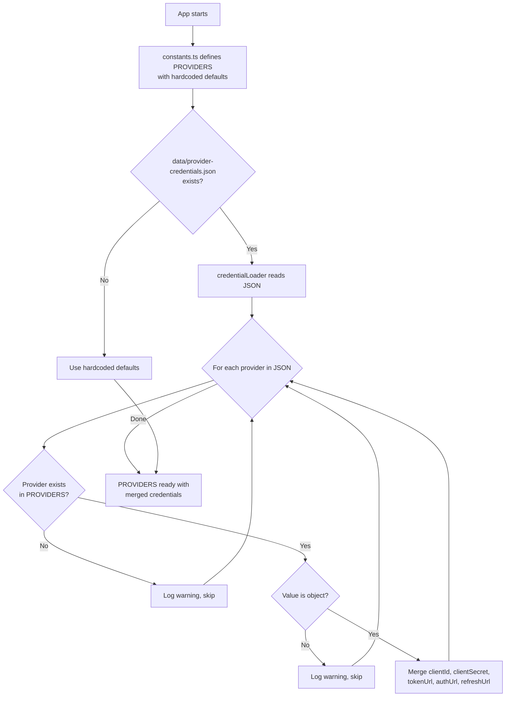

---

### 4.2 Người thực thi (`open-sse/executors/`)

Người thực thi gói gọn **logic dành riêng cho nhà cung cấp** bằng cách sử dụng **Mẫu chiến lược**. Mỗi người thi hành ghi đè các phương thức cơ bản nếu cần.

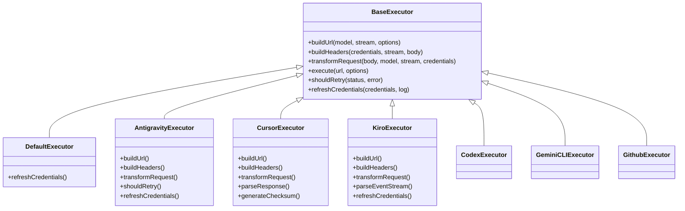

| Người thi hành   | Nhà cung cấp                                | Chuyên ngành chính                                                                                                                |
| ---------------- | ------------------------------------------- | --------------------------------------------------------------------------------------------------------------------------------- |
| `base.ts`        | —                                           | Cơ sở trừu tượng: Xây dựng URL, tiêu đề, logic thử lại, làm mới thông tin xác thực                                                |
| `default.ts`     | Claude, Song Tử, OpenAI, GLM, Kimi, MiniMax | Làm mới mã thông báo OAuth chung cho các nhà cung cấp tiêu chuẩn                                                                  |
| `antigravity.ts` | Mã đám mây của Google                       | Tạo ID dự án/phiên, dự phòng nhiều URL, phân tích cú pháp thử lại tùy chỉnh từ thông báo lỗi ("đặt lại sau 2h7m23 giây")          |
| `cursor.ts`      | IDE con trỏ                                 | **Phức tạp nhất**: Xác thực tổng kiểm tra SHA-256, mã hóa yêu cầu Protobuf, EventStream nhị phân → phân tích cú pháp phản hồi SSE |
| `codex.ts`       | OpenAI Codex                                | Đưa vào các hướng dẫn hệ thống, quản lý các cấp độ tư duy, loại bỏ các tham số không được hỗ trợ                                  |
| `gemini-cli.ts`  | Google Song Tử CLI                          | Xây dựng URL tùy chỉnh (`streamGenerateContent`), làm mới mã thông báo Google OAuth                                               |
| `github.ts`      | Phi công phụ GitHub                         | Hệ thống mã thông báo kép (GitHub OAuth + mã thông báo Copilot), bắt chước tiêu đề VSCode                                         |
| `kiro.ts`        | AWS CodeWhisperer                           | Phân tích cú pháp nhị phân AWS EventStream, khung sự kiện AMZN, ước tính mã thông báo                                             |
| `index.ts`       | —                                           | Nhà máy: tên nhà cung cấp bản đồ → lớp người thực thi, với dự phòng mặc định                                                      |

---

### Trình xử lý 4.3 (`open-sse/handlers/`)

**Lớp điều phối** — điều phối việc dịch, thực thi, phát trực tuyến và xử lý lỗi.

| Tập tin               | Mục đích                                                                                                                                                                                                                        |
| --------------------- | ------------------------------------------------------------------------------------------------------------------------------------------------------------------------------------------------------------------------------- |
| `chatCore.ts`         | **Dàn nhạc trung tâm** (~600 dòng). Xử lý vòng đời yêu cầu hoàn chỉnh: phát hiện định dạng → dịch → gửi người thực thi → phản hồi truyền trực tuyến/không truyền phát → làm mới mã thông báo → xử lý lỗi → ghi nhật ký sử dụng. |
| `responsesHandler.ts` | Bộ điều hợp cho API phản hồi của OpenAI: chuyển đổi định dạng Phản hồi → Hoàn thành cuộc trò chuyện → gửi tới `chatCore` → chuyển đổi SSE trở lại định dạng Phản hồi.                                                           |
| `embeddings.ts`       | Trình xử lý tạo nhúng: giải quyết mô hình nhúng → nhà cung cấp, gửi tới API của nhà cung cấp, trả về phản hồi nhúng tương thích với OpenAI. Hỗ trợ hơn 6 nhà cung cấp.                                                          |
| `imageGeneration.ts`  | Trình xử lý tạo hình ảnh: phân giải mô hình hình ảnh → nhà cung cấp, hỗ trợ các chế độ tương thích với OpenAI, hình ảnh Gemini (Chống trọng lực) và dự phòng (Nebius). Trả về hình ảnh base64 hoặc URL.                         |

#### Vòng đời yêu cầu (chatCore.ts)

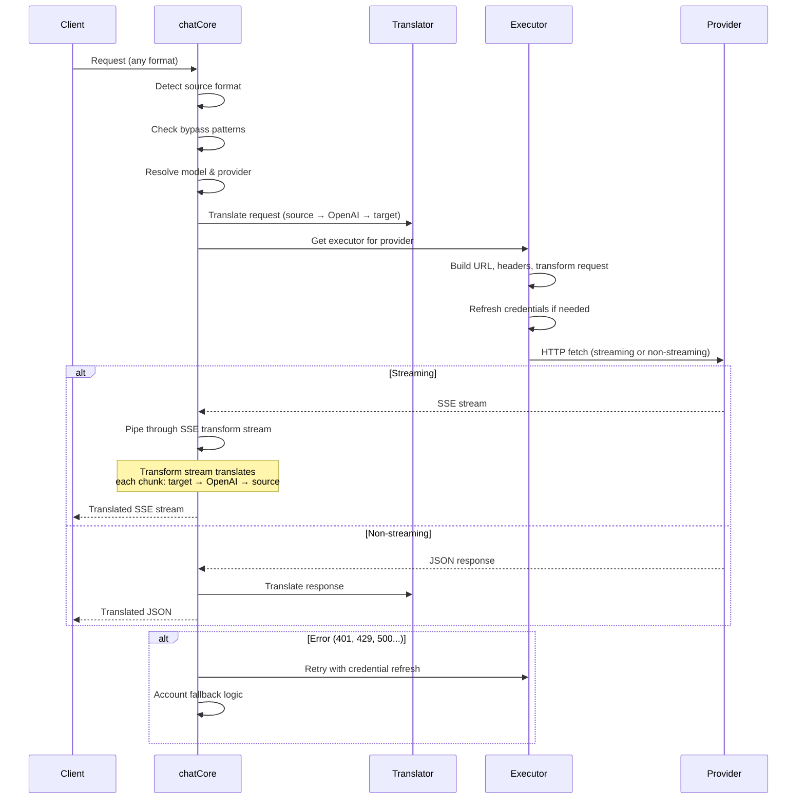

---

### Dịch vụ 4.4 (`open-sse/services/`)

Logic nghiệp vụ hỗ trợ các trình xử lý và thực thi.

| Tập tin              | Mục đích                                                                                                                                                                                                                                                                                                                                             |
| -------------------- | ---------------------------------------------------------------------------------------------------------------------------------------------------------------------------------------------------------------------------------------------------------------------------------------------------------------------------------------------------- |
| `provider.ts`        | **Phát hiện định dạng** (`detectFormat`): phân tích cấu trúc nội dung yêu cầu để xác định các định dạng Claude/OpenAI/Gemini/AntiGravity/Responses (bao gồm `max_tokens` heuristic cho Claude). Ngoài ra: xây dựng URL, xây dựng tiêu đề, chuẩn hóa cấu hình tư duy. Hỗ trợ các nhà cung cấp động `openai-compatible-*` và `anthropic-compatible-*`. |
| `model.ts`           | Phân tích cú pháp chuỗi mô hình (`claude/model-name` → `{provider: "claude", model: "model-name"}`), phân giải bí danh với khả năng phát hiện xung đột, dọn dẹp đầu vào (từ chối ký tự điều khiển/truyền tải đường dẫn) và phân giải thông tin mô hình với hỗ trợ getter bí danh không đồng bộ.                                                      |
| `accountFallback.ts` | Xử lý giới hạn tốc độ: thời gian chờ theo cấp số nhân (1 giây → 2 giây → 4 giây → tối đa 2 phút), quản lý thời gian hồi chiêu của tài khoản, phân loại lỗi (lỗi nào kích hoạt dự phòng so với không).                                                                                                                                                |
| `tokenRefresh.ts`    | Làm mới mã thông báo OAuth cho **mọi nhà cung cấp**: Google (Gemini, AntiGravity), Claude, Codex, Qwen, iFlow, GitHub (Mã thông báo kép OAuth + Copilot), Kiro (AWS SSO OIDC + Social Auth). Bao gồm bộ nhớ đệm chống trùng lặp lời hứa trong quá trình thực hiện và thử lại với thời gian chờ theo cấp số nhân.                                     |
| `combo.ts`           | **Mô hình kết hợp**: chuỗi mô hình dự phòng. Nếu mô hình A không thành công với lỗi đủ điều kiện dự phòng, hãy thử mô hình B, sau đó là C, v.v. Trả về mã trạng thái ngược dòng thực tế.                                                                                                                                                             |
| `usage.ts`           | Tìm nạp hạn ngạch/dữ liệu sử dụng từ API của nhà cung cấp (hạn ngạch GitHub Copilot, hạn ngạch mô hình AntiGravity, giới hạn tốc độ Codex, phân tích sử dụng Kiro, cài đặt Claude).                                                                                                                                                                  |
| `accountSelector.ts` | Lựa chọn tài khoản thông minh với thuật toán tính điểm: xem xét mức độ ưu tiên, trạng thái sức khỏe, vị trí luân chuyển và trạng thái thời gian hồi chiêu để chọn tài khoản tối ưu cho từng yêu cầu.                                                                                                                                                 |
| `contextManager.ts`  | Quản lý vòng đời ngữ cảnh yêu cầu: tạo và theo dõi các đối tượng ngữ cảnh theo yêu cầu bằng siêu dữ liệu (ID yêu cầu, dấu thời gian, thông tin nhà cung cấp) để gỡ lỗi và ghi nhật ký.                                                                                                                                                               |
| `ipFilter.ts`        | Kiểm soát truy cập dựa trên IP: hỗ trợ chế độ danh sách cho phép và danh sách chặn. Xác thực IP của khách hàng dựa trên các quy tắc đã định cấu hình trước khi xử lý các yêu cầu API.                                                                                                                                                                |
| `sessionManager.ts`  | Theo dõi phiên bằng dấu vân tay của khách hàng: theo dõi các phiên hoạt động bằng cách sử dụng mã định danh khách hàng được băm, theo dõi số lượng yêu cầu và cung cấp số liệu phiên.                                                                                                                                                                |
| `signatureCache.ts`  | Bộ đệm chống trùng lặp dựa trên chữ ký yêu cầu: ngăn chặn các yêu cầu trùng lặp bằng cách lưu vào bộ đệm các chữ ký yêu cầu gần đây và trả về các phản hồi được lưu trong bộ nhớ đệm cho các yêu cầu giống hệt nhau trong một khoảng thời gian.                                                                                                      |
| `systemPrompt.ts`    | Chèn lời nhắc hệ thống toàn cầu: thêm vào trước hoặc thêm lời nhắc hệ thống có thể định cấu hình cho tất cả các yêu cầu, với khả năng xử lý khả năng tương thích của mỗi nhà cung cấp.                                                                                                                                                               |
| `thinkingBudget.ts`  | Quản lý ngân sách mã thông báo lý luận: hỗ trợ các chế độ chuyển tiếp, tự động (cấu hình tư duy dải), tùy chỉnh (ngân sách cố định) và chế độ thích ứng (theo tỷ lệ phức tạp) để kiểm soát mã thông báo suy nghĩ/lý luận.                                                                                                                            |
| `wildcardRouter.ts`  | Định tuyến mẫu mô hình ký tự đại diện: phân giải các mẫu ký tự đại diện (ví dụ: `*/claude-*`) thành các cặp nhà cung cấp/mô hình cụ thể dựa trên tính khả dụng và mức độ ưu tiên.                                                                                                                                                                    |

#### Chống trùng lặp làm mới mã thông báo

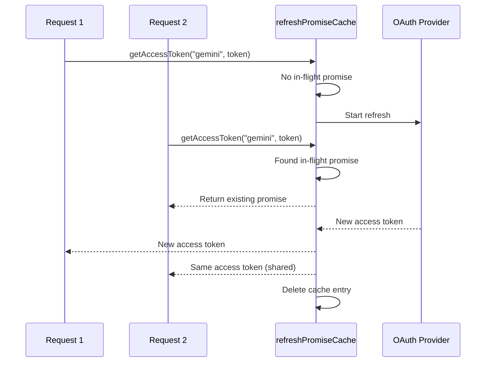

#### Máy trạng thái dự phòng tài khoản

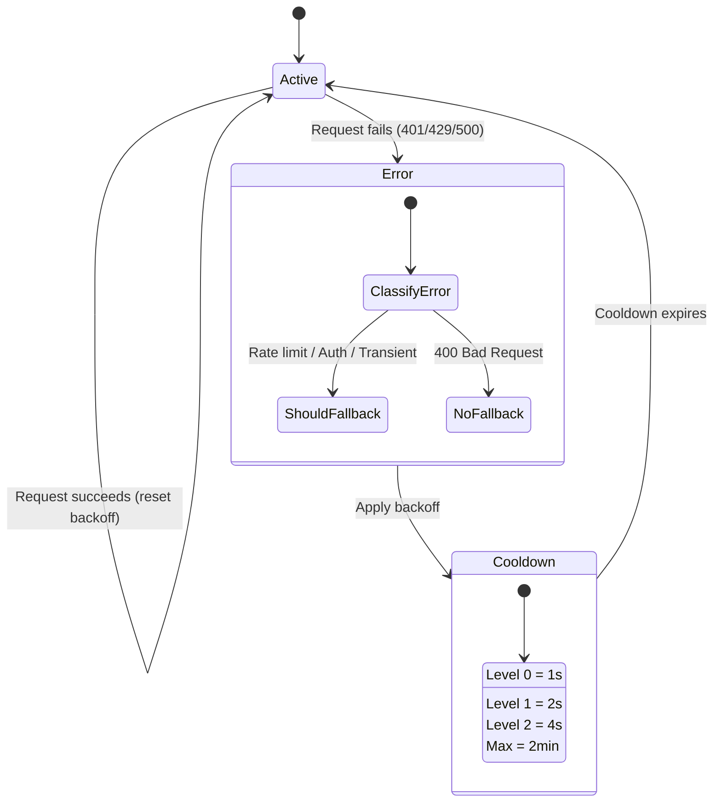

#### Chuỗi Model Combo

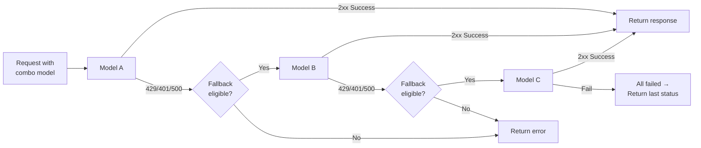

---

### Trình dịch 4.5 (`open-sse/translator/`)

**Công cụ dịch định dạng** sử dụng hệ thống plugin tự đăng ký.

#### Kiến trúc

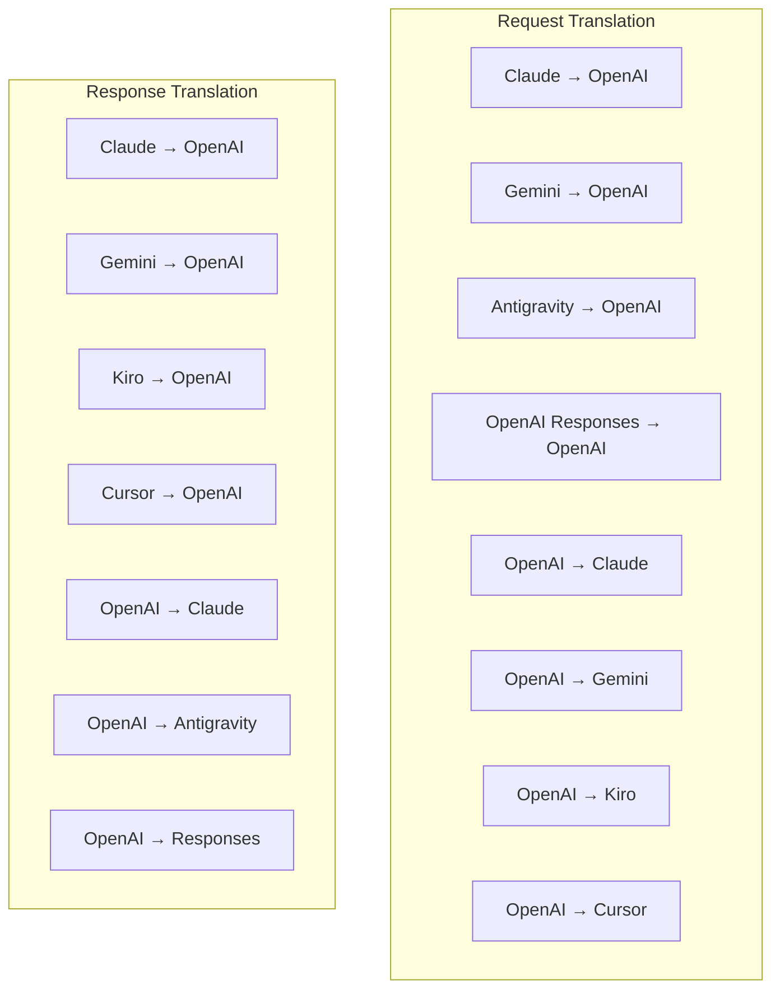

| Thư mục      | Tập tin           | Mô tả                                                                                                                                                                                                                                                                |
| ------------ | ----------------- | -------------------------------------------------------------------------------------------------------------------------------------------------------------------------------------------------------------------------------------------------------------------- |
| `request/`   | 8 dịch giả        | Chuyển đổi nội dung yêu cầu giữa các định dạng. Mỗi tệp tự đăng ký thông qua `register(from, to, fn)` khi nhập.                                                                                                                                                      |
| `response/`  | 7 dịch giả        | Chuyển đổi các đoạn phản hồi phát trực tuyến giữa các định dạng. Xử lý các loại sự kiện SSE, khối suy nghĩ, lệnh gọi công cụ.                                                                                                                                        |
| `helpers/`   | 6 người giúp việc | Các tiện ích được chia sẻ: `claudeHelper` (trích xuất lời nhắc hệ thống, cấu hình tư duy), `geminiHelper` (ánh xạ các bộ phận/nội dung), `openaiHelper` (lọc định dạng), `toolCallHelper` (tạo ID, chèn phản hồi bị thiếu), `maxTokensHelper`, `responsesApiHelper`. |
| `index.ts`   | —                 | Công cụ dịch thuật: `translateRequest()`, `translateResponse()`, quản lý nhà nước, đăng ký.                                                                                                                                                                          |
| `formats.ts` | —                 | Hằng số định dạng: `OPENAI`, `CLAUDE`, `GEMINI`, `ANTIGRAVITY`, `KIRO`, `CURSOR`, `OPENAI_RESPONSES`.                                                                                                                                                                |

#### Thiết kế Key: Plugin tự đăng ký

```javascript
// Each translator file calls register() on import:
import { register } from "../index.js";
register("claude", "openai", translateClaudeToOpenAI);

// The index.js imports all translator files, triggering registration:
import "./request/claude-to-openai.js"; // ← self-registers
```

---

### 4.6 Tiện ích (`open-sse/utils/`)

| Tập tin | Mục đích |
| ------------------ | -------------------------------------------------------------------------------------------------------------------------------------------------------------------------------------------------------------------------------------------------------------------------------------------------------------------| |
| `error.ts` | Xây dựng phản hồi lỗi (định dạng tương thích với OpenAI), phân tích lỗi ngược dòng, trích xuất thời gian thử lại AntiGravity từ các thông báo lỗi, phát trực tuyến lỗi SSE. |
| `stream.ts` | **SSE Transform Stream** — đường truyền phát trực tuyến cốt lõi. Hai chế độ: `TRANSLATE` (dịch định dạng đầy đủ) và `PASSTHROUGH` (chuẩn hóa + trích xuất cách sử dụng). Xử lý việc lưu vào bộ đệm, ước tính mức sử dụng, theo dõi độ dài nội dung. Các phiên bản bộ mã hóa/giải mã mỗi luồng tránh trạng thái chia sẻ. |
| `streamHelpers.ts` | Các tiện ích SSE cấp thấp: `parseSSELine` (không chịu khoảng trắng), `hasValuableContent` (lọc các đoạn trống cho OpenAI/Claude/Gemini), `fixInvalidId`, `formatSSE` (tuần tự hóa SSE nhận biết định dạng với tính năng dọn dẹp `perf_metrics`). |
| `usageTracking.ts` | Trích xuất mức sử dụng mã thông báo từ bất kỳ định dạng nào (Claude/OpenAI/Gemini/Responses), ước tính với tỷ lệ ký tự trên mỗi mã thông báo của công cụ/thông báo riêng biệt, bổ sung bộ đệm (giới hạn an toàn 2000 mã thông báo), lọc trường theo định dạng cụ thể, ghi nhật ký bảng điều khiển với màu ANSI. |
| `requestLogger.ts` | Ghi nhật ký yêu cầu dựa trên tệp (chọn tham gia qua `ENABLE_REQUEST_LOGS=true`). Tạo thư mục phiên với các tệp được đánh số: `1_req_client.json` → `7_res_client.txt`. Tất cả I/O đều không đồng bộ (bắn và quên). Mặt nạ tiêu đề nhạy cảm. |
| `bypassHandler.ts` | Chặn các mẫu cụ thể từ Claude CLI (trích xuất tiêu đề, khởi động, đếm) và trả về các phản hồi giả mạo mà không cần gọi cho bất kỳ nhà cung cấp nào. Hỗ trợ cả phát trực tuyến và không phát trực tuyến. Cố ý giới hạn trong phạm vi Claude CLI. |
| `networkProxy.ts` | Phân giải URL proxy gửi đi cho một nhà cung cấp nhất định với mức độ ưu tiên: cấu hình dành riêng cho nhà cung cấp → cấu hình chung → biến môi trường (`HTTPS_PROXY`/`HTTP_PROXY`/`ALL_PROXY`). Hỗ trợ loại trừ `NO_PROXY`. Cấu hình bộ nhớ đệm trong 30 giây. |

#### Đường ống truyền phát SSE

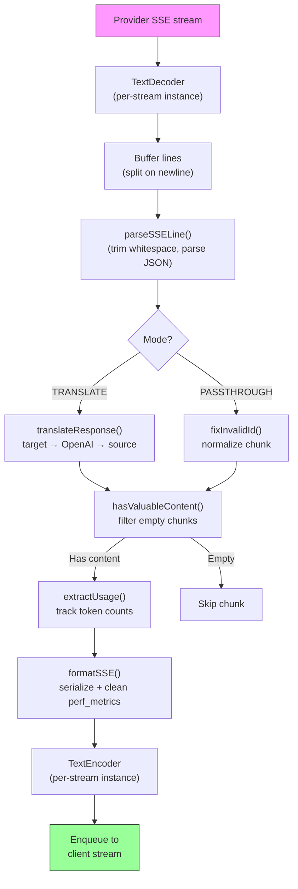

#### Cấu trúc phiên ghi nhật ký yêu cầu

```
logs/
└── claude_gemini_claude-sonnet_20260208_143045/
    ├── 1_req_client.json      ← Raw client request
    ├── 2_req_source.json      ← After initial conversion
    ├── 3_req_openai.json      ← OpenAI intermediate format
    ├── 4_req_target.json      ← Final target format
    ├── 5_res_provider.txt     ← Provider SSE chunks (streaming)
    ├── 5_res_provider.json    ← Provider response (non-streaming)
    ├── 6_res_openai.txt       ← OpenAI intermediate chunks
    ├── 7_res_client.txt       ← Client-facing SSE chunks
    └── 6_error.json           ← Error details (if any)
```

---

### 4.7 Lớp ứng dụng (`src/`)

| Thư mục       | Mục đích                                                                                    |
| ------------- | ------------------------------------------------------------------------------------------- |
| `src/app/`    | Giao diện người dùng web, tuyến API, phần mềm trung gian Express, trình xử lý gọi lại OAuth |
| `src/lib/`    | Truy cập cơ sở dữ liệu (`localDb.ts`, `usageDb.ts`), xác thực, chia sẻ                      |
| `src/mitm/`   | Tiện ích proxy trung gian để chặn lưu lượng truy cập của nhà cung cấp                       |
| `src/models/` | Định nghĩa mô hình cơ sở dữ liệu                                                            |
| `src/shared/` | Trình bao bọc xung quanh các hàm open-sse (nhà cung cấp, luồng, lỗi, v.v.)                  |
| `src/sse/`    | Trình xử lý điểm cuối SSE kết nối thư viện open-sse với các tuyến Express                   |
| `src/store/`  | Quản lý trạng thái ứng dụng                                                                 |

#### Các tuyến API đáng chú ý

| Tuyến đường                                   | Phương pháp   | Mục đích                                                                                                      |
| --------------------------------------------- | ------------- | ------------------------------------------------------------------------------------------------------------- |
| `/api/provider-models`                        | NHẬN/ĐĂNG/XÓA | CRUD cho các mô hình tùy chỉnh cho mỗi nhà cung cấp                                                           |
| `/api/models/catalog`                         | NHẬN          | Danh mục tổng hợp của tất cả các mô hình (trò chuyện, nhúng, hình ảnh, tùy chỉnh) được nhóm theo nhà cung cấp |
| `/api/settings/proxy`                         | NHẬN/ĐẶT/XÓA  | Cấu hình proxy gửi đi theo cấp bậc (`global/providers/combos/keys`)                                           |
| `/api/settings/proxy/test`                    | ĐĂNG          | Xác thực kết nối proxy và trả về IP công cộng/độ trễ                                                          |
| `/v1/providers/[provider]/chat/completions`   | ĐĂNG          | Hoàn thành trò chuyện dành riêng cho mỗi nhà cung cấp với xác thực mô hình                                    |
| `/v1/providers/[provider]/embeddings`         | ĐĂNG          | Phần nhúng dành riêng cho mỗi nhà cung cấp với xác thực mô hình                                               |
| `/v1/providers/[provider]/images/generations` | ĐĂNG          | Tạo hình ảnh chuyên dụng cho mỗi nhà cung cấp với xác thực mô hình                                            |
| `/api/settings/ip-filter`                     | NHẬN/ĐẶT      | Quản lý danh sách chặn/danh sách IP cho phép                                                                  |
| `/api/settings/thinking-budget`               | NHẬN/ĐẶT      | Cấu hình ngân sách mã thông báo hợp lý (chuyển qua/tự động/tùy chỉnh/thích ứng)                               |
| `/api/settings/system-prompt`                 | NHẬN/ĐẶT      | Hệ thống nhắc nhở toàn cầu cho tất cả các yêu cầu                                                             |
| `/api/sessions`                               | NHẬN          | Theo dõi và đo lường phiên hoạt động                                                                          |
| `/api/rate-limits`                            | NHẬN          | Trạng thái giới hạn tỷ lệ cho mỗi tài khoản                                                                   |

---

## 5. Các mẫu thiết kế chính

### 5.1 Dịch Hub-and-Spoke

Tất cả các định dạng đều dịch qua **định dạng OpenAI làm trung tâm**. Việc thêm nhà cung cấp mới chỉ yêu cầu viết **một cặp** người dịch (đến/từ OpenAI), chứ không phải N cặp.

### 5.2 Mẫu chiến lược thực thi

Mỗi nhà cung cấp có một lớp người thực thi chuyên dụng kế thừa từ `BaseExecutor`. Nhà máy ở `executors/index.ts` chọn đúng nhà máy khi chạy.

### 5.3 Hệ thống Plugin tự đăng ký

Mô-đun dịch tự đăng ký khi nhập qua `register()`. Việc thêm người dịch mới chỉ là tạo một tệp và nhập tệp đó.

### 5.4 Dự phòng tài khoản với thời gian chờ theo cấp số nhân

Khi nhà cung cấp trả về 429/401/500, hệ thống có thể chuyển sang tài khoản tiếp theo, áp dụng thời gian hồi chiêu theo cấp số nhân (1 giây → 2 giây → 4 giây → tối đa 2 phút).

### 5.5 Chuỗi mô hình kết hợp

Một "combo" nhóm nhiều chuỗi `provider/model`. Nếu lần đầu tiên không thành công, hãy tự động chuyển sang lần tiếp theo.

### 5.6 Bản dịch phát trực tuyến có trạng thái

Bản dịch phản hồi duy trì trạng thái trên các khối SSE (theo dõi khối suy nghĩ, tích lũy lệnh gọi công cụ, lập chỉ mục khối nội dung) thông qua cơ chế `initState()`.

### 5.7 Bộ đệm an toàn sử dụng

Bộ đệm 2000 mã thông báo được thêm vào mức sử dụng được báo cáo để ngăn khách hàng đạt đến giới hạn cửa sổ ngữ cảnh do quá tải từ lời nhắc hệ thống và dịch định dạng.

---

## 6. Các định dạng được hỗ trợ

| Định dạng                    | Hướng        | Mã định danh       |
| ---------------------------- | ------------ | ------------------ |
| Hoàn thành trò chuyện OpenAI | nguồn + đích | `openai`           |
| API phản hồi OpenAI          | nguồn + đích | `openai-responses` |
| Claude nhân loại             | nguồn + đích | `claude`           |
| Google Song Tử               | nguồn + đích | `gemini`           |
| Google Song Tử CLI           | chỉ mục tiêu | `gemini-cli`       |
| Phản lực hấp dẫn             | nguồn + đích | `antigravity`      |
| AWS Kiro                     | chỉ mục tiêu | `kiro`             |
| Con trỏ                      | chỉ mục tiêu | `cursor`           |

---

## 7. Nhà cung cấp được hỗ trợ

| Nhà cung cấp             | Phương thức xác thực         | Người thi hành   | Ghi chú chính                                           |
| ------------------------ | ---------------------------- | ---------------- | ------------------------------------------------------- |
| Claude nhân loại         | Khóa API hoặc OAuth          | Mặc định         | Sử dụng tiêu đề `x-api-key`                             |
| Google Song Tử           | Khóa API hoặc OAuth          | Mặc định         | Sử dụng tiêu đề `x-goog-api-key`                        |
| Google Song Tử CLI       | OAuth                        | Song TửCLI       | Sử dụng điểm cuối `streamGenerateContent`               |
| Phản lực hấp dẫn         | OAuth                        | Phản lực hấp dẫn | Dự phòng nhiều URL, phân tích cú pháp thử lại tùy chỉnh |
| OpenAI                   | Khóa API                     | Mặc định         | Xác thực Bearer tiêu chuẩn                              |
| Codex                    | OAuth                        | Codex            | Đưa ra hướng dẫn hệ thống, quản lý tư duy               |
| Phi công phụ GitHub      | Mã thông báo OAuth + Copilot | Github           | Mã thông báo kép, bắt chước tiêu đề VSCode              |
| Kiro (AWS)               | AWS SSO OIDC hoặc Xã hội     | Kiro             | Phân tích cú pháp luồng sự kiện nhị phân                |
| IDE con trỏ              | Xác thực tổng kiểm tra       | Con trỏ          | Mã hóa Protobuf, tổng kiểm tra SHA-256                  |
| Qwen                     | OAuth                        | Mặc định         | Xác thực chuẩn                                          |
| iFlow                    | OAuth (Cơ bản + Mang)        | Mặc định         | Tiêu đề xác thực kép                                    |
| OpenRouter               | Khóa API                     | Mặc định         | Xác thực Bearer tiêu chuẩn                              |
| GLM, Kimi, MiniMax       | Khóa API                     | Mặc định         | Tương thích với Claude, sử dụng `x-api-key`             |
| `openai-compatible-*`    | Khóa API                     | Mặc định         | Động: mọi điểm cuối tương thích với OpenAI              |
| `anthropic-compatible-*` | Khóa API                     | Mặc định         | Động: mọi điểm cuối tương thích với Claude              |

---

## 8. Tóm tắt luồng dữ liệu

### Yêu cầu phát trực tuyến

```mermaid
flowchart LR
    A["Client"] --> B["detectFormat()"]
    B --> C["translateRequest()\nsource → OpenAI → target"]
    C --> D["Executor\nbuildUrl + buildHeaders"]
    D --> E["fetch(providerURL)"]
    E --> F["createSSEStream()\nTRANSLATE mode"]
    F --> G["parseSSELine()"]
    G --> H["translateResponse()\ntarget → OpenAI → source"]
    H --> I["extractUsage()\n+ addBuffer"]
    I --> J["formatSSE()"]
    J --> K["Client receives\ntranslated SSE"]
    K --> L["logUsage()\nsaveRequestUsage()"]
```

### Yêu cầu không phát trực tuyến

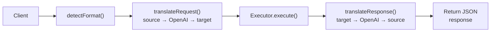

### Luồng bỏ qua (Claude CLI)

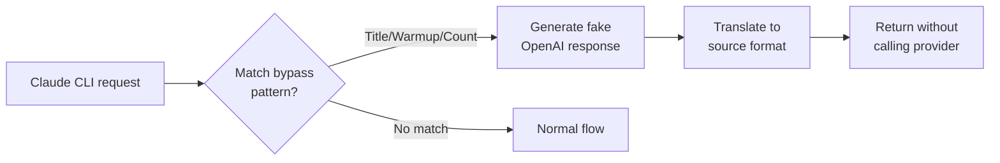
