🌐 **Languages:** 🇺🇸 [English](../../CODEBASE_DOCUMENTATION.md) | 🇧🇷 [Português (Brasil)](../pt-BR/CODEBASE_DOCUMENTATION.md) | 🇪🇸 [Español](../es/CODEBASE_DOCUMENTATION.md) | 🇫🇷 [Français](../fr/CODEBASE_DOCUMENTATION.md) | 🇮🇹 [Italiano](../it/CODEBASE_DOCUMENTATION.md) | 🇷🇺 [Русский](../ru/CODEBASE_DOCUMENTATION.md) | 🇨🇳 [中文 (简体)](../zh-CN/CODEBASE_DOCUMENTATION.md) | 🇩🇪 [Deutsch](../de/CODEBASE_DOCUMENTATION.md) | 🇮🇳 [हिन्दी](../in/CODEBASE_DOCUMENTATION.md) | 🇹🇭 [ไทย](../th/CODEBASE_DOCUMENTATION.md) | 🇺🇦 [Українська](../uk-UA/CODEBASE_DOCUMENTATION.md) | 🇸🇦 [العربية](../ar/CODEBASE_DOCUMENTATION.md) | 🇯🇵 [日本語](../ja/CODEBASE_DOCUMENTATION.md) | 🇻🇳 [Tiếng Việt](../vi/CODEBASE_DOCUMENTATION.md) | 🇧🇬 [Български](../bg/CODEBASE_DOCUMENTATION.md) | 🇩🇰 [Dansk](../da/CODEBASE_DOCUMENTATION.md) | 🇫🇮 [Suomi](../fi/CODEBASE_DOCUMENTATION.md) | 🇮🇱 [עברית](../he/CODEBASE_DOCUMENTATION.md) | 🇭🇺 [Magyar](../hu/CODEBASE_DOCUMENTATION.md) | 🇮🇩 [Bahasa Indonesia](../id/CODEBASE_DOCUMENTATION.md) | 🇰🇷 [한국어](../ko/CODEBASE_DOCUMENTATION.md) | 🇲🇾 [Bahasa Melayu](../ms/CODEBASE_DOCUMENTATION.md) | 🇳🇱 [Nederlands](../nl/CODEBASE_DOCUMENTATION.md) | 🇳🇴 [Norsk](../no/CODEBASE_DOCUMENTATION.md) | 🇵🇹 [Português (Portugal)](../pt/CODEBASE_DOCUMENTATION.md) | 🇷🇴 [Română](../ro/CODEBASE_DOCUMENTATION.md) | 🇵🇱 [Polski](../pl/CODEBASE_DOCUMENTATION.md) | 🇸🇰 [Slovenčina](../sk/CODEBASE_DOCUMENTATION.md) | 🇸🇪 [Svenska](../sv/CODEBASE_DOCUMENTATION.md) | 🇵🇭 [Filipino](../phi/CODEBASE_DOCUMENTATION.md)

#omniroute — 代码库文档

> A comprehensive, beginner-friendly guide to the **omniroute** multi-provider AI proxy router.

---

## 1. 什么是全向？

omniroute 是一个**代理路由器**，位于 AI 客户端（Claude CLI、Codex、Cursor IDE 等）和 AI 提供商（Anthropic、Google、OpenAI、AWS、GitHub 等）之间。它解决了一个大问题：

> **不同的 AI 客户端使用不同的“语言”（API 格式），不同的 AI 提供商也期望不同的“语言”。**omniroute 自动在它们之间进行翻译。

可以将其想象为联合国的通用翻译器 - 任何代表都可以说任何语言，翻译器可以将其转换为任何其他代表。

---

## 2. 架构概述

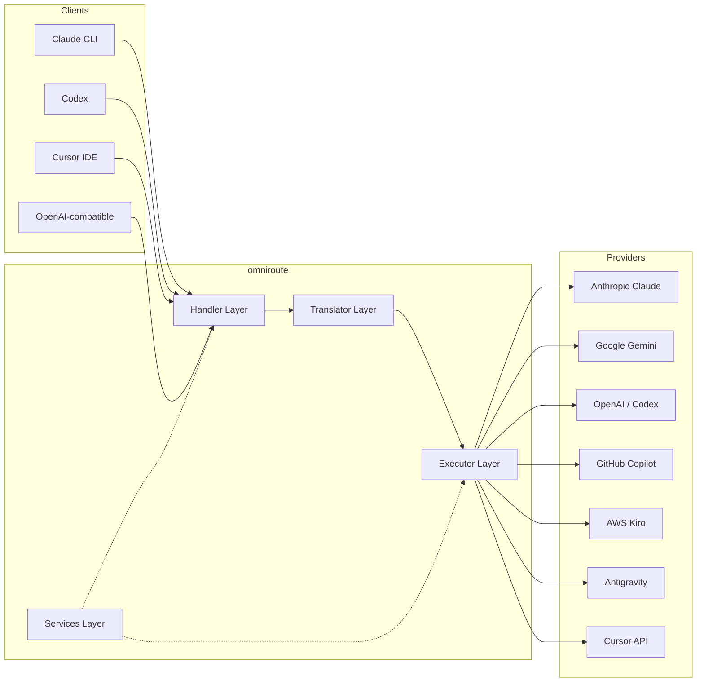

### 核心原则：轴辐式翻译

All format translation passes through **OpenAI format as the hub**:

```
Client Format → [OpenAI Hub] → Provider Format    (request)
Provider Format → [OpenAI Hub] → Client Format    (response)
```

This means you only need **N translators** (one per format) instead of **N²** (every pair).

---

## 3. 项目结构

```
omniroute/
├── open-sse/                  ← Core proxy library (portable, framework-agnostic)
│   ├── index.js               ← Main entry point, exports everything
│   ├── config/                ← Configuration & constants
│   ├── executors/             ← Provider-specific request execution
│   ├── handlers/              ← Request handling orchestration
│   ├── services/              ← Business logic (auth, models, fallback, usage)
│   ├── translator/            ← Format translation engine
│   │   ├── request/           ← Request translators (8 files)
│   │   ├── response/          ← Response translators (7 files)
│   │   └── helpers/           ← Shared translation utilities (6 files)
│   └── utils/                 ← Utility functions
├── src/                       ← Application layer (Express/Worker runtime)
│   ├── app/                   ← Web UI, API routes, middleware
│   ├── lib/                   ← Database, auth, and shared library code
│   ├── mitm/                  ← Man-in-the-middle proxy utilities
│   ├── models/                ← Database models
│   ├── shared/                ← Shared utilities (wrappers around open-sse)
│   ├── sse/                   ← SSE endpoint handlers
│   └── store/                 ← State management
├── data/                      ← Runtime data (credentials, logs)
│   └── provider-credentials.json   (external credentials override, gitignored)
└── tester/                    ← Test utilities
```

---

## 4. 逐个模块细分

### 4.1 配置 (`open-sse/config/`)

The **single source of truth** for all provider configuration.

| 文件                          | 目的                                                                                                                                                                          |
| ----------------------------- | ----------------------------------------------------------------------------------------------------------------------------------------------------------------------------- |
| `constants.ts`                | `PROVIDERS` 对象，包含每个提供商的基本 URL、OAuth 凭据（默认）、标头和默认系统提示。还定义 `HTTP_STATUS`、`ERROR_TYPES`、`COOLDOWN_MS`、`BACKOFF_CONFIG` 和 `SKIP_PATTERNS`。 |
| `credentialLoader.ts`         | 从 `data/provider-credentials.json` 加载外部凭据，并将它们合并到 `PROVIDERS` 中的硬编码默认值上。让秘密不受源代码控制，同时保持向后兼容性。                                   |
| `providerModels.ts`           | 中央模型注册表：映射提供者别名 → 模型 ID。类似 `getModels()`、`getProviderByAlias()` 的函数。                                                                                 |
| `codexInstructions.ts`        | 系统指令注入到 Codex 请求中（编辑约束、沙箱规则、批准策略）。                                                                                                                 |
| `defaultThinkingSignature.ts` | 克劳德和双子座模型的默认“思考”签名。                                                                                                                                          |
| `ollamaModels.ts`             | 本地 Ollama 模型的架构定义（名称、大小、系列、量化）。                                                                                                                        |

#### 凭证加载流程

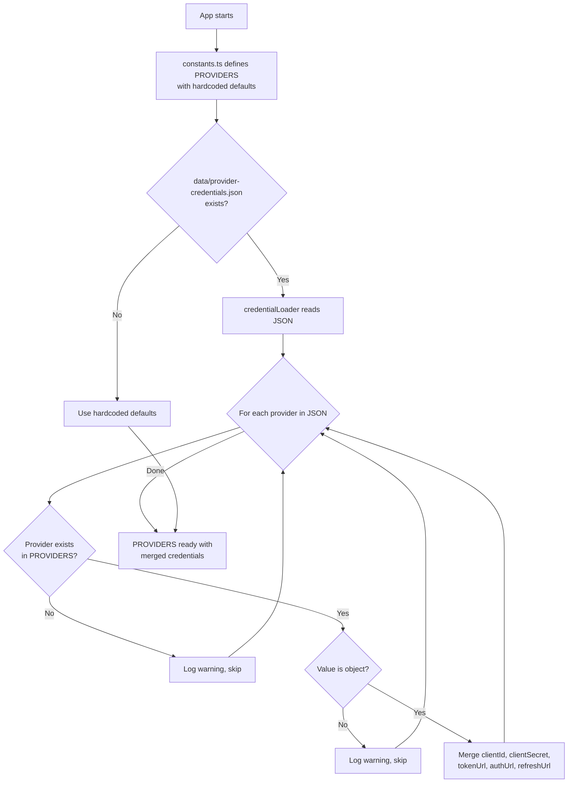

---

### 4.2 执行者 (`open-sse/executors/`)

执行器使用**策略模式**封装**特定于提供者的逻辑**。每个执行器根据需要重写基本方法。

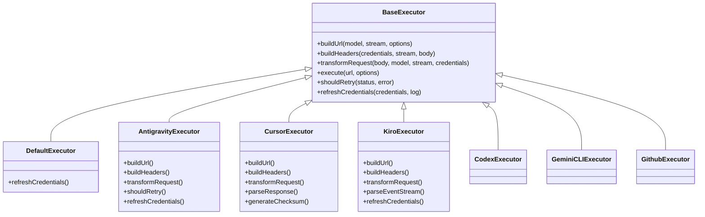

| 执行人           | 供应商                                     | 重点专业                                                                             |
| ---------------- | ------------------------------------------ | ------------------------------------------------------------------------------------ |
| `base.ts`        | —                                          | 抽象基础：URL 构建、标头、重试逻辑、凭证刷新                                         |
| `default.ts`     | 克劳德、Gemini、OpenAI、GLM、Kimi、MiniMax | 标准提供商的通用 OAuth 令牌刷新                                                      |
| `antigravity.ts` | 谷歌云代码                                 | 项目/会话 ID 生成、多 URL 回退、自定义重试错误消息解析（“2 小时 7 分 23 秒后重置”）  |
| `cursor.ts`      | 光标IDE                                    | **最复杂**：SHA-256 校验和验证、Protobuf 请求编码、二进制 EventStream → SSE 响应解析 |
| `codex.ts`       | OpenAI 法典                                | 注入系统指令、管理思维水平、删除不支持的参数                                         |
| `gemini-cli.ts`  | 谷歌 Gemini CLI                            | 自定义 URL 构建 (`streamGenerateContent`)、Google OAuth 令牌刷新                     |
| `github.ts`      | GitHub 副驾驶                              | 双令牌系统（GitHub OAuth + Copilot 令牌），VSCode 标头模仿                           |
| `kiro.ts`        | AWS 代码耳语                               | AWS EventStream 二进制解析、AMZN 事件框架、令牌估计                                  |
| `index.ts`       | —                                          | 工厂：地图提供者名称 → 执行器类，具有默认后备                                        |

---

### 4.3 处理程序 (`open-sse/handlers/`)

**编排层** — 协调翻译、执行、流式传输和错误处理。

| 文件                  | 目的                                                                                                                             |
| --------------------- | -------------------------------------------------------------------------------------------------------------------------------- |
| `chatCore.ts`         | **中央编排器**（约 600 行）。处理完整的请求生命周期：格式检测→转换→执行程序调度→流/非流响应→令牌刷新→错误处理→使用日志记录。     |
| `responsesHandler.ts` | OpenAI 响应 API 的适配器：转换响应格式 → 聊天完成 → 发送到 `chatCore` → 将 SSE 转换回响应格式。                                  |
| `embeddings.ts`       | 嵌入生成处理程序：解析嵌入模型→提供者，分派到提供者 API，返回兼容 OpenAI 的嵌入响应。支持 6 个以上提供商。                       |
| `imageGeneration.ts`  | 图像生成处理程序：解析图像模型→提供程序，支持 OpenAI 兼容、Gemini-image（反重力）和后备（Nebius）模式。返回 base64 或 URL 图像。 |

#### 请求生命周期 (chatCore.ts)

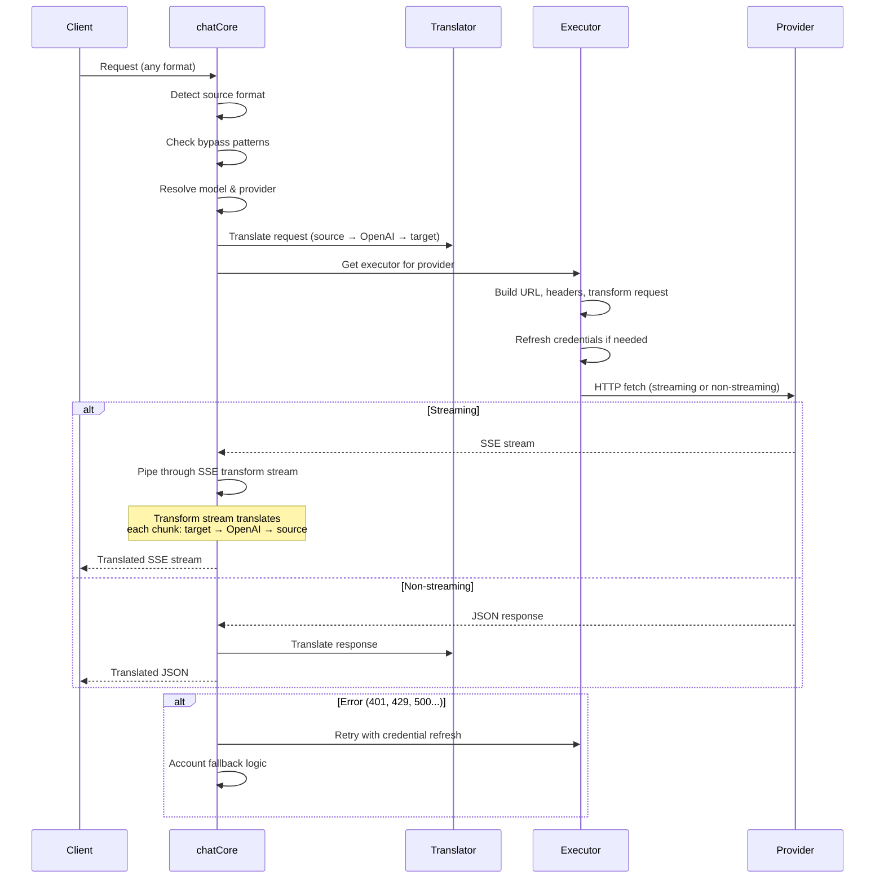

---

### 4.4 服务 (`open-sse/services/`)

支持处理程序和执行程序的业务逻辑。

| 文件                 | 目的                                                                                                                                                                                                                                                         |
| -------------------- | ------------------------------------------------------------------------------------------------------------------------------------------------------------------------------------------------------------------------------------------------------------ |
| `provider.ts`        | **格式检测** (`detectFormat`)：分析请求主体结构以识别 Claude/OpenAI/Gemini/Antigravity/Responses 格式（包括 Claude 的 `max_tokens` 启发式）。另外：URL 构建、标头构建、思考配置规范化。支持 `openai-compatible-*` 和 `anthropic-compatible-*` 动态提供程序。 |
| `model.ts`           | 模型字符串解析 (`claude/model-name` → `{provider: "claude", model: "model-name"}`)、具有冲突检测的别名解析、输入清理（拒绝路径遍历/控制字符）以及具有异步别名 getter 支持的模型信息解析。                                                                    |
| `accountFallback.ts` | 速率限制处理：指数退避（1 秒 → 2 秒 → 4 秒 → 最大 2 分钟）、帐户冷却管理、错误分类（哪些错误触发回退，哪些错误不触发）。                                                                                                                                     |
| `tokenRefresh.ts`    | **每个提供商**的 OAuth 令牌刷新：Google（Gemini、Antigravity）、Claude、Codex、Qwen、iFlow、GitHub（OAuth + Copilot 双令牌）、Kiro（AWS SSO OIDC + 社交身份验证）。包括正在进行的承诺重复数据删除缓存和指数退避重试。                                        |
| `combo.ts`           | **组合模型**：后备模型链。如果模型 A 因符合后备条件的错误而失败，请尝试模型 B，然后是模型 C，等等。返回实际的上游状态代码。                                                                                                                                  |
| `usage.ts`           | 从提供商 API 获取配额/使用数据（GitHub Copilot 配额、Antigravity 模型配额、Codex 速率限制、Kiro 使用细分、Claude 设置）。                                                                                                                                    |
| `accountSelector.ts` | 具有评分算法的智能帐户选择：考虑优先级、健康状态、循环位置和冷却状态，为每个请求选择最佳帐户。                                                                                                                                                               |
| `contextManager.ts`  | 请求上下文生命周期管理：使用元数据（请求 ID、时间戳、提供程序信息）创建和跟踪每个请求上下文对象，以进行调试和日志记录。                                                                                                                                      |
| `ipFilter.ts`        | 基于IP的访问控制：支持白名单和黑名单模式。在处理 API 请求之前根据配置的规则验证客户端 IP。                                                                                                                                                                   |
| `sessionManager.ts`  | 使用客户端指纹进行会话跟踪：使用散列客户端标识符跟踪活动会话、监视请求计数并提供会话指标。                                                                                                                                                                   |
| `signatureCache.ts`  | 基于请求签名的重复数据删除缓存：通过缓存最近的请求签名并在时间窗口内返回相同请求的缓存响应来防止重复请求。                                                                                                                                                   |
| `systemPrompt.ts`    | 全局系统提示注入：在所有请求之前或附加一个可配置的系统提示，并进行每个提供商的兼容性处理。                                                                                                                                                                   |
| `thinkingBudget.ts`  | 推理令牌预算管理：支持直通、自动（条带思维配置）、自定义（固定预算）和自适应（复杂度缩放）模式来控制思维/推理令牌。                                                                                                                                          |
| `wildcardRouter.ts`  | 通配符模型模式路由：根据可用性和优先级将通配符模式（例如 `*/claude-*`）解析为具体的提供者/模型对。                                                                                                                                                           |

#### 令牌刷新重复数据删除

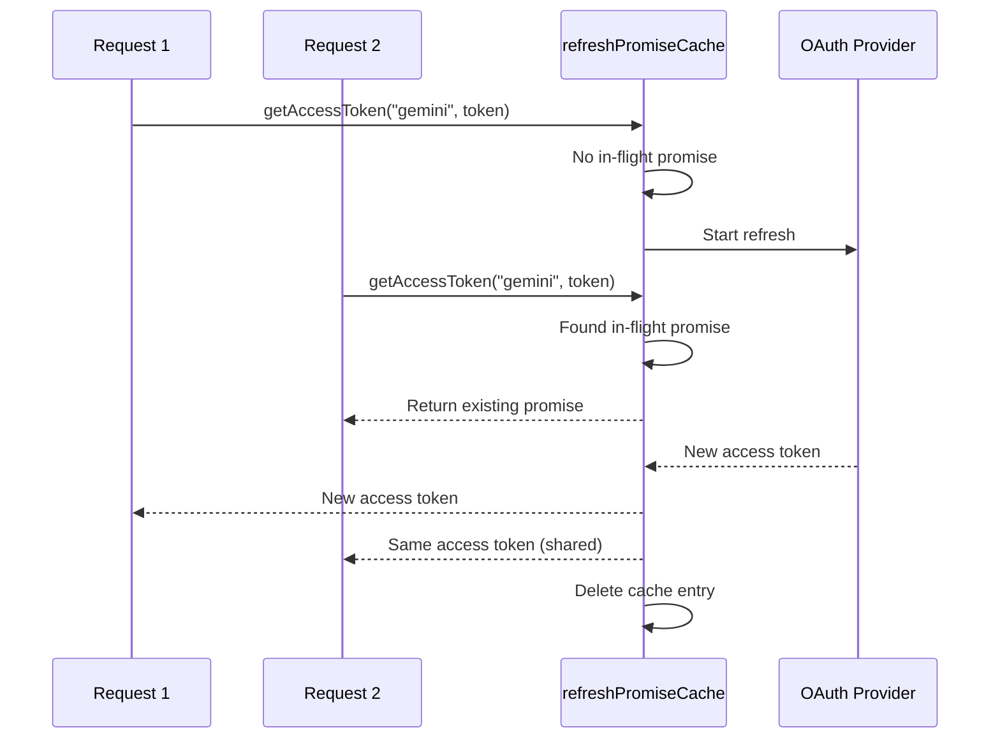

#### 帐户回退状态机

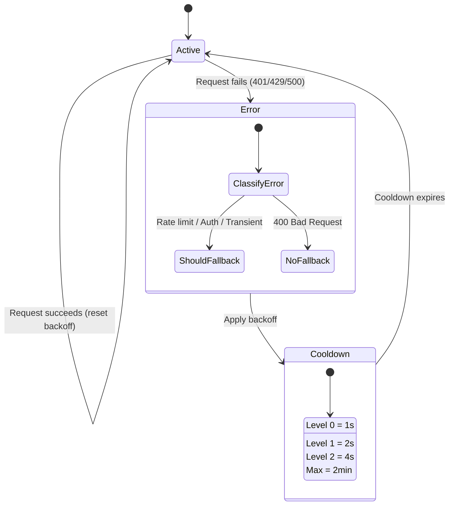

#### 组合模型链

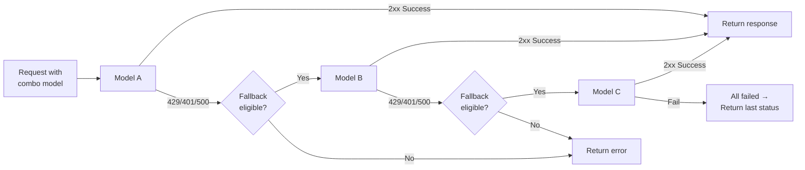

---

### 4.5 翻译器 (`open-sse/translator/`)

使用自注册插件系统的 **格式翻译引擎**。

#### 架构

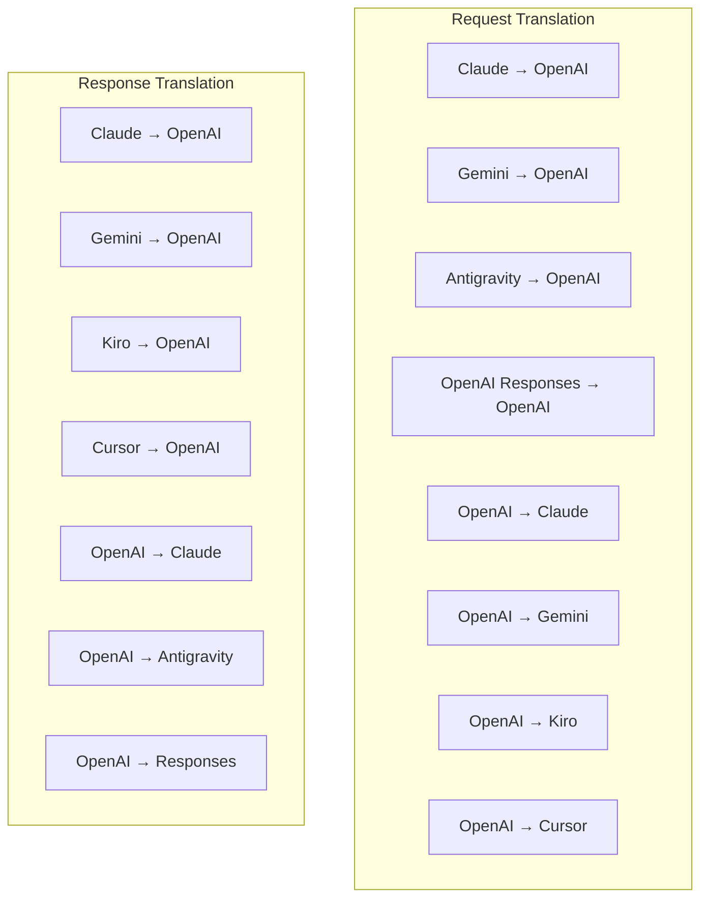

| 目录         | 文件     | 描述                                                                                                                                                                                                     |
| ------------ | -------- | -------------------------------------------------------------------------------------------------------------------------------------------------------------------------------------------------------- |
| `request/`   | 8 位译员 | 在格式之间转换请求正文。每个文件在导入时通过 `register(from, to, fn)` 自行注册。                                                                                                                         |
| `response/`  | 7 名翻译 | 在格式之间转换流响应块。处理 SSE 事件类型、思维块、工具调用。                                                                                                                                            |
| `helpers/`   | 6 帮手   | 共享实用程序：`claudeHelper`（系统提示提取、思考配置）、`geminiHelper`（部分/内容映射）、`openaiHelper`（格式过滤）、`toolCallHelper`（ID生成、缺失响应注入）、`maxTokensHelper`、`responsesApiHelper`。 |
| `index.ts`   | —        | 翻译引擎：`translateRequest()`、`translateResponse()`、状态管理、注册表。                                                                                                                                |
| `formats.ts` | —        | 格式常量：`OPENAI`、`CLAUDE`、`GEMINI`、`ANTIGRAVITY`、`KIRO`、`CURSOR`、`OPENAI_RESPONSES`。                                                                                                            |

#### 关键设计：自注册插件

```javascript
// Each translator file calls register() on import:
import { register } from "../index.js";
register("claude", "openai", translateClaudeToOpenAI);

// The index.js imports all translator files, triggering registration:
import "./request/claude-to-openai.js"; // ← self-registers
```

---

### 4.6 实用程序 (`open-sse/utils/`)

| 文件               | 目的                                                                                                                                                                                              |
| ------------------ | ------------------------------------------------------------------------------------------------------------------------------------------------------------------------------------------------- |
| `error.ts`         | 错误响应构建（OpenAI 兼容格式）、上游错误解析、从错误消息中提取反重力重试时间、SSE 错误流。                                                                                                       |
| `stream.ts`        | **SSE Transform Stream** — 核心流管道。两种模式：`TRANSLATE`（完整格式翻译）和`PASSTHROUGH`（规范化+提取使用）。处理块缓冲、使用情况估计、内容长度跟踪。每个流编码器/解码器实例避免共享状态。     |
| `streamHelpers.ts` | 低级 SSE 实用程序：`parseSSELine`（空白容忍）、`hasValuableContent`（过滤 OpenAI/Claude/Gemini 的空块）、`fixInvalidId`、`formatSSE`（具有 `perf_metrics` 清理功能的格式感知 SSE 序列化）。       |
| `usageTracking.ts` | 从任何格式（Claude/OpenAI/Gemini/Responses）提取令牌使用情况，使用单独的工具/消息字符/令牌比率进行估计，缓冲区添加（2000 个令牌安全裕度），特定于格式的字段过滤，使用 ANSI 颜色的控制台日志记录。 |
| `requestLogger.ts` | 基于文件的请求日志记录（通过 `ENABLE_REQUEST_LOGS=true` 选择加入）。创建包含编号文件的会话文件夹：`1_req_client.json` → `7_res_client.txt`。所有 I/O 都是异步的（即发即弃）。屏蔽敏感标头。       |
| `bypassHandler.ts` | 拦截来自 Claude CLI 的特定模式（标题提取、预热、计数）并返回虚假响应，而无需调用任何提供者。支持流式传输和非流式传输。有意限制为 Claude CLI 范围。                                                |
| `networkProxy.ts`  | 优先解析给定提供程序的出站代理 URL：提供程序特定的配置 → 全局配置 → 环境变量 (`HTTPS_PROXY`/`HTTP_PROXY`/`ALL_PROXY`)。支持 `NO_PROXY` 排除。缓存配置 30 秒。                                     |

#### SSE 流媒体管道

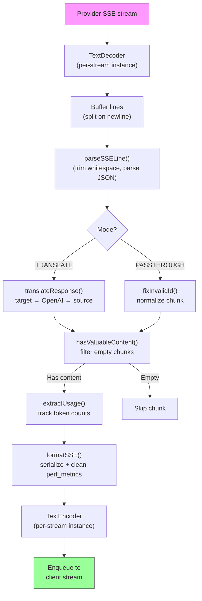

#### 请求记录器会话结构

```
logs/
└── claude_gemini_claude-sonnet_20260208_143045/
    ├── 1_req_client.json      ← Raw client request
    ├── 2_req_source.json      ← After initial conversion
    ├── 3_req_openai.json      ← OpenAI intermediate format
    ├── 4_req_target.json      ← Final target format
    ├── 5_res_provider.txt     ← Provider SSE chunks (streaming)
    ├── 5_res_provider.json    ← Provider response (non-streaming)
    ├── 6_res_openai.txt       ← OpenAI intermediate chunks
    ├── 7_res_client.txt       ← Client-facing SSE chunks
    └── 6_error.json           ← Error details (if any)
```

---

### 4.7 应用层 (`src/`)

| 目录          | 目的                                                     |
| ------------- | -------------------------------------------------------- |
| `src/app/`    | Web UI、API 路由、Express 中间件、OAuth 回调处理程序     |
| `src/lib/`    | 数据库访问（`localDb.ts`、`usageDb.ts`）、身份验证、共享 |
| `src/mitm/`   | 用于拦截提供商流量的中间人代理实用程序                   |
| `src/models/` | 数据库模型定义                                           |
| `src/shared/` | open-sse 函数（提供程序、流、错误等）的包装器            |
| `src/sse/`    | 将 open-sse 库连接到 Express 路由的 SSE 端点处理程序     |
| `src/store/`  | 应用状态管理                                             |

#### 值得注意的 API 路由

| 路线                                          | 方法           | 目的                                                         |
| --------------------------------------------- | -------------- | ------------------------------------------------------------ |
| `/api/provider-models`                        | 获取/发布/删除 | 针对每个提供商的自定义模型的 CRUD                            |
| `/api/models/catalog`                         | 获取           | 按提供商分组的所有模型（聊天、嵌入、图像、自定义）的聚合目录 |
| `/api/settings/proxy`                         | 获取/放置/删除 | 分层出站代理配置 (`global/providers/combos/keys`)            |
| `/api/settings/proxy/test`                    | 发布           | 验证代理连接并返回公共 IP/延迟                               |
| `/v1/providers/[provider]/chat/completions`   | 发布           | 通过模型验证完成每个提供商的专用聊天                         |
| `/v1/providers/[provider]/embeddings`         | 发布           | 具有模型验证功能的专用每个提供商嵌入                         |
| `/v1/providers/[provider]/images/generations` | 发布           | 通过模型验证生成专用的每个提供商图像                         |
| `/api/settings/ip-filter`                     | 获取/放置      | IP 允许列表/阻止列表管理                                     |
| `/api/settings/thinking-budget`               | 获取/放置      | 推理代币预算配置（直通/自动/自定义/自适应）                  |
| `/api/settings/system-prompt`                 | 获取/放置      | 所有请求的全局系统提示注入                                   |
| `/api/sessions`                               | 获取           | 活动会话跟踪和指标                                           |
| `/api/rate-limits`                            | 获取           | 每个帐户的速率限制状态                                       |

---

## 5. 关键设计模式

### 5.1 轴辐式翻译

所有格式均通过 **OpenAI 格式作为中心**进行转换。添加新的提供者只需要编写**一对**翻译器（到/来自 OpenAI），而不是 N 对。

### 5.2 执行者策略模式

每个提供者都有一个继承自 `BaseExecutor` 的专用执行器类。 `executors/index.ts` 中的工厂在运行时选择正确的一个。

### 5.3 自注册插件系统

翻译器模块在导入时通过 `register()` 注册自身。添加新翻译器只是创建一个文件并将其导入。

### 5.4 具有指数退避的账户回退

当提供者返回 429/401/500 时，系统可以切换到下一个帐户，应用指数冷却时间（1 秒 → 2 秒 → 4 秒 → 最长 2 分钟）。

### 5.5 组合模型链

“组合”将多个 `provider/model` 字符串组合在一起。如果第一个失败，则自动回退到下一个。

### 5.6 有状态流式翻译

响应翻译通过 `initState()` 机制维护跨 SSE 块的状态（思维块跟踪、工具调用积累、内容块索引）。

### 5.7 使用安全缓冲区

在报告的使用情况中添加了 2000 个令牌缓冲区，以防止客户端由于系统提示和格式转换的开销而达到上下文窗口限制。

---

## 6. 支持的格式

| 格式            | 方向      | 标识符             |
| --------------- | --------- | ------------------ |
| OpenAI 聊天完成 | 来源+目标 | `openai`           |
| OpenAI 响应 API | 来源+目标 | `openai-responses` |
| 人类克劳德      | 来源+目标 | `claude`           |
| 谷歌双子座      | 来源+目标 | `gemini`           |
| 谷歌 Gemini CLI | 仅目标    | `gemini-cli`       |
| 反重力          | 来源+目标 | `antigravity`      |
| AWS 基罗        | AWS仅目标 | `kiro`             |
| 光标            | 仅目标    | `cursor`           |

---

## 7. 支持的提供商

| 供应商                   | 认证方式             | 执行人    | 要点                              |
| ------------------------ | -------------------- | --------- | --------------------------------- |
| 人类克劳德               | API 密钥或 OAuth     | 默认      | 使用 `x-api-key` 标头             |
| 谷歌双子座               | API 密钥或 OAuth     | 默认      | 使用 `x-goog-api-key` 标头        |
| 谷歌 Gemini CLI          | OAuth                | GeminiCLI | 使用 `streamGenerateContent` 端点 |
| 反重力                   | OAuth                | 反重力    | 多 URL 回退、自定义重试解析       |
| 开放人工智能             | API 密钥             | 默认      | 标准持有者身份验证                |
| 法典                     | OAuth                | 法典      | 注入系统指令，管理思维            |
| GitHub 副驾驶            | OAuth + Copilot 令牌 | GitHub    | 双令牌，VSCode 标头模仿           |
| 基罗 (AWS)               | AWS SSO OIDC 或社交  | 基罗      | 二进制EventStream解析             |
| 光标IDE                  | 校验和验证           | 光标      | Protobuf 编码、SHA-256 校验和     |
| 奎文                     | OAuth                | 默认      | 标准授权                          |
| iFlow                    | OAuth（基本 + 承载） | 默认      | 双重身份验证标头                  |
| 开放路由器               | API 密钥             | 默认      | 标准持有者身份验证                |
| GLM、Kimi、MiniMax       | API 密钥             | 默认      | 克劳德兼容，使用 `x-api-key`      |
| `openai-compatible-*`    | API 密钥             | 默认      | 动态：任何 OpenAI 兼容端点        |
| `anthropic-compatible-*` | API 密钥             | 默认      | 动态：任何与 Claude 兼容的端点    |

---

## 8. 数据流总结

### 流媒体请求

```mermaid
flowchart LR
    A["Client"] --> B["detectFormat()"]
    B --> C["translateRequest()\nsource → OpenAI → target"]
    C --> D["Executor\nbuildUrl + buildHeaders"]
    D --> E["fetch(providerURL)"]
    E --> F["createSSEStream()\nTRANSLATE mode"]
    F --> G["parseSSELine()"]
    G --> H["translateResponse()\ntarget → OpenAI → source"]
    H --> I["extractUsage()\n+ addBuffer"]
    I --> J["formatSSE()"]
    J --> K["Client receives\ntranslated SSE"]
    K --> L["logUsage()\nsaveRequestUsage()"]
```

### 非流式请求

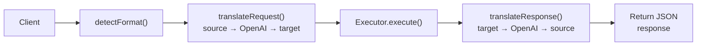

### 旁路流程（Claude CLI）

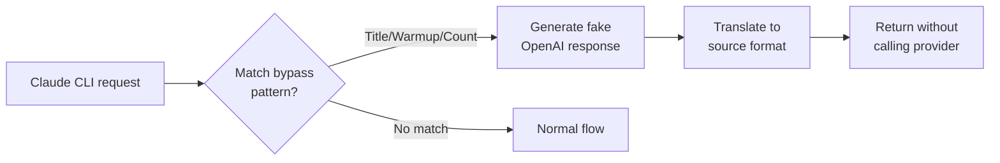
